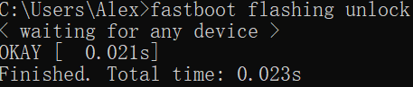
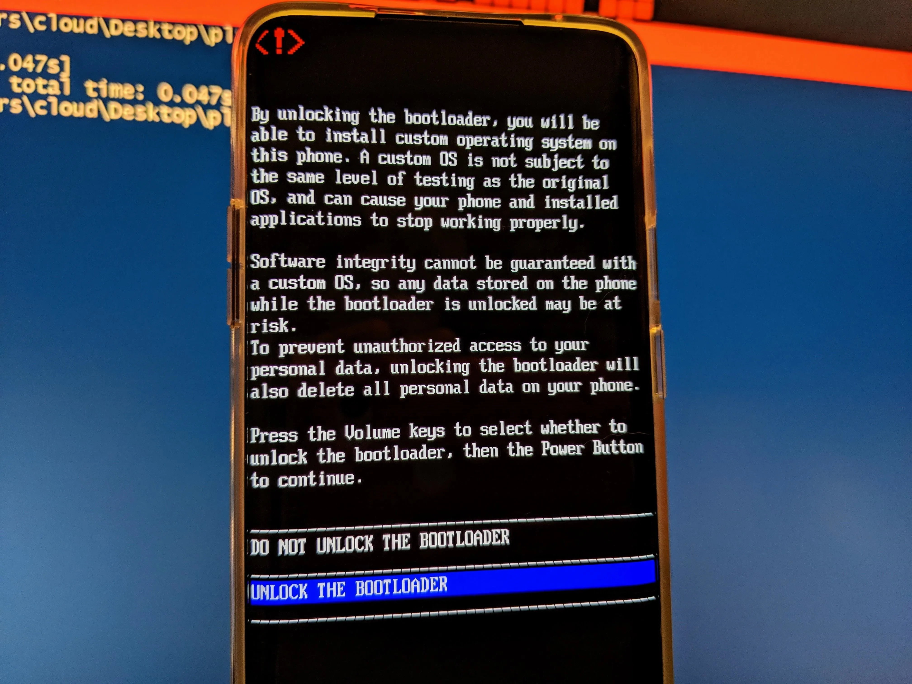
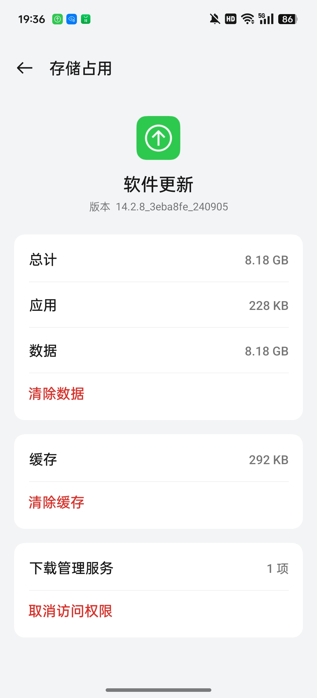
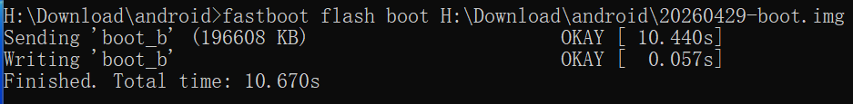
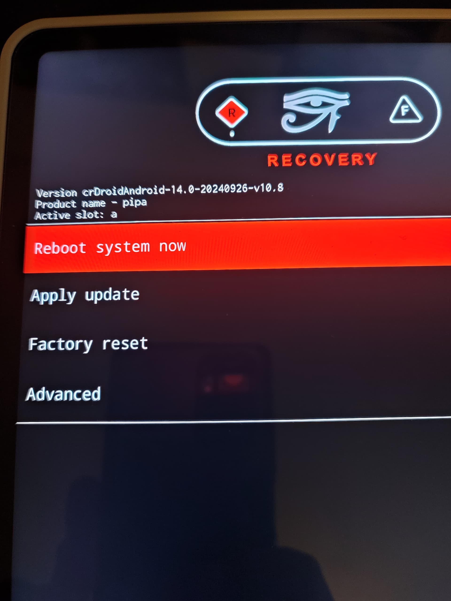
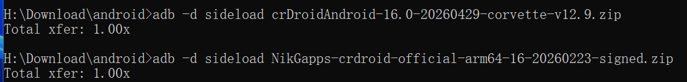
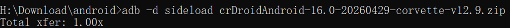

>[!WARNING]
>The following tutorial is only for **OnePlus Ace3Pro** to install crDroid 12 (corvette)
>
>**Irregular gaming, relatives shed tears**
>
>Readers are responsible for any hardware damage caused by improper operation!
<!--more-->
This tutorial refers to the [official crDroid installation guide](https://crdroid.net/corvette/12/install).
## Operation preparation
1. OnePlus Ace3Pro (BL unlocked and ColorOS16 installed) + computer + original data cable
2. Download the following files

- name: crdroid.zip
  type: file
  comment: Download the latest ROM file
- name: recovery/
  type: dir
  children:
    - name: boot.img
      type: file
    - name: dtbo.img
      type: file
    - name: init_boot.img
      type: file
    - name: vbmeta.img
      type: file
    - name: vendor_boot.img
      type: file
    - name: recovery.img
      type: file
- name: nikgapps.zip
  type: file
  comment: Download the latest GApps


The files above, excluding [NikGapps](https://nikgapps.com/crdroid-official), can be downloaded from [SourceForge](https://sourceforge.net/projects/crdroid/files/corvette/12.x/).

After downloading, the directory is as shown below (this article uses the latest version at the time)


- name: 20260429-boot.img
  type: file
- name: 20260429-dtbo.img
  type: file
- name: 20260429-init_boot.img
  type: file
- name: 20260429-recovery.img
  type: file
- name: 20260429-vbmeta.img
  type: file
- name: 20260429-vendor_boot.img
  type: file
- name: crDroidAndroid-16.0-20260429-corvette-v12.9.zip
  type: file
- name: NikGapps-crdroid-official-arm64-16-20260223-signed.zip
  type: file


If the bootloader is not unlocked, you can do the following in CMD:

```
adb reboot bootloader
fastboot flashing unlock
```

Note that unlocking will clear all data.

The successful effect is as follows:



## Installation steps

### Bottom bag (C16)
First check the required base package (theoretically, Android 16, that is, ColorOS16 can be used)

But (firmware) is best to be consistent with the underlying version when crDroid was built.

View the first two lines of the [proprietary-files list](https://github.com/crdroidandroid/android_device_oneplus_corvette/blob/16.0/proprietary-files.txt#L2) on GitHub.

```
## All proprietary files from this list, unless pinned and noted otherwise,
## are from OnePlus Ace 3 Pro (PJX110_16.0.5.701(CN01)).
```

Then download the corresponding version of ColorOS (701)

The [OPlus package archive](https://op-rom.lian86.top/#/brand/OnePlus/model/%E4%B8%80%E5%8A%A0%20Ace%203%20Pro) can resolve links for full system packages from any version.

For ColorOS PJX110_16.0.5.701(CN01), the link is:

https://gauss-compota-c-cn.allawnfs.com/remove-a39fc75063832d557a24f7ab02a02380/g-0e1e77d02e7bdea2328fda27ff230743/component-ota/26/04/14/faba2a6afc834843855599af7be64cf5.zip?sign=a0c55ee3494086f0981d65e678b94665&t=69f71e0a&AWSAccessKeyId=ayjy7KyLVHvDqDax6_KqJgtBeORTJARg9MSGiL66&Expires=1777804562&Signature=1dpWvcI4eyGiQT7obLfw2t91l54%3D

Clear the software upgrade data in application management, then disconnect from the Internet and manually install the full package in system update.




### recovery
```
fastboot flash boot boot.img
fastboot flash dtbo dtbo.img
fastboot flash init_boot init_boot.img
fastboot flash vbmeta vbmeta.img
fastboot flash vendor_boot vendor_boot.img
fastboot flash recovery recovery.img
```


After successfully flashing REC and its underlying layer, enter recovery through bootloader
```
fastboot reboot recovery
```
### crDroid
| Method | Media | Do you need a computer | Typical operations |
|------|------|-------------|----------|
| Cable Flash | USB Data Cable | ✅ Required | fastboot flash/adb sideload |
| Card flash | SD card / local storage | ❌ Not required | Select the local zip package in Recovery to flash |

Here we use sideload line brushing (REC environment).


Use the volume key + power key to select **Factory Reset** > **Format data**

Then return to the main menu and select **Apply update**
```
adb sideload crDroid.zip
```
Here is a brief introduction to the sideload principle:

| Method | Whether to place an order | Process |
|------|---------|------|
| Card swiping (local zip) | ✅ The complete file is already on the device | Read → Verify → Unzip and install |
| adb sideload | ❌ Incomplete download | Streaming + synchronous verification installation |
| fastboot flash | ❌ | Directly write to the corresponding partition, no concept of "installation" |

Halfway through the installation, REC will ask whether to perform additional installation (reboot in recovery again for installing additional packages), please choose according to the actual situation.


{}`adb sideload gapps.zip`

{}
{}Continue installation
{}


Total xfer (Total transfer) is the **total transfer ratio**, which represents the ratio of the actual amount of data transferred to the original packet size. If there is no error, it should be equal to 1. If it is greater than 1, it means that the data is wrong and retransmission has been performed.

Finally, the crDroid installation is complete and you can restart it.

## Conclusion

Today, as manufacturers' ROMs are becoming more and more perfect, the smoothness of ColorOS, the ecology of MIUI (HyperOS), and even the various gimmicks of various "AI systems",
Smartphones have long been polished to perfection—at least on the surface.

So why do we still go to all the trouble to flash a "crude"-looking native ROM?

The answer may be simple: **We don’t care how many unused functions are crammed into the phone, what we care about is who the phone listens to. **

There is no cloud control, no silent push, and no process quietly doing things in the background that you don't know about.
Your device, running the system you choose, just for you.

This sense of control cannot be exchanged for any set of "smart life" or "AI scheduling".

Freedom, privacy, openness—it’s never a feature that comes out of the box, it’s something you swipe in yourself.
