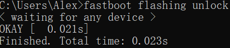
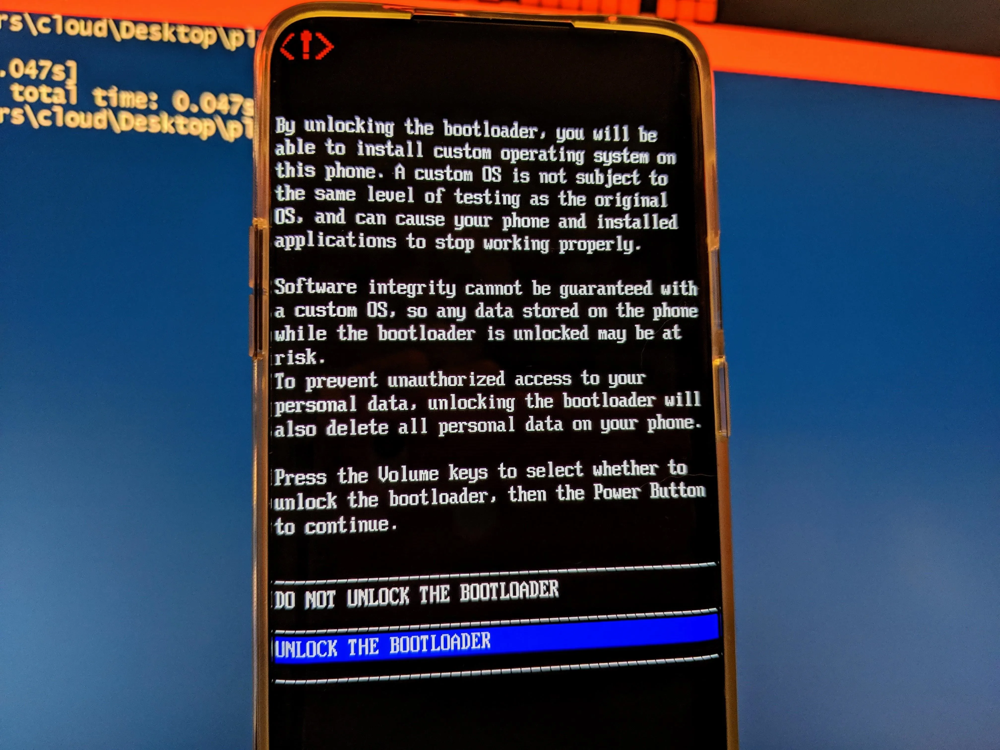
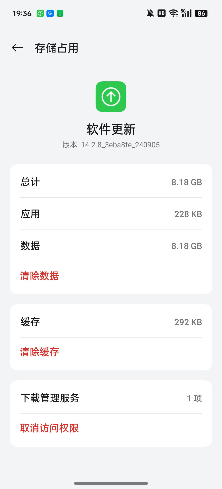
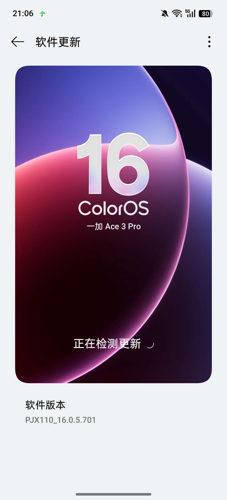
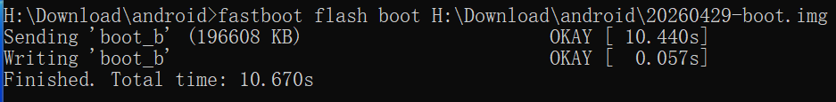
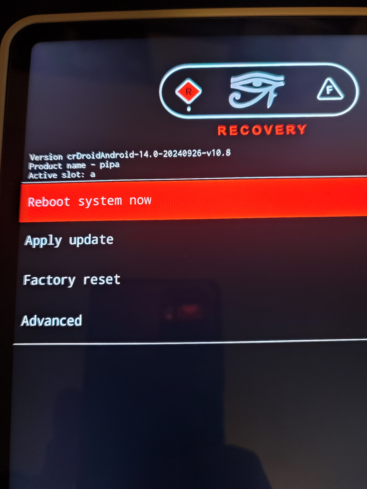
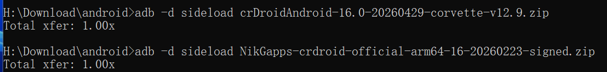
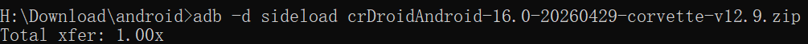

>[!WARNING]
>以下教程仅供**一加Ace3Pro**安装crDroid 12(corvette)使用
>
>**玩机不规范,亲人两行泪**
>
>由操作不当造成的硬件损坏,请读者自负!
<!--more-->
本篇教程参考了[crDroid官网教程](https://crdroid.net/corvette/12/install)
## 操作准备
1. 一加Ace3Pro(已解锁BL且安装ColorOS16)+电脑+原厂数据线
2. 下载以下文件

- name: crdroid.zip
  type: file
  comment: Download the latest ROM file
- name: recovery/
  type: dir
  children:
    - name: boot.img
      type: file
    - name: dtbo.img
      type: file
    - name: init_boot.img
      type: file
    - name: vbmeta.img
      type: file
    - name: vendor_boot.img
      type: file
    - name: recovery.img
      type: file
- name: nikgapps.zip
  type: file
  comment: Download the latest GApps


以上文件(不包含[gapps](https://nikgapps.com/crdroid-official))可以在[sourceforge](https://sourceforge.net/projects/crdroid/files/corvette/12.x/)下载

下载之后目录如下图(本文使用当时的最新版本)


- name: 20260429-boot.img
  type: file
- name: 20260429-dtbo.img
  type: file
- name: 20260429-init_boot.img
  type: file
- name: 20260429-recovery.img
  type: file
- name: 20260429-vbmeta.img
  type: file
- name: 20260429-vendor_boot.img
  type: file
- name: crDroidAndroid-16.0-20260429-corvette-v12.9.zip
  type: file
- name: NikGapps-crdroid-official-arm64-16-20260223-signed.zip
  type: file


如果没有解锁bootloader,可以在CMD里如下操作:

```
adb reboot bootloader
fastboot flashing unlock
```

注意解锁会清除所有数据.

成功效果如图:



## 安装步骤

### 底包(C16)
首先查看所需要的底包(理论上Android 16,即ColorOS16都可以)

但是(firmware)最好和crDroid构建时的底层版本一致.

在GitHub上查看[专有文件列表](https://github.com/crdroidandroid/android_device_oneplus_corvette/blob/16.0/proprietary-files.txt#L2)前两行

```
## All proprietary files from this list, unless pinned and noted otherwise,
## are from OnePlus Ace 3 Pro (PJX110_16.0.5.701(CN01)).
```

遂下载对应版本的ColorOS(701)

在[OPlus 收集站](https://op-rom.lian86.top/#/brand/OnePlus/model/%E4%B8%80%E5%8A%A0%20Ace%203%20Pro)可以解析任意版本的系统全量包链接.

对于ColorOS PJX110_16.0.5.701(CN01),其链接为:

https://gauss-compota-c-cn.allawnfs.com/remove-a39fc75063832d557a24f7ab02a02380/g-0e1e77d02e7bdea2328fda27ff230743/component-ota/26/04/14/faba2a6afc834843855599af7be64cf5.zip?sign=a0c55ee3494086f0981d65e678b94665&t=69f71e0a&AWSAccessKeyId=ayjy7KyLVHvDqDax6_KqJgtBeORTJARg9MSGiL66&Expires=1777804562&Signature=1dpWvcI4eyGiQT7obLfw2t91l54%3D

在应用管理中清除软件升级数据,然后断网即可在系统更新里手动安装全量包.





### recovery
```
fastboot flash boot boot.img
fastboot flash dtbo dtbo.img
fastboot flash init_boot init_boot.img
fastboot flash vbmeta vbmeta.img
fastboot flash vendor_boot vendor_boot.img
fastboot flash recovery recovery.img
```


成功刷入REC及其底层后,由bootloader进入recovery
```
fastboot reboot recovery
```
### crDroid
| 方式 | 介质 | 是否需要电脑 | 典型操作 |
|------|------|-------------|----------|
| 线刷 | USB 数据线 | ✅ 需要 | fastboot flash/adb sideload |
| 卡刷 | SD 卡 / 本地存储 | ❌ 不需要 | 在 Recovery 中选择本地 zip 包刷入 |

这里我们采取sideload线刷(REC环境).


用 音量键+电源键 选择**Factory Reset** > **Format data**

然后回到主菜单,选择**Apply update**
```
adb sideload crDroid.zip
```
这里简单科普一下sideload原理:

| 方式 | 是否落盘 | 流程 |
|------|---------|------|
| 卡刷（本地 zip） | ✅ 完整文件已在设备上 | 读取 → 校验 → 解压安装 |
| adb sideload | ❌ 不完整落盘 | 流式传输 + 同步校验安装 |
| fastboot flash | ❌ | 直接写入对应分区，无"安装"概念 |

安装到一半,REC会询问是否进行额外安装(reboot in recovery again for installing additional packages),请根据实际情况选择.


{}`adb sideload gapps.zip`

{}
{}继续安装
{}


Total xfer(Total transfer)是**总传输倍率**，表示实际传输的数据量与原始包大小的比值,如果没有出错应该等于1,大于1说明数据出错,进行了重传。

最后,crDroid安装完成,重启即可.

## 结语

在厂商 ROM 日趋完善的今天，ColorOS 的流畅、MIUI(HyperOS) 的生态、甚至各家"AI 系统"的种种噱头，
早已将智能手机打磨得无懈可击——至少表面上如此。

那我们为什么还要费尽周折，刷一个看起来"简陋"的类原生 ROM？

答案或许很简单：**我们不在乎手机里塞了多少用不到的功能，我们在乎的是这台手机究竟听谁的。**

没有云控，没有静默推送，没有哪个进程在后台悄悄做着你不知道的事。
你的设备，运行着你选择的系统，只为你服务。

这种掌控感，是任何一套"智慧生活"或"AI 调度"都换不来的。

自由、隐私、开放——从来不是开箱即用的功能，而是你亲手刷进去的。