These are study notes for [Basic Organic Chemistry L9-3: Do You Really Understand Substitution and Elimination Reactions of Alcohols?](https://www.bilibili.com/video/BV1Pq4y1u7kE/?share_source=copy_web&vd_source=8df86ec0f66b0d7c70b7414a1a60bc6a).
<!--more-->
#PartI:Alcohol substitution
## ROH + HX
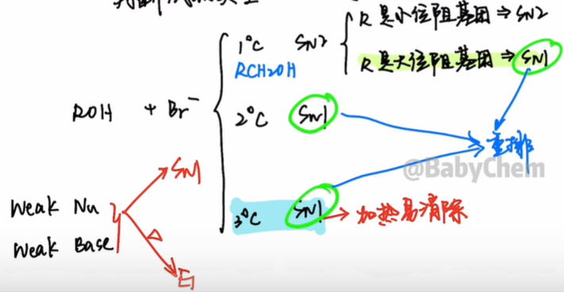
Conclusion:
1. Mechanism: hydroxyl oxonium ion (water is a good leaving group)
2. Small sterically hindered primary alcohol, otherwise $S_{N1}$ will rearrange
3. Alcohol reactivity: allyl type, benzyl type, 3°>2°>1°
4. Hydrohalic acid reactivity: $\ce{HI\gt HBr\gt HCl}$
  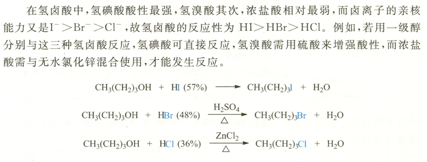
### Neighbor participation effect
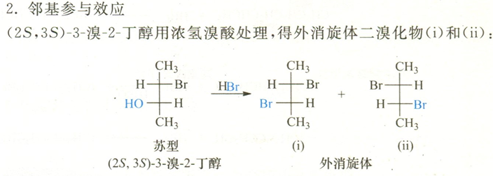

In order to explain the racemic product and the faster reaction rate, in connection with the three pairs of lone pairs of electrons of the Br atom, the neighbor group participation effect was proposed.

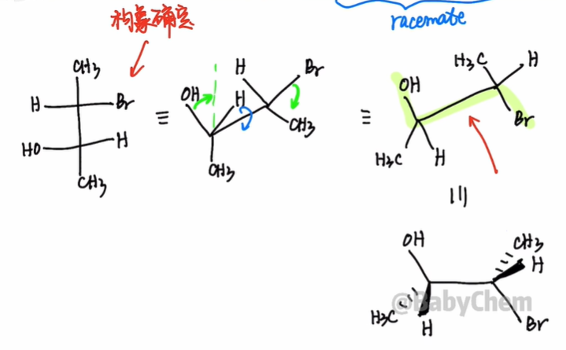

Neighbor group participation requires stereochemistry: trans coplanar

The lone pair of electrons of the bromine atom fills the antibonding orbital of the carbon-oxygen bond, causing the departure of water to form **Bronium ion**.

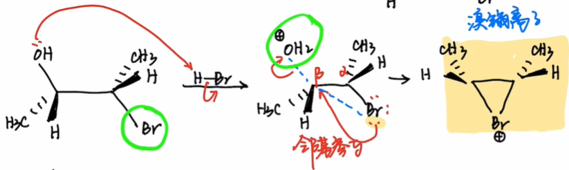

Next, the bromium ion is attacked by $\ce{Br-}$ to open the ring, and attacks from the left and right are possible, so two **racemates** with a chirality ratio of 50:50 are generated.

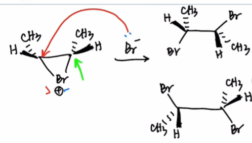
## ROH + PBr3
$$\begin{gathered}
  \ce{3ROH + PX3 -> 3RX + H3PO3}\\
  \ce{ROH + PX5 -> RX + POX3 + HX}
\end{gathered}$$
P is a third period element, so the P atom in $\ce{PBr3}$ has a 3d orbital and can be attacked by the oxygen lone pair of electrons of the hydroxyl group, turning the hydroxyl group into a good leaving group and producing the nucleophile $\ce{Br-}$.

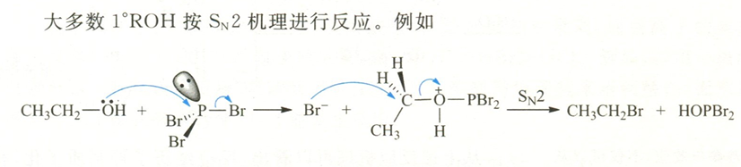
Conclusion:
1. Chlorination: $\ce{PCl3}/\ce{PCl5}$
Bromination: $\ce{PBr3}$ (phosphorus pentabromide is unstable)
Iodination: $\ce{P + I2}$
2. Mainly used for 1°, 2°
3. Low temperature to avoid rearrangement

## ROH + SOCl2
$$\ce{ROH + SOCl2 ->[\triangle] SO2 ^ + HCl ^ + RCl}$$

Reaction advantages: directly obtain alkyl chloride, mild conditions, fast rate, high yield, and the product is easy to purify.

The configuration of the alcohol is maintained before and after the reaction, and chlorosulfite can be separated at low temperature and decomposed into alkyl chloride and $\ce{SO2}$ upon heating, which indicates that the reaction mechanism is:

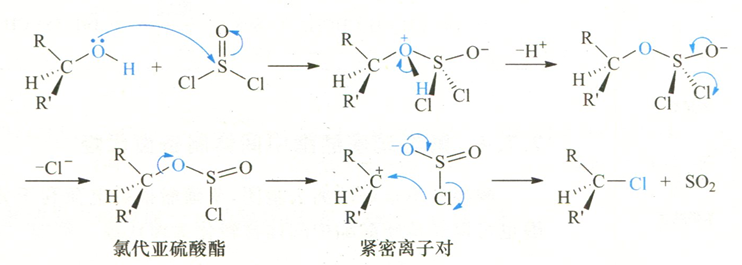

During the reaction, chlorosulfite is first generated, and then decomposes into a tight ion pair. $\ce{Cl-}$ attacks the carbocation as part of the leaving group (LG), that is, "returns internally" to obtain the product chloroalkane with maintained configuration. Since the substitution seems to be carried out within the molecule, it is called intramolecular nucleophilic substitution, represented by $S_Ni$.

If the weak nucleophile pyridine is added to a mixture of alcohol and thionyl chloride, a product with a configuration flip is obtained.

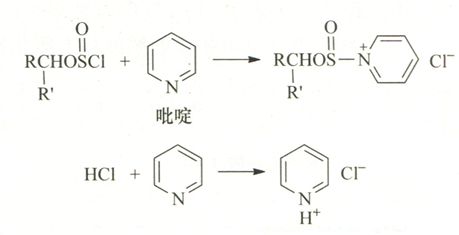

The generated $\ce{Cl-}$ is used as a nucleophile to attack chlorosulfite from the back side of the carbon-oxygen bond to obtain a configuration-inverted product ($S_N2$)

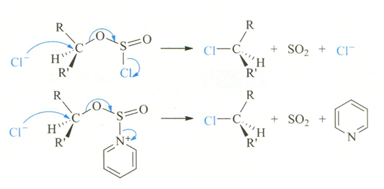

> The reaction of tertiary amines (\(R_3N\)) and HCl is also conducive to the formation of chloride ions, so tertiary amines, like pyridine, can catalyze this reaction:
> \[R_3N + HCl \rightarrow R_3NH^+ + Cl^-\]

## ROH + TsCl
Ts=Tosyl=p-toluenesulfonic acid group

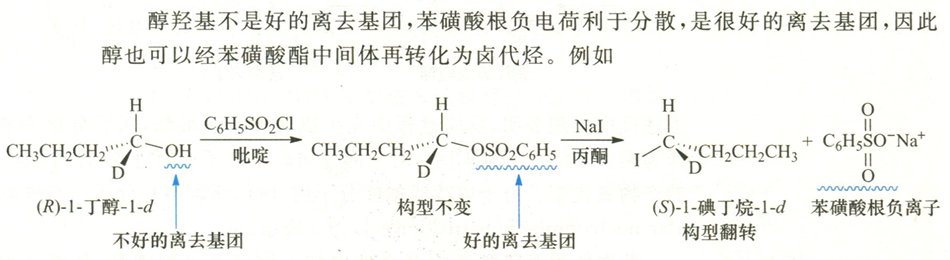

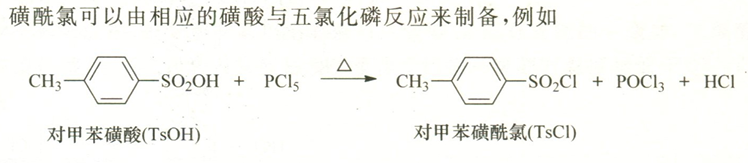

Since then, 4 methods for converting alcohols into halogenated hydrocarbons have been completed.

#PartII:Elimination of alcohol
1. Protonation of hydroxyl group
2. Formation of carbocation
3. *Possible rearrangement
4. Elimination into olefins $\begin{cases}
\text{Stereoselectivity}\begin{cases}Z,\\E\end{cases}\\
\text{Regional selectivity}\begin{cases}Zaitsev,\\Hoffmann\end{cases}
\end{cases} $

In industry, commonly used alcohols are dehydrated on the surface of alumina or silicate at 350~400°C. This reaction does not cause rearrangement**.

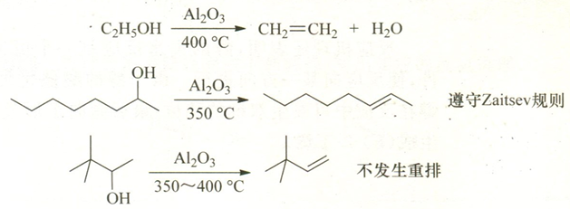

## Ring expansion rearrangement
Generally speaking, for carbocations, six-membered rings have less tension and are more stable than five-membered rings.

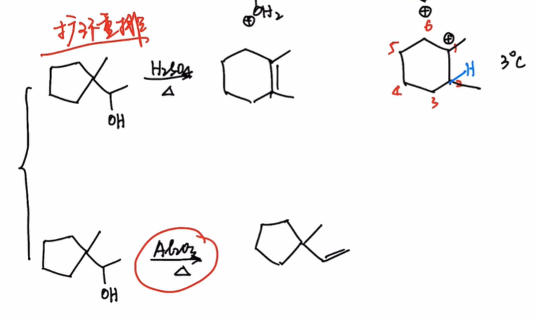

## Practice
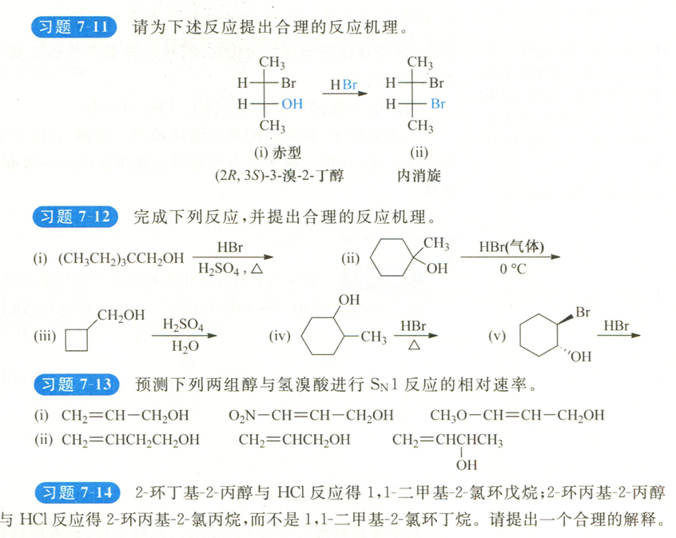
