本文是[【基础有机化学 L9-3 补充你的知识盲区，你真的理解醇的取代和消除反应吗？】](https://www.bilibili.com/video/BV1Pq4y1u7kE/?share_source=copy_web&vd_source=8df86ec0f66b0d7c70b7414a1a60bc6a)的学习笔记
<!--more-->
# PartI:醇的取代
## ROH + HX
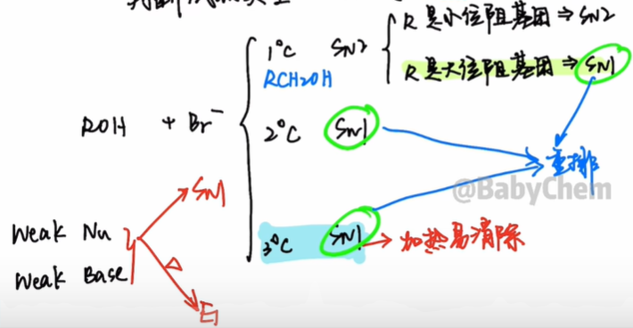
结论:
1. 机理:羟基变氧鎓离子(水是好的离去基团)
2. 小位阻一级醇,否则$S_{N1}$会重排
3. 醇反应性:烯丙型,苯甲型,3°>2°>1°
4. 氢卤酸反应性:$\ce{HI\gt HBr\gt HCl}$
  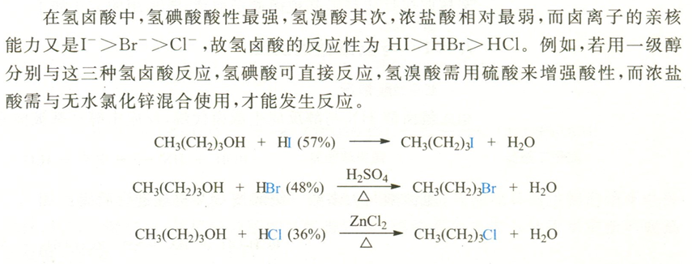
### 邻基参与效应
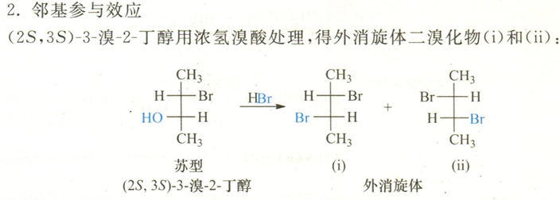

为了解释外消旋体产物和更快的反应速率,联系Br原子的三对孤对电子,人们提出了邻基参与效应.

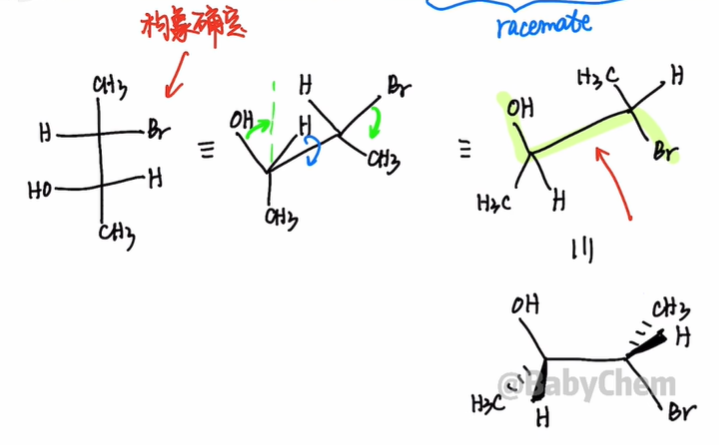

邻基参与对立体化学的要求:反式共平面

溴原子的孤对电子,填入碳氧键的反键轨道,引发水的离去,形成**溴鎓离子**.

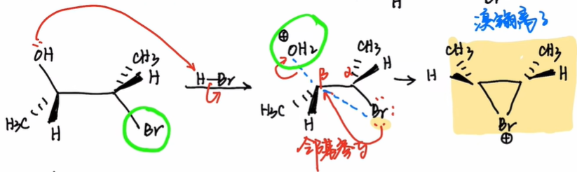

接下来,溴鎓离子受到$\ce{Br-}$的进攻开环,且左右的进攻等可能,故生成两种手性比50:50的**外消旋体(racemate)**.

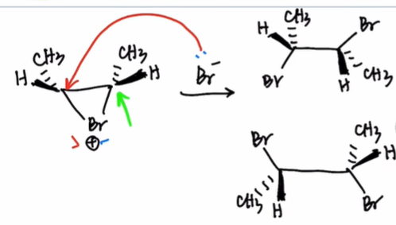
## ROH + PBr3
$$\begin{gathered}
  \ce{3ROH + PX3 -> 3RX + H3PO3}\\
  \ce{ROH + PX5 -> RX + POX3 + HX}
\end{gathered}$$
P是第三周期元素,故$\ce{PBr3}$中P原子有3d轨道,可以被羟基的氧孤对电子进攻,让羟基变成好的离去基团,并且产生亲核试剂$\ce{Br-}$.

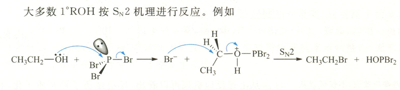
结论:
1. 氯化:$\ce{PCl3}/\ce{PCl5}$
 溴化:$\ce{PBr3}$(五溴化磷不稳定)
 碘化:$\ce{P + I2}$
2. 主要用于1°,2°
3. 低温避免重排

## ROH + SOCl2
$$\ce{ROH + SOCl2 ->[\triangle] SO2 ^ + HCl ^ + RCl}$$

反应优点:直接得到氯代烷,条件温和,速率快,产率高,产物易于提纯.

反应前后醇的构型保持,并且低温下可以分离出氯代亚硫酸酯,经加热分解为氯代烷和$\ce{SO2}$,这表明反应机理是:

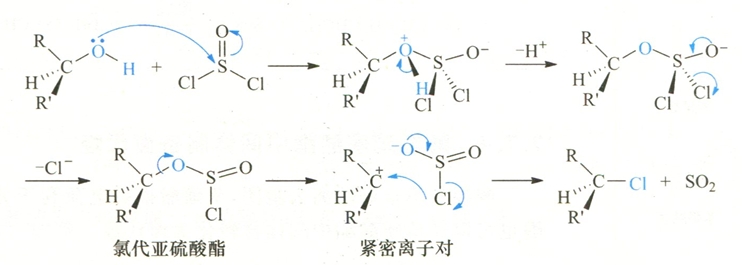

反应过程中先生成氯代亚硫酸酯,然后分解为紧密离子对,$\ce{Cl-}$作为离去基团(LG)中的一部分向碳正离子进攻,即"内返",得到构型保持的产物氯代烷. 由于取代犹如在分子内进行,所以叫它分子内亲核取代(intramolecular  nucleophilic substitution),以$S_Ni$表示.

如果在醇和亚硫酰氯的混合液中加入弱亲核试剂吡啶,则得到构型翻转的产物.

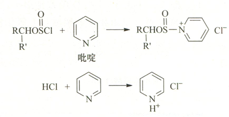

生成的$\ce{Cl-}$作亲核试剂从碳氧键的背面,进攻氯代亚硫酸酯,得到构型翻转的产物($S_N2$)

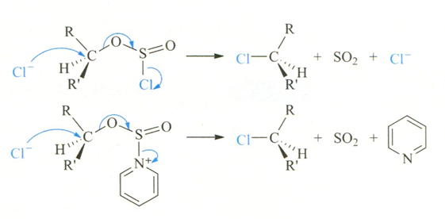

> 三级胺（\(R_3N\)）和 HCl 反应也有利于氯离子的形成，因此三级胺和吡啶一样，可对此反应起催化作用：
> \[R_3N + HCl \rightarrow R_3NH^+ + Cl^-\]

## ROH + TsCl
Ts=Tosyl=对甲苯磺酸基

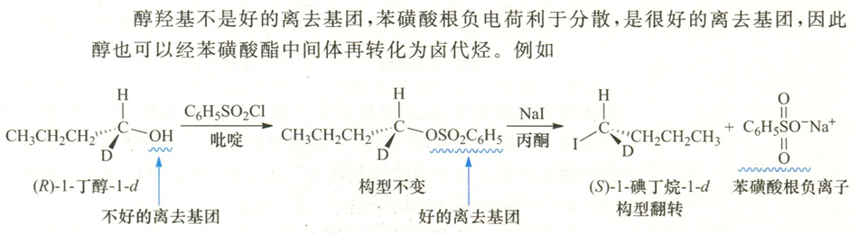

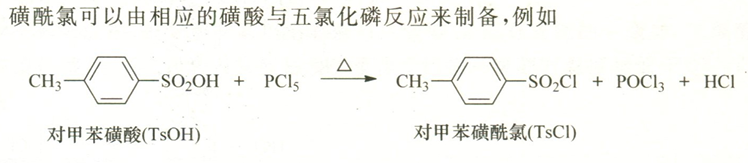

自此,将醇转化为卤代烃的4种方法完结.

# PartII:醇的消除
1. 羟基的质子化
2. 形成碳正离子
3. *可能重排
4. 消除成烯烃$\begin{cases}
  \text{立体选择性}\begin{cases}Z,\\E\end{cases}\\
  \text{区域选择性}\begin{cases}Zaitsev,\\Hoffmann\end{cases}
\end{cases}$

在工业上,常用醇在350~400℃在氧化铝或硅酸盐表面脱水,此反应**不发生重排**.

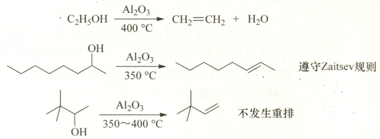

## 扩环重排
一般来说,对于碳正离子,六元环比五元环环张力更小,更稳定.

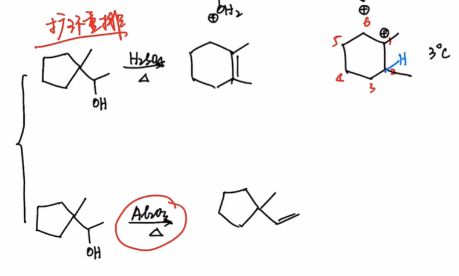

## Practice
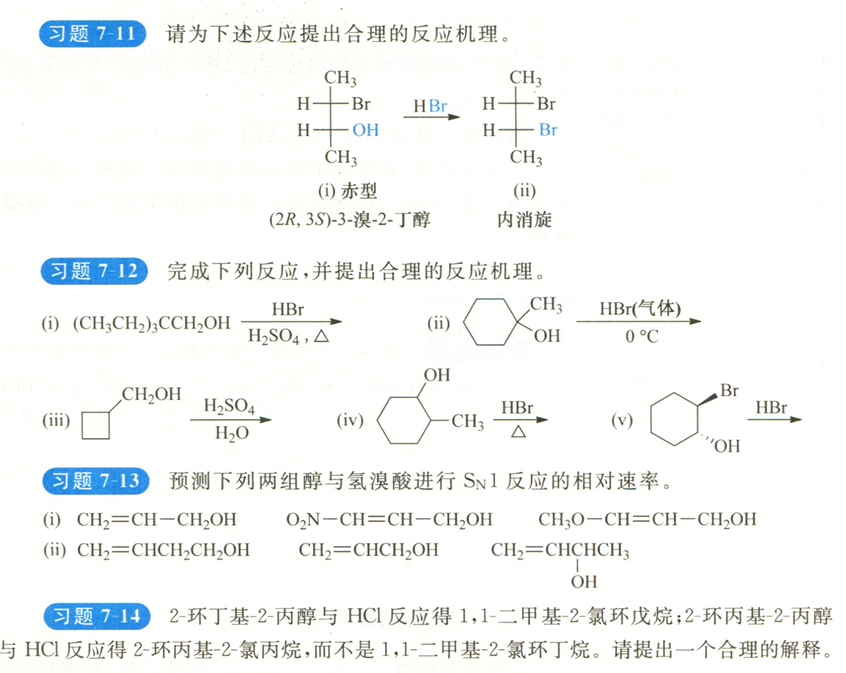
