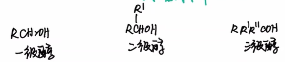
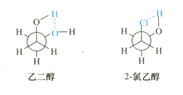
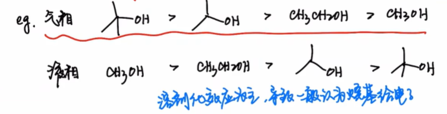
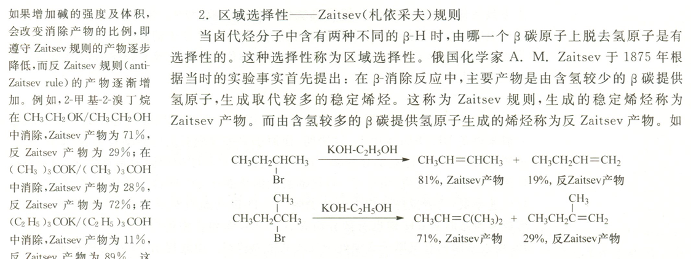
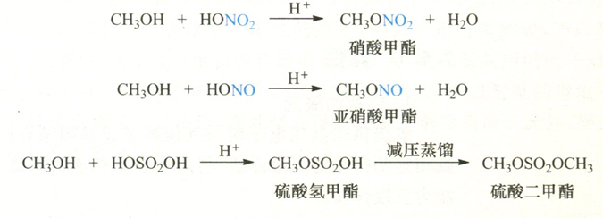
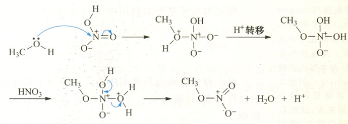
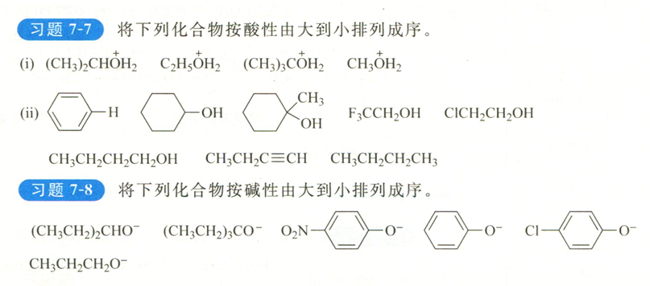

These are study notes for [Basic Organic Chemistry L9-2: Properties, Acid–Base Behavior, and Nucleophilicity of Alcohols](https://www.bilibili.com/video/BV1D3411q7gW/?share_source=copy_web&vd_source=8df86ec0f66b0d7c70b7414a1a60bc6a).
<!--more-->
#PartI:Structure of alcohol
According to the octet rule, the structure of alcohol is $R-O-H$, in which there are two lone pairs of electrons on the O atom.

Affected by **electronic effect** and **steric hindrance effect**, the hybridization mode of alcohol hydroxyl oxygen can be $sp^3/sp^2$
### Phenol
In phenol, the O atom adopts $sp^2$ hybridization, so that the lone pair of electrons of O can form conjugation with the benzene ring, causing electron delocalization and a decrease in system energy.

### Phenol negative ion
In the enol anion, the hydroxyl oxygen also adopts $sp^2$ hybridization due to $p-\pi$ conjugation.

### Alkynyl alcohol-enone

According to the $\alpha-C$ classification, alcohols can be divided into primary/secondary/tertiary alcohols.

## Physical properties
1. Lower alcohols are easily soluble, intermediate alcohols are partially soluble, and higher alcohols are insoluble.
2. With the same number of carbon atoms, branched chain alcohols have lower boiling points.
3. The melting and boiling points of lower alcohols are higher than those of hydrocarbons with the same carbon number.

## Stereochemistry
For ethylene glycol and 2-chloroethanol, since the ortho-cross conformation can form intramolecular hydrogen bonds and reduce the conformational energy, they mainly exist in the ** ortho-cross conformation**

# PartII: Acidity and alkalinity of alcohol
## Acidic
The more stable the conjugate base, the stronger the acidity.

According to the acid-base order of the alcohol molecule, the electronic effect of the group can be known.
- In the liquid phase, the alkyl group exhibits an electron-donating effect, which is not conducive to the charge dispersion of alkoxy anions. This is because the alkyl group has large air resistance, which is not conducive to the solvation of alkoxy anions.
- In the gas phase, the alkyl group exhibits an electron-withdrawing effect.

\

Since most organic reactions occur in the liquid phase, it is generally believed that **alkyl groups are electron-donating groups**.

$$\boxed{\text{alcohol + reactive metal (K, Na, Mg, Al)}\rightarrow\text{alkoxide}+\ce{H2 ^}}$$

### Common alkoxides and their uses
-$\ce{EtONa}$: As a small sterically hindered strong base, as a strong nucleophile
-$\ce{BuOK}$: As a large sterically hindered strong base, as a weak nucleophile

When carrying out β-elimination reaction of halogenated hydrocarbons, strong bases with large steric hindrance give **anti-Zaitsev product**, and weak bases with small steric hindrance give **Zaitsev product**

> This is because when the volume and strength of the base increase, β-H with larger steric hindrance is less susceptible to attack, while β-H with smaller steric hindrance and strong acidity is more susceptible to reaction.

Aluminum isopropoxide can serve as a catalyst for redox reactions.

## Basic/Nucleophilic
If the lone pair of electrons on the oxygen atom of the alcoholic hydroxyl group is combined with $\ce{H+}$, it will show **alkalinity**. If it is combined with the electrophile $\ce{E^+}$, it will show **nucleophilicity**

Also due to the unfavorable reasons for liquid phase solvation, the steric hindrance of the alkyl group will enhance the acidity of the conjugate acid of the alcohol, which means weakening the alkalinity of the alcohol.

Alcohols can react with oxo inorganic acids, losing a molecule of water and forming inorganic acid esters.

Take the reaction between alcohol and nitric acid as an example: the reaction follows the **addition-elimination mechanism**

## Comprehensive judgment

7-7

(i)2,3,1,4

(ii)7,4,5,1,2,3,6,8

7-8 2,1,6,4,5,3
