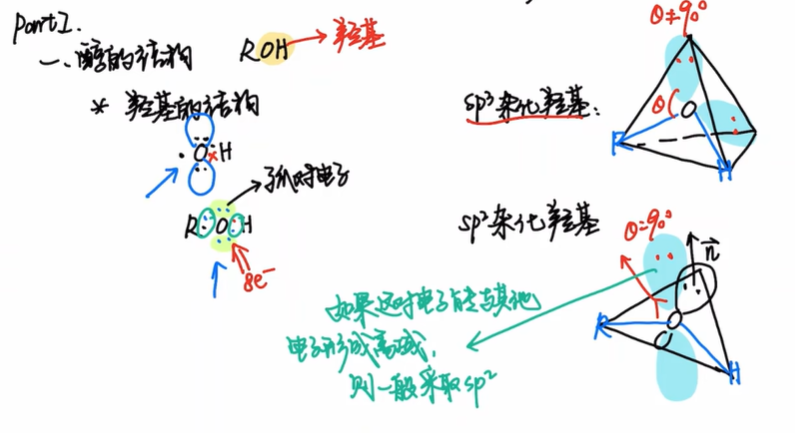
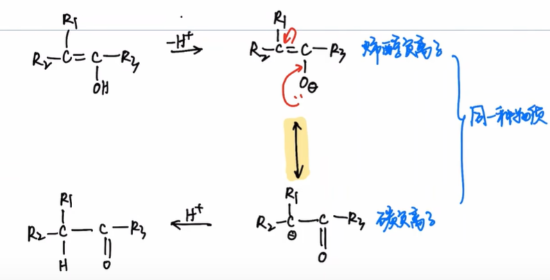
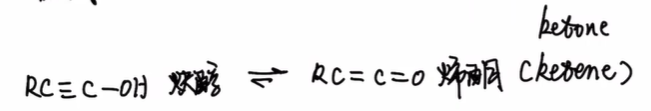
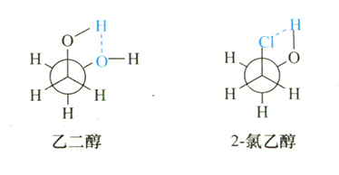
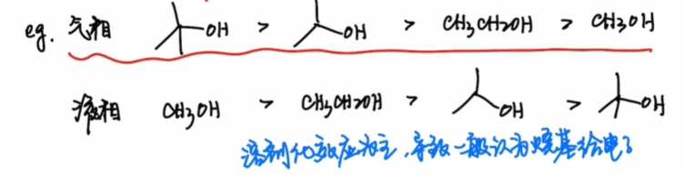
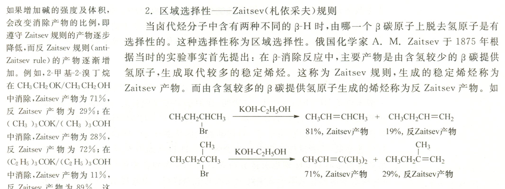
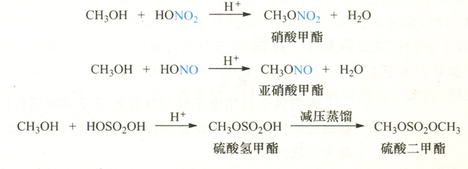
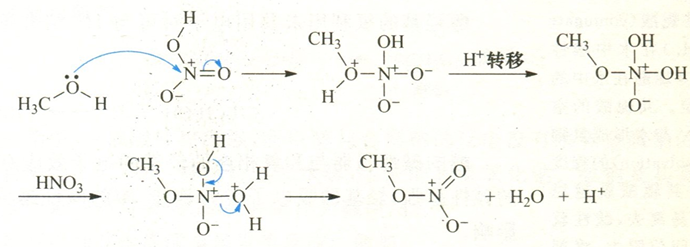
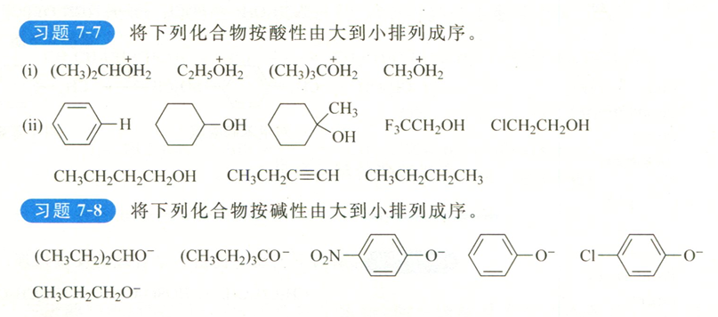

本文是[【基础有机化学 L9-2 醇的基本性质，醇的酸碱性和亲核性，醇与无机酸的反应】](https://www.bilibili.com/video/BV1D3411q7gW/?share_source=copy_web&vd_source=8df86ec0f66b0d7c70b7414a1a60bc6a) 的笔记
<!--more-->
# PartI:醇的结构
根据八隅体规则,醇的结构为$R-O-H$,其中O原子上有两对孤对电子.

受**电子效应**和**空间位阻效应**的影响,醇羟基氧的杂化方式可以为$sp^3/sp^2$
### 苯酚
在苯酚中,O原子采取$sp^2$杂化,这样O的孤对电子可以与苯环形成共轭,造成电子离域,体系能量下降.

### 苯酚负离子
在烯醇负离子中,羟基氧同样因为$p-\pi$共轭而采取$sp^2$杂化.

### 炔醇-烯酮

根据$\alpha-C$分类,醇可以分为一/二/三级醇.

## 物理性质
1. 低级醇易溶,中级醇部分溶,高级醇不溶
2. 同碳数,叉链醇的沸点低
3. 低级醇的熔沸点比同碳数的烃更高

## 立体化学
对于乙二醇和2-氯乙醇,由于邻交叉式构象可以形成分子内氢键,降低构象能量,故主要以**邻交叉式构象**存在

# PartII:醇的酸碱性
## 酸性
共轭碱越稳定,酸性越强.

根据醇分子的酸碱性顺序,可以得知基团的电子效应.
- 在液相中,烷基体现为给电子效应,不利于烷氧基负离子电荷分散. 这是由于烷基空阻大,影不利于烷氧基负离子的溶剂化.
- 在气相中,烷基体现为吸电子效应.

\

由于有机反应大多在液相中进行,所以一般认为**烷基是给电子基团**.

$$\boxed{\text{醇+活泼金属(K,Na,Mg,Al)}\rightarrow\text{醇盐}+\ce{H2 ^}}$$

### 常见醇盐及其用途
- $\ce{EtONa}$:作为小位阻强碱,作为强亲核试剂
- $\ce{BuOK}$:作为大位阻强碱,作为弱亲核试剂

进行卤代烃的β-消除反应时,大位阻强碱给出**反Zaitsev产物**,小位阻较弱碱给出**Zaitsev产物**

> 这是因为碱的体积和强度增大后，空间位阻较大的 β-H 不易受到进攻，而空阻小、酸性强的 β-H 更易反应。

异丙醇铝可以作为氧化还原反应的催化剂.

## 碱性/亲核性
醇羟基的氧原子上的孤对电子如果结合$\ce{H+}$,则体现**碱性**.如果结合亲电试剂$\ce{E^+}$,则体现**亲核性**

同样由于**液相溶剂化不利**的原因,烷基的空阻会增强醇的共轭酸的酸性,也就是减弱醇的碱性.

醇可以与含氧无机酸(oxo inorganic acid)反应,失去一分子水,生成无机酸酯.

以醇和硝酸反应为例:反应遵循**加成-消去机理**

## 综合判断

7-7

(i)2,3,1,4

(ii)7,4,5,1,2,3,6,8

7-8 2,1,6,4,5,3