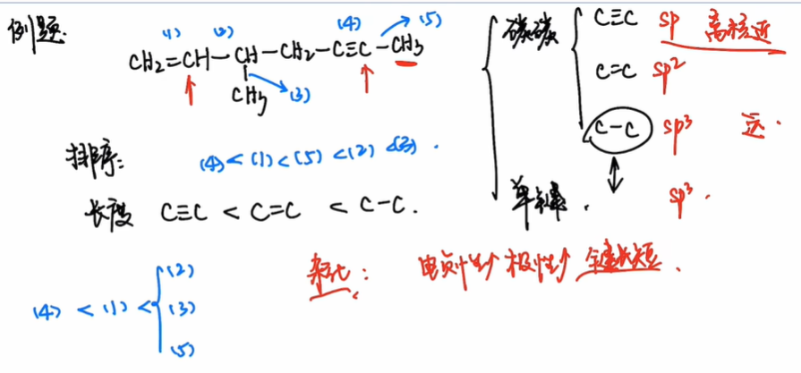
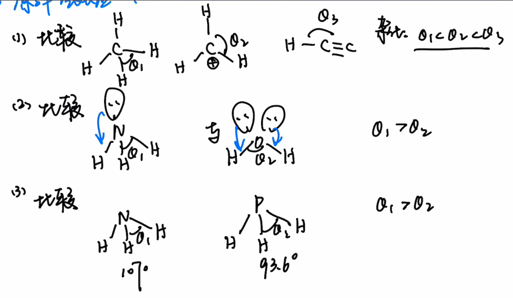
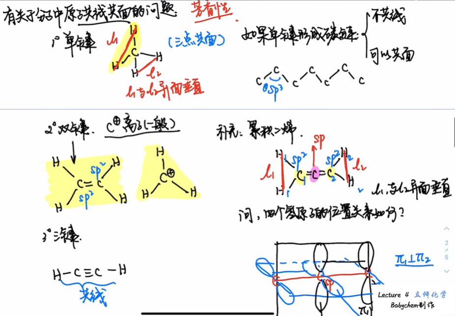

# Introduction
How to "identify" a molecule?

Is it enough to use the molecular formula $\ce{C3H6OCl2}$? Obviously not, one molecular formula can correspond to several isomers.

The same molecular formula can produce different isomers through different bonding methods.

With the same bonding method, different isomers can be obtained through different ordering of groups.

With the same order, different isomers can be obtained through single bond rotation.

Summary:
- Different atoms ** make up ** molecules and determine the unique molecular formula
- Same molecular formula, different **structure**
- Same structure, different **configuration**
- Same configuration, different **conformations**
- Scale: composition>structure>configuration>conformation
The levels studied in stereochemistry are **configuration** and **conformation**

# Preparation: key parameters
Bond parameters studied in stereochemistry:
- bond length
- bond angle

## Key length

Conclusion
1. The greater the electronegativity, the greater the polarity of the bond and the shorter the bond length.
2. Corresponding bond lengths for different hybridizations: $sp\lt sp^2\lt sp^3$
3. Atomic radius is positively related to bond length

## bond angle

Compare priorities:
1. Central atom hybridization
2. Lone pair electrons
3. Central atom electronegativity

### Questions about the collinearity and coplanarity of atoms in molecules

