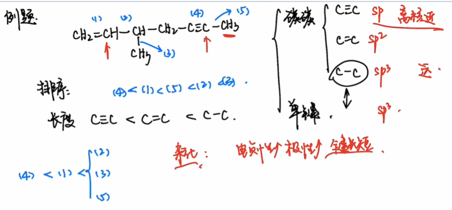
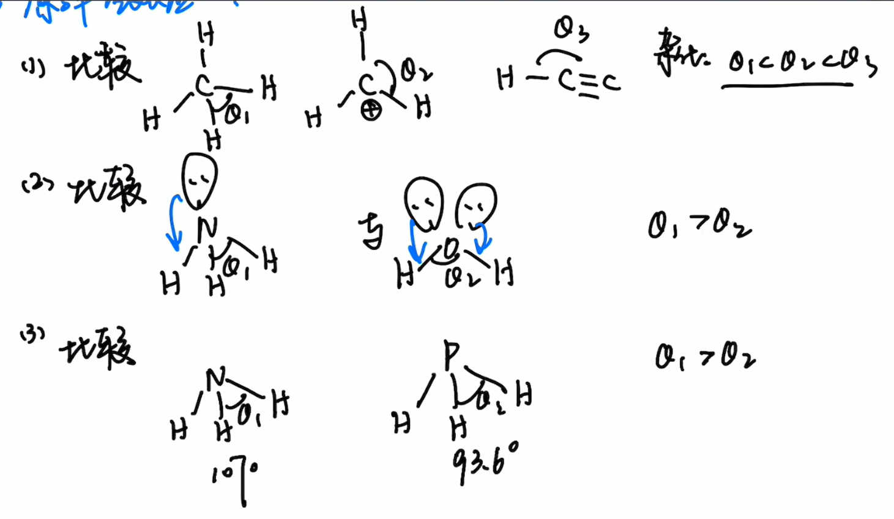
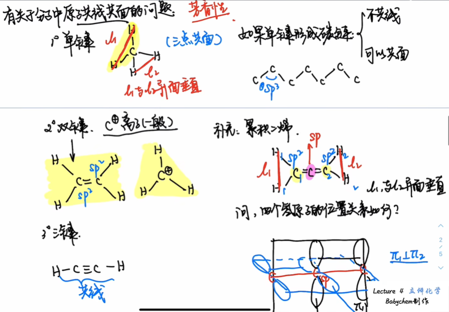

# 引言
怎样"确定"一个分子?

通过分子式$\ce{C3H6OCl2}$足矣吗?显然不,一个分子式可以对应若干种同分异构体.

相同分子式,可以通过不同键联方式得到不同异构体

相同键联方式,可以通过基团不同的排序得到不同异构体

相同排序,可以通过单键旋转得到不同异构体.

小结:
- 不同原子**构成**分子,确定唯一的分子式
- 相同的分子式,有不同的**构造**
- 相同的构造,有不同的**构型**
- 相同的构型,有不同的**构象**
- 尺度:构成>构造>构型>构象
立体化学所研究的层级,是**构型**与**构象**

# 预备:键参数
立体化学所研究的键参数:
- 键长
- 键角

## 键长

结论
1. 电负性越大,键的极性越大,键长越短
2. 不同杂化对应键长:$sp\lt sp^2\lt sp^3$
3. 原子半径与键长正相关

## 键角

比较优先级:
1. 中心原子杂化
2. 孤对电子
3. 中心原子电负性

### 有关于分子中原子共线共面的问题

