In the 2026 High School Chemistry Olympiad Beijing Regional Qualifiers, there are no difficult element inferences. It is all about the application of **Basic Chemistry Theory** and **Thermodynamic Calculation**.
<!--more-->

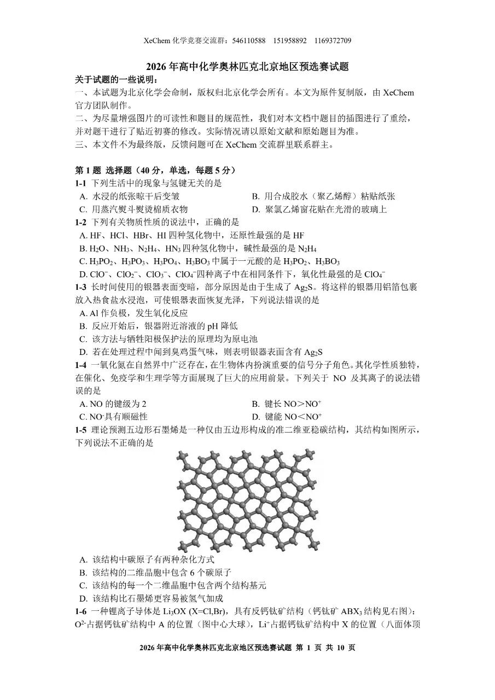

Answers to the first five questions: DCBAC

1-1 Simple questions, no explanation.

1-2: Simple element properties

A: The reducing order is opposite to the non-metallic order of anionic elements:

$\ce{HI\gt HBr\gt HCl\gt HF}$

B: Determine the basic order by the ability to coordinate with $\ce{H+}$:

Nitrogen has low electronegativity, and $\ce{NH3}$ is undoubtedly the most alkaline.

Due to the electron-withdrawing induction effect of $\ce{-NH2}$, $\ce{N2H4}$ is weaker than $\ce{NH3}$, but stronger than $\ce{H2O}$.

The anion $\ce{N3-}$ formed after ionization of $\ce{HN3}$ has two delocalized bonds of $\Pi_3^4$, so $\ce{HN3}$ is acidic and the weakest alkaline

C is extremely correct, D has the strongest oxidizing property $\ce{ClO-}$ (low symmetry, small bond energy)

1-3 Simple electrochemistry, no explanation.

1-4: Electronic configuration of $\ce{NO}$ molecule:

$KK(\sigma_{2s})^2(\sigma_{2s}^*)^2(\pi_{2p_y})^2(\pi_{2p_z})^2(\sigma_{2p_x})^2(\pi_{2p_y}^*)^1$

Review the basic content of molecular orbitals:

>KK means that there are two pairs of electrons in the 1s orbitals of the K layers of the two atoms. The ones that overlap each other are mainly the outer orbits of the atoms, so the 1s electrons in the inner layers of the atoms basically maintain their state in the atomic orbitals.

Elements such as B, C, and N will have **sp hybrid** due to the small energy gap between 2s and 2p orbitals, making $E(\pi_{2p})\lt E(\sigma_{2p})$ (but note that the energy order of π antibonding orbitals and σ antibonding orbitals does not change)

What does this do:
1. Explain the **paramagnetism** of $\ce{B2}$
2. What is the influencing molecule **HOMO**?
3. Explain that $\ce{C2}$ has two π bonds and no σ bonds

A: $\ce{NO}$ key level is 2.5

| Key level |$\ce{NO}$|$\ce{NO+}$|$\ce{NO-}$|
| --- | --- | --- | --- |
| | 2.5 | 3 | 2 |

The order of bond lengths is opposite to that of bond levels, and the order of bond energies is the same as that of bond levels.

B is correct, D is correct.

$\ce{NO-}$ Molecular electronic configuration:

$KK(\sigma_{2s})^2(\sigma_{2s}^*)^2(\pi_{2p_y})^2(\pi_{2p_z})^2(\sigma_{2p_x})^2(\pi_{2p_y}^*)^1(\pi_{2p_z}^*)^1$

There is a single electron in the molecule, so it is paramagnetic (same reason $\ce{O2}$ also has paramagnetism), C is correct. Based on the above, choose A

1-5 1-6 crystal questions are still in jail, skip it directly

6-8 answers DCB

1-7 Simple aqueous solution calculations, using distribution fractions

$$
\begin{gathered}
  3\delta(\ce{PO4^3-})+2\delta(\ce{HPO4^2-})+\delta(\ce{H2PO4-})\\
=\frac{3K_{a1}K_{a2}K_{a3}+2K_{a1}K_{a2}[\ce{H+}]+K_{a1}[\ce{H+}]^2}{K_{a1}K_{a2}K_{a3}+K_{a1}K_{a2}[\ce{H+}]+K_{a1}[\ce{H+}]^2}\\
=2
\end{gathered}
$$
Knock on Casio and get $\ce{[H+]}=1.73\times10^{-10},pH=9.76$

Or because $\delta(\ce{H2PO4-})=\delta(\ce{PO4^3-})$, $\ce{[H+]}=\sqrt{K_{a2}K_{a3}}=1.73\times10^{-10}$ can also be used

1-8:

A: The $\ce{N-H}$ bond in the amide group is significantly more acidic than the $\ce{\alpha-C-H}$ bond, so under the action of Lewis base, the hydrogen ions in $\ce{N-H}$ will be preferentially dissociated, and then **hydrogen-deuterium exchange** will occur in the **deuterated reagent** environment.

B: Observing the reaction under the action of DBU, it was found that **hydrogen-deuterium exchange** occurred first in the $\ce{\alpha-H}$ of the amide, while the ester group $\ce{\alpha-H}$ did not change. This seems to be the opposite order of the acidity of $\ce{\alpha-H}$?

>The highly active Lewis acid is dissociated from TIPSOTf during the reaction. The key step of the reaction is to activate the carbonyl group $\ce{\alpha-H}$ after coordination with the carbonyl group. Using deuterated acetonitrile as the deuterium source, the $\ce{\alpha}$-deuterated amide and ester are realized through hydrogen ion exchange promoted by Lewis base.

The problem lies here. Since **carbonyl oxygen is basic**: amide > ester (why? Judged by the resonance formula), the carbonyl oxygen of the amide is more likely to coordinate with the Lewis base, thereby forming **oxonium ions**, which greatly enhances the acidity of $\ce{\alpha-H}$, leading to deuteration, not because $\ce{\alpha-H}$ is highly acidic. B error

What is the Lewis acid-base adduct? According to my understanding, it is the combination of Lewis acid and Lewis base, which coordinates the attack on the substrate. One coordinates the amide carbonyl oxygen, and the other pulls out $\ce{\alpha-H}$, which promotes the deuteration of the amide $\ce{\alpha-H}$ under the catalysis (otherwise, under normal circumstances, it is the ester group $\ce{\alpha-H}$ deuteration). C is correct.

D. The proton source is too acidic and may directly protonate the Lewis base used, so D is correct.

2-1 simple questions

2-2-1 $\ce{Fe^3+}$ is completely precipitated. At the same time, $\ce{Mn^2+}$ cannot be oxidized by oxygen, and $\ce{Pb^2+,Mn^2+}$ cannot be allowed to precipitate, so adjust the pH to 3.2-5.5

2-2-2 Add water to dissolve, filter, **Add hydrochloric acid to acidify to pH less than 5.5**

2-3 Lead cannot be removed by precipitating Pb (otherwise, when $\ce{Pb^2+}$ is completely precipitated, $\ce{Mn^2+}$ has begun to precipitate), because Mn has stronger metal activity than Fe, so **add Mn** to reduce $\ce{Pb^2+}$.

3 Simple calculations of thermodynamics and kinetics, skip

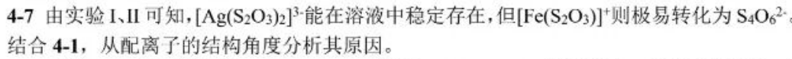

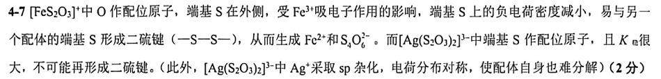

4-7 It should be explained from two perspectives: **dynamics** (remember to connect the previous questions about **coordinated atoms**) and **thermodynamics**

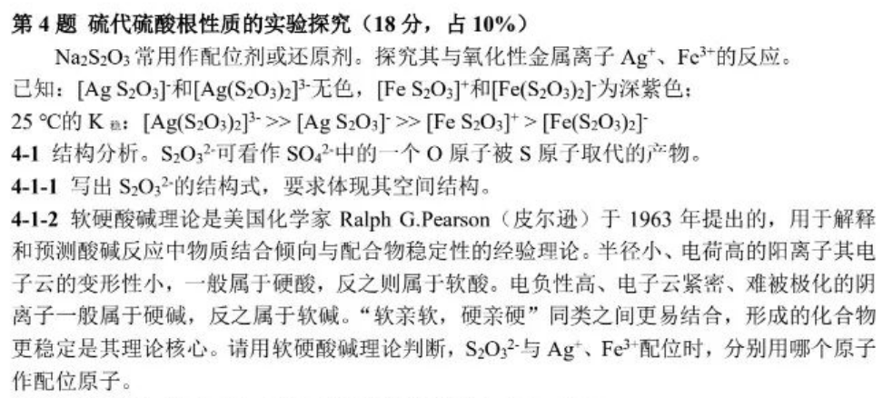

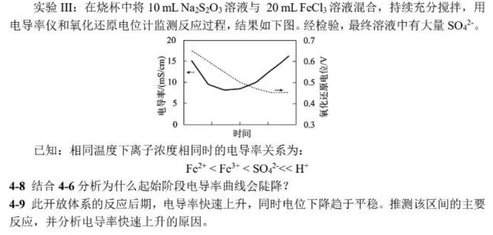

4-8 **Analyze the main contradiction** (Don’t just write $c(\ce{Fe^3+})$ decline, consider the shift in hydrolysis equilibrium)

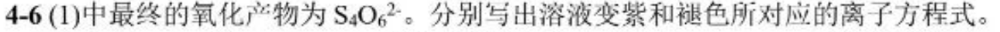

1. $\ce{Fe^3+ + S2O3^2- = [FeS2O3]+}$ reduces ion concentration
2. At the same time, the hydrolysis equilibrium of $\ce{Fe^3+}$ shifts backward and $c(\ce{H+})$ also decreases.
   
4-9 Through the redox potential of the solution, we know that $\frac{\ce{c(Fe^3+)}}{\ce{c(Fe^2+)}}$ is basically unchanged (why? The redox potential of 0.4-0.5 can only be generated by $\ce{Fe^3+}$)

In the later stage, the reaction that occurred in the solution was obviously a **oxidation-reduction reaction** (possible coordination reactions had already occurred at the beginning, and sulfate was finally generated). Considering the **open system**, it can only be said that oxygen is used as the oxidant.

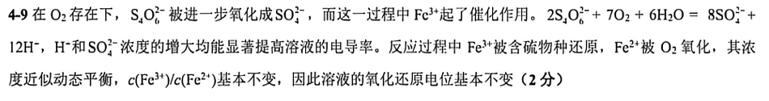

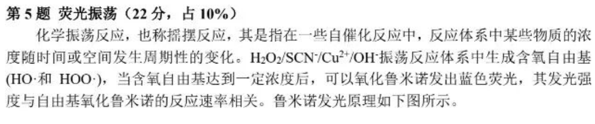

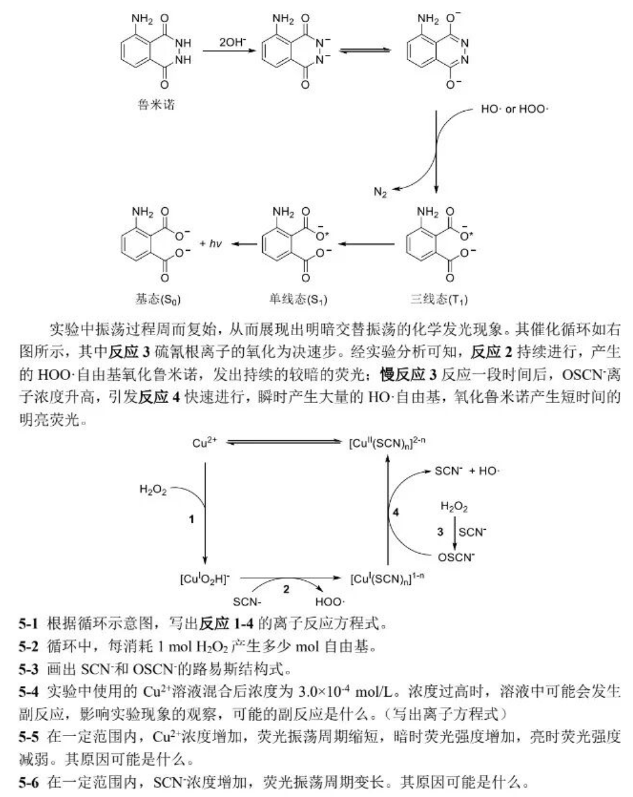

5-1 is a cheat question (it should be $\ce{[Cu^IO2H]+}$ in the picture, and it was also a printing error during the exam)

Note that the ligand in $\ce{[Cu^IO2H]+}$ is not water, but **\(HOO^\bullet\)** (very important for the writing of 2)
>When writing the chemical formula of a coordination compound, in order to avoid confusion, the chemical symbols of neutral ligands and cationic ligands should be enclosed in parentheses when necessary, and attention should be paid to understanding what they represent.
> $\ce{(N2)}$ dinitrogen $\ce{(O2)}$ dioxygen represents a neutral molecule
> $\ce{O2}$ without parentheses means $\ce{O2^2-}$ peroxide radical
1. $\ce{Cu^2+ + H2O2 + OH^-=[Cu^IO2H]^+ + H2O}$
2. $\ce{[Cu^IO2H]^+ + SCN^-=[Cu^I(SCN)_n]^{1-n} + HOO.}$
3. $\ce{H2O2 + SCN^-=OSCN^- + H2O}$
4. $\ce{OSCN^- + [Cu^I(SCN)_n]^{1-n} + H2O=[Cu^{II}(SCN)_n]^{2-n} + SCN^- + OH. + OH^-}$

For ionic reactions containing **free radical** species, as long as **charge conservation** and **atom conservation** should be enough

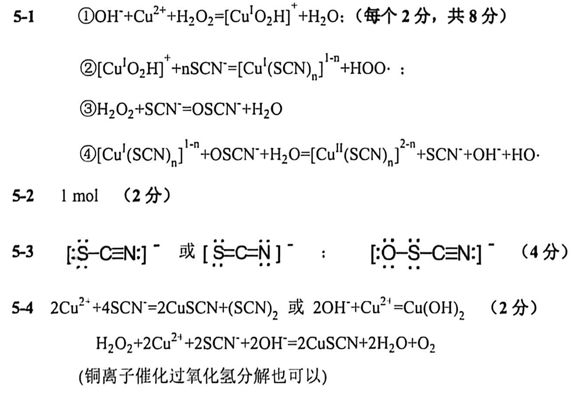

It is important to note that the **Lewis structural formula** uses square brackets to indicate the charge, rather than marking the **formal charge**.

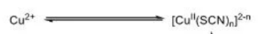

It must be understood that the concentration of $\ce{Cu^2+}$ remains unchanged (because of the balance and material conservation in the above figure), but is affected by the concentration of thiocyanate.

5-5 $\ce{Cu^2+}$ is the reaction **catalyst**. As the concentration increases, the reaction rate accelerates and the oscillation period shortens;

As the concentration of $\ce{Cu^2+}$ increases, the reaction ①② rate accelerates, the $HOO\bullet$ free radical generation rate accelerates, the luminol luminescence rate triggered by $HOO\bullet$ free radicals increases, and the fluorescence intensity increases in the dark;

The rate of reaction ⟢ is almost unchanged (or reduced, the concentration of thiocyanate reacts with copper ions), the accumulated concentration of $\ce{OSCN^-}$ within an oscillation period decreases, the rate of reaction ④ generated $HO\bullet$ decreases, the luminol emission rate of $HO\bullet$ free radicals triggers decreases, and the fluorescence intensity decreases when bright.

5-6 Thiocyanate forms a complex with copper ions, which reduces the reaction catalyst concentration and reduces the reaction rate.

The sixth question is a simple calculation question with no explanation.

For the following crystal problems and organic problems, I will write the analysis after I finish studying them.

E.N.D
