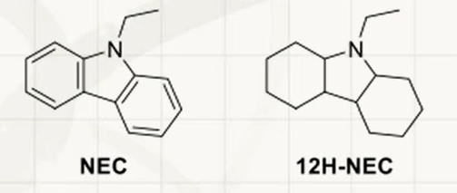
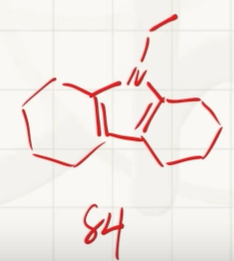
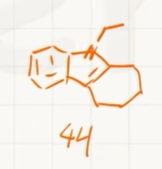

# Hydrogen Storage Technology (39th Session)
6.1 High-pressure hydrogen storage. Compressed hydrogen is currently one of the most commonly used hydrogen storage methods. Hydrogen is stored in a container with a pressure maintained at 350~700 bar. Under high pressure, its behavior deviates from an ideal gas and is more suitable to be described by the van der Waals equation $(p + a/V_{\text{m}}^2)(V_{\text{m}} - b) = RT$, where $V_{\text{m}}$ is the molar volume of the gas and $p$ is the gas pressure. For hydrogen, $a = 0.02476\ \text{J}\cdot\text{m}^3\cdot\text{mol}^{-2}$, $b = 2.661 \times 10^{-5}\ \text{m}^3\cdot\text{mol}^{-1}$ in the equation. Tip: **This question requires valid figures**.

6.1.1 At 293 K, what is the required pressure in bar to achieve the hydrogen storage density of $20.0\ \text{kg}\cdot\text{m}^{-3}$?

6.1.2 At 293 K, in order to increase the hydrogen storage density from $20.0\ \text{kg}\cdot\text{m}^{-3}$ to $40.0\ \text{kg}\cdot\text{m}^{-3}$, the required pressure ( ) is:
(a) 2 times the original; (b) lower than the original 2 times; (c) higher than the original 2 times; (d) cannot be determined.

6.1.3 The pressure of hydrogen storage tanks in industry is rarely higher than 700 bar. Briefly analyze the reasons.

6.1.1:

Remember to keep three significant digits
$$\begin{gathered}
  V_m=\frac{1}{\frac{\rho}{M}}=\frac{M}{\rho}\\
  (p + a/V_{\text{m}}^2)(V_{\text{m}} - b) = RT\\
  p = \frac{RT}{V_m-b}-\frac{a}{V_m^2}\\
  p = 3.04\times10^7Pa=304bar
\end{gathered}$$
6.1.2

$$\begin{gathered}
  p'=\frac{RT}{\frac{V_m}{2}-b}-\frac{a}{(\frac{V_m}{2})^2}=9.26\times10^7=926bar\gt2p
\end{gathered}$$
Choose c

6.1.3
When $p\gt\gt700bar$, $p\gt\gt\frac{a}{b^2}\gt \frac{a}{V_m^2}$ and $\frac{a}{V_m^2}$ can almost be ignored:
$$\begin{gathered}
  RT\approx p(V_m-b)\\
  \frac{M}{\rho}=V_m\approx b+\frac{RT}{p}\to b\\
  \rho_{\infty}=\frac{M}{b}=75.8kg\cdot\text{m}^{-3}
\end{gathered}$$

Then calculate the hydrogen storage density at $p=700bar,T=293K$:

$$\begin{gathered}
  (p + a/V_{\text{m}}^2)(V_{\text{m}} - b) = RT\\
  V_m=\frac{M}{\rho}=5.81\times10^{-5}m^3\cdot mol^{-1}\\
  \rho=34.7kg\cdot m^{-3}
\end{gathered}$$

The pressure increases to infinity, but the density only becomes 2.18 times the original, indicating that the increase in pressure is not proportional to the increase in density. Continuing to increase the pressure is not only unsafe, but also requires high equipment and is uneconomical.

6.2 Liquid phase hydrogen storage. $\text{H}_2$ After liquefaction, it can be stored stably at a pressure of 1~4 bar, but the system needs to maintain an extremely low temperature. It is known that the triple point of hydrogen is $(7.041\ \text{kPa}, -259.35\ ^\circ\text{C})$ and the critical point is $(12.86\ \text{bar}, -240.21\ ^\circ\text{C})$.

6.2.1 The temperatures at which liquid hydrogen may be observed are: (a) 16 K; (b) 25 K; (c) 77 K; (d) 293 K.

6.2.2 Calculate the pressure required for $\text{H}_2$ to liquefy at 27.15 K, and explain what approximations are used in the calculation process.

6.2.3 If the state of liquid hydrogen can also be approximately described by the van der Waals equation, calculate the upper limit of the density of liquid hydrogen. (Unit: $\text{kg}\cdot\text{m}^{-3}$)

6.2.1

$-259.35\ ^\circ\text{C}=13.80K,-240.21\ ^\circ\text{C}=32.94K$

To observe $\ce{H2(l)}$, the temperature is required to be between the triple point and the critical point, choose (a) (b)

6.2.2

It is known that the gas/liquid critical point $(7.041\times10^3\ \text{Pa}, 13.80K),(1.286\times10^6 \text{Pa}, 32.94K)$ is used, then the **Clausius-Clapeyron** equation is used:

$$\begin{gathered}
  \ln\frac{p_2}{p_1}=-\frac{\Delta_{vap}H_m}{R}(\frac{1}{T_2}-\frac{1}{T_1})\\
  \Delta_{vap}H_m=\frac{R\ln\frac{p_2}{p_1}}{\frac{T_2-T_1}{T_1T_2}}=1.028\times10^3J\cdot mol^{-1}\\
  \ln\frac{p_3}{p_1}=-\frac{\Delta_{vap}H_m}{R}(\frac{1}{T_2}-\frac{1}{T_1})\\
  p_3 = p_1e^{-\frac{\Delta_{vap}H_m}{R}(\frac{1}{T_2}-\frac{1}{T_1})}=5.774\times10^2kPa
\end{gathered}$$

Approximation taken:
-Assume hydrogen is an ideal gas
- Assume molar enthalpy of vaporization is independent of pressure/temperature
- $V(l)\lt\lt V(g)$

6.2.3

At ultra-high pressure, the ultimate density $\rho_{\infty}=\frac{M}{b}=75.8kg\cdot\text{m}^{-3}$ has been calculated in 6.1

6.3 Organic liquid hydrogen storage. Organic liquid hydrogen storage carriers (LOHCs) have the advantages of high safety and easy transportation. The reversible transformation between N-ethylcarbazole (NEC) and its fully hydrogenated product 12H-NEC makes it a LOHC system with great application prospects.

6.3.1 The formula quantity of 12H-NEC is 207.36, and the relationship between its density $\rho$ (unit: $\text{g}\cdot\text{cm}^{-3}$) and temperature $T$ (unit: K) is:
$$ \rho = 1.1482329 - 0.00070927T $$
, calculate the hydrogen storage density of 12H-NEC at 293.0 K $\text{kg}\cdot\text{m}^{-3}$?



$$\begin{gathered}
  \rho = 1.1482329 - 0.00070927\times293.0\\=9.4041679\times10^{-1}g\cdot cm^{-3}\\=9.4041679\times10^2kg\cdot m^{-3}\\
  \rho(H)=\frac{\frac{12\rho}{M(12H-NEC)}\times A_r(H)}{1}\\
  =5.486\times10^1kg\cdot m^{-3}
\end{gathered}$$

6.3.2 When 12H-NEC is dehydrogenated, two intermediate products, 8H-NEC (product 1) and 4H-NEC (product 2), are produced, which are compounds of NEC plus 8 and 4 hydrogen atoms respectively. Draw the structures of product 1 and product 2 separately. Stereochemistry is not required.

During dehydrogenation, stable (aromatic) species should be produced as much as possible.



6.3.3, 6.3.4: Omitted

6.4 Porous adsorption hydrogen storage materials. MOF-5 has a specific surface area of ​​thousands of square meters per gram and can store hydrogen through surface adsorption. If the hydrogen adsorption process on the MOF-5 surface, $\Delta H_{\text{ads}} = -5.20\ \text{kJ}\cdot\text{mol}^{-1}$, $\Delta S_{\text{ads}} = -80.3\ \text{J}\cdot\text{mol}^{-1}\cdot\text{K}^{-1}$, is considered to be independent of temperature. The surface adsorption amount $\Gamma$ and $\text{H}_2$ pressure $p$ obey the Langmuir adsorption isotherm: $\Gamma/\Gamma_\infty = Kp/(1 + Kp)$, where $K$ is the equilibrium constant of the surface adsorption reaction, and $\Gamma_\infty$ is a constant.

6.4.1 The density of MOF-5 is $0.30\ \text{g}\cdot\text{cm}^{-3}$ (including pores in the structure). MOF-5 can adsorb 7.5 wt% hydrogen at 77 K and 100 bar. Calculate the maximum hydrogen storage density ($\text{kg}\cdot\text{m}^{-3}$) that MOF-5 can achieve through surface adsorption at 77 K.

$$\begin{gathered}
  \Delta_mG_{ads}=-RT\ln K=\Delta_mH_{\text{ads}}-T\Delta S_{\text{ads}}\\
  K=e^{\frac{\Delta S_{\text{ads}}}{R}-\frac{\Delta_mH_{\text{ads}}}{RT}}=2.15\times10^{-1}\\
  \frac{\Gamma}{\Gamma_\infty} = \frac{Kp}{1 + Kp}\\
  \Gamma_\infty=7.85\times10^{-2}\\
  \rho_{\infty}=\frac{\rho(MOF-5)\Gamma_{\infty}}{1}=2.4\times10^1kg\cdot m^{-3}
\end{gathered}$$

6.4.2 In addition to surface adsorption, $\text{H}_2$ can also be stored in the pores of MOF-5. The specific pore volume of MOF-5 is $1.27\ \text{cm}^3\cdot\text{g}^{-1}$. After filling a $1.00\ \text{L}$ hydrogen storage tank with MOF-5 material, calculate how many times the hydrogen storage capacity at 77 K and 100 bar is that of the unfilled MOF-5 material? Assume that the pore volume of MOF-5 does not change after $\text{H}_2$ is adsorbed on the surface, and the $\text{H}_2$ in the pores conforms to the van der Waals equation. $V_{\text{m}} = 6.853 \times 10^{-5}\ \text{m}^3\cdot\text{mol}^{-1}$ at 77 K and 100 bar.

$$\begin{gathered}
  V_m=\frac{V}{n(\ce{H2})}\\
  n(\ce{H2})=14.59mol\\
  m(\ce{H2})=M(\ce{H2})n(\ce{H2})=2.942\times10^1g\\
  \rho_0=\frac{m(\ce{H2})}{V}=\frac{2.942\times10^{-2}kg}{10^{-3}}=29.4kg\cdot m^{-3}\\
  m(MOF-5)=\rho(MOF-5)V=0.30kg\\
  V_{hole}=m(MOF-5)\times1.27\times10^{-3}\ \text{m}^3\cdot\text{kg}^{-1}=3.81\times10^{-4}m^{3}\\
  m_{ads}(H_2)=7.5\times10^{-2}m(MOF-5)=2.25\times10^{-2}kg\\
  n_{hole}(H_2)=\frac{V_{holes}}{V_m}=5.560mol\\
  m_{hole}(\ce{H2})=M(\ce{H2})n_{hole}(\ce{H2})=1.121\times10^{-2}kg\\
  \frac{m_{ads}(H_2)+m_{hole}(\ce{H2})}{m(\ce{H2})}=1.15
\end{gathered}$$

# Inorganic Chemistry Inference Questions: Fluorides and Oxides of Xenon

## 1. Transcription of the title

Non-metallic hexafluoride **A** is a colorless crystal that is stable at room temperature and has strong oxidizing properties. Gaseous **A** is a single molecule. Due to its slightly distorted structure, its molecular point group is \(C_{3v}\).

The process of **A** reacting with water is a multi-step hydrolysis. As the hydrolysis proceeds, three compounds **B, C, and D** are obtained in sequence. Binary compound **D** is a colorless needle-shaped crystal, which will be strongly decomposed under \(25^\circ\mathrm{C}\) to obtain elemental substance **E** and combustion-supporting gas **F**.

**D** is soluble in KOH solution to generate anion **G**; passing \(\mathrm{O_3}\) into the dilute solution of **G** will generate another highly oxidizing regular octahedral anion **H**. At 298 K, **H** in acidic media rapidly oxidizes \(\mathrm{Mn(II)}\) to \(\mathrm{MnO_4^-}\).

\(\mathrm{N_2F_2}\) is heated together with **E**, and the main product is **I**. **I** is a colorless solid that sublimates easily at room temperature. At room temperature, **I** reacts strongly in aqueous solution, and a disproportionation reaction occurs, and **D, E, F** and HF can be obtained. But if **I** reacts with water under \(-80^\circ\mathrm{C}\), **J** will be obtained.

**J** is a bright yellow non-volatile solid, which slowly decomposes into equal amounts of **C** and **K** under \(-15^\circ\mathrm{C}\). **A, I, K** have the same elemental composition.

### 3-1

Write the chemical formula of the substance corresponding to the number.

### 3-2

If the alkaline aqueous solution of **G** is not passed through \(\mathrm{O_3}\), part of **H** will also be produced, and the ratio of the amounts of **E** and **H** in the product is \(1:1\). Write an equation for this reaction.

### 3-3

**J** exists in solids as a chain structure formed by a planar quadrilateral trans structure through shared vertices. Draw a schematic diagram of a chain-like structure containing at least two repeating units.

---

## 2. 3-1 Chemical formulas of each substance

| Number | Chemical formula | Name |
|---|---|---|
| A |\(\mathrm{XeF_6}\)| Xenon hexafluoride |
| B |\(\mathrm{XeOF_4}\)| Tetrafluoro-xenon oxide |
| C |\(\mathrm{XeO_2F_2}\)| Xenon Difluoride Dioxide |
| D |\(\mathrm{XeO_3}\)| Xenon trioxide |
| E |\(\mathrm{Xe}\)| Xenon |
| F |\(\mathrm{O_2}\)| Oxygen |
| G |\(\mathrm{HXeO_4^-}\)| Hydrogen xenonate |
| H |\(\mathrm{XeO_6^{4-}}\)| Perxenonate |
| I |\(\mathrm{XeF_4}\)| Xenon tetrafluoride |
| J |\(\mathrm{XeOF_2}\)| Xenon difluoride monoxide |
| K |\(\mathrm{XeF_2}\)| Xenon difluoride |

Therefore:

\[
\boxed{
\begin{aligned}
A&=\mathrm{XeF_6}\\
B&=\mathrm{XeOF_4}\\
C&=\mathrm{XeO_2F_2}\\
D&=\mathrm{XeO_3}\\
E&=\mathrm{Xe}\\
F&=\mathrm{O_2}\\
G&=\mathrm{HXeO_4^-}\\
H&=\mathrm{XeO_6^{4-}}\\
I&=\mathrm{XeF_4}\\
J&=\mathrm{XeOF_2}\\
K&=\mathrm{XeF_2}
\end{aligned}
}
\]

---

## 3. Inference process

### 1. Judgment A

A is hexafluoride, the gaseous molecule is slightly distorted, the point group is \(C_{3v}\), and it has strong oxidizing property, therefore:

\[
\boxed{A=\mathrm{XeF_6}}
\]

---

### 2. Gradual hydrolysis of A

During the stepwise hydrolysis of xenon hexafluoride, two F atoms are replaced by one O atom at each step and two molecules of HF are produced.

Step one:

\[
\mathrm{XeF_6+H_2O\rightarrow XeOF_4+2HF}
\]

So:

\[
\boxed{B=\mathrm{XeOF_4}}
\]

Step two:

\[
\mathrm{XeOF_4+H_2O\rightarrow XeO_2F_2+2HF}
\]

So:

\[
\boxed{C=\mathrm{XeO_2F_2}}
\]

Step three:

\[
\mathrm{XeO_2F_2+H_2O\rightarrow XeO_3+2HF}
\]

So:

\[
\boxed{D=\mathrm{XeO_3}}
\]

The overall response is:

\[
\mathrm{XeF_6+3H_2O\rightarrow XeO_3+6HF}
\]

---

### 3. Determine E and F

Xenon trioxide decomposes to form elemental xenon and oxygen:

\[
\mathrm{2XeO_3\rightarrow 2Xe+3O_2}
\]

Therefore:

\[
\boxed{E=\mathrm{Xe}}
\]

\[
\boxed{F=\mathrm{O_2}}
\]

Oxygen has combustion-supporting properties, which is consistent with the question conditions.

---

### 4. Determine G and H

Xenon trioxide dissolves in KOH solution to form hydrogen xenonate:

\[
\mathrm{XeO_3+OH^-\rightarrow HXeO_4^-}
\]

Therefore:

\[
\boxed{G=\mathrm{HXeO_4^-}}
\]

G is further oxidized by ozone to generate perxenate radical with xenon \(+8\) valence:

\[
\boxed{H=\mathrm{XeO_6^{4-}}}
\]

There are six O around Xe in \(\mathrm{XeO_6^{4-}}\), and the spatial configuration is a regular octahedron.

The ozone oxidation reaction can be written as:

\[
\mathrm{HXeO_4^-+O_3+3OH^-
\rightarrow XeO_6^{4-}+O_2+2H_2O}
\]

---

### 5. Judgment I

\(\mathrm{N_2F_2}\) is heated with xenon to mainly generate xenon tetrafluoride:

\[
\mathrm{2N_2F_2+Xe\rightarrow XeF_4+2N_2}
\]

Therefore:

\[
\boxed{I=\mathrm{XeF_4}}
\]

Xenon tetrafluoride is a colorless solid that sublimates easily, which is consistent with the description of the question.

At room temperature, xenon tetrafluoride undergoes a disproportionation reaction with water:

\[
\mathrm{6XeF_4+12H_2O
\rightarrow 2XeO_3+4Xe+3O_2+24HF}
\]

Products include:

\[
\mathrm{XeO_3,\ Xe,\ O_2,\ HF}
\]

That is D, E, F and HF in the question.

---

### 6. Judgment J

At \(-80^\circ\mathrm{C}\), xenon tetrafluoride undergoes partial hydrolysis:

\[
\mathrm{XeF_4+H_2O\rightarrow XeOF_2+2HF}
\]

Therefore:

\[
\boxed{J=\mathrm{XeOF_2}}
\]

---

### 7. Judgment K

J slowly decomposes into equal amounts of C and K at \(-15^\circ\mathrm{C}\):

\[
\mathrm{2XeOF_2\rightarrow XeO_2F_2+XeF_2}
\]

Due to:

\[
C=\mathrm{XeO_2F_2}
\]

So:

\[
\boxed{K=\mathrm{XeF_2}}
\]

At the same time:

\[
A=\mathrm{XeF_6},\qquad
I=\mathrm{XeF_4},\qquad
K=\mathrm{XeF_2}
\]

All three contain only two elements, Xe and F, and meet the condition that "A, I, and K have the same elemental composition".

---

## 4. 3-2 Reaction equation

Known:

\[
G=\mathrm{HXeO_4^-}
\]

\[
H=\mathrm{XeO_6^{4-}}
\]

\[
E=\mathrm{Xe}
\]

In alkaline aqueous solution, part of the \(+6\) valence xenon is oxidized to \(+8\) valence, and the other part is reduced to elemental xenon, and oxygen is generated at the same time.

Balance to get:

\[
\boxed{
\mathrm{2HXeO_4^-+2OH^-
\rightarrow XeO_6^{4-}+Xe+O_2+2H_2O}
}
\]

### Trim check

Conservation of atoms:

- Xe: \(2=1+1\)
- H： \(2+2=4\)
- O： \(8+2=6+2+2\)

Conservation of charge:

\[
-2-2=-4
\]

Right side:

\[
-4
\]

and:

\[
n(E):n(H)
=
n(\mathrm{Xe}):n(\mathrm{XeO_6^{4-}})
=
1:1
\]

Meet the topic requirements.

---

## 5. Chain structure of 3-3 J

J is:

\[
\mathrm{XeOF_2}
\]

In solids, each \(\mathrm{XeOF_2}\) unit shares vertices through O atoms, forming a chain-like structure. The two O's surrounding each Xe are in trans position, as are the two F's.

The schematic diagram is as follows:

```text
        F             F             F
        |             |             |
··· — O — Xe — O — Xe — O — Xe — O — ···
        |             |             |
        F             F             F
```

At least two repeating units can be written as:

```text
        F             F
        |             |
— O — Xe — O — Xe — O —
        |             |
        F             F
```

The chain repeating unit can be expressed as:

\[
\boxed{\left[-\mathrm{O-XeF_2-}\right]_n}
\]

Adjacent planar quadrilaterals are connected through O vertices.
