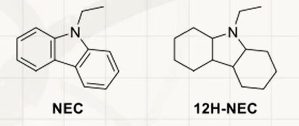
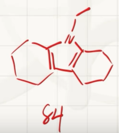
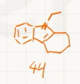

# 储氢技术(39届)
6.1 高压储氢。压缩氢气是目前最常用的储氢方法之一。氢气被存储在压力维持在 350~700 bar 的容器中，高压下其行为偏离理想气体，更适合用范德华方程$(p + a/V_{\text{m}}^2)(V_{\text{m}} - b) = RT$描述，其中 $V_{\text{m}}$ 为气体的摩尔体积，$p$ 为气体压强。对氢气而言，方程中的 $a = 0.02476\ \text{J}\cdot\text{m}^3\cdot\text{mol}^{-2}$，$b = 2.661 \times 10^{-5}\ \text{m}^3\cdot\text{mol}^{-1}$。提示：**此小题要求有效数字**。

6.1.1 293 K 下，要达到 $20.0\ \text{kg}\cdot\text{m}^{-3}$ 的储氢密度，所需的压力为多少 bar？

6.1.2 293 K 下，要想将储氢密度由 $20.0\ \text{kg}\cdot\text{m}^{-3}$ 提高至 $40.0\ \text{kg}\cdot\text{m}^{-3}$，所需压力( )：
(a) 为原来的 2 倍；(b) 低于原来的 2 倍；(c) 高于原来的 2 倍；(d) 无法确定。

6.1.3 工业上储氢罐的压强很少高于 700 bar，简要分析其原因。

6.1.1:

注意保留三位有效数字
$$\begin{gathered}
  V_m=\frac{1}{\frac{\rho}{M}}=\frac{M}{\rho}\\
  (p + a/V_{\text{m}}^2)(V_{\text{m}} - b) = RT\\
  p = \frac{RT}{V_m-b}-\frac{a}{V_m^2}\\
  p = 3.04\times10^7Pa=304bar
\end{gathered}$$
6.1.2

$$\begin{gathered}
  p'=\frac{RT}{\frac{V_m}{2}-b}-\frac{a}{(\frac{V_m}{2})^2}=9.26\times10^7=926bar\gt2p
\end{gathered}$$
选c

6.1.3
当$p\gt\gt700bar$时,$p\gt\gt\frac{a}{b^2}\gt \frac{a}{V_m^2}$,$\frac{a}{V_m^2}$几乎可以忽略:
$$\begin{gathered}
  RT\approx p(V_m-b)\\
  \frac{M}{\rho}=V_m\approx b+\frac{RT}{p}\to b\\
  \rho_{\infty}=\frac{M}{b}=75.8kg\cdot\text{m}^{-3}
\end{gathered}$$

再计算$p=700bar,T=293K$时的储氢密度:

$$\begin{gathered}
  (p + a/V_{\text{m}}^2)(V_{\text{m}} - b) = RT\\
  V_m=\frac{M}{\rho}=5.81\times10^{-5}m^3\cdot mol^{-1}\\
  \rho=34.7kg\cdot m^{-3}
\end{gathered}$$

压强提升为无限大,但密度仅仅变为原来的2.18倍,说明**压强的增大和密度的增大不成比例**,继续增大压强不仅**不安全**,而且对设备要求高,**不经济**.

6.2 液相储氢。$\text{H}_2$经液化后可在1~4 bar的压力下稳定存储，但系统需维持极低温度。已知氢气的三相点为$(7.041\ \text{kPa}, -259.35\ ^\circ\text{C})$，临界点为$(12.86\ \text{bar}, -240.21\ ^\circ\text{C})$。

6.2.1 可能观察到液态氢的温度有：(a) 16 K; (b) 25 K; (c) 77 K; (d) 293 K。

6.2.2 计算$\text{H}_2$在27.15 K液化所需的压力，并说明计算过程采取了哪些近似。

6.2.3 若液氢的状态也可以近似用范德华方程描述，计算液氢密度的上限。(单位: $\text{kg}\cdot\text{m}^{-3}$)

6.2.1

$-259.35\ ^\circ\text{C}=13.80K,-240.21\ ^\circ\text{C}=32.94K$

要观察到$\ce{H2(l)}$,要求温度在三相点和临界点的温度之间,选(a)(b)

6.2.2

已知气/液态临界点$(7.041\times10^3\ \text{Pa}, 13.80K),(1.286\times10^6 \text{Pa}, 32.94K)$,那么使用**克劳修斯-克拉伯龙**方程:

$$\begin{gathered}
  \ln\frac{p_2}{p_1}=-\frac{\Delta_{vap}H_m}{R}(\frac{1}{T_2}-\frac{1}{T_1})\\
  \Delta_{vap}H_m=\frac{R\ln\frac{p_2}{p_1}}{\frac{T_2-T_1}{T_1T_2}}=1.028\times10^3J\cdot mol^{-1}\\
  \ln\frac{p_3}{p_1}=-\frac{\Delta_{vap}H_m}{R}(\frac{1}{T_2}-\frac{1}{T_1})\\
  p_3 = p_1e^{-\frac{\Delta_{vap}H_m}{R}(\frac{1}{T_2}-\frac{1}{T_1})}=5.774\times10^2kPa
\end{gathered}$$

采取的近似:
- 假设氢气是理想气体
- 假设摩尔蒸发焓与压强/温度无关
- $V(l)\lt\lt V(g)$

6.2.3

在超高压时,在6.1中已经计算得极限密度$\rho_{\infty}=\frac{M}{b}=75.8kg\cdot\text{m}^{-3}$

6.3 有机液态储氢。有机液态储氢载体(LOHCs)具有高安全、易运输的优点。N-乙基咔唑(NEC)及其全氢化产物12H-NEC之间可以可逆转变，是极具应用前景的LOHC体系。

6.3.1 12H-NEC的式量为207.36，其密度$\rho$（单位：$\text{g}\cdot\text{cm}^{-3}$）同温度$T$（单位：K）的关系为：
$$ \rho = 1.1482329 - 0.00070927T $$
，计算293.0 K时12H-NEC的储氢密度为多少$\text{kg}\cdot\text{m}^{-3}$?



$$\begin{gathered}
  \rho = 1.1482329 - 0.00070927\times293.0\\=9.4041679\times10^{-1}g\cdot cm^{-3}\\=9.4041679\times10^2kg\cdot m^{-3}\\
  \rho(H)=\frac{\frac{12\rho}{M(12H-NEC)}\times A_r(H)}{1}\\
  =5.486\times10^1kg\cdot m^{-3}
\end{gathered}$$

6.3.2 12H-NEC脱氢时，会生成8H-NEC (产物1)和4H-NEC (产物2)两种中间产物，分别是NEC加上8个和4个氢原子的化合物。分别画出产物1和产物2的结构，不要求立体化学。

脱氢时,应该尽可能生成稳定(有芳香性的)物种.



6.3.3,6.3.4:略

6.4 多孔吸附储氢材料。MOF-5 的比表面积高达数千平方米每克，可以通过表面吸附储氢。若氢气在 MOF-5 表面的吸附过程，$\Delta H_{\text{ads}} = -5.20\ \text{kJ}\cdot\text{mol}^{-1}$，$\Delta S_{\text{ads}} = -80.3\ \text{J}\cdot\text{mol}^{-1}\cdot\text{K}^{-1}$，均视为同温度无关。表面吸附量$\Gamma$与$\text{H}_2$压力$p$服从Langmuir吸附等温式：$\Gamma/\Gamma_\infty = Kp/(1 + Kp)$，其中$K$为表面吸附反应的平衡常数，$\Gamma_\infty$为常数。

6.4.1 MOF-5的密度为$0.30\ \text{g}\cdot\text{cm}^{-3}$（包含结构中的孔），77 K、100 bar下MOF-5可以吸附 7.5 wt% 的氢气，计算 77 K 下MOF-5通过表面吸附能够达到的最大储氢密度($\text{kg}\cdot\text{m}^{-3}$)。

$$\begin{gathered}
  \Delta_mG_{ads}=-RT\ln K=\Delta_mH_{\text{ads}}-T\Delta S_{\text{ads}}\\
  K=e^{\frac{\Delta S_{\text{ads}}}{R}-\frac{\Delta_mH_{\text{ads}}}{RT}}=2.15\times10^{-1}\\
  \frac{\Gamma}{\Gamma_\infty} = \frac{Kp}{1 + Kp}\\
  \Gamma_\infty=7.85\times10^{-2}\\
  \rho_{\infty}=\frac{\rho(MOF-5)\Gamma_{\infty}}{1}=2.4\times10^1kg\cdot m^{-3}
\end{gathered}$$

6.4.2 除表面吸附外，MOF-5的孔中还可以存储$\text{H}_2$，MOF-5的比孔容为$1.27\ \text{cm}^3\cdot\text{g}^{-1}$。向一个$1.00\ \text{L}$的储氢罐中装填满MOF-5材料后，计算77 K、100 bar下其储氢量为未装填MOF-5材料的多少倍?假设MOF-5表面吸附$\text{H}_2$后其孔体积不变，孔中的$\text{H}_2$符合范德华方程，在77 K，100 bar下的$V_{\text{m}} = 6.853 \times 10^{-5}\ \text{m}^3\cdot\text{mol}^{-1}$。

$$\begin{gathered}
  V_m=\frac{V}{n(\ce{H2})}\\
  n(\ce{H2})=14.59mol\\
  m(\ce{H2})=M(\ce{H2})n(\ce{H2})=2.942\times10^1g\\
  \rho_0=\frac{m(\ce{H2})}{V}=\frac{2.942\times10^{-2}kg}{10^{-3}}=29.4kg\cdot m^{-3}\\
  m(MOF-5)=\rho(MOF-5)V=0.30kg\\
  V_{hole}=m(MOF-5)\times1.27\times10^{-3}\ \text{m}^3\cdot\text{kg}^{-1}=3.81\times10^{-4}m^{3}\\
  m_{ads}(H_2)=7.5\times10^{-2}m(MOF-5)=2.25\times10^{-2}kg\\
  n_{hole}(H_2)=\frac{V_{holes}}{V_m}=5.560mol\\
  m_{hole}(\ce{H2})=M(\ce{H2})n_{hole}(\ce{H2})=1.121\times10^{-2}kg\\
  \frac{m_{ads}(H_2)+m_{hole}(\ce{H2})}{m(\ce{H2})}=1.15
\end{gathered}$$

# 无机化学推断题：氙的氟化物与氧化物

## 一、题目转写

非金属六氟化物 **A** 在室温下是能稳定存在的无色晶体，具有很强的氧化性。气态的 **A** 为单分子，由于其略微畸变的结构，其分子点群为 \(C_{3v}\)。

**A** 同水反应的过程为多步水解，随着水解的进行，依次得到 **B、C、D** 三个化合物。二元化合物 **D** 为无色针状晶体，\(25^\circ\mathrm{C}\) 下会强烈分解，得到单质 **E** 和助燃性气体 **F**。

**D** 可溶于 KOH 溶液生成阴离子 **G**；往 **G** 的稀溶液中通入 \(\mathrm{O_3}\)，会生成另一种氧化性极强的正八面体阴离子 **H**。298 K 时，酸性介质中的 **H** 可迅速地氧化 \(\mathrm{Mn(II)}\) 至 \(\mathrm{MnO_4^-}\)。

\(\mathrm{N_2F_2}\) 同 **E** 共热，主要产物为 **I**。**I** 是一种无色固体，室温下易升华。室温下，**I** 在水溶液中强烈反应，发生歧化反应，可以得到 **D、E、F** 和 HF。但若在 \(-80^\circ\mathrm{C}\) 下，**I** 和水反应会得到 **J**。

**J** 为亮黄色不挥发固体，\(-15^\circ\mathrm{C}\) 下缓慢分解为等物质的量的 **C** 和 **K**。**A、I、K** 具有相同的元素组成。

### 3-1

写出编号对应物质的化学式。

### 3-2

**G** 的碱性水溶液若不通入 \(\mathrm{O_3}\)，同样也会产生部分 **H**，产物中 **E** 和 **H** 的物质的量之比为 \(1:1\)。写出该反应方程式。

### 3-3

**J** 在固体中的存在形式为平面四边形反式结构通过共用顶点形成的链状结构。画出链状结构的示意图，至少包含两个重复单元。

---

## 二、3-1 各物质的化学式

| 编号 | 化学式 | 名称 |
|---|---|---|
| A | \(\mathrm{XeF_6}\) | 六氟化氙 |
| B | \(\mathrm{XeOF_4}\) | 四氟一氧化氙 |
| C | \(\mathrm{XeO_2F_2}\) | 二氟二氧化氙 |
| D | \(\mathrm{XeO_3}\) | 三氧化氙 |
| E | \(\mathrm{Xe}\) | 氙 |
| F | \(\mathrm{O_2}\) | 氧气 |
| G | \(\mathrm{HXeO_4^-}\) | 氙酸氢根 |
| H | \(\mathrm{XeO_6^{4-}}\) | 高氙酸根 |
| I | \(\mathrm{XeF_4}\) | 四氟化氙 |
| J | \(\mathrm{XeOF_2}\) | 二氟一氧化氙 |
| K | \(\mathrm{XeF_2}\) | 二氟化氙 |

因此：

\[
\boxed{
\begin{aligned}
A&=\mathrm{XeF_6}\\
B&=\mathrm{XeOF_4}\\
C&=\mathrm{XeO_2F_2}\\
D&=\mathrm{XeO_3}\\
E&=\mathrm{Xe}\\
F&=\mathrm{O_2}\\
G&=\mathrm{HXeO_4^-}\\
H&=\mathrm{XeO_6^{4-}}\\
I&=\mathrm{XeF_4}\\
J&=\mathrm{XeOF_2}\\
K&=\mathrm{XeF_2}
\end{aligned}
}
\]

---

## 三、推断过程

### 1. 判断 A

A 是六氟化物，气态分子略微畸变，点群为 \(C_{3v}\)，且具有很强的氧化性，因此：

\[
\boxed{A=\mathrm{XeF_6}}
\]

---

### 2. A 的逐步水解

六氟化氙逐步水解时，每一步用一个 O 原子取代两个 F 原子，并产生两分子 HF。

第一步：

\[
\mathrm{XeF_6+H_2O\rightarrow XeOF_4+2HF}
\]

所以：

\[
\boxed{B=\mathrm{XeOF_4}}
\]

第二步：

\[
\mathrm{XeOF_4+H_2O\rightarrow XeO_2F_2+2HF}
\]

所以：

\[
\boxed{C=\mathrm{XeO_2F_2}}
\]

第三步：

\[
\mathrm{XeO_2F_2+H_2O\rightarrow XeO_3+2HF}
\]

所以：

\[
\boxed{D=\mathrm{XeO_3}}
\]

总反应为：

\[
\mathrm{XeF_6+3H_2O\rightarrow XeO_3+6HF}
\]

---

### 3. 判断 E 和 F

三氧化氙分解生成单质氙和氧气：

\[
\mathrm{2XeO_3\rightarrow 2Xe+3O_2}
\]

因此：

\[
\boxed{E=\mathrm{Xe}}
\]

\[
\boxed{F=\mathrm{O_2}}
\]

氧气具有助燃性，与题目条件相符。

---

### 4. 判断 G 和 H

三氧化氙溶于 KOH 溶液，形成氙酸氢根：

\[
\mathrm{XeO_3+OH^-\rightarrow HXeO_4^-}
\]

因此：

\[
\boxed{G=\mathrm{HXeO_4^-}}
\]

G 被臭氧进一步氧化，生成氙为 \(+8\) 价的高氙酸根：

\[
\boxed{H=\mathrm{XeO_6^{4-}}}
\]

\(\mathrm{XeO_6^{4-}}\) 中 Xe 周围有六个 O，空间构型为正八面体。

臭氧氧化反应可写为：

\[
\mathrm{HXeO_4^-+O_3+3OH^-
\rightarrow XeO_6^{4-}+O_2+2H_2O}
\]

---

### 5. 判断 I

\(\mathrm{N_2F_2}\) 与氙共热，主要生成四氟化氙：

\[
\mathrm{2N_2F_2+Xe\rightarrow XeF_4+2N_2}
\]

因此：

\[
\boxed{I=\mathrm{XeF_4}}
\]

四氟化氙是无色固体，容易升华，与题目描述相符。

室温下，四氟化氙与水发生歧化反应：

\[
\mathrm{6XeF_4+12H_2O
\rightarrow 2XeO_3+4Xe+3O_2+24HF}
\]

产物包括：

\[
\mathrm{XeO_3,\ Xe,\ O_2,\ HF}
\]

即题目中的 D、E、F 和 HF。

---

### 6. 判断 J

在 \(-80^\circ\mathrm{C}\) 下，四氟化氙发生部分水解：

\[
\mathrm{XeF_4+H_2O\rightarrow XeOF_2+2HF}
\]

因此：

\[
\boxed{J=\mathrm{XeOF_2}}
\]

---

### 7. 判断 K

J 在 \(-15^\circ\mathrm{C}\) 下缓慢分解为等物质的量的 C 和 K：

\[
\mathrm{2XeOF_2\rightarrow XeO_2F_2+XeF_2}
\]

由于：

\[
C=\mathrm{XeO_2F_2}
\]

所以：

\[
\boxed{K=\mathrm{XeF_2}}
\]

同时：

\[
A=\mathrm{XeF_6},\qquad
I=\mathrm{XeF_4},\qquad
K=\mathrm{XeF_2}
\]

三者均只含 Xe 和 F 两种元素，符合“A、I、K 具有相同元素组成”的条件。

---

## 四、3-2 反应方程式

已知：

\[
G=\mathrm{HXeO_4^-}
\]

\[
H=\mathrm{XeO_6^{4-}}
\]

\[
E=\mathrm{Xe}
\]

碱性水溶液中，部分 \(+6\) 价氙被氧化为 \(+8\) 价，另一部分被还原为单质氙，同时生成氧气。

配平得到：

\[
\boxed{
\mathrm{2HXeO_4^-+2OH^-
\rightarrow XeO_6^{4-}+Xe+O_2+2H_2O}
}
\]

### 配平检查

原子守恒：

- Xe：\(2=1+1\)
- H：\(2+2=4\)
- O：\(8+2=6+2+2\)

电荷守恒：

\[
-2-2=-4
\]

右侧：

\[
-4
\]

并且：

\[
n(E):n(H)
=
n(\mathrm{Xe}):n(\mathrm{XeO_6^{4-}})
=
1:1
\]

符合题目要求。

---

## 五、3-3 J 的链状结构

J 为：

\[
\mathrm{XeOF_2}
\]

在固体中，各 \(\mathrm{XeOF_2}\) 单元通过 O 原子共用顶点，形成链状结构。每个 Xe 周围的两个 O 处于反式位置，两个 F 也处于反式位置。

示意图如下：

```text
        F             F             F
        |             |             |
··· — O — Xe — O — Xe — O — Xe — O — ···
        |             |             |
        F             F             F
```

至少两个重复单元可写为：

```text
        F             F
        |             |
— O — Xe — O — Xe — O —
        |             |
        F             F
```

链状重复单元可表示为：

\[
\boxed{\left[-\mathrm{O-XeF_2-}\right]_n}
\]

其中相邻的平面四边形通过 O 顶点相连。