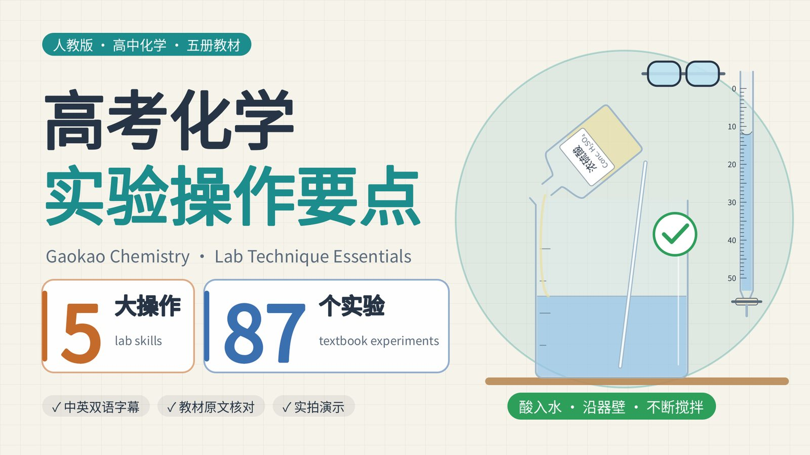

<!-- Embed the video here once it is uploaded, for example:
<iframe src="https://player.bilibili.com/player.html?bvid=BV..." width="100%" height="480" frameborder="0" allowfullscreen></iframe>
-->

**Gaokao Chemistry · Lab Technique Essentials** (高考化学 · 实验操作要点) is a 37-minute 2D animated revision video for students preparing for China's national college entrance exam. It has two halves. The first teaches the five lab skills that are examined most often. The second goes through the experiments in all five current People's Education Press (PEP, 人教版) senior-high chemistry textbooks, one card per experiment, 87 cards in total. It is 16:9, 1080p at 30 fps, with an original score and bilingual subtitles (Simplified Chinese above, English below).

One rule came before everything else: **safety content must be correct.** Every procedure and every reason had to be found in a textbook first and written into a sourced fact sheet. Only then could it appear on screen. A wrong or unsafe practice is never animated as a step to follow. It appears only as a still inside a red "✗ 错误 WRONG" frame, always next to the correct version.

Every frame was drawn by Python code and rendered on the CPU of an Android phone. Claude Opus 5.5, working in Claude Code, read and cross-checked the textbooks, wrote the script, the drawing code and the music, and ran the quality checks. I set the brief, approved the storyboard, and decided what each round of additions should cover.

## What the video covers

| Time | Section |
|---|---|
| 0:00 | Title |
| 0:07 | **Part 1** Order of adding chemicals (making ethyl acetate) |
| 1:19 | **Part 2** Diluting concentrated sulfuric acid |
| 2:19 | **Part 3** Heating a test tube safely |
| 3:26 | **Part 4** Collecting and testing gases |
| 5:31 | **Part 5** Using and reading a burette and a balance |
| 7:09 | **Part 6** Textbook experiments · Compulsory Book 1 (24) |
| 14:28 | **Part 7** Textbook experiments · Compulsory Book 2 (21) |
| 22:12 | **Part 8** Textbook experiments · Elective 1 (17) |
| 28:16 | **Part 9** Textbook experiments · Elective 2 (5) |
| 30:07 | **Part 10** Textbook experiments · Elective 3 (20) |
| 37:04 | Recap |

Parts 1–5 each end with a short **实拍** (real footage) segment: clips of real experiments taken from Bilibili, muted and credited on screen. Most are re-uploads of PEP's own textbook companion videos, and only segments showing the correct procedure were used.

After every demo whose experiment has a figure in the textbook, a short **教材原图** (textbook figure) scene shows that figure itself for about five seconds, labelled with the book, printed page and figure number, so students can find it in their own copy. There are 65 of these scenes, with 78 figures.

## Part 1: The order of adding chemicals

The example is Experiment 7-6 in Compulsory Book 2, making ethyl acetate. The textbook order is: put 3 mL of ethanol in the tube, then **slowly add 2 mL of concentrated sulfuric acid while shaking the tube**, then 2 mL of acetic acid, and finally a few pieces of broken porcelain. Elective 3 (Lab Activity 1) uses different amounts but the same order.

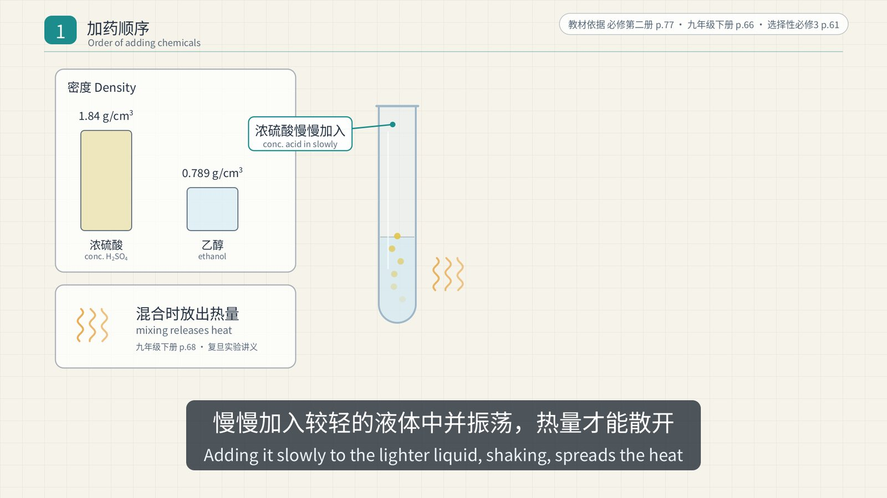

- **Why ethanol first?** The textbook does not print a reason. The video's explanation is derived from facts the textbook does state. Concentrated sulfuric acid is dense (1.84 g/cm³) and releases a lot of heat as it mixes, so it goes slowly into the lighter liquid while the tube is shaken to spread the heat. This is the same principle as diluting the acid. The fact sheet marks this claim as *derived*, not *quoted*.
- **Broken porcelain** prevents bumping (sudden violent boiling) when the mixture is heated.
- **The delivery tube ends above the saturated Na₂CO₃ solution**, not in it, to prevent suck-back.
- **Result:** a clear, oily, fragrant layer of ethyl acetate collects on top of the Na₂CO₃ solution.

## Part 2: Diluting concentrated sulfuric acid

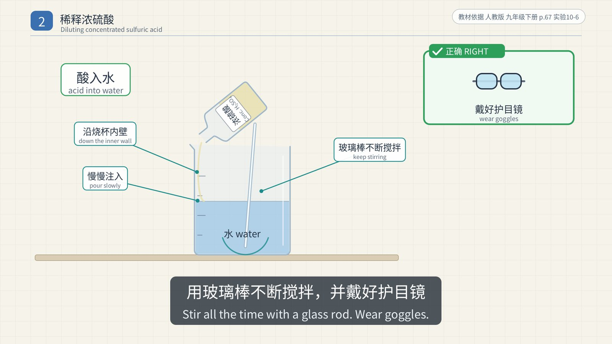

The rule is one sentence: **pour concentrated sulfuric acid slowly down the inner wall of the container into water, stirring all the time with a glass rod. Never pour water into concentrated sulfuric acid.** Wear goggles.

The textbook prints the reason too (Grade 9 Book 2, p. 68). Water is less dense, so it would float on top of the acid. The heat released as the acid dissolves would boil that water instantly and spray acid droplets in all directions.

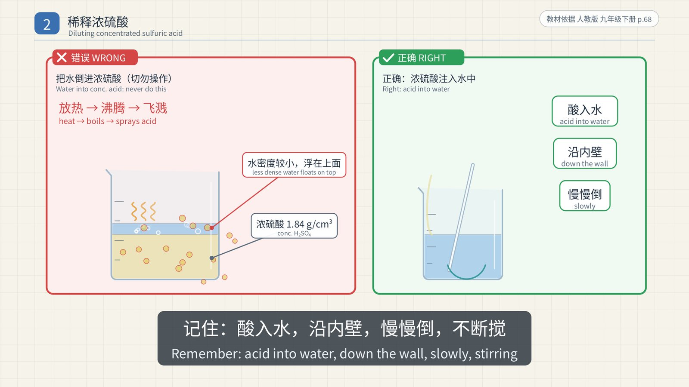

If acid gets on your skin, rinse at once with plenty of water, then apply 3–5 % NaHCO₃ solution. The senior textbook applies the same rule in Experiment 5-3 of Compulsory Book 2: once the reaction mixture has cooled, it is poured slowly into a tube holding a little water.

## Part 3: Heating a test tube safely

- The outside of the tube must be dry, and the liquid must fill no more than 1/3 of the tube.
- Slide the tube holder on and off from the bottom, and grip the tube 1/4–1/3 of the way down from the mouth.
- First warm the bottom of the tube evenly (preheat), then heat it steadily in the **outer flame** of the spirit lamp.
- Never point the mouth at yourself or anyone else.
- Never let a hot tube touch cold water, or it may crack.

When **heating a solid** such as potassium permanganate, tilt the mouth of the tube **slightly downward**, so that condensed water cannot run back onto the hot bottom and crack the tube. Figure 5-13 in Compulsory Book 2 holds the tube the same way when making ammonia from NH₄Cl and Ca(OH)₂.

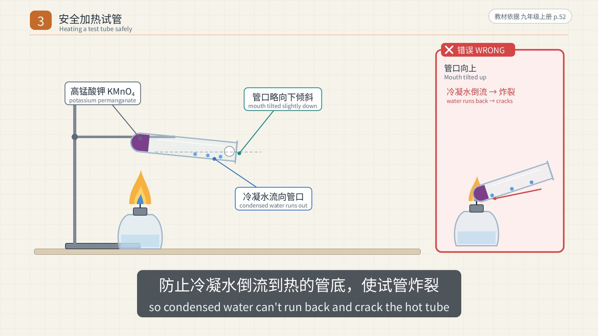

The video never gives a specific angle such as "45°", because the current textbook doesn't.

## Part 4: Collecting and testing gases

Choose a collection method from the gas's **density relative to air**, its **solubility in water**, and **whether it reacts with water**:

| Gas | Method | Why |
|---|---|---|
| O₂ | Over water | Only slightly soluble in water |
| CO₂ | Upward displacement of air | Denser than air |
| H₂ | Over water, or downward displacement of air | Insoluble in water and lighter than air |
| NH₃ | Downward displacement of air only | Lighter than air and extremely soluble (about 1 : 700) |

When collecting over water, wait until bubbles come **steadily and evenly** before you start, because the first bubbles are mostly air pushed out of the apparatus. When you stop, **take the delivery tube out of the water first, then put out the lamp with its cap.** In the wrong order, water is sucked back into the hot tube, which cools suddenly and cracks.

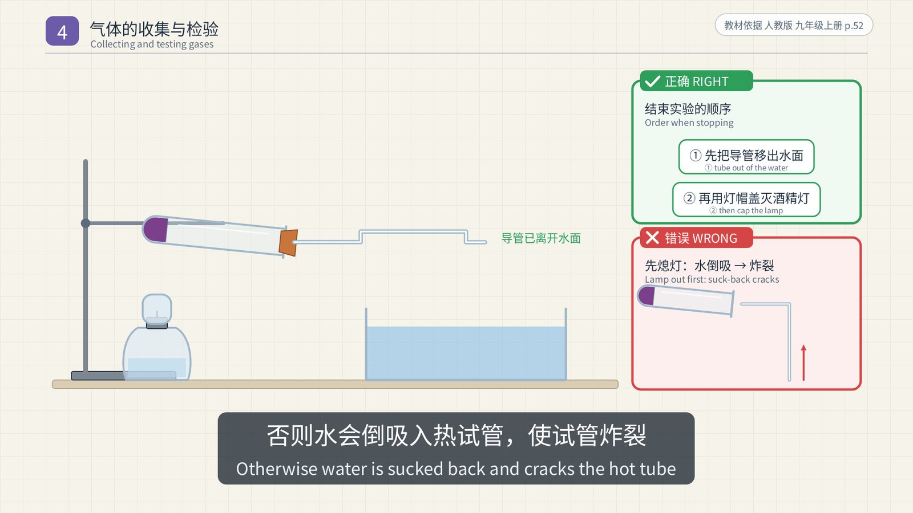

Tests: a glowing splint relights in O₂. CO₂ turns limewater milky, and a burning splint held at the mouth of the jar goes out when the jar is full. NH₃ turns moist red litmus paper blue. Always **test hydrogen for purity before lighting it**: a sharp squeaky pop means it is impure, and a soft pop means it is fairly pure. Elective 3 repeats this rule for ethyne.

## Part 5: The burette and the balance

**The burette** (Elective 1, Lab Activity 2) is set up in this order: check that the tap doesn't leak → rinse 2–3 times with the solution it will hold → fill to 2–3 mL above the "0" mark and clamp it vertically → expel air bubbles from the tip → set the level and record the reading.

- The "0" mark is at the **top**, and readings increase downward. Record to 0.01 mL, for example 20.00 mL.
- Read with your eye level with the lowest point of the meniscus.
- Because the scale increases downward, **looking down at the meniscus gives a reading that is too low, and looking up gives one that is too high.** This is the opposite of a measuring cylinder.

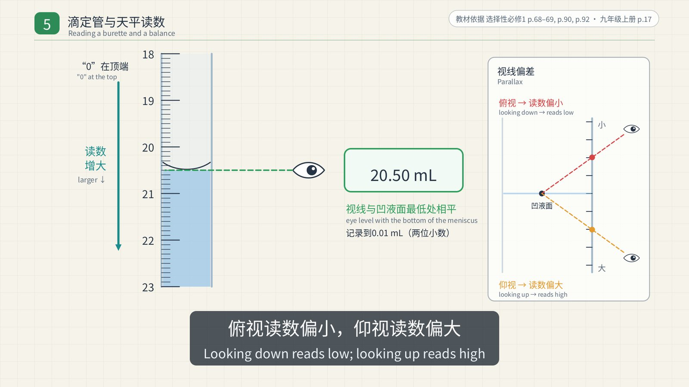

**The tray balance:** put it on a level surface → move the rider to zero → turn the balancing nuts until the pointer is centred → **object in the left pan, weights in the right**, adding the weights with tweezers. Chemicals never go directly on the pan. NaOH absorbs moisture from the air, so it is weighed in a container such as a small beaker.

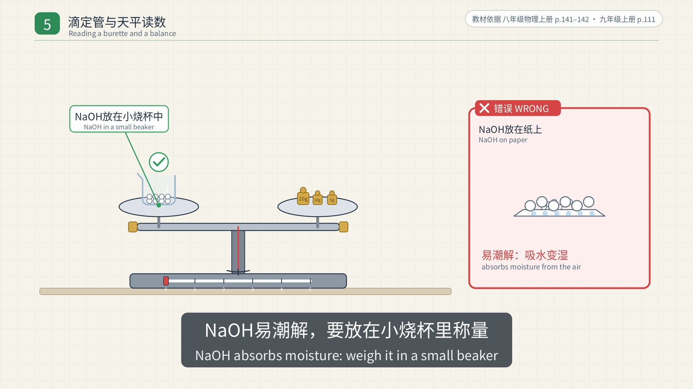

The video does not say that "a tray balance reads to 0.1 g". It is commonly taught, but it is not stated in the textbooks cited.

## Parts 6–10: 87 experiments from five textbooks

The second half is a sequence of experiment cards. On the left, the apparatus is animated. On the right, the card lists the **procedure**, the **observation** and a **note or reason**, with the equation printed in the textbook along the bottom. The current PEP senior-high chemistry series has five books, and every experiment in each one is covered:

- **Compulsory Book 1 (24):** Fe(OH)₃ colloid and the Tyndall effect, sodium and its compounds, flame tests, chlorine and how to prepare it, testing for Cl⁻, making a solution of known molar concentration, interconverting Fe²⁺ and Fe³⁺, aluminium with acid and alkali, halogen displacement, trends across period 3, and more.
- **Compulsory Book 2 (21):** SO₂, copper with concentrated sulfuric acid, testing for SO₄²⁻, NO and NO₂, the ammonia fountain and preparing ammonia, copper with nitric acid, purifying crude salt, galvanic cells, reaction rates, methane and chlorine, ethene, ethanol, tests for glucose, starch, proteins, and more.
- **Elective 1 (17):** heat of neutralisation, reaction rates, how concentration, pressure and temperature shift an equilibrium, strong and weak electrolytes, salt hydrolysis, precipitate conversion, acid–base titration, cells and electrolysis, corrosion and its prevention, electroplating, a fuel cell, and more.
- **Elective 2 (5):** ways to obtain crystals, extracting iodine, copper and iron complexes, and the silver–ammonia ion.
- **Elective 3 (20):** distillation, extraction and recrystallisation, making ethyne, benzene and toluene, hydrolysis and elimination of halogenoalkanes, ethene from ethanol, phenol, the silver mirror test and freshly made Cu(OH)₂ with ethanal, acid strength of carboxylic acids, ester hydrolysis, functional-group tests, sugars, cellulose, proteins, phenol–formaldehyde resin, and more.

Here are a few representative cards.

**Copper and concentrated sulfuric acid (Compulsory Book 2, Exp. 5-3).** When the tube is heated, the gas given off bleaches magenta solution, which shows that SO₂ has formed. Pulling the copper wire up stops the reaction. Once cool, the mixture is poured slowly into a little water, and the solution turns blue. NaOH solution absorbs the tail gas.

$$\ce{Cu + 2H2SO4}\text{ (conc.) }\ce{->[\Delta] CuSO4 + SO2 ^ + 2H2O}$$

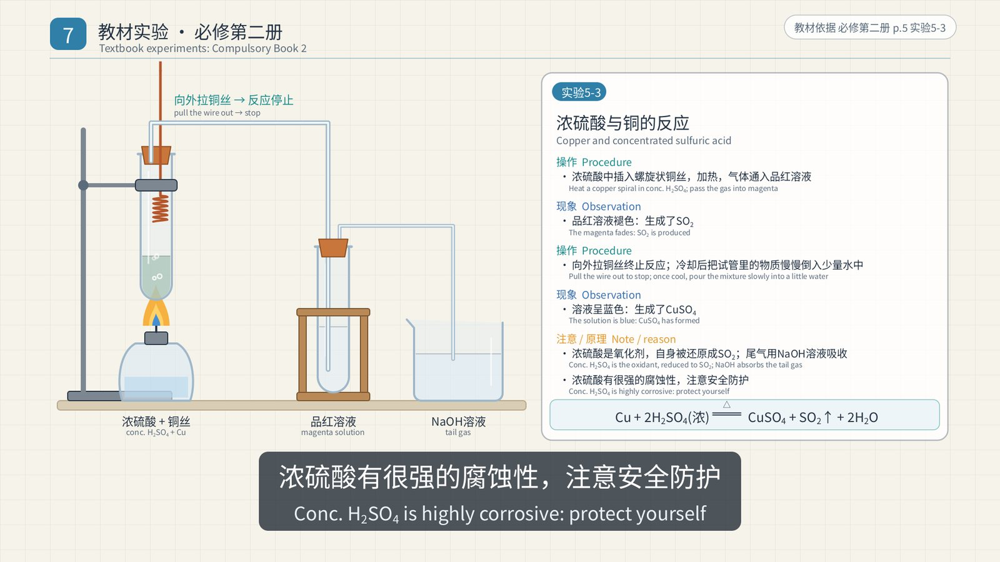

**Copper and nitric acid (Exp. 5-8).** With concentrated acid the reaction is vigorous, the solution turns green, and red-brown gas appears above it. With dilute acid there are bubbles and the solution turns blue. Dilute acid produces colourless NO, which only turns into red-brown NO₂ when it meets oxygen in the air.

$$\ce{3Cu + 8HNO3}\text{ (dil.) }\ce{= 3Cu(NO3)2 + 2NO ^ + 4H2O}$$

**NO₂ and water (Exp. 5-5).** In a syringe, NO meets air and turns into red-brown NO₂. Shaking it with water fades the colour and shrinks the volume. Industry makes nitric acid this way:

$$\ce{3NO2 + H2O = 2HNO3 + NO}$$

**Methane and chlorine: substitution (Exp. 7-1).** The tube wrapped in aluminium foil shows no change. In the tube left in the light (but not in direct sunlight), the gas colour fades, oily drops form on the wall, and the water level rises.

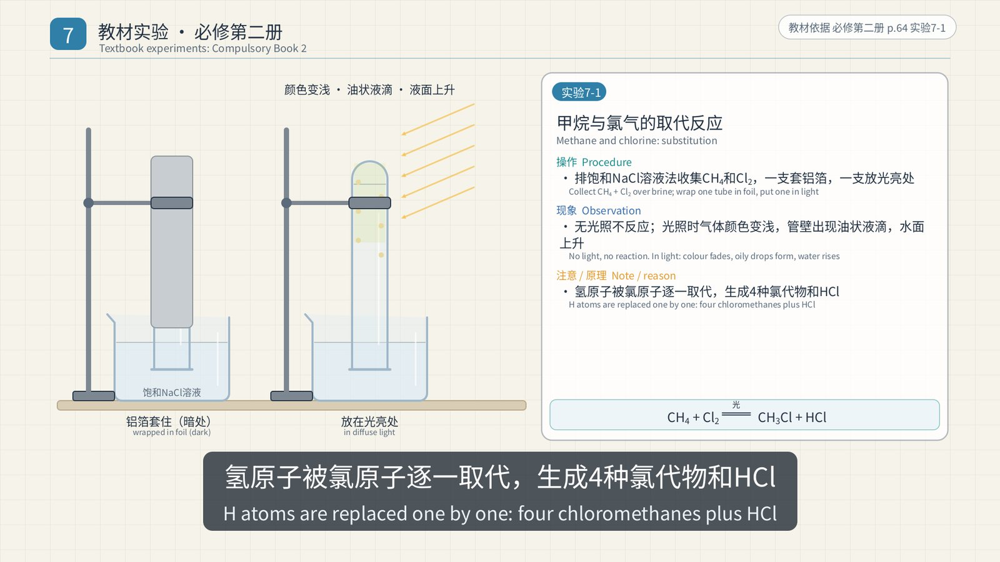

**Ethyne from calcium carbide (Elective 3).** Calcium carbide reacts very violently with water, so **saturated brine** is used instead to slow the reaction down. The gas is passed through CuSO₄ solution to remove H₂S and other impurities, then **separately** into acidified KMnO₄ and into bromine in CCl₄: first one tube, then the delivery tube is moved to the other. Both decolourise. The gas is tested for purity before it is lit. Making ethene from ethanol (Experiment 3-2) works the same way: NaOH solution removes the impurities, then the gas goes separately into each solution.

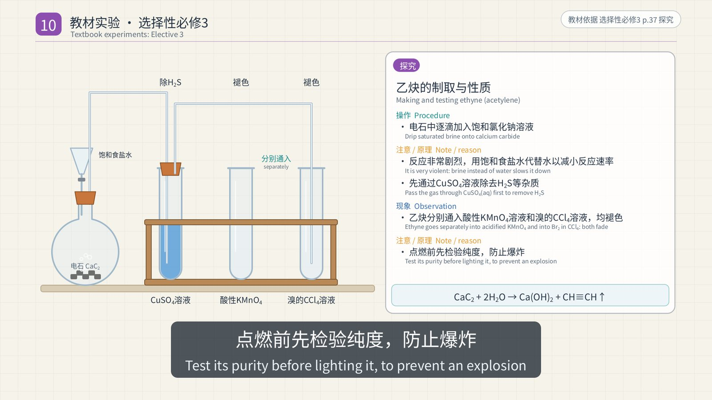

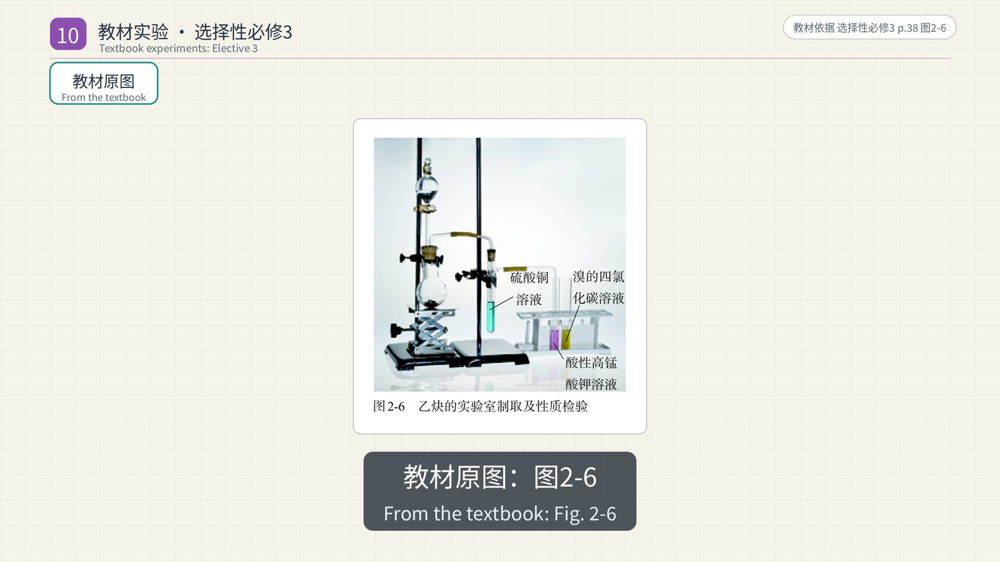

$$\ce{CaC2 + 2H2O -> Ca(OH)2 + CH#CH ^}$$

**The silver mirror and freshly made Cu(OH)₂.** Both tests appear twice: for glucose (Compulsory Book 2, Exp. 7-7) and for ethanal (Elective 3, Exp. 3-7 and 3-8). To make the silver–ammonia solution (Tollens' reagent), add ammonia solution dropwise to AgNO₃ until the precipitate that first forms **just dissolves**. Then warm the tube in a water bath, and a silver mirror forms on the glass. For the second test, 5 drops of CuSO₄ solution go into 2 mL of 10 % NaOH, so the NaOH is in excess, giving freshly made Cu(OH)₂. Heating it with the aldehyde gives a brick-red Cu₂O precipitate. The video keeps the textbook term "freshly made Cu(OH)₂" (新制的Cu(OH)₂): none of the five books uses the name Fehling's reagent (斐林试剂).

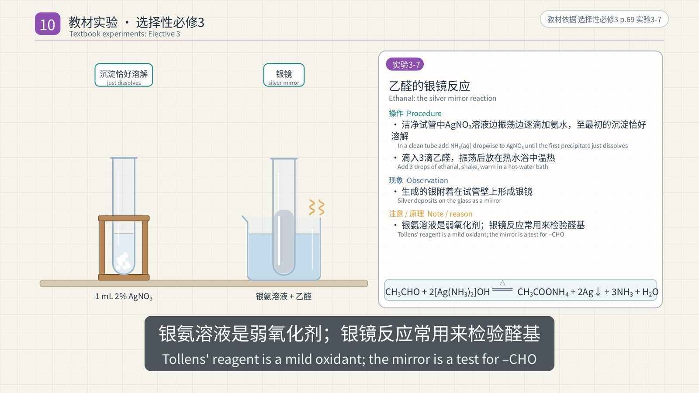

**Ester hydrolysis (Elective 3).** Ethyl acetate is warmed at 70–80 °C with water, with dilute sulfuric acid, and with NaOH solution. The ester layer disappears fastest in alkali. In acid, hydrolysis is reversible. In alkali, the acetate salt forms, so the reaction goes to completion.

## Every claim has a source

The fact sheet was written before anything was built. Every action, observation and reason in the video corresponds to a row that names the book, the page and the quote:

- The claims in Parts 1–5 are numbered F1.x to F5.x.
- The 87 experiment cards rest on 254 claims quoted from the textbooks (T) and 50 derived claims (D). Each derived claim states its basis, for example "the textbook asks this question but does not print the answer".
- A script compared every quotation with the text layer of the textbook PDFs. Of 357 fragments, 354 matched automatically. The other three were checked by hand: a table, and two equations whose subscripts and superscripts the PDF scrambles.

The checking also turned up several widely taught statements that the current textbooks do not support, so they were kept out of the subtitles: a "45°" tilt for a heated test tube, "a tray balance reads to 0.1 g", and any written rule about the distillation thermometer position or the direction of the cooling water. Review also caught a card whose first draft drew a heated solid in a tube with its mouth pointing up. It was fixed before release. A later review led to a pass over all the apparatus drawings. Test tubes now stand in a rack instead of floating. Thermometers sit inside the tube, not beside it. Tubes heating a solid are clamped to an iron stand. Every tube that gas passes through on its way to the next one has a two-hole stopper, with the long tube in and the short tube out. Delivery tubes leave through the stopper, not through the glass wall.

All the sources are published by People's Education Press: the senior-high chemistry textbooks Compulsory Books 1 and 2 and Electives 1, 2 and 3. For the basic operations, the video also cites the Grade 9 chemistry books (Books 1 and 2) and the Grade 8 physics book, which explains how to use a balance. The senior textbooks build on these junior-school operations and often refer students back to them, so those rules are cited from the junior books.

## How it was made

- **A fixed tempo.** The score runs at 100 beats per minute, so one beat is exactly 0.6 s, or 18 frames. Every scene starts on a bar, and every key action lands on a beat with a chime accent.
- **Bilingual subtitles.** There are 459 cues. The Chinese line has at most 8 characters per second, the English line at most 16 characters per second, and every cue stays on screen for at least 1.2 s. A separate .srt file and a clean version without subtitles are also provided.
- **Resumable chunked rendering.** Each scene is rendered as its own chunk, along with a hash of the code and data it depends on. After an interruption, only missing or changed chunks are rendered again. When three more textbooks and dozens of experiments were added to a finished version, the existing chunks did not need to be rendered again.
- **Automated quality checks.** All 22 checks pass:
  - subtitles stay inside the title-safe area, never overlap, and meet the reading-speed limits;
  - the video is BT.709-encoded and tagged as such;
  - loudness is −16.1 LUFS integrated, with a true peak of −1.8 dBTP;
  - audio–video sync is within 0 ms;
  - the running time is exactly 2236.8 s (67,104 frames).

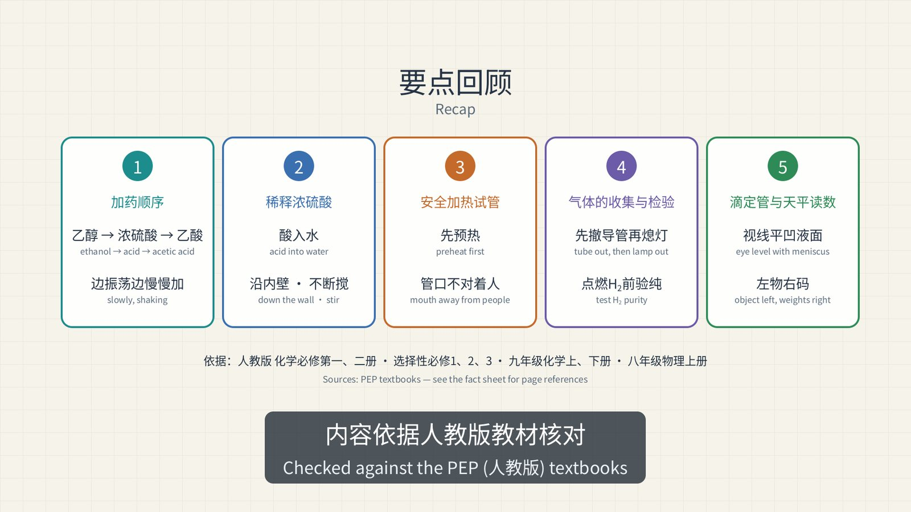

## In numbers

| | |
|---|---|
| Running time | 37:17 (30 fps, 67,104 frames) |
| Scenes | 185 (including 65 textbook-figure scenes) |
| Textbook experiment cards | 87, covering all five PEP senior-high chemistry books |
| Real-footage clips | 22, muted and credited |
| Subtitles | 459 bilingual cues |
| Fact sheet | Claims F1–F5 for the basic skills, plus 254 textbook quotes (T) and 50 derived claims (D) |

## Credits and rights

The score, animation and graphics are original. The 教材原图 scenes reproduce figures from People's Education Press textbooks, which hold the rights to them. The real-footage clips are excerpts of other people's Bilibili uploads, most of them re-uploads of PEP textbook companion videos, and the rights belong to their owners. They play muted and credited, which suits private study and classroom use. Before publishing the full video, get permission from the rights holders or replace those segments.
