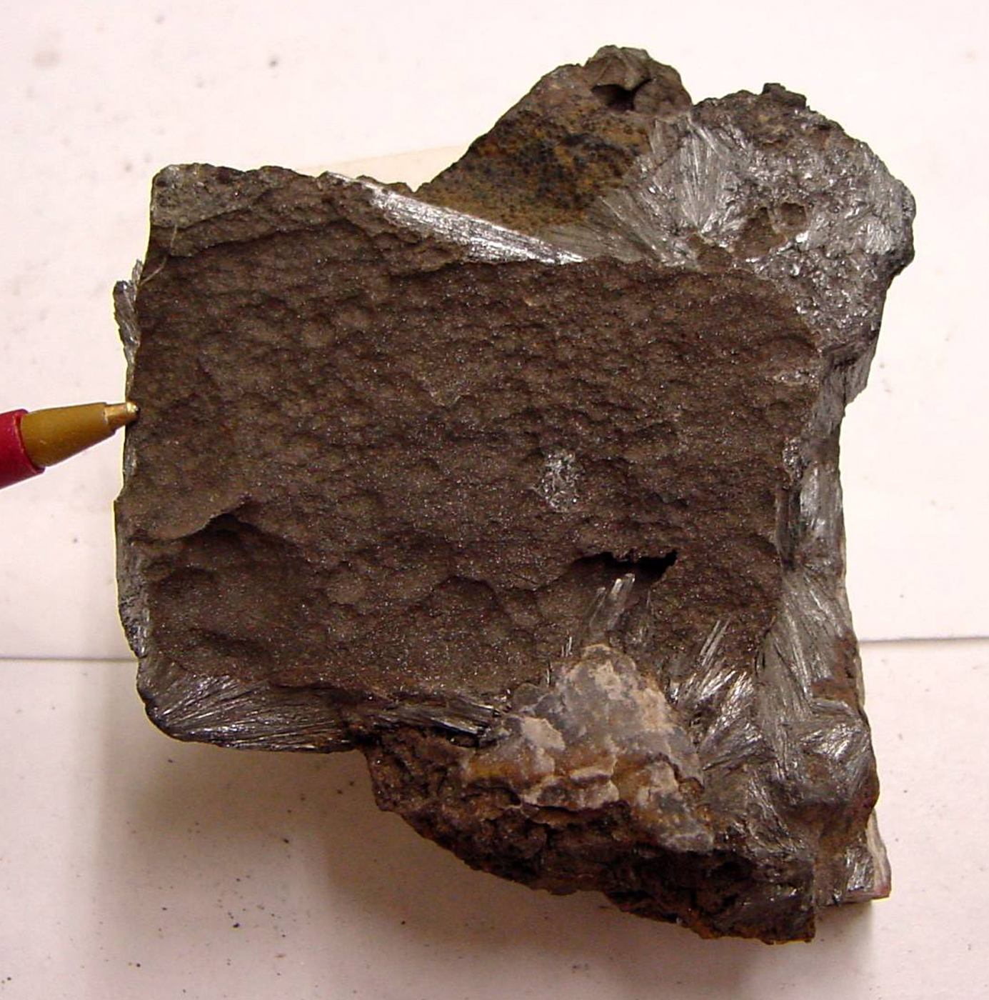
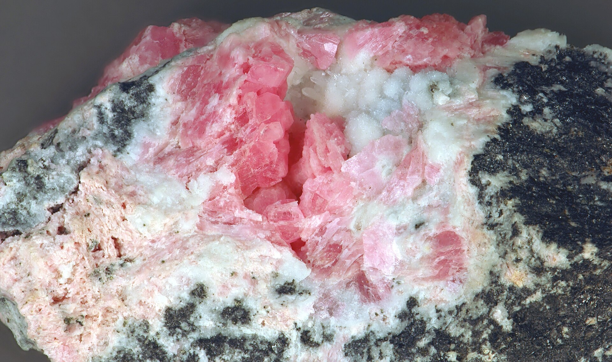
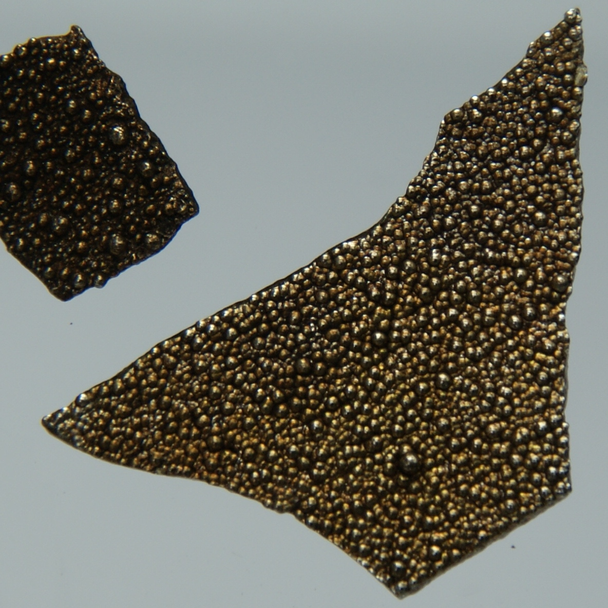
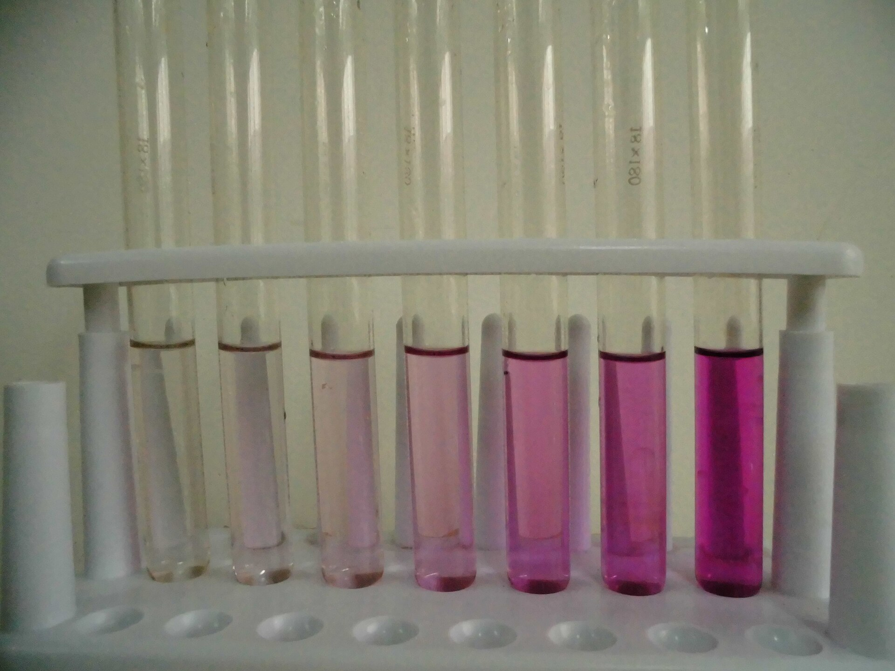
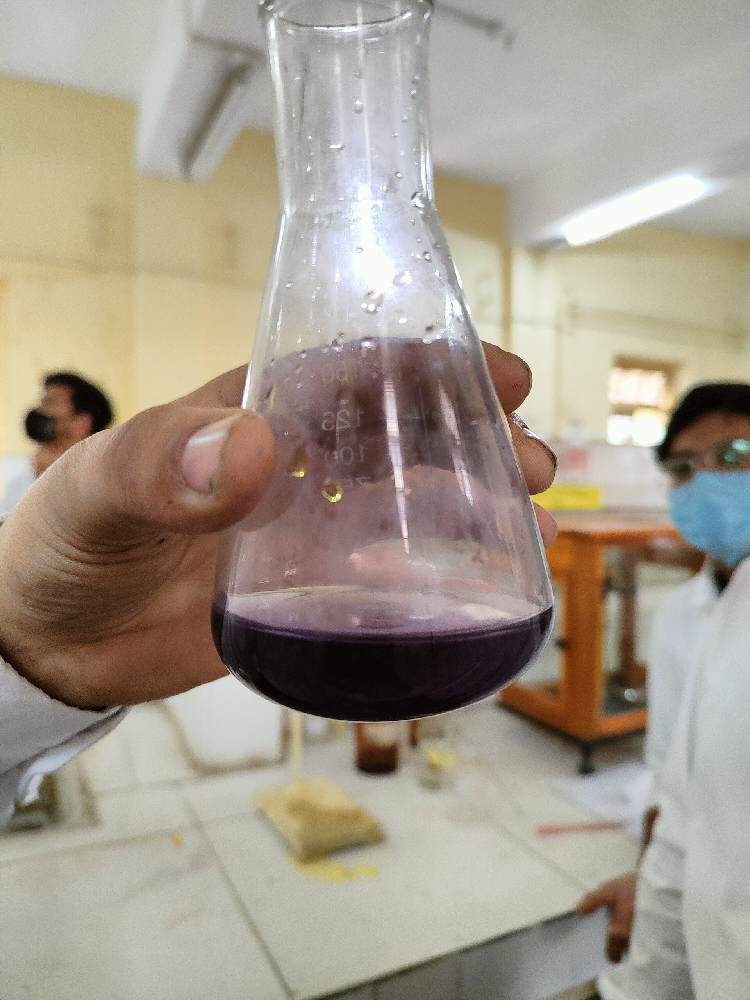
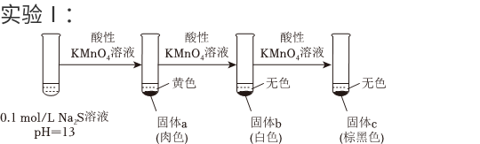
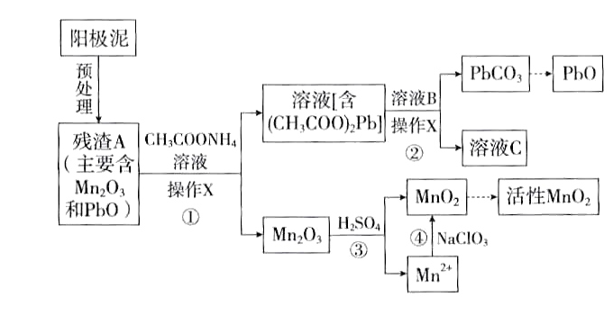
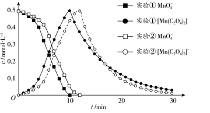

# Abstract

Manganese (Mn) belongs to the **manganese group**, Group $VIIB$, which comprises the four transition metals manganese (Mn), technetium (Tc), rhenium (Re), and bohrium (Bh).

Manganese ores occur mainly as **oxides**:

- Pyrolusite, $\ce{MnO2}$
- Hausmannite, $\ce{Mn3O4}$
- Manganosite, $\ce{MnO}$
- Rhodochrosite, $\ce{MnCO3}$

The ground-state valence-electron configuration of the manganese-group elements is $(n-1)d^5ns^2$, and their highest oxidation state is $+7$. Manganese exhibits the widest range of oxidation states in the group. The $+2$ state is its most common and most stable state; $\ce{Mn^2+}$ occurs in solids, solutions, and coordination compounds, while $\ce{Mn(VII)}$ is strongly oxidizing.

Unlike manganese, Tc and Re most commonly and stably adopt the $+7$ oxidation state, which is only weakly oxidizing. Their $+2$ and lower oxidation states are unstable and strongly reducing.

In summary, down the manganese group:

- The stability of **high oxidation states** **increases**
- The stability of **low oxidation states** **decreases**

=+0.74 V and E°(ReO₂/Re)=+0.31 V entries are completed from the official solution.")

 and alkaline standard state (1 M OH⁻), versus the standard hydrogen electrode and rounded to 0.01 V. Note that MnO₂/Mn(OH)₃ is +0.10 V and Mn(OH)₃/Mn(OH)₂ is −0.20 V.")

With that context established, this opening article on the manganese group focuses on manganese itself.

# The Element

Metallic manganese is silvery white. Manganese exposed to air, as well as powdered manganese, appears gray.

Pure manganese can be prepared by reducing $\ce{MnO2}$ or $\ce{Mn3O4}$ through an aluminothermic reaction.

The electrode potential $E^\ominus(\ce{Mn^{2+}/Mn})=-1.18\ \mathrm{V}$ shows that manganese is an active metal. It dissolves in cold, dilute, non-oxidizing acids, for example:

$$\ce{Mn + 2HCl(aq)->MnCl2 + H2 ^}$$

At room temperature, manganese is not highly reactive toward nonmetals, but it reacts readily on heating:

- Heating in air produces $\ce{Mn3O4}$
- At high temperatures it reacts with halogens, sulfur, carbon, and phosphorus
- It reacts very little with cold water, but reacts with hot water to form $\ce{Mn(OH)2}$ and release $\ce{H2}$, similarly to magnesium

# $\ce{Mn(II)}$ Compounds

Common manganese compounds include:

- $\ce{Mn(II)}$ salts
- $\ce{Mn(IV)}$ oxides
- Permanganates

## $\ce{Mn(II)}$

### Soluble Salts

Salts of $\ce{Mn(II)}$ derived from strong acids are soluble:

- $\ce{MnSO4}$
- $\ce{MnCl2}$
- $\ce{Mn(NO3)2}$

The five d electrons of $\ce{Mn^2+}$ have parallel spins. Because the probability of a d-d transition is low, its compounds are generally only weakly colored.

- Concentrated $\ce{Mn^2+}$ solutions are pink
- Dilute solutions are nearly colorless

Most hydrated $\ce{Mn^2+}$ salts are pink or rose-colored, for example:

- $\ce{MnSO4.7H2O}$
- $\ce{MnCl2.6H2O}$

The following anhydrous salts are white:

- $\ce{MnSO4}$
- $\ce{Mn(NO3)2}$

## Sparingly Soluble Compounds

The hydroxide and most weak-acid salts of $\ce{Mn(II)}$ are sparingly soluble.

- $\ce{MnCO3}$: pink
- $\ce{Mn(OH)2}$: white
- $\alpha$-$\ce{MnS}$: green
- $\ce{MnC2O4.2H2O}$: white

These substances dissolve readily in strong acids, a general pattern among transition-metal compounds.

Note that $\ce{MnS}$ is insoluble in water but dissolves in weak acids such as $\ce{HAc}$, so it cannot be precipitated from an acidic solution.

## Reducing Properties

In **alkaline** solution, $\ce{Mn(II)}$ is a fairly strong reducing agent and is readily oxidized to $\ce{Mn(IV)}$.

$$E^\ominus[\ce{MnO2/Mn(OH)2}]=-0.05\ \mathrm{V},\qquad E^\ominus(\ce{O2/OH-})=0.40\ \mathrm{V}$$

$$
\mathrm{Mn^{2+}} \xrightarrow{\mathrm{OH^-}} \mathrm{Mn(OH)_2} \text{ (white)} \xrightarrow{\mathrm{O_2}} \mathrm{MnO(OH)} \text{ (brown)} \xrightarrow{\mathrm{O_2}} \mathrm{MnO_2 \cdot nH_2O}
$$

Both aqueous ammonia and strong bases convert $\ce{Mn^2+}$ into basic, nearly white$\ce{Mn(OH)2}$.

$\ce{Mn(OH)2}$ is oxidized extremely readily. Even the small amount of dissolved oxygen in water can oxidize it to brownish-black$\ce{MnO(OH)2}$, also written as $\ce{MnO2.H2O}$ or $\ce{H2MnO3}$. This reaction can be used to determine dissolved oxygen.

When precipitates of $\ce{MnS}$, $\ce{MnCO3}$, or $\ce{MnC2O4}$ stand in air or are heated, atmospheric oxygen oxidizes them to $\ce{MnO(OH)2}$.

$$\ce{MnS + O2 + H2O -> MnO(OH)2 + S}$$

$$\ce{2MnCO3 + O2 + 2H2O ->[\triangle] 2MnO(OH)2 + 2CO2}$$

In an oxygen-free environment, MnO can be prepared by the thermal decomposition of $\ce{MnC2O4}$ or $\ce{MnCO3}$.

$$
\mathrm{MnC_2O_4(s)} \ce{->[\Delta]} \mathrm{MnO(s)} + \mathrm{CO(g)} + \mathrm{CO_2(g)}
$$

$$
\mathrm{MnCO_3(s)} \ce{->[\Delta]} \mathrm{MnO(s)} + \mathrm{CO_2(g)}
$$

In **acidic** solution, $\ce{Mn(II)}$ is a weaker reducing agent:

$$E^\ominus(\ce{MnO4-/Mn^2+})=1.51\ \mathrm{V}$$

Strong oxidizing agents can oxidize $\ce{Mn^2+}$ to $\ce{MnO4^-}$:

- $\ce{S2O8^2-->[Ag+]SO4^2-}$
- $\ce{BiO3-->Bi^3+}$
- $\ce{PbO2->Pb^2+}$

The first two reactions are commonly used to identify $\ce{Mn^2+}$.

The concentration $c(\ce{Mn^2+})$ must not be too high, especially in the first reaction. Otherwise $\ce{Mn^2+}$ readily comproportionates with $\ce{MnO4^-}$ to form brownish-black$\ce{MnO2}$.

When a $\ce{Mn(II)}$ salt is heated and its anion is oxidizing, $\ce{Mn(II)}$ is oxidized:

$$\ce{Mn(NO3)2->[\triangle]MnO2 + 2NO2 ^}$$

$$\ce{Mn(ClO4)2 ->[\triangle] MnO2 + Cl2 ^ + 3O2 ^}$$

By analogy, one possible decomposition pathway of nitrosyl perchlorate, $\ce{NOClO4}$, is:

$$\ce{2NOClO4 ->[\triangle] N2O4 + Cl2 ^ + 3O2 ^}$$

## Coordination Compounds

### Weak-Field Ligands: High-Spin Octahedral Complexes

$\ce{Mn^2+}$ has the electron configuration $3d^5$. Its high-spin octahedral complexes with **weak-field ligands** have the electron arrangement $\ce{(t_{2g})^3(e_g)^2}$ and a crystal-field stabilization energy of zero.

The hydrated ion $\ce{[Mn(H2O)6]^2+}$ is extremely pale pink, almost invisible below a concentration of $1\ \mathrm{M}$. In these high-spin compounds, a d-d transition requires not only promotion from a lower to a higher energy level but also a reversal of electron spin. This is a **spin-forbidden** transition. Because such transitions are very unlikely, absorption in the visible region is weak.

### Weak-Field Ligands: High-Spin Tetrahedral Complexes

In ethanol, $\ce{Mn^2+}$ forms yellow$\ce{[MnX4]^2-}$, where $\ce{X=Cl,Br,I}$. Its electron arrangement is $(e)^2(t_2)^3$, and $CFSE=0$.

### Strong-Field Ligands: Low-Spin Octahedral Complexes

Only $\ce{Mn(II)}$ with certain strong-field ligands forms colored, low-spin complexes. An example is blue-violet$\ce{[Mn(CN)6]^4-}$, with electron arrangement $(e)^5(t_2)^0$ and $CFSE=(2\Delta-2P)$. In air, this compound is readily oxidized to brownish-red$\ce{[Mn(CN)6]^3-}$.

# $\ce{Mn(III)}$ Compounds

$$\mathrm{MnO_2} \xrightarrow{+0.95\ \mathrm{V}} \mathrm{Mn^{3+}} \xrightarrow{+1.51\ \mathrm{V}} \mathrm{Mn^{2+}}$$

The Latimer diagram shows that $\ce{Mn(III)}$ is strongly oxidizing. It is unstable in solution and readily disproportionates.

Important $\ce{Mn(III)}$ compounds include:

- $\ce{Mn(CH3COO)3.3H2O}$: reddish purple
- $\ce{MnF3}$: reddish purple, prepared by reacting $\ce{MnF2}$ with $\ce{F2}$
- $\ce{Mn2O3}$: black, prepared by heating $\ce{MnO2}$ below $800\ ^\circ\mathrm{C}$

Important $\ce{Mn(III)}$ coordination compounds include:

- $\ce{[Mn(CN)6]^3-}$: brownish red
- $\ce{[Mn(PO4)2]^3-}$: purple

# $\ce{Mn(IV)}$ Compounds

$\ce{MnO2}$ powder is black. The precipitate formed in solution is the brownish-black hydrate $\ce{MnO2.H2O}$.

 powder. Benjah-bmm27 / Wikimedia Commons, public domain.")

Under ordinary conditions, $\ce{MnO2}$ is very stable. It is insoluble in $\ce{H2O}$, dilute acids, and dilute bases, and does not disproportionate in acid or base. However, $\ce{MnO2}$ is amphoteric and reacts slowly with concentrated acids and bases.

Fusion of $\ce{MnO2}$ with $\ce{NaOH}$ in the absence of air produces the manganite $\ce{Na2MnO3}$:

$$\ce{MnO2 + 2NaOH ->[\Delta]Na2MnO3 + H2O}$$

The fact that $\ce{MnO2}$ reacts with $\ce{NaOH}$ in this way demonstrates its acidic character.

Because $\ce{Mn(IV)}$ is an intermediate oxidation state, it can act as either an oxidizing or a reducing agent.

In strong acid, $\ce{MnO2}$ is a powerful oxidizing agent. It oxidizes $\ce{I^-}$ to $\ce{I2}$ and $\ce{Fe^2+}$ to $\ce{Fe^3+}$; heating it with concentrated hydrochloric acid produces chlorine.

Heat a test tube containing a mixture of $\ce{MnO2}$ powder and concentrated $\ce{H2SO4}$ in a water bath. After cooling and standing, the upper part of the test tube becomes reddish purple, indicating the formation of $\ce{Mn^3+}$:

$$
4\mathrm{MnO_2} + 6\mathrm{H_2SO_4}(\text{conc.}) \xlongequal{\Delta} 2\mathrm{Mn_2(SO_4)_3} + 6\mathrm{H_2O} + \mathrm{O_2} \uparrow
$$

$\ce{Mn^3+}$ is unstable. At higher temperatures it converts into the more stable $\ce{Mn^2+}$:

$$
2\mathrm{Mn_2(SO_4)_3} + 2\mathrm{H_2O} \xlongequal{\Delta} 4\mathrm{MnSO_4} + \mathrm{O_2} \uparrow + 2\mathrm{H_2SO_4}
$$

Under alkaline conditions, $\ce{MnO2}$ can be oxidized to $\ce{Mn(VI)}$. Mix $\ce{MnO2}$ with a base and an oxidizing agent such as potassium chlorate (2026 Beijing Gaokao chemistry) or potassium nitrate, or use oxygen from air, and heat the mixture to fusion:

$$
3\mathrm{MnO_2} + 6\mathrm{KOH} + \mathrm{KClO_3} \xlongequal{\text{fusion}} 3\mathrm{K_2MnO_4} + \mathrm{KCl} + 3\mathrm{H_2O}
$$

$$
2\mathrm{MnO_2} + 4\mathrm{KOH} + \mathrm{O_2} \xlongequal{\text{fusion}} 2\mathrm{K_2MnO_4} + 2\mathrm{H_2O}
$$

# $\ce{Mn(VI)}$ Compounds

Among $\ce{Mn(VI)}$ compounds, potassium manganate, $\ce{K2MnO4}$, is relatively stable. It forms deep-green crystals and decomposes at $190\ ^\circ\mathrm{C}$ into potassium manganite, $\ce{K2MnO3}$, and oxygen. $\ce{Mn(VI)}$ is relatively stable in strongly alkaline solution.

 solution formed by treating hot potassium permanganate solution with sodium hydroxide. Choij / Wikimedia Commons, public domain.")

$\ce{MnO4^2-}$ is stable only in concentrated strong base; acidification or a decrease in alkalinity causes disproportionation. The same reaction can be written in acidic-medium and aqueous forms as follows:

$$
\ce{3MnO4^2- + 4H+ -> 2MnO4^- + MnO2 v + 2H2O}
$$

$$
\ce{3MnO4^2- + 2H2O -> 2MnO4^- + MnO2 v + 4OH^-}
$$

Because the latter form produces $\ce{OH^-}$, increasing alkalinity shifts the equilibrium to the left. Potassium manganate is stable only in a concentrated strong base, at $\mathrm{pH}>14$.

Heat a mixture of $\ce{MnO2}$, $\ce{KClO3}$, and $\ce{KOH}$ to fusion in a dry test tube. A green product forms. After cooling to room temperature, adding a small amount of water gives a green solution, showing that potassium manganate has formed. Adding a large amount of water immediately turns the solution reddish purple and produces a brown precipitate. Dilution lowers the base concentration, allowing manganate to disproportionate into $\ce{MnO4^-}$ and $\ce{MnO2}$.

Note that producing potassium permanganate by this route wastes one-third of the manganese (2026 Beijing Gaokao chemistry).

# $\ce{Mn(VII)}$ Compounds

The most important $\ce{Mn(VII)}$ compound is potassium permanganate, $\ce{KMnO4}$, which forms purple-black crystals. The color of its aqueous solution depends on concentration. From low to high concentration, the solution appears pink, red, reddish purple, purple, and finally purple-black. Sodium permanganate, $\ce{NaMnO4}$, is deliquescent and difficult to purify.

 crystals. Walkerma / Wikimedia Commons, public domain.")

## Strong Oxidizing Properties

$\ce{KMnO4}$ is one of the most important and widely used oxidizing agents. Its oxidizing power and reduction product depend on the acidity of the medium. It is reduced to $\ce{Mn^2+}$ in strongly acidic solution, to $\ce{MnO4^2-}$ in strongly alkaline solution, and to $\ce{MnO2}$ in nearly neutral solution because these products are stable in their respective media. Its reactions with $\ce{S(IV)}$ illustrate this behavior:

Acidic $\quad 2\mathrm{MnO_4^-} + 5\mathrm{H_2SO_3} \xlongequal{} 2\mathrm{Mn^{2+}} + 5\mathrm{SO_4^{2-}} + 4\mathrm{H^+} + 3\mathrm{H_2O}$

Neutral $\quad 2\mathrm{MnO_4^-} + \mathrm{H_2O} + 3\mathrm{SO_3^{2-}} \xlongequal{} 2\mathrm{MnO_2} \downarrow + 3\mathrm{SO_4^{2-}} + 2\mathrm{OH^-}$

Alkaline $\quad 2\mathrm{MnO_4^-} + 2\mathrm{OH^-} + \mathrm{SO_3^{2-}} \xlongequal{} 2\mathrm{MnO_4^{2-}} + \mathrm{SO_4^{2-}} + \mathrm{H_2O}$

In acidic solution, $\ce{KMnO4}$ is a very strong oxidizing agent:

$$\mathrm{MnO_4^-} + 8\mathrm{H^+} + 5\mathrm{e^-} \xlongequal{} \mathrm{Mn^{2+}} + 4\mathrm{H_2O} \quad E^\ominus = 1.51 \text{ V}$$

It can oxidize $\ce{Cl^-}$, $\ce{Cr^3+}$, $\ce{I2}$, and many other species:

$$2\mathrm{MnO_4^-} + 16\mathrm{H^+} + 10\mathrm{Cl^-} \xlongequal{} 2\mathrm{Mn^{2+}} + 5\mathrm{Cl_2} \uparrow + 8\mathrm{H_2O}$$

$$6\mathrm{MnO_4^-} + 10\mathrm{Cr^{3+}} + 11\mathrm{H_2O} \xlongequal{} 6\mathrm{Mn^{2+}} + 5\mathrm{Cr_2O_7^{2-}} + 22\mathrm{H^+}$$

$$2\mathrm{MnO_4^-} + \mathrm{I_2} + 4\mathrm{H^+} \xlongequal{} 2\mathrm{Mn^{2+}} + 2\mathrm{IO_3^-} + 2\mathrm{H_2O}$$

The reaction between $\ce{KMnO4}$ and hydrochloric acid can be used to prepare chlorine in the laboratory, but gas generation cannot be stopped on demand. Because $\ce{KMnO4}$ is also more expensive than $\ce{MnO2}$, laboratories more commonly prepare chlorine by reacting $\ce{MnO2}$ with concentrated hydrochloric acid.

Under acidic conditions, $\ce{KMnO4}$ reacts quantitatively with $\ce{H2C2O4}$ and can therefore be standardized using oxalic acid:

$$2\mathrm{MnO_4^-} + 6\mathrm{H^+} + 5\mathrm{H_2C_2O_4} \xlongequal{} 2\mathrm{Mn^{2+}} + 10\mathrm{CO_2} \uparrow + 8\mathrm{H_2O}$$

$\ce{KMnO4}$ also reacts quantitatively with $\ce{Fe^2+}$ and can be used to determine its concentration.

In volumetric analysis, $\ce{KMnO4}$ is commonly used as a redox titrant. In acidic solution, $\ce{MnO4^-}$ is reduced to $\ce{Mn^2+}$. A slight excess of $\ce{MnO4^-}$ immediately turns the solution red, whereas a dilute $\ce{Mn^2+}$ solution is essentially colorless and does not obscure the endpoint. The titrant therefore acts as its own indicator.

As an oxidizing agent, $\ce{KMnO4}$ is used in many organic syntheses, including the preparation of saccharin, ascorbic acid (vitamin C), and niacin. It is also used for disinfection and for treating drinking and industrial water.

## Instability

Permanganates are strongly oxidizing and unstable. They decompose appreciably in acidic solution and slowly in neutral or mildly alkaline solution:

$$4\mathrm{MnO_4^-} + 4\mathrm{H^+} \xlongequal{} 4\mathrm{MnO_2} \downarrow + 3\mathrm{O_2} \uparrow + 2\mathrm{H_2O}$$

$$4\mathrm{MnO_4^-} + 4\mathrm{OH^-} \xlongequal{} 4\mathrm{MnO_4^{2-}} + \mathrm{O_2} \uparrow + 2\mathrm{H_2O}$$

Light catalyzes the decomposition of potassium permanganate, so its solutions should be stored in brown bottles. Because decomposition causes the concentration to change over time, a standard potassium permanganate solution must be re-standardized before use.

Permanganates are more stable as solids than in solution, but they still decompose on heating. At about $200\ ^\circ\mathrm{C}$, $\ce{KMnO4}$ forms $\ce{K2MnO4}$, $\ce{MnO2}$, and $\ce{O2}$:

$$2\mathrm{KMnO_4(s)} \xlongequal{200\ ^\circ\mathrm{C}} \mathrm{K_2MnO_4} + \mathrm{MnO_2} + \mathrm{O_2} \uparrow$$

Heat $\ce{KMnO4}$ gently in a dry test tube. Popping sounds are heard, and after they stop the solid has lost its original crystalline luster. Add a small amount of water and shake: the test-tube wall becomes green, showing that $\ce{K2MnO4}$ is among the decomposition products. Adding a large amount of water immediately turns the solution purple because $\ce{K2MnO4}$ disproportionates to form $\ce{KMnO4}$.

Cold concentrated sulfuric acid reacts with $\ce{KMnO4}$ to form oily, dark-green manganese heptoxide, $\ce{Mn2O7}$:

$$2\mathrm{KMnO_4} + \mathrm{H_2SO_4(conc.)} \xlongequal{\text{low temperature}} \mathrm{Mn_2O_7} + \mathrm{K_2SO_4} + \mathrm{H_2O}$$

$\ce{Mn2O7}$ ignites on contact with organic matter, decomposes explosively when heated, and slowly releases $\ce{O2}$ at room temperature while converting to $\ce{MnO2}$.

## Preparation of Potassium Permanganate

Potassium permanganate is commonly prepared from pyrolusite, $\ce{MnO2}$.

First prepare potassium manganate by heating a fused mixture of $\ce{MnO2}$, $\ce{KClO3}$, and $\ce{KOH}$ (2026 Beijing Gaokao chemistry). The product is green potassium manganate:

$$3\mathrm{MnO_2} + 6\mathrm{KOH} + \mathrm{KClO_3} \xlongequal{\text{fusion}} 3\mathrm{K_2MnO_4} + \mathrm{KCl} + 3\mathrm{H_2O}$$

Oxidation of $\ce{K2MnO4}$ with a strong oxidizing agent gives $\ce{KMnO4}$. Chlorine, for example, can be used:

$$2\mathrm{MnO_4^{2-}} + \mathrm{Cl_2} \xlongequal{} 2\mathrm{MnO_4^-} + 2\mathrm{Cl^-}$$

Industrial production commonly uses electrolysis of a $\ce{K2MnO4}$ solution:

Anode reaction $\quad \mathrm{MnO_4^{2-}} \xlongequal{} \mathrm{MnO_4^-}+\mathrm{e^-}$

Cathode reaction $\quad 2\mathrm{H_2O}+2\mathrm{e^-} \xlongequal{} \mathrm{H_2}+2\mathrm{OH^-}$

Overall reaction $\quad 2\mathrm{K_2MnO_4}+2\mathrm{H_2O} \xlongequal{\text{electrolysis}} 2\mathrm{KMnO_4}+2\mathrm{KOH}+\mathrm{H_2} \uparrow$

# Exam Practice

## Effect of Alkalinity on the Reducing Behavior of $\ce{Mn(II)}$

**(2022 Beijing Gaokao Chemistry, Question 19; adapted from the original paper)**

An experimental group investigated the reactions of chlorine with manganese(II) compounds under different conditions.

**Information:**

i. Under suitable conditions, $\ce{Mn^2+}$ can be oxidized by $\ce{Cl2}$ or $\ce{ClO^-}$ to $\ce{MnO2}$ (brown-black), $\ce{MnO4^2-}$ (green), or $\ce{MnO4^-}$ (purple).

ii. In strongly alkaline solution, $\ce{MnO4^-}$ can be reduced by $\ce{OH^-}$ to $\ce{MnO4^2-}$.

iii. The oxidizing power of $\ce{Cl2}$ is independent of the acidity of the solution, whereas the oxidizing power of $\ce{NaClO}$ decreases as alkalinity increases.

The apparatus is shown below (supports omitted):

 compounds")

Vessel C was charged with $10\ \mathrm{mL}$ of substance a and five drops of $0.1\ \mathrm{mol\cdot L^{-1}}$ $\ce{MnSO4}$. Chlorine generated in A and washed in B was then passed into C.

| No. | Substance a | Before introducing $\ce{Cl2}$ | After introducing $\ce{Cl2}$ |
| --- | --- | --- | --- |
| I | Water | A colorless solution | A brown-black precipitate formed and did not change on standing |
| II | $5\%$ $\ce{NaOH}$ | A white precipitate formed and slowly became brown-black in air | More brown-black precipitate formed; on standing, the solution became purple while solid remained |
| III | $40\%$ $\ce{NaOH}$ | A white precipitate formed and slowly became brown-black in air | More brown-black precipitate formed; on standing, the solution became purple while solid remained |

(1) The reagent in vessel B is <u class="answer-reveal">saturated $\ce{NaCl}$ solution</u>.

(2) Before chlorine was introduced, the equation for the conversion of the white precipitate into a brown-black precipitate in experiments II and III is <u class="answer-reveal">$\ce{2Mn(OH)2 + O2 -> 2MnO2 + 2H2O}$</u>.

(3) Comparing experiments I and II after chlorine was introduced shows that <u class="answer-reveal">manganese(II) compounds can be oxidized only to $\ce{MnO2}$ under neutral or weakly acidic conditions, but to higher oxidation states under alkaline conditions</u>.

(4) According to information ii, experiment III should have produced a green solution, but a purple solution was obtained. Two explanations were proposed:

- introducing $\ce{Cl2}$ may have reduced the alkalinity;
- excess oxidant may have oxidized $\ce{MnO4^2-}$ further to $\ce{MnO4^-}$.

① The equation for the reaction that could reduce the alkalinity is <u class="answer-reveal">$\ce{2NaOH + Cl2 -> NaCl + NaClO + H2O}$</u>. Measurement showed that the alkalinity changed very little.

② To $1\ \mathrm{mL}$ of the suspension from experiment III after standing, $4\ \mathrm{mL}$ of $40\%$ $\ce{NaOH}$ was added. The solution rapidly changed from purple to green, after which the green color slowly deepened. The ionic equation for the rapid color change is <u class="answer-reveal">$\ce{4MnO4^- + 4OH^- -> 4MnO4^2- + O2 ^ + 2H2O}$</u>; the green color slowly deepened because $\ce{MnO2}$ was oxidized by <u class="answer-reveal">$\ce{NaClO}$</u>, proving that the oxidant was in excess.

③ Another $1\ \mathrm{mL}$ portion of the suspension was diluted with $4\ \mathrm{mL}$ of water. The purple color slowly deepened. The reaction involved is <u class="answer-reveal">$\ce{2MnO2 + 3ClO^- + 2OH^- -> 2MnO4^- + 3Cl^- + H2O}$</u>.

④ In terms of reaction rates, experiment III did not yield a green solution because <u class="answer-reveal">under strongly alkaline conditions, $\ce{2MnO4^2- + ClO^- + H2O -> 2MnO4^- + Cl^- + 2OH^-}$ is faster than $\ce{4MnO4^- + 4OH^- -> 4MnO4^2- + O2 ^ + 2H2O}$</u>.

## Preparation, Purification, and Yield of Potassium Permanganate

**(2026 Beijing Gaokao Chemistry, Question 19; adapted from the original paper)**

An experimental group prepared potassium permanganate.

**Information:**

i. $\ce{K2MnO4}$ is a dark-green solid. It is soluble in water, stable under strongly alkaline conditions, and disproportionates under suitable conditions:

$$
\ce{3MnO4^2- + 2H2O -> 2MnO4^- + MnO2 v + 4OH^-}
$$

ii. In strongly alkaline solution, $\ce{MnO4^-}$ can be reduced by $\ce{OH^-}$ to $\ce{MnO4^2-}$.

iii. The solubility of $\ce{KMnO4}$ increases with temperature.

(1) **Preparation of $\ce{KMnO4}$**

| Step | Procedure |
| --- | --- |
| I. Prepare $\ce{K2MnO4}$ | Heat $0.015\ \mathrm{mol}$ $\ce{KClO3}$, $0.030\ \mathrm{mol}$ $\ce{MnO2}$, and $0.080\ \mathrm{mol}$ $\ce{KOH}$ together in the molten state until reaction is complete, obtaining dark-green solid X |
| II. Prepare $\ce{KMnO4}$ | Dissolve X in water and add $3\ \mathrm{mol\cdot L^{-1}}$ $\ce{CH3COOH}$ until $\mathrm{pH}=10$ (about $20\ \mathrm{mL}$). When the solution changes from green to purple-red, filter it to obtain about $100\ \mathrm{mL}$ of solution Y and a brown-black solid |
| III. Purify $\ce{KMnO4}$ | Concentrate Y in an evaporating dish using a $90^\circ\mathrm{C}$ water bath, cool to crystallize, filter, wash, and dry, obtaining purple-red solid Z |

① Complete the equation for the reaction in step I:

<u class="answer-reveal">$\ce{KClO3 + 3MnO2 + 6KOH} \xlongequal{\text{molten}} \ce{KCl + 3K2MnO4 + 3H2O}$</u>

② In step II, $\ce{K2MnO4}$ disproportionates as pH decreases. If the reducing power of $\ce{MnO4^2-}$ remains unchanged, its oxidizing power <u class="answer-reveal">increases</u>.

③ When a small sample of Z was dissolved, a purple-red$\ce{KMnO4}$ solution and a small amount of brown-black$\ce{MnO2}$ were obtained.

(2) **Investigating the source of $\ce{MnO2}$ in step III**

① Student A proposed that $\ce{CH3COO^-}$ reduced $\ce{MnO4^-}$. In experiment i, Y was replaced with a solution containing $0.2\ \mathrm{mol\cdot L^{-1}}$ $\ce{KMnO4}$ and $0.6\ \mathrm{mol\cdot L^{-1}}$ $\ce{CH3COOK}$ at $\mathrm{pH}=10$. Repeating step III produced a solid containing $\ce{MnO2}$. Student B argued that this result alone did not prove that acetate reduced permanganate because <u class="answer-reveal">the experiment did not rule out interference from reduction of $\ce{MnO4^-}$ by $\ce{OH^-}$</u>.

② In blank experiment ii, Y was replaced with <u class="answer-reveal">a solution containing $0.2\ \mathrm{mol\cdot L^{-1}}$ $\ce{KMnO4}$ and adjusted to $\mathrm{pH}=10$ with $\ce{KOH}$</u>. Repeating step III produced no $\ce{MnO2}$; experiments i and ii therefore supported Student A's proposal.

③ Student C replaced $\ce{CH3COOK}$ with $0.15\ \mathrm{mol\cdot L^{-1}}$ $\ce{KCl}$ in experiment i. This confirmed that $\ce{Cl^-}$ in step III could not reduce $\ce{MnO4^-}$.

(3) **Determination of $\ce{KMnO4}$ purity and yield**

Product was prepared from the quantities used in step I using the optimized procedure. One quarter of the product was made up to $250\ \mathrm{mL}$ as the test solution. Under acidic conditions, the test solution was used to titrate a standard $\ce{H2C2O4}$ solution; $\ce{MnO4^-}$ was reduced to $\ce{Mn^2+}$. The measured concentration was $c(\ce{KMnO4})=a\ \mathrm{mol\cdot L^{-1}}$.

① The ionic equation for the titration is <u class="answer-reveal">$\ce{2MnO4^- + 5H2C2O4 + 6H+ -> 2Mn^2+ + 10CO2 ^ + 8H2O}$</u>. Treat $\ce{H2C2O4}$ as a diprotic weak acid.

② The yield of $\ce{KMnO4}$ is <u class="answer-reveal">$5000a\%$</u>. [$\text{Yield}=\dfrac{\text{actual yield}}{\text{theoretical yield}}\times100\%$]

## Reaction of $\ce{Na}$ with a $\ce{KMnO4}$ Solution

(2023 Haidian Second Mock Exam, Question 9) A group of students investigated whether metallic sodium can reduce $\ce{MnO4^-}$ in solution.

1. A piece of sodium about the size of a mung bean was placed in a dry test tube. Then $1\ \mathrm{mL}$ of $0.001\ \mathrm{mol\cdot L^{-1}}$ $\ce{KMnO4}$ solution was added dropwise. A colorless gas formed, and the solution changed from reddish purple to light green because of $\ce{MnO4^2-}$.

2. $\ce{H2}$ was continuously bubbled through $1\ \mathrm{mL}$ of $0.001\ \mathrm{mol\cdot L^{-1}}$ $\ce{KMnO4}$ solution while it was heated in a water bath. No obvious color change occurred.

3. Solid $\ce{NaOH}$ was added to $1\ \mathrm{mL}$ of $0.001\ \mathrm{mol\cdot L^{-1}}$ $\ce{KMnO4}$ solution. The solution changed from reddish purple to light green.

Which statement is **incorrect**?

A. In Experiment 1, the sodium may also float on the solution, burn vigorously, and produce a yellow flame.

B. Experiment 2 shows that the color change in Experiment 1 is unrelated to the gas produced.

C. Experiment 3 suggests that the following reaction may occur in Experiment 1:

$$4\mathrm{MnO_4^-} + 4\mathrm{OH^-} \xlongequal{} 4\mathrm{MnO_4^{2-}} + \mathrm{O_2} \uparrow + 2\mathrm{H_2O}$$

D. These experiments prove that metallic sodium can reduce $\ce{MnO4^-}$ in solution.

A: The observation resembles the reaction between sodium and water, so it is reasonable.

B: Experiment 2 shows that hydrogen cannot reduce $\ce{KMnO4}$ and also accounts for the heat released when Na reacts with water, so it is reasonable.

C: The proposal is logically consistent and agrees with known inorganic chemistry, so it is reasonable.

**D**: The reduction of $\ce{MnO4^-}$ could instead result from the reaction proposed in C, so this conclusion is not justified.

## Reaction of $\ce{Na2S}$ with a $\ce{KMnO4}$ Solution

A group of students investigated the reaction between $\ce{Na2S}$ and $\ce{KMnO4}$ solutions.

**Reference information:**

i. $(x-1)\mathrm{S}+\mathrm{S^{2-}}\rightleftharpoons \mathrm{S_x^{2-}}$ (yellow)

ii. $\ce{MnO4^2-}$ is green and unstable under acidic conditions; low-concentration $\ce{Mn^2+}$ is colorless; and $\ce{MnS}$ is a flesh-colored precipitate.

iii. $2\mathrm{Mn(OH)_2}$ (white) $+\mathrm{O_2}\xlongequal{}2\mathrm{MnO_2}$ (brownish black) $+2\mathrm{H_2O}$

**Experiment I:**

(1) Write the ionic equation that explains why a $\ce{Na2S}$ solution is alkaline: <u class="answer-reveal">$\ce{S^2- + H2O <=> HS^- + OH^-}$</u>.

(2) Solid a was filtered, washed, and left in air. It became brownish black.

① Student A believed that solid a contained $\ce{Mn(OH)2}$ in addition to $\ce{MnS}$. The supporting observation was that <u class="answer-reveal">solid a became brownish black after standing in air</u>.

② Student B argued that this observation alone did not prove that solid a contained $\ce{Mn(OH)2}$ and proposed a control experiment: <u class="answer-reveal">leave $\ce{MnS}$ in air and observe whether it becomes brownish black within the **same amount of time**</u>. The experiment confirmed that solid a contained $\ce{Mn(OH)2}$.

(3) The main component of solid b was $\ce{S}$. Possible reasons for its formation are: <u class="answer-reveal">acidified $\ce{KMnO4}$ oxidizes $\ce{S^2-}$, $\ce{S_x^2-}$, or $\ce{MnS}$ to $\ce{S}$; and $\ce{S_x^2-}$ converts to $\ce{S}$ under acidic conditions</u>.

(4) Testing showed that the main component of solid c was $\ce{MnO2}$.

① One possible cause is oxidation of $\ce{Mn^2+}$ by $\ce{MnO4^-}$ under acidic conditions. The ionic equation is <u class="answer-reveal">$\ce{2MnO4^- + 3Mn^2+ + 2H2O -> 5MnO2 v + 4H+}$</u>.

② When more acidified $\ce{KMnO4}$ solution was added, the solution became reddish purple while the brownish-black solid remained.

**Experiment II:** Experiment I was repeated using $\ce{KMnO4}$ that had not been acidified. When the brownish-black solid formed, the solution was green.

(5) To determine why no green color was observed in Experiment I, a small amount of the green solution from Experiment II was treated with sulfuric acid. The solution became reddish purple, and a brownish-black solid formed. Write the ionic equation: <u class="answer-reveal">$\ce{3MnO4^2- + 4H+ -> 2MnO4^- + MnO2 v + 2H2O}$</u>.

**Experiment III:** A small amount of $\ce{Na2S}$ was added to unacidified $\ce{KMnO4}$ solution. A brownish-black precipitate formed, and $\ce{SO4^2-}$ was detected.

(6) A procedure for testing $\ce{SO4^2-}$ is: <u class="answer-reveal">take a small amount of the supernatant after the reaction and add $\ce{Ba(NO3)2}$ or $\ce{BaCl2}$ solution. A white precipitate forms. **Filter** the mixture, then add excess hydrochloric acid to the precipitate; it does not dissolve</u>.

> TIP: Potassium permanganate + concentrated hydrochloric acid = chlorine.

Note: Under the conditions of this experiment, $\ce{MnO4^-}$ does not react with $\ce{Ba^2+}$.

(7) Taken together, the products of the reaction between $\ce{Na2S}$ and $\ce{KMnO4}$ depend on factors such as <u class="answer-reveal">the amounts of reactants, the order of addition, and the solution pH</u>. Any two factors are sufficient.

## Industrial Applications of Manganese and Its Compounds

(2022 Dongcheng First Mock Exam) $\ce{Mn}$ and its compounds have important industrial applications.

**I.** An ore containing $\ce{MnCO3}$ is dissolved in sulfuric acid to obtain a solution containing $\ce{Mn^2+}$. After a series of treatments, the solution is electrolyzed to produce metallic $\ce{Mn}$.

(1) $\ce{Mn}$ is produced at the <u class="answer-reveal">cathode</u>.

(2) The anode sludge contains $\ce{MnO2}$. Write the electrode reaction that produces it: <u class="answer-reveal">$\ce{Mn^2+ - 2e^- + 2H2O -> MnO2 + 4H+}$</u>.

**II.** The anode sludge contains both manganese and lead. The following process converts them separately into active $\ce{MnO2}$ and $\ce{PbO}$.

Given: $\ce{(CH3COO)2Pb}$ dissociates only slightly in water.

(3) Operation X is <u class="answer-reveal">filtration</u>.

(4) The ionic equation for reaction ① is <u class="answer-reveal">$\ce{PbO + 2CH3COO^- + 2NH4+ -> (CH3COO)2Pb + H2O + 2NH3}$</u>.

> TIP: Account for the coupling between coordination and acid-base reactions.

(5) Solution C can be recycled. The solute in solution B in step ② is <u class="answer-reveal">$\ce{(NH4)2CO3}$</u>.

(6)

a. To convert all $\ce{Mn2O3}$ in step ③ into $\ce{MnO2}$, the theoretical mole ratio of $\ce{NaClO3}$ added in step ④ to $\ce{Mn2O3}$ is <u class="answer-reveal">$1:3$</u>. The reduction product of $\ce{NaClO3}$ is $\ce{NaCl}$.

b. Before $\ce{NaClO3}$ is added, the solution pH must be raised to about 6. This <u class="answer-reveal">prevents sodium chlorate and manganese dioxide from oxidizing chloride ions to chlorine when the pH is too low</u>.

> TIP: Account for the Nernst equation in redox reactions.

(7) Determination of the purity of active $\ce{MnO2}$:

i. Dissolve a $w\ \mathrm{g}$ sample of active $\ce{MnO2}$ in $V_1\ \mathrm{mL}$ of $c_1\ \mathrm{mol\cdot L^{-1}}$ $\ce{Na2C2O4}$ solution acidified with $\ce{H2SO4}$:

$$
\mathrm{MnO_2}+\mathrm{C_2O_4^{2-}}+4\mathrm{H^+}
\xlongequal{}
2\mathrm{CO_2}\uparrow+\mathrm{Mn^{2+}}+2\mathrm{H_2O}
$$

ii. Titrate the remaining $\ce{C2O4^2-}$ with $c_2\ \mathrm{mol\cdot L^{-1}}$ standard acidified $\ce{KMnO4}$ solution. The volume consumed is $V_2\ \mathrm{mL}$:

$$
5\mathrm{C_2O_4^{2-}}+2\mathrm{MnO_4^-}+16\mathrm{H^+}
\xlongequal{}
2\mathrm{Mn^{2+}}+10\mathrm{CO_2}\uparrow+8\mathrm{H_2O}
$$

The mass fraction of $\ce{MnO2}$ in the sample is <u class="answer-reveal">$\dfrac{87(0.2c_1V_1-0.5c_2V_2)}{2w}\%$</u>.

[$M(\ce{MnO2})=87\ \mathrm{g\cdot mol^{-1}}$]

Apply electron balance:

$$\begin{gathered}
    \ce{2n(MnO2) + 5n(MnO4^-) = 2n(C2O4^2-)}\\
    \ce{n(MnO2)=\frac{2n(C2O4^2-) - 5n(MnO4^-)}{2}\\
    =\frac{2c_1V_1\times10^{-3} - 5c_2V_2\times10^{-3}}{2}}\\
    \eta(MnO2)=\frac{\ce{n(MnO2)M(MnO2)}}{w}\times100\%\\
    =\frac{87(0.2c_1V_1-0.5c_2V_2)}{2w}\%
\end{gathered}$$

## Investigating Methods for Detecting $\ce{Mn^2+}$

(2022 Mentougou First Mock Exam, Question 19) A laboratory group investigated methods for detecting $\ce{Mn^2+}$.

Reference information: A dilute $\ce{Mn^2+}$ solution is almost colorless. In an acidic medium, $\ce{S2O8^2-}$ can oxidize $\ce{Mn^2+}$ to $\ce{MnO4^-}$.

(1) The ionic equation for the detection reaction is <u class="answer-reveal">$\ce{2Mn^2+ + 5S2O8^2- + 8H2O -> 2MnO4^- + 10SO4^2- + 16H+}$</u>.

Student A designed the following experiment.

| No. | Procedure | Observation |
| --- | --- | --- |
| I | Add 3 drops of $3\ \mathrm{mol\cdot L^{-1}}$ $\ce{H2SO4}$ solution to $1\ \mathrm{mL}$ of $0.002\ \mathrm{mol\cdot L^{-1}}$ $\ce{MnSO4}$ solution, then add one rice-grain-sized crystal of $\ce{K2S2O8}$ | No obvious change after $5\ \mathrm{min}$ |

(2) The expected observation did not occur in Experiment I. After consulting references, the students performed the following experiments.

| No. | Procedure | Observation |
| --- | --- | --- |
| II | Add 3 drops of $3\ \mathrm{mol\cdot L^{-1}}$ $\ce{H2SO4}$ solution to $1\ \mathrm{mL}$ of $0.002\ \mathrm{mol\cdot L^{-1}}$ $\ce{MnSO4}$ solution, add one rice-grain-sized crystal of $\ce{K2S2O8}$, and heat to boiling | The solution becomes brownish yellow; reddish purple appears after $1\ \mathrm{min}$ |
| III | Add 3 drops of $3\ \mathrm{mol\cdot L^{-1}}$ $\ce{H2SO4}$ solution to $1\ \mathrm{mL}$ of $0.002\ \mathrm{mol\cdot L^{-1}}$ $\ce{MnSO4}$ solution, add one rice-grain-sized crystal of $\ce{K2S2O8}$, then add 2 drops of $0.1\ \mathrm{mol\cdot L^{-1}}$ $\ce{AgNO3}$ solution | The solution becomes brownish yellow; reddish purple appears after $5\ \mathrm{min}$ |
| IV | Add 3 drops of $3\ \mathrm{mol\cdot L^{-1}}$ $\ce{H2SO4}$ solution to $1\ \mathrm{mL}$ of $0.05\ \mathrm{mol\cdot L^{-1}}$ $\ce{MnSO4}$ solution, add one rice-grain-sized crystal of $\ce{K2S2O8}$, and heat to boiling | A brownish-black precipitate forms rapidly |

① Comparing Experiments II and III suggests that no obvious change occurred in Experiment I because <u class="answer-reveal">the reaction rate was slow</u>.

② The solution became brownish yellow in Experiments II and III because <u class="answer-reveal">$\ce{S2O8^2-}$ oxidizes $\ce{Mn^2+}$ to $\ce{MnO4^-}$, but the reaction is slow and the concentration of the $\ce{MnO4^-}$ formed is relatively low. Boiling or adding $\ce{AgNO3}$ increases the reaction rate</u>.

③ The brownish-black precipitate in Experiment IV forms according to <u class="answer-reveal">$\ce{2MnO4^- + 3Mn^2+ + 2H2O -> 5MnO2 v + 4H+}$</u>.

(3) Student B designed another experiment to complete the table.

| No. | Procedure | Observation |
| --- | --- | --- |
| V | Add 3 drops of $3\ \mathrm{mol\cdot L^{-1}}$ $\ce{H2SO4}$ solution to $1\ \mathrm{mL}$ of $0.002\ \mathrm{mol\cdot L^{-1}}$ $\ce{MnSO4}$ solution, add one rice-grain-sized crystal of $\ce{K2S2O8}$ and <u class="answer-reveal">2 drops of $0.01\ \mathrm{mol\cdot L^{-1}}$ $\ce{AgNO3}$ solution</u>, then warm gently | Reddish purple appears after $1\ \mathrm{min}$ |

(4) Conclusion: Factors that must be considered when developing a method for detecting $\ce{Mn^2+}$ include <u class="answer-reveal">temperature, catalyst, and $\ce{Mn(II)}$ concentration</u>.

## Effect of Oxalic Acid Concentration on the Reaction Rate of $\ce{KMnO4}$

(2022 Haidian First Mock Exam) A student group investigated factors affecting the reaction rate between $\ce{KMnO4}$ solution and oxalic acid, $\ce{H2C2O4}$, solution. They prepared $1.0\times10^{-3}\ \mathrm{mol\cdot L^{-1}}$ $\ce{KMnO4}$ solution and $0.40\ \mathrm{mol\cdot L^{-1}}$ oxalic acid solution, then mixed them in the proportions shown below.

### Experimental Design

| No. | $V(\ce{KMnO4})/\mathrm{mL}$ | $V(\text{oxalic acid})/\mathrm{mL}$ | $V(\ce{H2O})/\mathrm{mL}$ | Temperature |
| --- | ---: | ---: | ---: | ---: |
| ① | $2.0$ | $2.0$ | $0$ | $20\ ^\circ\mathrm{C}$ |
| ② | $2.0$ | $1.0$ | $1.0$ | $20\ ^\circ\mathrm{C}$ |

(1) The purpose of Experiments ① and ② is ________.

(2) Student A believes that the experiments should be conducted at the same $\mathrm{pH}$. Which reagent may be added? ________ (select one).

a. Hydrochloric acid　b. Sulfuric acid　c. Oxalic acid

### Experiment

The group adjusted the solution to $\mathrm{pH}=1$ and performed Experiments ① and ②. The purple color did not fade directly; instead, the change occurred in two stages:

i. The purple solution became cyan;

ii. The cyan solution gradually faded to a colorless solution.

Reference information:

a. $\ce{Mn^2+}$ is colorless in solution and does not form a complex with oxalic acid;

b. $\ce{Mn^3+}$ is colorless and strongly oxidizing. It undergoes the reaction

$$
\ce{Mn^3+ + 2C2O4^2- <=> [Mn(C2O4)2]^-}
$$

to form a bluish-green complex with weaker oxidizing ability;

c. $\ce{MnO4^2-}$ is green. It is unstable under acidic conditions and rapidly decomposes to form $\ce{MnO4^-}$ and $\ce{MnO2}$.

(3) From a redox perspective, Student B proposes that $\ce{MnO4^2-}$ may be formed during stage i. Is this proposal reasonable? Explain your reasoning: ________.

### Further Investigation

Further experiments confirmed the presence of $\ce{[Mn(C2O4)2]^-}$ in the solution. The concentrations of $\ce{MnO4^-}$ and $\ce{[Mn(C2O4)2]^-}$ over time are shown below.

(4) $\ce{CO2}$ gas was detected during stage i. Write the ionic equation for the reaction: ________.

(5) The reaction rate in stage ii is greater in Experiment ②. One possible reason is ________.

(6) Based on this result, if $c(\ce{H+})$ is adjusted to $0.2\ \mathrm{mol\cdot L^{-1}}$ during stage ii, the time required for the solution to become colorless will ________ (choose “increase,” “decrease,” or “remain unchanged”).

### Conclusion and Reflection

(7) In the reactions involved in these experiments, the role of oxalic acid is ________.

Conclusion: The reaction may proceed in stages. Changing the oxalic acid concentration may affect the reaction rate differently in different stages.

## Image and Data Sources

- [Group 7 acidic Latimer data: official 55th IChO 2023 theory paper](https://olympiad.kchem.org/file/articleFile/general/792/TheoryExam_v27.pdf) and [mirror of the official solution](https://www.ttcho.com/_files/ugd/988b76_8ca8f064fc744e5fb933e27b7947dc85.pdf)
- [Manganese Latimer data in acid and base: D. A. Stynes, York University](https://www.yorku.ca/stynes/Latimer09.pdf)
- [Manganese metal, Jurii](https://commons.wikimedia.org/wiki/File:Manganese.jpg), CC BY 3.0
- [Pyrolusite specimen, Andrew Silver / USGS Mineral Specimens](https://commons.wikimedia.org/wiki/File:Pyrolusite_-_USGS_Mineral_Specimens_854.jpg), public domain
- [Rhodochrosite, James St. John](https://commons.wikimedia.org/wiki/File:Rhodochrosite_(%3D_pink).jpg), CC BY 2.0
- [Manganese dioxide, Benjah-bmm27](https://commons.wikimedia.org/wiki/File:Manganese-dioxide-sample.jpg), public domain
- [Manganate solution, Choij](https://commons.wikimedia.org/wiki/File:Manganate.jpg), public domain
- [Potassium permanganate crystals, Walkerma](https://commons.wikimedia.org/wiki/File:Potassium_permanganate.jpg), public domain
- [Potassium permanganate concentration series, Leiem](https://commons.wikimedia.org/wiki/File:Potassium_permanganate_solutions_2.JPG), CC BY-SA 4.0
- [Potassium permanganate titration, Bhaiyaji Smile 123](https://commons.wikimedia.org/wiki/File:Titration_reaction_for_potassium_permanganate.jpg), CC BY 4.0
- [Original 2022 Haidian First Mock chemistry inquiry question](https://img.zuoyebang.cc/zyb_308df87f4964e8ae232156752f9da4eb.jpg)
