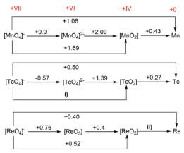
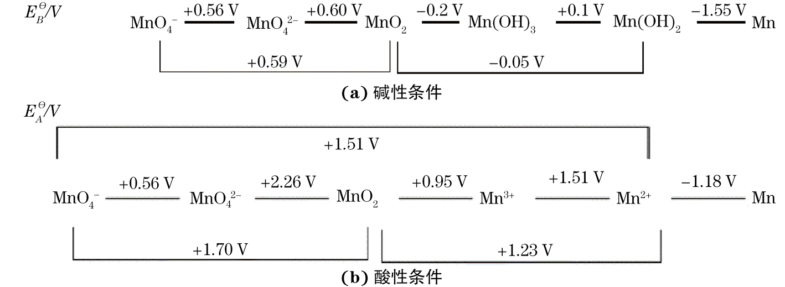

# 前言
锰(Mn)位于**锰副族元素**,后者位于$VIIB$族,包括锰(Mn),锝(Tc),铼(Re)和𬭛(Bh)四种过渡金属元素.

锰的成矿主要以**氧化物**形式出现:
- 软锰矿$\ce{MnO2}$
- 黑锰矿$\ce{Mn3O4}$
- 方锰矿$\ce{MnO}$
- 菱锰矿$\ce{MnCO3}$

锰副族元素基态原子的价层电子构型:$(n-1)d^5ns^2$,最高氧化态为$+7$. 该族元素中锰的氧化态最丰富多彩,且$+2$氧化态是最常见,最稳定的,其中$\ce{Mn^2+}$存在于固体,溶液和配位化合物中,$Mn(VII)$有强氧化性.

不同于$Mn$的特点,$Tc,Re$的$+7$氧化态是最常见,最稳定的,仅显微弱的氧化性,而$+2$和更低氧化态不稳定且是强还原剂.

总之,在锰副族元素中,自上而下:
- **高氧化态**稳定性**递增**
- **低氧化态**稳定性**递减**

言归正传,本文是锰副族元素的开端,只研究锰元素.

# 单质
金属锰呈银白色,暴露在空气中的锰,以及粉末状的锰都是灰色的.

铝热反应还原$\ce{MnO2/Mn3O4}$可以制备纯锰.

由电极电势$E^\ominus(Mn^{2+}/Mn)=-1.18V$知锰是活泼金属,能溶解在冷的非氧化性稀酸里,例如:

$$\ce{Mn + 2HCl(aq)->MnCl2 + H2 ^}$$

在室温下,锰对非金属的反应活性不高,但加热时容易发生反应:
- 在空气中加热生成$\ce{Mn3O4}$
- 在高温下可与卤素,硫,碳,磷作用
- 与冷水几乎不反应,但与热水生成$\ce{Mn(OH)2}$并放出$\ce{H2}$(类似于金属镁)

# 化合物
常见的锰化合物:
- $Mn(II)$盐类
- $Mn(IV)$氧化物
- 高锰酸盐.

## Mn(II)
### 易溶盐
$Mn(II)$的强酸盐易溶:
- $\ce{MnSO4}$
- $\ce{MnCl2}$
- $\ce{Mn(NO3)2}$

$\ce{Mn^2+}$的5个d电子平行自旋,电子$d-d$跃迁概率小,化合物颜色一般较浅.
- 浓$\ce{Mn^2+}$溶液为粉红色
- 稀溶液接近无色

$\ce{Mn^2+}$水合盐多数是粉红色或玫瑰色的,如:
- $\ce{MnSO4.7H2O}$
- $\ce{MnCl2.6H2O}$

以下的无水盐为白色:
- $\ce{MnSO4}$
- $\ce{Mn(NO3)2}$
## 难溶性化合物
$Mn(II)$的氢氧化物和多数弱酸盐难溶.
- $\ce{MnCO3}$:粉色
- $\ce{Mn(OH)2}$:白色
- $\alpha-\ce{MnS}$:绿色
- $\ce{MnC2O4.2H2O}$:白色

这些物质易溶于强酸中,这是过渡元素的一般规律.

需要注意的是,$\ce{MnS}$难溶于水,但溶于弱酸(e.g. $\ce{HAc}$),故不能在酸性溶液中沉淀

## 还原性
在**碱性**溶液中,$Mn(II)$还原性较强,极易被氧化为$Mn(IV)$.

$$E^\ominus[\ce{MnO2/Mn(OH)2}]=-0.05V,E^\ominus(\ce{O2/OH-})=0.40V$$

氨水,强碱都可以让$\ce{Mn^2+}$转化为碱性,近白色$\ce{Mn(OH)2}$.

$\ce{Mn(OH)2}$极易被氧化,甚至水中少量溶解氧也可以将其氧化为棕黑色的$\ce{MnO(OH)2}$(或者写作$\ce{MnO2.H2O,H2MnO3}$),此反应可以用来测定溶解氧.

$\ce{MnS,MnCO3,MnC2O4}$沉淀在空气中放置或加热,都会被空气中的氧气氧化为$\ce{MnO(OH)2}$.

$$\ce{MnS + O2 + H2O -> MnO(OH)2 + S}$$

$$\ce{2MnCO3 + O2 + 2H2O ->[\triangle] 2MnO(OH)2 + 2CO2}$$

在**酸性**溶液中,$Mn(II)$的还原性较弱:

$$E^\ominus(\ce{MnO4-/Mn^2+)=1.51V}$$

强氧化剂可以把$\ce{Mn^2+}$氧化为$\ce{MnO4-}$:
- $\ce{S2O8^2-->[Ag+]SO4^2-}$
- $\ce{BiO3-->Bi^3+}$
- $\ce{PbO2->Pb^2+}$

其中,前两个反应常用于鉴定$\ce{Mn^2+}$.

注意,$\ce{c(Mn^2+)}$不宜过大(特别是反应1),否则$\ce{Mn^2+}$容易与$\ce{MnO4-}$发生归中反应,生成棕黑色的$\ce{MnO2}$.

$Mn(II)$盐受热分解,若酸根有氧化性,则$Mn(II)$被氧化:

$$\ce{Mn(NO3)2->[\triangle]MnO2 + 2NO2 ^}$$

$$\ce{Mn(ClO4)2 ->[\triangle] MnO2 + Cl2 ^ + 3O2 ^}$$

类比一下,高氯酸亚硝酰$\ce{NOClO4}$的一种分解方式为:

$$\ce{2NOClO4 ->[\triangle] N2O4 + Cl2 ^ + 3O2 ^}$$