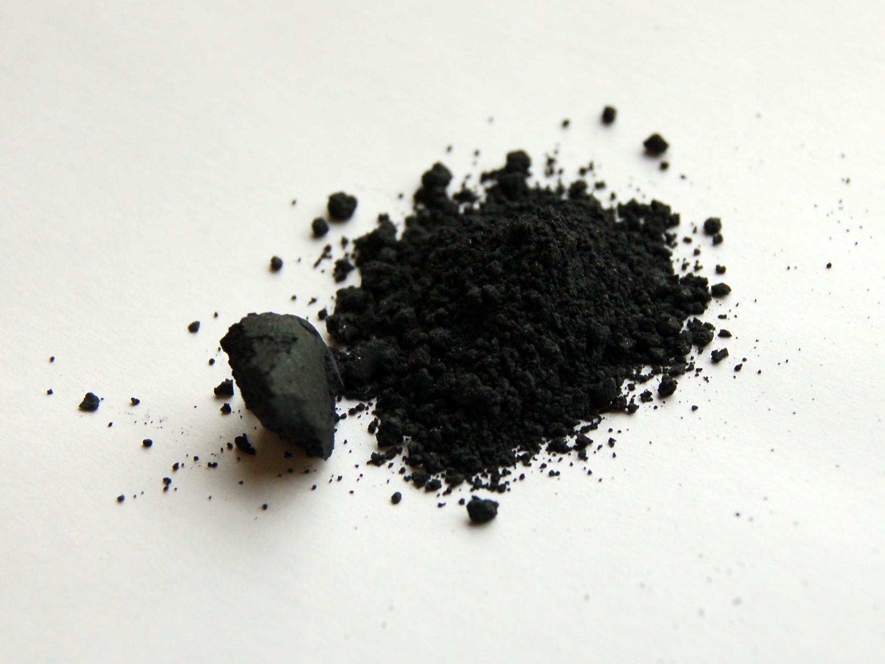
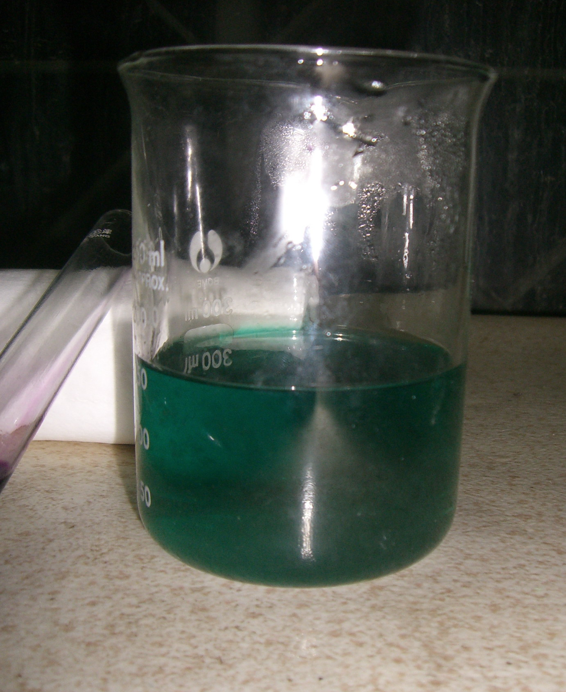
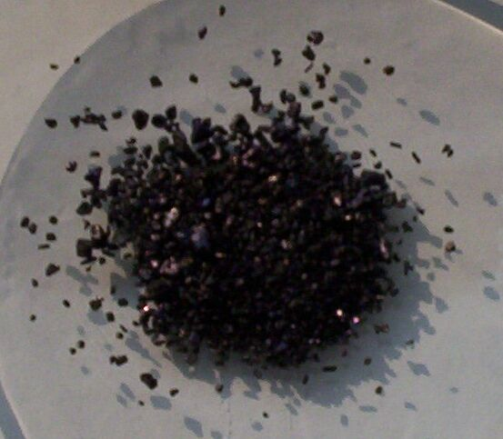
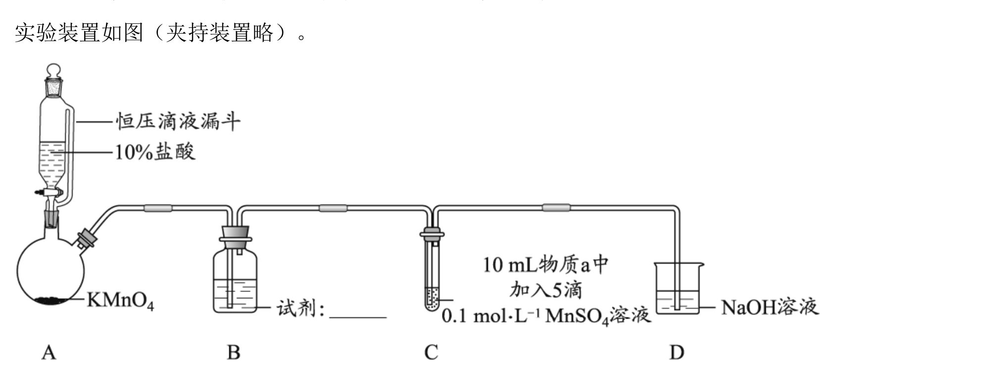
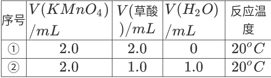

# Abstract
锰(Mn)位于**锰副族元素**,后者位于$VIIB$族,包括锰(Mn),锝(Tc),铼(Re)和𬭛(Bh)四种过渡金属元素.

锰的成矿主要以**氧化物**形式出现:
- 软锰矿$\ce{MnO2}$
- 黑锰矿$\ce{Mn3O4}$
- 方锰矿$\ce{MnO}$
- 菱锰矿$\ce{MnCO3}$

锰副族元素基态原子的价层电子构型:$(n-1)d^5ns^2$,最高氧化态为$+7$. 该族元素中锰的氧化态最丰富多彩,且$+2$氧化态是最常见,最稳定的,其中$\ce{Mn^2+}$存在于固体,溶液和配位化合物中,$Mn(VII)$有强氧化性.

不同于$Mn$的特点,$Tc,Re$的$+7$氧化态是最常见,最稳定的,仅显微弱的氧化性,而$+2$和更低氧化态不稳定且是强还原剂.

总之,在锰副族元素中,自上而下:
- **高氧化态**稳定性**递增**
- **低氧化态**稳定性**递减**

=+0.74 V 和 E°(ReO₂/Re)=+0.31 V 按官方答案补全。")

₃ 为 +0.10 V，Mn(OH)₃/Mn(OH)₂ 为 −0.20 V。")

言归正传,本文是锰副族元素的开端,只研究锰元素.

# 单质
金属锰呈银白色,暴露在空气中的锰,以及粉末状的锰都是灰色的.

铝热反应还原$\ce{MnO2/Mn3O4}$可以制备纯锰.

由电极电势$E^\ominus(Mn^{2+}/Mn)=-1.18V$知锰是活泼金属,能溶解在冷的非氧化性稀酸里,例如:

$$\ce{Mn + 2HCl(aq)->MnCl2 + H2 ^}$$

在室温下,锰对非金属的反应活性不高,但加热时容易发生反应:
- 在空气中加热生成$\ce{Mn3O4}$
- 在高温下可与卤素,硫,碳,磷作用
- 与冷水几乎不反应,但与热水生成$\ce{Mn(OH)2}$并放出$\ce{H2}$(类似于金属镁)

# $Mn(II)$化合物
常见的锰化合物:
- $Mn(II)$盐类
- $Mn(IV)$氧化物
- 高锰酸盐.

## Mn(II)
### 易溶盐
$Mn(II)$的强酸盐易溶:
- $\ce{MnSO4}$
- $\ce{MnCl2}$
- $\ce{Mn(NO3)2}$

$\ce{Mn^2+}$的5个d电子平行自旋,电子$d-d$跃迁概率小,化合物颜色一般较浅.
- 浓$\ce{Mn^2+}$溶液为粉红色
- 稀溶液接近无色

$\ce{Mn^2+}$水合盐多数是粉红色或玫瑰色的,如:
- $\ce{MnSO4.7H2O}$
- $\ce{MnCl2.6H2O}$

以下的无水盐为白色:
- $\ce{MnSO4}$
- $\ce{Mn(NO3)2}$
## 难溶性化合物
$Mn(II)$的氢氧化物和多数弱酸盐难溶.
- $\ce{MnCO3}$:粉色
- $\ce{Mn(OH)2}$:白色
- $\alpha-\ce{MnS}$:绿色
- $\ce{MnC2O4.2H2O}$:白色

这些物质易溶于强酸中,这是过渡元素的一般规律.

需要注意的是,$\ce{MnS}$难溶于水,但溶于弱酸(e.g. $\ce{HAc}$),故不能在酸性溶液中沉淀

## 还原性
在**碱性**溶液中,$Mn(II)$还原性较强,极易被氧化为$Mn(IV)$.

$$E^\ominus[\ce{MnO2/Mn(OH)2}]=-0.05V,E^\ominus(\ce{O2/OH-})=0.40V$$
$$
\mathrm{Mn^{2+}} \xrightarrow{\mathrm{OH^-}} \mathrm{Mn(OH)_2} \text{ (white)} \xrightarrow{\mathrm{O_2}} \mathrm{MnO(OH)} \text{ (brown)} \xrightarrow{\mathrm{O_2}} \mathrm{MnO_2 \cdot nH_2O}
$$
氨水,强碱都可以让$\ce{Mn^2+}$转化为碱性,近白色$\ce{Mn(OH)2}$.

$\ce{Mn(OH)2}$极易被氧化,甚至水中少量溶解氧也可以将其氧化为棕黑色的$\ce{MnO(OH)2}$(或者写作$\ce{MnO2.H2O,H2MnO3}$),此反应可以用来测定溶解氧.

$\ce{MnS,MnCO3,MnC2O4}$沉淀在空气中放置或加热,都会被空气中的氧气氧化为$\ce{MnO(OH)2}$.

$$\ce{MnS + O2 + H2O -> MnO(OH)2 + S}$$

$$\ce{2MnCO3 + O2 + 2H2O ->[\triangle] 2MnO(OH)2 + 2CO2}$$

无氧环境中，MnO 可由 MnC₂O₄ 和 MnCO₃ 热分解制得.

$$
\mathrm{MnC_2O_4(s)} \ce{->[\Delta]} \mathrm{MnO(s)} + \mathrm{CO(g)} + \mathrm{CO_2(g)}
$$

$$
\mathrm{MnCO_3(s)} \ce{->[\Delta]} \mathrm{MnO(s)} + \mathrm{CO_2(g)}
$$

在**酸性**溶液中,$Mn(II)$的还原性较弱:

$$E^\ominus(\ce{MnO4-/Mn^2+)=1.51V}$$

强氧化剂可以把$\ce{Mn^2+}$氧化为$\ce{MnO4-}$:
- $\ce{S2O8^2-->[Ag+]SO4^2-}$
- $\ce{BiO3-->Bi^3+}$
- $\ce{PbO2->Pb^2+}$

其中,前两个反应常用于鉴定$\ce{Mn^2+}$.

注意,$\ce{c(Mn^2+)}$不宜过大(特别是反应1),否则$\ce{Mn^2+}$容易与$\ce{MnO4-}$发生归中反应,生成棕黑色的$\ce{MnO2}$.

$Mn(II)$盐受热分解,若酸根有氧化性,则$Mn(II)$被氧化:

$$\ce{Mn(NO3)2->[\triangle]MnO2 + 2NO2 ^}$$

$$\ce{Mn(ClO4)2 ->[\triangle] MnO2 + Cl2 ^ + 3O2 ^}$$

类比一下,高氯酸亚硝酰$\ce{NOClO4}$的一种分解方式为:

$$\ce{2NOClO4 ->[\triangle] N2O4 + Cl2 ^ + 3O2 ^}$$

## 配位化合物
### 弱场配体:高自旋八面体配位化合物
$\ce{Mn^2+}$电子组态$3d^5$,与**弱场配体**形成的高自旋八面体配位化合物,电子排布为$\ce{(t_{2g})^3}(e_g)^2$,晶体场稳定化能为0.

水合离子$\ce{[Mn(H2O)6]^2+}$呈极浅的粉红色(浓度小于1M时几乎不可见),这是因为在这类高自旋化合物中,d-d跃迁不仅需要电子从低能级跃迁至高能级,还改变了电子自旋方向,这种跃迁称为**自旋禁阻**(spin forbidden). 发生这种跃迁的几率很小,所以吸收可见光的机会很小.
### 弱场配体:高自旋四面体配位化合物
$\ce{Mn^2+}$在乙醇溶液中生成黄色的$\ce{[MnX_4]^2-(X=Cl,Br,I)}$,电子排布为$(e)^2(t_2)^3$,$CFSE=0$
### 弱场配体:低自旋八面体配位化合物

只有 Mn$^{(II)}$ 与一些强的配体才能形成低自旋的有颜色的配合物，如蓝紫色的$[Mn(CN)_6]^{4-}$,电子排布为$(e)^5(t2)^0$,$CFSE=(2\Delta-2P)$,此化合物在空气中容易被氧化为棕红色的$[Mn(CN)_6]^{3-}$.

# $Mn(III)$化合物
$\mathrm{MnO_2} \xrightarrow{+0.95\ \mathrm{V}} \mathrm{Mn^{3+}} \xrightarrow{+1.51\ \mathrm{V}} \mathrm{Mn^{2+}}$

由元素电势图,$Mn(III)$氧化性强,在溶液中不稳定,易歧化.

重要的$Mn(III)$化合物:
- $\ce{Mn(CH3COO)3.3H2O}$:紫红色
- $\ce{MnF3}$:紫红色,由$\ce{MnF2}$和$\ce{F2}$反应得到
- $\ce{Mn2O3}$:黑色,由$\ce{MnO2}$在低于800℃下加热得到

重要的$Mn(III)$配位化合物:
- $\ce{[Mn(CN)6]^3-}$:棕红色
- $\ce{[Mn(PO4)2]^3-}$:紫色

# $Mn(IV)$的化合物
$\ce{MnO2}$粉末呈黑色,在溶液中生成的沉淀为棕黑色的水合物$\ce{MnO2.H2O}$.

$\ce{MnO2}$在通常情况下很稳定,不溶于$\ce{H2O}$,稀酸和稀碱,且在酸和碱中不歧化. 但$\ce{MnO2}$是两性氧化物,可以与浓酸,浓碱缓慢反应.

$\ce{MnO2}$与$\ce{NaOH}$隔绝空气共熔,生成亚锰酸盐$\ce{Na2MnO3}$.

$$\ce{MnO2 + 2NaOH ->[\Delta]Na2MnO3 + H2O}$$

$\ce{MnO2}$与$\ce{NaOH}$也能部分发生相同反应,说明$\ce{MnO2}$具有酸性.

$Mn(IV)$处于中间氧化态,既可以作氧化剂也可以做还原剂.

在强酸中,$\ce{MnO2}$有较强的氧化性,可以把$I^-$氧化为$I_2$,把$\ce{Fe^2+}$氧化为$\ce{Fe^3+}$,而且与浓盐酸混合后加热将生成氯气.

将盛 $\mathrm{MnO_2}$ 粉末和浓 $\mathrm{H_2SO_4}$ 混合物的试管水浴加热一段时间，冷却并静止后，试管上部呈紫红色，说明有 $\mathrm{Mn^{3+}}$ 生成：

$$
4\mathrm{MnO_2} + 6\mathrm{H_2SO_4}(\text{浓}) \xlongequal{\Delta} 2\mathrm{Mn_2(SO_4)_3} + 6\mathrm{H_2O} + \mathrm{O_2} \uparrow
$$

$\mathrm{Mn^{3+}}$ 不稳定，温度升高则转化为更稳定的 $\mathrm{Mn^{2+}}$：

$$
2\mathrm{Mn_2(SO_4)_3} + 2\mathrm{H_2O} \xlongequal{\Delta} 4\mathrm{MnSO_4} + \mathrm{O_2} \uparrow + 2\mathrm{H_2SO_4}
$$

在碱性条件下，$\mathrm{MnO_2}$ 可被氧化至 $\mathrm{Mn(VI)}$。$\mathrm{MnO_2}$ 与碱混合后加入氯酸钾(2026北京化学高考)、硝酸钾等氧化剂（或利用空气中的 $\mathrm{O_2}$），加热共熔则被氧化为 $\mathrm{Mn(VI)}$，例如：

$$
3\mathrm{MnO_2} + 6\mathrm{KOH} + \mathrm{KClO_3} \xlongequal{\text{共熔}} 3\mathrm{K_2MnO_4} + \mathrm{KCl} + 3\mathrm{H_2O}
$$

$$
2\mathrm{MnO_2} + 4\mathrm{KOH} + \mathrm{O_2} \xlongequal{\text{共熔}} 2\mathrm{K_2MnO_4} + 2\mathrm{H_2O}
$$
# $Mn(VI)$的化合物
Mn(Ⅵ)的化合物中，比较稳定的是锰酸钾（$\mathrm{K_2MnO_4}$），深绿色晶体，在190 ℃分解为亚锰酸钾($\ce{K2MnO3}$)和氧气，Mn(Ⅵ)在强碱溶液中较稳定。

$\ce{MnO4^2-}$ 只在浓强碱中较稳定；酸化或降低碱度时会发生歧化。该反应按酸性介质和水溶液形式可分别写为：

$$
\ce{3MnO4^2- + 4H+ -> 2MnO4^- + MnO2 v + 2H2O}
$$

$$
\ce{3MnO4^2- + 2H2O -> 2MnO4^- + MnO2 v + 4OH^-}
$$

后一式生成 $\ce{OH^-}$，因此提高碱度会使平衡向左移动；只有在浓度较大的强碱中（$\mathrm{pH}>14$）锰酸钾才稳定。

将 $\mathrm{MnO_2}$ 与 $\mathrm{KClO_3}$、$\mathrm{KOH}$ 混合后放入干燥试管中加热共熔，得到绿色产物，冷却至室温后加入少量水得绿色溶液，说明生成了锰酸钾；再加入大量水则溶液立即变紫红色并有棕色沉淀生成，说明加入大量水时碱的浓度降低，锰酸钾发生了歧化反应生成 $\mathrm{MnO_4^-}$ 和 $\mathrm{MnO_2}$。

需要注意,这样生产高锰酸钾,会有三分之一的锰元素被浪费(2026北京化学高考).

# $Mn(VII)$的化合物

最重要的 $\mathrm{Mn}(\mathrm{VII})$ 化合物是高锰酸钾 ($\mathrm{KMnO_4}$)，紫黑色晶体。其水溶液的颜色与浓度有关，按浓度由低到高依次呈粉红色、红色、紫红色、紫色、紫黑色。高锰酸钠 ($\mathrm{NaMnO_4}$) 易潮解，也不易提纯。

## 强氧化性

$\mathrm{KMnO_4}$ 是最重要和最常用的氧化剂之一，它的氧化能力和还原产物因介质的酸碱性不同而不同：在强酸性溶液中被还原成 $\mathrm{Mn^{2+}}$，在强碱性溶液中被还原成 $\mathrm{MnO_4^{2-}}$，在近中性溶液中则被还原成 $\mathrm{MnO_2}$，因为这些产物在相应的介质中稳定。如 $\mathrm{KMnO_4}$ 与 $\mathrm{S}(\mathrm{IV})$ 的反应：

酸性 $\quad 2\mathrm{MnO_4^-} + 5\mathrm{H_2SO_3} \xlongequal{} 2\mathrm{Mn^{2+}} + 5\mathrm{SO_4^{2-}} + 4\mathrm{H^+} + 3\mathrm{H_2O}$

中性 $\quad 2\mathrm{MnO_4^-} + \mathrm{H_2O} + 3\mathrm{SO_3^{2-}} \xlongequal{} 2\mathrm{MnO_2} \downarrow + 3\mathrm{SO_4^{2-}} + 2\mathrm{OH^-}$

碱性 $\quad 2\mathrm{MnO_4^-} + 2\mathrm{OH^-} + \mathrm{SO_3^{2-}} \xlongequal{} 2\mathrm{MnO_4^{2-}} + \mathrm{SO_4^{2-}} + \mathrm{H_2O}$

在酸性溶液中，$\mathrm{KMnO_4}$ 是很强的氧化剂：

$$\mathrm{MnO_4^-} + 8\mathrm{H^+} + 5\mathrm{e^-} \xlongequal{} \mathrm{Mn^{2+}} + 4\mathrm{H_2O} \quad E^\ominus = 1.51 \text{ V}$$

它可以氧化 $\mathrm{Cl^-}, \mathrm{Cr^{3+}}, \mathrm{I_2}$ 等：

$$2\mathrm{MnO_4^-} + 16\mathrm{H^+} + 10\mathrm{Cl^-} \xlongequal{} 2\mathrm{Mn^{2+}} + 5\mathrm{Cl_2} \uparrow + 8\mathrm{H_2O}$$

$$6\mathrm{MnO_4^-} + 10\mathrm{Cr^{3+}} + 11\mathrm{H_2O} \xlongequal{} 6\mathrm{Mn^{2+}} + 5\mathrm{Cr_2O_7^{2-}} + 22\mathrm{H^+}$$

$$2\mathrm{MnO_4^-} + \mathrm{I_2} + 4\mathrm{H^+} \xlongequal{} 2\mathrm{Mn^{2+}} + 2\mathrm{IO_3^-} + 2\mathrm{H_2O}$$

$\mathrm{KMnO_4}$ 与盐酸反应可用于实验室制备氯气，但不能实现随制随停，加之 $\mathrm{KMnO_4}$ 比 $\mathrm{MnO_2}$ 价格高，故实验室更多采用 $\mathrm{MnO_2}$ 与浓盐酸反应制备氯气。

酸性条件下，$\mathrm{KMnO_4}$ 与 $\mathrm{H_2C_2O_4}$ 定量反应，可用于标定 $\mathrm{KMnO_4}$ 溶液的浓度：

$$2\mathrm{MnO_4^-} + 6\mathrm{H^+} + 5\mathrm{H_2C_2O_4} \xlongequal{} 2\mathrm{Mn^{2+}} + 10\mathrm{CO_2} \uparrow + 8\mathrm{H_2O}$$

$\mathrm{KMnO_4}$ 与 $\mathrm{Fe^{2+}}$ 定量反应，可用于测定 $\mathrm{Fe^{2+}}$ 的含量：

在容量分析中，$\mathrm{KMnO_4}$ 常用作氧化还原滴定剂。在酸性溶液中，$\mathrm{MnO_4^-}$ 被还原成 $\mathrm{Mn^{2+}}$。在滴定过程中 $\mathrm{MnO_4^-}$ 过量则溶液立即变红，而稀的 $\mathrm{Mn^{2+}}$ 溶液基本是无色的，不影响终点的判断。滴定剂自身起着指示剂的作用。

$\mathrm{KMnO_4}$ 作为一种氧化剂被应用于许多有机制备反应中，如糖精、抗坏血酸（维生素 C）和烟酸等的制备。它也可以用于消毒及处理饮用水和工业用水。

## 不稳定性

高锰酸盐氧化性强，不稳定，在酸性溶液中明显分解，在中性或微碱性溶液中缓慢分解：

$$4\mathrm{MnO_4^-} + 4\mathrm{H^+} \xlongequal{} 4\mathrm{MnO_2} \downarrow + 3\mathrm{O_2} \uparrow + 2\mathrm{H_2O}$$

$$4\mathrm{MnO_4^-} + 4\mathrm{OH^-} \xlongequal{} 4\mathrm{MnO_4^{2-}} + \mathrm{O_2} \uparrow + 2\mathrm{H_2O}$$

光对高锰酸钾分解起催化作用，因此高锰酸钾溶液应当储存在棕色瓶中。由于分解反应的存在，其浓度会随时间而变化，所以高锰酸钾标准溶液需在使用前重新标定。

在固相中高锰酸盐稳定性比在溶液中高，但受热时也将分解。大约 $200\ ^\circ\mathrm{C}$ 时分解为 $\mathrm{K_2MnO_4}$ 和 $\mathrm{MnO_2}$，并放出 $\mathrm{O_2}$：

$$2\mathrm{KMnO_4(s)} \xlongequal{200\ ^\circ\mathrm{C}} \mathrm{K_2MnO_4} + \mathrm{MnO_2} + \mathrm{O_2} \uparrow$$

将 $\mathrm{KMnO_4}$ 放入干燥试管中小火加热，有爆鸣声，爆鸣声停止后，观察到固体不再有原来的晶体光泽；向试管中加入少量水后摇动试管，试管壁呈绿色，说明 $\mathrm{KMnO_4}$ 分解产物中有 $\mathrm{K_2MnO_4}$。加入大量水后溶液立即变为紫色的，因为 $\mathrm{K_2MnO_4}$ 歧化，有 $\mathrm{KMnO_4}$ 生成。

$\mathrm{KMnO_4}$ 和冷的浓硫酸作用生成暗绿色油状七氧化二锰（$\mathrm{Mn_2O_7}$）：

$$2\mathrm{KMnO_4} + \mathrm{H_2SO_4(浓)} \xlongequal{低温} \mathrm{Mn_2O_7} + \mathrm{K_2SO_4} + \mathrm{H_2O}$$

$\mathrm{Mn_2O_7}$ 遇有机物即燃烧，受热爆炸分解，常温下缓慢放出 $\mathrm{O_2}$，转化为 $\mathrm{MnO_2}$。

## 高锰酸钾的制备

高锰酸钾的制备经常以软锰矿 $\mathrm{MnO_2}$ 为原料。

首先制取锰酸钾，将 $\mathrm{MnO_2}$ 与 $\mathrm{KClO_3}$、$\mathrm{KOH}$ 的混合物加热共熔(2026北京化学高考)，得到绿色产物锰酸钾：

$$3\mathrm{MnO_2} + 6\mathrm{KOH} + \mathrm{KClO_3} \xlongequal{共熔} 3\mathrm{K_2MnO_4} + \mathrm{KCl} + 3\mathrm{H_2O}$$

用强氧化剂氧化 $\mathrm{K_2MnO_4}$，可以得到 $\mathrm{KMnO_4}$。例如，使用氯气为氧化剂：

$$2 \mathrm { M n O _ { 4 } ^ { 2 - } } + \mathrm { C l _ { 2 } } \xlongequal { } 2 \mathrm { M n O _ { 4 } ^ { - } } + 2 \mathrm { C l ^ { - } }$$

生产中经常采用电解法, 电解 $\mathrm{K}_{2} \mathrm{MnO}_{4}$ 溶液得到 $\mathrm{KMnO}_{4}$ :

阳极反应 $\quad \mathrm{MnO}_{4}^{2-} \xlongequal { } \mathrm{MnO}_{4}^{-}+\mathrm{e}^{-}$

阴极反应 $\quad 2 \mathrm{H}_{2} \mathrm{O}+2 \mathrm{e}^{-} \xlongequal { } \mathrm{H}_{2}+2 \mathrm{OH}^{-}$

总反应 $\quad 2 \mathrm{~K}_{2} \mathrm{MnO}_{4}+2 \mathrm{H}_{2} \mathrm{O} \xlongequal { \text { 通电 } } 2 \mathrm{KMnO}_{4}+2 \mathrm{KOH}+\mathrm{H}_{2} \uparrow$

# 真题操练
## 溶液酸碱性对 $\ce{Mn(II)}$ 还原性的影响

**（2022 北京化学高考第 19 题，根据真题整理）**

某实验小组探究不同条件下氯气与二价锰化合物的反应。

**资料：**

i. $\ce{Mn^2+}$ 在一定条件下可被 $\ce{Cl2}$ 或 $\ce{ClO^-}$ 氧化为 $\ce{MnO2}$（棕黑色）、$\ce{MnO4^2-}$（绿色）或 $\ce{MnO4^-}$（紫色）。

ii. 浓碱性条件下，$\ce{MnO4^-}$ 可被 $\ce{OH^-}$ 还原为 $\ce{MnO4^2-}$。

iii. $\ce{Cl2}$ 的氧化性与溶液的酸碱性无关；$\ce{NaClO}$ 的氧化性随碱性增强而减弱。

实验装置如下（夹持装置略）：

装置 C 中先加入 $10\ \mathrm{mL}$ 物质 a 和 5 滴 $0.1\ \mathrm{mol\cdot L^{-1}}$ $\ce{MnSO4}$ 溶液，再通入装置 A 制得并经 B 洗涤的 $\ce{Cl2}$。实验现象如下。

| 序号 | 物质 a | 通入 $\ce{Cl2}$ 前 | 通入 $\ce{Cl2}$ 后 |
| --- | --- | --- | --- |
| Ⅰ | 水 | 得到无色溶液 | 产生棕黑色沉淀，放置后不发生变化 |
| Ⅱ | $5\%$ $\ce{NaOH}$ 溶液 | 产生白色沉淀，在空气中缓慢变为棕黑色 | 棕黑色沉淀增多；放置后溶液变为紫色，仍有沉淀 |
| Ⅲ | $40\%$ $\ce{NaOH}$ 溶液 | 产生白色沉淀，在空气中缓慢变为棕黑色 | 棕黑色沉淀增多；放置后溶液变为紫色，仍有沉淀 |

（1）装置 B 中的试剂是<u class="answer-reveal">饱和 $\ce{NaCl}$ 溶液</u>。

（2）通入 $\ce{Cl2}$ 前，实验Ⅱ、Ⅲ中白色沉淀在空气中变为棕黑色的化学方程式为<u class="answer-reveal">$\ce{2Mn(OH)2 + O2 -> 2MnO2 + 2H2O}$</u>。

（3）对比实验Ⅰ、Ⅱ通入 $\ce{Cl2}$ 后的现象，对于二价锰化合物还原性的认识是<u class="answer-reveal">二价锰化合物在中性或弱酸性条件下只能被氧化到 $\ce{MnO2}$，在碱性条件下可以被氧化到更高价态</u>。

（4）根据资料 ii，实验Ⅲ本应得到绿色溶液，实际却得到紫色溶液。研究小组提出两种解释：

- 原因一：通入 $\ce{Cl2}$ 使溶液碱性减弱；
- 原因二：氧化剂过量，将 $\ce{MnO4^2-}$ 继续氧化为 $\ce{MnO4^-}$。

① 可能导致溶液碱性减弱的化学方程式为<u class="answer-reveal">$\ce{2NaOH + Cl2 -> NaCl + NaClO + H2O}$</u>。实验测得溶液的碱性变化很小。

② 取实验Ⅲ放置后的 $1\ \mathrm{mL}$ 悬浊液，加入 $4\ \mathrm{mL}$ $40\%$ $\ce{NaOH}$ 溶液，溶液紫色迅速变为绿色，且绿色缓慢加深。溶液紫色迅速变为绿色的离子方程式为<u class="answer-reveal">$\ce{4MnO4^- + 4OH^- -> 4MnO4^2- + O2 ^ + 2H2O}$</u>；溶液绿色缓慢加深，是因为 $\ce{MnO2}$ 被<u class="answer-reveal">$\ce{NaClO}$</u>氧化，可证明实验Ⅲ的悬浊液中氧化剂过量。

③ 另取实验Ⅲ放置后的 $1\ \mathrm{mL}$ 悬浊液，加入 $4\ \mathrm{mL}$ 水，溶液紫色缓慢加深，发生的反应为<u class="answer-reveal">$\ce{2MnO2 + 3ClO^- + 2OH^- -> 2MnO4^- + 3Cl^- + H2O}$</u>。

④ 从反应速率角度分析实验Ⅲ未得到绿色溶液的可能原因：<u class="answer-reveal">浓碱性条件下，$\ce{2MnO4^2- + ClO^- + H2O -> 2MnO4^- + Cl^- + 2OH^-}$ 的反应速率快于 $\ce{4MnO4^- + 4OH^- -> 4MnO4^2- + O2 ^ + 2H2O}$</u>。

## 高锰酸钾的制备、提纯与产率测定

**（2026 北京化学高考第 19 题，根据真题整理）**

实验小组制备高锰酸钾。

**资料：**

i. $\ce{K2MnO4}$ 为墨绿色固体，可溶于水，在强碱性条件下稳定；一定条件下发生歧化：

$$
\ce{3MnO4^2- + 2H2O -> 2MnO4^- + MnO2 v + 4OH^-}
$$

ii. 浓碱性条件下，$\ce{MnO4^-}$ 可被 $\ce{OH^-}$ 还原为 $\ce{MnO4^2-}$。

iii. $\ce{KMnO4}$ 的溶解度随温度升高而增大。

（1）**制备 $\ce{KMnO4}$**

| 步骤 | 实验 |
| --- | --- |
| Ⅰ 制备 $\ce{K2MnO4}$ | 将 $0.015\ \mathrm{mol}$ $\ce{KClO3}$、$0.030\ \mathrm{mol}$ $\ce{MnO2}$ 和 $0.080\ \mathrm{mol}$ $\ce{KOH}$ 三种固体在熔融状态下充分反应，得到墨绿色固体 X |
| Ⅱ 制备 $\ce{KMnO4}$ | 将 X 用水溶解，滴加 $3\ \mathrm{mol\cdot L^{-1}}$ $\ce{CH3COOH}$ 至 $\mathrm{pH}=10$（约 $20\ \mathrm{mL}$），溶液由绿色变为紫红色后过滤，得到约 $100\ \mathrm{mL}$ 溶液 Y 和棕黑色固体 |
| Ⅲ 提纯 $\ce{KMnO4}$ | 将 Y 转移至蒸发皿中，$90^\circ\mathrm{C}$ 水浴浓缩，冷却结晶、过滤、洗涤、干燥，得到紫红色固体 Z |

① 补全步骤Ⅰ的化学方程式：

<u class="answer-reveal">$\ce{KClO3 + 3MnO2 + 6KOH} \xlongequal{\text{熔融}} \ce{KCl + 3K2MnO4 + 3H2O}$</u>

② 步骤Ⅱ中，$\ce{K2MnO4}$ 随 pH 降低而发生歧化。若 $\ce{MnO4^2-}$ 的还原性不变，则其氧化性<u class="answer-reveal">增强</u>。

③ 取少量 Z 溶解，得到紫红色 $\ce{KMnO4}$ 溶液和少量棕黑色 $\ce{MnO2}$。

（2）**探究步骤Ⅲ中 $\ce{MnO2}$ 的来源**

① 甲同学认为 $\ce{CH3COO^-}$ 将 $\ce{MnO4^-}$ 还原。实验 i 用含 $0.2\ \mathrm{mol\cdot L^{-1}}$ $\ce{KMnO4}$ 和 $0.6\ \mathrm{mol\cdot L^{-1}}$ $\ce{CH3COOK}$、$\mathrm{pH}=10$ 的溶液代替 Y，重复步骤Ⅲ，所得固体中含 $\ce{MnO2}$。乙同学认为该现象不能证明 $\ce{CH3COO^-}$ 还原了 $\ce{MnO4^-}$，理由是<u class="answer-reveal">实验没有排除 $\ce{OH^-}$ 还原 $\ce{MnO4^-}$ 的干扰</u>。

② 乙设计并实施实验 ii：用<u class="answer-reveal">含 $0.2\ \mathrm{mol\cdot L^{-1}}$ $\ce{KMnO4}$ 且用 $\ce{KOH}$ 调节至 $\mathrm{pH}=10$ 的溶液</u>代替 Y 重复步骤Ⅲ，所得固体不含 $\ce{MnO2}$；实验 i 和 ii 证实了甲的观点。

③ 丙同学用 $0.15\ \mathrm{mol\cdot L^{-1}}$ $\ce{KCl}$ 代替 $\ce{CH3COOK}$ 重复实验 i，证实步骤Ⅲ中 $\ce{Cl^-}$ 不能还原 $\ce{MnO4^-}$。

（3）**测定 $\ce{KMnO4}$ 纯度并计算产率**

按步骤Ⅰ的投料量，经优化步骤制得产品。取产品的 $\frac14$ 配制成 $250\ \mathrm{mL}$ 待测液。在酸性条件下，用待测液滴定 $\ce{H2C2O4}$ 标准溶液，$\ce{MnO4^-}$ 被还原为 $\ce{Mn^2+}$。测得待测液中 $c(\ce{KMnO4})=a\ \mathrm{mol\cdot L^{-1}}$。

① 滴定反应的离子方程式为<u class="answer-reveal">$\ce{2MnO4^- + 5H2C2O4 + 6H+ -> 2Mn^2+ + 10CO2 ^ + 8H2O}$</u>（$\ce{H2C2O4}$ 是二元弱酸）。

② $\ce{KMnO4}$ 的产率为<u class="answer-reveal">$5000a\%$</u>。[产率 $=\dfrac{\text{实际产量}}{\text{理论产量}}\times100\%$]

## $\mathrm{Na}$ 与 $\mathrm{KMnO_4}$溶液的反应
(2023海淀二模:9)某小组同学探究溶液中的 $\mathrm{MnO_4^-}$ 能否被金属钠还原，进行实验：

①在干燥试管中加入绿豆大小的金属钠，逐滴滴加 $1\mathrm{mL}\ 0.001\mathrm{mol \cdot L^{-1}}\ \mathrm{KMnO_4}$ 溶液，产生无色气体，溶液由紫红色变为浅绿色（$\mathrm{MnO_4^{2-}}$）。

②向 $1\mathrm{mL}\ 0.001\mathrm{mol \cdot L^{-1}}\ \mathrm{KMnO_4}$ 溶液中持续通入 $\mathrm{H_2}$，水浴加热，溶液颜色无明显变化。

③向 $1\mathrm{mL}\ 0.001\mathrm{mol \cdot L^{-1}}\ \mathrm{KMnO_4}$ 溶液中加入 $\mathrm{NaOH}$ 固体，溶液由紫红色变为浅绿色。下列说法**不正确**的是

A. 实验①中还可能观察到钠块浮在溶液表面，剧烈燃烧，发出黄色火焰

B. 实验②中的现象说明实验①中溶液变色的原因与产生的气体无关

C. 实验③中的现象说明实验①中可能发生的反应：
$$4\mathrm{MnO_4^-} + 4\mathrm{OH^-} \xlongequal{} 4\mathrm{MnO_4^{2-}} + \mathrm{O_2} \uparrow + 2\mathrm{H_2O}$$

D. 上述实验能证明溶液中的 $\mathrm{MnO_4^-}$ 可以被金属钠还原

A:现象类似于钠单质与水的反应,合理.

B:②可以说明氢气不能还原$\mathrm{KMnO_4}$,且考虑了Na与水的反应放热,合理

C:推测符合逻辑,且与元素化学知识相符,合理

**D**:不能排除C中反应导致$\mathrm{MnO_4^-}$被还原,不合理.

## $\mathrm{Na_2S}$ 与 $\mathrm{KMnO_4}$ 溶液的反应

某小组同学探究 $\mathrm{Na_2S}$ 与 $\mathrm{KMnO_4}$ 溶液的反应，实验如下。

**资料：**

i. $(x-1)\mathrm{S}+\mathrm{S^{2-}}\rightleftharpoons \mathrm{S_x^{2-}}$（黄色）

ii. $\mathrm{MnO_4^{2-}}$ 呈绿色（酸性条件下不稳定）、低浓度 $\mathrm{Mn^{2+}}$ 呈无色、$\mathrm{MnS}$ 为肉色沉淀。

iii. $2\mathrm{Mn(OH)_2}$（白色）$+\mathrm{O_2}\xlongequal{}2\mathrm{MnO_2}$（棕黑色）$+2\mathrm{H_2O}$

**实验Ⅰ：**

（1）用离子方程式表示$\ce{Na2S}$溶液显碱性的原因：<u class="answer-reveal">$\ce{S^2- + H2O <=> HS^- + OH^-}$</u>。

（2）将固体 a 过滤、洗涤，放置在空气中，固体变为棕黑色。

① 甲同学认为固体 a 中除了 $\mathrm{MnS}$ 外，还有 $\mathrm{Mn(OH)_2}$，依据的现象是<u class="answer-reveal">固体a放置在空气中变为棕黑色</u>。

② 乙同学认为根据上述现象不能得出固体 a 中含有 $\mathrm{Mn(OH)_2}$，应补充对比实验：<u class="answer-reveal">将MnS放置在空气中,观察**相同时间内**是否变为棕黑色</u>（填实验方案）。实验证实固体 a 中含有 $\mathrm{Mn(OH)_2}$。

（3）固体 b 的主要成分是 $\mathrm{S}$。分析产生 $\mathrm{S}$ 的可能原因：<u class="answer-reveal">$\ce{S^2-}$、$\ce{S_x^2-}$、$\ce{MnS}$ 被酸性 $\ce{KMnO4}$ 溶液氧化生成 $\ce{S}$；$\ce{S_x^2-}$ 在酸性条件下转化为 $\ce{S}$</u>。

（4）经检验，固体 c 的主要成分是 $\mathrm{MnO_2}$。

① 分析产生 $\mathrm{MnO_2}$ 的可能原因：酸性条件下，$\mathrm{MnO_4^-}$ 将 $\mathrm{Mn^{2+}}$ 氧化。该反应的离子方程式是<u class="answer-reveal">$\ce{2MnO4^- + 3Mn^2+ + 2H2O -> 5MnO2 v + 4H+}$</u>。

② 继续滴加酸性 $\mathrm{KMnO_4}$ 溶液，溶液变为紫红色，仍有棕黑色固体。

**实验Ⅱ：** 改用未经酸化的 $\mathrm{KMnO_4}$ 溶液重复实验Ⅰ，产生棕黑色固体时溶液呈绿色。

（5）分析实验Ⅰ未见绿色的原因：取少量实验Ⅱ的绿色溶液，滴加硫酸，溶液变为紫红色，产生棕黑色固体。该反应的离子方程式是<u class="answer-reveal">$\ce{3MnO4^2- + 4H+ -> 2MnO4^- + MnO2 v + 2H2O}$</u>。

**实验Ⅲ：** 向未经酸化的 $\mathrm{KMnO_4}$ 溶液中滴加少量 $\mathrm{Na_2S}$，产生棕黑色沉淀，并检测到 $\mathrm{SO_4^{2-}}$。

（6）检验 $\mathrm{SO_4^{2-}}$ 的实验方案：<u class="answer-reveal">取少量反应后的上层溶液,加入$\ce{Ba(NO3)2}$(或$\ce{BaCl2}$)溶液,产生白色沉淀,**过滤**,向沉淀中加入过量盐酸,沉淀不溶解</u>（填操作和现象）。
> TIPS:高锰酸钾+浓盐酸=氯气

注：该实验条件下，$\mathrm{MnO_4^-}$ 与 $\mathrm{Ba^{2+}}$ 不反应。

（7）综合上述实验，$\mathrm{Na_2S}$ 与 $\mathrm{KMnO_4}$ 溶液反应的产物与<u class="answer-reveal">反应物用量,添加顺序,溶液pH</u>等因素有关（答出两点即可）。

## 锰及其化合物的工业应用

(2022东城一模)$\mathrm{Mn}$ 及其化合物在工业生产中具有重要的用途。

**Ⅰ.** 以含 $\mathrm{MnCO_3}$ 的矿石为原料，经硫酸溶解得到含 $\mathrm{Mn^{2+}}$ 的溶液，再经一系列处理后进行电解，获得金属 $\mathrm{Mn}$。

（1）$\mathrm{Mn}$ 在<u class="answer-reveal">阴极</u>（填“阳极”或“阴极”）生成。

（2）阳极泥中含有 $\mathrm{MnO_2}$，写出产生 $\mathrm{MnO_2}$ 的电极反应式：<u class="answer-reveal">$\ce{Mn^2+ - 2e^- + 2H2O -> MnO2 + 4H+}$</u>。

**Ⅱ.** 阳极泥中除含锰元素外，还含有铅元素，采用如下方法可将它们分别转化为活性 $\mathrm{MnO_2}$ 和 $\mathrm{PbO}$。

已知：$\mathrm{(CH_3COO)_2Pb}$ 在水中难解离。

（3）操作 X 为<u class="answer-reveal">过滤</u>。

（4）①中反应的离子方程式为<u class="answer-reveal">$\ce{PbO + 2CH3COO^- + 2NH4+ -> (CH3COO)2Pb + H2O + 2NH3}$</u>。

> TIPS:注意配位反应和酸碱反应的耦合

（5）溶液 C 能循环使用，②中溶液 B 的溶质为<u class="answer-reveal">$\ce{(NH4)2CO3}$</u>。

（6）

a. 为了将③中 $\mathrm{Mn_2O_3}$ 完全转化为 $\mathrm{MnO_2}$，理论上④中加入的 $\mathrm{NaClO_3}$ 与 $\mathrm{Mn_2O_3}$ 的物质的量之比为<u class="answer-reveal">1:3</u>（已知 $\mathrm{NaClO_3}$ 的还原产物为 $\mathrm{NaCl}$）。

b. 加入 $\mathrm{NaClO_3}$ 前，需将溶液 pH 调大至 6 左右。调节 pH 的目的是<u class="answer-reveal">防止pH较低时氯酸钠和二氧化锰将氯离子氧化为氯气</u>。

> TIPS:注意能斯特方程在氧化还原反应中的应用

（7）活性 $\mathrm{MnO_2}$ 纯度的测定：

i. 用 $V_1\ \mathrm{mL}$、$c_1\ \mathrm{mol\cdot L^{-1}}$ 的 $\mathrm{Na_2C_2O_4}$ 溶液（用 $\mathrm{H_2SO_4}$ 酸化）溶解 $w\ \mathrm{g}$ 活性 $\mathrm{MnO_2}$ 样品：

$$
\mathrm{MnO_2}+\mathrm{C_2O_4^{2-}}+4\mathrm{H^+}
\xlongequal{}
2\mathrm{CO_2}\uparrow+\mathrm{Mn^{2+}}+2\mathrm{H_2O}
$$

ii. 用 $c_2\ \mathrm{mol\cdot L^{-1}}$ 酸性 $\mathrm{KMnO_4}$ 标准溶液滴定 i 中剩余的 $\mathrm{C_2O_4^{2-}}$，消耗 $\mathrm{KMnO_4}$ 标准溶液 $V_2\ \mathrm{mL}$：

$$
5\mathrm{C_2O_4^{2-}}+2\mathrm{MnO_4^-}+16\mathrm{H^+}
\xlongequal{}
2\mathrm{Mn^{2+}}+10\mathrm{CO_2}\uparrow+8\mathrm{H_2O}
$$

样品中 $\mathrm{MnO_2}$ 的质量分数为<u class="answer-reveal">$\dfrac{87(0.2c_1V_1-0.5c_2V_2)}{2w}\%$</u>。

[$M(\mathrm{MnO_2})=87\ \mathrm{g\cdot mol^{-1}}$]

考虑得失电子守恒:

$$\begin{gathered}
    \ce{2n(MnO2) + 5n(MnO4^-) = 2n(C2O4^2-)}\\
    \ce{n(MnO2)=\frac{2n(C2O4^2-) - 5n(MnO4^-)}{2}\\
    =\frac{2c_1V_1\times10^{-3} - 5c_2V_2\times10^{-3}}{2}}\\
    \eta(MnO2)=\frac{\ce{n(MnO2)M(MnO2)}}{w}\times100\%\\
    =\frac{87(0.2c_1V_1-0.5c_2V_2)}{2w}\%
\end{gathered}$$

## $\mathrm{Mn^{2+}}$ 检测方法探究

(2022门头沟一模:19)某实验小组探究 $\mathrm{Mn^{2+}}$ 的检测方法。

查阅资料：$\mathrm{Mn^{2+}}$ 的稀溶液几乎无色，在酸性介质中，$\mathrm{S_2O_8^{2-}}$ 能将 $\mathrm{Mn^{2+}}$ 氧化成 $\mathrm{MnO_4^-}$。

（1）资料中检测 $\mathrm{Mn^{2+}}$ 方法的反应为<u class="answer-reveal">$\ce{2Mn^2+ + 5S2O8^2- + 8H2O -> 2MnO4^- + 10SO4^2- + 16H+}$</u>（用离子方程式表示）。

甲同学设计实验如下。

| 序号 | 实验操作 | 实验现象 |
| --- | --- | --- |
| Ⅰ | 向 $1\ \mathrm{mL}\ 0.002\ \mathrm{mol\cdot L^{-1}}$ $\mathrm{MnSO_4}$ 溶液中滴入 3 滴 $3\ \mathrm{mol\cdot L^{-1}}$ $\mathrm{H_2SO_4}$ 溶液，并加入一粒米大的 $\mathrm{K_2S_2O_8}$ 固体 | $5\ \mathrm{min}$ 无明显现象 |

（2）实验Ⅰ并未观察到预期现象，查阅资料，并进行以下实验。

| 序号 | 实验操作 | 实验现象 |
| --- | --- | --- |
| Ⅱ | 向 $1\ \mathrm{mL}\ 0.002\ \mathrm{mol\cdot L^{-1}}$ $\mathrm{MnSO_4}$ 溶液中滴入 3 滴 $3\ \mathrm{mol\cdot L^{-1}}$ $\mathrm{H_2SO_4}$ 溶液，并加入一粒米大的 $\mathrm{K_2S_2O_8}$ 固体，加热至沸腾 | 溶液变成棕黄色，$1\ \mathrm{min}$ 后出现紫红色 |
| Ⅲ | 向 $1\ \mathrm{mL}\ 0.002\ \mathrm{mol\cdot L^{-1}}$ $\mathrm{MnSO_4}$ 溶液中滴入 3 滴 $3\ \mathrm{mol\cdot L^{-1}}$ $\mathrm{H_2SO_4}$ 溶液，并加入一粒米大的 $\mathrm{K_2S_2O_8}$ 固体，再滴入 2 滴 $0.1\ \mathrm{mol\cdot L^{-1}}$ $\mathrm{AgNO_3}$ 溶液 | 溶液变成棕黄色，$5\ \mathrm{min}$ 后出现紫红色 |
| Ⅳ | 向 $1\ \mathrm{mL}\ 0.05\ \mathrm{mol\cdot L^{-1}}$ $\mathrm{MnSO_4}$ 溶液中滴入 3 滴 $3\ \mathrm{mol\cdot L^{-1}}$ $\mathrm{H_2SO_4}$ 溶液，并加入一粒米大的 $\mathrm{K_2S_2O_8}$ 固体，加热至沸腾 | 迅速生成棕黑色沉淀 |

① 对比实验Ⅱ、Ⅲ，推测实验Ⅰ无明显现象的原因<u class="answer-reveal">反应速率较慢</u>。

② 解释实验Ⅱ、Ⅲ中溶液变成棕黄色的原因<u class="answer-reveal">$\ce{S2O8^2-}$ 能将 $\ce{Mn^2+}$ 氧化为 $\ce{MnO4^-}$，但反应速度慢，生成的 $\ce{MnO4^-}$ 浓度相对较小；加热煮沸或者加入 $\ce{AgNO3}$ 溶液，反应速率加快</u>。

③ 结合离子方程式解释实验Ⅳ中产生棕黑色沉淀的原因<u class="answer-reveal">$\ce{2MnO4^- + 3Mn^2+ + 2H2O -> 5MnO2 v + 4H+}$</u>。

（3）乙同学继续设计实验，完成表格中空白处。

| 序号 | 实验操作 | 实验现象 |
| --- | --- | --- |
| Ⅴ | 向 $1\ \mathrm{mL}\ 0.002\ \mathrm{mol\cdot L^{-1}}$ $\mathrm{MnSO_4}$ 溶液中滴入 3 滴 $3\ \mathrm{mol\cdot L^{-1}}$ $\mathrm{H_2SO_4}$ 溶液，并加入一粒米大的 $\mathrm{K_2S_2O_8}$ 固体和<u class="answer-reveal">2滴$\ce{0.01mol.L^{-1} AgNO3}$溶液</u>，微热 | $1\ \mathrm{min}$ 后出现紫红色 |

（4）总结：探究 $\mathrm{Mn^{2+}}$ 的检测方法需要考虑的因素有<u class="answer-reveal">温度,催化剂,Mn(II)离子浓度</u>。

## 草酸浓度对 $\ce{KMnO4}$ 反应速率的影响

(2022 海淀一模)某兴趣小组同学探究 $\ce{KMnO4}$ 溶液与草酸（$\ce{H2C2O4}$）溶液反应速率的影响因素。配制 $1.0\times10^{-3}\ \mathrm{mol\cdot L^{-1}}$ $\ce{KMnO4}$ 溶液、$0.40\ \mathrm{mol\cdot L^{-1}}$ 草酸溶液。将 $\ce{KMnO4}$ 溶液与草酸溶液按如下比例混合。

### 设计实验

（1）实验①和②的目的是________。

（2）甲认为上述实验应控制 $\mathrm{pH}$ 相同，可加入的试剂是________（填序号）。

a. 盐酸　b. 硫酸　c. 草酸

### 实施实验

小组同学将溶液 $\mathrm{pH}$ 调至 1 并进行实验①和②，发现紫色并未直接褪去，而是分成两个阶段：

i. 紫色溶液变为青色溶液；

ii. 青色溶液逐渐褪至无色溶液。

资料：

a. $\ce{Mn^2+}$ 在溶液中无色，在草酸中不能形成配合物；

b. $\ce{Mn^3+}$ 无色，有强氧化性，发生反应

$$
\ce{Mn^3+ + 2C2O4^2- <=> [Mn(C2O4)2]^-}
$$

后形成青绿色配合物，氧化性减弱；

c. $\ce{MnO4^2-}$ 呈绿色，在酸性条件下不稳定，迅速分解产生 $\ce{MnO4^-}$ 和 $\ce{MnO2}$。

（3）乙同学从氧化还原角度推测阶段 i 中可能产生了 $\ce{MnO4^2-}$。你认为该观点是否合理，并说明理由：________。

### 深入探究

进一步实验证明溶液中含有 $\ce{[Mn(C2O4)2]^-}$，反应过程中 $\ce{MnO4^-}$ 和 $\ce{[Mn(C2O4)2]^-}$ 浓度随时间的变化如图。

（4）第 i 阶段中检测到有 $\ce{CO2}$ 气体产生，反应的离子方程式为________。

（5）实验②在第 ii 阶段的反应速率较大，可能的原因是________。

（6）据此推测，若在第 ii 阶段将 $c(\ce{H+})$ 调节至 $0.2\ \mathrm{mol\cdot L^{-1}}$，溶液褪至无色的时间会________（填“增加”“减少”或“不变”）。

### 结论与反思

（7）上述实验涉及的反应中，草酸的作用是________。

结论：反应可能是分阶段进行的。草酸浓度的改变对不同阶段反应速率的影响可能不同。

## 总结

锰化学的核心在于丰富的氧化态及其显著的介质效应：$\ce{Mn^2+}$ 通常最稳定，$\ce{MnO2}$ 是常见的中间价态产物，而 $\ce{MnO4^-}$ 具有强氧化性；它们之间的转化不仅取决于元素电势，还受到溶液 $\mathrm{pH}$、反应物用量与加入顺序、浓度、温度和催化剂等因素共同影响。因此，分析锰及其化合物的反应时，应同时结合氧化还原规律、酸碱平衡、沉淀或配位反应以及实验现象，才能准确判断反应方向与最终产物。

## 图片与数据来源

- [锰副族酸性元素电势数据：第 55 届 IChO 2023 官方理论题](https://olympiad.kchem.org/file/articleFile/general/792/TheoryExam_v27.pdf)及[官方解答镜像](https://www.ttcho.com/_files/ugd/988b76_8ca8f064fc744e5fb933e27b7947dc85.pdf)
- [锰在酸性、碱性条件下的元素电势数据：D. A. Stynes, York University](https://www.yorku.ca/stynes/Latimer09.pdf)
- [锰金属，Jurii](https://commons.wikimedia.org/wiki/File:Manganese.jpg)，CC BY 3.0
- [软锰矿标本，Andrew Silver / USGS Mineral Specimens](https://commons.wikimedia.org/wiki/File:Pyrolusite_-_USGS_Mineral_Specimens_854.jpg)，公有领域
- [菱锰矿，James St. John](https://commons.wikimedia.org/wiki/File:Rhodochrosite_(%3D_pink).jpg)，CC BY 2.0
- [二氧化锰，Benjah-bmm27](https://commons.wikimedia.org/wiki/File:Manganese-dioxide-sample.jpg)，公有领域
- [锰酸根溶液，Choij](https://commons.wikimedia.org/wiki/File:Manganate.jpg)，公有领域
- [高锰酸钾晶体，Walkerma](https://commons.wikimedia.org/wiki/File:Potassium_permanganate.jpg)，公有领域
- [不同浓度的高锰酸钾溶液，Leiem](https://commons.wikimedia.org/wiki/File:Potassium_permanganate_solutions_2.JPG)，CC BY-SA 4.0
- [高锰酸钾滴定，Bhaiyaji Smile 123](https://commons.wikimedia.org/wiki/File:Titration_reaction_for_potassium_permanganate.jpg)，CC BY 4.0
- [2022 海淀一模化学实验探究题原题截图](https://img.zuoyebang.cc/zyb_308df87f4964e8ae232156752f9da4eb.jpg)
