Under the action of an alkaline catalyst, **aromatic aldehydes** react with **anhydrides** to form β-aryl-α,β-unsaturated carboxylic acids. This reaction is called the **Perkin reaction**. The basic catalyst used is usually a carboxylate corresponding to an acid anhydride.

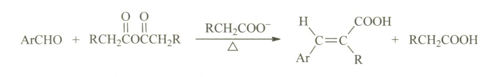

<!--more-->

As the name suggests, the Perkin reaction was discovered by William Henry Perkin. He was also the recipient of the first Perkin Medal.

## Mechanism

1. Under the action of an alkaline catalyst, the proton at the α position of the acid anhydride is removed to form a **carbanion**, which then nucleophilically attacks the carbonyl group of the aromatic aldehyde.

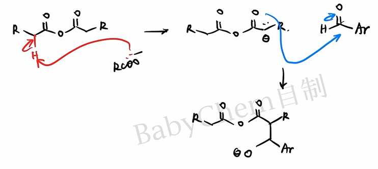

2. The **alkoxy anion** formed by the attack is still nucleophilic, while the anhydride carbonyl group is electrophilic, so intramolecular nucleophilic attack can occur to form a **tetrahedral intermediate** containing a six-membered ring.

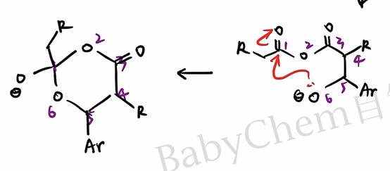

3. There are two ways of collapse of the **tetrahedral intermediate**: if the lone pair of electrons of the oxygen atom attacks back on the oxygen atom No. 6, it is equivalent to the reverse reaction of the second step; if it attacks back on the carbon atom No. 2, a more stable **carboxylate ion** will be formed. Obviously the latter is a reasonable path.

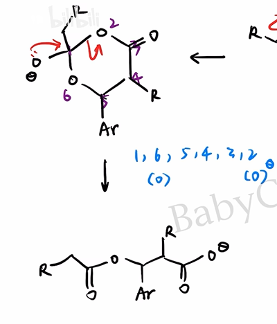

4. There is still an acid anhydride in the system, and the newly generated carboxylate ions will attack the acid anhydride according to the **addition-elimination mechanism**. The formation and collapse of tetrahedral intermediates are also involved here, so we won’t go into details here.

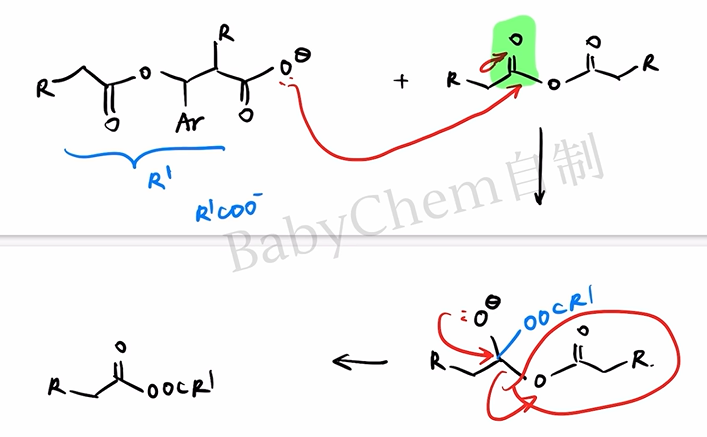

5. The newly formed **asymmetric anhydride** still has acidic α-H; the α-H on the aryl-substituted side is more acidic and is easier to be removed by a base. The obtained carbanion then eliminates carboxylate ions according to the $E_{1cb}$ mechanism to obtain unsaturated anhydride, which is hydrolyzed and acidified to generate the target carboxylic acid.

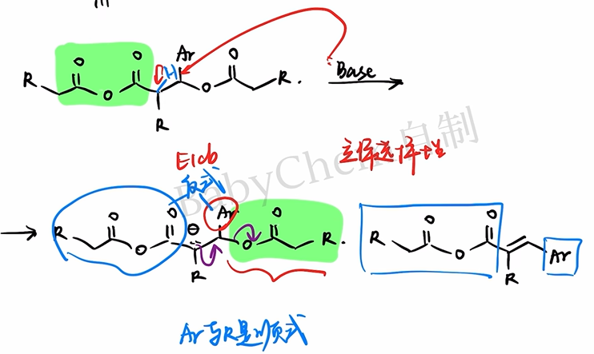

For $E_{1cb}$ elimination, the **stereoselectivity** of the product must also be considered. Usually the aryl group $Ar$ and the carboxyl group are on both sides of the double bond, which generates a more stable $E$ configuration product to reduce steric hindrance.

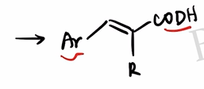

You're done!

The overall reaction mechanism given in Basic Organic Chemistry is as follows.

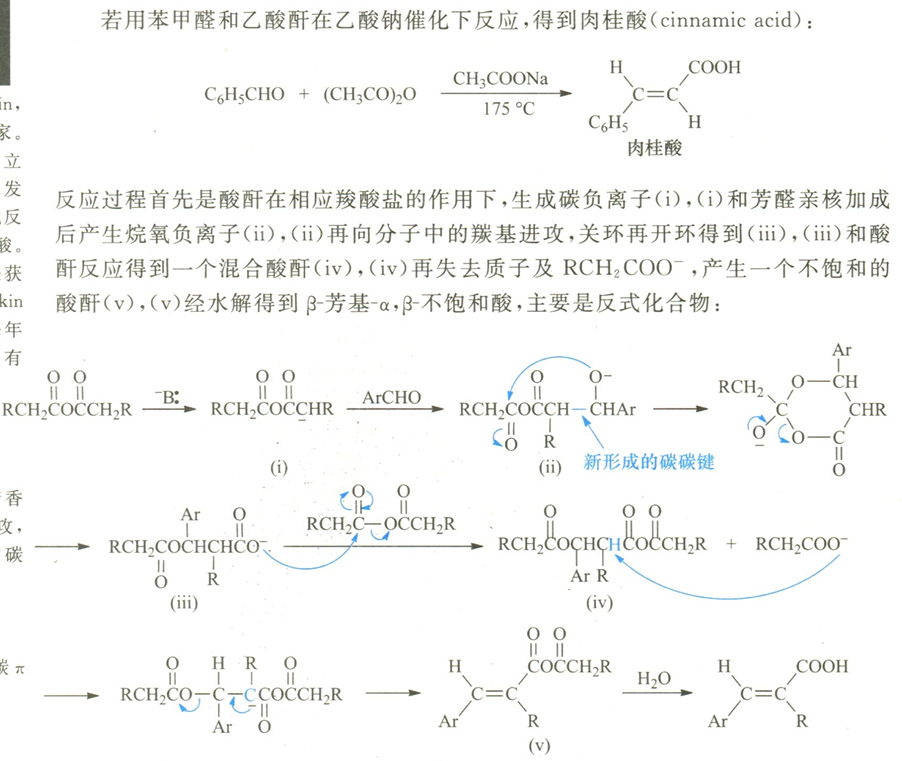

## Exception

An important stereochemical special case of the Perkin reaction is the synthesis of coumarin.

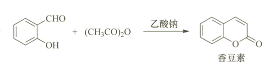

Generally speaking, the $-\mathrm{COOH}$ and aryl groups in the first step product tend to be on both sides of the double bond; however, this configuration is not conducive to the next step of intramolecular esterification.

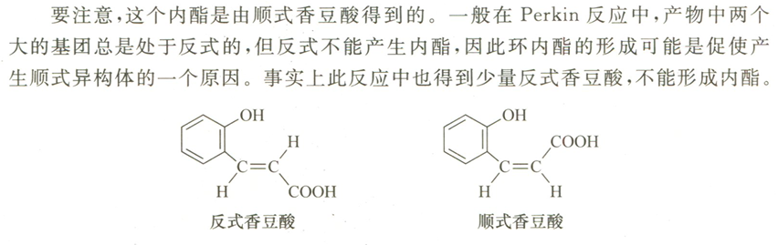

Intramolecular esterification can continuously convert the ring-closing configuration into a low-energy lactone, thereby changing the apparent stereoselectivity and ultimately producing coumarin.

This point may become a test point for organic inference questions and requires special attention.

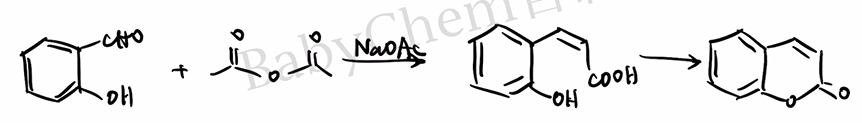

## Practice

The following is layered according to "College Entrance Examination Real Questions—Basic Transfer—Competition Transfer". Q3-Q8 are exercises written based on Perkin's reaction rules and are not meant to be fake past exam questions.

### Q1 · 2022 Beijing College Entrance Examination

Synthesis of iopanoic acid.

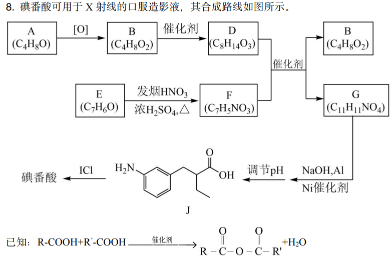

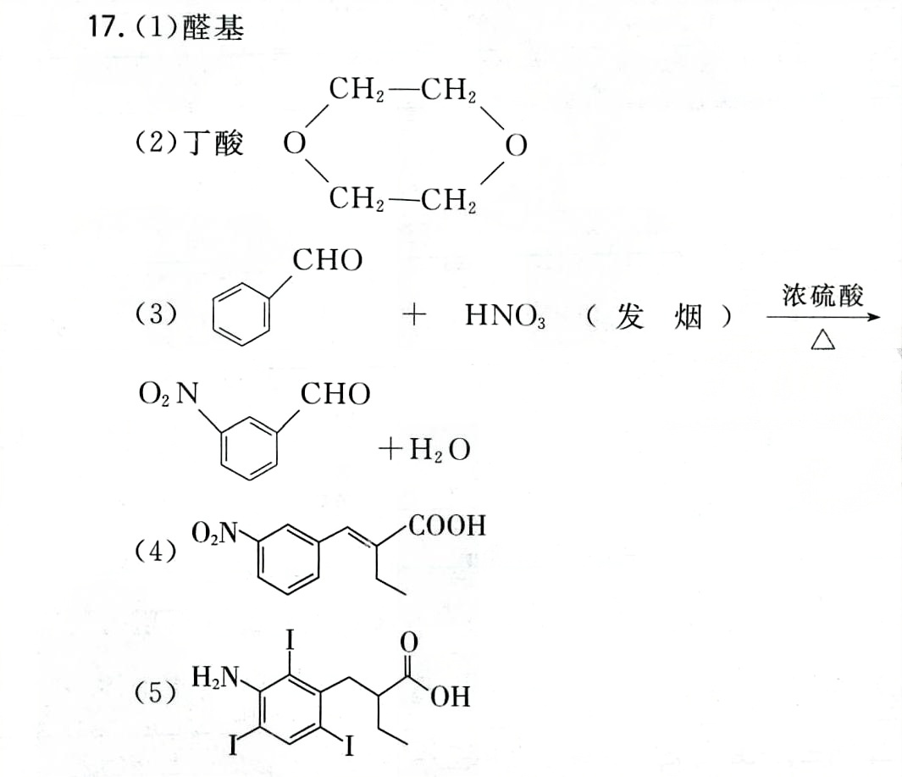

m-nitrobenzaldehyde reacts with n-butyric anhydride to form G. Write the simplified structural formula of G and note its stereochemistry.

### Q2 · Basic recognition

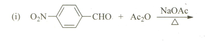

Write down the main organic products of p-nitrobenzaldehyde and acetic anhydride under the conditions of anhydrous sodium acetate and heating.

### Q3 · Basic product prediction

Benzaldehyde and acetic anhydride are heated in the presence of anhydrous sodium acetate, followed by hydrolysis and acidification.

1. Write the simplified structural formula of the main organic product and indicate the $E/Z$ configuration.
2. Explain the role of sodium acetate in the reaction.
3. Why are carboxylates corresponding to acid anhydrides usually chosen?

### Q4 · Changes in acid anhydride

Benzaldehyde and propionic anhydride are heated in the presence of anhydrous sodium propionate, followed by hydrolysis and acidification. Write the main product and indicate which reactant the methyl group in the product comes from.

### Q5 · Retrosynthesis

A one-step Perkin reaction is proposed to prepare $(E)$-3-(4-nitrophenyl)-2-methylprop-2-enoic acid. Write the required aromatic aldehydes, anhydrides, and carboxylates.

### Q6 · Special case of coumarin

Coumarin can be generated by heating salicylaldehyde and acetic anhydride in the presence of anhydrous sodium acetate.

1. Write down the hydroxycinnamic acid intermediate after Perkin condensation but before ring closure.
2. Indicate the type of reaction that produces coumarin from this intermediate.
3. Explain why the stereoselectivity observed here differs from that of the ordinary Perkin reaction.

### Q7 · Bifunctional group substrate

Terephthalaldehyde is reacted with a sufficient amount of acetic anhydride. Write down the main product after full reaction, hydrolysis and acidification, indicate the main configuration of the two double bonds, and give the minimum amount of acetic anhydride required for 1 mol of terephthalaldehyde.

### Q8 · Comprehensive judgment of the style of the early days of the Republic of China

When other conditions are the same, compare the relative rates of the Perkin reaction of the following aromatic aldehydes and explain the reasons:

$$
p\text{-}\mathrm{NO_2C_6H_4CHO},\quad
\mathrm{C_6H_5CHO},\quad
p\text{-}\mathrm{CH_3OC_6H_4CHO}
$$

Further determine whether furancarboxaldehyde can be used as a substrate for the Perkin reaction and briefly describe the basis.

### Reference answer

1. **Q1**: G is α,β-unsaturated carboxylic acid substituted by m-nitrophenyl and ethyl; in the stable configuration, the aryl group and carboxyl group are separated on both sides of the double bond. The complete structure is based on the original volume route number.
2. **Q2**: Mainly generates $(E)$-3-(4-nitrophenyl)prop-2-enoic acid, which is p-nitrocinnamic acid.
3. **Q3**: The product is $(E)$-cinnamic acid, $\mathrm{C_6H_5CH{=}CHCOOH}$. The acetate group abstracts the anhydride α-H to promote the formation of nucleophile; using the corresponding carboxylate can reduce the exchange and side reactions between different acyl groups.
4. **Q4**: The main products are $(E)$-2-methyl-3-phenylprop-2-enoic acid, $\mathrm{C_6H_5CH{=}C(CH_3)COOH}$; the methyl group comes from propionic anhydride.
5. **Q5**: p-nitrobenzaldehyde, propionic anhydride and sodium propionate.
6. **Q6**: The intermediate is o-hydroxycinnamic acid; intramolecular esterification occurs subsequently. Configurations capable of approaching and closing the ring are irreversibly or advantageously converted into stable six-membered lactones, driving equilibrium and altering apparent selectivity.
7. **Q7**: The main product is $(E,E)$-1,4-phenylenediacrylic acid ($\mathrm{HOOCCH{=}CH{-}C_6H_4{-}CH{=}CHCOOH}$); at least 2 mol acetic anhydride is required.
8. **Q8**: The rates are typically $p$-nitrobenzaldehyde $>$ benzaldehyde $>$ $p$-methoxybenzaldehyde. Electron-withdrawing groups enhance the electrophilicity of the aldehyde carbonyl group, while electron-donating groups weaken it. Although furfural is a heteroaromatic aldehyde, it can still undergo this reaction to form a furanacrylic acid derivative.

### Download

- [Download: Perkin Reaction Layering Exercise (PDF)](perkin-practice.pdf)
- [Download: Perkin Reaction Reference Answers (PDF)](perkin-answers.pdf)
- [2022 Beijing Gaokao Chemistry Paper and Answers (PDF)](https://www.gaokzx.com/Fup/document/202209/09-08_091738-10100.pdf)
- [2022 Beijing Gaokao Chemistry Answers (China Education Online)](https://gaokao.eol.cn/shiti/hx/202208/t20220819_2242173.shtml)
- [23rd Chinese Chemistry Olympiad Preliminary Paper and Solutions (Chinese Chemical Society)](https://www.chemsoc.org.cn/library/copy/68.html)

> Note: The external whole paper link is used to check the original questions and continue practicing; Q3-Q8 are transfer questions designed around Perkin reaction and do not belong to the above test paper.

## End

Special thanks to Station B @Babychem, the mechanism picture comes from this UP’s video:

[Basic Organic Chemistry L18-7: Condensation of Aromatic Aldehydes](https://www.bilibili.com/video/BV1VG4y1q7xh/?share_source=copy_web&vd_source=8df86ec0f66b0d7c70b7414a1a60bc6a)
