在碱性催化剂的作用下，**芳香醛**与**酸酐**反应生成 β-芳基-α,β-不饱和羧酸，这一反应称为 **Perkin 反应**。所用碱性催化剂通常是与酸酐相对应的羧酸盐。

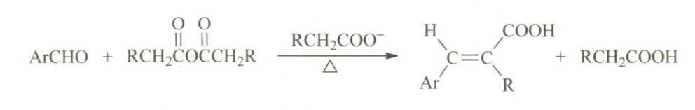

<!--more-->

顾名思义，Perkin 反应由 William Henry Perkin 发现。他本人也是第一届 Perkin Medal 的获得者。

## Mechanism

1. 在碱性催化剂的作用下，酸酐 α 位的质子被移去，形成**碳负离子**，随后亲核进攻芳香醛的羰基。

   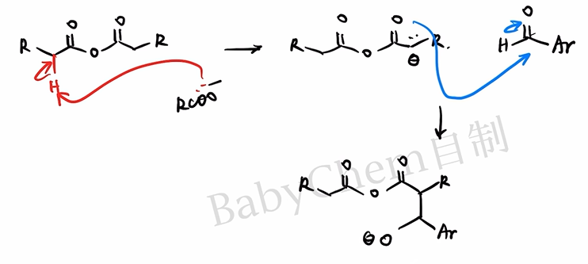

2. 进攻形成的**烷氧基负离子**仍具有亲核性，而酸酐羰基具有亲电性，因此可以发生分子内亲核进攻，形成含六元环的**四面体中间体**。

   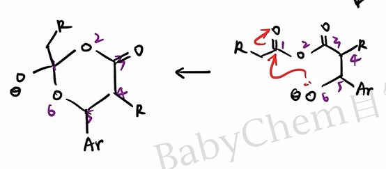

3. **四面体中间体**有两种坍塌方式：氧原子的孤对电子若回攻 6 号氧原子，相当于第二步的逆反应；若回攻 2 号碳原子，则形成较稳定的**羧酸根离子**。显然后者是合理路径。

   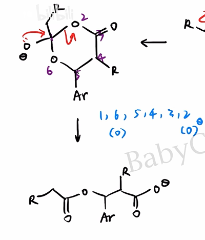

4. 体系中仍有酸酐，新生成的羧酸根离子会按**加成-消除机理**进攻酸酐。这里同样涉及四面体中间体的形成与坍塌，不再赘述。

   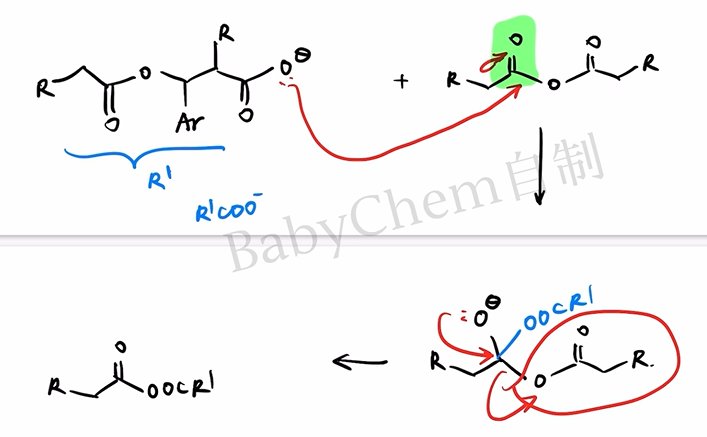

5. 新形成的**不对称酸酐**仍有酸性的 α-H；芳基取代一侧的 α-H 酸性更强，更容易被碱移去。所得碳负离子随后按 $E_{1cb}$ 机理消除羧酸根离子，得到不饱和酸酐，水解、酸化后生成目标羧酸。

   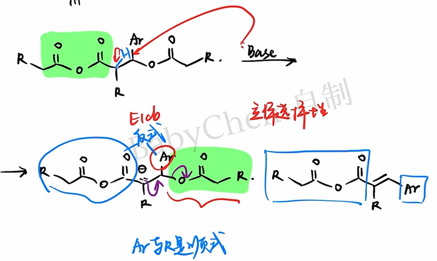

对于 $E_{1cb}$ 消除，还要考虑产物的**立体选择性**。通常芳基 $Ar$ 与羧基处于双键两侧，即生成较稳定的 $E$ 构型产物，以减小空间位阻。

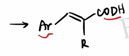

大功告成！

基础有机化学给出的总反应机理如下。

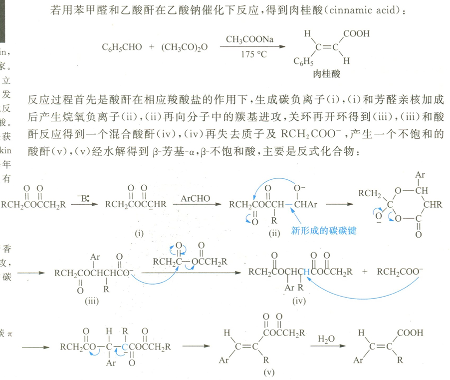

## Exception

Perkin 反应的一个重要立体化学特例是**香豆素的合成**。

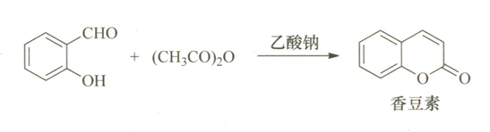

一般而言，第一步产物中的 $-\mathrm{COOH}$ 与芳基倾向于处在双键两侧；但这一构型不利于下一步分子内酯化。

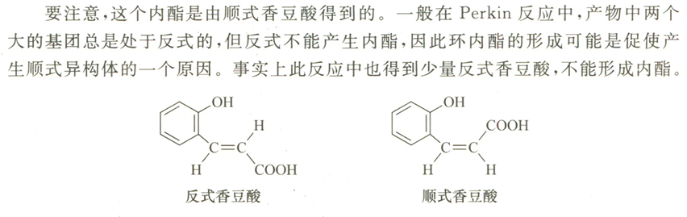

分子内酯化可将能够关环的构型持续转化为低能量的内酯，因此会改变表观的立体选择性，使反应最终生成香豆素。

这一点可能成为有机推断题的考点，需要格外注意。

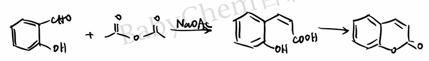

## Practice

下面按“高考真题—基础迁移—竞赛迁移”分层。Q3—Q8 为依据 Perkin 反应规律编写的练习，并非冒充历届真题。

### Q1 · 2022 北京高考

碘番酸的合成。

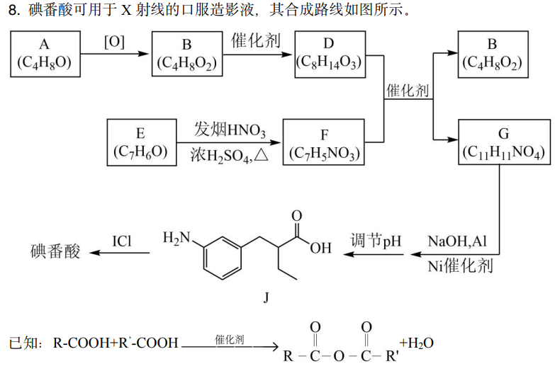

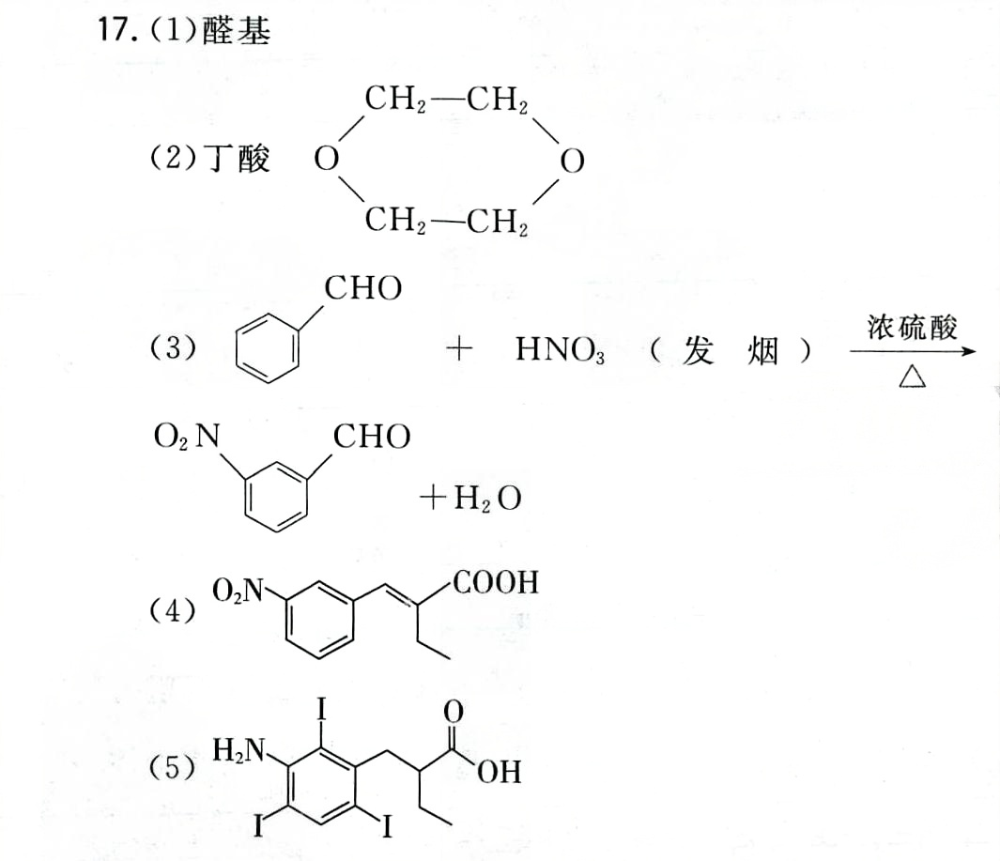

间硝基苯甲醛与正丁酸酐可以发生 Perkin 反应生成 G。写出 G 的结构简式，并注意其立体化学。

### Q2 · 基础识别

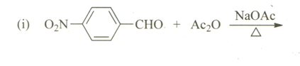

写出对硝基苯甲醛与乙酸酐在无水乙酸钠、加热条件下的主要有机产物。

### Q3 · 基础产物预测

苯甲醛与乙酸酐在无水乙酸钠存在下加热，随后水解、酸化。

1. 写出主要有机产物的结构简式并标明 $E/Z$ 构型。
2. 说明乙酸钠在反应中的作用。
3. 为什么通常选用与酸酐相对应的羧酸盐？

### Q4 · 酸酐变化

苯甲醛与丙酸酐在无水丙酸钠存在下加热，随后水解、酸化。写出主要产物，并指出产物中甲基来自哪一种反应物。

### Q5 · 逆合成

拟用一步 Perkin 反应制备 $(E)$-3-(4-硝基苯基)-2-甲基丙-2-烯酸。写出所需的芳香醛、酸酐和羧酸盐。

### Q6 · 香豆素特例

水杨醛与乙酸酐在无水乙酸钠存在下加热可生成香豆素。

1. 写出 Perkin 缩合后、尚未关环时的羟基肉桂酸中间体。
2. 指出由该中间体生成香豆素的反应类型。
3. 解释为什么这里观察到的立体选择性与普通 Perkin 反应不同。

### Q7 · 二官能团底物

对苯二甲醛与足量乙酸酐反应。写出充分反应并水解、酸化后的主要产物，标出两个双键的主要构型，并给出 1 mol 对苯二甲醛至少需要的乙酸酐物质的量。

### Q8 · 国初风格综合判断

在其他条件相同时，比较下列芳香醛发生 Perkin 反应的相对速率，并说明理由：

$$
p\text{-}\mathrm{NO_2C_6H_4CHO},\quad
\mathrm{C_6H_5CHO},\quad
p\text{-}\mathrm{CH_3OC_6H_4CHO}
$$

进一步判断呋喃甲醛能否作为 Perkin 反应底物，并简述依据。

### 参考答案

1. **Q1**：G 为以间硝基苯基和乙基取代的 α,β-不饱和羧酸；稳定构型中芳基与羧基分居双键两侧。完整结构以原卷路线编号为准。
2. **Q2**：主要生成 $(E)$-3-(4-硝基苯基)丙-2-烯酸，即对硝基肉桂酸。
3. **Q3**：产物为 $(E)$-肉桂酸，$\mathrm{C_6H_5CH{=}CHCOOH}$。乙酸根夺取酸酐 α-H，促使亲核体形成；采用对应羧酸盐可减少不同酰基之间的交换及副反应。
4. **Q4**：主要产物为 $(E)$-2-甲基-3-苯基丙-2-烯酸，$\mathrm{C_6H_5CH{=}C(CH_3)COOH}$；甲基来自丙酸酐。
5. **Q5**：对硝基苯甲醛、丙酸酐和丙酸钠。
6. **Q6**：中间体为邻羟基肉桂酸；随后发生分子内酯化。能靠近并关环的构型被不可逆或优势地转化为稳定的六元内酯，推动平衡并改变表观选择性。
7. **Q7**：主要产物为 $(E,E)$-1,4-苯二丙烯酸（$\mathrm{HOOCCH{=}CH{-}C_6H_4{-}CH{=}CHCOOH}$）；至少需要 2 mol 乙酸酐。
8. **Q8**：速率通常为 $p$-硝基苯甲醛 $>$ 苯甲醛 $>$ $p$-甲氧基苯甲醛。吸电子基增强醛羰基的亲电性，给电子基则削弱它。BTW,呋喃甲醛虽为杂芳醛，仍可发生该反应，生成呋喃丙烯酸类产物。

### 下载

- [下载：Perkin 反应分层练习（PDF）](perkin-practice.pdf)
- [下载：Perkin 反应参考答案（PDF）](perkin-answers.pdf)
- [2022 北京高考化学试题及答案（PDF）](https://www.gaokzx.com/Fup/document/202209/09-08_091738-10100.pdf)
- [2022 北京高考化学答案下载页（中国教育在线）](https://gaokao.eol.cn/shiti/hx/202208/t20220819_2242173.shtml)
- [第 23 届中国化学奥林匹克初赛试题及解答（中国化学会）](https://www.chemsoc.org.cn/library/copy/68.html)

> 说明：外部整卷链接用于核对原题与继续练习；Q3—Q8 是围绕 Perkin 反应设计的迁移题，不属于上述试卷。

## End

特别鸣谢 B 站 @Babychem，机理图片来自这位 UP 的视频：

[【基础有机化学 L18-7 芳香醛的缩合】](https://www.bilibili.com/video/BV1VG4y1q7xh/?share_source=copy_web&vd_source=8df86ec0f66b0d7c70b7414a1a60bc6a) 