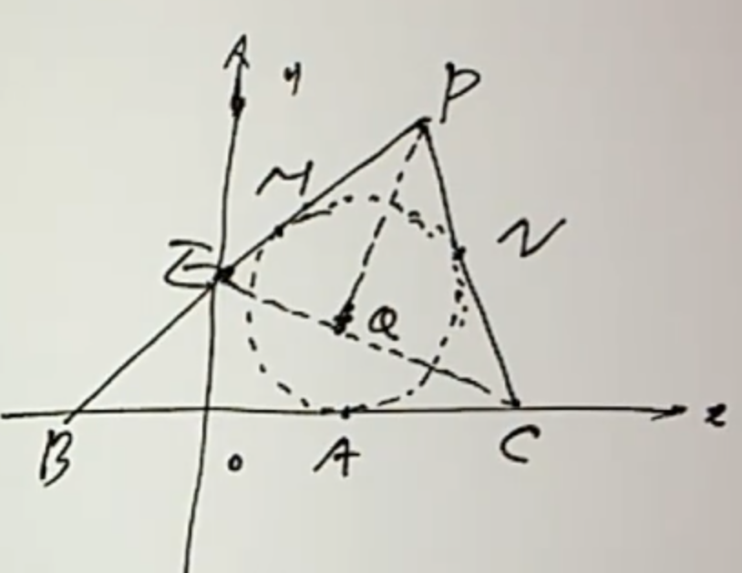
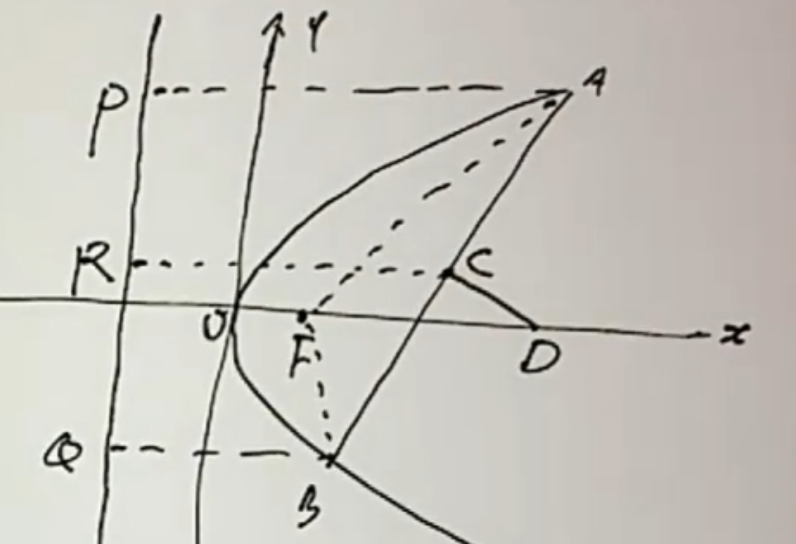
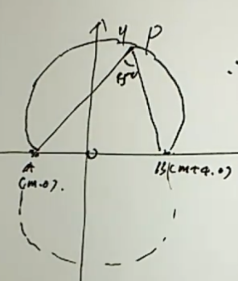
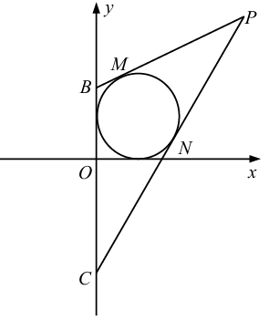

<!--more-->
## Example 1
Parabola $y^2=2px(p\gt 0)$ intersects circle $(x-2)^2+y^2=3$ at two points A and B. The midpoint of line segment AB is on $y=x$. Find the value of p.

Lianli eliminate y to get:

$$\begin{gathered}
  (x-2)^2+2px=3\\
  x^2+2(p-2)x+1=0\\
  \Longleftrightarrow\begin{cases}
    x_1x_2=1\\
    x_1+x_2=-2(p-2)\\
    \Delta=4(p-2)^2-4\gt 0\longleftrightarrow |p-2|\gt 1
  \end{cases}\\
  y_1^2+y_2^2=2p(x_1+x_2)=(y_1+y_2)^2-2y_1y_2\\
  2y_1y_2=(y_1+y_2)^2-2p(x_1+x_2)\\
  =(x_1+x_2)^2-2p(x_1+x_2)\\
  =4(p-2)^2+4p(p-2)\\
  =8p^2-24p+16\\
  y_1y_2=4p^2-12p+8\\
  x_1x_2=\frac{(y_1y_2)^2}{4p^2}=1\\
  y_1y_2=\pm 2p\\
  4p^2-12p+8=\pm 2p\\
\end{gathered}$$

Next, we will discuss based on the difference between positive and negative signs:

$$\begin{gathered}
  2p^2-7p+4=0\\
  \Delta=17\gt 0\\
  p=\frac{7\pm\sqrt{17}}{4}\\
  p=\frac{7+\sqrt{17}}{4},p-2=\frac{\sqrt{17}-1}{4}\lt 1\\
  \text{discard this solution}\\
  p=\frac{7-\sqrt{17}}{4},2-p=\frac{\sqrt{17}+1}{4}\gt 1\\
  \text{retain this solution}
\end{gathered}$$

$$\begin{gathered}
  2p^2-5p+4=0\\
  \Delta=25-32\lt 0\\
  \text{no real solution}
\end{gathered}$$

## Example 2
(2009 Nanjing University) Draw a circle tangent to the x-axis above the x-axis. The abscissa of the tangent point is $\sqrt{3}$. The tangents of the circle are drawn through the point $B(-3,0),C(3,0)$. The two tangents intersect at $P$. $Q$ is the projection of C on the bisector of the acute angle $\angle BPC$.

(1) Find the trajectory equation of P and the value range of its abscissa.

(2) Find the trajectory equation of Q.

(1)

Apparently $|PB|-|PC|=|AB|-|AC|=3+\sqrt{3}-(3-\sqrt{3})=2\sqrt{3}$

Point P is located on the right branch of the hyperbola $\frac{x^2}{a^2}-\frac{y^2}{b^2}=1$:

$2a=2\sqrt{3},2c=3$

$a=\sqrt{3},c=3,b=\sqrt{6}$

So the trajectory equation of point P $\frac{x^2}{3}-\frac{y^2}{6}=1(x\gt \sqrt{3})$

(2)

Considering extending CQ to intersect PB at point E, we have $EQ=QC,PE=PC$

In addition, point O is the midpoint of line segment BC, so OQ is the median line opposite to the BE side in $\triangle PBC$

$OQ=\frac{BE}{2}=\frac{PB-PC}{2}=\sqrt{3}$

Find out what other constraints there are on point Q:

For any point Q ($y_Q\ne 0$) whose distance from the origin is $\sqrt{3}$, you can always double the length of CQ to get the point, and then extend the intersection of the vertical line in BE and EC to get the point P, so the trajectory equation of point Q is:

$x^2+y^2=3(y\ne0)$

## Example 3
(Self-recruited by Peking University) AB is the point on $y=1-x^2$ on both sides of the y-axis. Find the minimum value of the area enclosed by the tangent line passing through A and B and the x-axis.

Let's assume that $A(u,1-u^2),B(v,1-v^2),u\lt0\lt v$, point E is the intersection point of the tangent lines passing through points A and B.

Yi Zhi: $l_{AE}:y=-2ux+u^2+1,l_{BE}:y=-2vx+v^2+1,E(\frac{u+v}{2},1-uv)$

Let $y=0$, the length of the base of the triangle on the x-axis is $s=\frac{1}{2}(v+\frac{1}{v}-u-\frac{1}{u})$

Consider negative substitution: Let $t=-u\gt0$ kill two birds with one stone. It not only makes the sign of $v,t$ the same, but also simplifies the area expression.

$$\begin{gathered}
  S_{\triangle}=\frac{1}{2}sy_E=\frac{1}{4}(v+t+\frac{1}{v}+\frac{1}{t})(1+vt)\\
  \ge\frac{1}{2}(\sqrt{vt}+\sqrt{\frac{1}{vt}})(1+vt)\\
  =\frac{1}{2}\frac{(vt+1)^2}{\sqrt{vt}}
\end{gathered}$$

Here, the mean inequality is used for the $v,t$ and $\frac{1}{v},\frac{1}{u}$ groups because the equality conditions are guessed through symmetry.

$$\begin{gathered}
  S_{\triangle}=\frac{1}{2}\frac{(vt+\frac{1}{3}+\frac{1}{3}+\frac{1}{3})^2}{\sqrt{vt}}\\
  \ge\frac{1}{2}\frac{(4\sqrt[4]{vt(\frac{1}{3})^3})^2}{\sqrt{vt}}=\frac{8\sqrt{3}}{9}
\end{gathered}$$

## Example 4
The straight line passing through the focus F of the parabola $y^2=4x$ intersects the parabola at two points A and B, and the directrix of the parabola intersects the x-axis at the point
C, if $\angle OFA=130\degree$ (O is the coordinate origin), find $\tan\angle ACB$.

$$\begin{gathered}
  x=ky+1,k=\tan40\degree\\
  y^2=4x=4ky+4,y^2-4ky-4=0\\
  A(x_1,y_1),B(x_2,y_2)\\
  \tan\angle ACB=\frac{k_{AC}-k_{BC}}{1+k_{AC}k_{BC}}\\
  =\frac{y_1(x_2+1)-y_2(x_1+1)}{(x_1+1)(x_2+1)+y_1y_2}\\
  =\frac{y_1(ky_2+2)-y_2(ky_1+2)}{(ky_1+2)(ky_2+2)+y_1y_2}\\
  =\frac{2(y_1-y_2)}{(k^2+1)y_1y_2+2k(y_1+y_2)+4}\\
  =\frac{2\sqrt{16k^2+16}}{(k^2+1)(-4)+2k(4k)+4}\\
  =\frac{8\sqrt{k^2+1}}{4k^2}\\
  =\frac{2}{k}\sqrt{1+\frac{1}{k^2}}\\
  =\frac{2}{\tan40\degree}\sqrt{1+\tan^250\degree}\\
  =\frac{2}{\tan40\degree\cos50\degree}\\
  =\frac{2\cos40\degree}{\cos^250\degree}
\end{gathered}$$

## Example 5
Find the equation of the straight line passing through the intersection of $y=2x^2-2x-1$ and $y=-5x^2+2x+3$.

$$5y+2y=5(2x^2-2x-1)+2(-5x^2+2x+3)=-6x+1$$

$$y=\frac{-6}{7}x+\frac{1}{7}$$

Another method:

$$\begin{cases}
  y=2x^2-2x-1=kx+b,\\
  y=-5x^2+2x+3=kx+b\\
\end{cases}$$

$$\begin{cases}
  2x^2-(k+2)x-(b+1)=0,\\
  5x^2+(k-2)x+(b-3)=0
\end{cases}$$

The solutions of the two equations should be exactly the same, so the corresponding vectors of the equation coefficients are parallel. If there is a component with a size of 0, it is obviously a contradiction, so:

$$\begin{gathered}
  \frac{2}{5}=-\frac{k+2}{k-2}=-\frac{b+1}{b-3}
\end{gathered}$$

Solution: $k=-\frac{6}{7},b=\frac{1}{7}$

## Example 6
Point A is on $y=kx$, point B is on $y=-kx$, where $k\gt0,|OA||OB|=k^2+1$ and $A,B$ are on the same side of the y-axis.

(1) Find the trajectory equation C of the midpoint M of AB;

(2) Curve C is tangent to the parabola $x^2=2py(p\gt0)$. Verify that the tangent points are on two fixed straight lines, and obtain the two tangent line equations.

(1)

Let $A(x_1,y_1),B(x_2,y_2)$ be given by $|OA||OB|=k^2+1$.

$$\begin{gathered}
\sqrt{x_1^2x_2^2(k^2+1)^2}=k^2+1\\
x_1x_2=1\\
x=\frac{x_1+x_2}{2},y=\frac{y_1+y_2}{2}=\frac{k}{2}(x_1-x_2)
\end{gathered}$$

Thinking of $4x_1x_2=(x_1+x_2)^2-(x_1-x_2)^2$, there are:

$$\begin{gathered}
  4=(2x)^2-(\frac{2}{k}y)^2\\
  x^2-\frac{y^2}{k^2}=1
\end{gathered}$$

(2)

$$\begin{cases}
  x^2=2py,\\
  x^2-\frac{y^2}{k^2}=1
\end{cases}$$

$$\begin{gathered}
  y^2-2pk^2y+k^2=0\\
  \Delta=4p^2k^4-4k^2=0\\
  pk=1(p\gt0,k\gt0)\\
  y^2-2ky+k^2=0\\
  y_1=y_2=k,\\
  x^2=2pk=2,x=\pm\sqrt{2}
\end{gathered}$$

Therefore, the two tangent points are respectively on $x=\sqrt{2},x=-\sqrt{2}$.

Tangent equation: $y=\sqrt{2}kx-k,y=-\sqrt{2}kx-k$

## Example 7
Assume that the focus of the parabola $y^2=2px(p\gt0)$ is F. A and B are two different points on the parabola. The straight line AB and the x-axis
Not perpendicular, the perpendicular bisector of line segment AB intersects the x-axis at point $D(a,0)$, denoted as $m=|AF|+|BF|$.

(1) Prove: a
is the arithmetic median of p and m;

(2) Assume $m=3p$, straight line l // y-axis, and l is intercepted by a moving circle with AD as the diameter
The chord length is constant, find the equation of the straight line l.

(1)

Set point $A(2pu^2,2pu),B(2pv^2,2pv),k_{AB}=\frac{u-v}{u^2-v^2}=\frac{1}{u+v}$

$$l_{D}:y=-(u+v)[x-p(u^2+v^2)]+p(u+v)$$

Let $y=0,a=x=p(u^2+v^2+1)$

Defined by a parabola: $m=p+2p(u^2+v^2)$

So there is: $m+p=2a$

(2)

From (1): $m=p+2p(u^2+v^2)=3p$, then $u^2+v^2=1$

$a=\frac{m+p}{2}=2p,D(2p,0)$

$A(2pu^2,2pu)$, equation of circle with AD as diameter:

$$(x-2pu^2)(x-2p)+(y-2pu)y=0$$

Assume $l:x=k$ and enter the equation of the circle:

$$\begin{gathered}
  (k-2pu^2)(k-2p)+(y-2pu)y=0\\
  y^2-2puy+(k-2pu^2)(k-2p)=0\\
  \Delta=4p^2u^2-4(k-2pu^2)(k-2p)\\
  |y_1-y_2|=\sqrt{\Delta}=C
\end{gathered}$$

This requires that the coefficient of $u$ in the discriminant is 0, that is, $k=\frac{3}{2}p,l:x=\frac{3}{2}p$

## Example 8
In the plane rectangular coordinate system xOy, $A(-12,0),B(0,6)$, point P is on the circle $O:x^2+y^2=50$. If $\vec{PA}\cdot\vec{PB}\le20$, find the range of the abscissa of point P.

$$\begin{gathered}
  P(x,y):\vec{AP}\cdot\vec{BP}\le20\\
  (x+12)x+y(y-6)\le20\\
  (x+6)^2+(y-3)^2\le65\\
  O:x^2+[(y-3)+3]^2=50\\
  x^2+(y-3)^2+6(y-3)-41=0\\
  \le x^2+[65-(x+6)^2]+6\sqrt{65-(x+6)^2}-41\\
  \Longleftrightarrow \sqrt{65-(x+6)^2}\ge2(x+1)\\
  \Longleftrightarrow \begin{cases}
    x+1\ge 0\\
    65-(x+6)^2\le 4(x+1)^2
  \end{cases}\Longleftrightarrow x\in[-1,1]\\
  \text{or }\Longleftrightarrow x+1\lt 0,x\in(-\infty,-1)\\
\end{gathered}$$

Although the range $[-5\sqrt{2},+1]$ is obtained in this way, it is difficult to know whether the algebraic deformation is an identity deformation by using the inequality as a condition. Consider using the $x^2+y^2=50$ equality as a condition.

$$\begin{gathered}
  x\in[-5\sqrt{2},5\sqrt{2}],
  y\in \{-\sqrt{50-x^2},+\sqrt{50-x^2}\}\\
  (x+12)x+y(y-6)\le20\\
  (case1)y=-\sqrt{50-x^2}\\
  x^2+12x+(50-x^2)+6\sqrt{50-x^2}\le20\\
  12x+6\sqrt{50-x^2}+30\le0\\
  2x+\sqrt{50-x^2}+5\le0\\
  \sqrt{50-x^2}\le -(2x+5)\\
  \Longleftrightarrow \begin{cases}
    2x+5\le 0,\\
    50-x^2\le(2x+5)^2\\
  \end{cases}\Longleftrightarrow x\in[-5\sqrt{2},-5]\\

  (case2)y=+\sqrt{50-x^2}\\
  2x-\sqrt{50-x^2}+5\le0\\
  \sqrt{50-x^2}\ge2x+5\\
  \Longleftrightarrow\begin{cases}
    2x+5\ge 0,\\
    50-x^2\ge (2x+5)^2
  \end{cases}\Longleftrightarrow x\in[-\frac{5}{2},1]\\
  \text{or }2x+5\lt0\Longleftrightarrow x\in[-5\sqrt{2},-\frac{5}{2})
\end{gathered}$$

To sum up, $x\in[-5\sqrt{2},1]$

## Example 9
In the plane rectangular coordinate system xOy, the point $A(m,0),B(m+4,0)$ is known. If there is a point P on the circle $C:x^2+(y-3m)^2=8$ such that $\angle APB=45\degree$, then the value range of the real number m is ___.

It is easy to know that the trajectory of P is the superior arc at both ends, and the corresponding center points are $M_1(m+2,2),M_2(m+2,-2)$.

If circle C intersects with the minor arc of a circle, it must intersect with the minor arc of another circle. Therefore, we only need to consider the intersection of circle C with the upper and lower circles respectively.

$$\begin{gathered}
  \angle APB=45\degree \\
  \Longleftrightarrow M_1P=2\sqrt{2}\\
  M_1P\in[\sqrt{(m+2)^2+(3m-2)^2}-2\sqrt{2},\sqrt{(m+2)^2+(3m-2)^2}+2\sqrt{2}]\\
  \Longleftrightarrow \sqrt{(m+2)^2+(3m-2)^2}\le4\sqrt{2}\\
  m\in[-\frac{6}{5},2]
\end{gathered}$$

Likewise: $\sqrt{(m+2)^2+(3m+2)^2}\le4\sqrt{2},m\in[\frac{-4-2\sqrt{19}}{5},\frac{-4+2\sqrt{19}}{5}]$

To sum up, combining the two situations, $m\in[\frac{-4-2\sqrt{19}}{5},2]$

If $C:x^2+(y-3m)^2=8$ is a smaller circle, you may need to consider and exclude the situation where circle C only intersects minor arcs.

## Example 10
As shown in the figure, in the plane rectangular coordinate system xOy, two tangent lines PM and PN to the circle $E:(x-1)^2+(y-1)^2=1$ are drawn through the point $P(2t^2,2t+1)$, and the tangent points are M and N respectively.

(1) When $t=2$, find the equation of straight line MN;

(2) When $t\in(1,+\infty)$, assume that the tangent lines PM, PN and the y-axis intersect at points B and C respectively, and find the minimum value of the area of $\triangle PBC$.

(1) $P(8,5),MN:7(x-1)+4(y-1)=1$

That is $MN:7x+4y-12=0$

Another solution: write down the equation of a circle with PE as its diameter, and subtract it from circle E using the curve system.

(2) Let the straight line passing through point P be $y=k(x-2t^2)+2t+1$

The straight line is tangent to the circle E: $d=\frac{|k(2t^2-1)-2t|}{\sqrt{1+k^2}}=1$

That is: $k^2+1=(2t^2-1)^2k^2-4t(2t^2-1)k+4t^2$

Simplify: $4t^2(t^2-1)k^2-4t(2t^2-1)k+(4t^2-1)=0(*)$

$$\Delta=16t^2(2t^2-1)^2-16t^2(4t^2-1)(t^2-1)=16t^4$$

Let the two roots of (*) be $k_1,k_2$.

Let $x=0,y=-2t^2k+2t+1$, then $|BC|=2t^2|k_1-k_2|=2t^2\frac{4t^2}{4t^2|t^2-1|}=\frac{2t^2}{|t^2-1|},h=2t^2$

$$S_{\triangle PBC}=\frac{1}{2}|BC|h=\frac{2t^4}{|t^2-1|}\ge8(t=\pm\sqrt{2})$$

## Example 11
Assume that the eccentricity of the ellipse \(C: \frac{x^2}{a^2} + \frac{y^2}{b^2} = 1 (a > b > 0)\) is \(e = \frac{\sqrt{3}}{2}\), and the straight line \(y = x + \sqrt{2}\) is tangent to the circle \(O\) with the origin as the center and the minor axis length of the ellipse \(C\) as the radius.

(1) Find the equation of ellipse \(C\);

(2) As shown in the figure, \(A_1\), \(A_2\), \(B_1\), \(B_2\) are the vertices of the ellipse \(C\), \(P\) is any point on the ellipse \(C\) except the vertex, and the straight line \(B_2P\) intersects the axis of \(x\) at the point \(F\), straight line \(A_1B_2\) intersects \(A_2P\) at point \(E\). Suppose the slope of \(A_2P\) is \(k\) and the slope of \(EF\) is \(m\). Verify: \(2m - k\) is a constant value.

(1) $b=d=1,e=\frac{c}{a}=\frac{\sqrt{a^2-b^2}}{a}=\frac{\sqrt{3}}{2},a=2b=2$

Therefore $C:\frac{x^2}{4}+\frac{y^2}{1}=1$

(2)

### Compilation of answers to analytical geometry proof questions

**Known conditions:**
Ellipse \(C: \frac{x^2}{4} + y^2 = 1\) (obtained according to the first question).
\(A_1(-2, 0), A_2(2, 0), B_1(0, -1), B_2(0, 1)\) is the vertex of the ellipse.
At the position of point \(P\) different from the vertex on the ellipse, the slope of \(A_2P\) is \(k\), and the slope of \(EF\) is \(m\).

**Proof goal:**\(2m - k\) is a constant value.

**Proof process:**

**Step 1: Determine the equation of the straight line \(A_2P\) and find the coordinates of the intersection point \(P\)**
Let the equation of straight line \(A_2P\) be: \(y = k(x - 2)\)
From the question, we know \(k \neq 0\).
Simultaneously combine the equations of the straight line and the ellipse to find the coordinates of the point \(P\):
$$
\begin{cases}
y = k(x - 2) \\
x^2 + 4y^2 = 4
\end{cases}
$$
Substituting the equation of the straight line into the equation of the ellipse we get:
\[
x^2 + 4k^2(x - 2)^2 = 4
\]
\[
(4k^2 + 1)x^2 - 16k^2x + (16k^2 - 4) = 0
\]
Since \(A_2\) is an intersection point of a straight line and an ellipse, let its abscissa be \(x_1 = 2\), and the abscissa of another intersection point \(P\) be \(x_P\).
From Vedic theorem we can get:
\[
x_1 \cdot x_P = \frac{16k^2 - 4}{4k^2 + 1} \implies 2x_P = \frac{4(4k^2 - 1)}{4k^2 + 1} \implies x_P = \frac{2(4k^2 - 1)}{4k^2 + 1}
\]
Substitute into the equation of the straight line to obtain the ordinate of \(P\):
\[
y_P = k(x_P - 2) = k \left( \frac{2(4k^2 - 1)}{4k^2 + 1} - 2 \right) = k \cdot \frac{-4}{4k^2 + 1} = -\frac{4k}{4k^2 + 1}
\]
Therefore, the coordinates of point \(P\) are \(\left( \frac{2(4k^2 - 1)}{4k^2 + 1}, -\frac{4k}{4k^2 + 1} \right)\).

**Step 2: Find the coordinates of point \(F\)**
The intersection point of the straight line \(B_2P\) and the \(x\) axis is \(F(u, 0)\).
Find the slope \(k_{B_2P}\) of the straight line \(B_2P\) from the coordinates of \(B_2\) and \(P\):
\[
k_{B_2P} = k_{B_2F} = \frac{-\frac{4k}{4k^2 + 1} - 1}{\frac{2(4k^2 - 1)}{4k^2 + 1} - 0} = \frac{\frac{-4k - 4k^2 - 1}{4k^2 + 1}}{\frac{2(4k^2 - 1)}{4k^2 + 1}} = \frac{-(4k^2 + 4k + 1)}{2(4k^2 - 1)}
\]
Using the slope formula \(k_{B_2F} = \frac{0 - 1}{u - 0} = -\frac{1}{u}\), we can get:
\[
-\frac{1}{u} = \frac{-(4k^2 + 4k + 1)}{2(4k^2 - 1)} \implies u = \frac{2(4k^2 - 1)}{(2k + 1)^2} = \frac{2(2k - 1)(2k + 1)}{(2k + 1)^2} = \frac{2(2k - 1)}{2k + 1}
\]
Therefore, the coordinates of point \(F\) are \(\left( \frac{2(2k - 1)}{2k + 1}, 0 \right)\).

**Step 3: Find the coordinates of point \(E\)**
The equation of the straight line \(A_1B_2\) is: \(y = \frac{1}{2}x + 1\)
Simultaneous straight lines \(A_2P\) (\(y = k(x-2)\)) and \(A_1B_2\) find the intersection point \(E\):
\[
\frac{1}{2}x + 1 = k(x - 2) \implies x - 2kx = -4k - 2 \implies x(1 - 2k) = -2(2k + 1)
\]
\[
x = \frac{2(2k + 1)}{2k - 1}
\]
Substituting \(y = \frac{1}{2}x + 1\) we get:
\[
y = \frac{1}{2} \cdot \frac{2(2k + 1)}{2k - 1} + 1 = \frac{2k + 1 + 2k - 1}{2k - 1} = \frac{4k}{2k - 1}
\]
Therefore, the coordinates of point \(E\) are \(\left( \frac{2(2k + 1)}{2k - 1}, \frac{4k}{2k - 1} \right)\).

**Step 4: Calculate the slope \(m\) and prove the fixed value**
Based on the coordinates of \(E\) and \(F\), calculate the slope \(m\) of the straight line \(EF\):
\[
m = \frac{y_E - y_F}{x_E - x_F} = \frac{\frac{4k}{2k - 1} - 0}{\frac{2(2k + 1)}{2k - 1} - \frac{2(2k - 1)}{2k + 1}}
\]
\[
m = \frac{\frac{4k}{2k - 1}}{\frac{2(2k + 1)^2 - 2(2k - 1)^2}{(2k - 1)(2k + 1)}} = \frac{\frac{4k}{2k - 1}}{\frac{2 \cdot 8k}{(2k - 1)(2k + 1)}} = \frac{4k}{2k - 1} \cdot \frac{(2k - 1)(2k + 1)}{16k} = \frac{2k + 1}{4}
\]

Finally, calculate \(2m - k\):
\[
2m - k = 2 \left( \frac{2k + 1}{4} \right) - k = \frac{2k + 1}{2} - k = \frac{2k + 1 - 2k}{2} = \frac{1}{2}
\]

**Conclusion:**
\(2m - k = \frac{1}{2}\) is a fixed value and is proved.

---

## Example 12
(2018 Beijing Liberal Arts) It is known that the eccentricity of the ellipse \(M: \frac{x^2}{a^2} + \frac{y^2}{b^2} = 1(a > b > 0)\) is \(\frac{\sqrt{6}}{3}\) and the focal length is \(2\sqrt{2}\). A straight line \(l\) with slope \(k\) and an ellipse \(M\) have two different intersection points \(A, B\).
(1) Find the equation of ellipse \(M\);
(2) If \(k = 1\), find the maximum value of \(AB\);
(3) Assume \(P(-2,0)\), the other intersection point of straight line \(PA\) and ellipse \(M\) is \(C\), and the other intersection point of straight line \(PB\) and ellipse \(M\) is \(D\). If \(C, D\) and point \(Q(-\frac{7}{4}, \frac{1}{4})\) are collinear, find \(k\).

(1) $\frac{x^2}{3}+y^2=1$ (2) $\sqrt{6}$

(3) Let $A(x_1,y_1),B(x_2,y_2),C(x_3,y_3),D(x_4,y_4)$

$$\begin{cases}
  y=k_1(x+2)\\
  x^2+3y^2=3
\end{cases}$$

$$\begin{gathered}
  (3k_1^2+1)x^2+12k_1^2x+(12k_1^2-3)=0\\
  x_1+x_3=\frac{-12k_1^2}{3k_1^2+1}=\frac{-12(\frac{y_1}{x_1+2})^2}{3(\frac{y_1}{x_1+2})^2+1}=\frac{-12y_1^2}{3y_1^2+(x_1+2)^2}=\frac{4x_1^2-12}{4x_1+7}\\
  x_3=\frac{-7x_1-12}{4x_1+7},y_3=k_1(x_3+2)=\frac{-7x_1-12}{4x_1+7}\\
  C(\frac{-7x_1-12}{4x_1+7},\frac{y_1}{4x_1+7})\\
  D(\frac{-7x_2-12}{4x_2+7},\frac{y_2}{4x_2+7})\\
  \vec{QC}=(x_3+\frac{7}{4},y_3-\frac{1}{4})\\
  \vec{QD}=(x_4+\frac{7}{4},y_4-\frac{1}{4})\\
  \vec{QC}\parallel\vec{QD}:(x_3+\frac{7}{4})(y_4-\frac{1}{4})=(x_4+\frac{7}{4})(y_3-\frac{1}{4})\\
  y_1-x_1-\frac{7}{4}=y_2-x_2-\frac{7}{4}\\
  k=\frac{y_1-y_2}{x_1-x_2}=1
\end{gathered}$$

## Example 13
In the xOy coordinate plane, $\angle AOB=\frac{\pi}{3}$, side AB moves on the straight line $l:x=3$, and find the circumcenter trajectory equation of triangle AOB.

Assume B is above A, $\angle XOB=\theta$

$$B(3,3\tan\theta),A(3,3\tan(\theta-\frac{\pi}{3}))$$

$$y=\frac{3}{2}(\tan\theta+\tan(\theta-\frac{\pi}{3}))$$

The mid-perpendicular line of OA: $y=-\cot\theta(x-\frac{3}{2})+\frac{3}{2}\tan\theta$

Therefore $x=\frac{3}{2}-\frac{3}{2}\tan\theta\tan(\theta-\frac{\pi}{3})$

Think of the tangent angle difference formula:

$$\begin{gathered}
  \tan\frac{\pi}{3}=\frac{\tan\theta-\tan(\theta-\frac{\pi}{3})}{1+\tan\theta\tan(\theta-\frac{\pi}{3})}\\
  \sqrt{3}(1+\tan\theta\tan(\theta-\frac{\pi}{3}))=\tan\theta-\tan(\theta-\frac{\pi}{3})
\end{gathered}$$

But tangent subtraction is not the form we need, consider squaring:

$$\begin{gathered}
  3(1+\tan\theta\tan(\theta-\frac{\pi}{3}))^2=(\tan\theta-\tan(\theta-\frac{\pi}{3}))^2\\=(\tan\theta+\tan(\theta-\frac{\pi}{3}))^2-4\tan\theta\tan(\theta-\frac{\pi}{3})\\
  3(2-\frac{2}{3}x)^2=(\frac{2}{3}y)^2-4(1-\frac{2}{3}x)\\
  \frac{(x-4)^2}{4}-\frac{y^2}{12}=1
\end{gathered}$$

## Example 14
It is known that the left focus of ellipse \(C: \frac{x^2}{a^2} + \frac{y^2}{b^2} = 1(a > b > 0)\) is \(F(-1,0)\), and the left directrix equation is \(x = -2\).

(1) Find the standard equation of the ellipse \(C\);

(2) It is known that the straight line \(l\) intersects the ellipse \(C\) at two points \(A, B\).

① If the straight line \(l\) passes through the left focus \(F\) of the ellipse \(C\), intersects the \(y\) axis at the point \(P\), and satisfies \(\overrightarrow{PA} = \lambda \overrightarrow{AF}\), \(\overrightarrow{PB} = \mu \overrightarrow{BF}\).

Verify: \(\lambda + \mu\) is a fixed value;

② If the two points \(A, B\) satisfy \(OA \perp OB\) (\(O\) is the origin of the coordinates), find the value range of the area of \(\triangle AOB\).

(1) $c=1,\frac{a^2}{c}=2,a=\sqrt{2},b=1,C:\frac{x^2}{2}+\frac{y^2}{1}=1$

(2) ① Consider the focal chord length formula: Suppose the inclination angle of the straight line $l$ is $\theta$, then:

$$\begin{gathered}
  AF=\frac{\frac{b^2}{a}}{1-e\cos\theta}=\frac{\frac{1}{\sqrt{2}}}{1-\frac{\sqrt{2}}{2}\cos\theta}=\frac{1}{\sqrt{2}-\cos\theta}\\
  BF=\frac{1}{\sqrt{2}+\cos\theta}\\
  PA=PF-AF=\frac{1}{\cos\theta}-\frac{1}{\sqrt{2}-\cos\theta}\\
  PB=PF+BF=\frac{1}{\cos\theta}+\frac{1}{\sqrt{2}+\cos\theta}\\
  \lambda=+\frac{PA}{AF}=\frac{PF}{AF}-1\\
  \mu=-\frac{PB}{BF}=-\frac{PF}{BF}-1\\
  \lambda+\mu=-2+\frac{(\sqrt{2}-\cos\theta)-(\sqrt{2}+\cos\theta)}{\cos\theta}=-4
\end{gathered}$$
②Suppose the straight line $AB:y=kx+b$.

$$\begin{cases}
  x^2+2y^2=2\\
  y=kx+b
\end{cases}$$

$$\begin{gathered}
  (2k^2+1)x^2+4kbx+2(b^2-1)=0\\
  \Delta=8(2k^2+1-b^2)\gt0\\
  x_1x_2+y_1y_2=x_1x_2+(kx_1+b)(kx_2+b)\\
  =(k^2+1)x_1x_2+kb(x_1+x_2)+b^2=0\\
  2(k^2+1)(b^2-1)-kb(4kb)+b^2(2k^2+1)=0\\
  3b^2-2k^2=2\\
  S_{\triangle AOB}=\frac{1}{2}|b||x_1-x_2|\\
  =\frac{1}{2}|b|\frac{\sqrt{8(2k^2+1-b^2)}}{2k^2+1}\\
  =\frac{\sqrt{2b^2(2k^2+1-b^2)}}{2k^2+1}\le=\frac{\sqrt{2}\frac{2k^2+1}{2}}{2k^2+1}=\frac{\sqrt{2}}{2}(k=\pm\sqrt{2},b=\pm1)\\
  \Delta=8(2k^2+1-b^2)=8(2k^2+1-\frac{2}{3}(k^2+1))\gt0\\
  S_{\triangle AOB}=\frac{\sqrt{2b^2(2k^2+1-b^2)}}{2k^2+1}\\
  =\frac{\sqrt{2}\sqrt{\frac{2}{3}(k^2+1)\frac{1}{3}(4k^2+1)}}{2k^2+1}\\
  =\frac{2}{3}\sqrt{\frac{(k^2+1)(4k^2+1)}{(2k^2+1)^2}}\\
  2k^2+1=u\ge1\\
  S_{\triangle AOB}=\frac{2}{3}\sqrt{\frac{(u+1)(2u-1)}{2u^2}}\\
  =\frac{2}{3}\sqrt{1+\frac{1}{2u}-\frac{1}{2u^2}}\ge\frac{2}{3}
\end{gathered}$$

When the slope of straight line $AB$ does not exist, $|OA|=|OB|=\sqrt{\frac{4}{3}},S_{\triangle AOB}=\frac{1}{2}|OA||OB|=\frac{2}{3}(u\to0)$

Here is a summary of the answers (a different wiring scheme):

### Reference answer
[Instruction from Famous Teachers] This question examines the standard equations, geometric properties of ellipses, and the positional relationship between straight lines and ellipses.
(Ⅰ) Use the geometric properties of the ellipse to solve the basic quantities and obtain the standard equation of the ellipse;
(Ⅱ) (ⅰ) Set up the linear equation, combine it with the equation of the ellipse, and use Veda's theorem and coordinate operations of vectors to solve it; (ⅱ) Use the triangle area formula to establish the objective function, and then use the substitution method, quadratic function, etc. to solve the value range.

Solution: (Ⅰ) Assume from the question that \(c = 1\), and \(\frac{a^2}{c} = 2\), that is, \(a^2 = 2c\),
\(\therefore a^2 = 2, b^2 = a^2 - c^2 = 1\),
The equation of \(\therefore\) ellipse \(C\) is \(\frac{x^2}{2} + y^2 = 1\).

(Ⅱ) (ⅰ) Proof: It is assumed from the question that the slope of the straight line \(l\) exists, \(F(-1,0)\),
Suppose the equation of straight line \(l\) is \(y = k(x + 1)\), then \(P(0, k)\).
Let \(A(x_1, y_1), B(x_2, y_2)\),
Substituting the equation of the straight line \(l\) into the equation of the ellipse, we get \(x^2 + 2k^2(x + 1)^2 = 2\),
Organized into \((1 + 2k^2)x^2 + 4k^2x + 2k^2 - 2 = 0\),
\(\therefore x_1 + x_2 = \frac{-4k^2}{1 + 2k^2}, x_1x_2 = \frac{2k^2 - 2}{1 + 2k^2}\).
From \(\overrightarrow{PA} = \lambda \overrightarrow{AF}, \overrightarrow{PB} = \mu \overrightarrow{BF}\) we know, \(\lambda = \frac{-x_1}{1 + x_1}, \mu = \frac{-x_2}{1 + x_2}\),
\(\therefore \lambda + \mu = -\frac{x_1 + x_2 + 2x_1x_2}{1 + x_1 + x_2 + x_1x_2}\)
\(= -\frac{\frac{-4k^2}{1 + 2k^2} + \frac{4k^2 - 4}{1 + 2k^2}}{1 + \frac{-4k^2}{1 + 2k^2} + \frac{2k^2 - 2}{1 + 2k^2}}\)
\(= -\frac{-4}{-1} = -4\) is a fixed value.

(ⅱ) When the straight lines \(OA, OB\) coincide with the coordinate axes respectively,
It is easy to know the area of \(\triangle AOB\) \(S = \frac{\sqrt{2}}{2}\),
When the slopes of the straight line \(OA, OB\) all exist and are not zero,
Let \(OA: y = kx, OB: y = -\frac{1}{k}x\),
Assume \(A(x_1, y_1), B(x_2, y_2)\), substitute \(y = kx\) into the equation of ellipse \(C\),
Get \(x^2 + 2k^2x^2 = 2\),
\(\therefore x_1^2 = \frac{2}{2k^2 + 1}, y_1^2 = \frac{2k^2}{2k^2 + 1}\),
In the same way, \(x_2^2 = \frac{2k^2}{2 + k^2}, y_2^2 = \frac{2}{2 + k^2}\),
The area of \(\triangle AOB\) is \(S = \frac{OA \cdot OB}{2} = \sqrt{\frac{(k^2 + 1)^2}{(2k^2 + 1)(k^2 + 2)}}\).
Let \(t = k^2 + 1 \in (1, +\infty)\),
\(S_{\triangle AOB} = \sqrt{\frac{t^2}{(2t - 1)(t + 1)}} = \sqrt{\frac{1}{2 + \frac{1}{t} - \frac{1}{t^2}}}\),
Let \(u = \frac{1}{t} \in (0, 1)\),
Then \(S_{\triangle AOB} = \sqrt{\frac{1}{-u^2 + u + 2}}\)
\(= \sqrt{\frac{1}{-\left(u - \frac{1}{2}\right)^2 + \frac{9}{4}}} \in \left[ \frac{2}{3}, \frac{\sqrt{2}}{2} \right)\).
To sum up, the value range of \(\triangle AOB\) area is \(\left[ \frac{2}{3}, \frac{\sqrt{2}}{2} \right]\).
