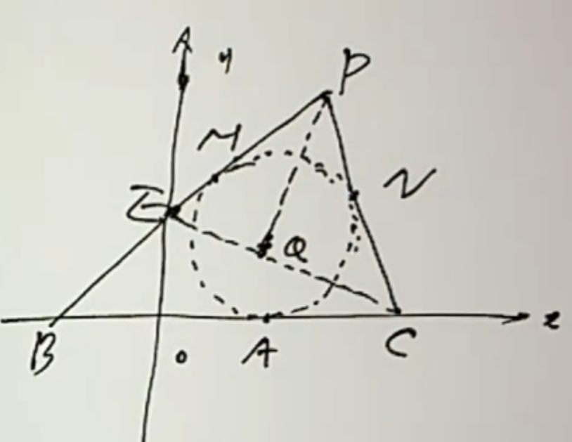
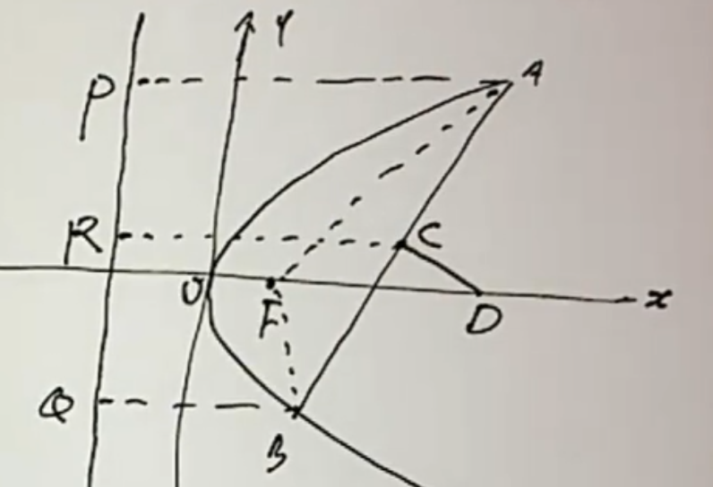
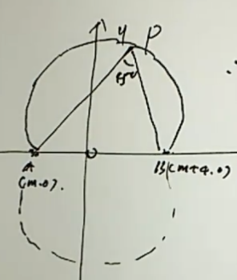
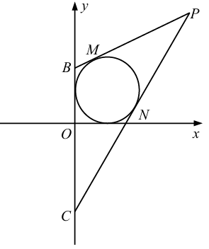

<!--more-->
## 例1
抛物线$y^2=2px(p\gt 0)$与圆$(x-2)^2+y^2=3$交于A,B两点,线段AB的中点在$y=x$上,求p的值.

联立消y得:

$$\begin{gathered}
  (x-2)^2+2px=3\\
  x^2+2(p-2)x+1=0\\
  \Longleftrightarrow\begin{cases}
    x_1x_2=1\\
    x_1+x_2=-2(p-2)\\
    \Delta=4(p-2)^2-4\gt 0\longleftrightarrow |p-2|\gt 1
  \end{cases}\\
  y_1^2+y_2^2=2p(x_1+x_2)=(y_1+y_2)^2-2y_1y_2\\
  2y_1y_2=(y_1+y_2)^2-2p(x_1+x_2)\\
  =(x_1+x_2)^2-2p(x_1+x_2)\\
  =4(p-2)^2+4p(p-2)\\
  =8p^2-24p+16\\
  y_1y_2=4p^2-12p+8\\
  x_1x_2=\frac{(y_1y_2)^2}{4p^2}=1\\
  y_1y_2=\pm 2p\\
  4p^2-12p+8=\pm 2p\\
\end{gathered}$$

接下来根据正负号不同进行讨论:

$$\begin{gathered}
  2p^2-7p+4=0\\
  \Delta=17\gt 0\\
  p=\frac{7\pm\sqrt{17}}{4}\\
  p=\frac{7+\sqrt{17}}{4},p-2=\frac{\sqrt{17}-1}{4}\lt 1\\
  \text{舍去这个解}\\
  p=\frac{7-\sqrt{17}}{4},2-p=\frac{\sqrt{17}+1}{4}\gt 1\\
  \text{保留这个解}
\end{gathered}$$

$$\begin{gathered}
  2p^2-5p+4=0\\
  \Delta=25-32\lt 0\\
  \text{无实数解}
\end{gathered}$$

## 例2
(2009南京大学)在x轴上方作与x轴相切的圆,切点横坐标为$\sqrt{3}$,过点$B(-3,0),C(3,0)$分别作圆的切线,两切线交于$P$,$Q$为C在锐角$\angle BPC$角平分线上的射影.

(1)求P的轨迹方程,及其横坐标的取值范围.

(2)求Q的轨迹方程.

(1)

显然$|PB|-|PC|=|AB|-|AC|=3+\sqrt{3}-(3-\sqrt{3})=2\sqrt{3}$

点P位于双曲线$\frac{x^2}{a^2}-\frac{y^2}{b^2}=1$的右支:

$2a=2\sqrt{3},2c=3$

$a=\sqrt{3},c=3,b=\sqrt{6}$

所以点P的轨迹方程$\frac{x^2}{3}-\frac{y^2}{6}=1(x\gt \sqrt{3})$

(2)

考虑延长CQ交PB于点E,则有$EQ=QC,PE=PC$

又O点为线段BC的中点,故OQ为$\triangle PBC$中BE边所对中位线

$OQ=\frac{BE}{2}=\frac{PB-PC}{2}=\sqrt{3}$

寻找一下,点Q还有什么约束条件:

对于任何一个到原点距离为$\sqrt{3}$的点Q($y_Q\ne 0$),总可以倍长CQ得到点,再延长BE与EC中垂线相交得到点P,所以点Q的轨迹方程为:

$x^2+y^2=3(y\ne0)$

## 例3
(北大自招)AB为$y=1-x^2$上在y轴两侧的点,求过A,B的切线与x轴围成面积的最小值.

不妨设$A(u,1-u^2),B(v,1-v^2),u\lt0\lt v$,点E为过A,B点切线的交点.

易知:$l_{AE}:y=-2ux+u^2+1,l_{BE}:y=-2vx+v^2+1,E(\frac{u+v}{2},1-uv)$

令$y=0$,解得三角形在x轴上的底边长度为$s=\frac{1}{2}(v+\frac{1}{v}-u-\frac{1}{u})$

考虑负代换:令$t=-u\gt0$,这样一石二鸟,不仅让$v,t$的符号相同,也简化了面积表达式

$$\begin{gathered}
  S_{\triangle}=\frac{1}{2}sy_E=\frac{1}{4}(v+t+\frac{1}{v}+\frac{1}{t})(1+vt)\\
  \ge\frac{1}{2}(\sqrt{vt}+\sqrt{\frac{1}{vt}})(1+vt)\\
  =\frac{1}{2}\frac{(vt+1)^2}{\sqrt{vt}}
\end{gathered}$$

这里对$v,t$和$\frac{1}{v},\frac{1}{u}$分组使用均值不等式,是因为通过对称性猜到了取等条件.

$$\begin{gathered}
  S_{\triangle}=\frac{1}{2}\frac{(vt+\frac{1}{3}+\frac{1}{3}+\frac{1}{3})^2}{\sqrt{vt}}\\
  \ge\frac{1}{2}\frac{(4\sqrt[4]{vt(\frac{1}{3})^3})^2}{\sqrt{vt}}=\frac{8\sqrt{3}}{9}
\end{gathered}$$

## 例4
过抛物线$y^2=4x$的焦点 F 的直线交抛物线于 A, B 两点，抛物线的准线与 x 轴交于点
C ，若 $\angle OFA=130\degree$(O 是坐标原点)，求 $\tan\angle ACB$ .

$$\begin{gathered}
  x=ky+1,k=\tan40\degree\\
  y^2=4x=4ky+4,y^2-4ky-4=0\\
  A(x_1,y_1),B(x_2,y_2)\\
  \tan\angle ACB=\frac{k_{AC}-k_{BC}}{1+k_{AC}k_{BC}}\\
  =\frac{y_1(x_2+1)-y_2(x_1+1)}{(x_1+1)(x_2+1)+y_1y_2}\\
  =\frac{y_1(ky_2+2)-y_2(ky_1+2)}{(ky_1+2)(ky_2+2)+y_1y_2}\\
  =\frac{2(y_1-y_2)}{(k^2+1)y_1y_2+2k(y_1+y_2)+4}\\
  =\frac{2\sqrt{16k^2+16}}{(k^2+1)(-4)+2k(4k)+4}\\
  =\frac{8\sqrt{k^2+1}}{4k^2}\\
  =\frac{2}{k}\sqrt{1+\frac{1}{k^2}}\\
  =\frac{2}{\tan40\degree}\sqrt{1+\tan^250\degree}\\
  =\frac{2}{\tan40\degree\cos50\degree}\\
  =\frac{2\cos40\degree}{\cos^250\degree}
\end{gathered}$$

## 例5
求过$y=2x^2-2x-1$和$y=-5x^2+2x+3$交点的直线方程.

$$5y+2y=5(2x^2-2x-1)+2(-5x^2+2x+3)=-6x+1$$

$$y=\frac{-6}{7}x+\frac{1}{7}$$

另法:

$$\begin{cases}
  y=2x^2-2x-1=kx+b,\\
  y=-5x^2+2x+3=kx+b\\
\end{cases}$$

$$\begin{cases}
  2x^2-(k+2)x-(b+1)=0,\\
  5x^2+(k-2)x+(b-3)=0
\end{cases}$$

两个方程的解应该完全相同,故方程系数对应向量平行,若存在大小为0的分量,显然推出矛盾,故:

$$\begin{gathered}
  \frac{2}{5}=-\frac{k+2}{k-2}=-\frac{b+1}{b-3}
\end{gathered}$$

解得:$k=-\frac{6}{7},b=\frac{1}{7}$

## 例6
点A在$y=kx$上,点B在$y=-kx$上,其中$k\gt0,|OA||OB|=k^2+1$且$A,B$在y轴同侧.

(1)求AB中点M的轨迹方程C;

(2)曲线C与抛物线$x^2=2py(p\gt0)$相切,求证:切点分别在两条定直线上,并求出两条切线方程.

(1)

设$A(x_1,y_1),B(x_2,y_2)$,由$|OA||OB|=k^2+1$.

$$\begin{gathered}
\sqrt{x_1^2x_2^2(k^2+1)^2}=k^2+1\\
x_1x_2=1\\
x=\frac{x_1+x_2}{2},y=\frac{y_1+y_2}{2}=\frac{k}{2}(x_1-x_2)
\end{gathered}$$

联想到$4x_1x_2=(x_1+x_2)^2-(x_1-x_2)^2$,有:

$$\begin{gathered}
  4=(2x)^2-(\frac{2}{k}y)^2\\
  x^2-\frac{y^2}{k^2}=1
\end{gathered}$$

(2)

$$\begin{cases}
  x^2=2py,\\
  x^2-\frac{y^2}{k^2}=1
\end{cases}$$

$$\begin{gathered}
  y^2-2pk^2y+k^2=0\\
  \Delta=4p^2k^4-4k^2=0\\
  pk=1(p\gt0,k\gt0)\\
  y^2-2ky+k^2=0\\
  y_1=y_2=k,\\
  x^2=2pk=2,x=\pm\sqrt{2}
\end{gathered}$$

所以,两切点分别在$x=\sqrt{2},x=-\sqrt{2}$上.

切线方程:$y=\sqrt{2}kx-k,y=-\sqrt{2}kx-k$

## 例7
设抛物线 $y^2=2px(p\gt0)$的焦点是 F , A, B 是抛物线上互异的两点，直线 AB 与 x 轴
不垂直，线段 AB 的垂直平分线交 x 轴于点$D(a,0)$ ，记 $m=|AF|+|BF|$ .

（1）证明： a
是 p 与 m 的等差中项；

（2）设 $m=3p$ ，直线 l // y 轴，且 l 被以 AD 为直径的动圆截得得
弦长恒为定值，求直线 l 方程。

(1)

设点$A(2pu^2,2pu),B(2pv^2,2pv),k_{AB}=\frac{u-v}{u^2-v^2}=\frac{1}{u+v}$

$$l_{D}:y=-(u+v)[x-p(u^2+v^2)]+p(u+v)$$

令$y=0,a=x=p(u^2+v^2+1)$

由抛物线定义:$m=p+2p(u^2+v^2)$

于是有:$m+p=2a$

(2)

由(1):$m=p+2p(u^2+v^2)=3p$,则$u^2+v^2=1$

$a=\frac{m+p}{2}=2p,D(2p,0)$

$A(2pu^2,2pu)$,以AD为直径的圆方程:

$$(x-2pu^2)(x-2p)+(y-2pu)y=0$$

设$l:x=k$,带入圆的方程:

$$\begin{gathered}
  (k-2pu^2)(k-2p)+(y-2pu)y=0\\
  y^2-2puy+(k-2pu^2)(k-2p)=0\\
  \Delta=4p^2u^2-4(k-2pu^2)(k-2p)\\
  |y_1-y_2|=\sqrt{\Delta}=C
\end{gathered}$$

这要求判别式中$u$的系数为0,即$k=\frac{3}{2}p,l:x=\frac{3}{2}p$

## 例8
在平面直角坐标系xOy中，$A(-12,0),B(0,6)$,点P在圆$O:x^2+y^2=50$上,若$\vec{PA}\cdot\vec{PB}\le20$,求点P横坐标的范围.

$$\begin{gathered}
  P(x,y):\vec{AP}\cdot\vec{BP}\le20\\
  (x+12)x+y(y-6)\le20\\
  (x+6)^2+(y-3)^2\le65\\
  O:x^2+[(y-3)+3]^2=50\\
  x^2+(y-3)^2+6(y-3)-41=0\\
  \le x^2+[65-(x+6)^2]+6\sqrt{65-(x+6)^2}-41\\
  \Longleftrightarrow \sqrt{65-(x+6)^2}\ge2(x+1)\\
  \Longleftrightarrow \begin{cases}
    x+1\ge 0\\
    65-(x+6)^2\le 4(x+1)^2
  \end{cases}\Longleftrightarrow x\in[-1,1]\\
  \text{or }\Longleftrightarrow x+1\lt 0,x\in(-\infty,-1)\\
\end{gathered}$$

这样固然求出了范围$[-5\sqrt{2},+1]$,但是将不等式作为条件,难以知道代数变形是不是恒等变形.考虑把$x^2+y^2=50$等式作为条件.

$$\begin{gathered}
  x\in[-5\sqrt{2},5\sqrt{2}],
  y\in \{-\sqrt{50-x^2},+\sqrt{50-x^2}\}\\
  (x+12)x+y(y-6)\le20\\
  (case1)y=-\sqrt{50-x^2}\\
  x^2+12x+(50-x^2)+6\sqrt{50-x^2}\le20\\
  12x+6\sqrt{50-x^2}+30\le0\\
  2x+\sqrt{50-x^2}+5\le0\\
  \sqrt{50-x^2}\le -(2x+5)\\
  \Longleftrightarrow \begin{cases}
    2x+5\le 0,\\
    50-x^2\le(2x+5)^2\\
  \end{cases}\Longleftrightarrow x\in[-5\sqrt{2},-5]\\

  (case2)y=+\sqrt{50-x^2}\\
  2x-\sqrt{50-x^2}+5\le0\\
  \sqrt{50-x^2}\ge2x+5\\
  \Longleftrightarrow\begin{cases}
    2x+5\ge 0,\\
    50-x^2\ge (2x+5)^2
  \end{cases}\Longleftrightarrow x\in[-\frac{5}{2},1]\\
  \text{or }2x+5\lt0\Longleftrightarrow x\in[-5\sqrt{2},-\frac{5}{2})
\end{gathered}$$

综上,$x\in[-5\sqrt{2},1]$

## 例9
在平面直角坐标系xOy中,已知点$A(m,0),B(m+4,0)$,若圆$C:x^2+(y-3m)^2=8$上存在点P,使得$\angle APB=45\degree$,则实数m的取值范围是___.

容易知道,P的轨迹是两端优弧,对应圆心分别为$M_1(m+2,2),M_2(m+2,-2)$.

如果圆C与某个圆的劣弧相交,则必定与另一个圆的优弧相交,因而只用分别考虑圆C与上下两个圆相交即可.

$$\begin{gathered}
  \angle APB=45\degree \\
  \Longleftrightarrow M_1P=2\sqrt{2}\\
  M_1P\in[\sqrt{(m+2)^2+(3m-2)^2}-2\sqrt{2},\sqrt{(m+2)^2+(3m-2)^2}+2\sqrt{2}]\\
  \Longleftrightarrow \sqrt{(m+2)^2+(3m-2)^2}\le4\sqrt{2}\\
  m\in[-\frac{6}{5},2]
\end{gathered}$$

同理:$\sqrt{(m+2)^2+(3m+2)^2}\le4\sqrt{2},m\in[\frac{-4-2\sqrt{19}}{5},\frac{-4+2\sqrt{19}}{5}]$

综上,两种情况合并,$m\in[\frac{-4-2\sqrt{19}}{5},2]$

如果$C:x^2+(y-3m)^2=8$是一个更小的圆,可能需要考虑圆C只与劣弧相交的情况并排除.

## 例10
如图,在平面直角坐标系xOy中,过点$P(2t^2,2t+1)$作圆$E:(x-1)^2+(y-1)^2=1$的两条切线PM,PN,切点分别为M,N.

(1)当$t=2$时,求直线MN的方程;

(2)当$t\in(1,+\infty)$时,设切线PM,PN与y轴分别交于点B,C,求$\triangle PBC$面积的最小值.

(1)$P(8,5),MN:7(x-1)+4(y-1)=1$

即$MN:7x+4y-12=0$

另解:写出以PE为直径的圆方程,与圆E利用曲线系配凑相减.

(2)设过点P的直线为$y=k(x-2t^2)+2t+1$

直线与圆E相切:$d=\frac{|k(2t^2-1)-2t|}{\sqrt{1+k^2}}=1$

即:$k^2+1=(2t^2-1)^2k^2-4t(2t^2-1)k+4t^2$

化简:$4t^2(t^2-1)k^2-4t(2t^2-1)k+(4t^2-1)=0(*)$

$$\Delta=16t^2(2t^2-1)^2-16t^2(4t^2-1)(t^2-1)=16t^4$$

设(*)的两根为$k_1,k_2$.

令$x=0,y=-2t^2k+2t+1$,则$|BC|=2t^2|k_1-k_2|=2t^2\frac{4t^2}{4t^2|t^2-1|}=\frac{2t^2}{|t^2-1|},h=2t^2$

$$S_{\triangle PBC}=\frac{1}{2}|BC|h=\frac{2t^4}{|t^2-1|}\ge8(t=\pm\sqrt{2})$$

## 例11
设椭圆 \(C: \frac{x^2}{a^2} + \frac{y^2}{b^2} = 1 (a > b > 0)\) 的离心率为 \(e = \frac{\sqrt{3}}{2}\)，直线 \(y = x + \sqrt{2}\) 与以原点为圆心、椭圆 \(C\) 的短轴长为半径的圆 \(O\) 相切。

（1）求椭圆 \(C\) 的方程；

（2）如图，\(A_1\)、\(A_2\)、\(B_1\)、\(B_2\) 是椭圆 \(C\) 的顶点，\(P\) 是椭圆 \(C\) 上除顶点外的任意点，直线 \(B_2P\) 交 \(x\) 轴于点 \(F\)，直线 \(A_1B_2\) 交 \(A_2P\) 于点 \(E\)。设 \(A_2P\) 的斜率为 \(k\)，\(EF\) 的斜率为 \(m\)，求证：\(2m - k\) 为定值。

(1)$b=d=1,e=\frac{c}{a}=\frac{\sqrt{a^2-b^2}}{a}=\frac{\sqrt{3}}{2},a=2b=2$

故$C:\frac{x^2}{4}+\frac{y^2}{1}=1$

(2)

### 解析几何证明题解答整理

**已知条件：**
椭圆 \(C: \frac{x^2}{4} + y^2 = 1\)（根据第一问求得）。
\(A_1(-2, 0), A_2(2, 0), B_1(0, -1), B_2(0, 1)\) 为椭圆的顶点。
点 \(P\) 在椭圆上异于顶点的位置，\(A_2P\) 的斜率为 \(k\)，\(EF\) 的斜率为 \(m\)。

**证明目标：** \(2m - k\) 为定值。

**证明过程：**

**第一步：确定直线 \(A_2P\) 的方程并求交点 \(P\) 的坐标**
设直线 \(A_2P\) 的方程为：\(y = k(x - 2)\)
由题意知 \(k \neq 0\)。
联立直线与椭圆方程，求点 \(P\) 坐标：
$$
\begin{cases}
y = k(x - 2) \\
x^2 + 4y^2 = 4
\end{cases}
$$
将直线方程代入椭圆方程得：
\[
x^2 + 4k^2(x - 2)^2 = 4
\]
\[
(4k^2 + 1)x^2 - 16k^2x + (16k^2 - 4) = 0
\]
由于 \(A_2\) 是直线与椭圆的一个交点，设其横坐标为 \(x_1 = 2\)，另一交点 \(P\) 的横坐标为 \(x_P\)。
由韦达定理可得：
\[
x_1 \cdot x_P = \frac{16k^2 - 4}{4k^2 + 1} \implies 2x_P = \frac{4(4k^2 - 1)}{4k^2 + 1} \implies x_P = \frac{2(4k^2 - 1)}{4k^2 + 1}
\]
代入直线方程求得 \(P\) 的纵坐标：
\[
y_P = k(x_P - 2) = k \left( \frac{2(4k^2 - 1)}{4k^2 + 1} - 2 \right) = k \cdot \frac{-4}{4k^2 + 1} = -\frac{4k}{4k^2 + 1}
\]
所以，点 \(P\) 的坐标为 \(\left( \frac{2(4k^2 - 1)}{4k^2 + 1}, -\frac{4k}{4k^2 + 1} \right)\)。

**第二步：求点 \(F\) 的坐标**
直线 \(B_2P\) 与 \(x\) 轴的交点为 \(F(u, 0)\)。
由 \(B_2\) 与 \(P\) 的坐标求直线 \(B_2P\) 的斜率 \(k_{B_2P}\)：
\[
k_{B_2P} = k_{B_2F} = \frac{-\frac{4k}{4k^2 + 1} - 1}{\frac{2(4k^2 - 1)}{4k^2 + 1} - 0} = \frac{\frac{-4k - 4k^2 - 1}{4k^2 + 1}}{\frac{2(4k^2 - 1)}{4k^2 + 1}} = \frac{-(4k^2 + 4k + 1)}{2(4k^2 - 1)}
\]
利用斜率公式 \(k_{B_2F} = \frac{0 - 1}{u - 0} = -\frac{1}{u}\)，可得：
\[
-\frac{1}{u} = \frac{-(4k^2 + 4k + 1)}{2(4k^2 - 1)} \implies u = \frac{2(4k^2 - 1)}{(2k + 1)^2} = \frac{2(2k - 1)(2k + 1)}{(2k + 1)^2} = \frac{2(2k - 1)}{2k + 1}
\]
因此，点 \(F\) 的坐标为 \(\left( \frac{2(2k - 1)}{2k + 1}, 0 \right)\)。

**第三步：求点 \(E\) 的坐标**
直线 \(A_1B_2\) 的方程为：\(y = \frac{1}{2}x + 1\)
联立直线 \(A_2P\) (\(y = k(x-2)\)) 与 \(A_1B_2\) 求交点 \(E\)：
\[
\frac{1}{2}x + 1 = k(x - 2) \implies x - 2kx = -4k - 2 \implies x(1 - 2k) = -2(2k + 1)
\]
\[
x = \frac{2(2k + 1)}{2k - 1}
\]
代入 \(y = \frac{1}{2}x + 1\) 得：
\[
y = \frac{1}{2} \cdot \frac{2(2k + 1)}{2k - 1} + 1 = \frac{2k + 1 + 2k - 1}{2k - 1} = \frac{4k}{2k - 1}
\]
因此，点 \(E\) 的坐标为 \(\left( \frac{2(2k + 1)}{2k - 1}, \frac{4k}{2k - 1} \right)\)。

**第四步：计算斜率 \(m\) 并证明定值**
根据 \(E\) 和 \(F\) 的坐标，计算直线 \(EF\) 的斜率 \(m\)：
\[
m = \frac{y_E - y_F}{x_E - x_F} = \frac{\frac{4k}{2k - 1} - 0}{\frac{2(2k + 1)}{2k - 1} - \frac{2(2k - 1)}{2k + 1}}
\]
\[
m = \frac{\frac{4k}{2k - 1}}{\frac{2(2k + 1)^2 - 2(2k - 1)^2}{(2k - 1)(2k + 1)}} = \frac{\frac{4k}{2k - 1}}{\frac{2 \cdot 8k}{(2k - 1)(2k + 1)}} = \frac{4k}{2k - 1} \cdot \frac{(2k - 1)(2k + 1)}{16k} = \frac{2k + 1}{4}
\]

最后，计算 \(2m - k\)：
\[
2m - k = 2 \left( \frac{2k + 1}{4} \right) - k = \frac{2k + 1}{2} - k = \frac{2k + 1 - 2k}{2} = \frac{1}{2}
\]

**结论：**
\(2m - k = \frac{1}{2}\) 为定值，得证。

---

## 例12
(2018北京文科)已知椭圆 \(M: \frac{x^2}{a^2} + \frac{y^2}{b^2} = 1(a > b > 0)\) 的离心率为 \(\frac{\sqrt{6}}{3}\)，焦距为 \(2\sqrt{2}\)。斜率为 \(k\) 的直线 \(l\) 与椭圆 \(M\) 有两个不同的交点 \(A, B\)。
(1) 求椭圆 \(M\) 的方程；
(2) 若 \(k = 1\)，求 \(AB\) 的最大值；
(3) 设 \(P(-2,0)\)，直线 \(PA\) 与椭圆 \(M\) 的另一个交点为 \(C\)，直线 \(PB\) 与椭圆 \(M\) 的另一个交点为 \(D\)。若 \(C, D\) 和点 \(Q(-\frac{7}{4}, \frac{1}{4})\) 共线，求 \(k\)。

(1)$\frac{x^2}{3}+y^2=1$ (2)$\sqrt{6}$

(3)设$A(x_1,y_1),B(x_2,y_2),C(x_3,y_3),D(x_4,y_4)$

$$\begin{cases}
  y=k_1(x+2)\\
  x^2+3y^2=3
\end{cases}$$

$$\begin{gathered}
  (3k_1^2+1)x^2+12k_1^2x+(12k_1^2-3)=0\\
  x_1+x_3=\frac{-12k_1^2}{3k_1^2+1}=\frac{-12(\frac{y_1}{x_1+2})^2}{3(\frac{y_1}{x_1+2})^2+1}=\frac{-12y_1^2}{3y_1^2+(x_1+2)^2}=\frac{4x_1^2-12}{4x_1+7}\\
  x_3=\frac{-7x_1-12}{4x_1+7},y_3=k_1(x_3+2)=\frac{-7x_1-12}{4x_1+7}\\
  C(\frac{-7x_1-12}{4x_1+7},\frac{y_1}{4x_1+7})\\
  D(\frac{-7x_2-12}{4x_2+7},\frac{y_2}{4x_2+7})\\
  \vec{QC}=(x_3+\frac{7}{4},y_3-\frac{1}{4})\\
  \vec{QD}=(x_4+\frac{7}{4},y_4-\frac{1}{4})\\
  \vec{QC}\parallel\vec{QD}:(x_3+\frac{7}{4})(y_4-\frac{1}{4})=(x_4+\frac{7}{4})(y_3-\frac{1}{4})\\
  y_1-x_1-\frac{7}{4}=y_2-x_2-\frac{7}{4}\\
  k=\frac{y_1-y_2}{x_1-x_2}=1
\end{gathered}$$

## 例13
在xOy坐标平面,$\angle AOB=\frac{\pi}{3}$,AB边在直线$l:x=3$上移动,求三角形AOB的外心轨迹方程.

设B在A的上方,$\angle XOB=\theta$

$$B(3,3\tan\theta),A(3,3\tan(\theta-\frac{\pi}{3}))$$

$$y=\frac{3}{2}(\tan\theta+\tan(\theta-\frac{\pi}{3}))$$

OA的中垂线:$y=-\cot\theta(x-\frac{3}{2})+\frac{3}{2}\tan\theta$

故$x=\frac{3}{2}-\frac{3}{2}\tan\theta\tan(\theta-\frac{\pi}{3})$

联想到正切两角差公式:

$$\begin{gathered}
  \tan\frac{\pi}{3}=\frac{\tan\theta-\tan(\theta-\frac{\pi}{3})}{1+\tan\theta\tan(\theta-\frac{\pi}{3})}\\
  \sqrt{3}(1+\tan\theta\tan(\theta-\frac{\pi}{3}))=\tan\theta-\tan(\theta-\frac{\pi}{3})
\end{gathered}$$

但正切相减不是我们需要的形式,考虑平方:

$$\begin{gathered}
  3(1+\tan\theta\tan(\theta-\frac{\pi}{3}))^2=(\tan\theta-\tan(\theta-\frac{\pi}{3}))^2\\=(\tan\theta+\tan(\theta-\frac{\pi}{3}))^2-4\tan\theta\tan(\theta-\frac{\pi}{3})\\
  3(2-\frac{2}{3}x)^2=(\frac{2}{3}y)^2-4(1-\frac{2}{3}x)\\
  \frac{(x-4)^2}{4}-\frac{y^2}{12}=1
\end{gathered}$$

## 例14
已知椭圆 \(C: \frac{x^2}{a^2} + \frac{y^2}{b^2} = 1(a > b > 0)\) 的左焦点为 \(F(-1,0)\)，左准线方程为 \(x = -2\)。

(1) 求椭圆 \(C\) 的标准方程；

(2) 已知直线 \(l\) 交椭圆 \(C\) 于 \(A, B\) 两点。

① 若直线 \(l\) 经过椭圆 \(C\) 的左焦点 \(F\)，交 \(y\) 轴于点 \(P\)，且满足 \(\overrightarrow{PA} = \lambda \overrightarrow{AF}\)，\(\overrightarrow{PB} = \mu \overrightarrow{BF}\)。

求证：\(\lambda + \mu\) 为定值；

② 若 \(A, B\) 两点满足 \(OA \perp OB\) (\(O\) 为坐标原点)，求 \(\triangle AOB\) 面积的取值范围。

(1)$c=1,\frac{a^2}{c}=2,a=\sqrt{2},b=1,C:\frac{x^2}{2}+\frac{y^2}{1}=1$

(2)①考虑焦点弦长公式:设直线$l$的倾斜角为$\theta$,则:

$$\begin{gathered}
  AF=\frac{\frac{b^2}{a}}{1-e\cos\theta}=\frac{\frac{1}{\sqrt{2}}}{1-\frac{\sqrt{2}}{2}\cos\theta}=\frac{1}{\sqrt{2}-\cos\theta}\\
  BF=\frac{1}{\sqrt{2}+\cos\theta}\\
  PA=PF-AF=\frac{1}{\cos\theta}-\frac{1}{\sqrt{2}-\cos\theta}\\
  PB=PF+BF=\frac{1}{\cos\theta}+\frac{1}{\sqrt{2}+\cos\theta}\\
  \lambda=+\frac{PA}{AF}=\frac{PF}{AF}-1\\
  \mu=-\frac{PB}{BF}=-\frac{PF}{BF}-1\\
  \lambda+\mu=-2+\frac{(\sqrt{2}-\cos\theta)-(\sqrt{2}+\cos\theta)}{\cos\theta}=-4
\end{gathered}$$
②设直线$AB:y=kx+b$.

$$\begin{cases}
  x^2+2y^2=2\\
  y=kx+b
\end{cases}$$

$$\begin{gathered}
  (2k^2+1)x^2+4kbx+2(b^2-1)=0\\
  \Delta=8(2k^2+1-b^2)\gt0\\
  x_1x_2+y_1y_2=x_1x_2+(kx_1+b)(kx_2+b)\\
  =(k^2+1)x_1x_2+kb(x_1+x_2)+b^2=0\\
  2(k^2+1)(b^2-1)-kb(4kb)+b^2(2k^2+1)=0\\
  3b^2-2k^2=2\\
  S_{\triangle AOB}=\frac{1}{2}|b||x_1-x_2|\\
  =\frac{1}{2}|b|\frac{\sqrt{8(2k^2+1-b^2)}}{2k^2+1}\\
  =\frac{\sqrt{2b^2(2k^2+1-b^2)}}{2k^2+1}\le=\frac{\sqrt{2}\frac{2k^2+1}{2}}{2k^2+1}=\frac{\sqrt{2}}{2}(k=\pm\sqrt{2},b=\pm1)\\
  \Delta=8(2k^2+1-b^2)=8(2k^2+1-\frac{2}{3}(k^2+1))\gt0\\
  S_{\triangle AOB}=\frac{\sqrt{2b^2(2k^2+1-b^2)}}{2k^2+1}\\
  =\frac{\sqrt{2}\sqrt{\frac{2}{3}(k^2+1)\frac{1}{3}(4k^2+1)}}{2k^2+1}\\
  =\frac{2}{3}\sqrt{\frac{(k^2+1)(4k^2+1)}{(2k^2+1)^2}}\\
  2k^2+1=u\ge1\\
  S_{\triangle AOB}=\frac{2}{3}\sqrt{\frac{(u+1)(2u-1)}{2u^2}}\\
  =\frac{2}{3}\sqrt{1+\frac{1}{2u}-\frac{1}{2u^2}}\ge\frac{2}{3}
\end{gathered}$$

当直线$AB$斜率不存在时,$|OA|=|OB|=\sqrt{\frac{4}{3}},S_{\triangle AOB}=\frac{1}{2}|OA||OB|=\frac{2}{3}(u\to0)$

这里整理一下标答(一种不一样的设线方案):

### 参考答案
【名师指导】本题考查椭圆的标准方程、几何性质以及直线与椭圆的位置关系。
(Ⅰ) 利用椭圆的几何性质求解基本量得出椭圆的标准方程；
(Ⅱ) (ⅰ) 设出直线方程，与椭圆的方程联立，利用韦达定理、向量的坐标运算求解；(ⅱ) 利用三角形面积公式建立目标函数，再利用换元法、二次函数等求解取值范围。

解：(Ⅰ) 由题设知 \(c = 1\)，又 \(\frac{a^2}{c} = 2\)，即 \(a^2 = 2c\)，
\(\therefore a^2 = 2, b^2 = a^2 - c^2 = 1\)，
\(\therefore\) 椭圆 \(C\) 的方程为 \(\frac{x^2}{2} + y^2 = 1\)。

(Ⅱ) (ⅰ) 证明：由题设知直线 \(l\) 的斜率存在，\(F(-1,0)\)，
设直线 \(l\) 的方程为 \(y = k(x + 1)\)，则 \(P(0, k)\)。
设 \(A(x_1, y_1), B(x_2, y_2)\)，
把直线 \(l\) 的方程代入椭圆的方程得 \(x^2 + 2k^2(x + 1)^2 = 2\)，
整理得 \((1 + 2k^2)x^2 + 4k^2x + 2k^2 - 2 = 0\)，
\(\therefore x_1 + x_2 = \frac{-4k^2}{1 + 2k^2}, x_1x_2 = \frac{2k^2 - 2}{1 + 2k^2}\)。
由 \(\overrightarrow{PA} = \lambda \overrightarrow{AF}, \overrightarrow{PB} = \mu \overrightarrow{BF}\) 知，\(\lambda = \frac{-x_1}{1 + x_1}, \mu = \frac{-x_2}{1 + x_2}\)，
\(\therefore \lambda + \mu = -\frac{x_1 + x_2 + 2x_1x_2}{1 + x_1 + x_2 + x_1x_2}\)
\(= -\frac{\frac{-4k^2}{1 + 2k^2} + \frac{4k^2 - 4}{1 + 2k^2}}{1 + \frac{-4k^2}{1 + 2k^2} + \frac{2k^2 - 2}{1 + 2k^2}}\)
\(= -\frac{-4}{-1} = -4\)，为定值。

(ⅱ) 当直线 \(OA, OB\) 分别与坐标轴重合时，
易知 \(\triangle AOB\) 的面积 \(S = \frac{\sqrt{2}}{2}\)，
当直线 \(OA, OB\) 的斜率均存在且不为零时，
设 \(OA: y = kx, OB: y = -\frac{1}{k}x\)，
设 \(A(x_1, y_1), B(x_2, y_2)\)，将 \(y = kx\) 代入椭圆 \(C\) 的方程，
得 \(x^2 + 2k^2x^2 = 2\)，
\(\therefore x_1^2 = \frac{2}{2k^2 + 1}, y_1^2 = \frac{2k^2}{2k^2 + 1}\)，
同理，\(x_2^2 = \frac{2k^2}{2 + k^2}, y_2^2 = \frac{2}{2 + k^2}\)，
\(\triangle AOB\) 的面积 \(S = \frac{OA \cdot OB}{2} = \sqrt{\frac{(k^2 + 1)^2}{(2k^2 + 1)(k^2 + 2)}}\)。
令 \(t = k^2 + 1 \in (1, +\infty)\)，
\(S_{\triangle AOB} = \sqrt{\frac{t^2}{(2t - 1)(t + 1)}} = \sqrt{\frac{1}{2 + \frac{1}{t} - \frac{1}{t^2}}}\)，
令 \(u = \frac{1}{t} \in (0, 1)\)，
则 \(S_{\triangle AOB} = \sqrt{\frac{1}{-u^2 + u + 2}}\)
\(= \sqrt{\frac{1}{-\left(u - \frac{1}{2}\right)^2 + \frac{9}{4}}} \in \left[ \frac{2}{3}, \frac{\sqrt{2}}{2} \right)\)。
综上所述，\(\triangle AOB\) 面积的取值范围为 \(\left[ \frac{2}{3}, \frac{\sqrt{2}}{2} \right]\)。

