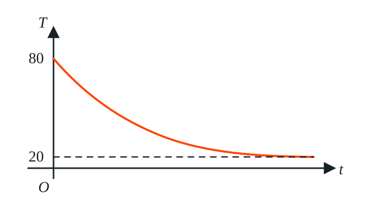

本文整理 2024—2026 年北京高三一模数学试题中的函数基本性质专题。以下仅收录题目，不含答案与解答过程。

## 一、单选题

### 1.（2026 北京海淀高三一模）

已知函数

$$
f(x)=
\begin{cases}
ax^2+bx, & x<0,\\
bx^2-ax, & x\ge0,
\end{cases}
$$

则“$ab<0$”是“$f(x)$ 在 $\mathbb R$ 上为单调函数”的（　）

- A. 充分不必要条件
- B. 必要不充分条件
- C. 充要条件
- D. 既不充分也不必要条件

如果$ab\gt0$,则$a,b$同号,显然有$s\to+\infty,t\to -\infty$,$f(s),f(t)\to\pm\infty$,则与“$f(x)$ 在 $\mathbb R$ 上为单调函数”矛盾.

如果$ab=0$,取$a=1,b=0$,则有$f(x)$在$\R$上单调递减.

如果$ab\lt0$,函数在$y$轴两侧对应的抛物线开口方向相反,且$f(0)=f(0^-)=0$.

现在考察两个抛物线的对称轴:

$$-\frac{b}{2a}\gt0,\frac{a}{2b}\lt0$$

因此,$f(x)$ 在 $\mathbb R$ 上为单调函数$\Longleftrightarrow ab\le0$

正确答案:A

### 2.（2026 北京房山高三一模）

设 $0<a<1$，函数

$$
f(x)=
\begin{cases}
a(x+2), & x<-a,\\
\sqrt{a^2-x^2}, & -a\le x\le a,\\
-a(x-2), & x>a,
\end{cases}
$$

则 $f(x)$（　）

- A. 是偶函数，且有最大值
- B. 是偶函数，且没有最大值
- C. 是奇函数，且有最大值
- D. 是奇函数，且没有最大值

先判断奇偶性:

$$x\in[-a,+a],f(-x)=f(x)\\
x\in(a,+\infty),\\
f(x)=-a(x-2)=a(-x+2)=f(-x)$$

所以函数$f(x)$为偶函数.

函数$f(x)$若没有最大值,很可能是有上确界,但是取不到.

由于$f(x)$是偶函数,只考虑$[0,+\infty)$的情况:

$$x\in[0,a],f(x)\le f(0)=a\\
x\in(a,+\infty),f(x)\lt f(a^+)=-a^2+2a\gt a$$

所以$\sup f(x)=-a^2+2a$,等号无法成立,$f(x)$没有最大值.

正确答案:B

### 3.（2025 北京东城高三一模）

中国茶文化博大精深，茶水的口感与水的温度有关。一杯 $80^\circ\mathrm C$ 的热红茶置于 $20^\circ\mathrm C$ 的房间里，茶水的温度 $T$（单位：$^\circ\mathrm C$）与时间 $t$（单位：$\mathrm{min}$）的函数 $T=f(t)$ 的图像如图所示。已知 $t_1,t_3$ 不相等，下列说法正确的是（　）

- A. 若 $t_1+t_3=2t_2$，则 $f(t_1)+f(t_3)>2f(t_2)$
- B. 若 $t_1+t_3>2t_2$，则 $f(t_1)+f(t_3)>2f(t_2)$
- C. 若 $f(t_1)+f(t_3)=2f(t_2)$，则 $t_1+t_3<2t_2$
- D. 若 $f(t_1)+f(t_3)>2f(t_2)$，则 $t_1+t_3>2t_2$

从凹凸性的角度考虑,有:

$$f(t_1)+f(t_3)\gt 2f(\frac{t_1+t_3}{2})$$

对于A:

$$t_1+t_3=2t_2\\
f(t_1)+f(t_3)\gt 2f(\frac{t_1+t_3}{2})=2f(t_2)$$

对于B:

$$t_1+t_3\gt2t_2\\
f(t_1)+f(t_3)\gt 2f(\frac{t_1+t_3}{2})\lt2f(t_2)$$

对于C:

$$f(t_1)+f(t_3)=2f(t_2)\gt 2f(\frac{t_1+t_3}{2})\\
t_2\lt \frac{t_1+t_3}{2}\\
t_1+t_3\gt2t_2$$

对于D:

$$f(t_1)+f(t_3)>2f(t_2)\\
f(t_1)+f(t_3)\gt 2f(\frac{t_1+t_3}{2})$$

无法比较$t_2,\frac{t_1+t_3}{2}$.

正确答案:A

### 4.（2024 北京西城高三一模）

设

$$
a=t-\frac1t,\qquad b=t+\frac1t,\qquad c=t(2+t),
$$

其中 $-1<t<0$，则（　）

- A. $b<a<c$
- B. $c<a<b$
- C. $b<c<a$
- D. $c<b<a$

$$t\in(-1,0),\frac1t\lt t\lt0,t^2\gt0\\
a-b=-2\frac1t\gt0\\
a\gt b\\
c=2t+t^2\gt2t\gt t+\frac1t=b$$

比较$a,c$:

$$t\to -1,a\to 0,c\to -1\\
c\lt a$$

理由是因为:

$$c\lt0\lt a$$

正确答案:C

启示:

- 运用极限情况,可以初步判断大小顺序
- 将0作为中间量,可以简化判断
- $|x|=1$是$x,\frac1x$大小关系的分界线.

## 二、填空题

### 5.（2026 北京西城高三一模）

记 $[x]$ 表示不超过实数 $x$ 的最大整数。设 $a,b$ 为正整数，函数

$$
f(x)=[ax]+[bx],
$$

给出以下四个结论：

① 对于任意的 $x_1,x_2$，若 $x_1<x_2$，则 $f(x_1)\le f(x_2)$；

② 存在正整数 $a,b$，使得曲线 $y=f(x)$ 关于坐标原点对称；

③ 设 $a=2,b=3$，则方程 $f(x)=10$ 有无数个解；

④ 设 $a=2,b=3$，则当 $x\in[0,1)$ 时，函数 $f(x)$ 的值域中有且仅有 $5$ 个元素。

其中，所有正确结论的序号是 ________。

①显然正确,因为内层函数$t=kx$和外层函数$y=[t]$都不减.

②:采用极限法分析

$$f(0^+)=0+0=0\\
f(0^-)=-1-1=-2$$

不可能让$f(x)$为奇函数

③:解方程

$$[2x]+[3x]=10$$

如果指定$[2x]=4,[3x]=6$,对应不等式:

$$4\le 2x\lt5,6\le3x\lt7\\
x\in[2,\frac73)$$

这对应无数个解.

此外,结合①,$f(\frac73)=11,f(2^-)=8$,知方程的解为$x\in[2,\frac73)$

或者这么解决:

对于③，当 $a=2, b=3$ 时，$f(x)=[2x]+[3x]$，

设 $x=n+t, n \in \mathbf{Z}, t \in [0,1)$，可得 $[2x]=[2n+2t]=2n+[2t], [3x]=3n+[3t]$，

所以 $f(x)=5n+[2t]+[3t]$，

令 $f(x)=10$，可得 $5n+[2t]+[3t]=10$，解得 $n=\frac{10-([2t]+[3t])}{5}$，

当 $t \in [0, \frac{1}{3})$ 时，可得 $[2t]=0, [3t]=0$，可得 $[2t]+[3t]=0$；

当 $t \in [\frac{1}{3}, \frac{1}{2})$ 时，可得 $[2t]=0, [3t]=1$，可得 $[2t]+[3t]=1$；

当 $t \in [\frac{1}{2}, \frac{2}{3})$ 时，可得 $[2t]=1, [3t]=1$，可得 $[2t]+[3t]=2$；

当 $t \in [\frac{2}{3}, 1)$ 时，可得 $[2t]=1, [3t]=2$，可得 $[2t]+[3t]=3$；

设 $m=[2t]+[3t] \in \{0,1,2,3\}$，由 $n=\frac{10-m}{5}$ 且 $n$ 为整数，

当 $m=0$ 时，可得 $n=2 \in \mathbf{Z}$；当 $m=1$ 时，可得 $n=\frac{9}{5} \notin \mathbf{Z}$；

当 $m=2$ 时，可得 $n=\frac{8}{5} \notin \mathbf{Z}$；当 $m=3$ 时，可得 $n=\frac{7}{5} \notin \mathbf{Z}$；

所以当 $x=2+t$ 且 $t \in [0, \frac{1}{3})$ 时，满足 $f(x)=10$，此时有无数个解，所以③正确；

④:$f(x)=[2x]+[3x]$

分类讨论$x$:

$$x\in[0,\frac13),f(x)=0+0=0\\
x\in[\frac13,\frac12),f(x)=0+1=1\\
x\in[\frac12,\frac23),f(x)=1+1=2\\
x\in[\frac23,1),f(x)=1+2=3\\
\therefore f(x)\in\{0,1,2,3\}$$

正确答案:①③

### 6.（2026 北京昌平高三一模）

设函数

$$
f(x)=
\begin{cases}
-ax+1, & x>a,\\
(x+2)^2, & x\le a.
\end{cases}
$$

若 $f(x)$ 存在最小值，则 $a$ 的一个取值为 ________，$a$ 的最小值为 ____。

我们直接寻找$a$的充要条件:
$$a=0,f(x)\ge f(-2)=0\\
a\gt0,-a\lt0,f(+\infty)=-\infty$$

对于$a\lt0$的情况,我们根据端点分类讨论:

$$a\in[-1,0),x\gt a,f(x)\gt f(a^+)=1-a^2\ge0\\
x\le a,f(x)\ge f(-2)=0,\text{符合题意}\\
a\in [-2,-1),x\gt a,f(x)\gt f(a^+)=1-a^2\lt0\\
x\le a,f(x)\ge f(-2)=0,\text{不符合题意}\\
a\in(-\infty,-2),x\gt a,f(x)\gt f(a^+)\lt0\\
x\le a,f(x)\ge f(a)\gt0,\text{不符合题意}$$

综上,$a\in[-1,0]$

正确答案:,$a\in[-1,0],a_{min}=-1$

### 7.（2026 北京石景山高三一模）

设函数

$$
f(x)=
\begin{cases}
\sqrt{x+1}, & x\in[-1,a),\\
ax+1, & x\in[a,3].
\end{cases}
$$

当 $a=0$ 时，$f(x)$ 的值域为 ________；若方程 $f(x)-\dfrac12=0$ 有两个不同的解，则实数 $a$ 的一个取值可以是 ____。

当$a=0$时,对自变量$x$的值分类讨论:

$$x\in[-1,0),f(x)=\sqrt{x+1}\in[0,1)\\
x\in[0,3],f(x)=1$$

综上,$f(x)$的值域为$[0,1]$.

若$f(x)=\frac12$有两个不同的解,则两个解$-1\le x_1\lt a\le x_2\le 3$:

$$\Longleftrightarrow \begin{cases}0\le \frac12\lt \sqrt{a+1},\\
\min \{a^2+1,3a+1\}\le \frac12\le\max\{a^2+1,3a+1\},\\
a\le 3\end{cases}\\
\Longleftrightarrow \begin{cases}\frac14\lt a+1,\\
(a^2+1-\frac12)(3a+1-\frac12)\le0\end{cases}\\
\Longleftrightarrow a\in(-\frac34,-\frac16]$$

### 8.（2025 北京西城高三一模）

记 $[x]$ 表示不超过实数 $x$ 的最大整数。设函数

$$
f(x)=x+[x],
$$

有以下四个结论：

① 函数 $f(x)$ 为单调函数；

② 对于任意的 $x$，$f(x)+f(-x)=0$ 或 $f(x)+f(-x)=-1$；

③ 集合 $\{x\mid f(x)=a\}$（$a$ 为常数）中有且仅有一个元素；

④ 满足 $f(x)+f(y)\le7$ 的点 $(x,y)$（$x\ge0,y\ge0$）构成的区域的面积为 $8$。

其中，所有正确结论的序号是 ________。

对于①,显然有$y=x$单调递增,$y=[x]$不减,所以$f(x)$单调递增

②:设$x=p+q,p\in Z,q\in[0,1)$,下面对小数部分进行分类:

$$q\in(0,1),-x=-p-q\in(-p-1,-p)\\
f(x)+f(-x)=p+(-p-1)=-1\\
q=0,-x=-p\\
f(x)+f(-x)=p+(-p)=0$$

③:举反例$a=-\frac12$,显然有$f(x)\in[0,+\infty)\cup(-\infty,-1)$

④:首先作出$f(x)$与$x$的对应关系

$$x\in[p,p+1),f(x)=p+x\in[2p,2p+1)\\
x\in[0,1),f(x)\in[0,1)\\
x\in[1,2),f(x)\in[2,3)\\
x\in[2,3),f(x)\in[4,5)\\
x\in[3,4),f(x)\in[6,7)\\
x\in[4,5),f(x)\in[8,9)$$

显然有$x,y\in[0,4)$,下面根据$x$进行分类:

$$x\in(0,1),f(x)=x\in(0,1),f(y)\in[0,7-x]\\
y_{\max}\in[3,4),f(y_{\max})=y_{\max}+3=7-x\\
y_{\max}=4-x\\
x\in(1,2),f(x)=x+1\in(2,3),f(y)\in[0,6-x]\\
y_{\max}\in[2,3),f(y_{\max})=y_{\max}+2=6-x\\
y_{\max}=4-x\\
x\in(2,3),f(x)=x+2\in(4,5),f(y)\in[0,5-x)\\
y_{\max}\in[1,2),f(y_{\max})=y_{\max}+1=5-x\\
y_{\max}=4-x\\
x\in(3,4),f(x)=x+3\in(6,7),f(y)\in[0,4-x)\\
y_{\max}\in[0,1),f(y_{\max})=y_{\max}=4-x\\
y_{\max}=4-x\\$$

综上,区域面积等于$x+y-4=0$与坐标轴围成三角形的面积$\frac{1}{2}\cdot4^2=8$

### 9.（2025 北京石景山高三一模）

高斯取整函数 $f(x)=[x]$ 的函数值表示不超过 $x$ 的最大整数，例如，$[-3.5]=-4$，$[2.1]=2$。有如下四个结论：

① 若 $x\in(0,1)$，则

$$
f(-x)+\frac12=-\left(f(x)+\frac12\right);
$$

② 函数 $f(x)=[x]$ 与函数 $h(x)=x-1$ 无公共点；

③

$$
\sum_{k=1}^{23}f\!\left(-\frac{k}{7}\right)
+\sum_{k=1}^{23}f\!\left(\frac{k}{7}\right)=-23;
$$

④ 所有满足 $f(m)=f(n)$（$m,n\in\left[0,\dfrac{10}{3}\right]$）的点 $(m,n)$ 组成区域的面积为 $\dfrac{28}{9}$。

其中所有正确结论的序号是 ________。

对于①:
$$x\in(0,1),f(-x)=-1,f(x)=0\\
f(-x)+\frac12=-(f(x)+\frac12)=-\frac12$$

对于②,$x\in[-1,0),[x]=x-1=h(x)$,有无穷个公共点.

对于③:
$$x\in\Z,f(x)+f(-x)=0,x\ne\Z,f(x)+f(-x)=-1\\
\sum_{k=1}^{23}f\!\left(-\frac{k}{7}\right)
+\sum_{k=1}^{23}f\!\left(\frac{k}{7}\right)\\
=-23+3=-20$$

对于④:

$$f(m)=f(n),m=p+q,p\in\Z,q\in[0,1)\\
\Longleftrightarrow \begin{cases}n\in[m,m+1),q=0\\
n\in[p,p+1),q\in(0,1)\end{cases}$$

为了计算面积,可以不考虑局部处的单点图像.我们只考虑$q\in(0,1)$,那么:

$$n\in[p,p+1)\\
m\in(0,1),n\in(0,1)\\
m\in(1,2),n\in(1,2)\\
m\in(2,3),n\in(2,3)\\
m\in(3,\frac{10}3],n\in(3,\frac{10}3]$$

事实上:

$$m\in[0,1),n\in[0,1)\\
m\in[1,2),n\in[1,2)\\
m\in[2,3),n\in[2,3)\\
m\in[3,\frac{10}3],n\in(3,\frac{10}3]$$

于是面积等于$3\cdot1+(\frac13)^2=\frac{28}{9}$

### 10.（2024 北京丰台高三一模）

已知函数 $f(x)$ 具有下列性质：

① 当 $x_1,x_2\in[0,+\infty)$ 时，都有

$$
f(x_1+x_2)=f(x_1)+f(x_2)+1;
$$

② 在区间 $(0,+\infty)$ 上，$f(x)$ 单调递增；

③ $f(x)$ 是偶函数。

则 $f(0)=$ ________；函数 $f(x)$ 可能的一个解析式为 $f(x)=$ ____。

令$x_1=x_2=0,f(0)=2f(0)+1,f(0)=-1$

把常数吞入$g(x)$中,构造柯西方程:

$$g(x)=f(x)-k,x\ge0\\
g(x_1+x_2)+k=g(x_1)+k+g(x_2)+k+1\\
\text{let }k=2k+1,k=-1\\
g(x_1+x_2)=g(x_1)+g(x_2)$$

由$g(x)=f(x)-k=f(x)+1$在$(0,+\infty)$上单调递增,有$g(x)\equiv cx,c\in(0,+\infty)$

所以:

$$f(x)=\begin{cases}cx-1,x\ge0,\\
-cx-1,x\lt0\end{cases}=c|x|-1$$

其中,$c\gt0$
