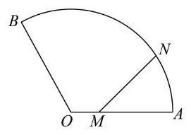

> 题目来源：[菁师帮试卷 190953](https://www.jingshibang.com/home/#/paperDetail?id=190953)  
> 本文仅整理题目，不含答案与解析。

本文共整理 36 道题，包括 7 道单选题、5 道填空题和 24 道解答题。

## 单选题

### 1.

(2025 北京第五十五中学高三上期中)已知函数 $f(x)=\sin\left(\omega x+\frac{\pi}{6}\right)(\omega>0)$ 在 $-\frac{\pi}{3}$ 处取到最小值,且在区间 $\left(0,\frac{\pi}{6}\right)$ 上存在极大值,$\omega$ 的最小整数解是( )

**A.** 2

**B.** 8

**C.** 10

**D.** 14

解答:

由极小值点为$-\frac\pi3$:

$$-\frac\pi{3}\omega+\frac\pi6=-\frac\pi2+2k\pi,k\in\Z\\
\omega=2-6k,k\in\Z$$

然后考虑极大值点在区间上的存在性:

$$\frac\pi6\omega+\frac\pi6\gt\frac\pi2\\
\omega\gt2\\
k=-1,\omega_\min=8$$

正确答案:B

### 2.

(2025 北京顺义牛栏山第一中学高三上期中) 已知函数 $f(x)=|\ln(x+1)|-kx$，则下列结论中正确结论的个数为（　　）

① 存在正数 $k$，使 $f(x)$ 在定义域内单调递减；

② 当 $-1\leq k\leq 0$ 时，函数 $f(x)$ 有唯一零点；

③ 若 $f(x)$ 存在两个零点 $x_1,x_2$，且 $|x_1-x_2|>2$，则 $k\in\left(0,\frac{\ln 3}{2}\right)$。

**A.** 0

**B.** 1

**C.** 2

**D.** 3

对于①,取$k=1$,则:

$$x\in(-1,0),f(x)=-\ln(x+1)-x\downarrow\\
x\in(0,+\infty),f(x)=\ln(x+1)-x\\
f'(x)=\frac{1}{x+1}-1\lt f'(0)=0\\
x\in(0,+\infty),f(x)\downarrow$$

对于②,我们结合图像,做出左右切线:

$$\begin{cases}y=kx,k\in[-1,0]\\
y=|\ln(x+1)|\end{cases}$$

仅有$(0,0)$这一个交点

对于③,不妨设$x_1\lt x_2$易知$k\in(-\infty,-1)\cup(0,+\infty)$,分类:

$$k\in(-\infty,-1),x_2=0,x_1\in(-1,0)\\
|x_2-x_1|\in(0,1)\\
k\in(0,+\infty),x_1=0,\ln(x_2+1)=kx_2\\
k=\frac{\ln(x_2+1)}{x_2}\\
g(x)=\frac{\ln(x+1)}{x},x\gt0\\
g'(x)=\frac{\frac{x}{x+1}-\ln(x+1)}{x^2}\lt0\\
|x_2-x_1|=x_2\gt2,k=g(x_2)\lt g(2)=\frac{\ln3}2\\
\therefore k\in(0,\frac{\ln3}{2})$$

正确答案:D

### 3.

(2025 北京第一六六中学高三上期中)已知函数$f(x)$和$g(x)$在实数集上的图象均为一条连续不断的曲线,且满足:$\forall x_1、x_2\in \mathbf{R}$,都有$|f(x_1)-f(x_2)|\geq|g(x_1)-g(x_2)|$.
命题$p$:若函数$f(x)$在实数集上单调递增,则函数$h(x)=f(x)-g(x)$不是减函数;
命题$q$:若函数$f(x)$在实数集上无最大值,则函数$g(x)$无最大值.
则下列判断正确的是( )

**A.** $p$和$q$都是真命题

**B.** $p$和$q$都是假命题

**C.** $p$是真命题,$q$是假命题

**D.** $p$是假命题,$q$是真命题

对于命题$p$,不严谨的证明是:

$$|\frac{f(x_1)-f(x_2)}{x_1-x_2}|\geq|\frac{g(x_1)-g(x_2)}{x_1-x_2}|\\
\lim_{x_2\to x_1}|\frac{f(x_1)-f(x_2)}{x_1-x_2}|\geq \lim_{x_2\to x_1}|\frac{g(x_1)-g(x_2)}{x_1-x_2}|\\
|f'(x_1)|\ge |g'(x_1)|\\f'(x)\ge 0,f'(x)\ge |g'(x)|\\
h'(x)=f'(x)-g'(x)\\
\ge f'(x)-|g'(x)|\ge0$$

这样可以不完备地说明$h(x)$不减.

注意,可导函数一定连续,连续函数不一定可导. 以上的证明方法默认了$f(x),g(x)$均可导.

严谨的书写如下:

$$x_1\lt x_2,f(x_1)-f(x_2)\lt 0\\
h(x_1)-h(x_2)\\
=f(x_1)-f(x_2)-[g(x_1)-g(x_2)]\\
=-|f(x_1)-f(x_2)|-[g(x_1)-g(x_2)]\\
\le -|f(x_1)-f(x_2)|+|g(x_1)-g(x_2)|\le0$$

对于命题$q$,可以构造反例:

$$f(x)=e^x\\
g(x)=\begin{cases}e^x,x\in(-\infty,0],\\
x+1,x\in(0,1)\\
-x+3,x\in[1,+\infty)\end{cases}$$

显然这样的构造符合题干要求,推翻了命题$q$.

正确答案:C

### 4.

(2025 北京朝阳高三上期中)若函数 $f(x)=x+\frac{a}{x^2}$ 在区间 $[1,2]$ 上是单调函数,则实数 $a$ 的取值范围是( )

**A.** $\left(-\infty, \frac{1}{2}\right] \cup [4, +\infty)$

**B.** $(-\infty, 0] \cup [8, +\infty)$

**C.** $(-\infty, 0] \cup [4, +\infty)$

**D.** $\left[0, \frac{1}{2}\right] \cup [8, +\infty)$

要求导函数$f'(x)=1-\frac{2a}{x^3}$无变号零点:

$$f'(x)=\frac1{x^3}(x^3-2a),x\in[1,2]\\
2a\in (-\infty,1]\cup[8,+\infty)\\
a\in(-\infty,\frac12]\cup[4,+\infty)$$

正确答案:A

### 5.

(2025 北京第五中学高三上期中)下列函数中,在其定义域内既是奇函数,又是减函数的是( )

**A.** $f(x)=\frac{1}{x}$

**B.** $f(x)=\sqrt{-x}$

**C.** $f(x)=2^{-x}-2^x$

**D.** $f(x)=\log_{\frac{1}{2}}|x|$

正确答案:C

### 6.

(2025 北京汇文中学高三上期中)对于函数 $f(x)$,若存在实数 $x_0$,使 $f(x_0)f(x_0+\lambda)=1$,其中 $\lambda\neq 0$,则称 $f(x)$ 为“可移 $\lambda$ 倒数函数”,$x_0$ 为“$f(x)$ 的可移 $\lambda$ 倒数点”. 设 $f(x)=\begin{cases} e^x, & x>0 \\ \frac{1}{x+a}, & x<0 \end{cases}$,若函数 $f(x)$ 恰有 3 个“可移 1 倒数点”,则 $a$ 的取值范围( )

**A.** $(2,e)$

**B.** $(2,+\infty)$

**C.** $(-1,2)$

**D.** $\left(\frac{1+\sqrt{5}}{2},e\right)$

函数 $f(x)$ 恰有 3 个“可移 1 倒数点”,等价于$g(x)=f(x)f(x+1)-1$恰有三个零点,下面按照"易中天"的顺序思考:

$$x\in(0,+\infty),g(x)=e^x\cdot e^{x+1}-1\gt e-1\gt0\\
x\in(-1,0),g(x)=\frac{e^{x+1}}{x+a}-1=0\\
e^{x+1}=x+a\gt0\\
x\in(-\infty,-1),g(x)=\frac{1}{(x+a)(x+a+1)}-1=0\\
(x+a)(x+a+1)=1$$

我们接下来为$g(x)$的三个零点划定归属:

- $x_1\lt x_2\lt -1\lt x_3\lt 0$
- $x_1\lt -1\lt x_2\lt x_3\lt0$

对于$x_1\lt x_2\lt -1\lt x_3\lt 0$,对应图像中$y=x+a$与$y=e^{x+1}$相切,即$a=2$,切点$(-1,1)$,与$x_3\gt-1$矛盾

对应$x_1\lt -1\lt x_2\lt x_3\lt0$,对应图像中$a\in(2,e)$,接下来考虑二次函数零点个数的约束:

$$x^2+(2a+1)x+(a^2+a-1)=0\\
\Delta=(2a+1)^2-4(a^2+a-1)\\
=4a+5\gt0\\
x_{1,2}=\frac{-(2a+1)\pm\sqrt{4a+5}}{2}\\
\begin{cases}x_1=\frac{-(2a+1)-\sqrt{4a+5}}{2}\lt-1,\\
x_2=\frac{-(2a+1)+\sqrt{4a+5}}{2}\ge-1\end{cases}$$

对于$x_1$,有:

$$x_1\lt -a\lt-1$$

对于$x_2$,有:

$$-(2a+1)+\sqrt{4a+5}\ge -2\\
\sqrt{4a+5}\ge 2a-1\ge 3\gt0\\
4a+5\ge 4a^2-4a+1\\
4a^2-8a-4\le0\\
4(a-1)^2-8\le0\\
|a-1|\le 2\\
a\in[-1,3]$$

综上,有:$a\in(2,e)$

正确答案:A

### 7.

(2025 北京第一七一中学高三上期中)已知 $f(x)=\begin{cases} xe^x, & x\leq 0 \\ kx^2 - x, & x>0 \end{cases}$,$g(x)=f(x)-m$,其中 $k,m$ 是常数,则( )

**A.** 存在实数 $k$,使得对任意实数 $m$,函数 $g(x)$ 都有零点

**B.** 存在实数 $m$,使得对任意实数 $k$,函数 $g(x)$ 至少有 2 个零点

**C.** 对于任意实数 $m$,存在实数 $k$,使得函数 $g(x)$ 恰有 2 个零点

**D.** 对于任意实数 $k$,存在实数 $m$,使得函数 $g(x)$ 恰有 3 个零点

对$k$的符号进行分类,可以确定抛物线的开口方向和单调性,或退化情况:

$$x_0=\frac1{2k}\\
k=0,m\in(0,+\infty),g(x)\text{没有零点}\\
m=0,g(x)\text{有唯一零点}\\
m\in(-\frac1e,0),g(x)\text{有且仅有三个零点}\\
m=-\frac1e,g(x)\text{恰有两个零点}\\
m\in(-\infty,-\frac1e),g(x)\text{恰有一个零点}\\k\lt 0,x_0\lt 0,\text{同k=0}$$

此时,我们可以知难而退,$k\gt0$时顶点处函数值与$-\frac1e$的大小关系还会影响分类,这样过于复杂. 我们直接从选项入手.

A:要使对于任意实数m,$g(x)$都有零点,要求$f(x)$值域为$\R$,这表明$k\gt 0$,否则$f(x)\le0$.

若$k\gt0$,则$f(x)$有最小值,取足够小的$m$就可以让$g(x)\gt0$. 所以A不正确

B:取$m\in(-\frac1e,0)$,可以使得$g(x)$在$(-\infty,0)$上恰有两个零点,符合B. B正确

C:取$m\in(0,+\infty)$,根据二次函数的图像,$g(x)$有且仅有一个零点,所以C不正确.

D:取一个极特殊的$k\gt0$,使得抛物线顶点处函数值$-\frac1{4k}$等于$-\frac1e$,即可让$g(x)$可能的零点数目为$0,1,2,4$,D不正确.

正确答案:B

## 填空题

### 8.

(2025 北京顺义第一中学高三上期中)已知函数 $f(x)=x+\frac{a}{x}(x>0)$,若 $f(x)$ 为单调递增函数,则实数 $a$ 的范围为______,若 $f(x)\geq 3$ 恒成立,则实数 $a$ 的范围______。

$$f(x)\text{为单调递增函数}\Longleftrightarrow f'(x)\ge0\\
f'(x)=1-\frac{a}{x^2}\ge0\\
a\le 0,f'(x)\ge1\gt0\\
a\gt 0,x\in(0,\sqrt{a}),f'(x)\lt0$$

综上,$a\in(-\infty,0]$

对于第二个空,如果$a\le0,f(1)=1+a\lt3$,不符合题意.

如果$a\gt0,\min_{x\gt0}f(x)=2\sqrt{a}\ge3$,有$a\ge\frac94$.

综上,$a\in[\frac94,+\infty)$

### 9.

(2025 北京海淀高三上期中) 某社区内有一扇形草坪如图，扇形的半径 $OA$ 为 60 米，$\angle AOB=\frac{2\pi}{3}$。甲从圆心 $O$ 出发，沿 $OA$ 以每秒 1 米的速度向 $A$ 慢走；同时乙从 $A$ 出发，沿 $\overset{\frown}{AB}$ 以每秒 $\frac{2\pi}{3}$ 米的速度向 $B$ 慢跑。经过 $t\,(0\leq t\leq 60)$ 秒，甲、乙所在位置分别为 $M,N$，记 $MN$ 的长度为 $f(t)$ 米。给出下列四个结论：

① 当 $t=30$ 时，$MN\perp OA$；

② 函数 $y=f(t)$ 在区间 $(30,45)$ 上单调递增；

③ 方程 $f(t)=60$ 在区间 $(45,60)$ 上恰有一个根；

④ 若函数 $f(t)$ 在 $t=t_0$ 处取得最小值，则 $t_0\in(0,30)$。

其中所有正确结论的序号是______。

①:

$$MN\perp OA\Longleftrightarrow R\cos\angle MON=OM\\
60\cos\frac{2\pi}{3\cdot 60}t=t,t\in[0,60]\\
t=30$$

②:

在$\triangle MON$中使用余弦定理:

$$f(t)=\sqrt{R^2+OM^2-2R\cdot OM\cdot \cos\angle MON}\\
=\sqrt{60^2+(t)^2-2(60)(t)\cos\frac{\pi}{90}t}\\
=\sqrt{60^2+t^2-120t\cos\frac{\pi}{90}t}$$

$$(t\cos\frac\pi{90}t)'=\cos\frac\pi{90}t-t\frac\pi{90}\sin\frac\pi{90}t\lt \cos\frac\pi3-\sin\frac\pi3\lt0,\\
(t^2)'=2t\gt0,\\
f'(t)=\frac{1}{2\sqrt{60^2+t^2-120t\cos\frac{\pi}{90}t}}[(t^2)'-120(t\cos\frac\pi{90}t)']\gt0,t\in(30,45)$$

事实上,从几何直观上看,$t\in(30,45),t\uparrow$,$M,N$的横纵间距都在增大.

但是代数法自有强大之处:对于$t\in[30,60]$,我们同样可以得到$f(t)$的单调性. 但是由于$M,N$纵坐标在$t\in[45,60]$上单减,难以继续沿用几何法.

$t\in[30,60],\frac\pi{90}t\in[\frac\pi3,\frac{2\pi}{3}],(t\cos\frac\pi{90}t)'=\cos\frac\pi{90}t-t\frac\pi{90}\sin\frac\pi{90}t\lt \cos\frac\pi3-\sin\frac\pi3\lt0$

③:

沿用②的拓展结论,$f(45)=\sqrt{60^2+45^2}=75$,那么:

$$t\in[45,60],f(t)\ge f(45)\gt 60\\
f(t)=60\text{无解}$$

④:

$$t\in[30,60],f(t)\uparrow$$

那么,只需要考虑$t\in[0,30]$,在这个闭区间里,最小值要么出自于端点,要么出自于内部的极小值点.

$$f'(t)=\frac{1}{2\sqrt{60^2+t^2-120t\cos\frac{\pi}{90}t}}[(t^2)'-120(t\cos\frac\pi{90}t)'],t\in[0,30]\\
=k(2t-120\cos\frac\pi{90}t+120t\frac\pi{90}\sin\frac\pi{90}t)\\
t\uparrow,(2t-120\cos\frac\pi{90}t+120t\frac\pi{90}\sin\frac\pi{90}t)\uparrow\\
f'(0)\lt0,f'(30)\gt0\\
\exists x_0\in(0,30),x\in(0,x_0),f'(x)\lt0,\\
x\in(x_0,60),f'(x)\gt0$$

所以,$\min_{t\in[0,60]} f(t)=f(x_0),x_0\in(0,30)$

正确答案:①②④

反思:返璞归真的代数法,反而快于几何法,因为减少了不同方法的切换overhead.

### 10.

(2025 北京东直门中学高三上期中) 写出一个满足条件①②③的函数 $f(x)=$______。

① $f(x)$ 的定义域为 $\mathbf{R}$；

② $f(x)$ 的值域为 $[0,1]$；

③ $x=0$ 为 $f(x)$ 的极值点。

例:$f(x)=\begin{cases}\frac1{x+1},x\ge0\\
\frac1{-x+1},x\lt0\end{cases}$

### 11.

(2025 北京第一零一中学高三上期中) 已知函数 $f(x)=\frac{\cos x}{x^2+1}$，给出下列四个结论：

① 函数 $f(x)$ 的图象关于原点中心对称；

② 存在 $x_0>0$，使得 $f(x_0)=\frac{\sqrt{2}}{2}$；

③ 函数 $f(x)$ 的图象与函数 $y=\frac{1}{x}$ 的图象没有公共点；

④ 函数 $f(x)$ 的极值点个数为 3。

其中所有正确结论的序号是______。

①:显然$f(1)+f(-1)=2f(1)\ne0$,错误

②:$f(0)=1,x\to+\infty,f(x)\to0$,由零点存在性定理,正确

③:

$$\frac{\cos x}{x^2+1}=\frac1x\\
\cos x=x+\frac1x\\
|\cos x|=|x+\frac1x|\ge2$$

这将与三角函数的有界性矛盾,故无公共点

④:

$$f'(x)=\frac{(-\sin x)(x^2+1)-(\cos x)(2x)}{(x^2+1)^2}=0\\
(x^2+1)\sin x+2x\cos x=0\\
\cos x\ne0\\
g(x)=(x^2+1)\tan x+2x=0$$

显然,$g(x)$为奇函数,则$g(x)$的零点关于$x=0$对称.

$$x\gt0,k\in \N^*,x\to (\frac\pi2+k\pi)^+,\tan x\to -\infty,g(x)\to -\infty\\
g(k\pi)=2k\pi\gt0$$

根据零点存在性定理,必然存在无数个$x\in(k\pi,\frac\pi2+k\pi),k\in \N^*,s.t f'(x)=0$

正确答案:②③

### 12.

(2025 北京育才学校高三上期中) 已知函数 $f(x)=\frac{1}{3+x^2}-(kx+b)$，给出下列四个结论：

① 当 $k=0$ 时，对任意 $b\in\mathbf{R}$，$f(x)$ 有 1 个极值点；

② 当 $k>\frac{1}{8}$ 时，存在 $b\in\mathbf{R}$，使得 $f(x)$ 存在极值点；

③ 当 $b=0$ 时，对任意 $k\in\mathbf{R}$，$f(x)$ 有一个零点；

④ 当 $0<b<\frac{1}{3}$ 时，存在 $k\in\mathbf{R}$，使得 $f(x)$ 有 3 个零点。

其中所有正确结论的序号是______。

①:$k=0$,显然$x=0$是$f(x)$唯一的极值点

②:

$$f'(x)=2x\frac{-1}{(x^2+3)^2}-k=0\\
x\ne0\\
k=\frac{2(-x)}{(x^2+3)^2}\\
=\frac{2(-x)}{(x^2+1+1+1)^2}\\
\le \frac{2|x|}{(4\sqrt{|x|})^2}=\frac18(x=-1)\\
x=0,k=0$$

则②错误,因为$k\gt\frac18$使得$f(x)$单调递减

③:

$$f(x)=0\\
kx=\frac{1}{x^2+3}\\
kx(x^2+3)=1\\
kx^3+3kx-1=0$$

取$k=0$,$f(x)\ne0$,无零点

④:

$$kx+b=\frac{1}{x^2+3}\\
(kx+b)(x^2+3)-1=0\\
g(x)=kx^3+bx^2+3kx+(3b-1)=0\\
g'(x)=3kx^2+2bx+3k\\
\Delta=4b^2-36k^2\gt0$$

通过选取较小的$k$,可以让$g(x)$出现不单调的情况,这否定不了④.

我们使用一元三次方程有三个不同实根的充要条件:

$$\Delta=b^2(3k)^2-4k(3k)^3-4b^3(3b-1)-27k^2(3b-1)^2+18k(b)(3k)(3b-1)\gt0$$

## 解答题

### 13.

(2025 北京第五十五中学高三上期中)已知函数 $f(x)=ae^x-\ln(x+1)(a\in\mathbf{R},a\neq 0)$ .

(1)当$a=2$时,求曲线$y=f(x)$在点$(0,f(0))$处的切线方程;

(2)讨论函数$f(x)$在区间$[0,+\infty)$上的极值点的个数;

(3)若函数$f(x)$在区间$[0,+\infty)$上有唯一零点$t$,证明:$t<1$.

### 14.

(2025北京顺义牛栏山第一中学高三上期中)已知函数$f(x)=\frac{x^2-2x}{e^{ax}}$在$x=2$处的切线为$y=\frac{2}{e^2}x-\frac{4}{e^2}$.

(1)求$a$;

(2)证明:函数$f(x)$有最小值.

### 15.

(2025北京汇文中学高三上期中)已知函数$f(x)=\frac{x+2}{x^2+3x}$

(1)求曲线$y=f(x)$在点$A(-2,f(-2))$处的切线方程；

(2)设函数 $g(x)=f(x)-\ln(x+2)$.

(i) 求 $g(x)$ 的单调区间;

(ii) 判断 $g(x)$ 的零点个数,并说明理由;

(3)若存在 $m$ 条互相平行的直线与曲线 $y=f(x)$ 相切,写出 $m$ 的最大值(只需写出结论)

### 16.

(2025 北京北师大附中高三上期中)已知函数 $f(x)=(x^2-ax+1)\ln x$($a\in\mathbf{R}$).

(1)若 $a=2$,求函数 $f(x)$ 的单调区间;

(2)若函数 $f(x)$ 在区间 $(0,1)$ 和 $(1,+\infty)$ 上各恰有一个零点,分别记为 $x_1$ 和 $x_2$,

(i) 证明:函数 $f(x)$ 在两点 $(x_1,0)$,$(x_2,0)$ 处的切线平行;

(ii) 记曲线 $y=f(x)$ 在点 $(x_1,0)$ 处的切线与两坐标轴围成的三角形面积为 $S$，求 $\frac{S}{x_2-x_1}$ 的最大值。

### 17.

(2025 北京北师大附中高三上期中)已知函数 $f(x)=\frac{x^2}{kx-1}$($k\in\mathbf{R}$).

(1)求曲线 $y=f(x)$ 在点 $(0,f(0))$ 处的切线方程;

(2)求 $f(x)$ 的极小值点;

(3)当 $k>0$ 时,若对任意 $x\in\left(\frac{1}{k},+\infty\right)$,$k^2f(x)>ax+1$ 恒成立,记此时实数 $a$ 的最大值为 $g(k)$,求 $g(k)$ 的解析式.

### 18.

(2025 北京第八中学高三上期中)已知函数 $f(x)=a\ln^2 x-x\ln x+x$ .

(1)若 $a=0$,求 $f(x)$ 的零点;

(2)若 $a>0$,讨论 $f(x)$ 的单调性;

(3)若 $a\in(0,1)$,$\mathrm{e}$ 为自然对数的底数,证明:$f(\mathrm{e}^a)<1$.

### 19.

(2025 北京顺义第一中学高三上期中)函数 $f(x)$ 的定义域为 $(-1,+\infty)$,$f(0)=0$,$f(x)$ 的导函数 $f'(x)=(x+1)\ln(x+1)$,$l_1$ 为 $A(a,f(a))(a\neq 0)$ 处的切线.

(1) $f'(x)$ 的最小值;

(2) $a>0$,除点 $A$ 外,曲线 $y=f(x)$ 均在 $l_1$ 上方;

(3) 若 $-1<a<0$ 时,直线 $l_2$ 过 $A$ 且与 $l_1$ 垂直,$l_1$,$l_2$ 分别于 $x$ 轴的交点为 $x_1$ 与 $x_2$,求 $\frac{2a-x_1-x_2}{x_2-x_1}$ 的取值范围.

### 20.

(2025 北京通州高三上期中)已知函数 $f(x)$ 的定义域为 $\mathbf{R}$,其导函数 $f'(x)=\mathrm{e}^x-2ax-1$.

(1)当 $a>0$ 时,求 $f'(x)$ 的单调区间;

(2)若 $f(0)=k+1,g(x)=-ax^2+k$,求证:函数 $f(x)$ 的图象恒在函数 $g(x)$ 的图象的上方;

(3)若 $x=0$ 为 $f(x)$ 的极大值点,求实数 $a$ 的取值范围.

### 21.

(2025 北京通州高三上期中)已知函数 $f(x)=x^3-ax^2+ax-1$ 有三个零点记为 $x_1,x_2,x_3(x_1<x_2<x_3)$,其中 $x_1\in(0,1)$ 和 $x_3\in(1,+\infty)$.

(1)求实数 $a$ 的取值范围;

(2)记曲线 $y=f(x)$ 在点 $(x_1,0)$ 处的切线为 $l$,设直线 $l$ 与 $y$ 轴交点的坐标为 $(0,m)$,求 $m$ 的范围.

### 22.

(2025 北京通州高三上期中)设函数 $f(x)=2\sin(\omega x+\varphi)\left(\omega>0,|\varphi|<\frac{\pi}{2}\right)$,且 $f(0)=\sqrt{3}$.

(1)求 $\varphi$ 的值;

(2)已知 $f(x)$ 在区间 $\left[\frac{\pi}{12},\frac{7\pi}{12}\right]$ 上单调递减,再从条件1、条件2、条件3这三个条件中选择一个作为已知,使函数 $f(x)$ 存在,求 $f(x)$ 在区间 $\left[0,\frac{\pi}{2}\right]$ 上的取值范围.

条件①：$f\left(\frac{\pi}{6}\right)-f(0)=1$;

条件②：$x=\frac{\pi}{12}$ 是 $f(x)$ 的一个极值点;

条件③：$f(x)$ 的图象关于点 $\left(\frac{\pi}{3},0\right)$ 对称;

> 注：如果选择的条件不符合要求,第(2)问得0分,如果选择多个符合要求的条件分别解答,按第一个解答计分.

### 23.

(2025 北京第一六六中学高三上期中)已知函数 $f(x)=\ln(1+x)-x+\frac{1}{2}x^2-kx^3$,$k\in\mathbf{R}$.

(1)当 $k=0$ 时,求曲线 $y=f(x)$ 在 $(0,0)$ 处的切线方程;

(2)当 $0<k<\frac{1}{3}$ 时,

① 证明：函数 $f(x)$ 在区间 $(0,+\infty)$ 内存在唯一的极值点；

② 记 $f(x)$ 在区间 $(0,+\infty)$ 内的极值点为 $m$，设函数 $g(x)=f(m+x)-f(m-x)$，$x\in(0,m)$，讨论函数 $g(x)$ 的单调性。

### 24.

(2025 北京朝阳高三上期中)已知函数 $f(x)=\frac{\sin x}{2+\cos x}$.

(1)求 $f(x)$ 在区间 $[0,\pi]$ 上的最大值;

(2)若函数 $g(x)=f(x)-\frac{1}{\pi}x$,求证:$g(x)$ 在区间 $\left(0,\frac{\pi}{2}\right)$ 上有且只有一个极大值点;

(3)若 $x\in(0,\pi)$,写出 $\frac{x-f(x)}{x+f(x)}$ 的取值范围.(只需写出结论)

### 25.

(2025 北京朝阳高三上期中)已知函数 $f(x)=2\ln x-(2a+1)x+\frac{1}{2}ax^2(a\in\mathbf{R})$.

(1)当 $a=0$ 时,求曲线 $y=f(x)$ 在点 $(1,f(1))$ 处的切线方程;

(2)讨论函数 $f(x)$ 的单调性.

### 26.

(2025 北京海淀高三上期中)已知函数 $f(x)=x^3+ax$ 有两个极值点 $x_1,x_2(x_1<x_2)$. 记 $A(x_1,f(x_1))$, $B(x_2,f(x_2))$.

(1)若点$A$在直线$y=-2x$上,求$a$的值;

(2)若函数$g(x)=e^{-ax}$的图象上存在点$P$,使得$\triangle PAB$是以$P$为顶点的等腰三角形,求$a$的取值范围.

### 27.

(2025 北京海淀高三上期中)已知函数$f(x)=\ln x+\frac{a(x-1)}{x-2}$,再从条件1、条件2、条件3这三个条件中选择一个作为已知,使得$f(x)$唯一确定,求:

(1)曲线$y=f(x)$在点$(1,f(1))$处的切线方程;

(2)函数$f(x)$的单调区间.

条件①：$f(1)=0$;

条件②：$f(4)=2\ln 2+\frac{3}{2}$;

条件3：$f'(3)=-\frac{2}{3}$。

注：如果选择的条件不符合要求，本题得 0 分；如果选择多个符合要求的条件分别解答，按第一个解答计分。

### 28.

(2025 北京东直门中学高三上期中)已知函数 $f(x)=x^2-ax+2\ln x$,$a\in\mathbf{R}$.

(1)当 $a=5$ 时,求 $f(x)$ 的单调区间;

(2)已知 $f(x)$ 有两个极值点 $x_1$,$x_2$,且 $x_1<x_2$,

(i)求实数 $a$ 的取值范围;

(ii)求 $2f(x_1)-f(x_2)$ 的最小值.

### 29.

(2025 北京育才学校高三上期中)已知函数 $f(x)=\frac{e^x}{x}$.

(1)求函数 $y=f(x)$ 的图象在点 $P(1,f(1))$ 处的切线 $l$ 的方程;

(2)当 $x>0$ 时,求证:$f(x)>x$;

(3)讨论函数 $y=f(x)-bx$($b\in\mathbf{R}$ 且为常数)零点的个数.

### 30.

(24-25 高三上·北京高三上期中)已知函数 $f(x)=x^3+ax^2+bx-1$ 在 $x=1$ 处有极值-1.

(1)求实数 $a$,$b$ 的值;

(2)求函数 $g(x)=ax+\ln x$ 的单调区间.

### 31.

(2025 北京第一七一中学高三上期中)已知函数 $f(x)=x-a\ln x$.

(1)求曲线 $y=f(x)$ 在点 $(1,f(1))$ 处的切线方程;

(2)求 $f(x)$ 的单调区间;

(3)若关于 $x$ 的方程 $x-a\ln x=0$ 有两个不相等的实数根,记较小的实数根为 $x_0$,求证:$(a-1)x_0>a$。

### 32.

(2025 北京第四中学高三上期中)已知函数 $f(x)=x-a\ln x-b(a,b\in\mathbf{R},a\neq0)$。

(1)若 $a=b=1$,求 $f(x)$ 的极值;

(2)若 $f(x)\geq0$,求 $ab$ 的最大值。

### 33.

(2025 北京第一六一中学高三上期中)已知函数 $f(x)=ax^2-x\sin x+b$。

(1)当 $a=1$ 时,求证:

① 当 $x>0$ 时，$f(x)>b$；

② 函数 $f(x)$ 有唯一极值点；

(2) 若曲线 $C_1$ 与曲线 $C_2$ 在某公共点处的切线重合，则称该切线为 $C_1$ 和 $C_2$ 的“优切线”。若曲线 $y=f'(x)$ 与曲线 $y=-\cos x$ 存在两条互相垂直的“优切线”，求 $a,b$ 的值。

### 34.

(2025 北京西城外国语学校高三上期中)设 $a\in\mathbf{R}$,函数 $f(x)=\ln x-ax$.

(1)当 $a=0$ 时,求曲线 $y=f(x)$ 在点 $(\mathrm{e},f(\mathrm{e}))$ 处的切线方程;

(2)求 $f(x)$ 的单调区间;

(3)若函数 $f(x)$ 有两个相异零点 $x_1$,$x_2$,求证:$x_1x_2>\mathrm{e}^2$.

### 35.

(2025 北京第十四中学高三上期中)已知函数 $f(x)=\mathrm{e}^x-1-m\sin x(m\in\mathbf{R})$.

(1)当 $m=1$ 时,

(i) 求曲线 $y=f(x)$ 在点 $(0,f(0))$ 处的切线方程;

(ii) 求证:$\forall x\in\left(0,\frac{\pi}{2}\right)$,$f(x)>0$.

(2)若 $f(x)$ 在 $\left(0,\frac{\pi}{2}\right)$ 上恰有一个极值点,求 $m$ 的取值范围.

### 36.

(2025 北京昌平第一中学高三上期中)已知函数 $f(x)=\ln x-(a+2)x+ax^2$($a\in R$).

(1)当 $a=0$ 时,求曲线 $y=f(x)$ 在点 $(1,f(1))$ 处的切线方程;

(2)求 $f(x)$ 的单调区间;

(3)若 $f(x)$ 恰有两个零点,求实数 $a$ 的取值范围.