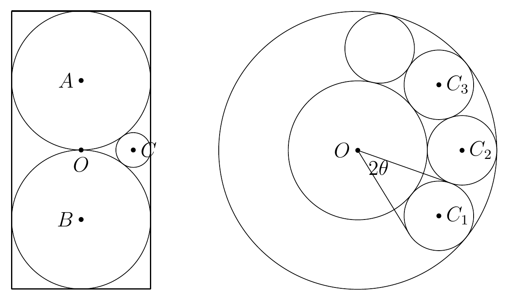

## 一、填空题

本大题共 8 题，每题 8 分，满分 64 分。

### 第 1 题

平面向量 $\vec{x},\vec{y},\vec{z}$ 满足 $|\vec{x}|=1$，$|\vec{y}|=2$，$|\vec{z}|=3$，且 $\vec{x}\cdot\vec{y}=\vec{x}\cdot\vec{z}=2$，则 $\vec{y}\cdot\vec{z}=$ ______。

由$\vec{x}\cdot\vec{y}=|\vec{x}|\cdot|\vec{y}|=2$知，$\vec{x},\vec{y}$同向，且$\vec{y}=2\vec{x}$.

因此，$\vec{y}\cdot\vec{z}=2\vec{x}\cdot\vec{z}=4$

### 第 2 题

设等差数列 $\{a_n\}$ 的公差 $d\ne 0$。若 $a_1,2a_2,4a_4,ta_8$ 成等差数列，则实数 $t=$ ______。

$$4a_2=a_1+4a_4\\
a_1=4(a_2-a_4)=-8d\\
2a_2+ta_8=8a_4\\
t=\frac{8a_4-2a_2}{a_8}\\
=\frac{8(a_1+3d)-2(a_1+d)}{a_1+7d}\\
=\frac{-40d+14d}{-d}=26$$

### 第 3 题

在 $\triangle ABC$ 中，已知 $\tan A-\cot B=9$，$\tan B-\cot A=13$，则 $\tan C=$ ______。

一个比较浅显的想法，是解出$\tan A,\tan B$后，利用三角形内角和为$\pi$的条件求出$\tan C$:

$$\tan A=x,\tan B=y\\
\begin{cases}x-\frac1y=9,\\
y-\frac1x=13\end{cases}\\
\tan C=\tan[\pi-(A+B)]\\
=-\tan(A+B)\\
=-\frac{\tan A+\tan B}{1-\tan A\tan B}\\
=\frac{x+y}{xy-1}\\
=\frac{x}{xy-1}+\frac{y}{xy-1}\\
=\frac{1}{y-\frac1x}+\frac{1}{x-\frac1y}\\
=\frac{1}{9}+\frac{1}{13}=\frac{22}{117}$$

事实上，在考场上，我原本的做法是:

$$\begin{cases}x-\frac1y=9,\\
y-\frac1x=13\end{cases}\\
y=13+\frac1x\\
x-\frac{1}{13+\frac1x}=9\\
x-\frac{x}{13x+1}=9\\
x(13x+1)-x=9(13x+1)\\
13x^2-9\cdot13x-9=0\\
\tan C=\tan[\pi-(A+B)]\\
=-\tan(A+B)\\
=-\frac{\tan A+\tan B}{1-\tan A\tan B}\\
=\frac{x+y}{xy-1}\\
=\frac{x+13+\frac1x}{x(13+\frac1x)-1}\\
=\frac{x^2+13x+1}{13x^2}\\
=\frac{22x+\frac{22}{13}}{9(13x+1)}\\
=\frac{\frac{22}{13}(13x+1)}{9(13x+1)}=\frac{22}{117}$$

相比之下，高下立判。

可见，在解决问题前，查看结果的形式，有的放矢，是非常重要的。

### 第 4 题

对于 $k=0,1,2,\ldots$，定义集合 $A_k=\{20+k,26+2k\}$，并记 $S_k=A_0\cup A_1\cup\cdots\cup A_k$，则使得集合 $S_n$ 中完全平方数的个数为奇数的最小正整数 $n=$ ______。

我们写出一些$A_k$，并找出哪些含有完全平方数：

$A_0=\{20,26\}$，$A_1=\{21,28\}$，$A_2=\{22,30\}$，$A_3=\{23,32\}$，$A_4=\{24,34\}$，$A_5=\{25,36\}$……

其中出现的完全平方数从 $A_5$ 开始有 $25$ 和 $36$，现在有两个完全平方数.

接下来，我们估计下一个完全平方数是$20+k$还是$26+2k$:

容易判断，$A_{16}=\{36,58\}$，且$26+2k$无法取到$49$.

下一个出现完全平方数:$A_{19}=\{39,64\}$.

自此，累计出现了$25,36,64$这三个完全平方数。

### 第 5 题

在平面直角坐标系中，双曲线

$$
\Gamma:\frac{x^2}{a^2}-\frac{y^2}{b^2}=1\quad(a,b>0)
$$

经过两点 $P(1,0)$，$Q(7,12)$，两条（不重合的）平行直线 $l_1,l_2$ 分别经过点 $P,Q$，且 $\Gamma$ 的右焦点 $F$ 到直线 $l_1$ 的距离等于 $F$ 到直线 $l_2$ 的距离，则 $l_1$ 和 $l_2$ 之间的距离为 ______。

先通过两点坐标，求出双曲线的方程:由 $P(1,0)$ 得 $a^2=1$，再由 $Q(7,12)$ 得 $b^2=3$，故 $\Gamma:x^2-\frac{y^2}{3}=1$。

我们明确研究对象，把斜率$k$作为变量，并利用两条平行直线到右焦点距离相等的条件建立方程。

设 \(l_1:y=k(x-1)\)，\(l_2:y-12=k(x-7)\)，即 \(l_1:kx-y-k=0\)，\(l_2:kx-y+12-7k=0\)。右焦点 \(F(2,0)\)，由距离相等得 \(\frac{|k|}{\sqrt{k^2+1}}=\frac{|12-5k|}{\sqrt{k^2+1}}\)，解得 \(k=3\)（\(k=2\) 时两直线重合，舍去），故 \(l_1:3x-y-3=0\)，\(l_2:3x-y-9=0\)，距离为 \(\frac{6}{\sqrt{10}}=\frac{3\sqrt{10}}{5}\)。

---

如果我们更换研究问题的视角，考虑平面几何元素，则可发现$l_1,l_2$关于$F$中心对称或重合(舍).

由于$P\in l_1$,故$P'(3,0)\in l_2$,得$l_2:3x-y-9=0$,同样可以求得平行线间的距离.

### 第 6 题

若复数 $z$ 满足 $\bigl||z|+z\bigr|+z=\mathrm{i}$，则 $z=$ ______。

$$z=x+yi(x,y\in\R)\\
||z|+z|+z=i$$

我们分别列出实部、虚部相等:

虚部为 \(y=1\)，实部满足 \(\sqrt{(|z|+x)^2+y^2}+x=0\)。

$$\sqrt{(|z|+x)^2+y^2}=-x\\
(|z|+x)^2+y^2=x^2\\
|z|^2+2|z|x+y^2=0\\
|z|^2+2|z|x=-1\\
|z|=\sqrt{x^2+1}\\
x^2+1+2x\sqrt{x^2+1}=-1\\
2x\sqrt{x^2+1}=-(x^2+2)\\
4x^2(x^2+1)=x^4+4x^2+4\\
3x^4=4\\
x^2=\frac{2\sqrt{3}}{3}\\
x=-\frac{\sqrt{6\sqrt{3}}}{3}\\
\therefore z=-\frac{\sqrt{6\sqrt{3}}}{3}+i$$

### 第 7 题

设 $[x]$ 表示不超过实数 $x$ 的最大整数，定义 $\{x\}=x-[x]$。当 $m,n$ 都是不超过 $30$ 的正整数时，$\left\{\dfrac{m}{n}\right\}+\left\{\dfrac{n}{m}\right\}$ 的最大值为 ______。

记$S=\left\{\dfrac{m}{n}\right\}+\left\{\dfrac{n}{m}\right\}$

由$m,n$的对称性，不妨设$m\ge n$. 其中，当$m=n$时，$S=0+0=0$.

讨论$m\gt n$. 设$m=kn+b,k\in \N^*,b\in[0,n)$,则:

$$S=\frac{b}{n}+\frac{n}{kn+b}\\
\le \frac{b}{n}+\frac{n}{n+b}$$

下面研究$f(n,b)=\frac{b}{n}+\frac{n}{n+b}$的单调性:

$$f(n,b)=\frac{b}{n}+\frac{1}{1+\frac{b}{n}}\\
=1+\frac{b}{n}+\frac{1}{1+\frac{b}{n}}-1\\
1+\frac{b}{n}\gt1\\
\therefore b\uparrow,f(n,b)\uparrow$$

$$S\le f(n,b)\le f(n,n-1)=2-\frac1n+\frac{1}{2-\frac1n}$$

令$g(n)=2-\frac1n+\frac{1}{2-\frac1n}-\frac12$

显然，$n$越大，$g(n)$越大。我们想要求得$n$的最大值。

下面是一个不严谨的方法:

令$m=2n-1\le 30$，则$n\le15$，有:

$$g(n)\le g(15)=\frac{14}{15}+\frac{15}{29}=\frac{631}{435}$$

这个方法的不严谨之处，在于带入了取等条件$b=n-1,k=1$，但是结果确实是正确的.

---

上面得出的最大值，可以认为是在$n\le15$时求得的。下面，我们只需要讨论$n\ge 16$的情况。

此时一定有$k=1$，即$S=f(b)$，否则$m\ge 2n\gt 30$。与此同时，我们可以对$b$做出更强的估计:$b\le 30-n\le 14$.

$$S=f(n,b)\le f(n,30-n)=\frac{n}{30}+\frac{30}{n}-1\\
\le
\frac{16}{30}+\frac{30}{16}-1\\
=\frac{8}{15}+\frac{7}{8}=\frac{169}{120}$$

我们怎么比较两种情况下$n$的大小?仍然运用对勾函数:

$$S_1+1=\frac{169}{120}+1=\frac{8}{15}+\frac{15}{8}\\
S_2+1=\frac{631}{435}+1=\frac{29}{15}+\frac{15}{29}\\
\because \frac{15}{8}\lt \frac{29}{15}\\
\therefore S_1\lt S_2$$

### 第 8 题

从一个正方体的 $12$ 条棱中，随机选取 $6$ 条，将它们染成红色，则事件“该正方体的 $6$ 个面中，至少有一个面恰含 $2$ 条红色棱”发生的概率是 ______。

#### 解析

直接统计“至少一个面”容易重复计数，因此先考虑反面事件：**每个面都不恰含两条红棱**。把其余 $6$ 条棱染成蓝色，则每个面必定是红棱占多数或蓝棱占多数，分别称为红色面、蓝色面。

**先确定这些面如何分布。** 六个面中必有至少三个同色面，不妨先考虑三个红色面。

如果这三个面不共顶点，它们中必有两个相对的面；第三个面分别与这两个面共一条棱。每个红色面至少含三条红棱，而三个面之间至多有两条红棱被重复计算，因此红棱至少有

$$
3\times3-2=7
$$

条，与总共只有六条红棱矛盾。

所以三个红色面必定共顶点，记这个顶点为 $u$。这三个面共有三条公共棱，恰好就是从 $u$ 出发的三条棱。要让至少九次的红棱计数只对应六条红棱，这三条公共棱必须全部为红色，且每个红色面恰有三条红棱。

此时全部六条红棱都在这三个面上。设 $v$ 是 $u$ 的对顶点，则从 $v$ 出发的三条棱都是蓝色。其余三个面各含其中两条蓝棱，又不能恰含两条红棱，所以它们都是蓝色面。若最初选到三个蓝色面，交换两种颜色可得同样的结论。

**再数满足这种结构的染色。** 去掉 $u$、$v$ 处的六条棱后，剩下六条棱首尾相连，形成一个六边形环。每个红色面在这个环上的两条棱必须一红一蓝，每个蓝色面也一样，因此环上的颜色只能红蓝交替。

- 选择一对对顶点 $\{u,v\}$，有 $4$ 种方法；
- 确定哪一个顶点连接三条红棱，有 $2$ 种方法；
- 剩余六边形环交替染色，有 $2$ 种方法。

所以反面事件共有 $4\times2\times2=16$ 种染色。每种染色的红色三面所共顶点唯一，因此没有重复计数。所求概率为

$$
\boxed{1-\frac{16}{\binom{12}{6}}=\frac{227}{231}}.
$$

## 二、解答题

本大题共 3 小题，满分 56 分。解答应写出文字说明、证明过程或演算步骤。

### 第 9 题（满分 16 分）

求最小的实数 $C$，使得存在实数 $x$ 及正实数 $y$，满足

$$
\begin{cases}
2^x+\log_2 y=C,\\
2^{-x}-\log_4 y=2C.
\end{cases}
$$

#### 解析

两式中的对数底数不同，但有 $\log_2 y=2\log_4 y$。因此，用第一式加上第二式的两倍，就能消去 $y$：

$$
5C=2^x+2\cdot2^{-x}.
$$

右侧两项都是正数，且乘积恒为 $2$。由基本不等式，

$$
5C\ge2\sqrt{2^x\cdot2\cdot2^{-x}}=2\sqrt2,
\qquad C\ge\frac{2\sqrt2}{5}.
$$

还需确认这个下界能够取到。等号成立当且仅当

$$
2^x=2\cdot2^{-x},\qquad x=\frac12.
$$

代入第一式，取

$$
\log_2 y=\frac{2\sqrt2}{5}-\sqrt2=-\frac{3\sqrt2}{5},
\qquad y=2^{-3\sqrt2/5}>0.
$$

此时第二式也成立。因此所求最小值为 $\boxed{\dfrac{2\sqrt2}{5}}$。

### 第 10 题（满分 20 分）

在一个底面半径为 $1$，高为 $4$ 的封闭圆柱形容器（容器壁厚度忽略不计）内部有两个半径为 $1$ 的铁球。设容器内还有若干个大小相同的小铜球与容器内表面及上述两个铁球都相切。求小铜球个数的最大可能值。

#### 解析

**先确定铁球的位置。** 记圆柱中心为 $O$，轴线为 $\ell$，两个铁球的球心为 $A,B$。圆柱底面半径和铁球半径都是 $1$，因此铁球的球心只能在轴线上，否则铁球就会伸出侧壁。

以圆柱底面为高度 $0$，两个球心的高度都在 $[1,3]$ 内。它们又至少相距 $2$，所以只能分别位于高度 $1$ 和 $3$，从而 $AO=BO=1$。

**再求小铜球的半径。** 设其半径为 $r$、球心为 $C$。由于它与两个铁球都外切，

$$
AC=BC=1+r.
$$

于是 $C$ 在 $AB$ 的垂直平分面内，也就是圆柱的中间水平面。小铜球若与顶面或底面相切，就必须有 $r=2$，这显然放不进底面半径为 $1$ 的圆柱。因此它只能与侧壁相切，故 $OC=1-r$。

观察左图的轴截面，$AO\perp OC$。由勾股定理，

$$
1^2+(1-r)^2=(1+r)^2,
\qquad r=\frac14.
$$

因此，所有小铜球的球心都在以 $O$ 为圆心、半径 $\frac34$ 的同一个水平圆周上。

**最后把空间问题转化为圆周上的排列问题。** 右图表示中间水平面的截面。两个铜球不重叠，等价于它们的球心距离至少为 $2r=\frac12$。设两个相切铜球的球心对 $O$ 所张的圆心角为 $2\theta$，则

$$
\sin\theta=\frac{r}{1-r}=\frac13,
\qquad 0<\theta<\frac\pi2.
$$

若放入 $n\ge2$ 个铜球，按圆周顺序排列其球心，每两个相邻球心之间的圆周角间隔都至少为 $2\theta$。所有间隔之和为 $2\pi$，所以

$$
n\cdot2\theta\le2\pi.
$$

接下来精确判断 $\theta$ 介于哪两个角之间。因为 $\sin\theta=\frac13<\frac12$，所以 $0<3\theta<\frac\pi2$。又由三倍角公式，

$$
\sin3\theta=3\sin\theta-4\sin^3\theta
=\frac{23}{27}<\frac{\sqrt3}{2}=\sin\frac\pi3.
$$

其中中间的不等式可平方验证：$4\cdot23^2=2116<2187=3\cdot27^2$。正弦在 $[0,\frac\pi2]$ 上递增，因此 $\theta<\frac\pi9$。另一方面，利用 $\sin\theta<\theta$ 及 $\pi<\frac{10}{3}$，有

$$
\theta>\frac13>\frac\pi{10}.
$$

所以 $9<\frac\pi\theta<10$，最多只能放入九个小铜球。

这个上界能够实现：把九个球心等分放在半径 $\frac34$ 的圆周上，相邻圆心角为 $\frac{2\pi}{9}>2\theta$，各铜球互不重叠，并且都与侧壁及两个铁球相切。因此答案为 $\boxed{9}$。

### 第 11 题（满分 20 分）

称满足下述条件 (i) 和 (ii) 的实数列 $a_1,a_2,\ldots,a_m$（$m\ge 10$）是一个 $m$-有趣数列：

(i) 对任意 $k=1,2,\ldots,m-1$，都有 $|a_{k+1}-a_k|=1$；

(ii) 存在正整数 $i_1,i_2,\ldots,i_{10}$（$i_1<i_2<\cdots<i_{10}\le m$），使得 $a_{i_1},a_{i_2},\ldots,a_{i_{10}}$ 成等比数列，且该等比数列的公比 $q\ne\pm1$。

记 $m_0$ 为使得 $m$-有趣数列存在的最小正整数 $m$。求 $m_0$ 的值，并确定不同的 $m_0$-有趣数列的个数。

#### 解析

**第一步：把等比子列的增长，转化为下标之间的距离。** 记选出的十项为

$$
b_t=a_{i_t}\quad(t=1,2,\ldots,10),
\qquad b_{t+1}=qb_t.
$$

按等比数列的通常定义，各项及公比均非零。又因 $q\ne\pm1$，相邻两项的差 $d_t=b_{t+1}-b_t$ 都非零，且

$$
d_{t+1}=qd_t\quad(t=1,2,\ldots,8).
$$

原数列每一步只增加或减少 $1$，所以任意两项之差都是整数。特别地，各 $d_t$ 都是非零整数，从而 $q=d_2/d_1$ 是有理数。

如果 $|q|<1$，把整个数列倒过来，选出的等比子列公比就变为 $1/q$，有趣数列的条件仍然成立。因此求长度下界时，不妨设 $|q|>1$，并写成最简分数

$$
q=\frac sr,\qquad r\in\mathbb Z_{>0},\quad s\in\mathbb Z\setminus\{0\},\quad \gcd(|s|,r)=1.
$$

此时 $|s|\ge2$。由

$$
d_t=d_1\frac{s^{t-1}}{r^{t-1}}
$$

为整数，且分子、分母互素，可知 $r^{t-1}$ 整除 $d_1$，于是 $s^{t-1}$ 整除 $d_t$。由于 $d_t\ne0$，有

$$
|d_t|\ge|s|^{t-1}\ge2^{t-1}.
$$

另一方面，从第 $i_t$ 项走到第 $i_{t+1}$ 项，每步的变化量绝对值为 $1$，至少需要 $|d_t|$ 步。即

$$
i_{t+1}-i_t
\ge|a_{i_{t+1}}-a_{i_t}|
=|d_t|\ge2^{t-1}.
$$

把九段所需的步数相加，得到

$$
m\ge i_{10}
=i_1+\sum_{t=1}^{9}(i_{t+1}-i_t)
\ge1+\sum_{t=1}^{9}2^{t-1}
=512.
$$

数列 $1,2,\ldots,512$ 中，相邻两项相差 $1$，且包含等比子列 $1,2,4,\ldots,512$，所以确实能取到这个长度。故 $\boxed{m_0=512}$。

**第二步：逐一分析取等条件，数出所有最短数列。** 仍先考虑 $|q|>1$。当 $m=512$ 时，上述不等式必须全部取等，因此

$$
|s|=2,\qquad i_1=1,\qquad i_{t+1}-i_t=2^{t-1}.
$$

由 $|s|>r$ 得 $r=1$，所以 $q=\pm2$，且所选下标只能是

$$
i_1,i_2,\ldots,i_{10}=1,2,4,\ldots,512.
$$

每一段还必须满足“步数等于两端数值之差的绝对值”，这意味着该段只能一直增加 $1$，或一直减少 $1$，不能折返。因此只要确定首项和公比，所选十项及其间的所有项就都唯一确定。

由于 $a_2=qa_1$，而 $|a_2-a_1|=1$，所以

$$
|(q-1)a_1|=1.
$$

- 当 $q=2$ 时，$a_1=\pm1$，得到 $a_k=k$ 和 $a_k=-k$ 两个数列。
- 当 $q=-2$ 时，$a_1=\pm\frac13$。所选十项依次为 $a_{2^{t-1}}=a_1(-2)^{t-1}$，再在相邻选定项之间按步长 $1$ 单调连接，各得到一个数列。

例如，$a_1=\frac13$、$q=-2$ 时，前八项为

$$
\frac13,\ -\frac23,\ \frac13,\ \frac43,\ \frac13,\ -\frac23,\ -\frac53,\ -\frac83.
$$

其中下标 $1,2,4,8$ 处的数值正好是 $\frac13,-\frac23,\frac43,-\frac83$。一般地，两相邻选定项相差的绝对值正好是 $2^{t-1}$，与下标之差相同，所以这种连接确实满足条件。

这样，$|q|>1$ 的情况共有四个数列。将它们分别倒序，又得到 $|q|<1$ 的四个数列；反过来，任何 $|q|<1$ 的最短数列倒序后都属于前四种，因此没有遗漏。

前四个数列的首项分别为 $\pm1,\pm\frac13$，倒序后四个数列的首项分别为 $\pm512,\pm\frac{512}{3}$。八个首项互不相同，因此八个数列也互不相同。

综上，$\boxed{m_0=512}$，不同的 $m_0$-有趣数列共有 $\boxed{8}$ 个。
