## 向量条件的几何翻译

### 例题 6.1

（浙江卷）已知 $\boldsymbol a$，$\boldsymbol b$，$\boldsymbol e$ 是平面向量，$\boldsymbol e$ 是单位向量。若非零向量 $\boldsymbol a$ 与 $\boldsymbol e$ 的夹角为 $\dfrac{\pi}{3}$，向量 $\boldsymbol b$ 满足

$$
|\boldsymbol b|^2-4\boldsymbol e\cdot\boldsymbol b+3=0,
$$

则 $|\boldsymbol a-\boldsymbol b|$ 的最小值是（　　）

**A.** $\sqrt3-1$

B. $\sqrt3+1$

C. $2$

D. $2-\sqrt3$

应当注意到因式分解:
$$\begin{gathered}
   (\boldsymbol b-\boldsymbol{e})(\boldsymbol{b}-3\boldsymbol{e})=0
\end{gathered}$$

数形结合,考虑圆周上点到定直线上距离的最小值,选出A.

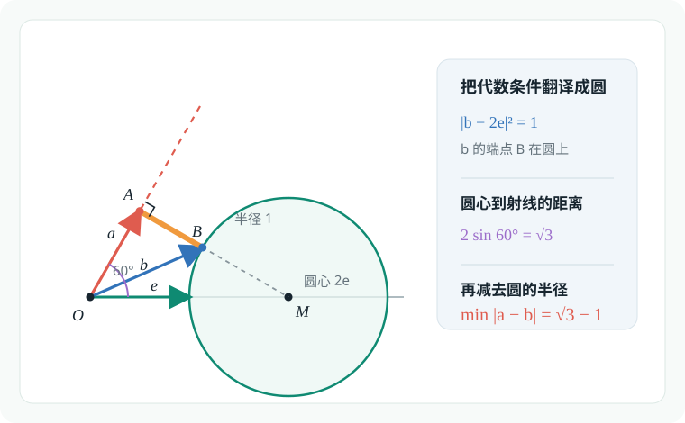

### 例题 6.2

已知向量 $\boldsymbol a$，$\boldsymbol b$ 满足

$$
|\boldsymbol a|=\sqrt3,
\qquad
|4\boldsymbol a+\boldsymbol b|+|\boldsymbol b|=8,
$$

则 $|2\boldsymbol a+\boldsymbol b|$ 的取值范围是（　　）

**A.** $[2,4]$

B. $[0,8]$

C. $[\sqrt3,8]$

D. $[4,16]$

不难发现,题中暗藏着$a=4,c=2\sqrt{3}.b=2$的椭圆$\frac{x^2}{16}+\frac{y^2}{4}=1$,所求$|2\boldsymbol a+\boldsymbol b|$则是椭圆上点到中心的距离,则:

$$\begin{gathered}
   x^2+4y^2=16,y\in[-2,+2]\\
   d^2=x^2+y^2=(16-4y^2)+y^2\\
   =16-3y^2\in[4,16]\\
   d\in[2,4]
\end{gathered}$$

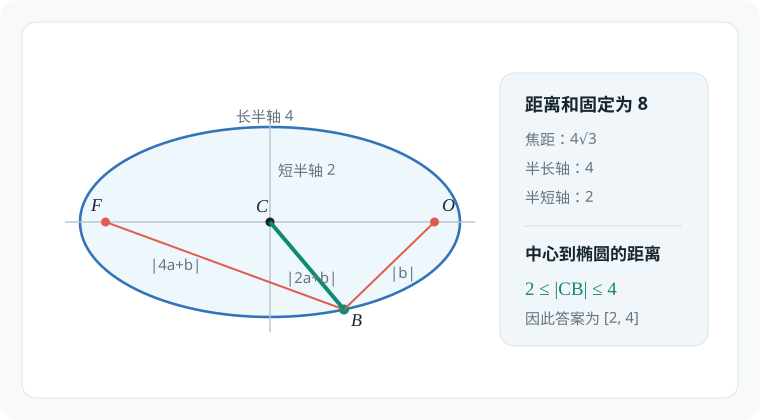

### 例题 6.3

（北京大学）$\overrightarrow{OA}$，$\overrightarrow{OB}$ 的夹角为 $\theta$，

$$
|\overrightarrow{OA}|=2,
\qquad
|\overrightarrow{OB}|=1,
$$

$$
\overrightarrow{OP}=t\overrightarrow{OA},
\qquad
\overrightarrow{OQ}=(1-t)\overrightarrow{OB}.
$$

$|\overrightarrow{PQ}|$ 在 $t=t_0$ 时取得最小值。若 $0<t_0<\dfrac15$，则 $\theta$ 的取值范围为（　　）

A. $\left(\dfrac\pi3,\dfrac\pi2\right)$

B. $\left(\dfrac\pi3,\dfrac{2\pi}3\right)$

C. $\left(\dfrac\pi2,\dfrac{5\pi}6\right)$

**D.** $\left(\dfrac\pi2,\dfrac{2\pi}3\right)$

先考虑代数方法,构建目标函数:
$$\begin{gathered}
   |\vec{PQ}|=|\vec{OQ}-\vec{OP}|\\
   =\sqrt{|\vec{OQ}|^2+|\vec{OP}|^2-2|\vec{OQ}||\vec{OP}|\cos\theta}\\
   =\sqrt{(1-t)^2+(2t)^2-2\cdot(1-t)\cdot (2t)\cos\theta}\\
   =\sqrt{(5+4\cos\theta)t^2-2(2\cos\theta+1)t+1},t\in \R\\
   t_0=\frac{2\cos\theta+1}{5+4\cos\theta}\in(0,\dfrac15)\\
   \cos\theta\in(-\dfrac12,0),\theta\in[0,\pi]\\
   \Longleftrightarrow \theta\in(\frac{\pi}{2},\frac{2\pi}{3})
\end{gathered}$$

当然,我们自有巧妙的几何法:

作平行四边形$OACB$,过点$P$作$PM\parallel OB$交$OC$与点$M$,则$PM\parallel BQ$且$|PM|=|BQ|=t$,又出现了一个平行四边形$PMBQ$.

所求$|PQ|=|BM|$,当$|BM|$最短,即$BM\perp OC$时,$|PQ|$取得最小值.

作$BH\perp OC$,须知$t_0=\frac{|OP|}{|OA|}=\frac{|OH|}{|OC|}$.

对直角三角形$OHB,CHB$使用勾股定理:
$$\begin{gathered}
   \begin{cases}
      OH^2+HB^2=OB^2=1,\\
      CH^2+HB^2=BC^2=4
   \end{cases}\\
   CH^2-OH^2=3\\
   (OC-OH)^2-OH^2=3\\
   OC^2-2OC\cdot OH=3\\
   OC^2(1-2t_0)=3\\
   OC^2=\frac{3}{1-2t_0}\in(3,5)\\
   OC^2=OB^2+BC^2-2OB\cdot OC\cos(\pi-\theta)\\
   =5+4\cos\theta\\
   \cos\theta\in(-\frac{1}{2},0)\Longleftrightarrow \theta\in(\frac{\pi}{2},\frac{2\pi}{3})
\end{gathered}$$

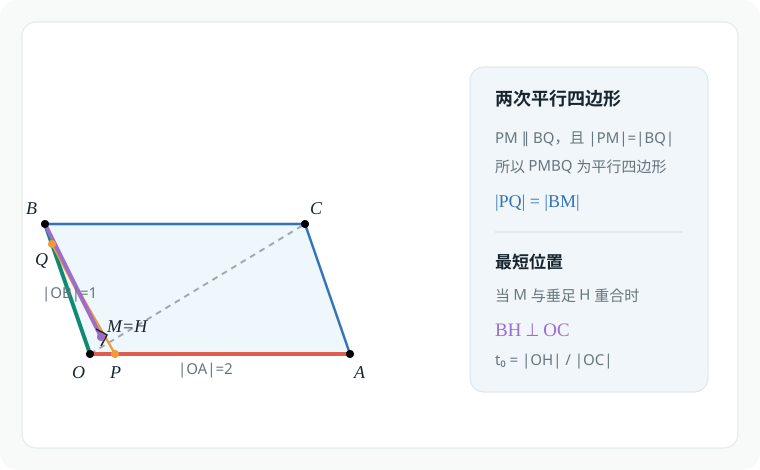

### 例题 6.4

在直角三角形 $\triangle ABC$ 中，$AB=4$，$AC=3$，$\angle A=\dfrac\pi2$，

$$
\overrightarrow{AP}=m\overrightarrow{PB},
\qquad
\overrightarrow{AQ}=n\overrightarrow{QC},
\qquad
\frac1m+\frac1n=\frac12.
$$

$M$ 是 $BC$ 的中点。对任意 $\lambda\in\mathbb R$，

$$
\left|\lambda\overrightarrow{QP}+\overrightarrow{QM}\right|
$$

的最小值记为 $f(m)$，则当 $m>0$ 时，$f(m)$ 的最大值为 $\underline{\qquad}$。

$$\begin{gathered}
   \vec{AB}=\vec{AP}+\vec{PB}=\frac{m+1}{m}\vec{AP}\\
   \vec{AC}=\vec{AQ}+\vec{QC}=\frac{n+1}{n}\vec{AQ}\\
   \vec{AB}+\vec{AC}=(1+\frac1m)\vec{AP}+(1+\frac1n)\vec{AQ}\\
   (1+\frac1m)+(1+\frac1n)=\frac{5}{2}\\
   \frac{2}{5}[(1+\frac1m)\vec{AP}+(1+\frac1n)\vec{AQ}]=\frac{2}{5}(\vec{AB}+\vec{AC})=\frac{4}{5}\vec{AM}\\
\end{gathered}$$

这意味着如果取T点,使得$\frac{AT}{AM}=\frac{4}{5}$,则有$P,Q,T$三点共线.

$\min_{\lambda\in\R}\left|\lambda\overrightarrow{QP}+\overrightarrow{QM}\right|$等于直线$PQ$到点M的距离,构建不等式:
$$\begin{gathered}
   \min_{\lambda\in\R}\left|\lambda\overrightarrow{QP}+\overrightarrow{QM}\right|\\
   =d(M,PQ)\\
   \le |TM|\\
   =\frac{1}{5}|AM|=\frac{1}{5}\cdot\frac{5}{2}=\frac{1}{2}
\end{gathered}$$

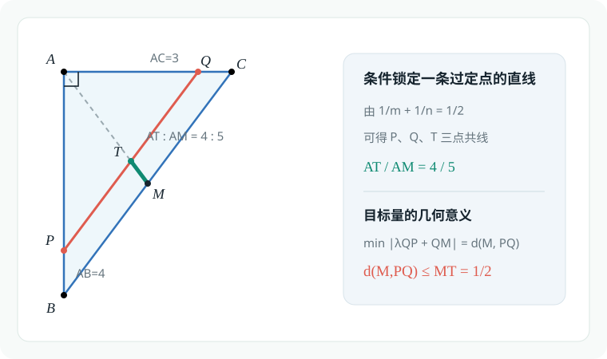

## 数量积的几何化

> **极化恒等式**:在$\triangle ABC$中,$M$为边$BC$中点,则:
> $\vec{AB}\cdot\vec{AC}=(\vec{AM}+\vec{MB})(\vec{AM}-\vec{MB})=|AM|^2-|MB|^2$
### 例题 6.5

（清华大学）在 $\triangle ABC$ 中，$AC=BC$，$P_1$，$P_2$，$P_3$ 为 $AB$ 上的点，且

$$
P_1B=\frac12P_2B=\frac14P_3B=\frac18AB.
$$

设

$$
I_k=\overrightarrow{P_kB}\cdot\overrightarrow{P_kC}
\qquad(k=1,2,3),
$$

则（　　）

A. $I_1<I_2<I_3$

B. $I_1<I_3<I_2$

C. $I_3<I_2<I_1$

**D.** $I_2<I_1<I_3$

由几何关系,$P_1,P_2,P_3$都是$AB$上的八等分点.

取$BC$中点$M$,考虑极化恒等式$I_k=\overrightarrow{P_kB}\cdot\overrightarrow{P_kC}=|P_kM|^2-|BM|^2(k=1,2,3)$,其中$|BM|$为一定值.

由图形比例:$|P_3M|\gt|P_1M|\gt|P_2M|\Longleftrightarrow I_2\lt I_1\lt I_3$

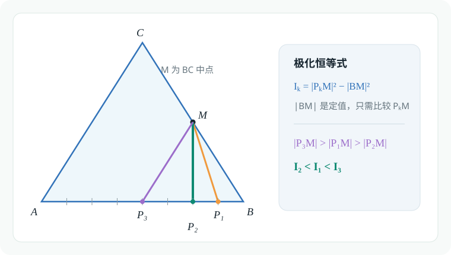

### 例题 6.6

在 $\triangle ABC$ 中，$P_0$ 是边 $AB$ 上一定点，满足

$$
P_0B=\frac14AB,
$$

且对于边 $AB$ 上任意一点 $P$，恒有

$$
\overrightarrow{PB}\cdot\overrightarrow{PC}
\geqslant
\overrightarrow{P_0B}\cdot\overrightarrow{P_0C},
$$

则（　　）

A. $\angle ABC=90^\circ$

B. $\angle BAC=90^\circ$

C. $AB=AC$

**D.** $AC=BC$

$$\begin{gathered}
   \overrightarrow{PB}\cdot\overrightarrow{PC}=|PM|^2-|BM|^2\\
   \ge \overrightarrow{P_0B}\cdot\overrightarrow{P_0}=|P_0M|^2-|BM|^2
\end{gathered}$$

这表明$P_0M$是最短线段,$P_0M\perp AB$.又注意到如果取$AB$中点$T$,则$TM$为$\triangle ABC$中$AC$所对中位线,则$CT\perp P_0M \Longrightarrow CT\perp AB$.

根据三线合一,$AC=BC$,则D正确,AB均错误.

若将$\triangle ABC$延$CT$方向拉长,则仍满足题目条件,但选项C不一定正确,故选D

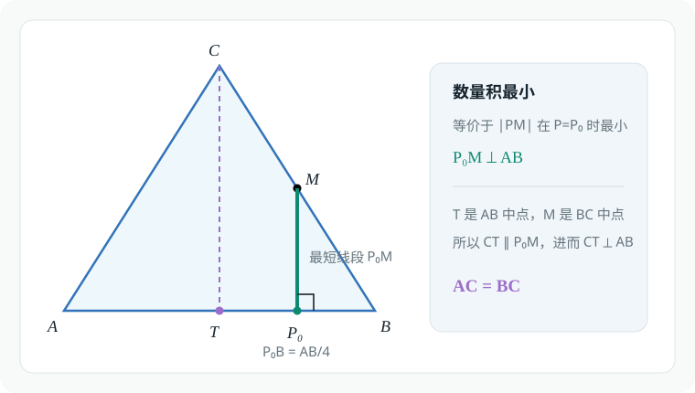

### 例题 6.7

（清华大学）向量 $\boldsymbol a\ne\boldsymbol e$，$|\boldsymbol e|=1$。若对任意 $t\in\mathbb R$，都有

$$
|\boldsymbol a-t\boldsymbol e|\geqslant|\boldsymbol a+\boldsymbol e|,
$$

则（　　）

A. $\boldsymbol a\perp\boldsymbol e$

B. $\boldsymbol a\perp(\boldsymbol a+\boldsymbol e)$

**C.** $\boldsymbol e\perp(\boldsymbol a+\boldsymbol e)$

D. $(\boldsymbol a-\boldsymbol e)\perp(\boldsymbol a+\boldsymbol e)$

将向量$\boldsymbol a\ne\boldsymbol e$平移至共起点,可知题目条件本质为$\boldsymbol e\perp(\boldsymbol a+\boldsymbol e)$

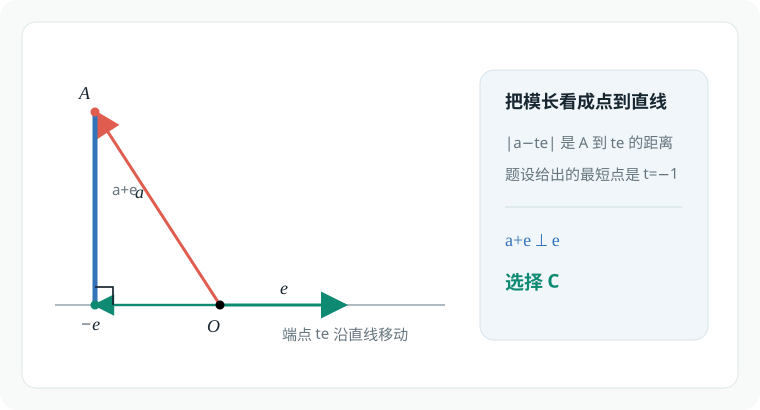

### 例题 6.8

在 $\triangle ABC$ 中：

1. 若 $\overrightarrow{CA}=\boldsymbol a$，$\overrightarrow{CB}=\boldsymbol b$，求证：

   $$
   S_{\triangle ABC}
   =\frac12\sqrt{(|\boldsymbol a||\boldsymbol b|)^2-(\boldsymbol a\cdot\boldsymbol b)^2}.
   $$

2. 若 $\overrightarrow{CA}=(x_1,y_1)$，$\overrightarrow{CB}=(x_2,y_2)$，求证：

   $$
   S_{\triangle ABC}=\frac12|x_1y_2-x_2y_1|.
   $$

$$\begin{gathered}
   S_{\triangle ABC}=\frac{1}{2}|\boldsymbol a||\boldsymbol b|\sin<\boldsymbol{a},\boldsymbol{b}>\\
   =\frac{1}{2}|\boldsymbol a||\boldsymbol b|\sqrt{1-\cos^2<\boldsymbol{a},\boldsymbol{b}>}\\
   =\frac{1}{2}|\boldsymbol a||\boldsymbol b|\sqrt{1-(\frac{\boldsymbol a\cdot\boldsymbol b}{|\boldsymbol a||\boldsymbol b|})^2}\\
   =\frac{1}{2}\sqrt{|\boldsymbol a|^2|\boldsymbol b|^2-(\boldsymbol a\cdot\boldsymbol b)^2}\\
   =\frac{1}{2}\sqrt{(x_1^2+y_1^2)(x_2^2+y_2^2)-(x_1x_2+y_1y_2)^2}\\
   =\frac{1}{2}\sqrt{(x_1y_2-x_2y_1)^2}=\frac12|x_1y_2-x_2y_1|
\end{gathered}$$

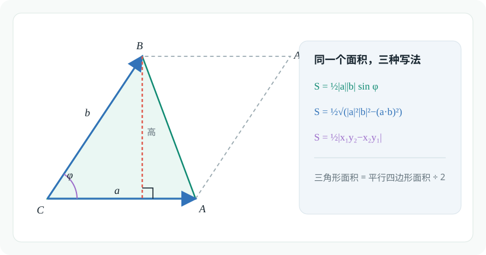

## 重心的向量刻画及其推广

### 例题 6.9

$\triangle ABC$ 的重心为点 $M$，过点 $M$ 的直线分别交 $AB$，$AC$ 于点 $E$，$F$。若

$$
AE=kAB,
\qquad
AF=hAC,
$$

利用向量证明：

$$
\frac1k+\frac1h=3.
$$

$$\begin{gathered}
   \vec{AB}+\vec{AC}=3\vec{AM}\\
   \frac{1}{3k}\vec{AE}+\frac{1}{3h}\vec{AF}=\vec{AM}
\end{gathered}$$
由于点$E,F,M$共线,则$\frac{1}{3k}+\frac{1}{3h}=1$,故$\frac1k+\frac1h=3$

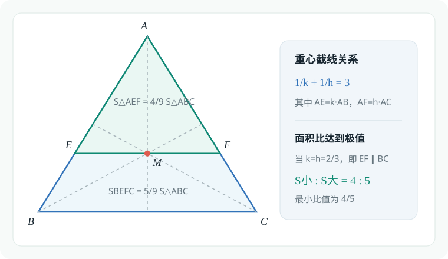

### 例题 6.10

过 $\triangle ABC$ 的重心作一条直线，将 $\triangle ABC$ 分成两部分，则较小部分与较大部分的面积之比（　　）

A. 最小值为 $\dfrac34$

**B.** 最小值为 $\dfrac45$

C. 最大值为 $\dfrac43$

D. 最大值为 $\dfrac54$

本题的几何图形与例6.9师出同门,应考虑结论:
$$\begin{gathered}
   \frac{S_\triangle{ABC}}{S_\triangle{AEF}}=\frac{AB}{AE}\frac{AC}{AF}=\frac{1}{k}\cdot\frac{1}{h}\le(\frac{\frac{1}{k}+\frac{1}{h}}{2})^2=\frac94
\end{gathered}$$

当然,我们还需要确定$\frac{S_\triangle{ABC}}{S_\triangle{AEF}}$的下界:
$$\begin{gathered}
   0\lt h,k\le1\Longrightarrow (\frac{1}{k}-1)(\frac{1}{h}-1)\ge0\\
   \frac{1}{kh}\ge \frac{1}{h}+\frac{1}{k}-1=2\\
   \frac{S_\triangle{ABC}}{S_\triangle{AEF}}\in[2,\frac{9}{4}]\\
   S_{BEFC}\ge S_{\triangle{AEF}}\\
   \frac{S_\triangle{AEF}+S_{BEFC}}{S_\triangle{AEF}}=1+\frac{S_{BEFC}}{S_\triangle{AEF}}\\
   \frac{S_{BEFC}}{S_\triangle{AEF}}\in[1,\frac{5}{4}]\\
   \frac{S_\triangle{AEF}}{S_{BEFC}}\in[\frac{4}{5},1]
\end{gathered}$$
### 例题 6.11

设 $P_1,P_2,\ldots,P_n$ 是单位圆 $O$ 内接正 $n$ 边形的顶点，$P$ 是圆 $O$ 上的任意点，则

$$
PP_1^2+PP_2^2+\cdots+PP_n^2=
$$

（　　）

A. $0$

B. $1$

C. $n$

**D. 前三个答案都不对**

$$\begin{gathered}
   PP_1^2+PP_2^2+\cdots+PP_n^2\\
   =\sum_{i=1}^n(\vec{OP}-\vec{OO_i})^2\\
   =n(|OP|^2+R)^2-2\vec{OP}(\sum_{i=1}^nOO_i)\\
   =2n-2\vec{OP}\cdot\vec{0}
\end{gathered}$$

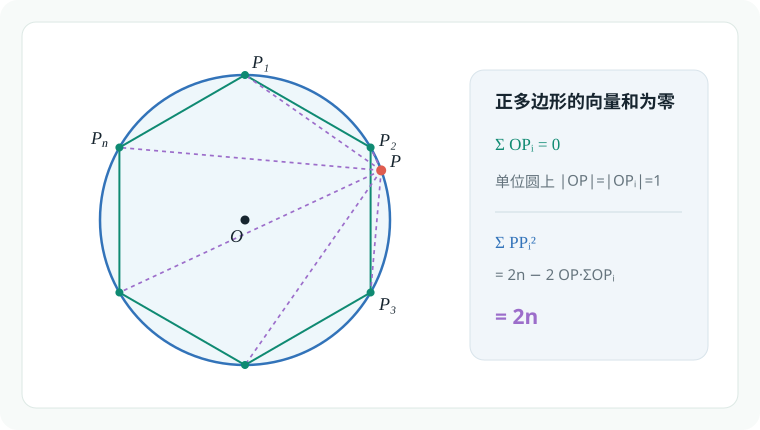

### 例题 6.12

（北京大学）单位圆的内接五边形的所有边及所有对角线的长度的平方和的最大值为（　　）

A. $15$

B. $20$

**C.** $25$

D. 前三个答案都不对

见微知著,我们从$n=3$的情况开始研究.

在平面直角坐标系中,有三角形$ABC$,考虑三条边的平方和:
$$\begin{gathered}
   AB^2+BC^2+CA^2\\
   =\sum_{cyc}[(x_1-x_2)^2+(y_1-y_2)^2]\\
   =2\sum_{cyc}(x_1^2+y_1^2)-2\sum_{cyc}(x_1x_2+y_1y_2)
\end{gathered}$$
对于$2\sum_{cyc}(x_1x_2+y_1y_2)$,我们注意到其交叉项的形式:
$$\begin{gathered}
   (x_1+x_2+x_3)^2=\sum_{cyc}x_1^2+2\sum_{cyc}(x_1x_2)\\
   (y_1+y_2+y_3)^2=\sum_{cyc}y_1^2+2\sum_{cyc}(y_1y_2)\\
   2\sum_{cyc}(x_1x_2+y_1y_2)=(x_1+x_2+x_3)^2+(y_1+y_2+y_3)^2-\sum_{cyc}(x_1^2+y_1^2)
\end{gathered}$$
于是:
$$\begin{gathered}
   AB^2+BC^2+CA^2\\=3\sum_{cyc}(x_1^2+y_1^2)-(x_1+x_2+x_3)^2-(y_1+y_2+y_3)^2\\\ge3\sum_{cyc}(x_1^2+y_1^2)
\end{gathered}$$

显而易见,对于五边型的情况,只是系数不同:
$$\begin{gathered}
   =\sum_{cyc}[(x_1-x_2)^2+(y_1-y_2)^2]\\
   =\textcolor{red}{3}\sum_{cyc}(x_1^2+y_1^2)-2\sum_{cyc}(x_1x_2+y_1y_2)
\end{gathered}$$

$$\begin{gathered}
   \sum_{cyc}[(x_1-x_2)^2+(y_1-y_2)^2]\ge 5\sum_{cyc}(x_1^2+y_1^2)\\
   =5\cdot 5\cdot 1=25
\end{gathered}$$

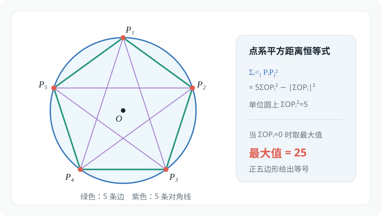

## 命题背景

| 公式 | 建议名称 |
| :--- | :--- |
| $\displaystyle \sum_{i<j} P_iP_j^2=n\sum OP_i^2-\left\lVert\sum\overrightarrow{OP_i}\right\rVert^2$ | 点系平方距离恒等式 |
| $\displaystyle \sum_{i<j} P_iP_j^2=n\sum GP_i^2$ | 点系恒等式的重心形式 |
| $\displaystyle \sum PP_i^2=\frac{1}{n}\sum_{i<j}P_iP_j^2+nPG^2$ | 广义莱布尼茨定理 |
### 例题 6.13

（清华大学）$O$ 为 $\triangle ABC$ 内一点，若

$$
S_{\triangle AOB}:S_{\triangle BOC}:S_{\triangle AOC}=4:3:2,
$$

设

$$
\overrightarrow{AO}
=\lambda\overrightarrow{AB}+\mu\overrightarrow{AC},
$$

则实数 $\lambda$ 和 $\mu$ 的值分别为（　　）

A. $\dfrac29,\dfrac49$

B. $\dfrac49,\dfrac29$

C. $\dfrac19,\dfrac29$

D. $\dfrac29,\dfrac19$

### 例题 6.14

（清华大学）$\triangle ABC$ 中，$AB=2$，$AC=3$，$BC=4$，$O$ 为三角形内心。若

$$
\overrightarrow{AO}
=\lambda\overrightarrow{AB}+\mu\overrightarrow{BC},
$$

则 $3\lambda+6\mu=$（　　）

A. $1$

B. $2$

C. $3$

D. $4$

### 例题 6.15

（北京大学）已知 $H$ 是 $\triangle ABC$ 的垂心，且

$$
2\overrightarrow{HA}+3\overrightarrow{HB}+4\overrightarrow{HC}
=\overrightarrow0,
$$

则 $\triangle ABC$ 的最大内角的正弦值是 $\underline{\qquad}$。

### 例题 6.16

求证：$\triangle ABC$ 的外心 $O$、重心 $G$、垂心 $H$ 在同一直线上，且

$$
OG:GH=1:2.
$$

### 例题 6.17

如图，$\triangle ABC$ 的两条高线 $AD$，$BE$ 交于点 $H$，其外接圆圆心为 $O$。过点 $O$ 作 $OF\perp BC$，垂足为 $F$，直线 $OH$ 与 $AF$ 相交于点 $G$，则 $\triangle OFG$ 与 $\triangle GAH$ 的面积之比为 $\underline{\qquad}$。

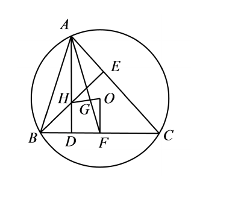

## 内积不等式与高维视角

### 例题 6.18

用向量方法证明：对于任意的 $a,b,c,d\in\mathbb R$，恒有不等式

$$
(ac+bd)^2\leqslant(a^2+b^2)(c^2+d^2).
$$

### 例题 6.19

（清华大学）已知向量

$$
\boldsymbol a=(0,1),
\qquad
\boldsymbol b=\left(-\frac{\sqrt3}{2},-\frac12\right),
\qquad
\boldsymbol c=\left(\frac{\sqrt3}{2},-\frac12\right),
$$

且

$$
x\boldsymbol a+y\boldsymbol b+z\boldsymbol c=(1,1),
$$

则 $x^2+y^2+z^2$ 的最小值为（　　）

A. $1$

B. $\dfrac43$

C. $\dfrac32$

D. $2$

### 例题 6.20

（清华大学）已知 $\boldsymbol a$，$\boldsymbol b$ 为平面上的单位向量，$|\boldsymbol c|=\sqrt{26}$，且 $\boldsymbol a\cdot\boldsymbol c=1$，则

$$
|\boldsymbol a\cdot\boldsymbol b|+|\boldsymbol b\cdot\boldsymbol c|
$$

的最大值为 $\underline{\qquad}$。

### 例题 6.21

已知 $\boldsymbol a$，$\boldsymbol b$，$\boldsymbol c$ 为单位向量，且

$$
|3\boldsymbol a-5\boldsymbol b|=7,
$$

则

$$
|2\boldsymbol a-\boldsymbol c|+|\boldsymbol b-2\boldsymbol c|
$$

的最小值为（　　）

A. $2$

B. $2\sqrt3$

C. $4$

D. $6$

### 例题 6.22

已知 $\triangle ABC$ 满足

$$
\frac{3\overrightarrow{AB}}{|\overrightarrow{AB}|}
+\frac{2\overrightarrow{AC}}{|\overrightarrow{AC}|}
=\frac{\sqrt{19}\left(\overrightarrow{AB}+\overrightarrow{AC}\right)}
{\left|\overrightarrow{AB}+\overrightarrow{AC}\right|},
$$

点 $D$ 为线段 $AB$ 上一动点。若

$$
\overrightarrow{DA}\cdot\overrightarrow{DC}
$$

的最小值为 $-3$，则 $\triangle ABC$ 的面积 $S=\underline{\qquad}$。
