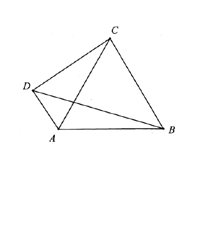

# 第 7 章 复数

## 7.1 复数的表示与运算

### 例题 7.1

**题目来源：** 清华大学

设复数 $z$ 满足 $|z|<1$，且

$$
\left|\overline{z}+\frac{1}{z}\right|=\frac{5}{2},
$$

则 $|z|=$

**A.** $\frac{4}{5}$

**B.** $\frac{3}{4}$

**C.** $\frac{2}{3}$

**D.** $\frac{1}{2}$

**解答**

利用 $z\overline{z}=|z|^2$，得：

$$\begin{gathered}
  \left|\overline{z}+\frac{1}{z}\right|^2\\
  =(\overline{z}+\frac{1}{z})(z+\frac{1}{\overline{z}})\\
  =\overline{z}z+\frac{1}{\overline{z}z}+2=\frac{25}{4}\\
  \frac{1}{|z|^2}+|z|^2=\frac{17}{4}\\
  \Longrightarrow |z|=\frac{1}{2}
\end{gathered}$$

正确答案为D.

### 例题 7.2

**题目来源：** 北京大学

模长为 $1$ 的复数 $x,y,z$ 满足 $x+y+z\ne0$，求

$$
\left|\frac{xy+yz+zx}{x+y+z}\right|。
$$

**解答**

仍然利用$z\overline{z}=|z|^2$:
$$\begin{gathered}
  \left|\frac{xy+yz+zx}{x+y+z}\right|^2\\
  =\frac{xy+yz+zx}{x+y+z}\cdot\frac{\overline{xy}+\overline{yz}+\overline{zx}}{\overline{x}+\overline{y}+\overline{z}}\\
  =\frac{xy+yz+zx}{x+y+z}\cdot\frac{\frac{1}{xy}+\frac{1}{yz}+\frac{1}{zx}}{\frac{1}{x}+\frac{1}{y}+\frac{1}{z}}\\
  =\frac{xy+yz+zx}{x+y+z}\cdot\frac{x+y+z}{xy+yz+zx}=1\\
  \Longrightarrow \left|\frac{xy+yz+zx}{x+y+z}\right|=1
\end{gathered}$$
### 例题 7.3

**题目来源：** 清华大学

求最小正整数 $n$，使得

$$
I=\left(\frac{1}{2}+\frac{1}{2\sqrt{3}}i\right)^n
$$

为纯虚数，并求出 $I$。

**解答**

面对高次指数,最好使用复数的三角形式:

$$\begin{gathered}
  I=\left(\frac{1}{2}+\frac{1}{2\sqrt{3}}i\right)^n\\
  =(\frac{\sqrt{3}}{3})^n(\frac{\sqrt{3}}{2}+\frac{1}{2}i)^n\\
  =(\frac{\sqrt{3}}{3})^n(\cos30^\circ+i\sin30^\circ)^n\\
  =(\frac{\sqrt{3}}{3})^n[\cos(30n^\circ)+i\sin(30n^\circ)]\\
  \Re(I)=(\frac{\sqrt{3}}{3})^n\cos(30n^\circ)=0\\
  n\ge3
\end{gathered}$$

### 例题 7.4

**题目来源：** 复旦大学

设 $z_1,z_2$ 为一对共轭复数。如果 $|z_1-z_2|=\sqrt{6}$，且$\frac{z_1}{z_2^2}$为实数，那么 $|z_1|=|z_2|=$

**A.** $\sqrt{2}$

**B.** $2$

**C.** $3$

**D.** $\sqrt{6}$

**解答**

$$\begin{gathered}
  |z_1-z_2|^2\\
  =(z_1-z_2)(z_2-z_1)\\
  =-(z_1-z_2)^2=6\\
  \Longrightarrow z_1-z_2=\pm\sqrt{6}i\\
  2\Im(z_1)=\pm\sqrt{6}\\
\end{gathered}$$

或者直接有$|z_1-z_2|=|2\Im(z_1)|=\sqrt{6}\Longrightarrow 2\Im(z_1)=\pm\sqrt{6}$.

$$\begin{gathered}
  \frac{z_1}{z_2^2}\in\R\\
  \Longleftrightarrow \frac{z_1}{z_2^2}=\frac{z_2}{z_1^2}\\
  \frac{z_1}{z_2^2}-\frac{z_2}{z_1^2}\\
  =\frac{z_1^3-z_2^3}{(z_1z_2)^2}=0\\
  \Longrightarrow z_1^3-z_2^3=(z_1-z_2)(z_1^2+z_1z_2+z_2^2)=0(z_1\ne z_2)\\
  z_1^2+z_1z_2+z_2^2=0\\
  (z_1-z_2)^2+3z_1z_2=0\\
  -6+3z_1z_2=0\\
  3|z_1|^2=6,|z_2|=|z_1|=\sqrt{2}
\end{gathered}$$
可见,求出虚部并不是必须的步骤,可以利用$(z_1-z_2)^2$这一上位的代数关系进行化简求值.

此外,三角换元面对复数的乘除法不失为良策:
$$\begin{gathered}
  z_1=r(\cos\theta+i\sin\theta),z_2=r[\cos(-\theta)+i\sin(-\theta)]\\
  \frac{z_1}{z_2^2}=\frac{1}{r}(\cos3\theta+i\sin3\theta)\in\R\\
  \sin3\theta=0\Longrightarrow \theta=\frac{k\pi}{3}(k\in\Z)\\
  |z_1-z_2|=2|r\sin\theta|=\begin{cases}
    0,\sin\theta=0\\
    \sqrt{3}|r|,\sin\theta=\pm\frac{\sqrt{3}}{2}
  \end{cases}=\sqrt{6}\\
  \Longrightarrow |r|=\sqrt{2}
\end{gathered}$$

正确答案:A
### 例题 7.5

设 $z$ 是模为 $1$ 的复数，则函数

$$
f(z)=z^2+\frac{1}{z^2}+1
$$

的最小值是 ______。

**解答**

复变函数严格意义上没有最小值的概念,但是这道题暗含着$f(z)\in\R$,所以有最值.

$$\begin{gathered}
  f(z)=z^2+\frac{(z\overline{z})^2}{z^2}+1\\
  =z^2+\overline{z}^2+1\\
  =2[\Re(z)^2-\Im(z)^2]+1\ge2(0-1)+1=-1
\end{gathered}$$

指数(三角)形式更为简便:
$$\begin{gathered}
  z=e^{i\theta}\\
  f(z)=(e^{2i\theta}+e^{-2i\theta})+1\\
  =2\cos2\theta+1\ge-1
\end{gathered}$$

## 7.2 复数乘法与平面旋转

### 例题 7.6

**题目来源：** 上海交通大学

已知 $|z|=1$，$k$ 是实数，$z$ 是复数，求

$$
\left|z^2+kz+1\right|
$$

的最大值。

**解答**

首先需要明确的是,$k$应该是一个给定的值,否则$k\to\infty,\left|z^2+kz+1\right|\to\infty$

对于复数模长问题,我们驾轻就熟:
$$\begin{gathered}
  \left|z^2+kz+1\right|^2\\
  =(z^2+kz+1)(\overline{z}^2+k\overline{z}+1)\\
  =(z\overline{z})^2+k^2(z\overline{z})+1\\
  +kz\overline{z}(z+\overline{z})+(z^2+\overline{z}^2)+k(z+\overline{z})\\
  =1+k^2+1+2k\Re(z)+2[\Re(z)^2-\Im(z)^2]+2k\Re(z)\\
  =k^2+4\Re(z)k+2[\Re(z)^2-\Im(z)^2+1]\\
  =k^2+4\Re(z)k+4\Re(z)^2\\
  =[k+2\Re(z)]^2\\
  =\max\{(k-2)^2,(k+2)^2\}\\
  =\begin{cases}
    (k+2)^2,k\ge0\\
    (k-2)^2,k<0
  \end{cases}\\
  \left|z^2+kz+1\right|=\begin{cases}
    k+2,k\ge0\\
    2-k,k<0
  \end{cases}=2+|k|
\end{gathered}$$

事实上,**守前所为而已**并非最佳选项:
$$\begin{gathered}
  \left|z^2+kz+1\right|\\
  =|z|\left|z+k+\frac{1}{z}\right|\\
  =\left|z+k+\frac{1}{z}\right|\\
  =|2\cos\theta+k|\le|k|+2
\end{gathered}$$
### 例题 7.7

**题目来源：** 复旦大学

已知 $|z|=1$，求

$$
\left|z^2+z+4\right|
$$

的最小值。

**解答**
$$\begin{gathered}
  \left|z^2+z+4\right|^2\\
  =(z^2+z+4)(\overline{z}^2+\overline{z}+4)\\
  =(z\overline{z})^2+(z\overline{z})+16\\
  +z\overline{z}(z+\overline{z})+4(z^2+\overline{z}^2)+4(z+\overline{z})\\
  =1+1+16+2\Re(z)+8[\Re(z)^2-\Im(z)^2]+8\Re(z)\\
  =16\Re(z)^2+10\Re(z)+10\ge\frac{135}{16}\\
  \left|z^2+z+4\right|\ge\frac{3\sqrt{15}}{4}
\end{gathered}$$

$$\begin{gathered}
  \left|z^2+z+4\right|\\
  =|z+1+\frac{4}{z}|\\
  =|1+\cos\theta+i\sin\theta+4(\cos\theta-i\sin\theta)|\\
  =|1+5\cos\theta-3i\sin\theta|\\
  =\sqrt{(5\cos\theta+1)^2+9\sin^2\theta}\\
  =\sqrt{16\cos^2\theta+10\cos\theta+10}\ge\frac{3\sqrt{15}}{4}
\end{gathered}$$

**圣人无常师,做题亦无常法**,两种方法此时难分伯仲,不再是三角(指数)形式更加简便了,核心在于虚部无法相消.
### 例题 7.8

**题目来源：** 清华大学

若复数 $z$ 满足 $|z^2+1|=|z|$，则

**A.** $\frac{\sqrt{5}-1}{2}\le |z|\le\frac{\sqrt{5}+1}{2}$

**B.** $\frac{3-\sqrt{5}}{2}\le |z|\le\frac{3+\sqrt{5}}{2}$

**C.** $\arg z\in\left[\frac{\pi}{3},\frac{2\pi}{3}\right]\cup\left[\frac{4\pi}{3},\frac{5\pi}{3}\right]$

**D.** $\arg z\in\left[\frac{\pi}{6},\frac{5\pi}{6}\right]\cup\left[\frac{7\pi}{6},\frac{11\pi}{6}\right]$

**解答**
$$\begin{gathered}
|z^2+1|=|z|(z\ne0)\\
\Longleftrightarrow
  |z+\frac{1}{z}|=1\\
  (z+\frac{1}{z})(\overline{z}+\frac{1}{\overline{z}})=1^2\\
  (z^2+1)(\overline{z}^2+1)=z\overline{z}\\
  (z\overline{z})^2+z^2+\overline{z}^2+1=|z|^2\\
  |z|^4+2[\Re(z)^2-\Im(z)^2]+1=|z|^2\\
  |z|^4-|z|^2+1=-2[\Re(z)^2-\Im(z)^2]\in[-2|z|^2,2|z|^2]
\end{gathered}$$

不等式$|z|^4-|z|^2+1\ge-2|z|^2$显然成立,而:

$$|z|^4-|z|^2+1\le2|z|^2$$

给出 $|z|^2\in[\frac{3-\sqrt{5}}{2},\frac{3+\sqrt{5}}{2}]$，即 $|z|\in[\frac{\sqrt{5}-1}{2},\frac{\sqrt{5}+1}{2}]$。

事实上,虽然我们没有使用复数的三角形式,但是辐角主值近在咫尺:

$$\begin{gathered}
  |z|^4-|z|^2+1+2[\Re(z)^2-\Im(z)^2]\\
  =|z|^2[|z|^2-1+\frac{1}{|z|^2}+2(\cos^2\theta-\sin^2\theta)]\\
  |z|^2-1+\frac{1}{|z|^2}+2\cos2\theta=0\\
  |z|^2-1+\frac{1}{|z|^2}\in[1,2]\\
  \cos2\theta\in[-1,-\frac{1}{2}]\\
  \theta\in[0,2\pi)\\
  2\theta\in[\frac{2\pi}{3},\frac{4\pi}{3}]\cup[\frac{8\pi}{3},\frac{10\pi}{3}]\\
  \theta\in[\frac{\pi}{3},\frac{2\pi}{3}]\cup[\frac{4\pi}{3},\frac{5\pi}{3}]
\end{gathered}$$

正确答案:AC
### 例题 7.9

**题目来源：** 复旦大学

已知复数

$$
z_1=1+\sqrt{3}i,\qquad z_2=-\sqrt{3}+\sqrt{3}i,
$$

则复数 $z_1z_2$ 的辐角是

**A.** $\frac{13\pi}{12}$

**B.** $\frac{11\pi}{12}$

**C.** $-\frac{\pi}{4}$

**D.** $-\frac{7\pi}{12}$

**解答**

$$\begin{gathered}z_1=2(\cos\frac{\pi}{3}+i\sin\frac{\pi}{3})\\
z_2=\sqrt{6}(\cos\frac{3\pi}{4}+i\sin\frac{3\pi}{4})\\
\frac{\pi}{3}+\frac{3\pi}{4}=\frac{13\pi}{12}\end{gathered}$$

正确答案:A

### 例题 7.10

**题目来源：** 复旦大学

给定平面向量 $(1,1)$，则平面向量

$$
\left(\frac{1-\sqrt{3}}{2},\frac{1+\sqrt{3}}{2}\right)
$$

是将向量 $(1,1)$ 经过

**A.** 顺时针旋转 $60^\circ$ 所得

**B.** 顺时针旋转 $120^\circ$ 所得

**C.** 逆时针旋转 $60^\circ$ 所得

**D.** 逆时针旋转 $120^\circ$ 所得

**解答**

$$\begin{gathered}z_1=1+i\\
z_2=\frac{1-\sqrt{3}}{2}+\frac{1+\sqrt{3}}{2}i\\
\frac{z_2}{z_1}=\frac{\frac{1-\sqrt{3}}{2}+\frac{1+\sqrt{3}}{2}i}{1+i}\\
=\frac{\left(\frac{1-\sqrt{3}}{2}+\frac{1+\sqrt{3}}{2}i\right)(1-i)}{2}\\
=\frac{1+\sqrt{3}i}{2}=\cos60^\circ+i\sin60^\circ\end{gathered}$$

正确答案:C

## 7.3 单位根及其应用

### 例题 7.11

已知对任意平面向量 $\overrightarrow{AB}=(x,y)$，把 $\overrightarrow{AB}$ 绕其起点沿逆时针方向旋转 $\theta$ 角得到向量

$$
\overrightarrow{AP}=(x\cos\theta-y\sin\theta,\ x\sin\theta+y\cos\theta)，
$$

叫做把点 $B$ 绕点 $A$ 沿逆时针方向旋转 $\theta$ 角得到点 $P$。已知平面内点 $A(1,2)$，点 $B(1+\sqrt{2},2-2\sqrt{2})$，把点 $B$ 绕点 $A$ 沿顺时针方向旋转 $\frac{\pi}{4}$ 后得到点 $P$，求点 $P$ 的坐标。

**解答**

$$\begin{gathered}z_1=1+2i,z_2=(1+\sqrt{2})+(2-2\sqrt{2})i\\
z_3=z_1+(z_2-z_1)\left(\cos\left(-\frac{\pi}{4}\right)+i\sin\left(-\frac{\pi}{4}\right)\right)\\
=1+2i+(\sqrt{2}-2\sqrt{2}i)(\frac{\sqrt{2}}{2}-\frac{\sqrt{2}}{2}i)\\
=1+2i+(-1-3i)=-i\\
\Longrightarrow P(0,-1)\end{gathered}$$

### 例题 7.12

如图，在平面四边形 $ABCD$ 中，已知 $AD=1$，$CD=2$，$\triangle ABC$ 为等边三角形，记 $\angle ADC=\alpha$。

1. 若 $\alpha=\frac{\pi}{3}$，求 $\triangle ABD$ 的面积；
2. 若 $\alpha\in\left(\frac{\pi}{2},\pi\right)$，求 $\triangle ABD$ 的面积的取值范围。

**解答**

事实上,这道题应该先完成(II):

以$D$为原点,$AD$方向为$x$轴,垂直$AD$方向为$y$轴,建立平面直角坐标系$xDy$

$$\begin{gathered}D(0,0),A(1,0),C(2\cos\alpha,2\sin\alpha)\\
z_1=1,z_2=2\cos\alpha+2i\sin\alpha\\
z_3=z_1+(z_2-z_1)(\cos\frac{-\pi}{3}+i\sin\frac{-\pi}{3})\\
=1+[(2\cos\alpha-1)+2i\sin\alpha](\frac{1}{2}-\frac{\sqrt{3}}{2}i)\\
=1+\{[\frac{2\cos\alpha-1}{2}+\sqrt{3}\sin\alpha]+[\sin\alpha-\frac{\sqrt{3}}{2}(2\cos\alpha-1)]i\}\end{gathered}\\$$

事实上,我们只关心$z_3$虚部的绝对值(也就是B点到AD的距离):

$$\begin{gathered}\Im(z_3)=\sin\alpha-\frac{\sqrt{3}}{2}(2\cos\alpha-1)\\
=\sin\alpha-\sqrt{3}\cos\alpha+\frac{\sqrt{3}}{2}\\
=2\sin(\alpha-\frac{\pi}{3})+\frac{\sqrt{3}}{2}\\
\alpha\in\left(\frac{\pi}{2},\pi\right),\alpha-\frac{\pi}{3}\in(\frac{\pi}{6},\frac{2\pi}{3})\\
\sin(\alpha-\frac{\pi}{3})\in(\frac{1}{2},1]\\
h=|\Im(z_3)|\in(1+\frac{\sqrt{3}}{2},2+\frac{\sqrt{3}}{2}]\\
S_{\triangle ABD}(\alpha)=\frac{1}{2}AD\cdot h=\sin(\alpha-\frac{\pi}{3})+\frac{\sqrt{3}}{4}\in(\frac{\sqrt{3}+2}{4},\frac{\sqrt{3}+{4}}{4}]\\
S_{\triangle ABD}(\frac{\pi}{3})=\frac{\sqrt{3}}{4}\end{gathered}$$

### 例题 7.13

**题目来源：** 复旦大学

已知数 $x$ 满足

$$
x+\frac{1}{x}=-1，
$$

求

$$
x^{300}+\frac{1}{x^{300}}
$$

的值。

**解答**

显然,对于实数$x\in\R,x+\frac{1}{x}\ne-1$,故$x\in\C$.
$$\begin{gathered}x=r(\cos\theta+i\sin\theta),r\gt0,\sin\theta\ne0\\
x+\frac{1}{x}=(r\cos\theta+\frac{1}{r}\cos\theta)+(r\sin\theta-\frac{1}{r}\sin\theta)=-1\\
\Longrightarrow r-\frac{1}{r}=0,r=+1\\
2\cos\theta=-1,\cos\theta=-\frac{1}{2}\\
\theta=\frac{2\pi}{3}\text{ or }\frac{4\pi}{3}\\
x^{300}+\frac{1}{x^{300}}=2\cos(300\theta)=+2\end{gathered}$$

或者考虑单位根:

$$\begin{gathered}x^2+x+1=0\\
x^3-1=(x-1)(x^2+x+1)=0\\
x^{3n}=(x^3)^n=1\\
x^{300}+\frac{1}{x^{300}}=1+1=2\end{gathered}$$

### 例题 7.14

**题目来源：** 2026 北京大学

已知复数 $z$ 满足 $z^5=\overline{z}$，则满足该方程的复数 $z$ 的个数为 ______。

**解答**

$$\begin{gathered}|z^5|=|\overline{z}|\\
|z|^5=|z|\Longrightarrow |z|=1\text{ or }0\\
|z|=0\Longrightarrow z=0\\
|z|=1\Longrightarrow z^5=\frac{1}{z},z^6=1\end{gathered}$$

总之,$z$要么是$0$,要么是六次单位根,有7种可能

### 例题 7.15

**题目来源：** 上海交通大学

设方程 $x^3=1$ 的一个虚数根为 $\omega$，则

$$
\omega^{2n}+\omega^n+1=\underline{\hspace{3em}}，
$$

其中 $n$ 是正整数。
$$\begin{gathered}\omega^3-1=(\omega-1)(\omega^2+\omega+1)=0(\omega\ne1)\\
\omega^2+\omega+1=0\\
\omega^{2n}+\omega^n+1=\begin{cases}\omega^2+\omega+1=0,n\equiv1(mod3)\\
\omega^2+\omega+1=0,n\equiv2(mod3)\\
3,n\equiv0(mod3)\end{cases}\end{gathered}$$

**解答**

### 例题 7.16

**题目来源：** 清华大学

设

$$
(1+x+x^2)^{10}
$$

的展开式为 $a_0+a_1x+\cdots+a_{20}x^{20}$，则

$$
\sum_{k=0}^{6}a_{3k}=
$$

**A.** $3^9$

**B.** $3^{10}$

**C.** $2^{19}$

**D.** $2^{20}$

**解答**

有例7.15为鉴,可知单位根有"筛选"的功能,我们利用之:

$$\begin{gathered}\omega^2+\omega+1=0\\
(1+\omega+\omega^2)^{10}=a_0+a_1\omega+\cdots+a_{20}\omega^{20}\\
=(a_0+a_3+a_6+\cdots+a_{18})+(a_1+a_4+a_7+\cdots+a_{19})\omega+(a_2+a_5+a_8+\cdots+a_{20})\omega^2\\
=0\\
(1+\omega^2+\omega^4)^{10}=a_0+a_1\omega^2+\cdots+a_{20}\omega^{40}\\
=(a_0+a_3+a_6+\cdots+a_{18})+(a_1+a_4+a_7+\cdots+a_{19})\omega^2+(a_2+a_5+a_8+\cdots+a_{20})\omega\\
=0\\
(1+\omega^3+\omega^6)^{10}=a_0+a_1\omega^3+\cdots+a_{20}\omega^{60}\\
=(a_0+a_3+a_6+\cdots+a_{18})+(a_1+a_4+a_7+\cdots+a_{19})+(a_2+a_5+a_8+\cdots+a_{20})\\
=3^{10}\end{gathered}$$

联立三个式子(三个式子相加),恰好得到$3x=3^{10}$,然后可以解出三个括号$x,y,z$的值:

$$\begin{gathered}\begin{cases}x+y\omega+z\omega^2=0,\\
x+y\omega^2+z\omega=0,\\
x+y+z=3^{10}\end{cases}\Longrightarrow x=y=z=3^9\end{gathered}$$

正确答案:A

### 例题 7.17

**题目来源：** 上海交通大学

$\omega$ 是方程 $x^5=1$ 的一个非实数根，则

$$
\omega(\omega+1)(\omega^2+1)=\underline{\hspace{3em}}。
$$

**解答**

$$\begin{gathered}\omega(\omega+1)(\omega^2+1)\\
=(\omega^2+\omega)(\omega^2+1)\\
=\omega^4+\omega^3+\omega^2+\omega\\
=\frac{\omega^5-\omega}{\omega-1}(\omega\ne1)\\
=\frac{1-\omega}{\omega-1}=-1\end{gathered}$$

### 例题 7.18

**题目来源：** 清华大学

求

$$
2+2e^{0.4\pi i}+e^{1.2\pi i}
$$

的模。

**解答**

换元重复出现的部分:

$$\begin{gathered}\omega=e^{\frac{2\pi}{5}i}\\
\omega^5=e^{2\pi i}=1\\|2+2e^{0.4\pi i}+e^{1.2\pi i}|^2\\
=(2+2\omega+\omega^3)(2+2\overline{\omega}+\overline{\omega}^3)\\
=4+4\omega\overline{\omega}+{\omega\overline{\omega}}^3\\
+4(\omega+\overline{\omega})+2(\omega^3+\overline{\omega}^3)+2\omega\overline{\omega}(\omega^2+\overline{\omega}^2)\\
=4+4+1+4(\omega+\omega^4)+2(\omega^3+\omega^2)+2(\omega^2+\omega^3)\\
=9+4(\omega+\omega^2+\omega^3+\omega^4)\\
=9+4\frac{\omega^5-\omega}{\omega-1}(\omega\ne1)\\
=9-4=5\end{gathered}$$

### 例题 7.19

**题目来源：** 清华大学

设

$$
w=\cos\frac{2\pi}{5}+i\sin\frac{2\pi}{5},\qquad P(x)=x^2+x+2，
$$

则

$$
P(w)P(w^2)P(w^3)P(w^4)=
$$

**A.** $9$

**B.** $10$

**C.** $11$

**D.** $12$

**解答**

这道题需要一个"分解+重装"的小技巧:

$$\begin{gathered}x^2+x+2=(x-\alpha)(x-\beta)\\
\begin{cases}\alpha+\beta=-1,\\
\alpha\beta=2\\\end{cases}\\
\Phi(x)=x^4+x^3+x^2+x+1=\Pi_{k=1}^4(x-\omega^k)=\Pi_{k=1}^4(\omega^k-x)\\
\Pi_{k=1}^4[(\omega^k)^2+(\omega)^k+2]\\
=\Pi_{k=1}^4(\omega^k-\alpha)(\omega^k-\beta)\\
=\Pi_{k=1}^4(\omega^k-\alpha)\Pi_{k=1}^4(\omega^k-\beta)\\
=\Phi(\alpha)\Phi(\beta)\end{gathered}$$

接下来,我们利用$\alpha,\beta$是方程$x^2+x+2=0$的根进行降次:

$$\begin{gathered}x^2=-x-2\\x^3=x^2\cdot x=(-x-2)x\\
=-x^2-2x=-x+2\\
x^4=(x^2)^2=(-x-2)^2\\
=x^2+4x+4\\
=3x+2\\
\Phi(x)=(3x+2)+(-x+2)+(-x-2)+x+1\\
=2x+3\end{gathered}$$

化简$\Phi(\alpha)\Phi(\beta)$:

$$\begin{gathered}\Phi(\alpha)\Phi(\beta)\\
=(2\alpha+3)(2\beta+3)\\
=4\alpha\beta+6(\alpha+\beta)+9\\
=8-6+9=11\end{gathered}$$
除此以外,我们还有别的配对视角:

$$P(w^3)=P(\overline{\omega^2})=\overline{P(\omega^2)}\\
P(w)P(w^2)P(w^3)P(w^4)\\
=|P(w)P(w^2)|^2\\
=|(\omega^2+\omega+2)(\omega^4+\omega^2+2)|^2\\
=|\omega^6+\omega^5+3\omega^4+\omega^3+4\omega^2+2\omega+4|^2\\
=|3\omega^4+\omega^3+4\omega^2+3\omega+5|^2\\
=(3\omega^4+\omega^3+4\omega^2+3\omega+5)(3\omega+\omega^2+4\omega^3+3\omega^4+5)\\
3\omega^4+\omega^3+4\omega^2+3\omega+5\\
=3(-\omega^3-\omega^2-\omega-1)+\omega^3+4\omega^2+3\omega+5\\
=-2\omega^3+\omega^2+2\\
3\omega+\omega^2+4\omega^3+3\omega^4+5=\omega^3-2\omega^2+2\\
|P(w)P(w^2)|^2\\
=(-2\omega^3+\omega^2+2)(\omega^3-2\omega^2+2)\\
=-2\omega^6+5\omega^5-2\omega^4-2\omega^3-2\omega^2+4\\
=9-2(\omega+\omega^2+\omega^3+\omega^4)=11\end{gathered}$$

### 例题 7.20

**题目来源：** 北京大学

求证：

$$
\cos\frac{2\pi}{11}+\cos\frac{4\pi}{11}+\cos\frac{6\pi}{11}+\cos\frac{8\pi}{11}+\cos\frac{10\pi}{11}=-\frac{1}{2}。
$$

**解答**

构造11次单位根:$w^{11}=1$:

$$\begin{gathered}1+\omega+\omega^2+\omega^3+\cdots+\omega^{10}=1\\
\Re(1+\omega+\omega^2+\omega^3+\cdots+\omega^{10})=1\\
\Re[1+2(\omega^2+\omega^4+\omega^6+\omega^8+\omega^{10})]=1\\
\cos\frac{2\pi}{11}+\cos\frac{4\pi}{11}+\cos\frac{6\pi}{11}+\cos\frac{8\pi}{11}+\cos\frac{10\pi}{11}\\
=\Re(\omega^2+\omega^4+\omega^6+\omega^8+\omega^{10})=-\frac{1}{2}\end{gathered}$$

### 例题 7.21

**题目来源：** 2025 北京大学
$$
\sum_{i=1}^{1012}(-1)^{i+1}\cos\frac{i\pi}{2025}=\underline{\hspace{3em}}。
$$

**解答**

设$\omega=-e^{\frac{\pi}{2025}i}=-\cos\frac{\pi}{2025}-i\sin\frac{\pi}{2025}$,则:

$$\begin{gathered}\omega^{2025}=(-1)^{2025}e^{\pi i}=1,|\omega|=1,\overline{\omega^k}=\frac{1}{\omega^k}=\omega^{2025-k}\\
\omega^{2025}-1\\
=(\omega-1)(1+\omega+\omega^2+\omega^3+\cdots+\omega^{2024})=0(\omega\ne1)\\
1+\omega+\omega^2+\omega^3+\cdots+\omega^{2024}=0\\
\Re(1+\omega+\omega^2+\omega^3+\cdots+\omega^{2024})\\
=\Re[1+2(\omega+\omega^2+\omega^3+\cdots+\omega^{1012})]=0\\
1-\sum_{i=1}^{1012}(-1)^{i+1}\cos\frac{i\pi}{2025}=0\\
\sum_{i=1}^{1012}(-1)^{i+1}\cos\frac{i\pi}{2025}=+\frac{1}{2}\end{gathered}$$

### 例题 7.22

**题目来源：** 2026 北京大学

单位圆内接正 $2026$ 边形的一个顶点到其余 $2025$ 个顶点的距离之积为 ______。

**解答**

考虑2026次单位根:$$\omega^{2026}=1$$

这2026个复数在复平面上表示单位圆内接正2026边形的2026个顶点,则所求为:

$$|(1-\omega)(1-\omega^2)(1-\omega^3)\cdots(1-\omega^{2025})|$$

仍然考虑单位根对应的因式分解:

$$\begin{gathered}\Phi(x)=1+x+x^2+\cdots+x^{2025}\\
=(x-\omega)(x-\omega^2)\cdots(x-\omega^{2025})\end{gathered}$$

由此可知:

$$\begin{gathered}|(1-\omega)(1-\omega^2)(1-\omega^3)\cdots(1-\omega^{2025})|\\
=|\Phi(1)|=2026\end{gathered}$$

可见,对于任意$n$边形,乘积均为$n(n=3,4,\cdots)$,容易验证$n$较小的情况.

## 7.4 复数的轨迹与几何应用

### 例题 7.23

**题目来源：** 同济大学

$i$ 为虚数单位。设复数 $z$ 满足 $|z|=1$，则

$$
\left|\frac{z^2-2z+2}{z-1+i}\right|
$$

的最大值为 ______。

**解答**

有了例7.19,例7.22的铺垫,可知"遇事不决,因式分解":

$$\begin{gathered}\left|\frac{z^2-2z+2}{z-1+i}\right|\\
=\left|\frac{(z-1+i)(z-1-i)}{z-1+i}\right|\\
=|z-1-i|\le\sqrt{2}+1\end{gathered}$$

### 例题 7.24

**题目来源：** 复旦大学

在复平面上，满足方程

$$
z\overline{z}+z+\overline{z}=3
$$

的复数 $z$ 对应点的轨迹是

**A.** 圆

**B.** 两个点

**C.** 线段

**D.** 直线

**解答**

$$\begin{gathered}|z|^2+2\Re(z)=3\\
z=x+yi(x,y\in\R)\\
x^2+y^2+2x=3\\
(x+1)^2+y^2=4\end{gathered}$$

正确答案:A

### 例题 7.25

**题目来源：** 清华大学

若复数

$$
\frac{\omega-1}{\omega+1}
$$

的实部为 $0$，$z$ 是复平面上与复数

$$
\frac{1}{\omega+1}
$$

对应的点，则点 $z$ 的轨迹是

**A.** 一条直线

**B.** 一条线段

**C.** 一个圆

**D.** 一段圆弧

**解答**

$$\begin{gathered}\omega=x+yi(x,y\in\R)\\
\frac{\omega-1}{\omega+1}=1-\frac{2}{\omega+1}\\
=1-2z\\
\Re(1-2z)=0\Longrightarrow \Re(z)=\frac{1}{2}\end{gathered}$$

正确答案:A一条直线$x=\frac{1}{2}$

### 例题 7.26

**题目来源：** 复旦大学

已知 $|z|=r$，$r>1$，则

$$
\frac{1}{z}+z
$$

在复平面内的轨迹是

**A.** 焦距为 $4$ 的椭圆

**B.** 焦距为 $2$ 的椭圆

**C.** 焦距为 $\frac{r}{4}$ 的椭圆

**D.** 焦距为 $\frac{r}{2}$ 的椭圆

**解答**

$$\begin{gathered}z+\frac{1}{z}\\
=(r\cos\theta+\frac{1}{r}\cos\theta)+(r\sin\theta-\frac{1}{r}\sin\theta)i\end{gathered}$$

我们面临一个问题:点$(r\cos\theta+\frac{1}{r}\cos\theta,r\sin\theta-\frac{1}{r}\sin\theta)$在平面上代表的点的轨迹是什么?

事实上,换一种写法:$((r+\frac{1}{r})\cos\theta,(r-\frac{1}{r})\sin\theta)$

一切便水落石出,椭圆参数中:

$$\begin{cases}a=r+\frac{1}{r},\\
b=r-\frac{1}{r},\\
c=\sqrt{a^2-b^2}=+2\end{cases}$$

所以,焦距为$2c=4$.

正确答案:A

### 例题 7.27

**题目来源：** 安徽省数学竞赛改编

设 $z$ 是复数，则

$$
|z-1|+|z-i|+|z+1|
$$

的最小值等于

**A.** $2$

**B.** $1+\sqrt{2}$

**C.** $1+\sqrt{3}$

**D.** $3$

**解答**

从几何意义上看,这就是著名的"费马点"问题:

这里我们不加以详细讨论,直接沿用经典结论:

$$d_1+d_2+d_3\ge2\frac{2\sqrt3}{3}+(1-\frac{\sqrt{3}}{3})=\sqrt{3}+1$$

### 例题 7.28

**题目来源：** 2025 北京大学

复数 $z_1$ 对应的点在线段连接的点 $2$ 与点 $2i$ 之间运动，且 $|z_2|=1$，求复数 $z_1+2z_2$ 对应的点在复平面上扫过的区域的面积。

**解答**

想象一个半径为2的圆盘,在以$(2,0),(0,2)$为端点的线段长滑动,划过区域的面积为:

$$\begin{gathered}\pi\cdot2^2+2\sqrt{2}\cdot4=4(\pi+2\sqrt2)\end{gathered}$$
