# 第 8 章 解三角形

## 8.1 边角关系

### 例题 8.1

**题目来源：** 北京大学

在 $\triangle ABC$ 中，如果 $a+b\ge 2c$，证明：$\angle C\le 60^\circ$。

### 三角法

$$\sin A+\sin B\ge2\sin C\\
2\sin\frac{A+B}{2}\cos\frac{A-B}{2}\ge2\sin C\\
\cos\frac{C}{2}\cos\frac{A-B}{2}\ge\sin C\\1\ge\cos\frac{A-B}{2}\ge2\sin\frac{C}{2}\\
\sin\frac{C}{2}\le\frac12\\
C\le\frac{\pi}{3}$$

### 边角法

$$\cos C=\frac{a^2+b^2-c^2}{2ab}\\\ge\frac{a^2+b^2-(\frac{a+b}{2})^2}{2ab}\\
=\frac{3(a^2+b^2)-2ab}{8ab}\\
\ge\frac{4ab}{8ab}=\frac{1}{2}\\
C\le\frac{\pi}{3}$$

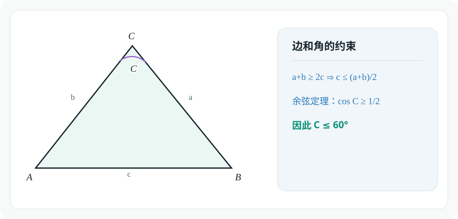

### 例题 8.2

设 $a,b,c$ 是三角形的三边，$A,B,C$ 分别是这三边所对的角。若

$$
a^2+b^2=2021c^2,
$$

则

$$
\frac{\cot C}{\cot A+\cot B}=
$$

**A.** $\dfrac{1}{2021}$

**B.** $\dfrac{1}{1010}$

**C.** $1010$

**D.** $2021$

$$\frac{\cot C}{\cot A+\cot B}\\
=\frac{\frac{\cos C}{\sin C}}{\frac{\cos A}{\sin A}+\frac{\cos B}{\sin B}}\\
=\frac{\frac{\cos C}{\sin C}}{\frac{\sin(A+B)}{\sin A\sin B}}\\
=\frac{\sin A\sin B\cos C}{\sin^2C}\\
=\frac{ab\cos C}{c^2}\\
=\frac{a^2+b^2-c^2}{2c^2}\\
=\frac{2020c^2}{2c^2}=1010$$

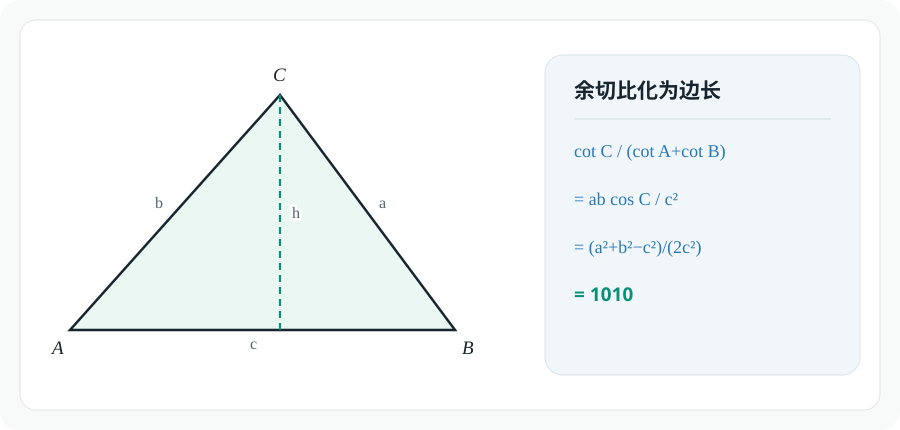

### 例题 8.3

**题目来源：** 清华大学

在 $\triangle ABC$ 中，$A,B,C$ 的对边分别为 $a,b,c$。已知

$$
2\sin^2\frac{A+B}{2}=1+\cos 2C。
$$

1. 求角 $C$ 的大小；

2. 若 $c^2=2b^2-2a^2$，求 $\cos 2A-\cos 2B$ 的值。

For 1:

$$0=\cos2C+\cos(A+B)\\
=\cos2C-\cos C\\
=2\cos^2C-\cos C-1\\
=(2\cos C+1)(\cos C-1)\\
\cos C-1\ne0,\cos C=-\frac{1}{2}\\
C=\frac{2\pi}{3}$$

For 2:
$$\cos C=\frac{a^2+b^2-c^2}{2ab}\\
=\frac{3a^2-b^2}{2ab}=\frac12\\
3a^2-b^2-ab=0\\
\cos2A-\cos2B\\
=(2\cos^2A-1)-(2\cos^2B-1)\\
=2(\cos^2A-\cos^2B)$$

如果直接用边表示余弦,恐怕是复杂的,思路无以为继:

这里我们推导一个新公式:余弦平方差

$$\cos^2x-\cos^2y\\
=(\cos x+\cos y)(\cos x-\cos y)\\
=(2\cos\frac{x+y}{2}\cos\frac{x-y}{2})(-2\sin\frac{x+y}{2}\sin\frac{x-y}{2})\\
=-sin(x+y)\sin(x-y)$$

进一步化简:

$$\cos^2A-\cos^2B\\
=-\sin(A+B)\sin(A-B)\\
=-\sin\frac{\pi}{3}\sin(A-B)\\
=\frac{\sqrt3}{2}\sin(B-A)$$

利用齐次化计算$\sin(B-A)$:

$$\frac{\sin(B-A)}{\sin(A+B)}\\
=\frac{\sin B\cos A-\cos B\sin A}{\sin B\cos A+\cos A\sin B}\\
=\frac{b\cos A-a\cos B}{b\cos A+a\cos B}\\
=\frac{b\frac{b^2+c^2-a^2}{2bc}-a\frac{a^2+c^2-b^2}{2ac}}{b\frac{b^2+c^2-a^2}{2bc}+a\frac{a^2+c^2-b^2}{2ac}}\\
=\frac{(b^2+c^2-a^2)-(a^2+c^2-b^2)}{(b^2+c^2-a^2)+(a^2+c^2-b^2)}\\
=\frac{b^2-a^2}{c^2}\\
=\frac{b^2-a^2}{2b^2-2a^2}\\
=\frac{1}{2}\\
\sin(B-A)=\frac12\sin(A+B)=\frac{\sqrt3}{4}$$

回代目标式:

$$\cos2A-\cos2B\\
=\sqrt3\sin(B-A)\\
=\frac{3}{4}$$

回顾计算过程,我们发现了更简便的路径:

$$c^2=2b^2-2a^2\\
\sin^2C=2(\sin^2B-\sin^2A)\\
\sin^2C=2\sin(B+A)\sin(B-A)\\
\sin(B-A)=\frac{\sin C}{2}=\frac{\sqrt3}{4}$$

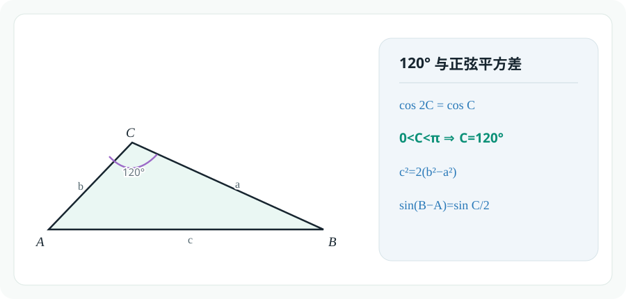

## 8.2 三角形的特殊线

### 例题 8.4

**题目来源：** 清华大学

已知 $\triangle ABC$ 的三个内角 $A,B,C$ 所对的边分别为 $a,b,c$，且满足

$$
b\cos C+(a+c)(b\sin C-1)=0,\qquad a+c=\sqrt3,
$$

则

**A.** 面积的最大值为 $\dfrac{3\sqrt3}{16}$

**B.** 周长的最大值为 $\dfrac{3\sqrt3}{2}$

**C.** $B=\dfrac\pi3$

**D.** $B=\dfrac\pi4$

初步观察,看似条件1不是关于边的齐次式,难以化成只含正弦的表达式. 实际上,结合条件2,可以通过常量代换的方式调整次数:

$$b\cos C+\sqrt3b\sin C=a+c\\
\sin B\cos C+\sqrt3\sin B\sin C=\sin A+\sin C\\
\sin B\cos C+\sqrt3\sin B\sin C=\sin(B+C)+\sin C\\
\sin B\cos C+\sqrt3\sin B\sin C=\sin B\cos C+\cos B\sin C+\sin C\\
\sin C(\cos B+1-\sqrt3\sin B)=0\\
\sin C\ne0\\
\sqrt3\sin B-\cos B=1\\
2\sin(B-\frac\pi6)=1\\
\sin(B-\frac\pi6)=\frac12\\
B-\frac\pi6=\frac\pi6\text{ or }\frac{5\pi}{6}\\
B\in(0,\pi),B=\frac\pi3$$

接下来先考虑周长:

$$\frac{a+b+c}{a+c}=1+\frac{b}{a+c}\\
=1+\frac{\sin B}{\sin A+\sin C}\\
=1+\frac{\sin B}{2\sin\frac{A+C}{2}\cos\frac{A-C}{2}}\\
=1+\frac{\sin \frac\pi3}{2\sin\frac\pi3\cos\frac{A-C}{2}}\\
=1+\frac{1}{2\cos\frac{A-C}{2}}\\
A+C=\frac{2\pi}{3},A-C\in(-\frac{2\pi}{3},\frac{2\pi}{3})\\
\cos(A-C)\in(\frac12,1]\\
\frac{a+b+c}{a+c}\in [\frac32,2)\\
a+b+c\in[\frac32\sqrt3,2\sqrt3)$$

然后考虑面积:

$$S_{\triangle ABC}=\frac{1}{2}ac\sin B\\
=\frac{\sqrt3}{4}ac\\
=\frac{\sqrt3}{16}[(a+c)^2-(a-c)^2]\le\frac{\sqrt3}{16}(a+c)^2=\frac{3\sqrt3}{16}$$

正确答案:AC

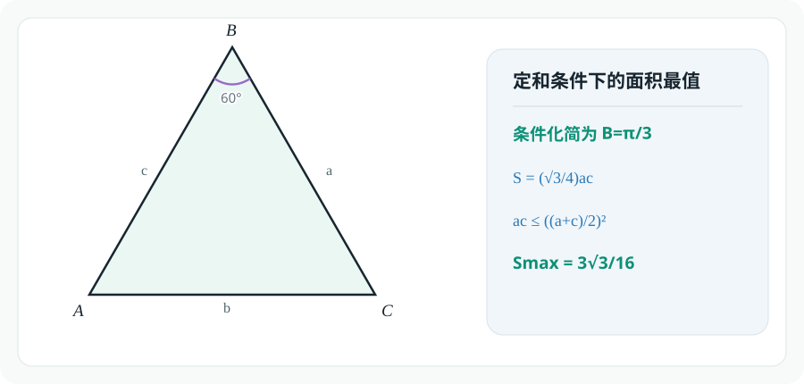

### 例题 8.5

**题目来源：** 北京大学

已知某三角形的两条高的长度分别为 $10$ 和 $20$，则它的第三条高的长度取值区间为

**A.** $\left(\dfrac{10}{3},5\right)$

**B.** $\left(5,\dfrac{20}{3}\right)$

**C.** $\left(\dfrac{20}{3},20\right)$

**D.** 前三个答案都不对

不妨设三角形边a,b上的高为10,20,边c上的高为x:

$$10a=20b=cx\\
x=\frac{10a}{c}=\frac{20b}{c}\\
x=\frac{20(a+b)}{3c}\gt\frac{20}{3}$$

我们已经使用了$a+b\gt c$,这个边界条件.

为了满足三角形的边条件,我们还需要利用$b+c\gt a$($b\lt a$)

$$x=\frac{20(a-b)}{c}\lt20$$

综上,答案选C

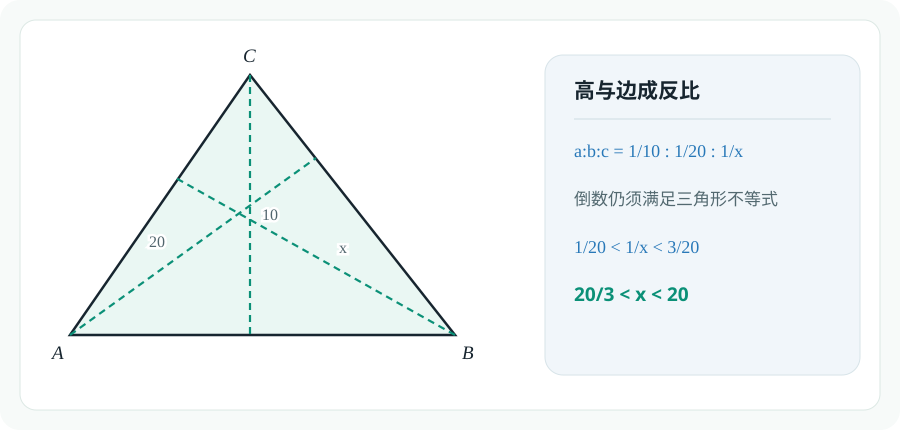

### 例题 8.6

**题目来源：** 北京大学

在 $\triangle ABC$ 中，$AB=13$，$AC=15$，$BC=14$，$AD$ 为边 $BC$ 上的高，则 $\triangle ABD$ 和 $\triangle ACD$ 的内切圆圆心之间的距离为

**A.** $2$

**B.** $3$

**C.** $5$

**D.** 前三个答案都不对

先计算BD,CD:

$$BD+CD=BC=14\\
CD^2-BD^2=AC^2-AB^2=56\\
CD-BD=4\\
CD=9,BD=5$$

计算内切圆圆心到BC边的距离(这同时也是内切圆圆心到AD的距离):

$$\frac{5+12-13}{2}=2,\frac{12+9-15}{2}=3$$

因此,内切圆圆心距离为:

$$\sqrt{(3-2)^2+(2+3)^2}=\sqrt{26}$$

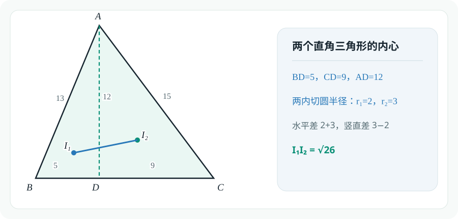

### 例题 8.7

**题目来源：** 北京大学

$O$ 是凸四边形 $ABCD$ 的对角线 $AC$ 和 $BD$ 的交点。已知 $\triangle AOB$、$\triangle BOC$、$\triangle COD$、$\triangle DOA$ 的周长相同，$\triangle AOB$、$\triangle BOC$、$\triangle COD$ 的内切圆半径分别为 $3,4,6$，则 $\triangle DOA$ 的内切圆半径为

**A.** $\dfrac92$

**B.** $5$

**C.** $\dfrac{11}{2}$

**D.** 前三个答案都不对

熟知三角形面积公式$S=pr$,因为四个三角形周长相等,故 $\triangle AOB$、$\triangle BOC$、$\triangle COD$、$\triangle COD$面积比就等于内切圆半径比.

$$\frac{S_{\triangle AOB}}{S_{\triangle BOC}}=\frac{AO}{OC}=\frac{S_{\triangle AOD}}{S_{\triangle COD}}\\
\frac{r_{\triangle AOB}}{r_{\triangle BOC}}=\frac{r_{\triangle AOD}}{r_{\triangle COD}}\\
r_{\triangle AOD}=\frac92$$

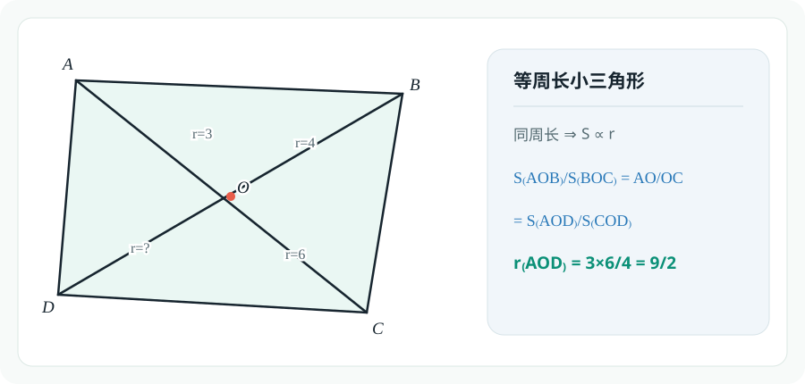

## 8.3 三角形的特殊线

### 例题 8.8

**题目来源：** 同济大学

在 $\triangle ABC$ 中，$AB=2AC$，$AD$ 是角 $A$ 的角平分线，且 $AD=kAC$。

1. 求 $k$ 的取值范围；
2. 若 $S_{\triangle ABC}=1$，问 $k$ 为何值时，$BC$ 最短？

### 边

For 1:

我们回顾一下三角形内的斯特瓦尔特定理:

$$AD^2=\frac{CD\cdot AB^2+BD\cdot AC^2}{BC}-CD\cdot BD$$

设$AC=x,AB=2x,AD=kx,BC=y\in(x,3x)$,有:

$$AD^2=\frac{CD}{BC}\cdot AB^2+\frac{BD}{BC}\cdot AC^2-CD\cdot BD\\
=\frac{(2x)^2}{3}+\frac{2(x)^2}{3}-\frac{y}{3}\cdot\frac{2y}{3}\\
=2x^2-\frac{2y^2}{9}\in(0,\frac{16x^2}{9})$$

于是,$AD=kx\in(0,\frac{4}{3}x)$,即$k\in(0,\frac43)$

For 2:

$$S_{\triangle ABC}=\sqrt{p(p-x)(p-2x)(p-y)}=1\\
\sqrt{(3x+y)(x+y)(y-x)(3x-y)}=4\\
\sqrt{(9x^2-y^2)(y^2-x^2)}=4\\
(9x^2-y^2)(y^2-x^2)=16\\
m=9x^2-y^2,n=y^2-x^2\\
mn=16\\
y^2=\frac{m+9n}{8}\ge\frac{6\sqrt{mn}}{8}=3\\
BC=y\ge\sqrt{3}$$

根据取等条件,可以解出$m,n$的值,进而求出$x,k$:

$$m=9n,mn=16\\
m=12,n=\frac43\\
x^2=\frac{m+n}{8}=\frac53\\
k=\frac{AD}{x}=\sqrt{2-\frac{2}{9}\frac{y^2}{x^2}}=\frac{2\sqrt{10}}{5}$$

### 角

For 1:

设$AC=x,AB=2x,AD=kx,\angle CAD=\angle BAC=\theta$,有:

$$S_{\triangle ABC}=\frac12(x)(2x)\sin2\theta\\
=\frac12(x)(kx)\sin\theta+\frac12(kx)(2x)\sin\theta\\
k=\frac{2\sin2\theta}{3\sin\theta}=\frac43\cos\theta\in(0,\frac43)$$

For 2:

$$S_{\triangle ABC}=\frac12(x)(2x)\sin2\theta=1\\
BC^2=(x)^2+(2x)^2-2(x)(2x)\cos\theta\\
=5x^2-4x^2\cos2\theta\\
=(5-4\cos2\theta)\frac{1}{\sin2\theta}\\
BC^2\sin2\theta=5-4\cos2\theta\\
BC^2\sin2\theta+4\cos2\theta=5\\
\sqrt{(BC^2)^2+4^2}\le5\\
BC^2\ge3,BC\ge\sqrt3$$

当$BC=\sqrt3$时,$\sin2\theta=\frac{3}{5},\cos2\theta=\frac45$:
$$\cos\theta=\sqrt{\frac{1+\cos2\theta}{2}}=\frac{3\sqrt{10}}{10}\\k=\frac{4}{3}\cos\theta=\frac{2\sqrt{10}}{5}$$

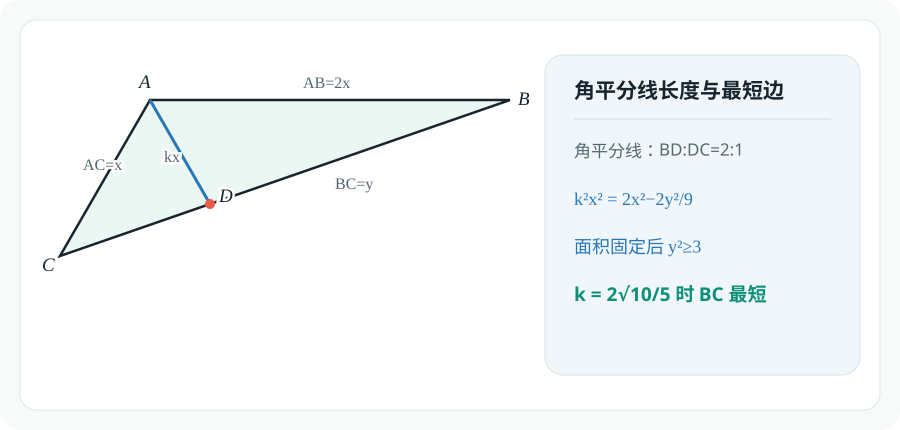

### 例题 8.9

**题目来源：** 2025 北京大学

在 $\triangle ABC$ 中，$D$ 在 $BC$ 上，$AD$ 平分 $\angle BAC$，$AB=AD=2$，$BD=1$，求 $CD$。

### 角

由于$AB=AD$,设$\angle BAD=2\theta,\sin\theta=\frac{BD}{2AD}=\frac14,\cos\theta=\frac{\sqrt{15}}{4}$.

在三角形ADC里使用正弦定理:

$$\frac{AD}{\sin(90-3\theta)}=\frac{CD}{\sin2\theta}\\
CD=\frac{\sin2\theta}{\cos3\theta}AD\\
=\frac{2\sin\theta\cos\theta}{4\cos^3\theta-3\cos\theta}AD\\
=\frac{2\sin\theta}{4\cos^2\theta-3}AD\\
=\frac{2\cdot\frac{1}{4}}{\frac{15}{4}-3}\cdot2\\
=\frac43$$

### 边

根据角平分线定理,设$AC=2x,CD=x$,在三角形ABC中用斯特瓦尔特定理:

$$AD^2=\frac{CD\cdot AB^2+BD\cdot AC^2}{BC}-BD\cdot CD\\
2^2=\frac{4x+4x^2}{x+1}-x\\
4=3x\\
x=\frac43$$

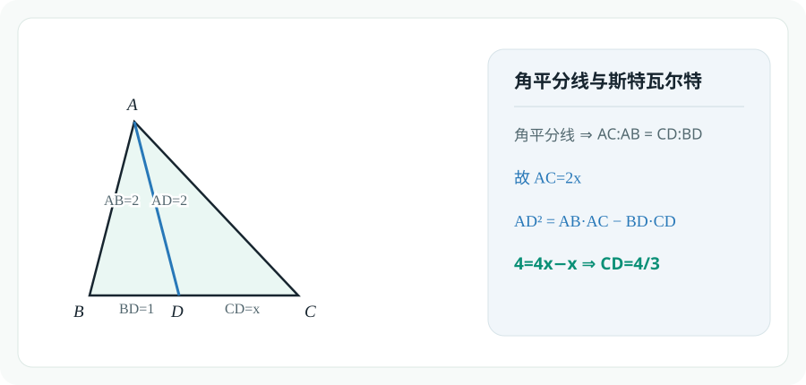

### 例题 8.10

**题目来源：** 北京大学

已知三角形三条中线的长度分别为 $9,12,15$，则该三角形的面积为

**A.** $69$

**B.** $72$

**C.** $75$

**D.** 前三个答案都不对

Lemma:三角形三条中线可以构成三角形,且新三角形和原三角形的面积比为$3:4$.

回到本题,则是:

$$\frac{\frac129\cdot 12}{S}=\frac{3}{4}\\
S=72$$

关于这个引理,可以用向量给出证明:

$$\vec{a}=\frac{1}{2}(\vec{AB}+\vec{AC})\\
\vec{b}=\frac{1}{2}(\vec{BC}+\vec{BA})\\
\vec{c}=\frac{1}{2}(\vec{CA}+\vec{CB})\\
\vec{a}+\vec{b}+\vec{c}=\vec{0}\\
S_{\triangle ABC}=\frac12|\vec{AB}\times\vec{AC}|\\
S'_\triangle=\frac12|\vec{a}\times\vec{b}|\\
=\frac{1}{8}|(\vec{AB}+\vec{AC})\times(\vec{AC}-2\vec{AB})|\\
=\frac{3}{8}|\vec{AB}\times\vec{AC}|=\frac34S_{\triangle ABC}$$

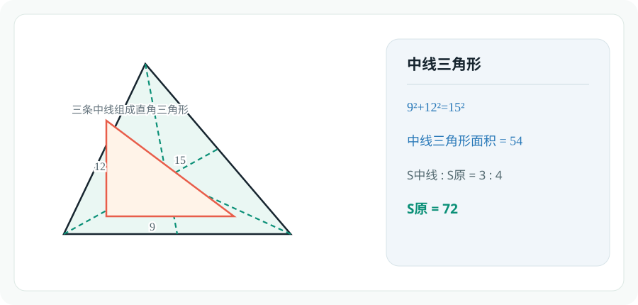

### :例题 8.11

如图，点 $D,E,F$ 分别是 $\triangle ABC$ 三边 $BC,AC,AB$ 上的三等分点，$EC=2AE$，$BD=2CD$，$AF=2BF$。若 $S_{\triangle ABC}=1$，求 $S_{\triangle PQR}$。

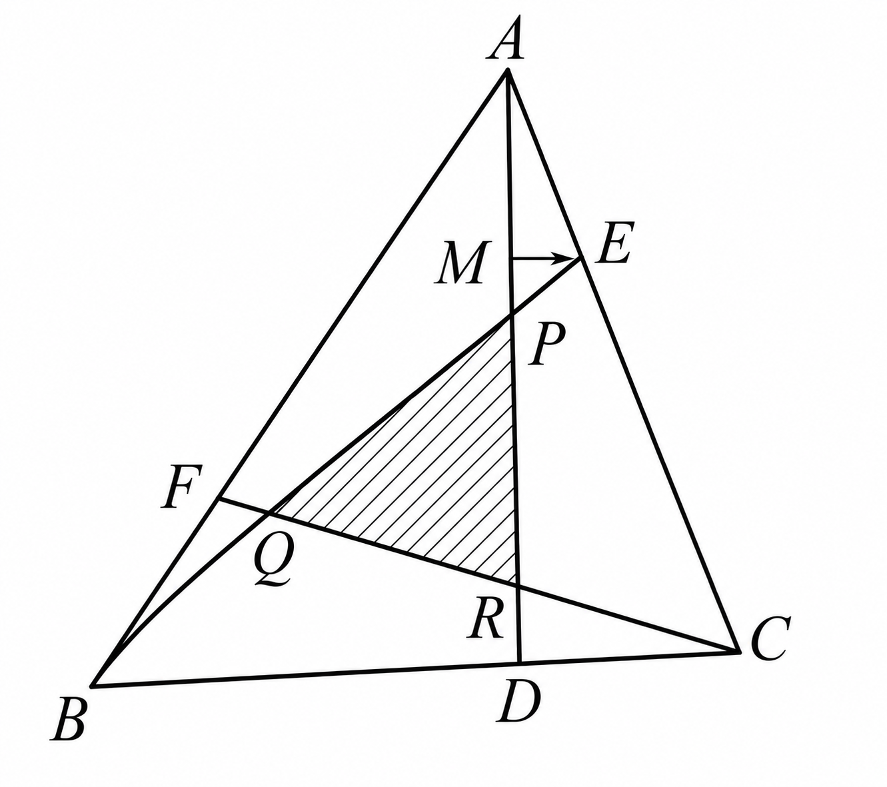

此题需要大量使用梅涅劳斯定理求线段比:

$$\frac{AP}{PD}\cdot\frac{DB}{BC}\cdot\frac{CE}{EA}=1\\
\frac{AP}{PD}\cdot\frac{2}{3}\cdot\frac21=1\\
\frac{AP}{PD}=\frac{3}{4},AP=\frac37AD\\
\frac{AR}{RD}\cdot\frac{DC}{CB}\cdot\frac{BF}{FA}=1\\
\frac{AR}{RD}\cdot\frac{1}{3}\cdot\frac12=1\\
\frac{AR}{RD}=6,RD=\frac{1}{7}AD\\
DR:RP:PA=1:3:3$$

同理,根据图形对称性有:

$$\frac{RP}{RA}=\frac12,\frac{RQ}{RF}=\frac34$$

于是,线段的比例已知,我们得以大展拳脚:

$$\frac{S_{\triangle PQR}}{S_{\triangle AFR}}=\frac{RP}{RA}\cdot\frac{RQ}{RF}=\frac38\\
\frac{S_{\triangle AFR}}{S_{\triangle ACF}}=\frac{RF}{FC}=\frac47\\
\frac{S_{\triangle ACF}}{S_{\triangle ABC}}=\frac{AF}{AB}=\frac23\\
S_{\triangle PQR}=\frac38\cdot\frac47\cdot\frac23S_{\triangle ABC}=\frac17$$

当然,此题同样可以用平面向量共线定理解决,请读者自证.

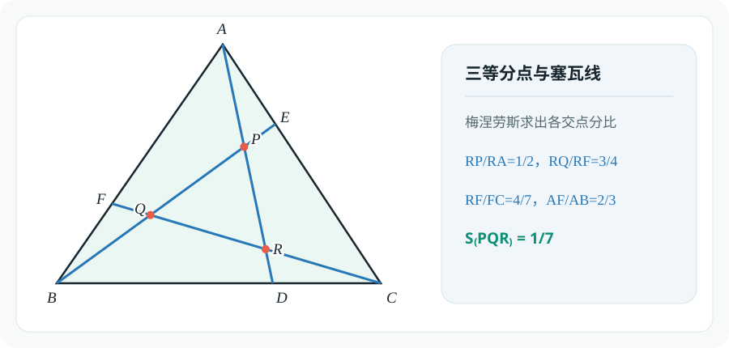

### 例题 8.12

**题目来源：** 北京大学

求证：边长为 $1$ 的正五边形的对角线长为 $\dfrac{\sqrt5+1}{2}$。

易知对角线长:$2\sin\frac{3\pi}{10}=2\cos\frac{\pi}{5}$

已知:$\sin\frac{\pi}{10}=\frac{\sqrt5-1}{4}$

故:$\cos\frac{\pi}{5}=1-2\sin^2\frac\pi{10}=\frac{\sqrt5+1}{4}$

更有趣味的解法:托勒密定理

在五边形顶点中任选4点,用托勒密定理:

$$x^2=x+1(x\gt0)\\
x=\frac{\sqrt5+1}{2}$$

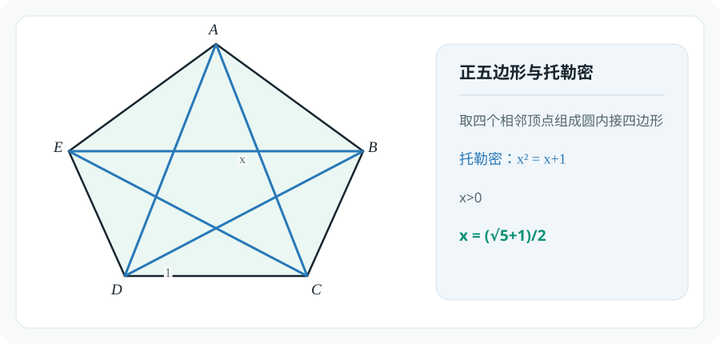

### 例题 8.13

**题目来源：** 北京大学

在圆内接四边形 $ABCD$ 中，$BD=6$，$\angle ABD=\angle CBD=30^\circ$，则四边形 $ABCD$ 的面积等于

**A.** $8\sqrt3$

**B.** $9\sqrt3$

**C.** $12\sqrt3$

**D.** 前三个答案都不对

因为$\angle ABD=\angle CBD$,故$\angle ADC=180^\circ-2\cdot30^\circ=120^\circ,AD=CD=m,AC=\sqrt3m$.

$$S_{ABCD}=\frac12BD(AB+AC)\sin30^\circ=\frac32(AB+AC)$$

再考虑托勒密定理:

$$AB\cdot CD+BC\cdot AD=AC\cdot BD\\
AB+BC=\sqrt3BD=6\sqrt3\\
S_{ABCD}=9\sqrt3$$

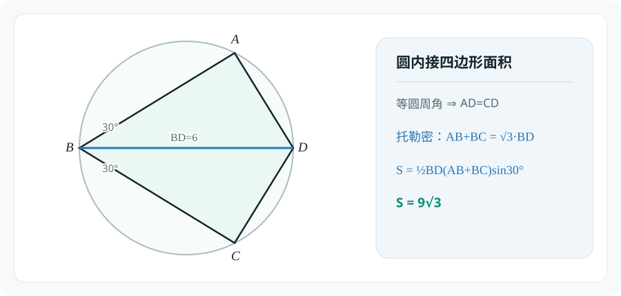

### 例题 8.14

**题目来源：** 北京大学

在圆周上逆时针依次取 $4$ 个点 $A,B,C,D$，已知 $BA=1$，$BC=2$，$BD=3$，$\angle ABD=\angle DBC$，则该圆的直径为

**A.** $2\sqrt5$

**B.** $2\sqrt6$

**C.** $2\sqrt7$

**D.** 前三个答案都不对

看到圆内角平分线,我们故技重施,用托勒密定理:

$$AB\cdot CD+BC\cdot AD=BD\cdot AC\\
AD=DC\\
\frac{AD}{AC}=\frac{BD}{AB+BC}=1\\
\angle ADC=60^\circ\\
\angle ABC=120^\circ\\
AC=\sqrt{AB^2+BC^2-2AB\cdot BC\cos\angle ABC}=\sqrt7\\
d=\frac{m}{\sin\angle ABC}=\frac{2\sqrt{21}}{3}$$

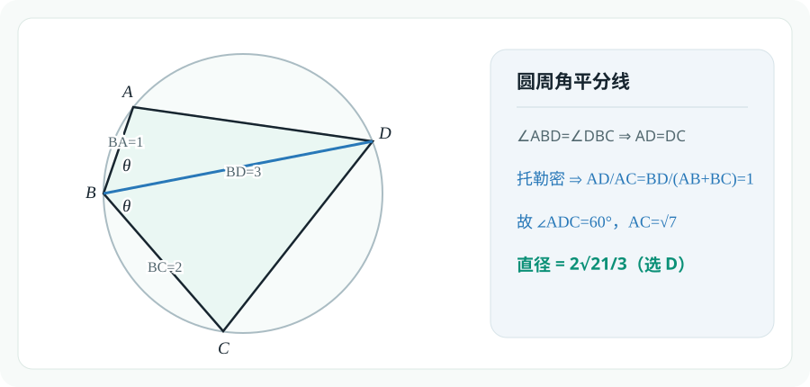

### 例题 8.15

**题目来源：** 北京大学

在凸四边形 $ABCD$ 中，$BC=4$，$\angle ADC=60^\circ$，$\angle BAD=90^\circ$，四边形 $ABCD$ 的面积等于

$$
\frac{AB\cdot CD+BC\cdot AD}{2}，
$$

则 $CD$ 的长（精确到小数点后 $1$ 位）为

**A.** $6.9$

**B.** $7.1$

**C.** $7.3$

**D.** 前三个答案都不对

四边形面积是对边乘积的一半,这提醒我们使用托勒密定理:

$$S_{ABCD}\le\frac12AC\cdot BC\le\frac{AB\cdot CD+BC\cdot AD}{2}$$

这表明所有等号都成立,即$BC\perp AC,A,B,C,D$四点共圆.

根据图形对称性,有:

$$AB=BC=4,AD=DC$$

根据角度求边:

$$\angle ABC=120^\circ\\
\angle DBC=60^\circ\\
CD=\tan60^\circ BC=4\sqrt3\approx 6.9$$

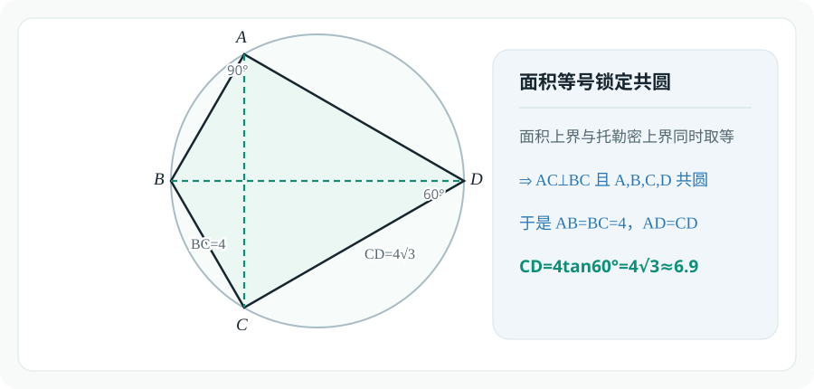

## 8.4 平面几何中的变换

### 例题 8.16

**题目来源：** 北京大学

已知正方形 $ABCD$ 的边长为 $1$，$P_1,P_2,P_3,P_4$ 是正方形内部的 $4$ 个点，使得 $\triangle ABP_1$、$\triangle BCP_2$、$\triangle CDP_3$ 和 $\triangle DAP_4$ 都是正三角形，则四边形 $P_1P_2P_3P_4$ 的面积等于

**A.** $2-\sqrt3$

**B.** $\dfrac{\sqrt6-\sqrt2}{4}$

**C.** $\dfrac{1+\sqrt3}{8}$

**D.** 前三个答案都不对

根据对称性,显然四边形$P_1P_2P_3P_4$为正方形,故:

$$S_{P_1P_2P_3P_4}=P_1P_2^2\\
P_1P_2^2=BP_2^2+BP_1^2-2BP_1BP_2\cos30^\circ=2-\sqrt3$$

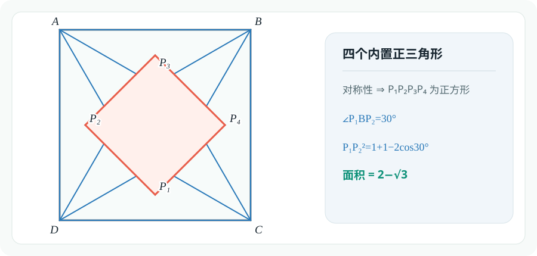

### 例题 8.17

**题目来源：** 北京大学

正方形 $ABCD$ 与点 $P$ 在同一平面内。已知该正方形的边长为 $1$，且

$$
|PA|^2+|PB|^2=|PC|^2,
$$

则 $|PD|$ 的最大值为

**A.** $2+\sqrt2$

**B.** $2\sqrt2$

**C.** $1+\sqrt2$

**D.** 前三个答案都不对

Lemma:$|PA|^2+|PC|^2=|PD|^2+|PB|^2$

于是消去PB,PC得:

$$2|PA|^2=|PD|^2\\
\sqrt2|PA|=|PD|\\
1=AD\ge |PD|-|PA|=\frac{2-\sqrt2}{2}|PD|\\
|PD|\le2+\sqrt2$$

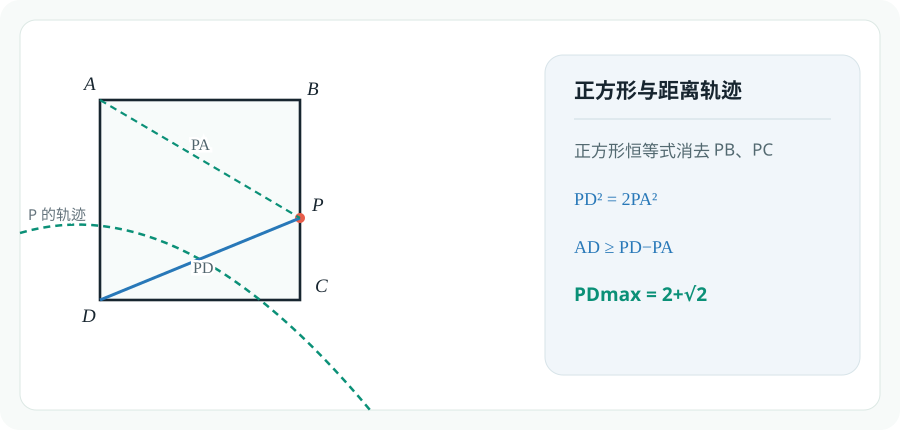

### 例题 8.18

**题目来源：** 上海交通大学

设 $a,b,c$ 表示三角形三边长，均为整数，且 $a\le b\le c$。若 $b=n$（$n$ 为正整数），则可组成这样的三角形 ______ 个。

长度分别为$a\le b\le c$的边能构成三角形的充要条件:

$$a+b\gt c$$

那么固定$a$,考察$c$的可能情况数:

$$a=1,c=n\\
a=2,c=n,n+1\\
a=3,c=n,n+1,n+2\\
\cdots\\
a=n,c=n,n+1,\cdots,2n-2,2n-1$$

总情况数:$1+2+3+\cdots+n=\frac{n(n+1)}2$

