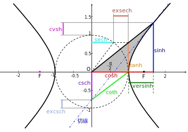
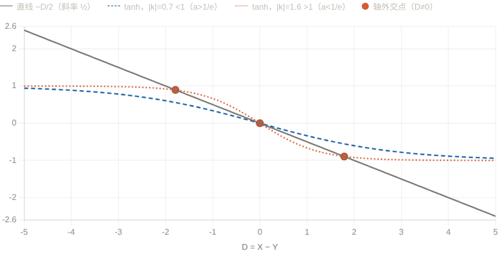

<!--more-->
### Example 1: Analytical Algebra
It is known that the ellipse $C:\frac{x^2}{4}+\frac{y^2}{3}=1$ and the function $y=m^{x+1}+n(m\ge 2)$ intersect the ellipse at two points $A,B$, and find the maximum value of $n$.

Assume $A(x_0,y_0),B(-x_0,-y_0),x_0\in(0,2),y_0\in(0,\sqrt{3})$, there are:

$\begin{cases}
  y_0=m^{x_0+1}+n,(1)\\
  -y_0=m^{-x_0+1}+n,(2)\\
  \frac{x_0^2}{4}+\frac{y_0^2}{3}=1,(3)
\end{cases} $

Considering that there are a total of four variables $x_0,y_0,m,n$ and three constraints, there are $4-3=1$ degrees of freedom.

Obviously if the scope of one of the variables can be determined, the scope of the other variables will be easily determined:

In order to **use symmetry** while obtaining **identical deformation**, consider (1)+(2) and (1)-(2), then the **sufficient and necessary conditions** are:

$$\begin{cases}
  -2n=m(m^{x_0}+m^{-x_0}),(4)\\
  2y_0=m(m^{x_0}-m^{-x_0}),(5)\\
  \frac{x_0^2}{4}+\frac{y_0^2}{3}=1,(3)
\end{cases}$$

Make a few simple observations:
- It is easy to see from (4) that $n\lt 0$.
- In (4), $m^{x_0}\gt 1$, then $m$ is larger, $-2n$ is smaller, and $n$ is larger
- In (5), the larger m is, the smaller 2y_0 is, and $m\ge 2$ can be eliminated by scaling $m$

So, we further perform **lossless scaling** (m=2):

$$\begin{cases}
  -2n\ge 2(2^{x_0}+2^{-x_0}),(6)\\
  2y_0\ge 2(2^{x_0}-2^{-x_0}),(7)\\
  \frac{x_0^2}{4}+\frac{y_0^2}{3}=1\ge \frac{x_0^2}{4}+\frac{2^{2x_0}+2^{-2x_0}-2}{3},(\alpha)
\end{cases}$$

($\alpha$) is the key to solving the problem! It is not difficult to see that $\frac{x_0^2}{4}+\frac{2^{2x_0}+2^{-2x_0}-2}{3}$ is monotonically increasing with respect to $x_0$, and the solution is $x_0\le 1$.

So according to (6) we have:

$$\begin{gathered}
  n\le -(2^{x_0}+2^{-x_0})\le -\frac{5}{2}
\end{gathered}$$

## Mathematical background: hyperbolic trigonometric functions

Hyperbolic trigonometric functions are derived from hyperbola $x^2-y^2=1$, so they are called **hyperbolic functions**

$$\begin{cases}
  \sinh x=\frac{e^x-e^{-x}}{2},\\
  \cosh x=\frac{e^x+e^{-x}}{2}\ge 1,\\
  \tanh x=\frac{\sinh x}{\cosh x}=\frac{e^x-e^{-x}}{e^x+e^{-x}}=\frac{e^{2x}-1}{e^{2x}+1}\lt 1
\end{cases}$$

Similar to trigonometric functions, hyperbolic functions have corresponding identity transformation formulas:

$$\begin{gathered}
  \cosh^2 x-\sinh^2 x=1,\\
  \cosh^2 x+\sinh^2 x=\cosh 2x,\\
  \sinh(x+y)=\sinh x\cosh y+\cosh x\sinh y\\
  \sinh(x-y)=\sinh x\cosh y-\cosh x\sinh y\\
  \cosh(x+y)=\cosh x\cosh y+\sinh x\sinh y\\
  \cosh(x-y)=\cosh x\cosh y-\sinh x\sinh y\\
  \tanh(x+y)=\frac{\tanh x+\tanh y}{1+\tanh x\tanh y}\\
  \tanh(x-y)=\frac{\tanh x-\tanh y}{1-\tanh x\tanh y}\\
\end{gathered}$$

For details, see [Wikipedia](https://en.wikipedia.org/wiki/Hyperbolic_functions).

When dealing with Example 1 (4) (5), you can also use the analogy of $\cosh^2 x-\sinh^2 x=1$ and consider the squares and then add them.

### Example 2
If $f(x)=a^{x-1}$ and $g(x)=\log_a x+1$ have three intersection points, find the value range of $a$:

When $a\gt 1$, $f(x)=a^{x-1}$ increases monotonically, and $f(x),g(x)$ are inverse functions of each other, then if the intersection point is not on $y=x$:

Suppose the intersection point is $(x,y)$, then there must be a pair of intersection points $(y,x)$, and as long as $x\neq y$, it is inconsistent with monotonicity.

This means that $y=a^{x-1}$ as a downward convex function has two intersection points with $y=x$, which obviously leads to a contradiction:

Therefore, $0\lt a\lt 1$, at this time, there is obviously an intersection point $(1,1)$, and the other two intersection points cannot be on $y=x$, then the two paired intersection points are not on $y=x$, and there is a pair of $(x,y),(y,x)$ that is an intersection point that meets the meaning of the question:

$$\begin{cases}
  a^{x-1}=y,(1)\\
  a^{y-1}=x,(2)
\end{cases}$$

$$\begin{gathered}
  a^{x-1}+a^{y-1}=x+y,\\
  a^{x-1}-a^{y-1}=y-x
\end{gathered}$$

Let $k=\ln a\lt 0,x-1=u,y-1=v$, then:

$$\begin{gathered}
  e^{ku}+e^{kv}=u+v+2,(3)\\
  e^{ku}-e^{kv}=v-u,(4)
\end{gathered}$$

Order $u+v=S,u-v=D$ again

$$\begin{cases}
  e^{\frac{kS}{2}}(e^{\frac{kD}{2}}+e^{-\frac{kD}{2}})=S+2,(5)\\
  e^{\frac{kS}{2}}(e^{\frac{kD}{2}}-e^{-\frac{kD}{2}})=-D,(6)
\end{cases}$$

(5)/(6):

$$\boxed{\tanh(\frac{kD}{2})=-\frac{D}{S+2}}$$

The above are the necessary conditions for the existence of $x,y$.

When $S$ is fixed, $y=-\frac{1}{S+2}D$ is a straight line, considering that it has three intersection points with $y=\tanh(\frac{kD}{2})$.

Obviously, it can be seen from the image that the slope of $y=\tanh \frac{kD}{2}$ at $D=0$ is $\frac{k}{2}$.

Then if $-\frac{1}{S+2}\gt \frac{k}{2}$, then the straight line and the hyperbolic tangent function will have three intersection points.

If $-\frac{1}{S+2}\le \frac{k}{2}$, then there is only one intersection point between the straight line and the hyperbolic tangent function.

From (3):

$$\begin{gathered}
  S+2=e^{ku}+e^{kv}\ge 2e^{k\frac{S}{2}}
\end{gathered}$$

If $S\lt 0$, then $2\gt S+2\ge 2e^{k\frac{S}{2}}\gt 2$, resulting in a contradiction.

So $S\ge 0$.

Critical condition $S\to 0,k\to -1,a\to \frac{1}{e}$

Replace "ratio slope at $S\to0$" with a **single variable, global** argument to completely avoid the trouble of entanglement of two unknown quantities. The cleanest thing is to go back to a fixed point language.

Assume $f(x)=a^{x-1}$ ($0<a<1$), the axis outer pair is the fixed point of $g(x)=f(f(x))$ except $x=1$. inspection

$$\psi(x)=f(f(x))-x,\qquad \psi(1)=0.$$

**Step 1: $\psi$ Up to 3 zero points. ** To calculate the derivative, record $w(x)=f(x)+x-2$, then

$$\psi'(x)=f'(f(x))f'(x)-1=(\ln a)^2\,a^{\,w(x)}-1.$$

Moreover, $w'(x)=a^{x-1}\ln a+1$ is strictly increasing, so $w$ first decreases and then increases and has a unique minimum. Therefore, when the base is less than 1, $a^{w(x)}$ first increases and then decreases. Thus $\psi'$ is also unimodal: although it tends to $-1$ at both ends, it may become positive in between. Hence $\psi'$ changes sign at most twice, and $\psi$ has a decrease–increase–decrease profile with **at most three zeros**. By inverse-function symmetry, nontrivial zeros occur in pairs, so there is at most one off-axis pair.

**Step 2: The threshold is exactly $\psi'(1)=0$. ** At the known zero point $x=1$,

$$\psi'(1)=f'(1)^2-1=(\ln a)^2-1.$$

- If $(\ln a)^2\le1$ (i.e. $a\ge\frac1e$): then $\psi'(1)\le0$. Combined with the single-peak structure, it can be verified that $\psi$ no longer crosses zero on both sides of $x=1$ (it crosses down at $1$, and both ends are also facing $-$, and the positive peak in the middle cannot reach to create a new intersection point if it exists), so there is only one zero point** and only one intersection point for $x=1$.
- If $(\ln a)^2>1$ (that is, $a<\frac1e$, because $\ln a<0$ is $\ln a<-1$): then $\psi'(1)>0$, $\psi$ crosses the zero point at $x=1$. However, $\psi(x)\to+\infty\ (x\to-\infty)$ and $\psi(x)\to-\infty\ (x\to+\infty)$ (use $0<a<1$ to directly test the limits at both ends), combined with the "decrease, increase and decrease" shape caused by a single peak, $x=1$ forces a new zero point on both sides**, which is exactly a pair of off-axis solutions.

**Step Three: Continuity Closure (replacing your $S\to0$). ** The second step is sufficient and necessary, but if you want to clarify "why this pair of solutions was born at $a=\frac1e$": $\psi'(1)=(\ln a)^2-1$ continues with $a$, and when $a\uparrow\frac1e$ is $\psi'(1)\downarrow0$, the pair of zero points are continuously merged into $x=1$ (that is, $D\to0$). This is the correct origin of the "$S\to0$" phenomenon - it is the ultimate behavior of the conclusion, not a criterion used as a premise.

Therefore, it is important to:

$$\text{three intersections}\iff(\ln a)^2>1\ \text{and}\ 0<a<1\iff \boxed{0<a<\tfrac1e}.$$

### Example 3
(2021 Tsinghua Strong Foundation) defines $x*y=\frac{x+y}{1+xy}$, then $(...(2*3)*4)...)*21=$__.

It is not difficult to see that the background of this question is the hyperbolic tangent function.

Let $x=\frac{u-1}{u+1},y=\frac{v-1}{v+1},x*y=\frac{uv-1}{uv+1}$, where:

$$\begin{cases}
  u=-\frac{x+1}{x-1},\\
  v=-\frac{y+1}{y-1}
\end{cases}$$

Note $g(x)=-\frac{x+1}{x-1}$, then:

$$\begin{gathered}
  (x*y)*z=(\frac{g(x)g(y)-1}{g(x)g(y)+1})*z=\frac{g(x)g(y)g(z)-1}{g(x)g(y)g(z)+1}
\end{gathered}$$

$(...(2*3)*4)...)*21=\frac{g(2)g(3)...g(21)-1}{g(2)g(3)...g(21)+1}$

Among them $g(2)g(3)g(4)...g(21)=\frac{-3}{1}\frac{-4}{2}\frac{-5}{3}...\frac{-22}{20}=\frac{21\times22}{1\times2}=231$

What you want $=\frac{230}{232}=\frac{115}{116}$
