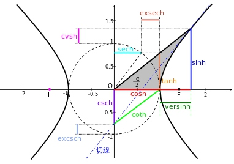
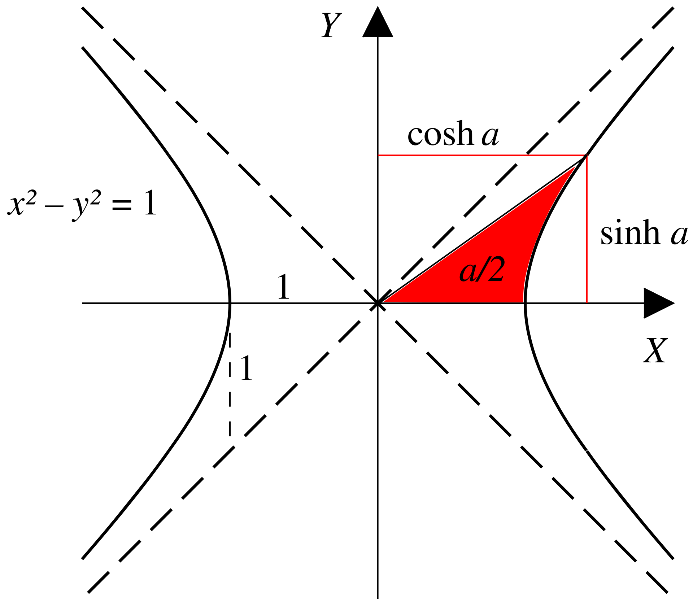
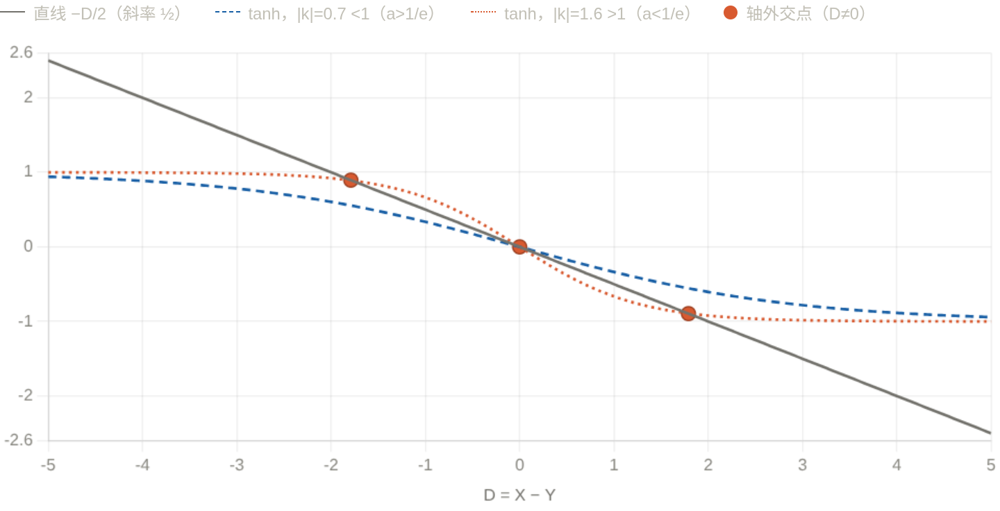

<!--more-->
### 例1:解析代数
已知椭圆$C:\frac{x^2}{4}+\frac{y^2}{3}=1$,函数$y=m^{x+1}+n(m\ge 2)$交椭圆于$A,B$两点，求$n$的最大值。

设$A(x_0,y_0),B(-x_0,-y_0),x_0\in(0,2),y_0\in(0,\sqrt{3})$，有：

$\begin{cases}
  y_0=m^{x_0+1}+n,(1)\\
  -y_0=m^{-x_0+1}+n,(2)\\
  \frac{x_0^2}{4}+\frac{y_0^2}{3}=1,(3)
\end{cases}$

考虑到一共有$x_0,y_0,m,n$四个变量，以及三个约束条件，故有$4-3=1$个自由度.

显然如果可以确定其中一个变量的范围，其他变量的范围便迎刃而解:

为了在得到**恒等变形**的同时**利用对称性**，考虑(1)+(2)和(1)-(2)，则**充要条件**为:

$$\begin{cases}
  -2n=m(m^{x_0}+m^{-x_0}),(4)\\
  2y_0=m(m^{x_0}-m^{-x_0}),(5)\\
  \frac{x_0^2}{4}+\frac{y_0^2}{3}=1,(3)
\end{cases}$$

做几个简单的观察:
- 由(4)不难看出$n\lt 0$.
- 在(4)中,$m^{x_0}\gt 1$,则$m$越大,$-2n$越小,$n$越大
- (5)中m越大，2y_0越小，且$m\ge 2$,通过放缩可以消去$m$

于是，我们进一步进行**无损放缩**(m=2):

$$\begin{cases}
  -2n\ge 2(2^{x_0}+2^{-x_0}),(6)\\
  2y_0\ge 2(2^{x_0}-2^{-x_0}),(7)\\
  \frac{x_0^2}{4}+\frac{y_0^2}{3}=1\ge \frac{x_0^2}{4}+\frac{2^{2x_0}+2^{-2x_0}-2}{3},(\alpha)
\end{cases}$$

($\alpha$)正是解题的关键！不难看出$\frac{x_0^2}{4}+\frac{2^{2x_0}+2^{-2x_0}-2}{3}$关于$x_0$单调递增，解得$x_0\le 1$.

于是根据(6)有:

$$\begin{gathered}
  n\le -(2^{x_0}+2^{-x_0})\le -\frac{5}{2}
\end{gathered}$$

## 数学背景:双曲三角函数

双曲三角函数由双曲线$x^2-y^2=1$导出，故称为**双曲函数**

$$\begin{cases}
  \sinh x=\frac{e^x-e^{-x}}{2},\\
  \cosh x=\frac{e^x+e^{-x}}{2}\ge 1,\\
  \tanh x=\frac{\sinh x}{\cosh x}=\frac{e^x-e^{-x}}{e^x+e^{-x}}=\frac{e^{2x}-1}{e^{2x}+1}\lt 1
\end{cases}$$

类似于三角函数，双曲函数有对应的恒等变换公式:

$$\begin{gathered}
  \cosh^2 x-\sinh^2 x=1,\\
  \cosh^2 x+\sinh^2 x=\cosh 2x,\\
  \sinh(x+y)=\sinh x\cosh y+\cosh x\sinh y\\
  \sinh(x-y)=\sinh x\cosh y-\cosh x\sinh y\\
  \cosh(x+y)=\cosh x\cosh y+\sinh x\sinh y\\
  \cosh(x-y)=\cosh x\cosh y-\sinh x\sinh y\\
  \tanh(x+y)=\frac{\tanh x+\tanh y}{1+\tanh x\tanh y}\\
  \tanh(x-y)=\frac{\tanh x-\tanh y}{1-\tanh x\tanh y}\\
\end{gathered}$$

详细内容见[维基百科](https://zh.wikipedia.org/wiki/%E5%8F%8C%E6%9B%B2%E5%87%BD%E6%95%B0)

处理例一(4)(5)时，也可以类比$\cosh^2 x-\sinh^2 x=1$,考虑平方再相加

### 例2
若$f(x)=a^{x-1}$和$g(x)=\log_a x+1$有三个交点，求$a$的取值范围:

当$a\gt 1$时，$f(x)=a^{x-1}$单调递增，且$f(x),g(x)$互为反函数，那么假如交点不在$y=x$上:

设交点为$(x,y)$,则必有成对的交点$(y,x)$,只要$x\neq y$,则与单调性矛盾.

这意味着$y=a^{x-1}$作为一个下凸函数与$y=x$有两个交点，显然推出矛盾:

故$0\lt a\lt 1$,此时显然有一个交点$(1,1)$，而另外两个交点都不能在$y=x$上，则两个配对的交点都不在$y=x$上，有一对$(x,y),(y,x)$为符合题意的交点:

$$\begin{cases}
  a^{x-1}=y,(1)\\
  a^{y-1}=x,(2)
\end{cases}$$

$$\begin{gathered}
  a^{x-1}+a^{y-1}=x+y,\\
  a^{x-1}-a^{y-1}=y-x
\end{gathered}$$

令$k=\ln a\lt 0,x-1=u,y-1=v$,则:

$$\begin{gathered}
  e^{ku}+e^{kv}=u+v+2,(3)\\
  e^{ku}-e^{kv}=v-u,(4)
\end{gathered}$$

再令$u+v=S,u-v=D$

$$\begin{cases}
  e^{\frac{kS}{2}}(e^{\frac{kD}{2}}+e^{-\frac{kD}{2}})=S+2,(5)\\
  e^{\frac{kS}{2}}(e^{\frac{kD}{2}}-e^{-\frac{kD}{2}})=-D,(6)
\end{cases}$$

(5)/(6)得：

$$\boxed{\tanh(\frac{kD}{2})=-\frac{D}{S+2}}$$

以上是$x,y$存在满足的必要条件.

当$S$固定时,$y=-\frac{1}{S+2}D$是一条直线,考虑它与$y=\tanh(\frac{kD}{2})$有三个交点.

显然,由图像可知,$y=\tanh \frac{kD}{2}$在$D=0$处的斜率为$\frac{k}{2}$.

那么如果$-\frac{1}{S+2}\gt \frac{k}{2}$,则直线与双曲正切函数会有三个交点.

如果$-\frac{1}{S+2}\le \frac{k}{2}$,则直线与双曲正切函数只有一个交点.

由(3):

$$\begin{gathered}
  S+2=e^{ku}+e^{kv}\ge 2e^{k\frac{S}{2}}
\end{gathered}$$

如果$S\lt 0$,则$2\gt S+2\ge 2e^{k\frac{S}{2}}\gt 2$,导致矛盾.

所以$S\ge 0$.

临界条件$S\to 0,k\to -1,a\to \frac{1}{e}$

把"在 $S\to0$ 比斜率"换成一个**单变量、全局**的论证,彻底绕开两个未知量纠缠的麻烦。最干净的是回到不动点语言。

设 $f(x)=a^{x-1}$($0<a<1$),轴外对就是 $g(x)=f(f(x))$ 除 $x=1$ 外的不动点。考察

$$\psi(x)=f(f(x))-x,\qquad \psi(1)=0.$$

**第一步:$\psi$ 至多 3 个零点。** 算导数,记 $w(x)=f(x)+x-2$,则

$$\psi'(x)=f'(f(x))f'(x)-1=(\ln a)^2\,a^{\,w(x)}-1.$$

而 $w'(x)=a^{x-1}\ln a+1$ 严格增(因 $a^{x-1}\ln a$ 增),故 $w$ 是先减后增的下凸函数,有唯一极小;于是 $a^{w(x)}$(底数 $<1$)是先增后减的"单峰",$\psi'$ 也单峰:在 $\pm\infty$ 处趋于 $-1$,中间可能抬到正值。这意味着 $\psi'$ 至多变号两次,$\psi$ 形如"减→增→减",**至多 3 个零点**。再加上反函数对称性,非平凡零点只能成对出现,所以轴外对**至多一对**。

**第二步:门槛恰是 $\psi'(1)=0$。** 在已知零点 $x=1$ 处,

$$\psi'(1)=f'(1)^2-1=(\ln a)^2-1.$$

- 若 $(\ln a)^2\le1$(即 $a\ge\frac1e$):则 $\psi'(1)\le0$。结合单峰结构可验证 $\psi$ 在 $x=1$ 两侧不再穿过零(它在 $1$ 处下穿,且两端也朝 $-$,中间的正峰若存在也够不到产生新交点),故**只有 $x=1$ 一个零点**,仅一个交点。
- 若 $(\ln a)^2>1$(即 $a<\frac1e$,因 $\ln a<0$ 即 $\ln a<-1$):则 $\psi'(1)>0$,$\psi$ 在 $x=1$ 处**上穿**零点。但 $\psi(x)\to+\infty\ (x\to-\infty)$、$\psi(x)\to-\infty\ (x\to+\infty)$(用 $0<a<1$ 直接验两端极限),配合单峰导致的"减增减"形状,$x=1$ 两侧**各逼出一个新零点**,恰好一对轴外解。

**第三步:连续性收口(取代你的 $S\to0$)。** 第二步已是充要,但若想说清"这对解为何在 $a=\frac1e$ 处诞生":由 $\psi'(1)=(\ln a)^2-1$ 随 $a$ 连续,当 $a\uparrow\frac1e$ 时 $\psi'(1)\downarrow0$,那对零点连续地并入 $x=1$(即 $D\to0$)。这才是"$S\to0$"现象的正确出处——它是**结论的极限行为**,不是用来当**前提**的判据。

于是充要地:

$$\text{三个交点}\iff(\ln a)^2>1\ \text{且}\ 0<a<1\iff \boxed{0<a<\tfrac1e}.$$

### 例3
(2021清华强基)定义$x*y=\frac{x+y}{1+xy}$,则$(...(2*3)*4)...)*21=$__.

不难看出此题的背景是双曲正切函数.

令$x=\frac{u-1}{u+1},y=\frac{v-1}{v+1},x*y=\frac{uv-1}{uv+1}$,其中:

$$\begin{cases}
  u=-\frac{x+1}{x-1},\\
  v=-\frac{y+1}{y-1}
\end{cases}$$

记$g(x)=-\frac{x+1}{x-1}$,则:

$$\begin{gathered}
  (x*y)*z=(\frac{g(x)g(y)-1}{g(x)g(y)+1})*z=\frac{g(x)g(y)g(z)-1}{g(x)g(y)g(z)+1}
\end{gathered}$$

$(...(2*3)*4)...)*21=\frac{g(2)g(3)...g(21)-1}{g(2)g(3)...g(21)+1}$

其中$g(2)g(3)g(4)...g(21)=\frac{-3}{1}\frac{-4}{2}\frac{-5}{3}...\frac{-22}{20}=\frac{21\times22}{1\times2}=231$

所求$=\frac{230}{232}=\frac{115}{116}$