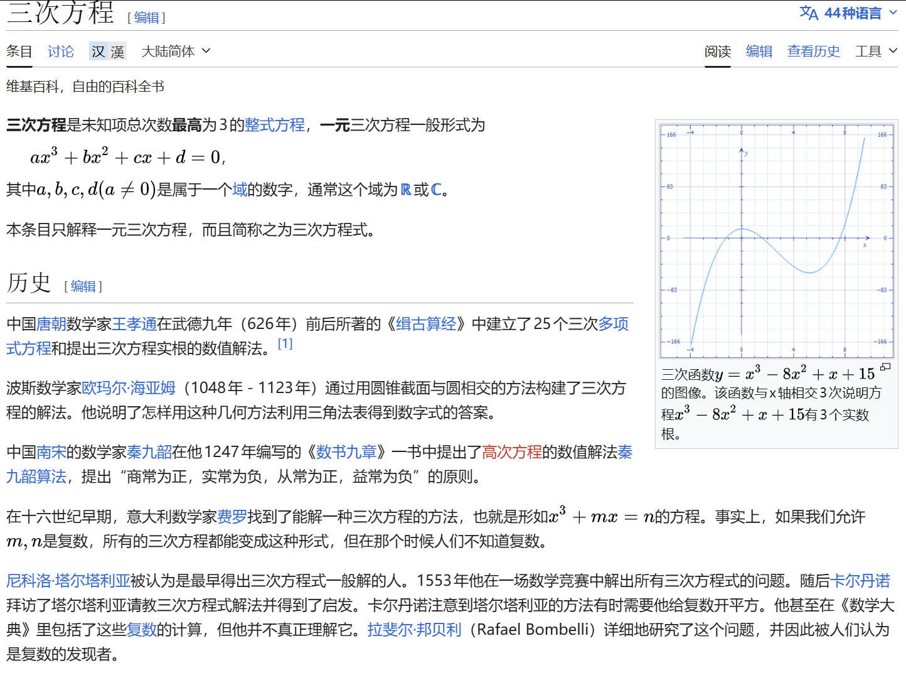

# Common conclusions
We start from an ordinary three-dimensional cubic symmetry:
$$\begin{gathered}
a^3+b^3+c^3-3abc\\
=(a+b+c)(a^2+b^2+c^2-ab-bc-ca)\\
=\frac{1}{2}(a+b+c)[(a-b)^2+(b-c)^2+(c-a)^2]
\end{gathered}
$$
In fact, there is a more magical proof method:

Let $a,b,c$ be the three roots of the cubic equation $x^3-(a+b+c)x^2+(ab+bc+ca)x-abc=0$.

$$\begin{gathered}
a^3+b^3+c^3\\
=(a+b+c)(a^2+b^2+c^2)-(ab+bc+ca)(a+b+c)+3abc\\
=(a+b+c)(a^2+b^2+c^2-ab-bc-ca)+3abc
\end{gathered}$$

This proof method is completely consistent with **Newton's Identity** (dig a hole and write about it later).

In short, if $a,b,c\in R,a^3+b^3+c^3-3abc=0$ (※), if and only if $a+b+c=0$ or $a=b=c$.

On the contrary, if $a+b+c=0$, then $a^3+b^3+c^3=3abc$.

Then we can easily know, $a,b,c\in R^+,a^3+b^3+c^3-3abc\ge 0$

Digging a hole here, I will explain it again later using the **General method for cubic inequalities in three variables** in Teacher Ye Jun's book.

# Practical application
In fact, (※) appears frequently in the strong foundation examinations of various colleges and universities:
## Example 1
(2020 Tsinghua Strong Foundation) It is known that the real number $a,b$ satisfies $a^3+b^3+3ab=1$, then the set of all possible values ​​of $a+b$ is $M$, then ()

A. $M$ is a single-element set B. $M$ is a finite set, but not a single-element set

C. $M$ is an infinite set and has a lower bound D. $M$ is an infinite set and has no lower bound

Obviously $a^3+b^3+(-1)^3-3ab(-1)=0$ can only have $a=b=-1$ or $a+b+(-1)=0$, so:

$M=\{-1,2\}$, choose B
## Example 2
(2014 Peking University Comprehensive Camp) Suppose the real number $a,b,c$ satisfies $a+b+c=0,a^3+b^3+c^3=0$, among which $n\in N_+$, find the value of $a^{2n+1}+b^{2n+1}+c^{2n+1}$

$a^3+b^3+c^3=3abc+\frac{1}{2}(a+b+c)[(a-b)^2+(b-c)^2+(c-a)^2]=3abc=0$,so:

$abc=0$, let’s assume $c=0,a+b=0$, then the equation is obviously equal to 0.

## Example 3
(Self-recruited by Peking University in 2016) It is known that for the real number $a$, there is a real number $b,c$ that satisfies $a^3-b^3-c^3=3abc,a^2=2(b+c)$, then the number of such real numbers $a$ is ()

A.1 B.3 C. Infinite D. None of the first three options are correct

Since ※There is $a-b-c=0$ or $a=-b=-c$, the two situations are classified and discussed below:

### Case 1: a=b+c
$a^2=2a$, then $a$ can be 0 or 2

### Case 2: b=c=-a
$a^2=-4a\ge 0$, then $a=-4$

To sum up, choose B

## Example 4
(2019 Tsinghua University Leader) Suppose the real number $x,y$ satisfies $x^3+27y^3+9xy=1$, then ()

A. The maximum value of $x^3y$ is $\frac{1}{3}$ B. The maximum value of $x^3y$ is $\frac{27}{64}$

C. The minimum value of $x^3y$ is $-\frac{\sqrt{3}}{3}$ D. There is no minimum value for $x^3y$

$x^3+(3y)^3+(-1)^3-3x(3y)(-1)=0$, launched $x+3y-1=0$ or $x=3y=-1$
### Case 1: x=3y=-1
$x=-1,y=-\frac{1}{3},x^3y=\frac{1}{3}$
### Case 2:x+3y=1
$x^3(3y)=x^3(1-x)$, obviously there is no minimum value.

Suppose the maximum value is greater than 0, then $x,(1-x)$ has the same sign as $x\in (0,1)$.

$$9x^3y=3x^3(3y)=x^3(3-3x)\le (\frac{3}{4})^4$$

$x^3y\le \frac{9}{256}\lt \frac{1}{3}$

To sum up, choose AD.

## Example 5
(2021 Peking University Winter Vacation Class) Suppose the positive integer $m,n$ satisfies $m^3+n^3+99mn=33^3$, then the number pair (m, n) has () group.

$m^3+n^3+(-33)^3-3mn(-33)=0$
### Case 1: m=n=-33
Contradictory to the condition for positive integers
### Case 2: m+n=33
${(m,n)|m,n\in N^+,m+n=33}={(1,32),(2,31),...,(32,1)}$, 32 groups in total.

---

If you are used to seeing questions with (※) as a condition, let's make "The offensive and defensive momentum easy".
## Example 6
([Zhihu contributor](https://www.zhihu.com/question/8995404954)) Let $a,b,c$ be nonnegative real numbers with $a+b+c=1$. Prove that $a^3+b^3+c^3+3abc \ge \frac{2}{9}$.

$a^3+b^3+c^3+3abc=6abc+(a+b+c)(a+b+c)(a^2+b^2+c^2-ab-bc-ca)=6abc+a^2+b^2+c^2-(ab+bc+ca)$

You cannot scale $(a+b+c)(a^2+b^2+c^2-ab-bc-ca)$ to 0 here, otherwise it will be **excessive scaling**.

$abc$ is on the larger side of the inequality sign, and the original formula is symmetric about $a,b,c$, we consider using the **SPQ method + Schur's inequality**.

Suppose $s=a+b+c,q=ab+bc+ca,p=abc$, then $Schur:s^3-4sq+9p\ge 0,9p\ge 4q-1$

$6abc+a^2+b^2+c^2-(ab+bc+ca)=6p+s^2-3q=6p-3q+1\ge -\frac{1}{3}(q-1)\ge \frac{2}{9}$

This is equivalent to $q\le \frac{1}{3}$, given by the AM-GM inequality $3q\le s^3=1$, Q.E.D.
## Example 7
(U.S. Mathematics Competition) Prove: For any three **prime numbers** that are **not equal to each other**, their cube root **cannot** be one of the three terms of the **arithmetic sequence**.

Proof by contradiction: Suppose the three prime numbers are $p_1<p_2<p_3$ and assume $\frac{\sqrt[3]{p_2}-\sqrt[3]{p_1}}{k}=\frac{\sqrt[3]{p_3}-\sqrt[3]{p_2}}{l},k,l\in N^*$, then:

$l\sqrt[3]{p_1}-(k+l)\sqrt[3]{p_2}+k\sqrt[3]{p_3}=0$

$(l\sqrt[3]{p_1})^3+(k\sqrt[3]{p_3})^3+[-(k+l)(\sqrt[3]{p_2})]^3=l^3p_1+k^3p_3-(k+l)^3p_2=-3lk(k+l)(\sqrt[3]{p_1})(\sqrt[3]{p_2})(\sqrt[3]{p_3})$

The left hand side is an integer, so $\sqrt[3]{p_1 p_2 p_3}$ must be a rational number (note the coefficient on the right $3lk(k+l)\neq 0$).

But $\sqrt[3]{p_1 p_2 p_3}$ is an irrational number: if $\sqrt[3]{p_1 p_2 p_3} = \dfrac{q}{r}$ ($\gcd(q,r)=1$), then $r^3 p_1 p_2 p_3 = q^3$. From this, $p_1 \mid q^3$, because $p_1$ is a prime number, so $p_1 \mid q$, suppose $q = p_1 q'$, and substitute it to get $r^3 p_2 p_3 = p_1^2 q'^3$, so $p_1 \mid r^3$, and then $p_1 \mid r$, contradicts $\gcd(q,r)=1$.

Q.E.D

## Example 8
If $abc\neq 0,a+b+c=0$, find $a(\frac{1}{b}+\frac{1}{c})+b(\frac{1}{c}+\frac{1}{a})+c(\frac{1}{a}+\frac{1}{b})$.

Original formula= $\frac{a^2(b+c)+b^2(c+a)+c^2(a+b)}{abc}=-\frac{a^3+b^3+c^3}{abc}=-3$

---

## Cubic equation of one variable

Here we introduce a proof of Cardan’s formula for the cubic equation of one variable:
For $ax^3+bx^2+cx+d=0(a\neq 0)$, it can always be transformed into:

$u^3+pu+q=0$

Let $u+v+w=0$:

$u^3+v^3+w^3-3uvw=0$

$\begin{cases}
  v^3+w^3=q,\\
  vw=-\frac{1}{3}p
\end{cases} $

This is equivalent to:

$\begin{cases}
  v^3+w^3=q,\\
  v^3w^3=-\frac{1}{27}p^3
\end{cases} $

That is, $v^3,w^3$ is the two roots of the quadratic equation $t^2-qt-\frac{1}{27}p^3=0$.

Discriminant $\Delta=q^2+\frac{4}{27}p^3$

Considering the symmetry of $v,w$, we might as well let:

$
\Delta\geq 0\begin{cases}
v^3=\frac{q+\sqrt{\Delta}}{2},\\
w^3=\frac{q-\sqrt{\Delta}}{2}
\end{cases}\\
\Delta\lt 0\begin{cases}
v^3=\frac{q+\sqrt{-\Delta}i}{2},\\
w^3=\frac{q-\sqrt{-\Delta}i}{2}
\end{cases} $

For the convenience of writing, we will not distinguish between $\sqrt{-\Delta}$ and $\sqrt{\Delta}i$ below.

Constrained by **De Moivre's formula** and $vw=-\frac{1}{3}p$:

$\begin{cases}
v=\sqrt[3]{\frac{q+\sqrt{\Delta}}{2}},\\
w=\sqrt[3]{\frac{q-\sqrt{\Delta}}{2}}
\end{cases}\begin{cases}
v=\sqrt[3]{\frac{q+\sqrt{\Delta}}{2}}w,\\
w=\sqrt[3]{\frac{q-\sqrt{\Delta}}{2}}w^{-1}
\end{cases}\begin{cases}
v=\sqrt[3]{\frac{q+\sqrt{\Delta}}{2}}w^2,\\
w=\sqrt[3]{\frac{q-\sqrt{\Delta}}{2}}w^{-2}
\end{cases} $

$u=-(v+w)$, so three roots are solved.

According to the symbol of $\Delta=q^2+\frac{4}{27}p^3$, the root situation can be judged:

$$
\begin{cases}
\Delta=0 \text{ and } pq\neq 0: & \text{one double real root and one simple real root} \\
\Delta\gt 0: & \text{one real root and one complex-conjugate pair} \\
\Delta\lt 0: & \text{three distinct real roots} \\
pq=0: & \text{one triple real root}
\end{cases}
$$

### $\Delta < 0$: The case of three real roots ("irreducible case")

### Intuitive confusion

When $\Delta < 0$, $\sqrt{\Delta}$ is an imaginary number, so the cube root of a complex number appears in the expression of $v, w$- **but the end result is three real numbers**. This is the famous casus irreducibilis in history, and Cardano himself was confused by it.

---

### Use trigonometric method to understand

When $\Delta < 0$, it is more intuitive to change the parameterization. At this time $\dfrac{q+\sqrt{-\Delta}i}{2}$ is a complex number, written in polar coordinate form:

$$\frac{q+\sqrt{-\Delta}i}{2} = r e^{i\theta}$$
$$\frac{q-\sqrt{-\Delta}i}{2} = r e^{-i\theta}$$

Among them

$$r = \sqrt{\frac{q^2 - |\Delta|}{4}} = \sqrt{-\frac{p^3}{27}}, \quad \theta = \arctan\frac{\sqrt{-\Delta}}{q}$$

($\Delta < 0$ is $p < 0$, so $r$ is a real number.)

$u_k=-r^{1/3} e^{i(\theta + 2k\pi)/3}+r^{1/3} e^{i(-\theta + 2k\pi)/3}$, $k=0,1,2$, corresponding to three roots:

$$\boxed{u_k = -2\sqrt{-\frac{p}{3}}\cos\left(\frac{1}{3}\arccos\left(\frac{3q}{2p}\sqrt{-\frac{3}{p}}\right) - \frac{2k\pi}{3}\right), \quad k=0,1,2}$$

The three roots are all real numbers because the complex parts exactly cancel when $v+w$ is added.

---

### Why do plural numbers disappear?

The key is that $vw = -p/3$ is a real constraint. $v$ and $w$ are complex conjugates of each other:

$$v = r^{1/3}e^{i\theta/3}, \quad w = \bar{v} = r^{1/3}e^{-i\theta/3}$$

So

$$u = -(v+w) = -2r^{1/3}\cos\frac{\theta}{3} \in \mathbb{R}$$

The other two roots corresponding to $\theta$ are replaced by $\theta + 2\pi$ and $\theta + 4\pi$, which are also real numbers. **Complex numbers are just the "intermediate language" of calculations, and eventually the imaginary parts cancel out. **

---

### Historical significance

The irreducible case proves something important historically: even if the roots of an equation are all real numbers, sometimes it is unavoidable to pass through complex numbers in the derivation. This is one of the important motivations for complex numbers to be taken seriously by mathematicians.

## Conclusion (Gemini)

Through the above derivation and example practice of the classic identity $a^3 + b^3 + c^3 - 3abc$, we can see its core position in dealing with **three-dimensional symmetry**, **relationship between roots of equations**, and **inequality proof** (such as Schur's inequality).

Whether it is the ingenious deformed evaluation in the strong basis plan or the counter-evidence derivation combined with the properties of number theory in the mathematics competition, mastering the two forms of this formula - **factorization type** and **formulation type**, is often the key to breaking the game. I hope that the review of this article can help you to "have formulas in your mind and methods to solve problems" when facing such high-order symmetry problems.

---
