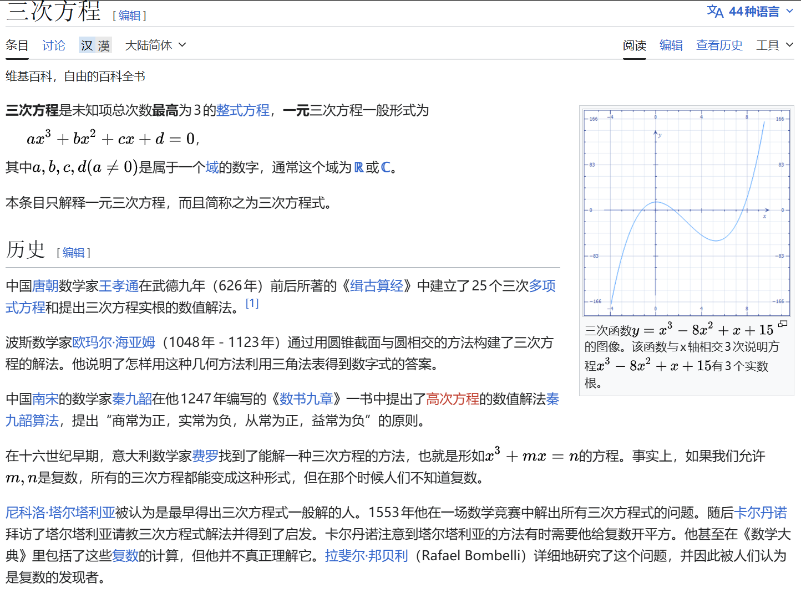

# 常用结论
我们由一个寻常的三元三次对称式出发:
$$\begin{gathered}
a^3+b^3+c^3-3abc\\
=(a+b+c)(a^2+b^2+c^2-ab-bc-ca)\\
=\frac{1}{2}(a+b+c)[(a-b)^2+(b-c)^2+(c-a)^2]
\end{gathered}
$$
其实还有一个比较神奇的证明方法:

设$a,b,c$为一元三次方程$x^3-(a+b+c)x^2+(ab+bc+ca)x-abc=0$的三个根.

$$\begin{gathered}
a^3+b^3+c^3\\
=(a+b+c)(a^2+b^2+c^2)-(ab+bc+ca)(a+b+c)+3abc\\
=(a+b+c)(a^2+b^2+c^2-ab-bc-ca)+3abc
\end{gathered}$$

这种证明方法和**牛顿恒等式**完全一致(挖个坑,以后写).

总之,如果$a,b,c\in R,a^3+b^3+c^3-3abc=0$(※),当且仅当$a+b+c=0$或$a=b=c$.

反之,若$a+b+c=0$,则$a^3+b^3+c^3=3abc$.

那么我们容易知道,$a,b,c\in R^+,a^3+b^3+c^3-3abc\ge 0$

这里挖个坑,以后用叶军老师书中**三元三次不等式的通法**再次解释.

# 实战应用
实际上,(※)在各高校的强基考试中屡屡出现:
## 例一
(2020清华强基)已知实数$a,b$满足$a^3+b^3+3ab=1$,则$a+b$的所有可能值组成的集合为$M$,则()

A.$M$为单元素集 B.$M$为有限集,但不是单元素集

C.$M$为无限集,且有下界  D.$M$为无限集,且无下界

显然$a^3+b^3+(-1)^3-3ab(-1)=0$,只能有$a=b=-1$或$a+b+(-1)=0$,所以:

$M=\{-1,2\}$,选B
## 例二
(2014北大综合营)设实数$a,b,c$满足$a+b+c=0,a^3+b^3+c^3=0$,其中$n\in N_+$,求$a^{2n+1}+b^{2n+1}+c^{2n+1}$的值

$a^3+b^3+c^3=3abc+\frac{1}{2}(a+b+c)[(a-b)^2+(b-c)^2+(c-a)^2]=3abc=0$,所以:

$abc=0$,不妨设$c=0,a+b=0$,则所求式显然等于0.

## 例三
(2016北大自招)已知对于实数$a$,存在实数$b,c$满足$a^3-b^3-c^3=3abc,a^2=2(b+c)$,则这样的实数$a$的个数为()

A.1 B.3 C.无穷个  D.前三个选项都不对

由※有$a-b-c=0$或$a=-b=-c$,下面对两个情况进行分类讨论:

### 情况一:a=b+c
$a^2=2a$,于是$a$可以为0或2

### 情况二:b=c=-a
$a^2=-4a\ge 0$,于是$a=-4$

综上,选B

## 例四
(2019清华领军)设实数$x,y$满足$x^3+27y^3+9xy=1$,则()

A.$x^3y$的最大值为$\frac{1}{3}$ B.$x^3y$的最大值为$\frac{27}{64}$

C.$x^3y$的最小值为$-\frac{\sqrt{3}}{3}$ D.$x^3y$无最小值

$x^3+(3y)^3+(-1)^3-3x(3y)(-1)=0$,推出$x+3y-1=0$或$x=3y=-1$
### 情况一:x=3y=-1
$x=-1,y=-\frac{1}{3},x^3y=\frac{1}{3}$
### 情况二:x+3y=1
$x^3(3y)=x^3(1-x)$,显然无最小值.

不妨设最大值大于0,则$x,(1-x)$同号,$x\in (0,1)$.

$$9x^3y=3x^3(3y)=x^3(3-3x)\le (\frac{3}{4})^4$$

$x^3y\le \frac{9}{256}\lt \frac{1}{3}$

综上,选AD.

## 例5
(2021北大寒假学堂)设正整数$m,n$满足$m^3+n^3+99mn=33^3$,则数对(m,n)有()组.

$m^3+n^3+(-33)^3-3mn(-33)=0$
### 情况一:m=n=-33
与正整数的条件矛盾
### 情况二:m+n=33
${(m,n)|m,n\in N^+,m+n=33}={(1,32),(2,31),...,(32,1)}$,共32组.

---

看惯了以(※)为条件的题目,让"攻守之势易也"吧.
## 例6
([知乎网友](https://www.zhihu.com/question/8995404954))$a,b,c$为非负实数,$a+b+c=1$,求证:$a^3+b^3+c^3+3abc \ge \frac{2}{9}$

$a^3+b^3+c^3+3abc=6abc+(a+b+c)(a+b+c)(a^2+b^2+c^2-ab-bc-ca)=6abc+a^2+b^2+c^2-(ab+bc+ca)$

这里不能把$(a+b+c)(a^2+b^2+c^2-ab-bc-ca)$放缩为0,否则**放缩过度**.

$abc$在不等号较大的一边,且原式关于$a,b,c$对称,我们考虑使用**SPQ法+舒尔不等式**.

设$s=a+b+c,q=ab+bc+ca,p=abc$,则$Schur:s^3-4sq+9p\ge 0,9p\ge 4q-1$

$6abc+a^2+b^2+c^2-(ab+bc+ca)=6p+s^2-3q=6p-3q+1\ge -\frac{1}{3}(q-1)\ge \frac{2}{9}$

这相当于$q\le \frac{1}{3}$,由AM-GM不等式$3q\le s^3=1$,Q.E.D
## 例7
(美国数学竞赛)求证:任意三个**互不相等**的**质数**,其立方根**不可能**为**等差数列**的其中三项.

反证法:设三个质数为$p_1<p_2<p_3$,假设$\frac{\sqrt[3]{p_2}-\sqrt[3]{p_1}}{k}=\frac{\sqrt[3]{p_3}-\sqrt[3]{p_2}}{l},k,l\in N^*$,则:

$l\sqrt[3]{p_1}-(k+l)\sqrt[3]{p_2}+k\sqrt[3]{p_3}=0$

$(l\sqrt[3]{p_1})^3+(k\sqrt[3]{p_3})^3+[-(k+l)(\sqrt[3]{p_2})]^3=l^3p_1+k^3p_3-(k+l)^3p_2=-3lk(k+l)(\sqrt[3]{p_1})(\sqrt[3]{p_2})(\sqrt[3]{p_3})$

左边为整数，故 $\sqrt[3]{p_1 p_2 p_3}$ 必须是有理数（注意右边系数 $3lk(k+l)\neq 0$）。

但 $\sqrt[3]{p_1 p_2 p_3}$ 是无理数： 若 $\sqrt[3]{p_1 p_2 p_3} = \dfrac{q}{r}$（$\gcd(q,r)=1$），则 $r^3 p_1 p_2 p_3 = q^3$。由此 $p_1 \mid q^3$，因 $p_1$ 为质数故 $p_1 \mid q$，设 $q = p_1 q'$，代入得 $r^3 p_2 p_3 = p_1^2 q'^3$，故 $p_1 \mid r^3$，进而 $p_1 \mid r$，与 $\gcd(q,r)=1$ 矛盾。

Q.E.D

## 例8
若$abc\neq 0,a+b+c=0$,求$a(\frac{1}{b}+\frac{1}{c})+b(\frac{1}{c}+\frac{1}{a})+c(\frac{1}{a}+\frac{1}{b})$.

原式=$\frac{a^2(b+c)+b^2(c+a)+c^2(a+b)}{abc}=-\frac{a^3+b^3+c^3}{abc}=-3$

---

## 一元三次方程

这里引入一元三次方程卡尔丹公式的一种证明:
对于$ax^3+bx^2+cx+d=0(a\neq 0)$,总可以通过平移与伸缩化为:

$u^3+pu+q=0$

设$u+v+w=0$:

$u^3+v^3+w^3-3uvw=0$

$\begin{cases}
  v^3+w^3=q,\\
  vw=-\frac{1}{3}p
\end{cases}$

这就相当于:

$\begin{cases}
  v^3+w^3=q,\\
  v^3w^3=-\frac{1}{27}p^3
\end{cases}$

也就是$v^3,w^3$是一元二次方程$t^2-qt-\frac{1}{27}p^3=0$的两根.

判别式$\Delta=q^2+\frac{4}{27}p^3$

考虑$v,w$的对称性,不妨令:

$
\Delta\geq 0\begin{cases}
v^3=\frac{q+\sqrt{\Delta}}{2},\\
w^3=\frac{q-\sqrt{\Delta}}{2}
\end{cases}\\
\Delta\lt 0\begin{cases}
v^3=\frac{q+\sqrt{-\Delta}i}{2},\\
w^3=\frac{q-\sqrt{-\Delta}i}{2}
\end{cases}$

为了书写方便起见,下面不区分$\sqrt{-\Delta}$和$\sqrt{\Delta}i$

由**棣莫弗公式**及$vw=-\frac{1}{3}p$的限制:

$\begin{cases}
v=\sqrt[3]{\frac{q+\sqrt{\Delta}}{2}},\\
w=\sqrt[3]{\frac{q-\sqrt{\Delta}}{2}}
\end{cases}\begin{cases}
v=\sqrt[3]{\frac{q+\sqrt{\Delta}}{2}}w,\\
w=\sqrt[3]{\frac{q-\sqrt{\Delta}}{2}}w^{-1}
\end{cases}\begin{cases}
v=\sqrt[3]{\frac{q+\sqrt{\Delta}}{2}}w^2,\\
w=\sqrt[3]{\frac{q-\sqrt{\Delta}}{2}}w^{-2}
\end{cases}$

$u=-(v+w)$,于是便解出了三个根.

而根据$\Delta=q^2+\frac{4}{27}p^3$的符号,可以判断根的情况:

$$
\begin{cases}
\Delta=0 \text{且} pq\neq 0: & \text{方程有一个两重实根和一个单重实根} \\
\Delta\gt 0: & \text{方程有一个实根和一对共轭虚根} \\
\Delta\lt 0: & \text{方程有三个互异实根} \\
pq=0: & \text{方程有一个三重实根}
\end{cases}
$$

### $\Delta < 0$：三个实根的情形（"不可约情形"）

### 直觉上的困惑

当 $\Delta < 0$ 时，$\sqrt{\Delta}$ 是虚数，于是 $v, w$ 的表达式里出现了复数的立方根——**但最终结果却是三个实数**。这正是历史上著名的**不可约情形(casus irreducibilis)**，卡尔达诺本人也对此感到困惑。

---

### 用三角方法理解

当 $\Delta < 0$ 时，换一种参数化更直观。此时 $\dfrac{q+\sqrt{-\Delta}i}{2}$ 是一个复数，写成极坐标形式：

$$\frac{q+\sqrt{-\Delta}i}{2} = r e^{i\theta}$$
$$\frac{q-\sqrt{-\Delta}i}{2} = r e^{-i\theta}$$

其中

$$r = \sqrt{\frac{q^2 - |\Delta|}{4}} = \sqrt{-\frac{p^3}{27}}, \quad \theta = \arctan\frac{\sqrt{-\Delta}}{q}$$

（$\Delta < 0$ 时 $p < 0$，故 $r$ 是实数。）

$u_k=-r^{1/3} e^{i(\theta + 2k\pi)/3}+r^{1/3} e^{i(-\theta + 2k\pi)/3}$，$k=0,1,2$，对应三个根：

$$\boxed{u_k = -2\sqrt{-\frac{p}{3}}\cos\left(\frac{1}{3}\arccos\left(\frac{3q}{2p}\sqrt{-\frac{3}{p}}\right) - \frac{2k\pi}{3}\right), \quad k=0,1,2}$$

三个根全部是实数，因为复数部分在 $v+w$ 相加时恰好相消。

---

### 为什么复数会消失？

关键在于 $vw = -p/3$ 是实数约束。$v$ 和 $w$ 互为共轭复数：

$$v = r^{1/3}e^{i\theta/3}, \quad w = \bar{v} = r^{1/3}e^{-i\theta/3}$$

所以

$$u = -(v+w) = -2r^{1/3}\cos\frac{\theta}{3} \in \mathbb{R}$$

另外两个根对应 $\theta$ 替换为 $\theta + 2\pi$、$\theta + 4\pi$，同样是实数。**复数只是计算的"中间语言"，最终虚部两两抵消。**

---

### 历史意义

不可约情形在历史上证明了一件重要的事：**即使方程的根全是实数，有时也无法避免在推导过程中经过复数**。这正是推动复数被数学家认真对待的重要动力之一。

## 结语(Gemini)

通过上述对 $a^3 + b^3 + c^3 - 3abc$ 这一经典恒等式的推导与实例演练，我们可以看到它在处理**三元对称式**、**方程根的关系**以及**不等式证明**（如舒尔不等式）中的核心地位。

无论是强基计划中巧妙的变形求值，还是数学竞赛中结合数论性质的反证推导，掌握这一公式的两种形态——**因式分解型**与**配方型**，往往是破局的关键。希望本文的梳理能帮助你在面对此类高次对称问题时，做到“心中有公式，解题有法度”。

---