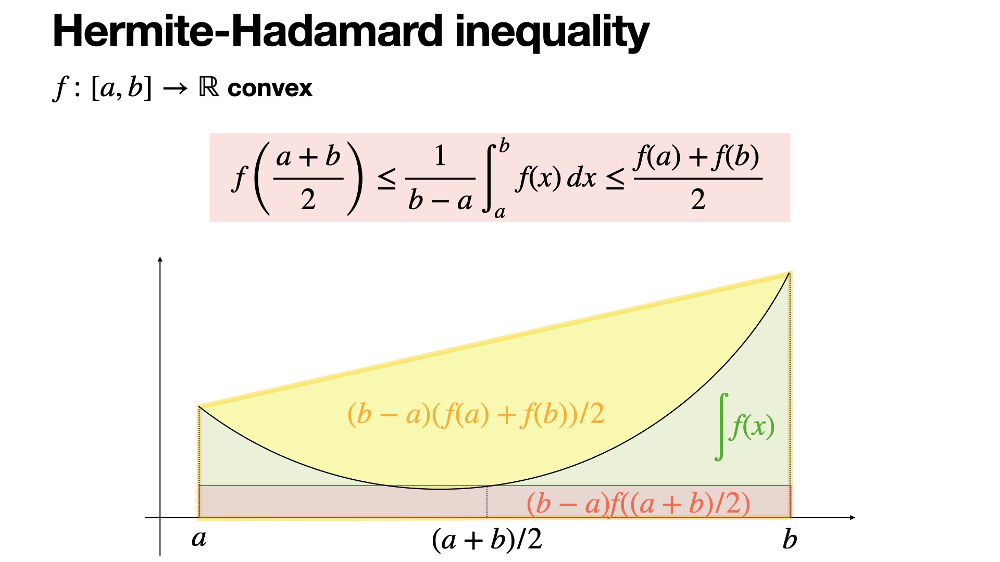

<!--more-->
## Introduction (Hermite-Hadamard)
For convex functions, its geometric characteristics (area) can be used to derive the **Hermite-Hadamard** inequality (hereinafter collectively referred to as the H-H inequality).

$$\begin{gathered}
\boxed{(b-a)f(\frac{a+b}{2})\leq \int_{a}^b f(x)dx\leq (b-a)\frac{f(a)+f(b)}{2}(b\geq a)}
\end{gathered}$$

As shown in P-1, for the convex function $f(x)$, the following correspondence can be made:

### Hermite-Hadamard inequalities geometric correspondence table

| Components of inequalities | Corresponding areas in the figure | Explanation of geometric meaning |
| :--- | :--- | :--- |
| **Left side items:** $(b-a)f\left(\frac{a+b}{2}\right)$| **Red translucent rectangle** (the base is $b-a$, the height is $f(\frac{a+b}{2})$) | **Midpoint rectangle area**: represents the area of the trapezoid surrounded by the tangent line at the midpoint (think about why). Since the function is convex, the tangent is completely under the curve, so the rectangle has the smallest area. |
| **Middle term:** $\int_a^b f(x) dx$| **Green filled area** (the area under the curve $f(x)$) | **Integral average**: represents the actual area under the curve. In the figure, the green area covers the red rectangle but is contained by the outermost yellow trapezoid. |
| **Right-side item: ** $(b-a)\frac{f(a)+f(b)}{2}$| **The entire yellow shaded trapezoid** (below the secant connecting $(a, f(a))$ and $(b, f(b))$) | **Secant trapezoid area**: represents the area enclosed by the secant (chord) connecting the end points of the interval and the $x$ axis. Since the secant of the convex function is located above the curve, its area is the largest. |

We prove this inequality below:

$(b-a)f(\frac{a+b}{2})\leq \int_{a}^b f(x)dx$

Let the original functions of $f(x)$ be $F(x)$, $g(x)=(x-a)f(\frac{x+a}{2})-(F(x)-F(a))(x\geq a)$

$g'(x)=f(\frac{x+a}{2})+\frac{x-a}{2}f'(\frac{x+a}{2})-f(x)$

$g''(x)=f'(\frac{x+a}{2})+\frac{x-a}{4}f''(\frac{x+a}{2})-f'(x)$

Because $f(x)$ is a convex function, $f''(x+a)>0,f'(\frac{x+a}{2})\geq f'(x)$, so $g''(x)\geq 0$.

Also $g'(a)=0\leq g'(x),$ so $g(x)\ge g(a)=0$