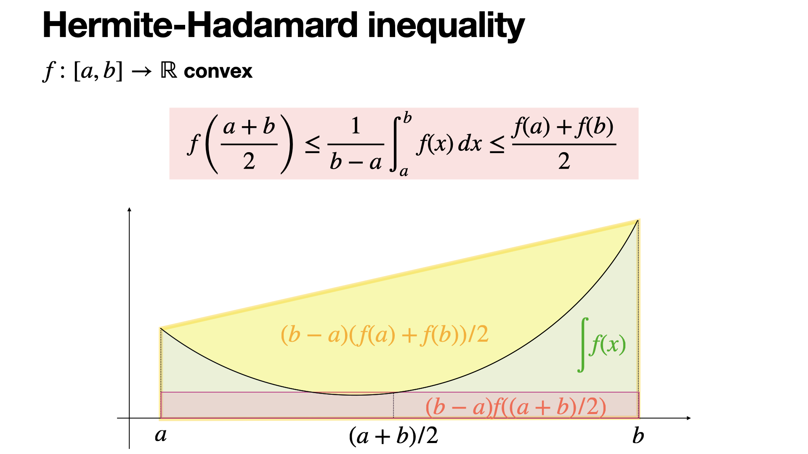

<!--more-->
## 引入(Hermite-Hadamard)
对于凸函数,可以利用其几何特征(面积)推导出**Hermite-Hadamard**不等式(下文统一称为H-H不等式).

$$\begin{gathered}
\boxed{(b-a)f(\frac{a+b}{2})\leq \int_{a}^b f(x)dx\leq (b-a)\frac{f(a)+f(b)}{2}(b\geq a)}
\end{gathered}$$

如P-1所示,对于凸函数$f(x)$,可以做做以下对应:

### Hermite-Hadamard 不等式几何对应关系表

| 不等式组成部分 | 图中对应的面积区域 | 几何意义说明 |
| :--- | :--- | :--- |
| **左侧项：** $(b-a)f\left(\frac{a+b}{2}\right)$ | **红色半透明矩形** (底为 $b-a$, 高为 $f(\frac{a+b}{2})$) | **中点矩形面积**：代表在中点处作切线所围成的梯形面积(想一想为什么)。由于函数是凸的，切线完全位于曲线下方，因此该矩形面积最小。 |
| **中间项：** $\int_a^b f(x) dx$ | **绿色填充区域** (曲线 $f(x)$ 下方的面积) | **积分平均值**：代表曲线下的实际面积。在图中，绿色区域覆盖了红色矩形，但被最外层的黄色梯形所包含。 |
| **右侧项：** $(b-a)\frac{f(a)+f(b)}{2}$ | **整个黄色阴影梯形** (连接 $(a, f(a))$ 与 $(b, f(b))$ 的割线下方) | **割线梯形面积**：代表连接区间端点的割线（弦）与 $x$ 轴围成的面积。由于凸函数的割线位于曲线之上，其面积最大。 |

我们下面证明这个不等式:

$(b-a)f(\frac{a+b}{2})\leq \int_{a}^b f(x)dx$

设$f(x)$的原函数为$F(x)$,$g(x)=(x-a)f(\frac{x+a}{2})-(F(x)-F(a))(x\geq a)$

$g'(x)=f(\frac{x+a}{2})+\frac{x-a}{2}f'(\frac{x+a}{2})-f(x)$

$g''(x)=f'(\frac{x+a}{2})+\frac{x-a}{4}f''(\frac{x+a}{2})-f'(x)$

因为$f(x)$为凸函数,$f''(x+a)>0,f'(\frac{x+a}{2})\geq f'(x)$,所以$g''(x)\geq 0$.

又$g'(a)=0\leq g'(x),$故$g(x)\ge g(a)=0$

## 另一种证法（Claude 补充）

> 本节由 Claude（Anthropic 开发的 AI 模型）补充，附在作者解答之后，并非原作者所写。

**先指出上面证明中的一处问题。** $f$ 为凸函数时 $f'$ 单调递增，而 $\frac{x+a}{2}\le x$，所以应是 $f'\!\left(\frac{x+a}{2}\right)\le f'(x)$，与文中写的方向相反，$g''(x)\ge0$ 因而得不到。另外，要证的是 $(x-a)f\!\left(\frac{x+a}{2}\right)\le F(x)-F(a)$，即 $g(x)\le0$，而不是 $g(x)\ge0$。

**不用导数的证法。** 只用凸性的定义，两侧可以一起证明。记 $m=\frac{a+b}{2}$，$h=\frac{b-a}{2}$。

左侧：凸性给出 $f(m-t)+f(m+t)\ge 2f(m)$，于是

$$
\int_a^b f(x)\,dx=\int_0^{h}\bigl[f(m-t)+f(m+t)\bigr]dt\ \ge\ 2h\,f(m)=(b-a)f\!\left(\tfrac{a+b}{2}\right).
$$

右侧：令 $x=a+s(b-a)$，$s\in[0,1]$，凸性给出 $f(x)\le(1-s)f(a)+sf(b)$，于是

$$
\int_a^b f(x)\,dx=(b-a)\int_0^1 f\bigl(a+s(b-a)\bigr)ds\ \le\ (b-a)\int_0^1\bigl[(1-s)f(a)+sf(b)\bigr]ds=(b-a)\frac{f(a)+f(b)}{2}.
$$

这个证法不要求 $f$ 可导，也正好对应图中的两层含义：左侧是“关于中点对称的两点平均值不小于中点值”，右侧是“弦在曲线上方”。
