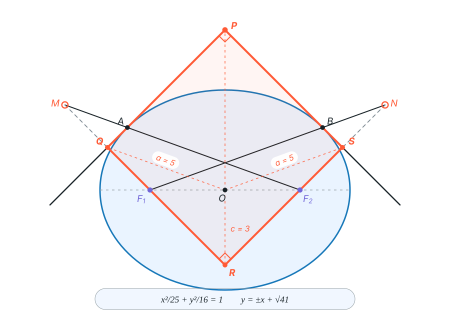
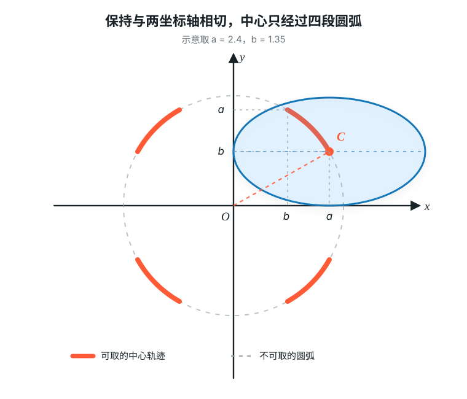

# Intro

法国数学家[加斯帕尔·蒙日](https://zh.wikipedia.org/wiki/加斯帕尔·蒙日)发现：与椭圆$\frac{x^2}{a^2}+\frac{y^2}{b^2}=1$相切的两条垂直切线的交点的轨迹方程是$x^{2}+y^{2}=a^{2}+b^{2}$。这一结论被称为蒙日圆。

# Prove

## Plan Mode

如何考虑直线与椭圆相切?

最显然的想法是让直线与椭圆联立所得一元二次方程判别式为0.

如何考虑两条直线垂直?

可以算出两条直线分别对应的斜率$k_1,k_2$,让$k_1k_2=-1$.

同时,还应该考虑斜率不存在的情况.

## Goal Mode

设两垂直直线的公共点为$P(x_0,y_0)$,直线方程为$y=k(x-x_0)+y_0=kx+(y_0-kx_0)$

联立椭圆$\frac{x^2}{a^2}+\frac{y^2}{b^2}=1$与直线:

$$b^2x^2+a^2y^2=a^2b^2\\
b^2x^2+a^2[kx+(y_0-kx_0)]^2=a^2b^2\\
(a^2k^2+b^2)x^2+2a^2k(y_0-kx_0)x+a^2[(y_0-kx_0)^2-b^2]=0\\
\Delta=4a^4k^2(y_0-kx_0)^2-4(a^4k^2+a^2b^2)[(y_0-kx_0)^2-b^2]=0\\
a^2k^2(y_0-kx_0)^2-(a^2k^2+b^2)[(y_0-kx_0)^2-b^2]=0\\
a^2b^2k^2-b^2(y_0-kx_0)^2+b^4=0\\
a^2k^2-(y_0-kx_0)^2+b^2=0\\
(a^2-x_0^2)k^2+2x_0y_0k+(b^2-y_0^2)=0$$

最后得到了关于$k$的一元二次方程:

$$\boxed{(a^2-x_0^2)k^2+2x_0y_0k+(b^2-y_0^2)=0}$$

要求$k_1k_2=\frac{a^2-x_0^2}{b^2-y_0^2}=-1$,即$x_0^2+y_0^2=a^2+b^2$.

因此,我们可以说明,满足条件的点轨迹几乎是一个圆.

对于斜率不存在的**corner case**,我们应加以讨论:

当其中一条直线斜率不存在时,另一条直线斜率为$0$,这给出$(a,b),(a,-b),(-a,b),(-a,-b)$四个点.

经检验,四个点悉数满足$x^2+y^2=a^2+b^2$.

因此,满足条件的点轨迹为以原点为圆心,$\sqrt{a^2+b^2}$为半径的圆.

## Alternative

一个惊人的想法是,使用椭圆的光学性质,构建一个以$P(x_0,y_0)$为顶点的矩形.

设两条切线与椭圆分别相切于$A,B$.将左焦点$F_1$关于$PA$对称到点$M$,将右焦点$F_2$关于$PB$对称到点$N$.根据椭圆的光学性质,$F_2,A,M$与$F_1,B,N$分别三点共线,且

$$F_2M=F_1N=2a.$$

连接$F_1M$交$PA$于点$Q$,连接$F_2N$交$PB$于点$S$,再延长二者交于点$R$.

因为$Q,S$分别是$F_1M,F_2N$的中点,$O$是$F_1F_2$的中点,由中位线定理知:

$$OQ=\frac12F_2M=a,\qquad OS=\frac12F_1N=a.$$

又因为$PA\perp PB$,所以$PQRS$是矩形,$\angle F_1RF_2=90^\circ$.在直角三角形$F_1RF_2$中,$O$是斜边$F_1F_2$的中点,故

$$OR=\frac12F_1F_2=c.$$

应用熟知的矩形几何结论:

$$OP^2+OR^2=OQ^2+OS^2\\
OP^2=2a^2-c^2=a^2+b^2.$$

同样,我们又得到了圆的半径$OP=\sqrt{a^2+b^2}$

# Practice

(上海交通大学)对于两条**互相垂直**的直线和一个**椭圆**,已知椭圆无论如何滑动都与两条直线**相切**,求椭圆中心的轨迹.

设两条互相垂直的直线为$x,y$轴,其交点为原点$O$,椭圆半长轴为$a$,半短轴为$b$,椭圆中心$C(x,y)$.

此题恰是蒙日圆的反问题:已知蒙日圆的一切条件,但是椭圆中心为定点.

类似的,我们可以得到$OC=\sqrt{a^2+b^2}$,但是切忌不能认为点C的轨迹为一个正圆:

点C不能取到圆上的所有点,因为有些点会让椭圆$C$与两条坐标轴必然无法相切.

我们更细化分析临界条件:椭圆中心$C$到坐标轴的最近情况.

设长度为$a$的半轴与$x$轴的夹角为$\theta$,则椭圆中心到两条坐标轴的距离分别为

$$|x_C|=\sqrt{a^2\cos^2\theta+b^2\sin^2\theta},\qquad
|y_C|=\sqrt{a^2\sin^2\theta+b^2\cos^2\theta}.$$

二者的平方和恒为$a^2+b^2$,但每个距离都不能小于椭圆的较短半轴.下图中,椭圆在第一象限内保持与两坐标轴相切,点$C$描出的橙色圆弧即为轨迹的一部分;其余三段由对称性得到.

因此,椭圆中心$C$的轨迹为:

$$\boxed{x^2+y^2=a^2+b^2,\quad |x|,|y|\ge\min\{a,b\}}$$
