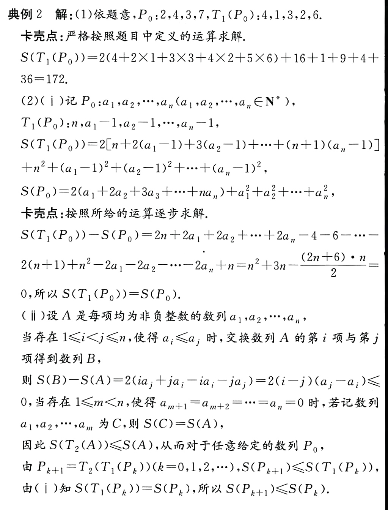
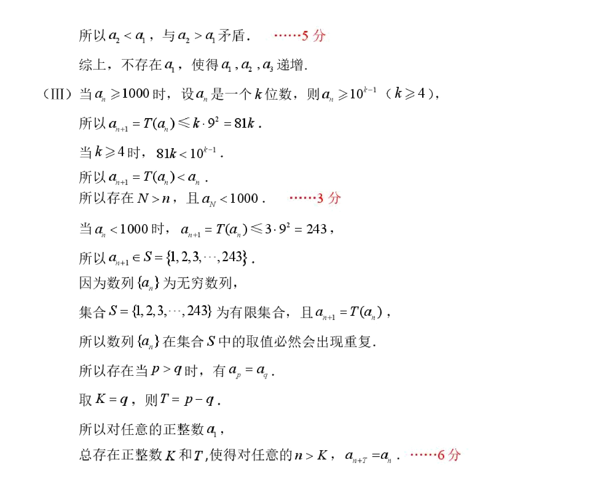

(2024·Xuzhou Simulation) For the sequence $P:a_1,a_2,\cdots,a_n$ where each item is a positive integer, define transformations $T_1$ and $T_1$ to transform the sequence $P$ into the sequence $T_1(P):n,a_1-1,a_2-1,\cdots,a_n-1$. For the sequence $Q:b_1,b_2,\cdots,b_m$ in which each item is a non-negative integer, define $S(Q)=2(b_1+2b_2+\cdots+mb_m)+b_1^2+b_2^2+\cdots+b_m^2$, define transformations $T_2$, $T_2$ Arrange the items in the sequence $Q$ from large to small**, and then **remove all zero items** to obtain the sequence $T_2(Q)$.
<!--more-->
(1) If the sequence $P_0$ is $2,4,3,7$, find the value of $S(T_1(P_0))$.

(2) For the finite sequence $P_0$ where each item is a positive integer, let $P_{k+1}=T_2(T_1(P_k))$, $k\in\mathbb{N}$.

(i) Explore the relationship between $S(T_1(P_0))$ and $S(P_0)$;

(ii) Proof: $S(P_{k+1})\leq S(P_k)$.

(1) $T_1(P_0):4,1,3,2,6$, $S(T_1(P_0))=2(1\times 4+2\times 1+3\times 3+4\times 2+5\times 6)+4^2+1^2+3^2+2^2+6^2=2\times 53+66=172$

(2)(i)

$$\begin{gathered}
  S(T_1(P_0))\\=2[n+2(a_1-1)+3(a_2-1)+...+(n+1)(a_n-1)]+n^2+\sum_{i=1}^n(a_i-1)^2
  \\=2[n-\frac{n(n+3)}{2}]+n^2+n+2(a_1+2a_2+...+na_n)+2(a_1+a_2+...+a_n)+\sum_{i=1}^na_i^2-2(a_1+a_2+...+a_n)
  \\=2(a_1+a_2+...+a_n)+\sum_{i=1}^na_i^2
  \\=S(P_0)
\end{gathered}$$

(ii)

From (i) we know: $S(T_1(P_0))=S(P_0)$, only $T_2$ causes $S$ to become smaller:

Proof below: $S(T_2(A))\lt S(A)$.

The $T_2$ operation** will not change the size of the sum of squares**, but putting the large number in the front will have a smaller coefficient; putting the small number in the back will have a larger coefficient, which is equivalent to a smaller **reverse sum**.

>[!TIP] Pay attention to the operation sequence of $T_2$
>Arrange the terms in the sequence $Q$ from large to small**, and then **remove all zero terms**

Although the final results of **Remove zeros first** and **Sort first** are the same, this order can assist us in the writing process.

The answer is relatively normal, which is equivalent to proving the *sorting inequality*

Why is it more difficult to write **remove zeros first**? Because if **remove zeros first**, if there are 0s in the middle, then the value of $S$ may be adapted. And **sort first** makes 0s at the end, and removing zeros does not affect $S$.

Finally, I’ll add one more question, taken from the 2026 Beijing No. 2 Middle School Grade 2 (Part 2) Grade 4 exam:

(III) Prove that for any finite sequence $A_0$ whose terms are positive integers, there exists a positive integer $K$ such that $\text{when }k\ge K,\ S(A_{k+1})=S(A_k)$.

>[!TIP]
>Consider the boundedness, monotonicity and discreteness of S

(21) (2025 Daxing) (15 points for this question)

For a positive integer $n$, define $T(n)$ as the sum of the squares of each digit of $n$. It is known that the infinite sequence $\{a_n\}$ satisfies: $a_1$ is a positive integer, and for any $n \in \mathbb{N}^*$, $a_{n+1} = T(a_n)$.

(I) If $a_1 = 2$, find the value of $a_2,a_3,a_4,a_5$;

(II) If $a_1$ is a three-digit number, is there $a_1$ such that $a_1,a_2,a_3$ is incremented? If it exists, find all the values of $a_1$ that meet the conditions; if it does not exist, explain the reason;

(III) Prove: For any positive integer $a_1$, there are always positive integers $K$ and $T$, such that for any $n > K$, $a_{n+r} = a_n$.

(III) of the two questions are exactly the same, both making use of **discreteness** and **boundedness**, leaving it to the readers to think for themselves.
