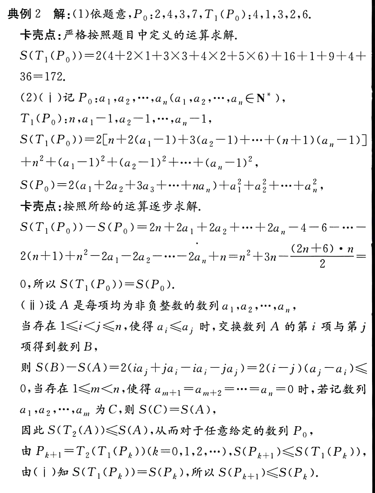
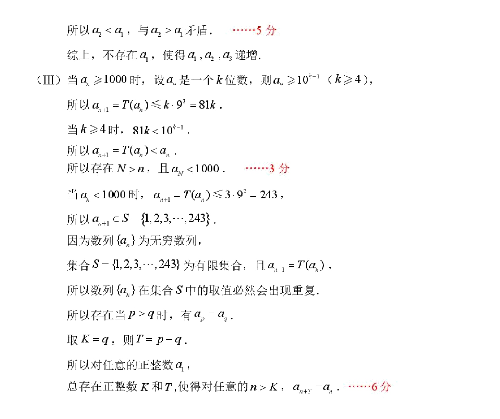

（2024·徐州模拟）对于每项均是正整数的数列 $P:a_1,a_2,\cdots,a_n$，定义变换 $T_1$，$T_1$ 将数列 $P$ 变换成数列 $T_1(P):n,a_1-1,a_2-1,\cdots,a_n-1$。对于每项均是非负整数的数列 $Q:b_1,b_2,\cdots,b_m$，定义 $S(Q)=2(b_1+2b_2+\cdots+mb_m)+b_1^2+b_2^2+\cdots+b_m^2$，定义变换 $T_2$，$T_2$ 将数列 $Q$ 中的项**从大到小排列**，然后**去掉所有为零的项**，得到数列 $T_2(Q)$。
<!--more-->
（1）若数列 $P_0$ 为 $2,4,3,7$，求 $S(T_1(P_0))$ 的值。

（2）对于每项均是正整数的有穷数列 $P_0$，令 $P_{k+1}=T_2(T_1(P_k))$，$k\in\mathbb{N}$。

（i）探究 $S(T_1(P_0))$ 与 $S(P_0)$ 的关系；

（ii）证明：$S(P_{k+1})\leq S(P_k)$。

(1) $T_1(P_0):4,1,3,2,6$,$S(T_1(P_0))=2(1\times 4+2\times 1+3\times 3+4\times 2+5\times 6)+4^2+1^2+3^2+2^2+6^2=2\times 53+66=172$

(2)(i)

$$\begin{gathered}
  S(T_1(P_0))\\=2[n+2(a_1-1)+3(a_2-1)+...+(n+1)(a_n-1)]+n^2+\sum_{i=1}^n(a_i-1)^2
  \\=2[n-\frac{n(n+3)}{2}]+n^2+n+2(a_1+2a_2+...+na_n)+2(a_1+a_2+...+a_n)+\sum_{i=1}^na_i^2-2(a_1+a_2+...+a_n)
  \\=2(a_1+a_2+...+a_n)+\sum_{i=1}^na_i^2
  \\=S(P_0)
\end{gathered}$$

(ii)

由(i)知:$S(T_1(P_0))=S(P_0)$,只能是$T_2$导致了$S$变小:

下面证明:$S(T_2(A))\lt S(A)$.

$T_2$操作**不会改变平方和的大小**,但是让大的数放到了前面,拥有了较小的系数;让小的数放到后面,拥有了较大的系数,相当于变成了较小的**逆序和**.

>[!TIP] 注意$T_2$的操作顺序
>将数列 $Q$ 中的项**从大到小排列**，然后**去掉所有为零的项**

虽然**先去零**和**先排序**最后的结果是一样的,但是这个先后顺序可以辅助我们书写过程.

答案还算比较正常,相当于证明了*排序不等式*

为什么**先去零**书写更加困难?因为如果**先去零**,假如中间有0,那么$S$的值可能会改编.而**先排序**使得0都在末尾,去零不影响$S$.

最后再加一问,来自于2026北京二中高二(下)四学段段考:

(III)证明:对于任意给定的每项均为正整数的有穷数列$A_0$,存在正整数$K,\text{当}k\ge K\text{时,}S(A_{k+1})=S(A_k)$

>[!TIP]
>考虑S的有界性,单调性与离散性

（21）(2025大兴)（本小题15分）

对于正整数 $n$，定义 $T(n)$ 为 $n$ 的各位数字的平方和. 已知无限数列 $\{a_n\}$ 满足：$a_1$ 为正整数，且对于任意的 $n \in \mathbb{N}^*$，$a_{n+1} = T(a_n)$.

（I）若 $a_1 = 2$，求 $a_2,a_3,a_4,a_5$ 的值；

（II）若 $a_1$ 是一个三位数，是否存在 $a_1$，使得 $a_1,a_2,a_3$ 递增？若存在，求出所有满足条件的 $a_1$ 的值；若不存在，说明理由；

（III）证明：对任意的正整数 $a_1$，总存在正整数 $K$ 和 $T$，使得对任意的 $n > K$，$a_{n+r} = a_n$.

两道题的(III)如出一辙,都利用了**离散性**与**有界性**,留给读者自行思考.