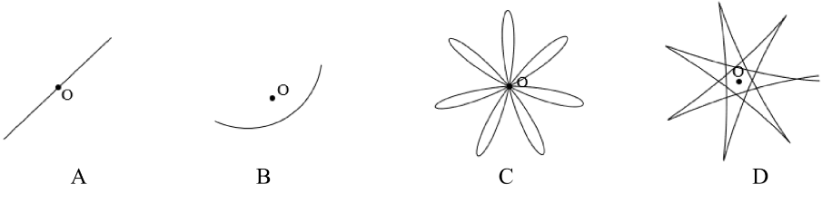

前五道选择题难度较低，这里只给出答案.

1. 正午阳光灿烂，小池塘中一片树叶静浮在平静的水面上。池塘水深 $1\,\mathrm{m}$，池底水平。水的折射率为 $\frac{4}{3}$。在太阳从树叶正上方经过的瞬间，树叶的影子在池底的移动速度大小最接近

A. $55\,\mu\mathrm{m/s}$  
B. $73\,\mu\mathrm{m/s}$  
C. $3.1\,\mathrm{mm/s}$  
D. $4.2\,\mathrm{mm/s}$

正确答案:A

2. 一种新型用于癌症治疗的硼中子俘获疗法的原理是：先使含硼的药物富集于肿瘤细胞，然后用热中子照射肿瘤区域；硼俘获热中子发生核反应

$$
{}^{10}_{5}\mathrm{B} + {}^{1}_{0}\mathrm{n} \xrightarrow{} {}^{7}_{3}\mathrm{Li} + {}^{4}_{2}\mathrm{He}
$$

产生的 ${}^{7}_{3}\mathrm{Li}$ 核和 ${}^{4}_{2}\mathrm{He}$ 核能杀伤肿瘤细胞。假设反应前 ${}^{10}_{5}\mathrm{B}$ 核静止，热中子动能可忽略，反应产物的速度远小于光速 $c$；中子和各相应原子的质量如表 2a 所示。已知原子质量单位 $1\,\mathrm{u} = 931.5\,\mathrm{MeV}/c^2$。反应产生的 ${}^{4}_{2}\mathrm{He}$ 核的动能最接近

表 2a

| 粒子种类  | ${}^{10}_{5}\mathrm{B}$ | ${}^{1}_{0}\mathrm{n}$ | ${}^{7}_{3}\mathrm{Li}$ | ${}^{4}_{2}\mathrm{He}$ |
| --------- | ----------------------- | ---------------------- | ----------------------- | ----------------------- |
| 质量（u） | 10.0129                 | 1.0087                 | 7.0160                  | 4.0026                  |

A. $1.01\,\mathrm{MeV}$  
B. $1.27\,\mathrm{MeV}$  
C. $1.78\,\mathrm{MeV}$  
D. $2.79\,\mathrm{MeV}$

正确答案:C

3. 一固定在水平面上的圆柱形水杯下端侧面有一小孔，小孔面积是水杯横截面积的 $\frac{1}{n}$（$n \gg 1$）倍。重力加速度大小为 $g$。打开小孔。水流稳定时，杯中水的质量为 $m$。此时水杯受到水平流出的水的作用力（以水刚流出的方向为正方向）为

A. $-\dfrac{2mg}{n}$  
B. $\dfrac{2mg}{n}$  
C. $-\dfrac{mg}{n}$  
D. $\dfrac{mg}{n}$

正确答案:A

4. 一带正电荷的小球用不可伸长的绝缘细线悬挂于固定点，整个装置置于竖直向下的足够强的匀强磁场中。现将小球拉离平衡位置 O 点，由静止释放，小球开始摆动。从悬挂点正上方俯视，下列关于小球运动轨迹的图示中，可能正确的是

小球在磁场中运动，受到垂直运动方向的洛伦兹力，不可能是轨迹A;

如果轨迹B正确，那么小球会在曲线上往返运动（静止将导致矛盾），则往和返的过程中速度方向相反，所受洛伦兹力相反，不可能都指向曲线凹侧，故矛盾;

5. 人类在 2015 年首次探测到了双黑洞并合产生的引力波。记双黑洞的质量分别为 $M$ 和 $m$，它们以角速度 $\omega$ 绕其质心做圆周运动，双黑洞引力辐射功率为

$$P=k \frac{G^{\alpha} \omega^{\beta}}{c^{\gamma}} \cdot \frac{(M m)^{2}}{(M+m)^{2 / 3}}$$

式中 $c$ 为真空中的光速，$G$ 为引力常量，$k$ 为无量纲常数。指数 $\alpha$、$\beta$、$\gamma$ 应满足

A. $2 \alpha+\beta-\gamma=3$

B. $3 \alpha-\gamma=2$

C. $3 \alpha+\beta-2 \gamma=1$

D. $\alpha=\frac{7}{3}$

正确答案:ABD

二、填空题

6. 一块小石头竖直下落到水里，在水面形成以落点为圆心的若干个圆形水波向外传播。记水波的波长为 $\lambda$，周期为 $T$，传播速度为 $v$，三者满足关系式 $\underline{\hspace{2cm}}$。现以相同高度、相等的时间间隔 $\Delta t$，在一条直线上间距为 $d$ 的各点处依次由静止释放小石子，会在水面依次激发多个水面波，如图 6a 所示。在满足 $\Delta t<\frac{d}{v}$ 的条件下，它们向外传播，其波前的公切线如图 6a 中的长虚线所示。已知此水面波的波速与周期还满足关系 $2 \pi v=g T$，其中 $g$ 为重力加速度的大小。设该公切线在水面上的法向与石子连线的夹角为 $\theta$，则 $\cos \theta$ 为 $\underline{\hspace{2cm}}$（用 $\Delta t$、$d$、$\lambda$、$g$ 表示）。

正确答案:

$$T=\frac{\lambda}{v},\frac{\Delta t}{d}\sqrt{\frac{g\lambda}{2\pi}}$$

7. 将地球表面附近的空气视为稳定分布的理想气体。考虑高度差为 $\Delta z$ 的一层空气，其顶部和底部的压强差为 $\Delta p$，记此层内空气的平均温度为 $T$，平均压强为 $p$，平均摩尔质量为 $\mu$，重力加速度大小为 $g$，摩尔气体常量为 $R$，则 $\frac{\Delta p}{\Delta z}=$ ______。若不同高度的空气之间没有热传递，则在所考虑的空气层的顶部和底部的温度差随相应的压强差的变化满足关系 $\Delta T=\alpha \frac{T}{p} \Delta p$。取 $g=9.8 \mathrm{~m} \cdot \mathrm{s}^{-2}, \alpha=\frac{2}{7}, R=8.31 \mathrm{~J} \cdot \mathrm{K}^{-1} \cdot \mathrm{mol}^{-1}$，$\mu=29 \mathrm{~g} \cdot \mathrm{mol}^{-1}$，由此估算每上升 $1.0 \mathrm{~km}$，空气温度下降 ______ $\mathrm{K}$（结果保留两位有效数字）。

8. 某智能快充系统可简化为如图 8a 所示的电路，其中电源电动势恒为 $E$，内阻为 $r$，电阻 $R$ 的阻值由快充系统实时调节，以优化充电过程。被充电的电池可等效为电容 $C$ 与电阻 $R_{0}\left(R_{0}=r\right)$ 的串联组合。系统内置有恒流、恒功率两种充电模式。设电容初始电压为零。若采用恒流模式充电，始终保持回路电流 $I_{0}=\frac{E}{4 r}$ 不变，则电容电压从 0 充到 $\frac{E}{2}$ 所需的时间为 ______；若采用恒功率模式充电，使电容充电功率始终不变，则充电过程中回路电流随电容电压 $U_{C}$ 增大而 ______（填“增大”、“减小”或“不变”），且该模式无法从 $U_{C}=0$ 开始实施。

9. 如图 9a，水平面内固定有两根足够长的光滑平行导轨，导轨间距为 $d$，电阻不计；导轨左端接入两个单刀双掷开关 $S_{1} 、 S_{2}$，在电容器和线圈之间串联一理想二极管，在线圈和电源之间串联一电阻；导轨置于竖直向下的匀强磁场中，磁感应强度大小为 $B$；一电阻不可忽略的导体棒静止置于导轨上，且与导轨垂直。初始时，$S_{1}$ 拨向 $\mathrm{a}, S_{2}$ 在 $\mathrm{c} 、 \mathrm{~d}$ 之间来回切换足够多次后，将 $S_{1}$ 拨向 $\mathrm{b}$，则导体棒将沿导轨开始向 ______（填“左”或“右”）运动。若导体棒在运动过程中所受空气阻力与速度成正比，比例系数为 $k$，测得导体棒在导轨上运动的总路程为 $x$，可知在 $S_{1}$ 拨向 $\mathrm{b}$ 的瞬间，电容器上的电荷量为 ______。

10. 如图 10a，置于粗糙斜面上的物块 $\mathrm{A}$ 与置于粗糙水平面上的物块 $\mathrm{B}$，由不可伸长的轻绳跨过**轻质光滑滑轮组**相连，物块 $\mathrm{C}$ 挂在动滑轮下端；整根轻绳处于斜面的正截面内，斜面上的绳与斜面平行，动滑轮两侧的绳沿坚直方向，水平面上的绳水平。已知 $\mathrm{A} 、 \mathrm{~B}$ 和 $\mathrm{C}$ 的质量分别为 $m 、 4 m$ 和 $4 m ; \mathrm{A}$所在斜面的倾角为 $30^\circ$，A 与斜面间的动摩擦因数为 $\frac{\sqrt{3}}{5}$；B 与水平面间的动摩擦因数为 $\frac{1}{5}$，重力加速度大小为 $g$。初始时用外力使系统保持静止，绳处于张紧状态；撤除外力，当 C 由静止下落高度 $h$ 时，A 的位移大小为________，轻绳的张力大小为________。A、B 在运动过程中均未与定滑轮碰撞。

设轻绳张力为$T$，运用牛顿第二定律列出方程:

$$\begin{cases}ma_A=T-\frac12mg-\frac{3}{10}mg\\
4ma_B=T-\frac45mg\\
4ma_C=4mg-2T\end{cases}$$

方程组里有$a_A,a_B,a_C,T$四个未知数，还缺一个关联运动约束:

$$a_A+a_B=2a_C\\
(T-\frac{4}{5}mg)+\frac14(T-\frac45mg)=\frac12(4mg-2T)\\
\frac94T=3mg\\
T=\frac43mg$$

带入牛顿第二定律方程:

$$a_A=\frac8{15}g\\
a_C=\frac13g\\
\frac{x_A}{h}=\frac{a_A}{a_C}=\frac85\\
x_A=\frac85h$$
