<!--more-->
## Pick up flowers in the morning and evening
Prove: If three matter points with mass $m_1,m_2,m_3$ form a stable rotational shape (all perform circular motion with the same period), and if the three are **not collinear**, then $m_1,m_2,m_3$ forms an **equilateral triangle**.

Taking the center of mass as the center and changing the rotation system, $m_1,m_2,m_3$ is at rest.

Introducing inertial centrifugal force:

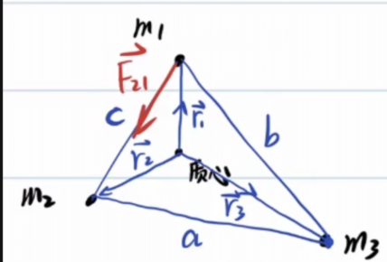
$$\begin{gathered}
\vec{r_c}=\frac{\sum m_i\vec{r_i}}{\sum m_i}=\vec{0}\\
\vec{F_{12}}=G\frac{m_1m_2}{c^2}(\vec{r_2}-\vec{r_1})\frac{1}{c}\\
=G\frac{m_1m_2}{c^3}(\vec{r_2}-\vec{r_1})\\
\vec{F_{13}}=G\frac{m_1m_2}{c^2}(\vec{r_2}-\vec{r_1})\frac{1}{c}\\
=G\frac{m_1m_2}{b^3}(\vec{r_3}-\vec{r_1})\\
\vec{F_{\text{inertial},1}}=m_1w^2\vec{r_1}\\
\Rightarrow \begin{cases}G\frac{m_1m_2}{c^3}(\vec{r_2}-\vec{r_1})+G\frac{m_1m_2}{b^3}(\vec{r_3}-\vec{r_1})+m_1w^2\vec{r_1}=0,\\
\vec{r_3}=-\frac{-(m_1\vec{r_1}+m_2\vec{r_2})}{m_3}\end{cases}\\
(\frac{Gm_2}{c^3}-\frac{Gm_2}{b^3})\vec{r_2}=(\frac{Gm_1}{b^3}+\frac{Gm_3}{b^3}+\frac{Gm_2}{c^3}-w^2)\vec{r_1}
\end{gathered}$$

And because $\vec{r_1},\vec{r_2}$ is not collinear, there can only be:

$$\begin{cases}
  \frac{Gm_2}{c^3}-\frac{Gm_2}{b^3}=0,\\
  \frac{Gm_1}{b^3}+\frac{Gm_3}{b^3}+\frac{Gm_2}{c^3}-w^2=0
\end{cases}$$

Obtain $b=c$, and similarly $a=b=c$, then the figure formed by the three is an equilateral triangle.

By the way, get: $\omega=\sqrt{\frac{G(m_1+m_2+m_3)}{a^3}}$

This problem is the famous **Lagrangian point** problem

The equilateral triangle solution derived in this article corresponds to two stable Lagrangian points **L4 and L5**.

The other three collinear points **L1, L2, L3** are given by the three-body collinear equilibrium condition (Eulerian solution),

The resultant force equation on the connection between the two celestial bodies needs to be solved separately.

The five Lagrangian points are collectively called Euler-Lagrangian points.

Attached is an exercise question:

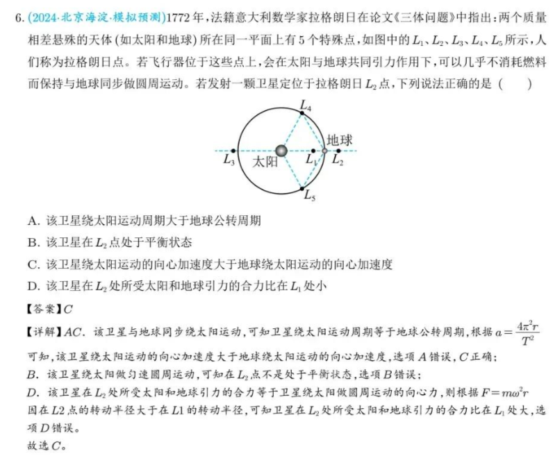

## 1: Orbit
### Ellipse
**First definition of ellipse**

$$\boxed{r_1+r_2=2a}$$

For a focal chord of an ellipse, the focal point divides the focal chord into two parts with length $r_1,r_2$, as follows:

$$\boxed{\frac{1}{r_1}+\frac{1}{r_2}=C}$$

Draw three chords through a point in the ellipse, intersecting the ellipse and six points respectively. These six points are connected in sequence. The distances between adjacent points are $a,d,c,f,b,e$, as follows:

$$\boxed{abc=edf}$$

**Optical Properties of Ellipses**

At one focus of the ellipse, a ray of light is emitted, and the light ray is reflected on the ellipse and passes through the other focus.

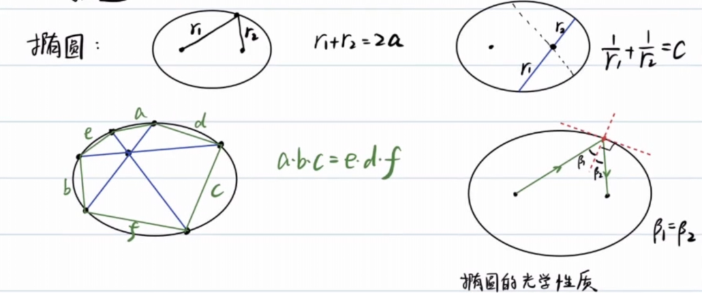

**radius of curvature of ellipse vertex**

This has been proven in [Basics of Calculus](/posts/physics/basic-calculus-04/).

Long axis: $\frac{b^2}{a}$, short axis: $\frac{a^2}{b}$

Calculation method: $\rho=\frac{v^2}{a_n}$

Among them: $v$ is **velocity**, $a_n$ is **normal acceleration**.

A motion can be constructed. In [Orbital Mechanics: The Law of Universal Gravitation](https://axiom.zh-cn.edgeone.cool/posts/physics/universal-law-of-graviation/) we have already studied the velocity at the end of the major axis, so we consider the planet’s motion around the celestial body.

At perihelion (vertex of major axis):

$$\begin{gathered}
  v^2=GM\frac{a+c}{a-c}\frac{1}{a}\\
  a_n=\frac{GM}{(a-c)^2}\\
  \rho=\frac{v^2}{a_n}=\frac{a^2-c^2}{a}=\frac{b^2}{a}
\end{gathered}$$

At the vertex of the minor axis:

$$\begin{gathered}
  \frac{1}{2}mv^2+(-\frac{GMm}{a})=-\frac{GMm}{2a}\\
  v^2=\frac{GM}{a}\\
  |\vec{a_\tau}+\vec{a_n}|=\frac{GM}{a^2},a_n=|\vec{a_\tau}+\vec{a_n}|\frac{b}{a}=\frac{GMb}{a^3}\\
  \rho=\frac{v^2}{a_n}=\frac{a^2}{b}
\end{gathered}$$

Common physical quantities related to ellipse parameters:

1. $E=-\frac{GMm}{2a}$
2. $\delta=\frac{dS}{dt}=\frac{\pi ab}{T}=\frac{L}{2m}$
3. $\frac{T^2}{a^3}=\frac{4\pi^2}{GM},T=\frac{\pi ab}{\delta}=\frac{2\pi}{\sqrt{GM}}a^\frac{3}{2}$
4. $L=b\sqrt{-2mE}$
5. $r_n=a-c,r_f=a+c,b=\sqrt{r_nr_f}$

Cartesian coordinate equation of ellipse: $\frac{x^2}{a^2}+\frac{y^2}{b^2}=1$

Polar coordinate equation: $\rho=\frac{p}{1+e\cos\theta},p=\frac{b^2}{a}$, where p is called the focal radius.

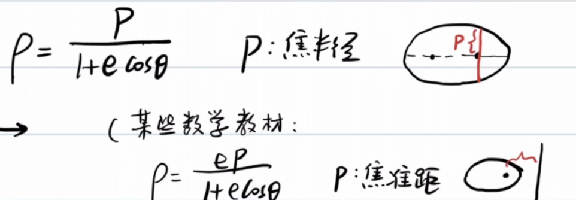

In fact, this parametric equation also applies to other Conic Sections.

### A little test (optical properties of ellipses)
(First question of the 28th semi-finals: excerpt)

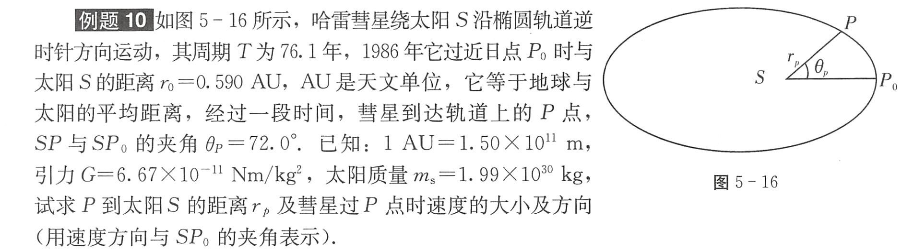

Learn about astronomical units:

>Astronomical unit (AU) is a length unit used to measure the distance between celestial bodies in astronomy. It is numerically equal to the average distance between the earth and the sun. It is currently defined as 149597870.7 kilometers. It can also be thought of as the length of the semi-major axis of the Earth's orbit, which is half the maximum diameter of the Earth's elliptical orbit around the Sun.

First, use the regression period to calculate the semi-major axis $a$:

$$\begin{gathered}
  \frac{T^2}{a^3}=\frac{4\pi^2}{GM_s}\\
  a=\sqrt[3]{\frac{GM_sT^2}{4\pi^2}}=2.69\times10^{12}m=17.90AU
\end{gathered}$$

Next, we use $r_0$ to find $r_p$:

$$\begin{gathered}
  r_0=a-c=0.590AU\\
  c=17.31AU\\
  e=\frac{c}{a}=0.967\\
  b=\sqrt{a^2-c^2}=4.56AU\\
  r_p=\frac{\frac{b^2}{a}}{1+e\cos72\degree}\\
  =0.894AU
\end{gathered}$$

Mark the other focus Z of the ellipse. Draw the angle bisector of $\angle ZPS$.

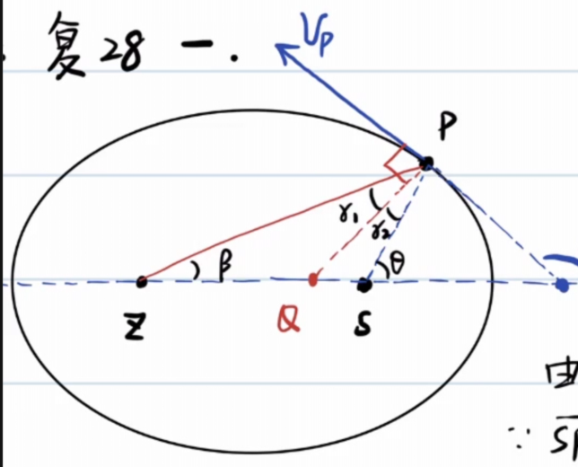

According to the optical properties of the ellipse, $v_p$ is perpendicular to the angle bisector.

Using the Sine Theorem in $\triangle ZPS$:

$$\begin{gathered}
  \frac{\sin2r_2}{2c}=\frac{\sin72\degree}{2a-r_p}\\
  \sin2r_2=\frac{2c}{2a-r_p}\sin72\degree\\
  r_2=\frac{1}{2}\arcsin(\frac{2c}{2a-r_p}\sin72\degree)\\
  =35.3\degree\\
  \varphi=90\degree+(\theta-r_2)=126.7\degree=127\degree
\end{gathered}$$

For the velocity direction, we can also find it through the tangent slope:

$$\begin{gathered}
  x_p=c+r_p\cos72\degree=17.59AU\\
  y_p=r_p\sin72\degree=0.850AU\\
  k_{OP}k_v=-\frac{b^2}{a^2}\\
  k_v=-1.34\\
  \varphi=127\degree
\end{gathered}$$

We have solved the distance from P to the sun and the direction of its velocity. Now it’s time to solve the magnitude of the velocity:

$$\begin{gathered}
  \frac{1}{2}mv^2+(-\frac{GM_sm}{r_p})=-\frac{GM_sm}{2a}\\
  v=\sqrt{2(\frac{GM_s}{r_p}-\frac{GM_s}{2a})}\\
  =4.39\times10^4m/s
\end{gathered}$$

Finished, scatter flowers.

Here is the centroid label:

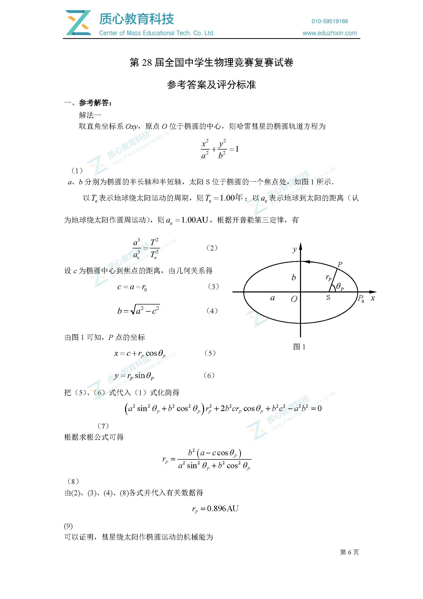

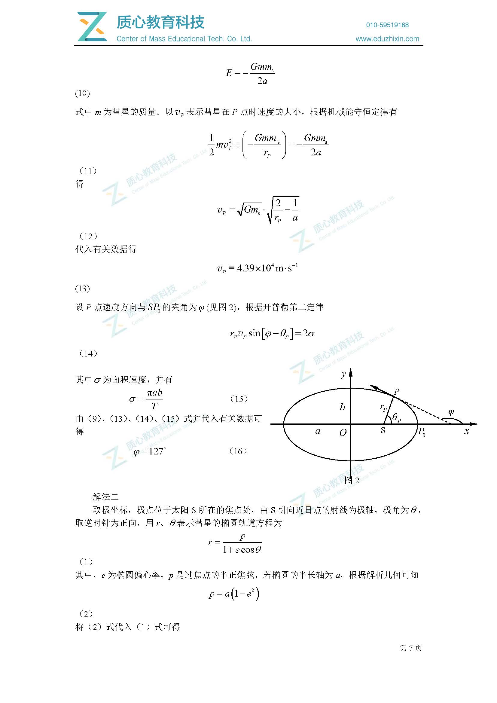

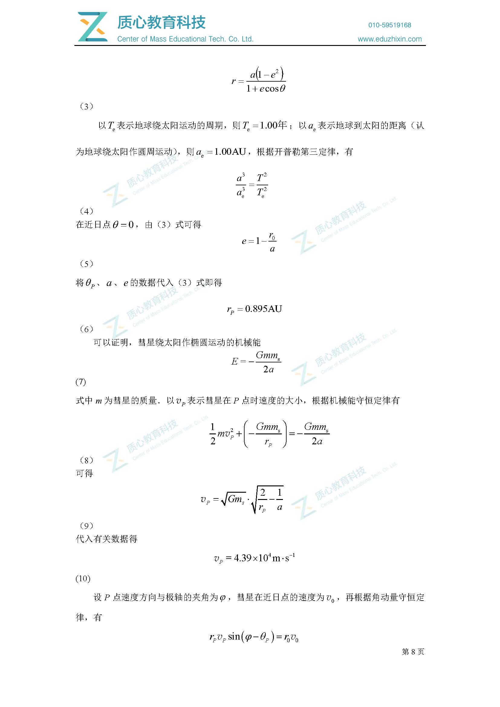

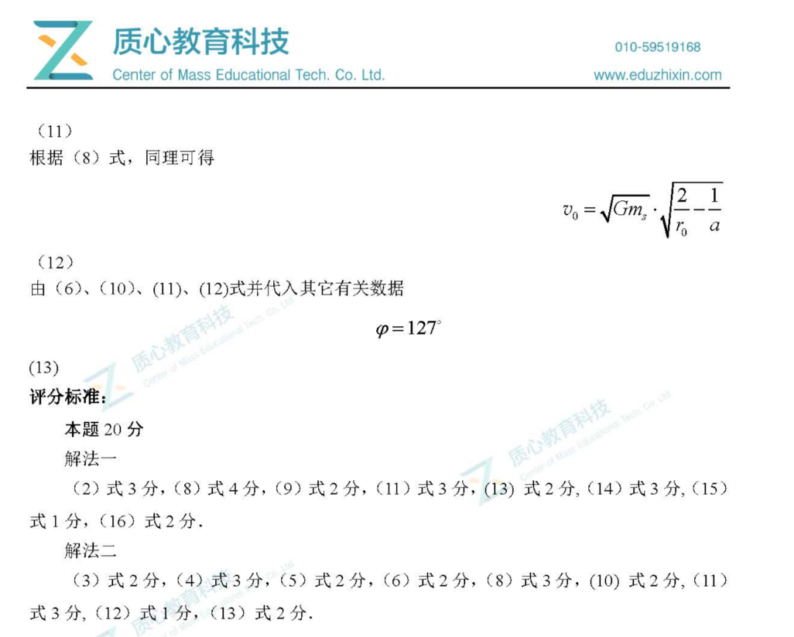

### Elliptical orbit comparison
For orbits with constant semi-major axis $a$, their mechanical energy is equal to $-\frac{GMm}{2a}$

It is not difficult to see that the extreme cases of these orbits are close to straight lines and close to perfect circles.

Angular momentum $L=b\sqrt{-2mE}$, when the orbit is close to a straight line $L\to 0$, and when the orbit is close to a perfect circle, L becomes larger.

So, $0\lt L\le L_0$


For an orbit with constant angular momentum $L$, it is obvious that the larger the semi-major axis $a$, the greater the mechanical energy $E$, and correspondingly $b$ must increase.

It is easy to prove that the focal radius $p=\frac{L^2}{GMm^2}$ is a certain value.


### Parabolic orbit

> In a heliocentric coordinate system, Earth moves uniformly around the Sun in a circular orbit of radius $R$ and period $T_{\text{Earth}}=1\ \text{year}$.
>
> A comet passes through the solar system in a parabolic orbit with mechanical energy $E=0$, with the Sun at the focus of the parabola. The comet's perihelion $C$ is located in the positive direction of the $y$ axis, and the distance to the sun is $R/2$ (i.e. perihelion $q=R/2$). The parabolic orbit intersects with the Earth’s circular orbit at two points $A$ and $B$, both of which are located on the $x$ axis, with coordinates $A(-R,0)$ and $B(R,0)$.
>
> **Find:** The time $t_{AB}$ taken by the comet to travel along the parabola from $A$, through perihelion $C$, to $B$.


As can be seen from the figure, $p=R=\frac{L^2}{GMm^2}=\frac{4\delta^2}{GM},\delta=\frac{1}{2}\sqrt{GMR}$

Obviously the equation of the parabola is $x^2=-2p(y-\frac{R}{2})=-2R(y-\frac{R}{2})$

In other words, $y=-\frac{x^2}{2R}+\frac{R}{2}$

Analyze the Earth’s motion cycle:

$$\begin{gathered}
  \frac{GMm_e}{R^2}=m_e\frac{4\pi^2}{T^2}R\\
  GM=4\pi^2\frac{R^3}{T^2}
\end{gathered}$$

With the help of the area swept by the comet $S$ and the area velocity $\delta$, the motion time can be found:

$$\begin{gathered}
  S=\int_{-R}^{R}(-\frac{x^2}{2R}+\frac{R}{2})dx=\frac{2R^2}{3}\\
  t=\frac{S}{\delta}=\frac{\frac{2}{3}R^2}{\frac{1}{2}\sqrt{GMR}}=\frac{4R^2}{3\sqrt{4\pi^2\frac{R^4}{T^2}}}\\
  =\frac{2T}{3\pi}=77.5day
\end{gathered}$$

# virial force theorem

The virial force theorem (English: Virial theorem, also known as the Virial theorem and the equal work theorem) is a mathematical relationship in mechanics that describes the time average of the total **kinetic energy** and the total **potential energy** of a stable multi-degree-of-freedom isolated system.

## Basic expressions

Consider a system with $N$ particles, and its mathematical expression is:

$$\langle T \rangle = -\frac{1}{2}\sum_{k=1}^{N}\langle \mathbf{F}_k \cdot \mathbf{r}_k \rangle$$

Among them:

- Angle brackets $\langle\cdots\rangle$ represent averaging over time;
-$T$ is the total kinetic energy inside the system;
-$\mathbf{F}_k$ is the resultant force on the $k$ particle;
-$\mathbf{r}_k$ is the position vector of the $k$ th particle;
- The right side of the equation is called the virial product, which reflects the strength of the interaction within the system.

> The English word *virial* was named by the German physicist **Rudolf Clausius** in 1870, based on the Latin word *vīs* (meaning force, energy).

### Simplified form under power potential

If the force between any two particles in the system comes from the potential energy proportional to the distance between the particles $r$ raised to the power of $n$

$$V(r) = \alpha r^n \quad (\alpha,\, n \text{ are constants})$$

Then the theorem simplifies to:

$$2\langle T \rangle = n\langle V_{\text{total}} \rangle$$

That is, 2 times the total kinetic energy of the system is equal to $n$ times the total potential energy.

| Potential energy types |$n$| Conclusion |
|---|---|---|
| Gravity / Coulomb potential |$-1$|$2\langle T\rangle = -\langle V\rangle$|
| Resonator potential |$2$|$\langle T\rangle = \langle V\rangle$|

## Meaning and scope of application

The importance of the virial force theorem is that it allows the calculation of the average total kinetic energy, even for complex systems that cannot be solved accurately (such as the many-body systems considered in statistical mechanics).

- According to the **Energy Equipartition Theorem**, the average total kinetic energy is related to the system temperature;
- However, the virial force theorem **does not depend on the concept of temperature** and is even applicable to systems that are not in thermal equilibrium;
- The theorem has been generalized to various forms, especially the tensor form.

In particular, for stable multi-body motion, if the relative positions of each particle remain unchanged, the total kinetic energy and total potential energy of the system remain unchanged, and always have:

$$\boxed{2E_k=-E_p}$$

### Simple proof
Suppose n particles with the same mass form a regular n-gon and steadily perform uniform circular motion with a radius of $r_0$.

Centripetal force on each particle $F(r_0)=m\frac{v^2}{r_0}=\frac{A}{r_0^2}$

$$\begin{gathered}
  E_k=n\frac{1}{2}mv^2=\frac{n}{2}r_0m\frac{v^2}{r_0}=\frac{n}{2}r_0F(r_0)
\end{gathered}$$

Using the principle of virtual work, let each particle move along the radial direction $dr$.

$$\begin{gathered}
  dE_p=nF(r)dr\\
  E_p=\int_{\infty}^{r_0}n\frac{A}{r^2}dr=-nA\frac{1}{r_0}=-2E_k
\end{gathered}$$

## 2: Tide
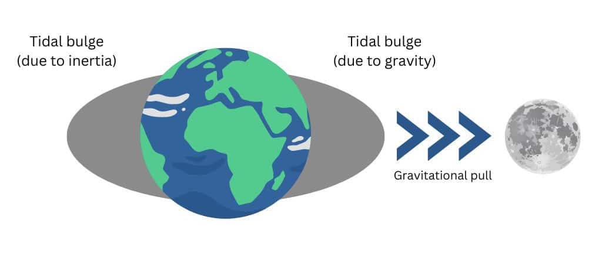
The essence of tides is **gravity difference**, and the change in the moon's gravity caused by the radius of the earth cannot be ignored.

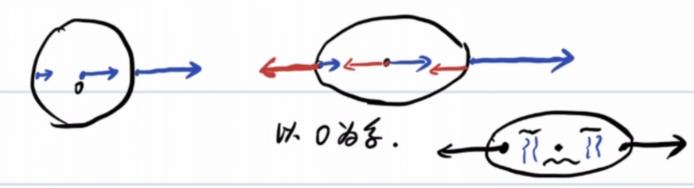

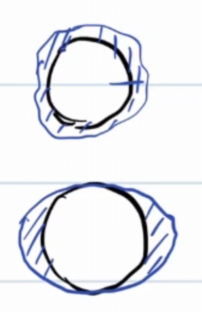

The force that pulls the water extra high is called the tidal force.

Taking the earth's center of mass as the inertial system, each point on the earth experiences the same inertial force as the gravitational force exerted by the center of mass.


Assume that the distance between the moon (m)onth and the earth is $r_m$, and the radius of the earth is $R$

$$\begin{gathered}
  a_c=\frac{GM_m}{r_{m}^2}\\
  F_A=\Delta ma_c-\frac{GM_m\Delta m}{(r_m+R)^2}\\
  =\frac{GM_m\Delta m}{r_{m}^2}-\frac{GM_m\Delta m}{(r_m+R)^2}\\
  =\frac{GM_m\Delta m}{r_{m}^2}(1-\frac{1}{(1+\frac{R}{r_m})^2})\\
  \approx \frac{GM_m\Delta m}{r_{m}^3}2R\propto \frac{1}{r_m^3}
\end{gathered}$$

Same reason $F_B=\frac{GM_m\Delta m}{r_{m}^3}2R\propto \frac{1}{r_m^3}$

Looking at the calculation results, the larger the attracted object, the greater the tidal force and the easier it is to be torn apart.

When an object approaches a massive central body to a certain critical distance, the central body's tidal force on the celestial body will exceed that of the celestial body.
Due to its own self-gravity, the celestial body will be torn into pieces. This critical distance is called the **Roche limit**:

$$\begin{gathered}
  \frac{GM_M\Delta m}{d^3}2R=\frac{GM\Delta m}{R^2}\\
  d=2^\frac{1}{3}R_M(\frac{M_m}{m})^\frac{1}{3}
\end{gathered}$$

In fact, the satellite is treated as a non-deformable rigid body particle above, which ignores two effects:

The satellite itself is stretched and deformed (ellipsoidized) due to the tidal force, which increases the proximal distance and weakens the self-gravity;
Centrifugal effects of satellite orbiting motion.

After correcting the coefficients we get:

$$d \approx 2.44\, R_M \left(\frac{M_M}{m}\right)^{1/3}$$

Although the tidal forces experienced by large satellites and small satellites in the same orbit are different (the larger one is stronger), the self-gravity of the large satellite also increases in the same proportion, and the two exactly offset each other. **The Roche limit has nothing to do with the size of the satellite**.

The rings of Saturn are the remnants of satellites or comets that were torn apart by tidal forces and scattered into rings of debris after they crossed the Roche limit.

This was demonstrated in "Interstellar": the Miller planet where the protagonist group landed is extremely close to the supermassive black hole
**Gargantua**, the strong tidal force stirs up periodic giant waves tens of meters high on the planet's ocean;
When Cooper drove the spacecraft close to the black hole, the spacecraft was just outside the Roche limit——
Once it crosses, the tidal force will directly tear the spacecraft into pieces. (Sonnet 4.6 told me, I haven’t seen it myself)

It is not difficult to calculate that $\frac{F_{m}}{F_{s}}\approx 2.2$, the tidal force of the sun on the earth is less than the tidal force of the moon.

Within a month, there are two **big tides** (the sun, moon, and earth are collinear), probably on the first or fifteenth day of the lunar month.

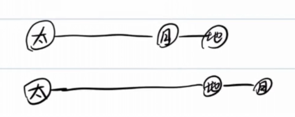

**Neap tide**: $\angle\text{Sun–Earth–Moon}=90\degree$; the solar and lunar tidal forces on Earth are orthogonal, so their effects partially cancel.

Feel the tide intuitively:

## Three: Rotating reference system
Point-sending questions for the 26th semi-finals:

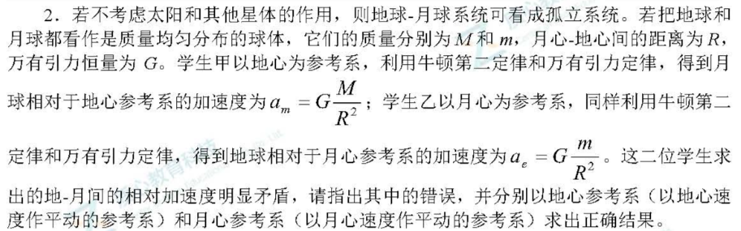

Taking a moving object as the inertial system, the inertial force should be introduced:

Taking the earth as the inertial system, the inertial force on the moon is the same as the gravitational force of the moon and the earth:

$$F=\frac{GMm}{R^2}+m\frac{Gm}{R^2}=ma\Longrightarrow a=\frac{G(M+m)}{R^2}$$

Using the moon as the inertial system, the same result can be calculated in the same way, which is not inconsistent with the Galilean transformation.

### Example 1
There is a satellite moving in a uniform circular motion. The period of motion is $T$, the linear speed is $v_0$, and the radius of motion is $r$.

If the satellite acquires a speed $u_n$ or $u_\tau$ in the normal or tangential direction (movement in the same direction) (both are less than $(\sqrt{2}-1)v_0$, so the planet moves in an elliptical orbit), find:

(1) $T_n',T_\tau'$

(2) If $u_n=u_t$, compare the size of $T_n',T_\tau$.

Consider the combination of mechanical energy change and virial force theorem:

If an additional $u_n$ is obtained in the normal direction, then:

$$\begin{gathered}
  \frac{T_n'}{T}=(\frac{a_n'}{r})^{\frac{3}{2}}=(\frac{E_0}{E_n'})^\frac{3}{2}\\
  =(\frac{-\frac{1}{2}mv_0^2}{-mv_0^2+\frac{1}{2}m(v_0^2+u_n^2)})^\frac{3}{2}\\
  =(\frac{\frac{1}{2}mv_0^2}{mv_0^2-\frac{1}{2}m(v_0^2+u_n^2)})^\frac{3}{2}
\end{gathered}$$

If the normal direction (same as the direction of motion) additionally obtains $u_\tau$, then:

$$\begin{gathered}
  \frac{T_\tau'}{T}=(\frac{a_n'}{r})^{\frac{3}{2}}=(\frac{E_0}{E_n'})^\frac{3}{2}\\
  =(\frac{-\frac{1}{2}mv_0^2}{-mv_0^2+\frac{1}{2}m(v_0+u_t)^2})^\frac{3}{2}\\
  =(\frac{\frac{1}{2}mv_0^2}{mv_0^2-\frac{1}{2}m(v_0+u_t)^2})^\frac{3}{2}
\end{gathered}$$

Obviously, if $u_n=u_t$, then $T_n'\lt T_\tau'$

### Example 2
On the evening of January 31, 2018, a super blue blood total lunar eclipse (blue moon) occurred.

Of course, the Blue Moon here is not laundry detergent.

blue moon: The second full moon in a Gregorian calendar month.

## Epilogue

Looking back at this note, I started from the elliptical orbit and made a big circle——

When a comet passes by the sun, the area velocity is used to calculate the time;
The three-body rotation forces out the equilateral triangle and Lagrange points;
Tides tear apart moons, and Saturn’s rings are the remnants of gravity;
Finally, the satellite was pushed, and the orbital period changed.

These topics are unrelated on the surface, but at their core they all share the same question: What do objects tend to do in a world dominated by gravity? **

The answer is: circle, deform, be torn apart, or stay firmly at the Lagrangian point——
Depends on how close it is to danger.
