<!--more-->
## 朝花夕拾
证明:若质量为$m_1,m_2,m_3$的三质点形成稳定转动形态后(均做圆周运动,周期相同),若三者**不共线**,则$m_1,m_2,m_3$形成**正三角形**.

以质心为中心,换转动系,则$m_1,m_2,m_3$静止.

引入惯性离心力:

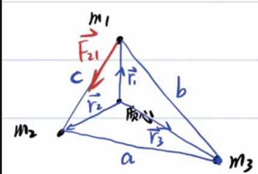
$$\begin{gathered}
\vec{r_c}=\frac{\sum m_i\vec{r_i}}{\sum m_i}=\vec{0}\\
\vec{F_{12}}=G\frac{m_1m_2}{c^2}(\vec{r_2}-\vec{r_1})\frac{1}{c}\\
=G\frac{m_1m_2}{c^3}(\vec{r_2}-\vec{r_1})\\
\vec{F_{13}}=G\frac{m_1m_2}{c^2}(\vec{r_2}-\vec{r_1})\frac{1}{c}\\
=G\frac{m_1m_2}{b^3}(\vec{r_3}-\vec{r_1})\\
\vec{F_{\text{惯1}}}=m_1w^2\vec{r_1}\\
\Rightarrow \begin{cases}G\frac{m_1m_2}{c^3}(\vec{r_2}-\vec{r_1})+G\frac{m_1m_2}{b^3}(\vec{r_3}-\vec{r_1})+m_1w^2\vec{r_1}=0,\\
\vec{r_3}=-\frac{-(m_1\vec{r_1}+m_2\vec{r_2})}{m_3}\end{cases}\\
(\frac{Gm_2}{c^3}-\frac{Gm_2}{b^3})\vec{r_2}=(\frac{Gm_1}{b^3}+\frac{Gm_3}{b^3}+\frac{Gm_2}{c^3}-w^2)\vec{r_1}
\end{gathered}$$

又因为$\vec{r_1},\vec{r_2}$不共线,只能有:

$$\begin{cases}
  \frac{Gm_2}{c^3}-\frac{Gm_2}{b^3}=0,\\
  \frac{Gm_1}{b^3}+\frac{Gm_3}{b^3}+\frac{Gm_2}{c^3}-w^2=0
\end{cases}$$

得到$b=c$,同理$a=b=c$,则三者构成的图形是正三角形.

顺便得到:$\omega=\sqrt{\frac{G(m_1+m_2+m_3)}{a^3}}$

此问题正是著名的**拉格朗日点**问题

本文推导的正三角形解对应 **L4、L5** 两个稳定拉格朗日点。

另外三个共线点 **L1、L2、L3** 由三体共线平衡条件（欧拉解）给出，

需对两大天体连线上的合力方程单独求解。

五个拉格朗日点合称欧拉-拉格朗日点。

附上一道练习题:

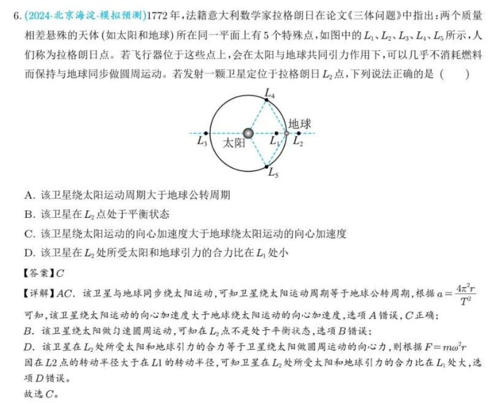

## 一:轨道
### 椭圆
**椭圆第一定义**

$$\boxed{r_1+r_2=2a}$$

对于椭圆的一根焦点弦,焦点把焦点弦分为长度为$r_1,r_2$两部分,有:

$$\boxed{\frac{1}{r_1}+\frac{1}{r_2}=C}$$

过椭圆内一点做出三条弦,分别交椭圆与六个点,这六个点顺次连接,相邻点的距离分别为$a,d,c,f,b,e$,有:

$$\boxed{abc=edf}$$

**椭圆的光学性质**

在椭圆的一个焦点,发出一条光线,光线在椭圆上反射后的光线经过另一个焦点.

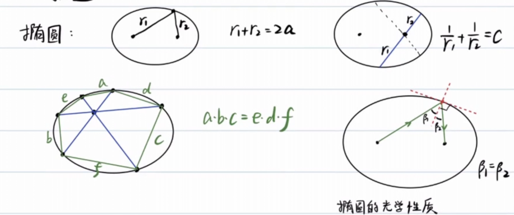

**椭圆顶点的曲率半径**

这个在[微积分基础](/posts/physics/basic-calculus-04/)中已经证明.

长轴:$\frac{b^2}{a}$,短轴:$\frac{a^2}{b}$

计算方法:$\rho=\frac{v^2}{a_n}$

其中:$v$为**速度**,$a_n$为**法向加速度**.

可以构造一个运动,在[天体运动:万有引力定律](https://axiom.zh-cn.edgeone.cool/posts/physics/universal-law-of-graviation/)我们已经研究过长轴处的速度情况,故考虑行星绕天体的运动.

在近日点(长轴顶点)处:

$$\begin{gathered}
  v^2=GM\frac{a+c}{a-c}\frac{1}{a}\\
  a_n=\frac{GM}{(a-c)^2}\\
  \rho=\frac{v^2}{a_n}=\frac{a^2-c^2}{a}=\frac{b^2}{a}
\end{gathered}$$

在短轴顶点处:

$$\begin{gathered}
  \frac{1}{2}mv^2+(-\frac{GMm}{a})=-\frac{GMm}{2a}\\
  v^2=\frac{GM}{a}\\
  |\vec{a_\tau}+\vec{a_n}|=\frac{GM}{a^2},a_n=|\vec{a_\tau}+\vec{a_n}|\frac{b}{a}=\frac{GMb}{a^3}\\
  \rho=\frac{v^2}{a_n}=\frac{a^2}{b}
\end{gathered}$$

常见的与椭圆参量相关的物理量:

1. $E=-\frac{GMm}{2a}$
2. $\delta=\frac{dS}{dt}=\frac{\pi ab}{T}=\frac{L}{2m}$
3. $\frac{T^2}{a^3}=\frac{4\pi^2}{GM},T=\frac{\pi ab}{\delta}=\frac{2\pi}{\sqrt{GM}}a^\frac{3}{2}$
4. $L=b\sqrt{-2mE}$
5. $r_n=a-c,r_f=a+c,b=\sqrt{r_nr_f}$

椭圆的直角坐标方程:$\frac{x^2}{a^2}+\frac{y^2}{b^2}=1$

极坐标方程:$\rho=\frac{p}{1+e\cos\theta},p=\frac{b^2}{a}$,其中p称为焦半径.

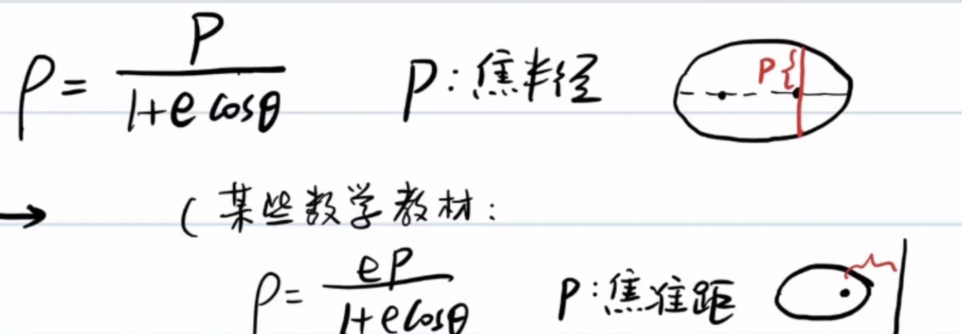

事实上,这一参数方程亦适用于其他圆锥曲线.

### 小试牛刀(椭圆的光学性质)
(28届复赛第一题:节选)

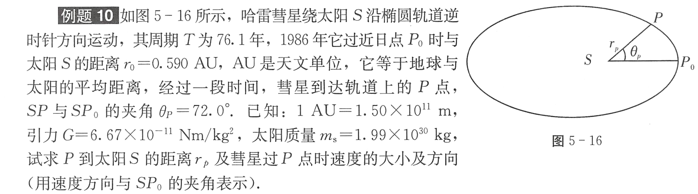

科普一下天文单位:

>天文单位（Astronomical unit, AU）是天文学中计量天体之间距离的一种长度单位，在数值上等于地球和太阳之间的平均距离，现定义为149597870.7公里。 它也可以被认为是地球公转轨道的半长轴长度，即地球绕太阳椭圆轨道最大直径的一半的长度。

首先利用回归周期计算半长轴$a$:

$$\begin{gathered}
  \frac{T^2}{a^3}=\frac{4\pi^2}{GM_s}\\
  a=\sqrt[3]{\frac{GM_sT^2}{4\pi^2}}=2.69\times10^{12}m=17.90AU
\end{gathered}$$

紧接着,我们利用$r_0$求出$r_p$:

$$\begin{gathered}
  r_0=a-c=0.590AU\\
  c=17.31AU\\
  e=\frac{c}{a}=0.967\\
  b=\sqrt{a^2-c^2}=4.56AU\\
  r_p=\frac{\frac{b^2}{a}}{1+e\cos72\degree}\\
  =0.894AU
\end{gathered}$$

标出椭圆的另一焦点Z.做出$\angle ZPS$的角平分线.

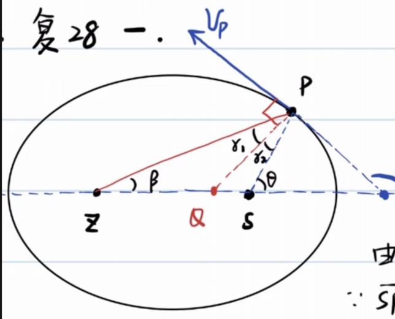

根据椭圆的光学性质,$v_p$垂直于角平分线.

在$\triangle ZPS$中使用正弦定理:

$$\begin{gathered}
  \frac{\sin2r_2}{2c}=\frac{\sin72\degree}{2a-r_p}\\
  \sin2r_2=\frac{2c}{2a-r_p}\sin72\degree\\
  r_2=\frac{1}{2}\arcsin(\frac{2c}{2a-r_p}\sin72\degree)\\
  =35.3\degree\\
  \varphi=90\degree+(\theta-r_2)=126.7\degree=127\degree
\end{gathered}$$

对于速度方向,我们还可以通过切线斜率求出:

$$\begin{gathered}
  x_p=c+r_p\cos72\degree=17.59AU\\
  y_p=r_p\sin72\degree=0.850AU\\
  k_{OP}k_v=-\frac{b^2}{a^2}\\
  k_v=-1.34\\
  \varphi=127\degree
\end{gathered}$$

我们已经解决了P到太阳的距离及速度方向,该解决速度大小了:

$$\begin{gathered}
  \frac{1}{2}mv^2+(-\frac{GM_sm}{r_p})=-\frac{GM_sm}{2a}\\
  v=\sqrt{2(\frac{GM_s}{r_p}-\frac{GM_s}{2a})}\\
  =4.39\times10^4m/s
\end{gathered}$$

完结,撒花.

这里呈上质心标答:

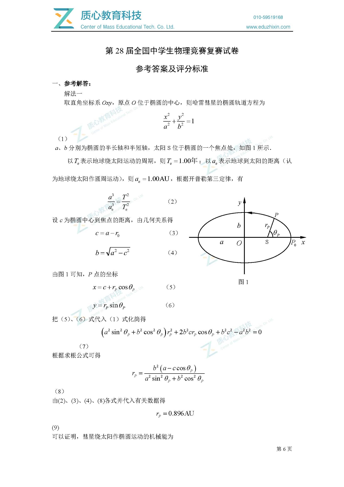

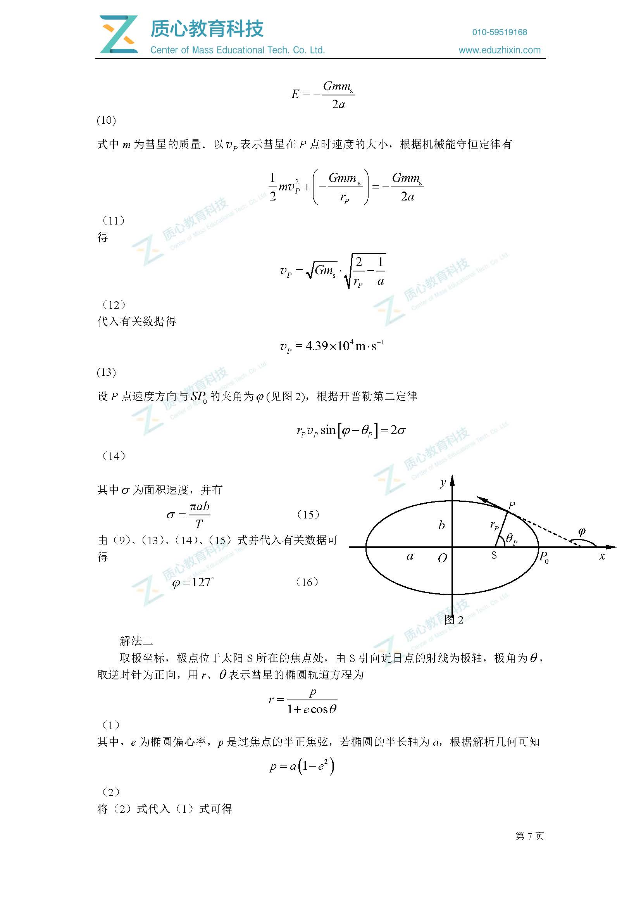

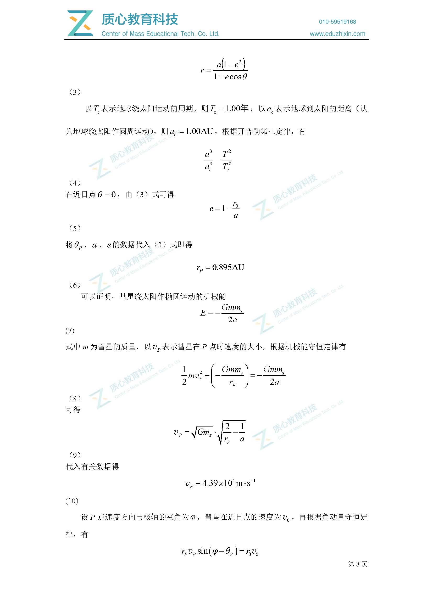

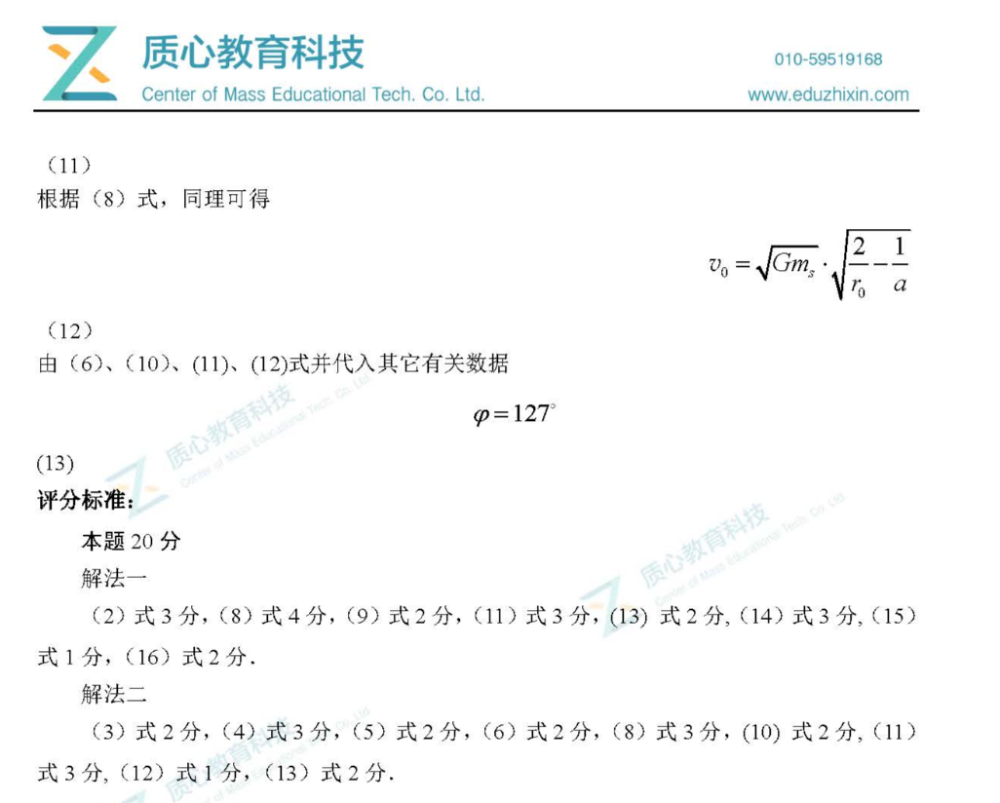

### 椭圆轨道比较
对于半长轴$a$不变的轨道,它们的机械能都等于$-\frac{GMm}{2a}$

不难看出,这些轨道的极端情况是接近直线和接近正圆.

角动量$L=b\sqrt{-2mE}$,在轨道接近直线时$L\to 0$,在轨道接近正圆时,L变大.

所以,$0\lt L\le L_0$


对于角动量$L$不变的轨道,显然半长轴$a$越大,机械能$E$越大,相应$b$必须增大.

容易证明,焦半径$p=\frac{L^2}{GMm^2}$为一定值.


### 抛物线轨道

> 在以太阳为原点的日心坐标系中，地球绕太阳做匀速圆周运动，轨道半径为 $R$，周期 $T_{\text{地}}=1\ \text{年}$。
>
> 一颗彗星沿抛物线轨道掠过太阳系，其机械能 $E=0$，太阳位于该抛物线的焦点。彗星的近日点 $C$ 位于 $y$ 轴正方向，到太阳的距离为 $R/2$（即近日距 $q=R/2$）。该抛物线轨道与地球圆轨道相交于 $A$、$B$ 两点，二者位于 $x$ 轴上，坐标为 $A(-R,0)$、$B(R,0)$。
>
> **求：** 彗星沿抛物线由 $A$ 经近日点 $C$ 到 $B$ 所经历的时间 $t_{AB}$。


由图可知,$p=R=\frac{L^2}{GMm^2}=\frac{4\delta^2}{GM},\delta=\frac{1}{2}\sqrt{GMR}$

显然抛物线方程为$x^2=-2p(y-\frac{R}{2})=-2R(y-\frac{R}{2})$

也就是说,$y=-\frac{x^2}{2R}+\frac{R}{2}$

分析一下地球运动周期:

$$\begin{gathered}
  \frac{GMm_e}{R^2}=m_e\frac{4\pi^2}{T^2}R\\
  GM=4\pi^2\frac{R^3}{T^2}
\end{gathered}$$

借助彗星扫过的面积$S$和面积速度$\delta$,可以求出运动时间:

$$\begin{gathered}
  S=\int_{-R}^{R}(-\frac{x^2}{2R}+\frac{R}{2})dx=\frac{2R^2}{3}\\
  t=\frac{S}{\delta}=\frac{\frac{2}{3}R^2}{\frac{1}{2}\sqrt{GMR}}=\frac{4R^2}{3\sqrt{4\pi^2\frac{R^4}{T^2}}}\\
  =\frac{2T}{3\pi}=77.5day
\end{gathered}$$

# 位力定理

**位力定理**（英语：Virial theorem，又称维里定理、均功定理）是[力学]中描述稳定的多自由度孤立体系的总**动能**和总**势能**时间平均之间的数学关系。

## 基本表达式

考虑一个有 $N$ 个质点的体系，其数学表达式为：

$$\langle T \rangle = -\frac{1}{2}\sum_{k=1}^{N}\langle \mathbf{F}_k \cdot \mathbf{r}_k \rangle$$

其中：

- 角括号 $\langle\cdots\rangle$ 表示对时间取平均；
- $T$ 是系统内部的总动能；
- $\mathbf{F}_k$ 是第 $k$ 个质点所受的合力；
- $\mathbf{r}_k$ 是第 $k$ 个质点的位置向量；
- 等式右边称作**均位力积**（virial），反映体系内相互作用强度。

> 英语 *virial* 一词由德国物理学家**鲁道夫·克劳修斯**于 1870 年根据拉丁语单词 *vīs*（意为力、能量）命名。

### 幂次势下的简化形式

若系统内任意两粒子之间的力来自与粒子间距 $r$ 的 $n$ 次幂成正比的势能

$$V(r) = \alpha r^n \quad (\alpha,\, n \text{ 为常数})$$

则定理简化为：

$$2\langle T \rangle = n\langle V_{\text{total}} \rangle$$

即体系总动能的 2 倍等于总势能的 $n$ 倍。

| 势能类型 | $n$ | 结论 |
|---|---|---|
| 引力 / 库仑势 | $-1$ | $2\langle T\rangle = -\langle V\rangle$ |
| 谐振子势 | $2$ | $\langle T\rangle = \langle V\rangle$ |

## 意义与适用范围

位力定理的重要意义在于，它允许计算平均总动能，即便对于那些**无法精确求解的复杂系统**（例如统计力学中考虑的多体系统）也同样适用。

- 根据**能量均分定理**，平均总动能与系统温度相关；
- 然而位力定理**不依赖温度概念**，甚至适用于不处于热平衡的系统；
- 该定理已被推广至多种形式，特别是**张量形式**。

特别的,对于稳定的多体运动,若各质点相对位置不变,则系统总动能和总势能不变,恒有:

$$\boxed{2E_k=-E_p}$$

### 简单证明
设n个质量相同的质点组成正n边形,稳定地做半径为$r_0$的匀速圆周运动.

每个质点受到的向心力$F(r_0)=m\frac{v^2}{r_0}=\frac{A}{r_0^2}$

$$\begin{gathered}
  E_k=n\frac{1}{2}mv^2=\frac{n}{2}r_0m\frac{v^2}{r_0}=\frac{n}{2}r_0F(r_0)
\end{gathered}$$

使用虚功原理,让每个质点沿着径向方向移动$dr$.

$$\begin{gathered}
  dE_p=nF(r)dr\\
  E_p=\int_{\infty}^{r_0}n\frac{A}{r^2}dr=-nA\frac{1}{r_0}=-2E_k
\end{gathered}$$

## 二:潮汐
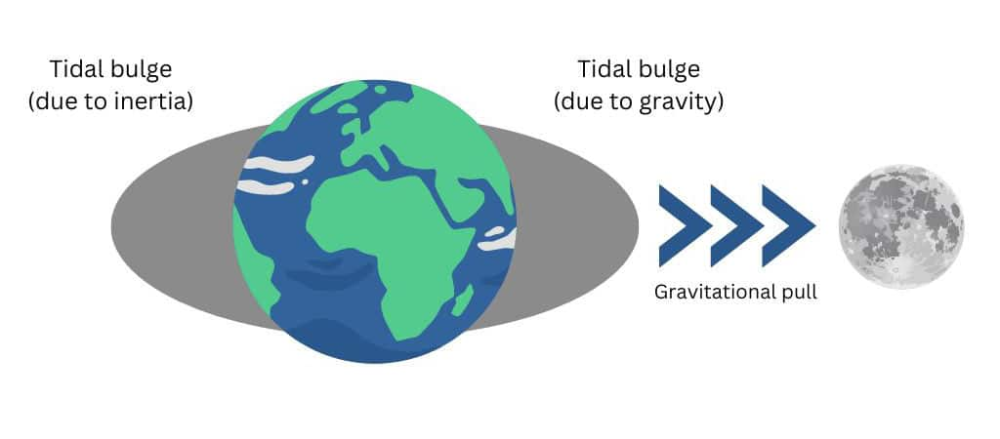
潮汐的本质是**引力差**,地球半径造成的月球引力变化不可忽略.

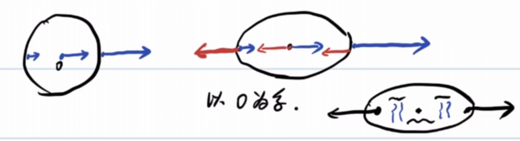

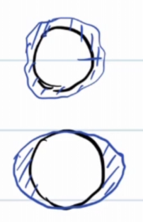

把水额外拉高的力,称为**引潮力**.

以地球质心为惯性系,这样地球各点受到与质心所受引力相同的惯性力.


设月(m)onth地距离为$r_m$,地球半径为$R$

$$\begin{gathered}
  a_c=\frac{GM_m}{r_{m}^2}\\
  F_A=\Delta ma_c-\frac{GM_m\Delta m}{(r_m+R)^2}\\
  =\frac{GM_m\Delta m}{r_{m}^2}-\frac{GM_m\Delta m}{(r_m+R)^2}\\
  =\frac{GM_m\Delta m}{r_{m}^2}(1-\frac{1}{(1+\frac{R}{r_m})^2})\\
  \approx \frac{GM_m\Delta m}{r_{m}^3}2R\propto \frac{1}{r_m^3}
\end{gathered}$$

同理$F_B=\frac{GM_m\Delta m}{r_{m}^3}2R\propto \frac{1}{r_m^3}$

审视一下计算结果，被吸引物体越大，**引潮力**越大，更容易被撕裂。

当天体靠近大质量中心体近到某个临界距离时，中心体对该天体的引潮力将超过天体
自身的自引力，天体就会被撕碎，这一临界距离称为**洛希极限**：

$$\begin{gathered}
  \frac{GM_M\Delta m}{d^3}2R=\frac{GM\Delta m}{R^2}\\
  d=2^\frac{1}{3}R_M(\frac{M_m}{m})^\frac{1}{3}
\end{gathered}$$

事实上,上面把卫星当作无形变的刚体质点，忽略了两个效应：

卫星本身因引潮力被拉伸变形（椭球化），增大了近端距离，自引力减弱；
卫星绕轨道运动的离心效应。

修正系数后得到:

$$d \approx 2.44\, R_M \left(\frac{M_M}{m}\right)^{1/3}$$

大卫星和小卫星在同一轨道上受到的引潮力虽然不同（大的更强），但大卫星的自引力也按同样比例增大，两者恰好抵消，**洛希极限与卫星尺寸无关**。

土星环正是卫星或彗星越过洛希极限后被潮汐力撕裂、散布成碎片环的遗迹。

在《星际穿越》中展示了这一点：主角团登陆的米勒星球极度靠近超大质量黑洞
**卡冈图雅**，强烈的引潮力在星球海洋上激起数十米高的周期性巨浪；
而库珀驾驶飞船贴近黑洞时，飞船恰好处于洛希极限之外——
一旦越过，引潮力将直接将飞船撕碎。(Sonnet 4.6告诉我的,我本人没有看过)

不难算出$\frac{F_{m}}{F_{s}}\approx 2.2$,太阳对地球的引潮力小于月球造成的引潮力.

在一个月内,大概在初一/十五有两次**大潮**(太阳,月球,地球共线)

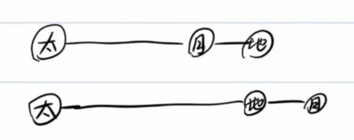

**小潮**:$\angle \text{日地月}=90\degree$,太阳和月亮对地球形成的引潮力正交,效果上相互抵消

直观感受潮汐:

## 三:转动参考系
26届复赛的送分题:

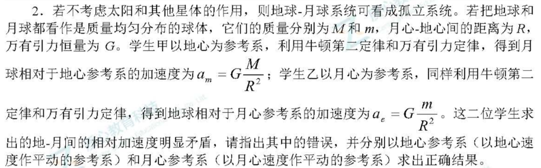

以一个运动的物体为惯性系,应该引入惯性力:

以地球为惯性系,月球所受的惯性力与月地引力相同:

$$F=\frac{GMm}{R^2}+m\frac{Gm}{R^2}=ma\Longrightarrow a=\frac{G(M+m)}{R^2}$$

以月球为惯性系同理可以算出一样的结果,与伽利略变换不矛盾.

### 例1
有一颗卫星做匀速圆周运动,运动周期为$T$,线速度为$v_0$,运动半径为$r$.

若卫星法向或切向(运动同向)获得一个速度$u_n$或$u_\tau$(均小于$(\sqrt{2}-1)v_0$,这样行星以椭圆轨道运动),求:

(1)$T_n',T_\tau'$

(2)若$u_n=u_t$,比较$T_n',T_\tau$的大小.

考虑机械能变化和位力定理的结合:

如果法向方向额外获得$u_n$,则:

$$\begin{gathered}
  \frac{T_n'}{T}=(\frac{a_n'}{r})^{\frac{3}{2}}=(\frac{E_0}{E_n'})^\frac{3}{2}\\
  =(\frac{-\frac{1}{2}mv_0^2}{-mv_0^2+\frac{1}{2}m(v_0^2+u_n^2)})^\frac{3}{2}\\
  =(\frac{\frac{1}{2}mv_0^2}{mv_0^2-\frac{1}{2}m(v_0^2+u_n^2)})^\frac{3}{2}
\end{gathered}$$

如果法向方向(与运动方向相同)额外获得$u_\tau$,则:

$$\begin{gathered}
  \frac{T_\tau'}{T}=(\frac{a_n'}{r})^{\frac{3}{2}}=(\frac{E_0}{E_n'})^\frac{3}{2}\\
  =(\frac{-\frac{1}{2}mv_0^2}{-mv_0^2+\frac{1}{2}m(v_0+u_t)^2})^\frac{3}{2}\\
  =(\frac{\frac{1}{2}mv_0^2}{mv_0^2-\frac{1}{2}m(v_0+u_t)^2})^\frac{3}{2}
\end{gathered}$$

显然,如果$u_n=u_t$,则$T_n'\lt T_\tau'$

### 例2
2018年1月31日晚,发生了超级 蓝血 月全食(blue moon)

当然,这里的蓝月亮不是洗衣液.

blue moon:一个公历月出现了第二次满月.

## 尾声

回头看这篇笔记，从椭圆轨道出发，绕了一大圈——

彗星掠过太阳，用面积速度算时间；  
三体转动，逼出正三角形和拉格朗日点；  
潮汐撕碎卫星，土星环是引力留下的残骸；  
最后卫星被推一脚，轨道周期就这么变了。

这些内容表面上毫不相关，但核心都是同一个问题：**在引力主导的世界里，物体倾向于做什么？**

答案是：绕圈、变形、被撕碎，或者稳稳地待在拉格朗日点上——  
取决于它离危险有多近。