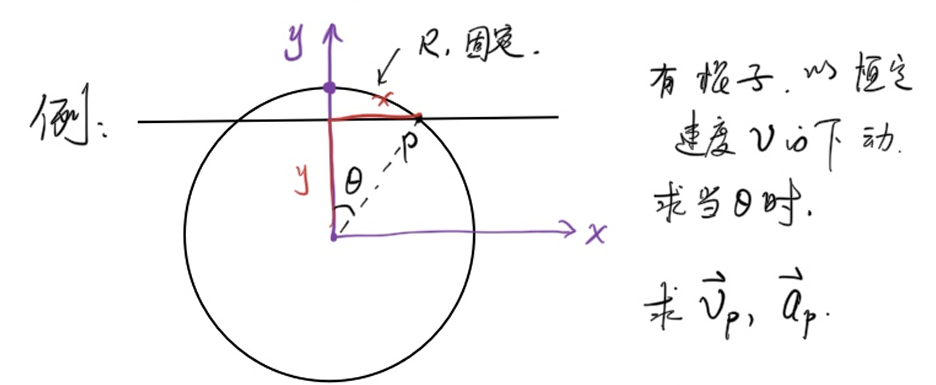
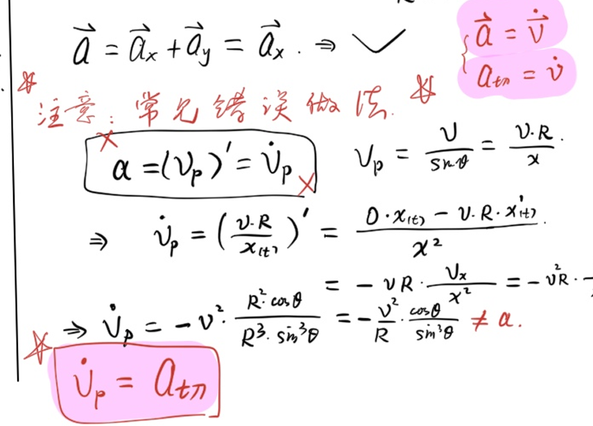
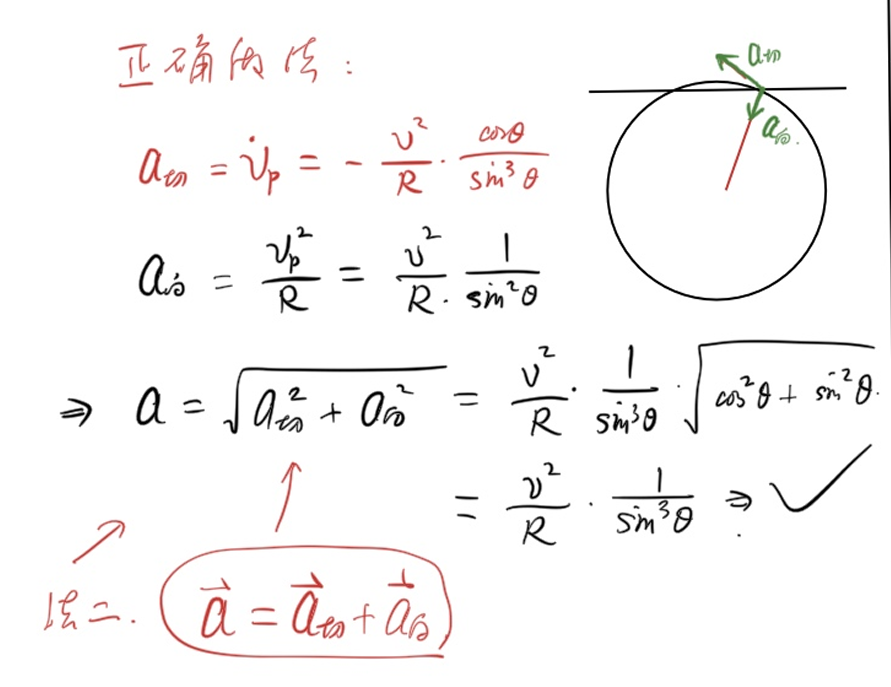

The calculus covered in this article serves **physics competition** and focuses on **practicality** rather than **rigor**
<!--more-->
## Sequence limit
### Introduction
Let $a_n=1-10^{-n}(n=1,2,3,...)$

It can be known that $a_n$ is getting closer and closer to 1, but when $n$ is infinite, is $a_n$ actually 1?

From this, we introduce the $\epsilon-\N$ language from the perspective of error:

### ϵ−N language

If there exists an $p\in \R$ such that: for any real number $\epsilon\gt0$, there is an integer $\N$, such that for any $n\gt N$, $|a_n-p|\lt\epsilon$, then $p$ is called the limit of the sequence $a_n$, denoted as $\lim_{n\to \infty}a_n=p$. Otherwise, it is called the sequence $a_n$ without limit.

## Function limit
### Introduction
With the limit of the series (sequence), the limit of the function is naturally derived.

When $x\to 0$, what is the value of $f(x)=\frac{\sin x}{x}$?

<iframe src="https://www.desmos.com/calculator/pmghhxkevq?embed" width="500" height="500" style="border: 1px solid #ccc" frameborder=0></iframe>

In the same way, the $\epsilon-\delta$ language is introduced

### ϵ−δ language
If there is a $p\in \R$ such that: for any $\epsilon\gt0$, if there is $\delta\gt0$, such that when $0\lt x_0-x\lt \delta$, $|f(x)-p|\lt\epsilon$, then the **left limit** of $f(x)$ at $x_0$ is called $p$, recorded as $\lim_{x \to x_0^-} f(x)=p$

In the same way, it is easy to get the definition of **right limit**.

In addition, if $\lim_{x \to x_0^-} f(x)=\lim_{x \to x_0^+} f(x)$, then the **limit** of $f(x)$ at $x_0$ is $p$, denoted as $\lim_{x \to x_0} f(x)=p$

The above ϵ−N language/ϵ−δ language is not the focus of this section

## Useful limit judgment rule
### Pinching theorem
If $f(x)\le g(x)\le h(x)$, and $f(x),h(x)$ limits exist and are the same, then $f(x),h(x),g(x)$ limits exist and are the same.

#### Example 1
Feel (loosely) $\lim_{x\to 0}\frac{\sin x}{x}=1$

From the relationship between the area and size of the unit circle, we are familiar with $\sin x\le x\le\tan x,x\in [0,\frac{\pi}{2})$

Therefore, there is the inequality $\cos x=\frac{\sin x}{\tan x}\lt \frac{\sin x}{x}\lt 1,x\in (0,\frac{\pi}{2})$

Because the limits of $\cos x,1$ at 0 are all 1, so:

$\boxed{\lim_{x\to 0}\frac{\sin x}{x}=1}$

### Extreme algorithm
It is easy to prove that the limit of the four arithmetic operations is equal to the four arithmetic operations of the limit:
1. If $\lim_{x\to x_0}f(x)=p_1,\lim_{x\to x_0}f(x)=p_2$, then:
  - $\lim_{x\to x_0}(f(x)\pm g(x))=p_1\pm p_2$
  - $\lim_{x\to x_0}(f(x)g(x))=p_1p_2$
2. If $\lim_{x\to x_0}f(x)=p_1,\lim_{x\to x_0}f(x)=p_2\ne 0$, then:
  - $\lim_{x\to x_0}\frac{f(x)}{g(x)}=\frac{p_1}{p_2}$

#### Example 2

Calculate the limit (the limit does not necessarily exist)

$$\lim_{x \to 5} \frac{1}{x-5}$$
$x-5\to 0$, there is no limit
$$\lim_{x \to 0} \frac{x^2}{\sin x}$$
$\lim_{x \to 0} \frac{x^2}{\sin x}=\frac{\lim_{x\to 0}x}{\lim_{x\to 0}\frac{\sin x}{x}}=\frac{0}{1}=0$
$$\lim_{x \to \infty} \frac{\sin x}{x}$$
According to the pinch theorem:

$\frac{-1}{|x|}\le \frac{\sin x}{x}\le \frac{1}{|x|}$

The left and right limits are equal to 0, so the required limit is 0.
$$\lim_{x \to \infty} \frac{10x^2 + 203x}{3x^2 + 5x + 7}$$
$\lim_{x \to \infty} \frac{10x^2 + 203x}{3x^2 + 5x + 7}=\lim_{x \to \infty} \frac{10 + 203\frac{1}{x}}{3 + 5\frac{1}{x} + 7\frac{1}{x^2}}=\frac{\lim_{x \to \infty}(10 + 203\frac{1}{x})}{\lim_{x \to \infty}(3 + 5\frac{1}{x} + 7\frac{1}{x^2})}=\frac{10}{3}1$
$$\lim_{x\to 0}\frac{1-\cos x}{x^2}$$
$\lim_{x\to 0}\frac{1-\cos x}{x^2}=\lim_{x\to 0}\frac{2\sin^2 \frac{x}{2}}{x^2}=\frac{1}{2}\lim_{x\to 0}(\frac{\sin \frac{x}{2}}{\frac{x}{2}})(\frac{\sin \frac{x}{2}}{\frac{x}{2}})=\frac{1}{2}(\lim_{x\to 0}(\frac{\sin \frac{x}{2}}{\frac{x}{2}}))^2=\frac{1}{2}\times1^2=\frac{1}{2}$

## Derivative

### Introduction

Considering the function $f(x)=x^2$, what is the **instantaneous rate of change** of the function at $x=1$?

Let’s first consider the **average rate of change** from $x=1$ to $x=1+\Delta x$:

$$\frac{f(1+\Delta x)-f(1)}{\Delta x}=\frac{(1+\Delta x)^2-1}{\Delta x}=2+\Delta x$$

When $\Delta x\to 0$, the average rate of change approaches $2$, which is the **instantaneous rate of change** of $f(x)=x^2$ at $x=1$, that is, the **derivative**.

#### Derivative ↔Micro-Business

Differential is a small amount of change. The quotient of differential is called differential quotient.

Definition $f'(x)=\lim_{\Delta x\to0}\frac{\Delta f}{\Delta x}=\frac{df}{dx} $

### Definition of derivative

If the limit

$$\lim_{\Delta x\to 0}\frac{f(x_0+\Delta x)-f(x_0)}{\Delta x}$$

exists, then $f(x)$ is said to be **differentiable** at $x_0$, and this limit value is called the **derivative** of $f(x)$ at $x_0$, denoted as $f'(x_0)$ or $\left.\dfrac{\mathrm{d}f}{\mathrm{d}x}\right|_{x=x_0}$.

If $f(x)$ is differentiable at every point in the domain of definition, then $f'(x)$ is called the **derivative function** of $f(x)$, referred to as **derivative**.

> The above strict definition is not the focus of this section, the important thing is to calculate the derivative.

### Derivatives of common functions

Starting from the definition, the following common conclusions can be derived:

| Function $f(x)$| Derivative $f'(x)$|
|:-----------:|:------------:|
|$C$ (constant) |$0$|
| $x^n$ | $nx^{n-1}$ |
| $\sin x$ | $\cos x$ |
| $\cos x$ | $-\sin x$ |
| $e^x$ | $e^x$ |
| $\ln x$ | $\dfrac{1}{x}$ |

#### Example: Derivation from definition $(x^2)'=2x$

$$\lim_{\Delta x\to 0}\frac{(x+\Delta x)^2-x^2}{\Delta x}=\lim_{\Delta x\to 0}\frac{2x\Delta x+(\Delta x)^2}{\Delta x}=\lim_{\Delta x\to 0}(2x+\Delta x)=2x$$

## Four arithmetic rules for derivatives

### Rules

Assume that $f(x),g(x)$ can all be derived, then:

1. **Addition and Subtraction Rule**: $(f(x)\pm g(x))'=f'(x)\pm g'(x)$
2. **Multiplication Rule**: $(f(x)g(x))'=f'(x)g(x)+f(x)g'(x)$
3. **Division rule**: $\left(\dfrac{f(x)}{g(x)}\right)'=\dfrac{f'(x)g(x)-f(x)g'(x)}{[g(x)]^2}$, where $g(x)\ne 0$

> **Memory Tips**: Multiplication rule - "Lead before and after, add lead without lead, then lead after lead"; Division rule - "Lead up and down minus lead up and down, divide the square of the following".

### Derivation of the multiplication rule

$$[f(x)g(x)]'=\lim_{\Delta x\to 0}\frac{f(x+\Delta x)g(x+\Delta x)-f(x)g(x)}{\Delta x}$$

Adding and subtracting the same term $f(x)g(x+\Delta x)$:

$$=\lim_{\Delta x\to 0}\frac{f(x+\Delta x)-f(x)}{\Delta x}\cdot g(x+\Delta x)+f(x)\cdot\frac{g(x+\Delta x)-g(x)}{\Delta x}$$

$$=f'(x)g(x)+f(x)g'(x)$$

### Example questions

#### Example 1

Find the derivative of $f(x)=x^3\sin x$.

By the multiplication rule:

$$f'(x)=(x^3)'\sin x+x^3(\sin x)'=3x^2\sin x+x^3\cos x$$

#### Example 2

Find the derivative ($x\ne 0$) of $f(x)=\dfrac{\sin x}{x}$.

By the division rule:

$$f'(x)=\frac{(\sin x)'\cdot x-\sin x\cdot(x)'}{x^2}=\frac{x\cos x-\sin x}{x^2}$$

#### Example 3

Find the derivative of $f(x)=e^x(\sin x+\cos x)$.

By the multiplication rule:

$$f'(x)=(e^x)'(\sin x+\cos x)+e^x(\sin x+\cos x)'$$

$$=e^x(\sin x+\cos x)+e^x(\cos x-\sin x)$$

$$=2e^x\cos x$$

#### Example 4

Find the derivative of $f(x)=\tan x$.

Convert $\tan x=\dfrac{\sin x}{\cos x}$ by the division rule:

$$(\tan x)'=\frac{(\sin x)'\cos x-\sin x(\cos x)'}{\cos^2 x}=\frac{\cos^2 x+\sin^2 x}{\cos^2 x}=\frac{1}{\cos^2 x}=\sec^2 x$$

$$\boxed{(\tan x)'=\sec^2 x}$$

## Physical applications of derivatives

$\vec{v}=\lim_{\Delta t\to 0}\frac{\vec{x}}{\vec{t}}=\frac{d\vec{r}}{dt}=\dot{\vec{r}}$

$\vec{a}=\lim_{\Delta t\to 0}\frac{\vec{v}}{\vec{t}}=\frac{d\vec{v}}{dt}=\dot{\vec{v}}=\ddot{\vec{r}}$

The point symbol is **Newton notation**, which means derivation with respect to time.

### Example 1
Use derivatives to find the velocity and acceleration of uniform circular motion with angular velocity $w$.

$\begin{cases}
  x=R\cos wt,\\
  y=R\sin wt
\end{cases} $

$\begin{cases}
  v_x=-Rw\sin wt,\\
  v_y=Rw\cos wt
\end{cases} $

So $v=\sqrt{v_x^2+v_y^2}=Rw$

$\begin{cases}
  a_x=-Rw^2\cos wt,\\
  a_y=-Rw^2\sin wt
\end{cases} $

So $a=\sqrt{a_x^2+a_y^2}=Rw^2$

### Example 2

There are two ways to deal with this problem:

1. Decompose in Cartesian coordinate system
2. Decomposition in polar coordinate system

#### Method 1
Let’s start timing from the top of the circle:

$\begin{cases}
  y=R-vt,\\
  x=\sqrt{R^2-y^2}=\sqrt{R^2-(R-vt)^2}
\end{cases} $

$\begin{cases}
  v_y=\dot{y}=-v,\\
  v_x=\dot{x}\\=\frac{1}{2}(R^2-(R-vt)^2)^\frac{-1}{2}[R^2-(R-vt)^2]'\\=\frac{1}{2}(R^2-(R-vt)^2)^\frac{-1}{2}(-1)(-v)'2(R-vt)\\
  =(R^2-(R-vt)^2)^\frac{-1}{2}(R-vt)v\\
  =\frac{vy}{x}=\frac{v}{\tan \theta}
\end{cases} $

So $v=\sqrt{v_x^2+v_y^2}=\frac{v}{\sin \theta}$ (easy to get by decomposing speed)

$\begin{cases}
  a_y=0,\\
  a_x=(v\frac{y(t)}{x(t)})'=v\frac{y'x-yx'}{x^2}=v\frac{xv_y-yv_x}{x^2}=-v^2\frac{x^2+y^2}{x^3}=-v^2\frac{1}{R\sin^3\theta}
\end{cases} $

There is a common mistake to note here:

After correction, we get:
#### Method 2

## AI Summary (Sonnet 4.6)
**Introduction to the Basics of Calculus** (for physics competitions, focusing on practical applications) is divided into three major sections:

**Limit**: From the sequence limit (ε-N) to the function limit (ε-δ), master the pinch theorem and the four arithmetic rules, and be able to calculate common limits.

**Derivatives**: Understand the essence of "instantaneous rate of change is the limit", memorize the derivative tables of common functions, and master the three major operation rules of addition, subtraction, multiplication, and division.

**Physics Application**: Velocity $v=\dot{r}$, acceleration $a=\ddot{r}$, use parametric equations + derivation to deal with geometric problems such as circular motion.
