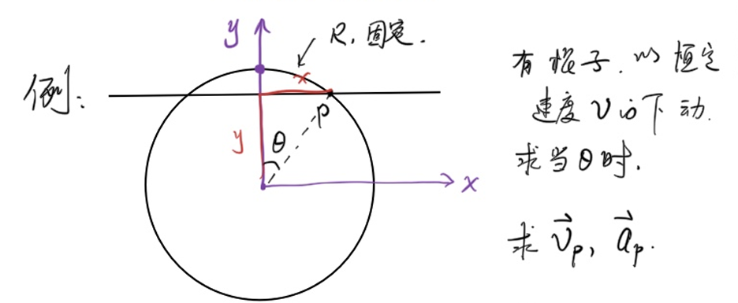
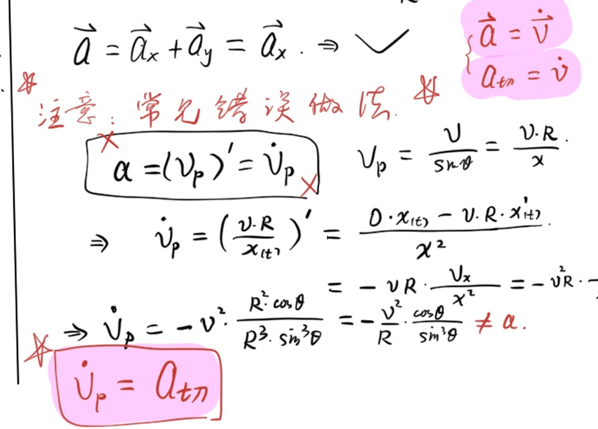
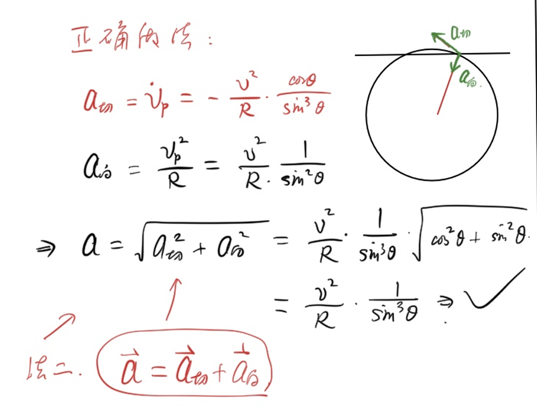

本文中涉及到的微积分服务于**物理竞赛**,侧重于**实用性**,而非**严谨性**
<!--more-->
## 数列极限
### 引入
设$a_n=1-10^{-n}(n=1,2,3,...)$

可以知道,$a_n$越来越接近于1,但是当$n$无穷大时,$a_n$到底是不是1呢?

由此,我们由误差的角度,引入$\epsilon-\N$语言:

### ϵ−N语言

如果存在一个$p\in \R$使得:对于任意的实数$\epsilon\gt0$,都存在一个整数$\N$,使得对于任意$n\gt N$,$|a_n-p|\lt\epsilon$,那么称$p$为数列$a_n$的极限,记作$\lim_{n\to \infty}a_n=p$.否则叫做数列$a_n$没有极限

## 函数极限
### 引入
有了级数(数列)的极限,自然引出函数的极限.

当$x\to 0$时,$f(x)=\frac{\sin x}{x}$的值等于多少?

<iframe src="https://www.desmos.com/calculator/pmghhxkevq?embed" width="500" height="500" style="border: 1px solid #ccc" frameborder=0></iframe>

同理,引出$\epsilon-\delta$语言

### ϵ−δ语言
如果存在一个$p\in \R$使得:对任意$\epsilon\gt0$,若存在$\delta\gt0$,使得当$0\lt x_0-x\lt \delta$时,$|f(x)-p|\lt\epsilon$,则称$f(x)$在$x_0$处的**左极限**为$p$,记作$\lim_{x \to x_0^-} f(x)=p$

同理容易得到**右极限**的定义.

此外,如果$\lim_{x \to x_0^-} f(x)=\lim_{x \to x_0^+} f(x)$,则称$f(x)$在$x_0$处的**极限**为$p$,记作$\lim_{x \to x_0} f(x)=p$

以上的 ϵ−N语言/ϵ−δ语言 不是本节的重点

## 好用的极限判断法则
### 夹逼定理
若$f(x)\le g(x)\le h(x)$,且$f(x),h(x)$极限存在且相同,则$f(x),h(x),g(x)$极限存在且相同.

#### 例1
(不严谨地)感受$\lim_{x\to 0}\frac{\sin x}{x}=1$

由单位圆中面积大小关系,熟知$\sin x\le x\le\tan x,x\in [0,\frac{\pi}{2})$

于是,有不等式$\cos x=\frac{\sin x}{\tan x}\lt \frac{\sin x}{x}\lt 1,x\in (0,\frac{\pi}{2})$

因为$\cos x,1$在0处的极限都是1,所以:

$\boxed{\lim_{x\to 0}\frac{\sin x}{x}=1}$

### 极限运算法则
容易证明,四则运算的极限等于极限的四则运算:
1. 若$\lim_{x\to x_0}f(x)=p_1,\lim_{x\to x_0}f(x)=p_2$,则:
  - $\lim_{x\to x_0}(f(x)\pm g(x))=p_1\pm p_2$
  - $\lim_{x\to x_0}(f(x)g(x))=p_1p_2$
2. 若$\lim_{x\to x_0}f(x)=p_1,\lim_{x\to x_0}f(x)=p_2\ne 0$,则:
  - $\lim_{x\to x_0}\frac{f(x)}{g(x)}=\frac{p_1}{p_2}$

#### 例2

计算极限(不一定存在极限)

$$\lim_{x \to 5} \frac{1}{x-5}$$
$x-5\to 0$,不存在极限
$$\lim_{x \to 0} \frac{x^2}{\sin x}$$
$\lim_{x \to 0} \frac{x^2}{\sin x}=\frac{\lim_{x\to 0}x}{\lim_{x\to 0}\frac{\sin x}{x}}=\frac{0}{1}=0$
$$\lim_{x \to \infty} \frac{\sin x}{x}$$
由夹逼定理:

$\frac{-1}{|x|}\le \frac{\sin x}{x}\le \frac{1}{|x|}$

左右极限等于0,所以所求极限为0.
$$\lim_{x \to \infty} \frac{10x^2 + 203x}{3x^2 + 5x + 7}$$
$\lim_{x \to \infty} \frac{10x^2 + 203x}{3x^2 + 5x + 7}=\lim_{x \to \infty} \frac{10 + 203\frac{1}{x}}{3 + 5\frac{1}{x} + 7\frac{1}{x^2}}=\frac{\lim_{x \to \infty}(10 + 203\frac{1}{x})}{\lim_{x \to \infty}(3 + 5\frac{1}{x} + 7\frac{1}{x^2})}=\frac{10}{3}1$
$$\lim_{x\to 0}\frac{1-\cos x}{x^2}$$
$\lim_{x\to 0}\frac{1-\cos x}{x^2}=\lim_{x\to 0}\frac{2\sin^2 \frac{x}{2}}{x^2}=\frac{1}{2}\lim_{x\to 0}(\frac{\sin \frac{x}{2}}{\frac{x}{2}})(\frac{\sin \frac{x}{2}}{\frac{x}{2}})=\frac{1}{2}(\lim_{x\to 0}(\frac{\sin \frac{x}{2}}{\frac{x}{2}}))^2=\frac{1}{2}\times1^2=\frac{1}{2}$

## 导数

### 引入

考虑函数 $f(x)=x^2$，在 $x=1$ 处，函数的**瞬时变化率**是多少？

我们先考虑从 $x=1$ 到 $x=1+\Delta x$ 的**平均变化率**：

$$\frac{f(1+\Delta x)-f(1)}{\Delta x}=\frac{(1+\Delta x)^2-1}{\Delta x}=2+\Delta x$$

当 $\Delta x\to 0$ 时，平均变化率趋近于 $2$，这就是 $f(x)=x^2$ 在 $x=1$ 处的**瞬时变化率**，即**导数**.

#### 导数↔微商

微分,即微小变化量.微分之商,称为微商.

定义$f'(x)=\lim_{\Delta x\to0}\frac{\Delta f}{\Delta x}=\frac{df}{dx} $

### 导数的定义

若极限

$$\lim_{\Delta x\to 0}\frac{f(x_0+\Delta x)-f(x_0)}{\Delta x}$$

存在，则称 $f(x)$ 在 $x_0$ 处**可导**，该极限值称为 $f(x)$ 在 $x_0$ 处的**导数**，记作 $f'(x_0)$ 或 $\left.\dfrac{\mathrm{d}f}{\mathrm{d}x}\right|_{x=x_0}$.

若 $f(x)$ 在定义域上每一点都可导，则称 $f'(x)$ 为 $f(x)$ 的**导函数**，简称**导数**.

> 以上严格定义不是本节重点，重要的是会**计算**导数.

### 常见函数的导数

由定义出发，可以推导出以下常用结论：

| 函数 $f(x)$ | 导数 $f'(x)$ |
|:-----------:|:------------:|
| $C$（常数） | $0$ |
| $x^n$ | $nx^{n-1}$ |
| $\sin x$ | $\cos x$ |
| $\cos x$ | $-\sin x$ |
| $e^x$ | $e^x$ |
| $\ln x$ | $\dfrac{1}{x}$ |

#### 例：由定义推导 $(x^2)'=2x$

$$\lim_{\Delta x\to 0}\frac{(x+\Delta x)^2-x^2}{\Delta x}=\lim_{\Delta x\to 0}\frac{2x\Delta x+(\Delta x)^2}{\Delta x}=\lim_{\Delta x\to 0}(2x+\Delta x)=2x$$

## 导数的四则运算法则

### 法则

设 $f(x),g(x)$ 均可导，则：

1. **加减法则**：$(f(x)\pm g(x))'=f'(x)\pm g'(x)$
2. **乘法法则**：$(f(x)g(x))'=f'(x)g(x)+f(x)g'(x)$
3. **除法法则**：$\left(\dfrac{f(x)}{g(x)}\right)'=\dfrac{f'(x)g(x)-f(x)g'(x)}{[g(x)]^2}$，其中 $g(x)\ne 0$

> **记忆口诀**：乘法法则——"前导后不导，加上前不导后导"；除法法则——"上导下减上下导，除以下的平方".

### 推导乘法法则

$$[f(x)g(x)]'=\lim_{\Delta x\to 0}\frac{f(x+\Delta x)g(x+\Delta x)-f(x)g(x)}{\Delta x}$$

加减同一项 $f(x)g(x+\Delta x)$：

$$=\lim_{\Delta x\to 0}\frac{f(x+\Delta x)-f(x)}{\Delta x}\cdot g(x+\Delta x)+f(x)\cdot\frac{g(x+\Delta x)-g(x)}{\Delta x}$$

$$=f'(x)g(x)+f(x)g'(x)$$

### 例题

#### 例1

求 $f(x)=x^3\sin x$ 的导数.

由乘法法则：

$$f'(x)=(x^3)'\sin x+x^3(\sin x)'=3x^2\sin x+x^3\cos x$$

#### 例2

求 $f(x)=\dfrac{\sin x}{x}$ 的导数（$x\ne 0$）.

由除法法则：

$$f'(x)=\frac{(\sin x)'\cdot x-\sin x\cdot(x)'}{x^2}=\frac{x\cos x-\sin x}{x^2}$$

#### 例3

求 $f(x)=e^x(\sin x+\cos x)$ 的导数.

由乘法法则：

$$f'(x)=(e^x)'(\sin x+\cos x)+e^x(\sin x+\cos x)'$$

$$=e^x(\sin x+\cos x)+e^x(\cos x-\sin x)$$

$$=2e^x\cos x$$

#### 例4

求 $f(x)=\tan x$ 的导数.

将 $\tan x=\dfrac{\sin x}{\cos x}$，由除法法则：

$$(\tan x)'=\frac{(\sin x)'\cos x-\sin x(\cos x)'}{\cos^2 x}=\frac{\cos^2 x+\sin^2 x}{\cos^2 x}=\frac{1}{\cos^2 x}=\sec^2 x$$

$$\boxed{(\tan x)'=\sec^2 x}$$

## 导数的物理应用

$\vec{v}=\lim_{\Delta t\to 0}\frac{\vec{x}}{\vec{t}}=\frac{d\vec{r}}{dt}=\dot{\vec{r}}$

$\vec{a}=\lim_{\Delta t\to 0}\frac{\vec{v}}{\vec{t}}=\frac{d\vec{v}}{dt}=\dot{\vec{v}}=\ddot{\vec{r}}$

点号为**牛顿记号**,表示对时间求导.

### 例1
运用导数,求角速度为$w$的匀速圆周运动的速度与加速度的大小.

$\begin{cases}
  x=R\cos wt,\\
  y=R\sin wt
\end{cases}$

$\begin{cases}
  v_x=-Rw\sin wt,\\
  v_y=Rw\cos wt
\end{cases}$

于是$v=\sqrt{v_x^2+v_y^2}=Rw$

$\begin{cases}
  a_x=-Rw^2\cos wt,\\
  a_y=-Rw^2\sin wt
\end{cases}$

于是$a=\sqrt{a_x^2+a_y^2}=Rw^2$

### 例2

对于这个问题,可以有两种处理方法:

1. 在直角坐标系中分解
2. 在极坐标系中分解

#### 法一
不妨从圆的最上端开始计时:

$\begin{cases}
  y=R-vt,\\
  x=\sqrt{R^2-y^2}=\sqrt{R^2-(R-vt)^2}
\end{cases}$

$\begin{cases}
  v_y=\dot{y}=-v,\\
  v_x=\dot{x}\\=\frac{1}{2}(R^2-(R-vt)^2)^\frac{-1}{2}[R^2-(R-vt)^2]'\\=\frac{1}{2}(R^2-(R-vt)^2)^\frac{-1}{2}(-1)(-v)'2(R-vt)\\
  =(R^2-(R-vt)^2)^\frac{-1}{2}(R-vt)v\\
  =\frac{vy}{x}=\frac{v}{\tan \theta}
\end{cases}$

所以$v=\sqrt{v_x^2+v_y^2}=\frac{v}{\sin \theta}$(由速度分解易得)

$\begin{cases}
  a_y=0,\\
  a_x=(v\frac{y(t)}{x(t)})'=v\frac{y'x-yx'}{x^2}=v\frac{xv_y-yv_x}{x^2}=-v^2\frac{x^2+y^2}{x^3}=-v^2\frac{1}{R\sin^3\theta}
\end{cases}$

这里需要注意一个常见错误:

修正之后,就得到了:
#### 法二

## AI总结(Sonnet 4.6)
**微积分基础导论**（物理竞赛向，侧重实用）分三大板块：

**极限**：从数列极限（ε-N）到函数极限（ε-δ），掌握夹逼定理与四则运算法则，会算常见极限即可。

**导数**：理解"瞬时变化率即极限"的本质，熟记常见函数导数表，掌握加减、乘法、除法三大运算法则。

**物理应用**：速度 $v=\dot{r}$，加速度 $a=\ddot{r}$，用参数方程 + 求导处理圆周运动等几何问题。
