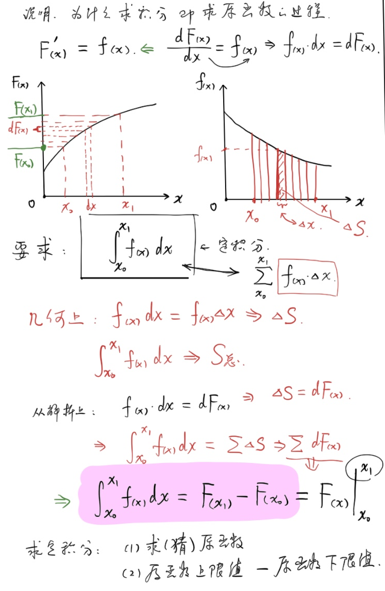
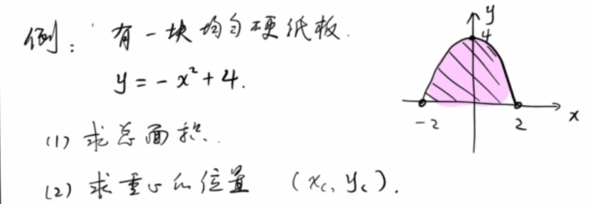
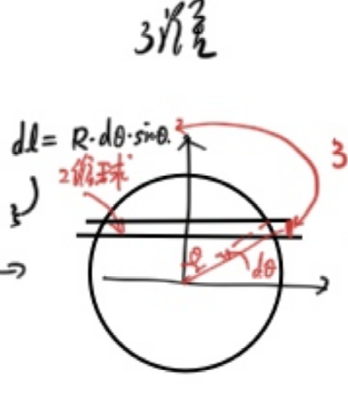
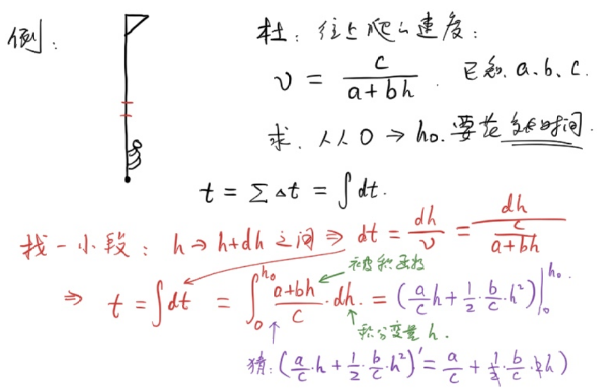

<!--more-->
## Introduction
If you know the density of each tiny part of a pig $\rho$, how do you find the total mass?

$$
M=\sum\Delta m_i=\int dm=\int\rho(\vec{r})dV
$$

From this, the **indefinite integral** notation was introduced

### Example 1
For a one-dimensional thin rod, its linear density per unit length $\rho(x)=Ax^4$, find the total mass:

$$
M=\int_{0}^{l_0}\rho(x)dx
$$

From this, the **definite integral** notation was introduced.

Among them:

| Integrade | Integral variable | Integral symbol | Upper and lower limits |
| --- | --- | ---| --- |
| $\rho(x)$ | $x$ | $\int$ | $l_0,0$ |

## Operation
To find the **indefinite integral**, that is, to find the **original function**

Definition: If $F'(x)=f(x)$, then $F(x)$ is called the **original function** of $f(x)$.

It is easy to know that the **original function** is not unique and its constant term is arbitrary.

$$\int f(x)dx=F(x)+C$$

### Example 2
Through observation, find the indefinite integral of the following function.

(1) $\int5x^3dx$

$=\frac{5}{4}x^4+C$

(2) $\int\sin3x dx$

$=-\frac{1}{3}\cos3x+C$

(3) $\int\frac{4}{x}dx$

$=4\ln x+C$

(4) $\int7\cos2xdx$

$=\frac{7}{2}\sin 2x$

The following are commonly used indefinite integral tables:

$$
\begin{gathered}
  % Common integrals for high-school physics competitions
% ============ Basic integrals ============
\int x^n\,dx &= \frac{x^{n+1}}{n+1}+C, \quad n\neq -1 \\
\int \frac{1}{x}\,dx &= \ln|x|+C \\
\int e^{ax}\,dx &= \frac{1}{a}e^{ax}+C \\
\int a^{x}\,dx &= \frac{a^x}{\ln a}+C \\
\int \ln x\,dx &= x\ln x - x+C \\
% ============ Trigonometric functions ============
\int \sin x\,dx &= -\cos x+C \\
\int \cos x\,dx &= \sin x+C \\
\int \tan x\,dx &= -\ln|\cos x|+C \\
\int \sin^2 x\,dx &= \frac{x}{2}-\frac{\sin 2x}{4}+C \\
\int \cos^2 x\,dx &= \frac{x}{2}+\frac{\sin 2x}{4}+C \\
\int \sin(ax)\,dx &= -\frac{\cos(ax)}{a}+C \\
\int \cos(ax)\,dx &= \frac{\sin(ax)}{a}+C \\
% ============ Rational and radical forms ============
\int \frac{dx}{x^2+a^2} &= \frac{1}{a}\arctan\frac{x}{a}+C \\
\int \frac{dx}{x^2-a^2} &= \frac{1}{2a}\ln\left|\frac{x-a}{x+a}\right|+C \\
\int \frac{dx}{\sqrt{a^2-x^2}} &= \arcsin\frac{x}{a}+C \\
\int \frac{dx}{\sqrt{x^2\pm a^2}} &= \ln\left|x+\sqrt{x^2\pm a^2}\right|+C \\
\int \sqrt{a^2-x^2}\,dx &= \frac{x\sqrt{a^2-x^2}}{2}+\frac{a^2}{2}\arcsin\frac{x}{a}+C \\
% ============ Frequently used definite integrals ============
\int_0^\infty e^{-ax}\,dx &= \frac{1}{a} \\
\int_0^\infty x^n e^{-ax}\,dx &= \frac{n!}{a^{n+1}} \\
\int_{-\infty}^{+\infty} e^{-x^2}\,dx &= \sqrt{\pi} \\
\int_0^{\pi} \sin^2\theta\,d\theta = \int_0^{\pi}\cos^2\theta\,d\theta &= \frac{\pi}{2} \\
\int_0^{2\pi} \sin^2\theta\,d\theta = \int_0^{2\pi}\cos^2\theta\,d\theta &= \pi \\
% ============ Integration by parts ============
\int u\,dv &= uv - \int v\,du \\
\int x e^{ax}\,dx &= \frac{e^{ax}}{a}\left(x-\frac{1}{a}\right)+C \\
\int x\sin(ax)\,dx &= \frac{\sin(ax)}{a^2}-\frac{x\cos(ax)}{a}+C \\
\int x\cos(ax)\,dx &= \frac{\cos(ax)}{a^2}+\frac{x\sin(ax)}{a}+C \\
\int e^{ax}\sin(bx)\,dx &= \frac{e^{ax}(a\sin bx - b\cos bx)}{a^2+b^2}+C \\
\int e^{ax}\cos(bx)\,dx &= \frac{e^{ax}(a\cos bx + b\sin bx)}{a^2+b^2}+C
\end{gathered}
$$

### Description
Why is **finding the integral** the process of **finding the original function**?

$$\int_{x_0}^{x_1} f(x)dx=\sum_{x_0}^{x_1}f(x)dx=\sum\Delta S$$

And $\frac{dF(x)}{dx}=f(x),$ is $dF(x)=f(x)dx$, so:

$$\int_{x_0}^{x_1} f(x)dx=S=\sum dF(x)=F(x_1)-F(x_0)$$

Noted as:

$\int_{x_0}^{x_1} f(x)dx=\left.F(x\right)|_{x_0}^{x_1}$

It is not difficult to see that if the upper and lower limits of the definite integral are exchanged, the result becomes the opposite number.

### Example 3
(1) $\int_{\textcolor{red}{0}}^{\textcolor{red}{-1}}(a+bx^2)dx$

Original function $F(x)=ax+\frac{b}{3}x^3+C$

$\int_{0}^{-1}(a+bx^2)dx=F(-1)-F(0)=-a-\frac{b}{3}$

(2) $\int_{a}^{b}\sin(kt+\phi_0)dt$

Original function $F(x)=-\frac{1}{k}\cos(kt+\phi_0)+C$

$\int_{a}^{b}\sin(kt+\phi_0)dt=F(b)-F(a)=...$

(3) $\int_{a}^{2a}\frac{1}{(x+a)^2}dx$

Original function $F(x)=-(x+a)^{-1}+C$

$\int_{a}^{2a}\frac{1}{(x+a)^2}dx=F(2a)-F(a)=\frac{1}{6a}$

(4) $\int_{1}^{5}\frac{dx}{x^2+7x+12}$

Write the integrand as a **partial fraction**:

$\frac{1}{x^2+7x+12}=\frac{1}{x+3}+\frac{1}{x+4}$

Original function $F(x)=\ln(x+3)-\ln(x+4)+C$

$\int_{1}^{5}\frac{dx}{x^2+7x+12}=F(5)-F(1)=\ln8-\ln9-\ln4+\ln5=\ln2-2\ln3+\ln5$

(5) $\int_{0}^{1}\sqrt{1-x^2}dx$

Use the second type of substitution method:

Let $x=\cos\theta,\theta\in [0,\frac{\pi}{2}]$

Then $\int_{0}^{1}\sqrt{1-x^2}dx=\int^{\textcolor{red}{0}}_{\textcolor{red}{\frac{\pi}{2}}}\sin\theta d(\cos\theta)=-\int_{\frac{\pi}{2}}^0\sin^2\theta=\int_{\frac{\pi}{2}}^0\frac{\cos2\theta-1}{2}$

Original function $F(x)=\frac{1}{4}\sin2x-\frac{x}{2}+C$

$\int_{0}^{1}\sqrt{1-x^2}dx=F(0)-F(\frac{\pi}{2})=\frac{\pi}{4}$

Substitution method: Replace $x,dx$ and the upper and lower limits of the integral.

### Example 4

There is a piece of uniform cardboard whose shape is the figure enclosed by $y=-x^2+4$ and the x-axis

(1) Find the total area

(2) Find the area of the center of gravity $(x_c,y_c)$

Note: In the integral formula, $dx$ in $\int f(x)dx$ naturally exists

(1) Cut vertically

$$
\begin{gathered}
dS=(4-x^2)dx\\
S=\int dS=\int_{-2}^{+2}(4-x^2)dx=\left( -\frac{1}{3}x^3+4x \right)|_{-2}^{+2}=\frac{32}{3}
\end{gathered}
$$

(2) Cut horizontally

Since the figure is symmetrical, $x_c=0$ is defined by the center of gravity:

$$
\begin{gathered}
y_c=\frac{\Sigma{m_iy_i}}{\Sigma{m_i}}\\
\frac{\Sigma{m_iy_i}}{\Sigma{m_i}}\\
=\frac{\Sigma{S_iy_i}}{\Sigma{S_i}}\\
=\frac{\int_{0}^{+4}2y\sqrt{4-y}dy}{\frac{32}{3}}  
\end{gathered}
$$

#### Method 1

The point is to calculate $\int_{0}^4y\sqrt{4-y}dy$

Use trigonometric substitution to simplify algebraic relationships:

Let $y=4\sin^2\theta,\theta\in[0,\frac{\pi}{2}],dy=8\sin\theta\cos\theta d\theta$

$$
\begin{gathered}
\int_{0}^4y\sqrt{4-y}dy\\
=64\int_{0}^{\frac{\pi}{2}}\sin^3\theta\cos^2\theta d\theta\\
=-64\int_{0}^{\frac{\pi}{2}}\sin^2\theta\cos^2\theta d\cos\theta\\
=64\int_{0}^{1}(1-u^2)u^2du\\
=64\left(\frac{1}{3}u^3-\frac{1}{5}u^5\right)|_{0}^{1}\\
=\frac{128}{15}  
\end{gathered}
$$

$$
y_c=\frac{2\frac{128}{15}}{\frac{32}{3}}=\frac{8}{5}
$$

#### Method 2
$$
y_c=\frac{\int 2xydy}{S}
$$

Since $y=4-x^2,dy=-2xdx,x\in[0,2]$, therefore:

Note that integral substitution cannot change the range of the original variable, and the new variable should correspond one-to-one to the original variable.

$$
\begin{gathered}
y_c=\frac{\int_{+2}^{0}4x^2(4-x^2)dx}{S}\\
=\frac{\left(\frac{4}{5}x^5-\frac{16}{3}x^3\right)|_{+2}^{0}}{S}\\
=\frac{8}{5}
\end{gathered}
$$

### Example 5
Find the surface "area" and "volume" of an n-dimensional sphere

We define that the ball is the set of all points whose distance to point O is less than or equal to R.

It is not difficult to see that a one-dimensional ball is a line segment; a two-dimensional ball is a round cake; and a three-dimensional ball is a ball in the conventional sense.

Next, we define the areas and volumes of these spheres:

The volume of n-dimensional sphere $V_n$, that is, the ratio of **occupied space** to **unit space**

It is not difficult to derive from common sense:

$V_1(R)=2R,V_2(R)=\pi R^2,V_3(R)=\frac{4}{3}\pi R^3$

But when studying 4- and 5-dimensional balls, our common sense loses its effect.

To solve higher-dimensional problems, we resort to rethinking the lower-dimensional sphere:

#### From one-dimensional ball to two-dimensional ball
For a two-dimensional ball, cut each one at $\theta,\theta+d\theta$

$$\begin{gathered}
  dV_2=V_1(R\sin\theta)dl\\
  =2R\sin\theta(R\sin\theta d\theta)\\
   V_2=\int dV_2=\int_{0}^\pi 2R^2\sin^2\theta d\theta\\
   =R^2\int_0^\pi (1-\cos2\theta)d\theta\\
   =R^2\left(\theta-\frac{1}{2}\sin2\theta\right)|_0^\pi\\
   =\pi R^2
\end{gathered}$$

#### From two-dimensional ball to three-dimensional ball

Continue to calculate the volume of the three-dimensional sphere:

Similarly, make a cut at $\theta,\theta+d\theta$

$$\begin{gathered}
  dV_3=V_2(R\sin\theta)dl\\
  =\pi R^2\sin^2\theta(R\sin\theta d\theta)\\
  =\pi R^3\sin^3\theta d\theta\\
  V_3=\int dV_3\\
  =\int_{0}^\pi \pi R^3\sin^3\theta d\theta\\
  =-\pi R^3\int_{0}^\pi (1-\cos^2\theta)d\cos\theta\\
  =\pi R^3\int_{-1}^{+1}(1-u^2)du\\
  =\pi R^3\left(u-\frac{1}{3}u^3\right)|_{-1}^{1}\\
  =\frac{4}{3}\pi R^3
\end{gathered}$$

For trigonometric function integrals, there are the following secondary conclusions:

- Odd powers: substitution
- Even powers: double angle formula

#### From three-dimensional ball to four-dimensional ball
The exciting moment has arrived, following the previous solution:

$$\begin{gathered}
  dV_4=V_3(R\sin\theta)(R\sin\theta d\theta)\\
  =\frac{4}{3}\pi R^4\sin^4\theta d\theta\\
  V_4=\int dV_4\\
  =\frac{4}{3}\pi R^4\int_{0}^\pi \sin^4\theta d\theta\\
  =\frac{4}{3}\pi R^4\int_{0}^\pi (\frac{1-\cos2\theta}{2})^2\\
  =\frac{1}{3}\pi R^4\int_{0}^\pi (\cos^2\theta-2\cos\theta+1)d\theta\\
  =\frac{1}{3}\pi R^4\int_{0}^\pi (\frac{1}{2}\cos4\theta-2\cos2\theta+\frac{3}{2})d\theta\\
  =\frac{1}{3}\pi R^4\left(\frac{1}{8}\sin4\theta-\sin2\theta+\frac{3}{2}\theta\right)|_{0}^{\pi}\\
  =\frac{1}{2}\pi^2 R^4
\end{gathered}$$

### Example 6

There is a person climbing up the flagpole. The upward speed is $v=\frac{c}{a+bh}$, where a, b, and c are all constants.

Find the time it takes for this person to climb from height 0 to height $h_0$.

$$
\begin{gathered}
  dt=\frac{dh}{v}=\frac{dh}{\frac{c}{a+bh}}\\
  t=\int dt\\
  =\int_{0}^{h_0}\frac{a+bh}{c}dh\\
  =\left(\frac{a}{c}h+\frac{b}{2c}h^2\right)|_0^{h_0}\\
  =\frac{a}{c}h_0+\frac{b}{2c}h_0^2
\end{gathered}
$$

### Example 7
A horizontally moving ball has a mass of $m$, an initial velocity of $v_0$, and a resistance force of $f=-kv$.

(1) Displacement of the ball when it stops $x$

(2) Speed $v$ and displacement $x$ at any time $t$

(1)

Newton's second law: $a=\frac{f}{m}=-\frac{k}{m}v$

That is: $\frac{dv}{dt}=-\frac{k}{m}\frac{dx}{dt}$

So $dv=-\frac{k}{m}dx$

$\boxed{dv=-\frac{k}{m}dx}$

(Aha) The first differential equation appears!

Since x and v correspond one to one, integrate both sides of the equation from start to stop:

$$\begin{gathered}
\int_{v_0}^0dv=-\frac{k}{m}\int_0^{x_0}dx\\
-v_0=-\frac{k}{m}x_0\\
x_0=\frac{mv_0}{k}
\end{gathered}
$$

(2) In the previous question, we eliminated $dt$ and left $dv,dx$.

In order to find $v(t),x(t)$, $dt$ cannot be eliminated

$$\begin{gathered}
\frac{dv}{dt}=-\frac{k}{m}v\\
dt=-\frac{m}{k}\frac{1}{v}dv\\
\int_{0}^tdt=-\frac{m}{k}\int_{v_0}^v\frac{1}{v}dv\\
t=-\frac{m}{k}\ln \frac{v}{v_0}\\
v(t)=v_0e^\frac{-kt}{m}
\end{gathered}$$

$$\begin{gathered}
x(t)=\int_0^tv(t)dt\\
=v_0\int_0^te^\frac{-kt}{m}dt\\
=v_0\left(-\frac{m}{k}e^\frac{-kt}{m}\right)|_0^t\\
=v_0(-\frac{m}{k}e^{-\frac{kt}{m}}+\frac{m}{k})
\end{gathered}\\
=\frac{mv_0}{k}(1-e^{\frac{-kt}{m}})$$

Sonnet 4.6
---

**Core Content**

Starting from physical problems (such as finding mass and displacement), the article naturally introduces the concepts of indefinite integrals and definite integrals, and then demonstrates the actual operation methods of integrals through a large number of examples.

**Main knowledge points**

The article covers: the definition of indefinite integral (finding the original function) and definite integral; table of commonly used integral formulas; substitution method (trigonometric substitution, algebraic substitution) and integral by parts; and the geometric intuition of Newton-Leibniz formula.

**Example question system**

The example questions go from simple to deep, from basic polynomials and trigonometric function integration, and gradually transition to: calculation of the area and center of gravity of parabolic cardboard; recursive derivation of n-dimensional spherical volume (1 to 4 dimensions); physical applications (pole climbing problem, resistance motion problem), among which the resistance motion question naturally leads to the first differential equation.

**Style Features**

The writing is relaxed (the introduction of "a pig"), and both physical intuition and mathematical derivation are emphasized. It is suitable for students who have a certain foundation in high school mathematics and are preparing for physics competitions.
