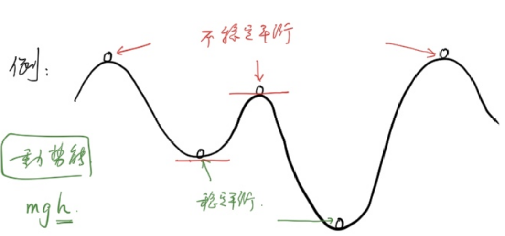
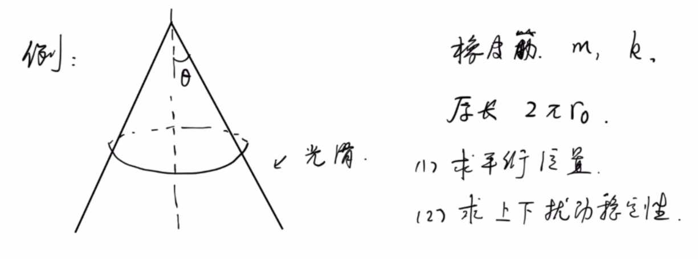
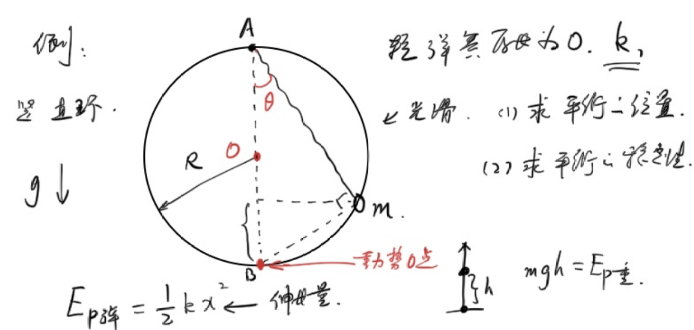
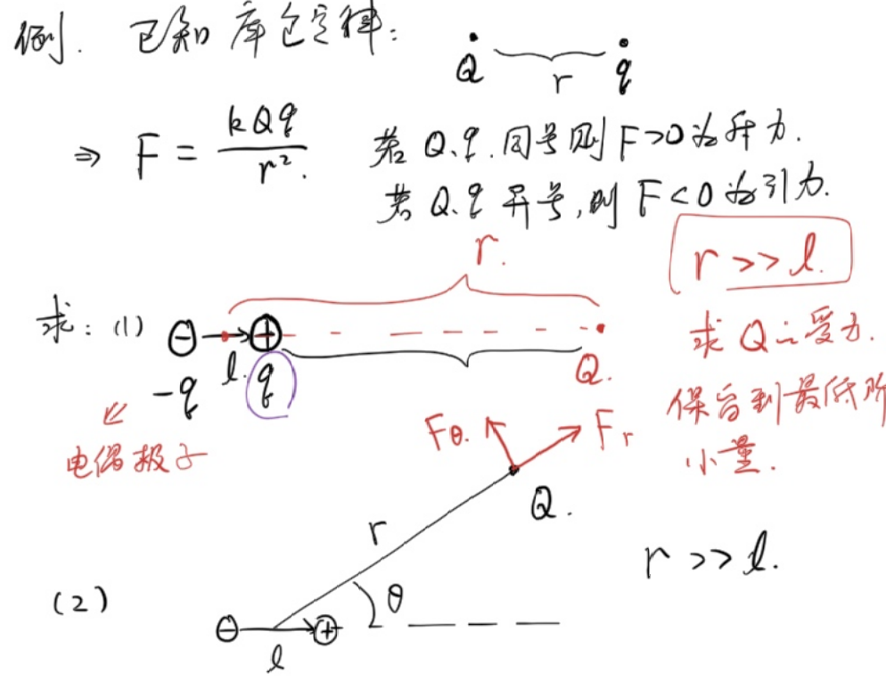
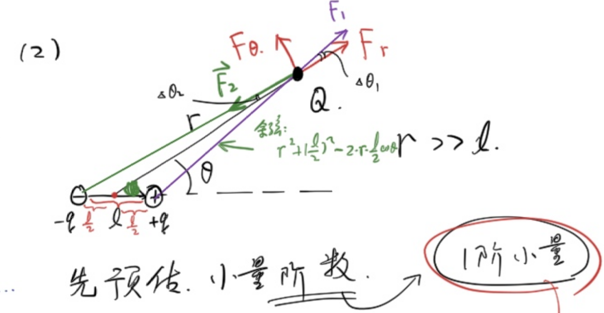

## Pick up flowers in the morning and evening

### Example 1
There is a cone with uniform mass, the angle between its generatrix and the height is $\theta$, the radius of the base is $r$, and the density is $\rho$.

(1) Find the total mass

(2) Find the position of the center of gravity

Let the origin be the top of the cone and the height of the cone be the x-axis

(1)

$$\begin{gathered}
dm=\rho Sdh\\
=\pi\rho (h\tan\theta)^2dh\\
m=\int dm\\
=\pi\rho\tan^2\theta\int_0^{r\cot\theta}h^2dh\\
=\pi\rho\tan^2\theta\left(\frac{1}{3}h^3)\right|_0^{r\cot\theta}\\
=\frac{1}{3}\pi\rho r^3\cot\theta
\end{gathered}$$

(2)

From the symmetry, the center of gravity is at the height of the cone.

$$\begin{gathered}
x_c=\frac{\int m_ix_i}{m}\\
=\frac{\int_0^{r\cot\theta}\pi\rho\tan^2\theta x^3dx}{m}\\
=\frac{\pi\rho\tan^2\theta\int_0^{r\cot\theta}x^3dx}{\frac{1}{3}\pi\rho r^3\cot\theta}\\
=3\frac{\tan^3\theta}{r^3}\frac{(r\cot\theta)^4}{4}\\
=\frac{3}{4}r\cot\theta
\end{gathered}$$

### Example 3
Find the position of the center of gravity of the uniform hemispheric shell**

With the center of the sphere as the origin, the vertical cross-section direction is the x-axis

Let’s assume that the mass per unit area is 1.

Following the example of finding the volume of an n-dimensional sphere, we consider cutting each one at $\theta,d\theta$.

#### Essential difference from hemispherical shell

| | Volume of n-dimensional sphere | Area of hemispherical shell |
|---|---|---|
| Slicing method | Horizontal slice, thickness $\|dy\| = R\sin\theta\,d\theta$| Spherical annular shape, arc length $dl = R\,d\theta$|
|$R\sin\theta\,d\theta$| ✅ Correct (vertical thickness) | ❌ Wrong (should be arc length) |

$$\begin{gathered}
  dm=(2\pi R\sin\theta)Rd\theta\\
  x_c=\frac{\int_{0}^{\frac{\pi}{2}} R\cos\theta dm}{2\pi R^2}\\
  =\frac{2\pi R^3\int_{0}^{\frac{\pi}{2}}\sin\theta\cos\theta d\theta}{2\pi R^2}\\
  =\frac{2\pi R^3\int_{0}^{\frac{\pi}{2}}\sin\theta d\sin\theta}{2\pi R^2}\\
  =\frac{2\pi R^3\int_{0}^{1}udu}{2\pi R^2}\\
  =\frac{2\pi R^3\times\frac{1}{2}}{2\pi R^2}\\
  =\frac{1}{2}R
\end{gathered}$$

### Example 4
Find the position of the center of gravity of the uniform hemispheric body**

With the center of the sphere as the origin, the vertical cross-section direction is the x-axis

Let’s assume that the mass per unit volume is 1.

We cross the parallel section:

#### Method 1

$$\begin{gathered}
  dm=\pi (R\sin\theta)^2\sin\theta Rd\theta\\
  x_c=\frac{\int R\cos\theta dm}{\frac{2}{3}\pi R^3}\\
  =\frac{\pi R^4\int_{0}^{\frac{\pi}{2}}\sin^3\theta\cos\theta d\theta}{\frac{2}{3}\pi R^3}\\
  =\frac{3}{2}R\int_{0}^{\frac{\pi}{2}}\sin^3\theta d\sin\theta\\
  =\frac{3}{2}R\int_{0}^1u^3du\\
  =\frac{3}{8}R
\end{gathered}$$

#### Method 2

$$\begin{gathered}
  dm=\pi (R^2-x^2)dx\\
  x_c=\frac{\int dmx}{\frac{2}{3}\pi R^3}\\
  =\frac{\pi \int_{0}^R (R^2-x^2)xdx}{\frac{2}{3}\pi R^3}\\
  =\frac{\pi \left(\frac{R^2}{2}x^2-\frac{1}{4}x^4\right)|_0^R}{\frac{2}{3}\pi R^3}\\
  =\frac{3}{8}R
\end{gathered}$$

### Balanced stability
Under **conservative force**, if the potential energy is at an extreme value, it is equilibrium:

- Potential energy is at a maximum value: unstable equilibrium
-Potential energy is at a minimum: stable equilibrium

Explanation: The work done by the conservative force has nothing to do with the path, but is only related to the initial and final positions.

Gravity, gravitation, and electrostatic forces are all conservative forces

Friction is a typical non-conservative force

# The second sufficient condition for the extreme value of the derivative

### Theorem content
Let the function $f(x)$ have a second derivative at the point $x_0$, and $f'(x_0) = 0$ (that is, $x_0$ is a stationary point):

1. If $f''(x_0) < 0$, then $f(x)$ obtains the **maximum value** at $x_0$.
2. If $f''(x_0) > 0$, then $f(x)$ obtains the **minimum value** at $x_0$.
3. If $f''(x_0) = 0$, then the theorem **invalid**, and it is impossible to determine whether an extreme value has been obtained (the first sufficient condition or a higher-order derivative needs to be used to determine).

---

### Application examples
Find the extreme value of function $f(x) = x^3 - 3x$.

**Solution:**
First find the first derivative:
$$f'(x) = 3x^2 - 3$$

Let $f'(x) = 0$, the solution to the stationary point is:
$$x_1 = 1, \quad x_2 = -1$$

Then find the second derivative:
$$f''(x) = 6x$$

Substitute the stationary point into the second derivative to judge:
* For $x_1 = 1$:
  $$f''(1) = 6 > 0$$
So $f(x)$ obtains the **minimum value** at $x = 1$, and the minimum value is $f(1) = -2$.
* For $x_2 = -1$:
  $$f''(-1) = -6 < 0$$
So $f(x)$ obtains the **maximum value** at $x = -1$, and the maximum value is $f(-1) = 2$.

### Example 5
There is a rubber band with mass $m$, stiffness coefficient $k$, and original length $2\pi r_0$, located on a cone whose angle between the busbar and the vertical line is $\theta$.

(1) Find the equilibrium position

(2) Find the stability of upper and lower disturbances

(1)

Suppose the height difference from the equilibrium position to the top of the cone is $z$, and the extension of the rubber band at equilibrium is $x$

$$\begin{gathered}
x=2\pi (z\tan\theta-r_0)\\
E_p=\frac{1}{2}kx^2-mgz\\
=2\pi^2 k(z\tan\theta-r_0)^2-mgz\\
=2\pi^2k\tan^2\theta z^2-(mg+4\pi^2kr_0\tan\theta)z+2\pi^2kr_0^2\\
z_0=\frac{mg+4\pi^2kr_0\tan\theta}{4\pi^2k\tan^2\theta}
\end{gathered}$$

(2)

$E_p(z)$ obtains the minimum value at $z=z_0$, so the equilibrium is a stable equilibrium.

### Example 6
The radius of the smooth ring is $R$. One end of the spring is hung directly above the ring, and the other end is tied to a small ball with mass $m$. The ring passes through the small ball. The original length of the spring is 0 and the stiffness coefficient is $k$

(1) Find the equilibrium position

(2) Find the stability of equilibrium.

(1)

Let the angle between the spring and the vertical direction be $\theta$

$$\begin{gathered}
E_p=\frac{1}{2}k(2R\cos\theta)^2+mg(2R\sin^2\theta)\\
=2kR^2\cos^2\theta+2mgR(1-\cos^2\theta)\\
=2R(kR-mg)\cos^2\theta+2mgR\\
\frac{dE_p}{d\theta}=4R(mg-kR)\cos\theta\sin\theta=0\\
\rightarrow \sin2\theta=0\\
\theta=0 \text{ or } \frac{\pi}{2}
\end{gathered}$$

The equilibrium positions are point A and point B

(2)

$$\begin{gathered}
  \frac{d^2E_p}{d\theta^2}=4R(mg-kR)\cos2\theta
\end{gathered}$$

If $mg\lt kR$, then when $\theta=0$, $\frac{d^2E_p}{d\theta^2}\lt0$

It is the potential energy maximum point, and point B is an unstable equilibrium.

When $\theta=\frac{\pi}{2}$, $\frac{d^2E_p}{d\theta^2}\gt0$

It is the potential energy minimum point, and point A belongs to stable equilibrium.

$mg\gt kR$, the opposite is true

## Small expansion
### Example 7
$f(x)=\sqrt{x}$, estimated $f(4.01)$

### Taylor Expand
**Duck Principle**: If something looks like a duck, sounds like a duck, and eats meat that tastes like a duck, then it is a duck.

Continuously obtain more information to get closer to the truth

$$
\boxed{f(x_0+x)=f(x_0)+f'(x_0)x+\frac{f''(x)}{2!}x^2+\frac{f'''(x)}{3!}x^3+...}
$$

### Example 8
$f(x)=x^\alpha$ Expansion near 1:

$$\begin{gathered}
  f'(x)=\alpha x^{\alpha-1},f'(1)=\alpha\\
  f''(x)=\alpha(\alpha-1)x^{\alpha-2},f''(1)=\alpha(\alpha-1)\\
  ...\\
  f(1+x)=1+\alpha x+\frac{\alpha(\alpha-1)}{2}x^2+...\\
  \text{where }|x|\lt 1
\end{gathered}$$

In the same way, other common Taylor expansions are obtained

$$\begin{gathered}
  \sin\theta=\theta-\frac{1}{3!}\theta^3+\frac{1}{5!}\theta^5+...\\
  \cos\theta=1-\frac{1}{2!}\theta^2+\frac{1}{4!}\theta^4\\
  e^x=1+x+\frac{1}{2!}x^2+\frac{1}{3!}x^3+...\\
  \ln (1+x)=x-\frac{1}{2}x^2+\frac{1}{3}x^3-...
\end{gathered}$$

### Example 9
Proof: $1+e^{i\pi}=0$ or $e^{i\theta}=\cos\theta+i\sin\theta$, where $i$ is the imaginary unit.

Bringing $i\theta$ into $e^x$ Taylor expansion is easy to prove.

### Example 10
# Example: Force on an electric dipole

## Known conditions

Coulomb's law:

$$F = \frac{kQq}{r^2}$$

- If $Q$ and $q$ have the same sign, then $F > 0$ is the **repulsive force**
- If $Q$ and $q$ have different signs, then $F < 0$ is **gravity**

---

## Title

An **electric dipole** consists of a pair of equal dissimilar charges $+q$ and $-q$, with a distance of $l$.

### Request:

**(1)** The force on the point charge $Q$ at a distance $r$ from the center of the dipole on the extended axis of the electric dipole.

> Condition: $r \gg l$, reserved to the lowest order epsilon.

**(2)** The force (decomposed into a radial component $F_r$ and a tangential component $F_\theta$) on a point charge $Q$ at a distance $r$ from the center of the dipole when the axis of the electric dipole forms an angle $\theta$ with the connecting line.

> Condition: $r \gg l$, reserved to the lowest order epsilon.

(1)

$$\begin{gathered}
  F=\frac{kQq}{(r-\frac{l}{2})^2}+\frac{kQ(-q)}{(r+\frac{l}{2})^2}\\
  =\frac{kQq}{r^2}[(1-\frac{l}{2r})^{-2}-(1+\frac{l}{2r})^{-2}]\\
  \approx \frac{kQq}{r^2}{\frac{2l}{r}}\\
  =\frac{2kQql}{r^3}
\end{gathered}$$

Among them $p=ql$ is called **dipole moment**

(2)

$$\begin{gathered}
  F_r=F_1\cos\Delta\theta_1-F_2\cos\Delta\theta_2\\
  =F_1(1-\frac{1}{2}\Delta\theta_1^2)-F_2(1-\frac{1}{2}\Delta\theta_2^2)\\
  \xlongequal{\text{neglect second-order infinitesimals}}F_1-F_2\\
  =\frac{kQq}{r^2+(\frac{l}{2})^2-2r\frac{l}{2}\cos\theta}-\frac{kQq}{r^2+(\frac{l}{2})^2+2r\frac{l}{2}\cos\theta}\\
  =\frac{kQq}{r^2}(\frac{1}{1-\frac{l}{r}\cos\theta+\frac{l^2}{4r^2}}-\frac{1}{1+\frac{l}{r}\cos\theta+\frac{l^2}{4r^2}})\\
  \xlongequal{\text{Taylor expansion}}\frac{kQq}{r^2}(\frac{2l\cos\theta}{r})\\
  =\frac{2kQql\cos\theta}{r^3}
\end{gathered}$$

$$\begin{gathered}
F_\theta=\frac{kQql\sin\theta}{r^3}
\end{gathered}$$

### Example 11
In relativity, the total energy of an object $E=mc^2$

Where $m$ is the **dynamic mass**: $m=\frac{1}{\sqrt{1-\frac{v^2}{c^2}}}m_0$

Among them, $v$ is the speed of the object, $c$ is the speed of light, and $m_0$ is the **static mass**

Call $E_0=m_0c^2$ static energy, and we have

$$\boxed{E_k=E-E_0}$$

According to classical physics $E_k=\frac{1}{2}mv^2$

Proof: At $v\lt\lt c$, $E_k$ in the theory of relativity is reduced to kinetic energy in classical physics

$$\begin{gathered}
E_k=\frac{1}{\sqrt{1-\frac{v^2}{c^2}}}m_0c^2-m_0c^2\\
=m_0c^2[(1-\frac{v^2}{c^2})^{\frac{-1}{2}}-1]\\
\xlongequal{\text{retain first-order infinitesimals}}\frac{1}{2}m_0v^2
\end{gathered}$$

### Example 12
There is a glass of sugar water, its density $\rho(x)$ is related to depth, $\rho(x)=\rho_0e^\frac{x}{l_0}$

There is a uniform hard rod with density $\rho_1=1.5\rho_0$, cross-sectional area $S$ and length $l_0$

When seeking equilibrium, the distance from the top to the water surface (is it above or below the water surface?).

$m_0=\rho_1Sl_0=1.5\rho_0Sl_0$

Assuming that the upper end is on the water, the length immersed in the water $x_0\lt l_0$

$$\begin{gathered}
  F=\int_{0}^{x_0}\rho(x)gSdx\\
  =\rho_0gS\int_{0}^{x_0}e^\frac{x}{l}dx\\
  =\rho_0gSl(e^{\frac{x_0}{l}}-1)
\end{gathered}$$

Request $F=m_0g=\rho_1Sl_0=1.5\rho_0gSl_0$

That is $e^\frac{x_0}{l_0}=2.5,x_0\lt l_0$, assuming that

Sonnet 4.6 Summary
---
## Summary

This section focuses on the core application of calculus in physical modeling and connects the following main lines:

**Center of mass calculation**: Through differential integration, the center of gravity positions of the uniform cone ($\frac{3}{4}r\cot\theta$), hemispherical shell ($\frac{1}{2}R$) and hemisphere ($\frac{3}{8}R$) were solved respectively, and the impact of the selection of slicing method on the integral was experienced.

**Balance and Stability**: Introduce the potential energy extreme value criterion-minimum potential energy corresponds to stable equilibrium, and maximum potential energy corresponds to unstable equilibrium. Through the two models of the rubber band on the cone and the ring spring ball, this criterion is embodied as a symbolic analysis of the second derivative of $E_p$.

**Taylor expansion and small quantity approximation**: Master common expansions such as $(1+x)^\alpha$, $\sin\theta$, $\cos\theta$, $e^x$, $\ln(1+x)$ and other common expansions, and apply them to:
- Force on the electric dipole (induced dipole moment $p = ql$)
- Relativistic kinetic energy reduces to $\frac{1}{2}m_0v^2$ at $v \ll c$
- Buoyancy equilibrium of hard rods in sugar water with non-uniform density

**Core idea**: The key to complex problems often lies in selecting appropriate microelements and coordinate systems, and then combining small expansions to retain the main terms, thereby turning tedious precise calculations into concise approximate results.
