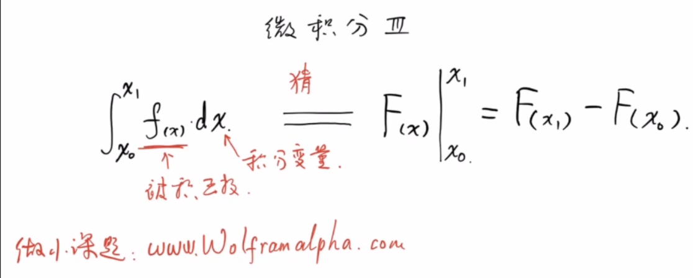
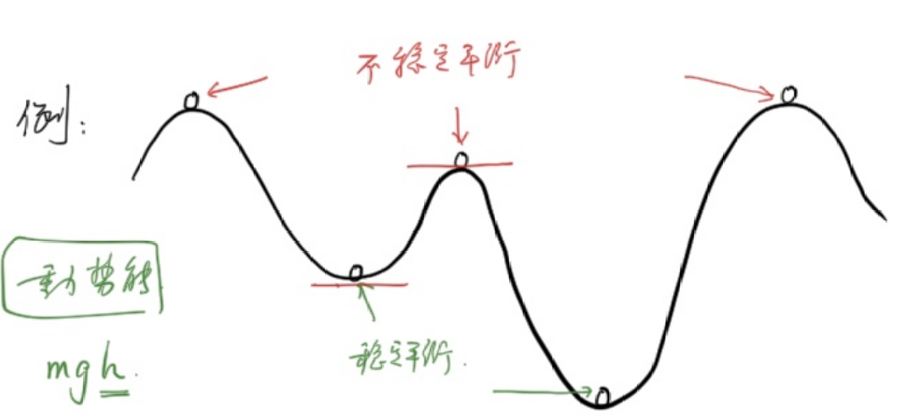
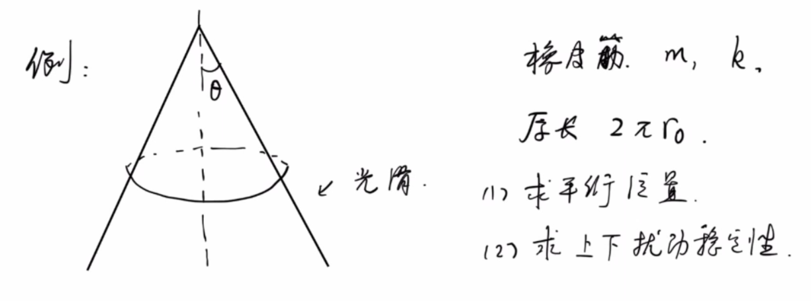
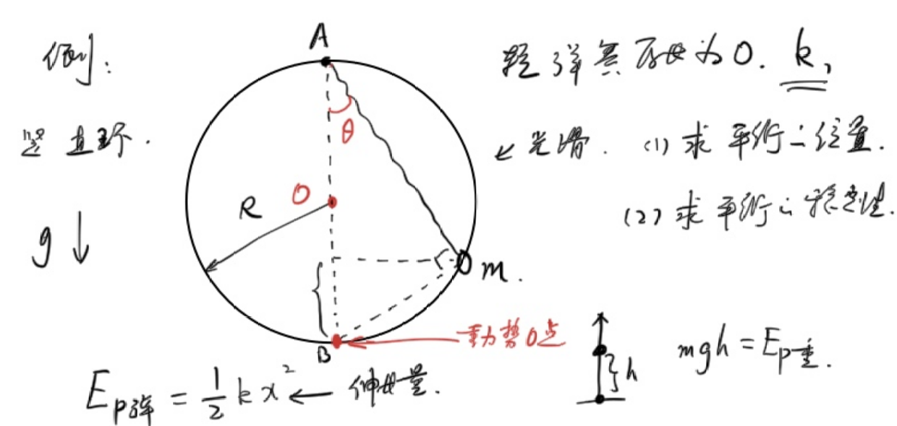
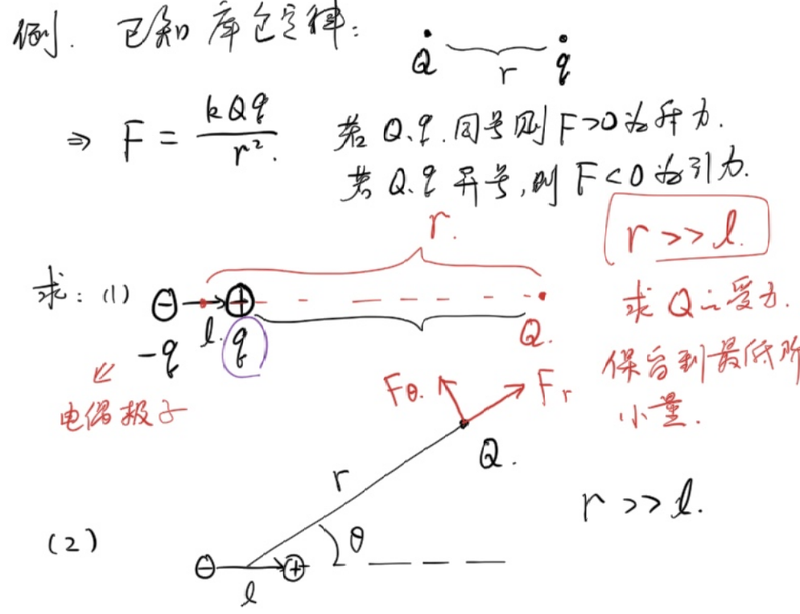
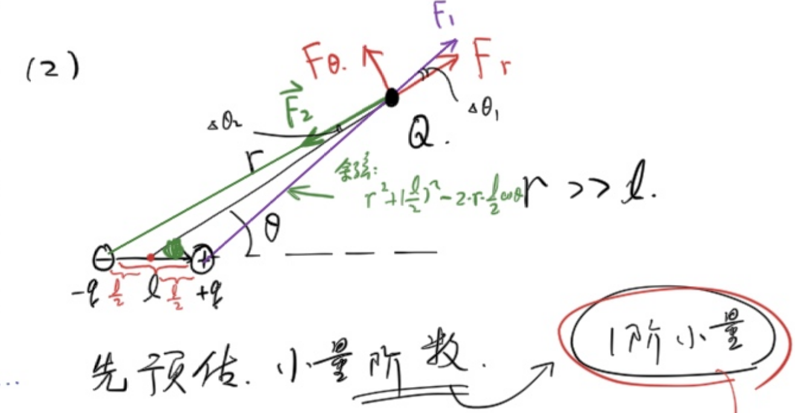

## 朝花夕拾

### 例1
有一个质量均匀的圆锥，其母线与高的夹角为$\theta$，底面半径为$r$,密度为$\rho$.

(1)求总质量

(2)求重心位置

设原点为锥顶，圆锥的高为x轴

(1)

$$\begin{gathered}
dm=\rho Sdh\\
=\pi\rho (h\tan\theta)^2dh\\
m=\int dm\\
=\pi\rho\tan^2\theta\int_0^{r\cot\theta}h^2dh\\
=\pi\rho\tan^2\theta\left(\frac{1}{3}h^3)\right|_0^{r\cot\theta}\\
=\frac{1}{3}\pi\rho r^3\cot\theta
\end{gathered}$$

(2)

由对称性知，重心在圆锥的高上.

$$\begin{gathered}
x_c=\frac{\int m_ix_i}{m}\\
=\frac{\int_0^{r\cot\theta}\pi\rho\tan^2\theta x^3dx}{m}\\
=\frac{\pi\rho\tan^2\theta\int_0^{r\cot\theta}x^3dx}{\frac{1}{3}\pi\rho r^3\cot\theta}\\
=3\frac{\tan^3\theta}{r^3}\frac{(r\cot\theta)^4}{4}\\
=\frac{3}{4}r\cot\theta
\end{gathered}$$

### 例3
求均匀半球**壳**的重心位置

以球心为原点，垂直截面方向为x轴

不妨设单位面积质量为1.

仿照求n维球的体积，我们考虑在$\theta,d\theta$处各切一刀。

#### 与半球壳的本质区别

| | n维球体积 | 半球壳面积 |
|---|---|---|
| 切片方式 | 水平薄片，厚度 $\|dy\| = R\sin\theta\,d\theta$ | 球面环形，弧长 $dl = R\,d\theta$ |
| $R\sin\theta\,d\theta$ | ✅ 正确（竖直厚度） | ❌ 错误（应为弧长） |

$$\begin{gathered}
  dm=(2\pi R\sin\theta)Rd\theta\\
  x_c=\frac{\int_{0}^{\frac{\pi}{2}} R\cos\theta dm}{2\pi R^2}\\
  =\frac{2\pi R^3\int_{0}^{\frac{\pi}{2}}\sin\theta\cos\theta d\theta}{2\pi R^2}\\
  =\frac{2\pi R^3\int_{0}^{\frac{\pi}{2}}\sin\theta d\sin\theta}{2\pi R^2}\\
  =\frac{2\pi R^3\int_{0}^{1}udu}{2\pi R^2}\\
  =\frac{2\pi R^3\times\frac{1}{2}}{2\pi R^2}\\
  =\frac{1}{2}R
\end{gathered}$$

### 例4
求均匀半球**体**的重心位置

以球心为原点，垂直截面方向为x轴

不妨设单位体积质量为1.

我们平行截面横切：

#### 法一

$$\begin{gathered}
  dm=\pi (R\sin\theta)^2\sin\theta Rd\theta\\
  x_c=\frac{\int R\cos\theta dm}{\frac{2}{3}\pi R^3}\\
  =\frac{\pi R^4\int_{0}^{\frac{\pi}{2}}\sin^3\theta\cos\theta d\theta}{\frac{2}{3}\pi R^3}\\
  =\frac{3}{2}R\int_{0}^{\frac{\pi}{2}}\sin^3\theta d\sin\theta\\
  =\frac{3}{2}R\int_{0}^1u^3du\\
  =\frac{3}{8}R
\end{gathered}$$

#### 法二

$$\begin{gathered}
  dm=\pi (R^2-x^2)dx\\
  x_c=\frac{\int dmx}{\frac{2}{3}\pi R^3}\\
  =\frac{\pi \int_{0}^R (R^2-x^2)xdx}{\frac{2}{3}\pi R^3}\\
  =\frac{\pi \left(\frac{R^2}{2}x^2-\frac{1}{4}x^4\right)|_0^R}{\frac{2}{3}\pi R^3}\\
  =\frac{3}{8}R
\end{gathered}$$

### 平衡的稳定性
在**保守力**下，若势能处于极值时，则平衡：

- 势能处在极大值：不稳定平衡
- 势能处在极小值：稳定平衡

说文解字：保守力做功与路径无关，只与初末位置相关

重力，引力，静电力都是保守力

摩擦力是典型的非保守力

# 导数极值第二充分条件

### 定理内容
设函数 $f(x)$ 在点 $x_0$ 处具有二阶导数，且 $f'(x_0) = 0$（即 $x_0$ 为驻点）：

1. 若 $f''(x_0) < 0$，则 $f(x)$ 在 $x_0$ 处取得**极大值**。
2. 若 $f''(x_0) > 0$，则 $f(x)$ 在 $x_0$ 处取得**极小值**。
3. 若 $f''(x_0) = 0$，则该定理**失效**，无法判定是否取得极值（需使用第一充分条件或更高阶导数判断）。

---

### 应用示例
求函数 $f(x) = x^3 - 3x$ 的极值。

**解：**
首先求一阶导数：
$$f'(x) = 3x^2 - 3$$

令 $f'(x) = 0$，解得驻点为：
$$x_1 = 1, \quad x_2 = -1$$

再求二阶导数：
$$f''(x) = 6x$$

将驻点代入二阶导数进行判断：
* 对于 $x_1 = 1$：
  $$f''(1) = 6 > 0$$
  所以 $f(x)$ 在 $x = 1$ 处取得**极小值**，极小值为 $f(1) = -2$。
* 对于 $x_2 = -1$：
  $$f''(-1) = -6 < 0$$
  所以 $f(x)$ 在 $x = -1$ 处取得**极大值**，极大值为 $f(-1) = 2$。

### 例5
有一个质量为$m$,劲度系数为$k$,原长为$2\pi r_0$的橡皮筋，位于母线与高线夹角为$\theta$的圆锥上.

(1)求平衡位置

(2)求上下扰动稳定性

(1)

设平衡位置到锥顶的高度差为$z$,平衡时橡皮筋伸长量为$x$

$$\begin{gathered}
x=2\pi (z\tan\theta-r_0)\\
E_p=\frac{1}{2}kx^2-mgz\\
=2\pi^2 k(z\tan\theta-r_0)^2-mgz\\
=2\pi^2k\tan^2\theta z^2-(mg+4\pi^2kr_0\tan\theta)z+2\pi^2kr_0^2\\
z_0=\frac{mg+4\pi^2kr_0\tan\theta}{4\pi^2k\tan^2\theta}
\end{gathered}$$

(2)

$E_p(z)$在$z=z_0$处取得极小值，故平衡为稳定平衡.

### 例6
光滑圆环半径为$R$,弹簧一端挂在圆环正上方,另一端拴着质量为$m$的小球.圆环穿过小球.弹簧原长为0,劲度系数为$k$

(1)求平衡位置

(2)求平衡的稳定性.

(1)

设弹簧与竖直方向夹角为$\theta$

$$\begin{gathered}
E_p=\frac{1}{2}k(2R\cos\theta)^2+mg(2R\sin^2\theta)\\
=2kR^2\cos^2\theta+2mgR(1-\cos^2\theta)\\
=2R(kR-mg)\cos^2\theta+2mgR\\
\frac{dE_p}{d\theta}=4R(mg-kR)\cos\theta\sin\theta=0\\
\rightarrow \sin2\theta=0\\
\theta=0 \text{ or } \frac{\pi}{2}
\end{gathered}$$

平衡位置为A点，B点

(2)

$$\begin{gathered}
  \frac{d^2E_p}{d\theta^2}=4R(mg-kR)\cos2\theta
\end{gathered}$$

若$mg\lt kR$，则$\theta=0$时，$\frac{d^2E_p}{d\theta^2}\lt0$

为势能极大值点，B点属于不稳定平衡.

$\theta=\frac{\pi}{2}$时，$\frac{d^2E_p}{d\theta^2}\gt0$

为势能极小值点，A点属于稳定平衡

$mg\gt kR$,情况恰相反

## 小量展开
### 例7
$f(x)=\sqrt{x}$,估算$f(4.01)$

### 泰勒展开
**鸭子原则**：有一个长得像鸭子的东西，听声音也很像鸭子，吃肉也是鸭子味，那这就是一只鸭子

不断地获得更多的信息，即可逼近真相

$$
\boxed{f(x_0+x)=f(x_0)+f'(x_0)x+\frac{f''(x)}{2!}x^2+\frac{f'''(x)}{3!}x^3+...}
$$

### 例8
$f(x)=x^\alpha$在1附近的展开:

$$\begin{gathered}
  f'(x)=\alpha x^{\alpha-1},f'(1)=\alpha\\
  f''(x)=\alpha(\alpha-1)x^{\alpha-2},f''(1)=\alpha(\alpha-1)\\
  ...\\
  f(1+x)=1+\alpha x+\frac{\alpha(\alpha-1)}{2}x^2+...\\
  \text{其中,}|x|\lt 1
\end{gathered}$$

同理得到其他常见泰勒展开

$$\begin{gathered}
  \sin\theta=\theta-\frac{1}{3!}\theta^3+\frac{1}{5!}\theta^5+...\\
  \cos\theta=1-\frac{1}{2!}\theta^2+\frac{1}{4!}\theta^4\\
  e^x=1+x+\frac{1}{2!}x^2+\frac{1}{3!}x^3+...\\
  \ln (1+x)=x-\frac{1}{2}x^2+\frac{1}{3}x^3-...
\end{gathered}$$

### 例9
证明:$1+e^{i\pi}=0$或$e^{i\theta}=\cos\theta+i\sin\theta$，其中$i$为虚数单位.

把$i\theta$带入$e^x$泰勒展开易证.

### 例10
# 例题：电偶极子的受力

## 已知条件

库仑定律：

$$F = \frac{kQq}{r^2}$$

- 若 $Q$、$q$ 同号，则 $F > 0$，为**斥力**
- 若 $Q$、$q$ 异号，则 $F < 0$，为**引力**

---

## 题目

**电偶极子**由一对等量异种电荷 $+q$ 与 $-q$ 组成，两者间距为 $l$。

### 求：

**(1)** 电偶极子轴线延长线上，距偶极子中心距离为 $r$ 处的点电荷 $Q$ 所受的力。

> 条件：$r \gg l$，保留到最低阶小量。

**(2)** 电偶极子轴线与连线成 $\theta$ 角、距偶极子中心距离为 $r$ 处的点电荷 $Q$ 所受的力（分解为径向分量 $F_r$ 和切向分量 $F_\theta$）。

> 条件：$r \gg l$，保留到最低阶小量。

(1)

$$\begin{gathered}
  F=\frac{kQq}{(r-\frac{l}{2})^2}+\frac{kQ(-q)}{(r+\frac{l}{2})^2}\\
  =\frac{kQq}{r^2}[(1-\frac{l}{2r})^{-2}-(1+\frac{l}{2r})^{-2}]\\
  \approx \frac{kQq}{r^2}{\frac{2l}{r}}\\
  =\frac{2kQql}{r^3}
\end{gathered}$$

其中$p=ql$，称为**偶极矩**

(2)

$$\begin{gathered}
  F_r=F_1\cos\Delta\theta_1-F_2\cos\Delta\theta_2\\
  =F_1(1-\frac{1}{2}\Delta\theta_1^2)-F_2(1-\frac{1}{2}\Delta\theta_2^2)\\
  \xlongequal{\text{忽略二阶小量}}F_1-F_2\\
  =\frac{kQq}{r^2+(\frac{l}{2})^2-2r\frac{l}{2}\cos\theta}-\frac{kQq}{r^2+(\frac{l}{2})^2+2r\frac{l}{2}\cos\theta}\\
  =\frac{kQq}{r^2}(\frac{1}{1-\frac{l}{r}\cos\theta+\frac{l^2}{4r^2}}-\frac{1}{1+\frac{l}{r}\cos\theta+\frac{l^2}{4r^2}})\\
  \xlongequal{\text{泰勒展开}}\frac{kQq}{r^2}(\frac{2l\cos\theta}{r})\\
  =\frac{2kQql\cos\theta}{r^3}
\end{gathered}$$

$$\begin{gathered}
F_\theta=\frac{kQql\sin\theta}{r^3}
\end{gathered}$$

### 例11
在相对论中，物体的总能量$E=mc^2$

其中$m$为**动质量**:$m=\frac{1}{\sqrt{1-\frac{v^2}{c^2}}}m_0$

其中$v$为物体速度，$c$为光速，$m_0$为**静质量**

称$E_0=m_0c^2$为静能量，有

$$\boxed{E_k=E-E_0}$$

而根据经典物理$E_k=\frac{1}{2}mv^2$

证明：在$v\lt\lt c$时，相对论中的$E_k$还原为经典物理学中的动能

$$\begin{gathered}
E_k=\frac{1}{\sqrt{1-\frac{v^2}{c^2}}}m_0c^2-m_0c^2\\
=m_0c^2[(1-\frac{v^2}{c^2})^{\frac{-1}{2}}-1]\\
\xlongequal{\text{保留一阶小量}}\frac{1}{2}m_0v^2
\end{gathered}$$

### 例12
有一杯糖水，其密度$\rho(x)$与深度相关,$\rho(x)=\rho_0e^\frac{x}{l_0}$

有一个密度为$\rho_1=1.5\rho_0$的均匀硬棒，截面积为$S$，长度为$l_0$

求平衡时，顶端到水面的距离(在水面上还是水面下?).

$m_0=\rho_1Sl_0=1.5\rho_0Sl_0$

假设上端在水面上,浸入水中的长度$x_0\lt l_0$

$$\begin{gathered}
  F=\int_{0}^{x_0}\rho(x)gSdx\\
  =\rho_0gS\int_{0}^{x_0}e^\frac{x}{l}dx\\
  =\rho_0gSl(e^{\frac{x_0}{l}}-1)
\end{gathered}$$

要求$F=m_0g=\rho_1Sl_0=1.5\rho_0gSl_0$

即$e^\frac{x_0}{l_0}=2.5,x_0\lt l_0$，假设成立

Sonnet 4.6总结
---
## 总结

本节围绕微积分在物理建模中的核心应用，串联了以下几条主线：

**质心计算**：通过微元积分，分别求解了均匀圆锥（$\frac{3}{4}r\cot\theta$）、半球壳（$\frac{1}{2}R$）和半球体（$\frac{3}{8}R$）的重心位置，体会切片方式的选取对积分的影响。

**平衡与稳定性**：引入势能极值判据——势能极小对应稳定平衡，势能极大对应不稳定平衡。通过圆锥上的橡皮筋和圆环弹簧小球两个模型，将该判据具体化为对 $E_p$ 二阶导数的符号分析。

**泰勒展开与小量近似**：掌握 $(1+x)^\alpha$、$\sin\theta$、$\cos\theta$、$e^x$、$\ln(1+x)$ 等常见展开式，并应用于：
- 电偶极子受力（引出偶极矩 $p = ql$）
- 相对论动能在 $v \ll c$ 下还原为 $\frac{1}{2}m_0v^2$
- 非均匀密度糖水中硬棒的浮力平衡

**核心思想**：复杂问题的关键往往在于选取合适的微元与坐标系，再结合小量展开保留主要项，从而将繁琐的精确计算化为简洁的近似结果。
