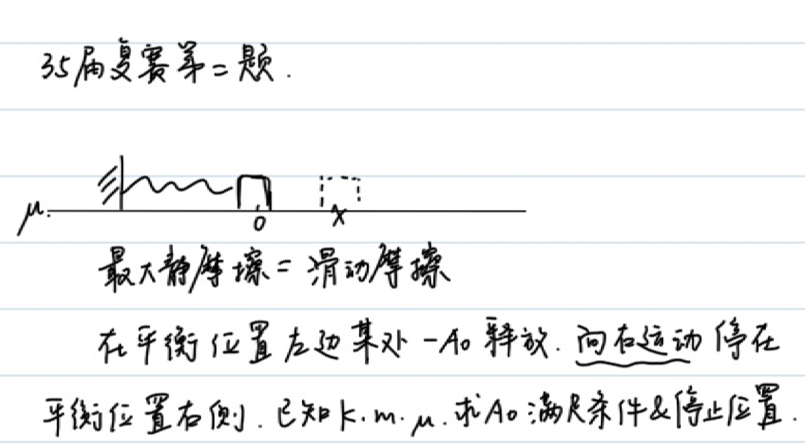
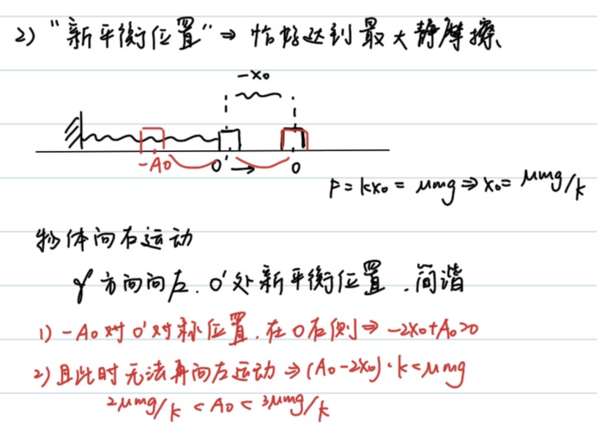
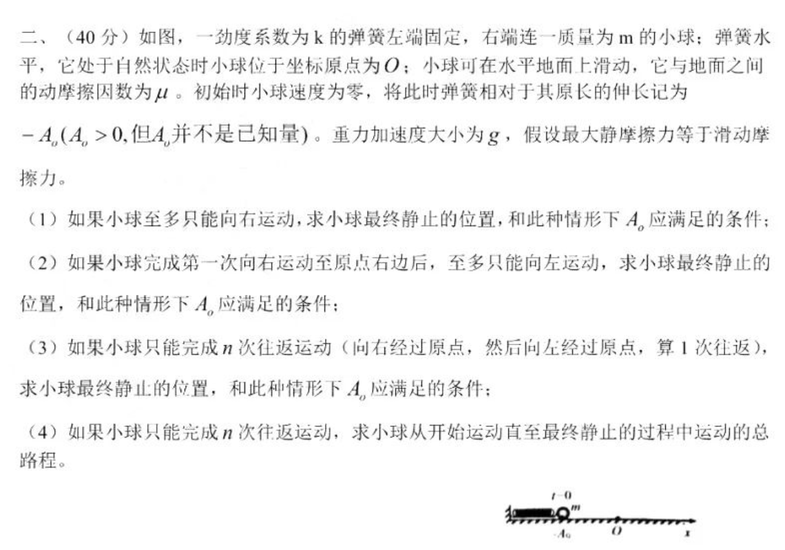
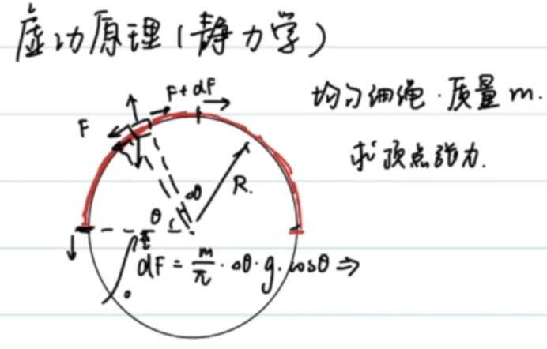
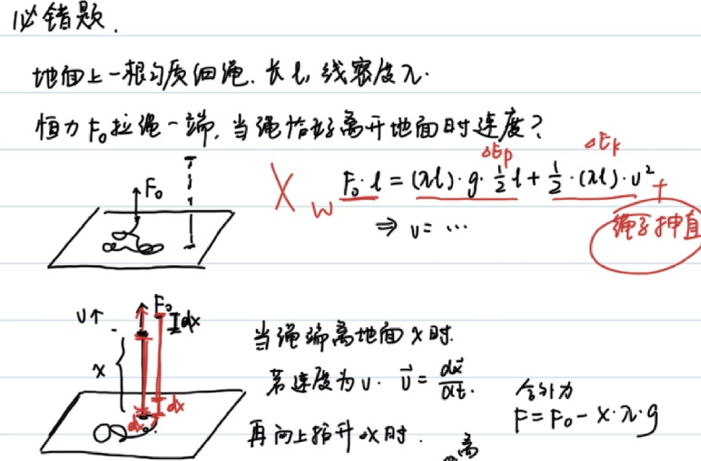
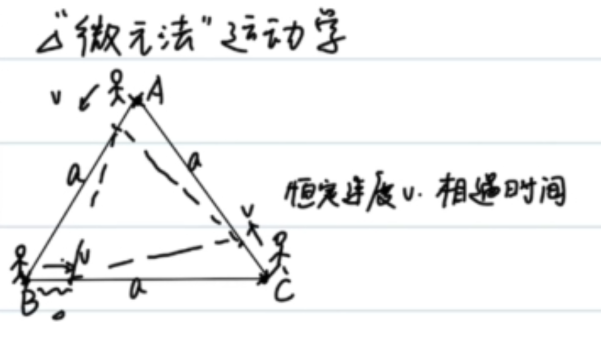
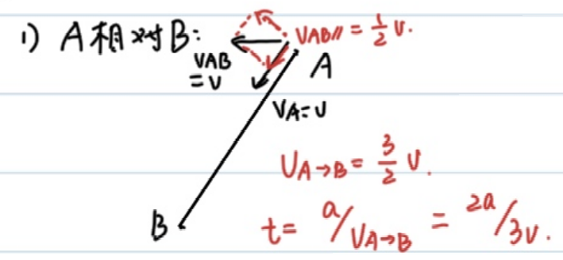
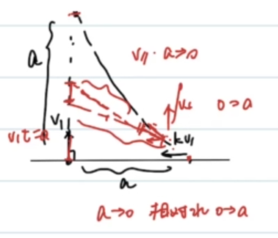
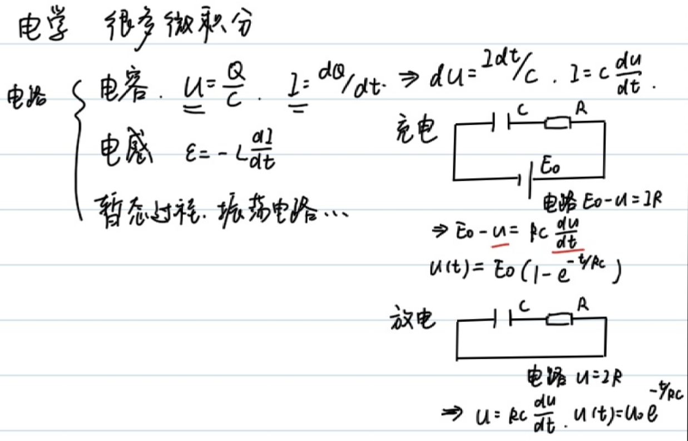

<!--more-->
### Example 1
$$\begin{gathered}
  mgh+\frac{1}{2}mv^2=C\\
  v=\frac{dh}{dt}\\
  mgh+\frac{1}{2}m(\frac{dh}{dt})^2=C\\
  \frac{dh}{dt}=\sqrt{\frac{2(C-mgh)}{m}}\\
  dt=\sqrt{\frac{m}{2(C-mgh)}}dh=\frac{\sqrt{2}}{2}(\frac{c}{m}-gh)^\frac{-1}{2}dh\\
  \int_0^t dt=\frac{\sqrt{2}}{2}\int_{h_0}^{h_t}(\frac{c}{m}-gh)^\frac{-1}{2}dh\\
  t=-\frac{\sqrt{2}}{g}(\frac{C}{m}-gh_t)^\frac{1}{2}+C'
\end{gathered}$$

### Example 2
In simple harmonic motion:

$$\begin{gathered}
  \vec{F}=-k\vec{x},\vec{v}=\frac{d\vec{x}}{dt},\vec{a}=\frac{d\vec{v}}{dt}=\frac{d^2\vec{x}}{dt^2}=\frac{-k}{m}x
\end{gathered}$$

Constructed differential equation:

$$\frac{d^2\vec{x}}{dt^2}=\frac{-k}{m}x$$

Alternative $x(t)$:
- $A\cos (\omega t+\phi)$
- $A\sin (\omega t+\phi)$
- $e^{\omega t+\phi}$

But $\frac{-k}{m}\lt 0$ can be excluded $e^{\omega t+\phi}$

Assume $x(t)=A\sin (\omega t+\phi)$, then:

$$\begin{gathered}
  v(t)=Aw\cos(\omega t+\phi)\\
  a(t)=-Aw^2\sin(\omega t+\phi)=\frac{-k}{m}A\sin(\omega t+\phi)
\end{gathered}$$

Solution: $\omega=\sqrt{\frac{k}{m}},\phi=\arcsin\frac{x_0}{A}$

Combined with the conservation of mechanical energy, the expression for the elastic potential energy of the spring can be derived:

When the spring oscillator is in the equilibrium position, assuming $E_{p_0}=0$, the elastic potential energy is minimum and the speed is maximum.

$$\begin{gathered}
  \frac{1}{2}mv^2+E_p=C\\
  \omega=\sqrt{\frac{k}{m}}\\
  v(t)=Aw\cos(\omega t+\phi)\\
  C=\frac{1}{2}m(Aw)^2
\end{gathered}$$

Solution: $E_p=\frac{1}{2}m(Aw\sin(\omega t+\phi))^2=\frac{1}{2}kx^2$

>[!NOTE]
>It is well known that simple harmonic motion can correspond to uniform circular motion one-to-one
>
>A point on the circle can determine the **size and direction** of the **displacement** and **velocity** of motion.

For simple harmonic motion, if you make a $v-x$ diagram, the image will be an ellipse:

$$\begin{cases}
  x=A\sin(\omega t+\phi)\\
  y=A\omega\cos(\omega t+\phi)\\
  \frac{x^2}{A^2}+\frac{y^2}{A^2\omega^2}=1
\end{cases}$$

### Example 3
(Second question of the 35th semi-finals - simplified version)

First, in order to be able to move in the first place, it must be true:

$$\begin{gathered}
  kA_0\gt \mu mg\\
  A_0\gt \frac{\mu mg}{k}
\end{gathered}$$

Then list the energy conservation during motion:

$$\begin{cases}
  \frac{1}{2}kA_0^2=\frac{1}{2}kx^2+(A_0+x)\mu mg,\\
  kx\lt \mu mg \rightarrow x\in (0,\frac{\mu mg}{k})
\end{cases}$$

Solution:

$$\begin{gathered}
  A_0^2=x^2+\frac{2}{k}(A_0+x)\mu mg\in (\frac{2\mu mg}{k}A_0,\frac{2\mu mg}{k}A_0+\frac{3\mu^2 m^2g^2}{k^2})
\end{gathered}$$

That is:

$$\begin{gathered}
  (A_0-\frac{\mu mg}{k})^2\in (\frac{\mu^2 m^2g^2}{k^2},\frac{4\mu^2 m^2g^2}{k^2})
\end{gathered}$$

(Aha) Finally got:

$A_0\in (\frac{2\mu mg}{k},\frac{3\mu mg}{k})$

Another solution: (synthesize elastic force and friction force, using the symmetry of simple harmonic motion)

## Radius of curvature
A curved motion can be regarded as the sum of several circular motions, and each physical quantity satisfies:

$$\begin{cases}
  \vec{F}=m\frac{\vec{v}^2}{\rho},\\
  \vec{a_n}=\frac{\vec{v}^2}{\rho}\hat{n},\\
  a_n = \frac{|\vec{a} \times \vec{v}|}{|\vec{v}|}, \quad a_t = \frac{\vec{a} \cdot \vec{v}}{|\vec{v}|}
\end{cases}$$

### Example 4
Find the radius of curvature of parabola $y=x^2$ at $x=0$

$$\begin{gathered}
  \vec{r}=(x,x^2)\\
  \vec{v}=(\frac{dx}{dt},2x\frac{dx}{dt})\\
  \vec{a}=(\frac{d^2x}{dt^2},2(\frac{dx}{dt})^2+2x\frac{d^2x}{dt^2})
\end{gathered}$$

Suppose $\frac{dx}{dt}=1$, that is, the particle moves at a constant speed in the horizontal direction. At $x=0$, the centripetal acceleration is along the y-axis direction and the tangential acceleration is 0:

$a_n=|\vec{a}|=2,\vec{v}=(1,0),|v|=1,\rho=\frac{v^2}{a_n}=\frac{1}{2}$
### Example 5
Given the ellipse $\frac{x^2}{a^2}+\frac{y^2}{b^2}=1(a>b>0)$, find the radius of curvature at the endpoint.

If the horizontal speed is set to be constant, problems will occur at the long axis; if the vertical speed is set to be constant, problems will also occur at the short axis.

We use polar coordinate substitution:

$$\begin{gathered}
\vec{x}=(a\cos(\omega t+\phi),b\sin(\omega t+\phi))\\
\vec{v}=(-a\omega\sin(\omega t+\phi),b\omega\cos(\omega t+\phi))\\
\vec{a}=(-a\omega^2\cos(\omega t+\phi),-b\omega^2\sin(\omega t+\phi))
\end{gathered}$$

At $(0,b)$, $\omega t+\phi=\frac{\pi}{2}$.

$$\begin{gathered}
  \vec{v}=(-a\omega,0)\\
  \vec{a_n}=\vec{a}=(0,-b\omega^2)\\
  \rho=\frac{|v|^2}{|a_n|}=\frac{a^2}{b}
\end{gathered}$$

At $(a,0)$, $\omega t+\phi=0$.

$$\begin{gathered}
  \vec{v}=(0,b\omega)\\
  \vec{a_n}=\vec{a}=(-a\omega^2,0)\\
  \rho=\frac{|v|^2}{|a_n|}=\frac{b^2}{a}
\end{gathered}$$

### Example 6
A long wooden stick is supported on a fixed circle. One end A moves at a constant speed on the ground with a speed of $v$. Find the speed of the intersection point P and the contact point E.

$$\begin{gathered}
  A(x,0)\\
  \frac{dx}{dt}=v\\
  P(\frac{r^2}{x},r\sqrt{1-\frac{r^2}{x^2}})\\
  \vec{v_p}=(v\frac{-r^2}{x^2},v\frac{r^3}{x^3}\frac{1}{\sqrt{1-\frac{r^2}{x^2}}})
\end{gathered}$$

Similarly, we find the velocity of the contact point E. Note that the constraint condition of the contact point is not on the circle, but the distance to point A remains unchanged.

$$\begin{gathered}
\vec{AP}=(\frac{r^2}{x}-x,r\sqrt{1-\frac{r^2}{x^2}})\\
|AP|=\sqrt{x^2-r^2}\\
\vec{l}=\frac{\vec{AP}}{|AP|}=(-\frac{\sqrt{x^2-r^2}}{x},\frac{r}{x})\\
E=A+|AP|\\
E'(t)=A'+|AP|\vec{l}'\\
=(v,0)+\sqrt{x^2-r^2}(-v\frac{2r^2}{x^3}\frac{1}{2\sqrt{1^2-\frac{r^2}{x^2}^2}},-v\frac{r}{x^2})\\
=(v(1-\frac{r^2}{x^2}),-v\frac{r}{x^2}\sqrt{x^2-r^2})
\end{gathered}$$

### Example 7 (Principle of virtual work)
There is a circle with a uniform string placed on the semicircle part and the mass is $m$. Find the tension at the vertex.

For the force analysis of countless tiny mass elements, consider the force balance along the tangential direction:

$$\begin{gathered}
  dF=\frac{d\theta}{\pi}mg\cos \theta\\
  \int_{0}^{F}=\frac{mg}{\pi}\int_{0}^\frac{\pi}{2}\cos\theta d\theta\\
  =\frac{mg}{\pi}
\end{gathered}$$

Of course, we have a highly technical approach: **Virtual Work Principle**.

Slowly pull the rope $\Delta x$, $F\Delta x=\frac{\Delta x}{\pi R}mgR$, then $F=\frac{mg}{\pi}$

Using the principle of virtual work, we can easily solve the problem of 2026 Chaoyang Senior High School Second Model T19(2)

### Example 8 (must be wrong)
A homogeneous thin rope on the ground, length $l$, linear density $\lambda$, vertical upward constant force $F_0$ pulls one end of the rope, the speed of the rope when it just leaves the ground $v_t$

$$\begin{gathered}
  \frac{1}{2}l\lambda gl+\frac{1}{2}l\lambda v_t^2=F_0l\\
  v_t=\sqrt{2F_0/\lambda-gl}
\end{gathered}$$

Unfortunately, this is a **standard error**. Extra work is required to straighten a tension-free rope, and the $v_t$ obtained by this method is too large.

When the rope end is away from the ground $x$, if the speed is $v$, $\vec{v}=\frac{d\vec{x}}{dt}$, and then lifts upward to $\Delta x$:

Momentum theorem: $Fdt=(x\lambda)dv+(dx \lambda)(v+dv)$

Approximating the second order epsilon:

$F=\lambda xdv+\lambda vdx=\lambda\frac{d(vx)}{dt}$

$Fdt=\lambda d(vx)$

But the time is unknown. If you use $dx=vdt$, you can solve this problem:

$Fx dx=\lambda vx(xdv+vdx)=\lambda (vx)d(vx)$

Note that $F$ here is the resultant external force, $F=F_0-x\lambda g$

$\int_0^l(F_0-x\lambda g)x dx=\int_{0}^{lv_t}\lambda (vx)d(vx)$

$\frac{1}{2}F_0l^2-\frac{1}{3}\lambda gl^3=\lambda\frac{1}{2}(v_tl)^2$

$\frac{1}{2}F_0-\frac{1}{3}\lambda gl=\lambda\frac{1}{2}(v_t)^2$

Solve $v_t=\sqrt{F_0/\lambda-\frac{2}{3}gl}$

### Example 9 ("Micro-element method" kinematics)

Considering symmetry, it is obvious that the figure composed of three people is always an equilateral triangle:

Decomposing the velocity along the connecting line direction, we can get:

$da=-\frac{3}{2}vdt$

$a=\frac{3}{2}vt$

Solve $t=\frac{2a}{3v}$

Let the angle between $kv$ and the vertical direction be $\theta$

$$\begin{gathered}
  vt_0=a\\
  \int_{0}^{t_0}kv\cos\theta dt=a\\
  \int_{0}^{t_0}kv\sin\theta dt=a\\
  dl=(-kvdt+vdt\cos\theta)\\
  \int_{a}^{0}dl=\int_0^{t_0}(-kvdt+vdt\cos\theta)\\
  -a=-kvt_0+\frac{a}{k}=-ka+\frac{a}{k}\\
  k^2-k-1=0\\
  k=\frac{1+\sqrt{5}}{2}
\end{gathered}$$

## Moment of inertia
Rigid bodies such as rods, plates, etc. (the distance between particles remains unchanged) - the motion of the particle system can be decomposed into **translation of the center of mass + rotation around the center of mass**

The Sun-Earth system can be regarded as a "binary star rotating" around the center of mass, and the center of mass of the two can be considered to be in translation around the center of the Milky Way (only for multiple mass points, there is the term rotation).

The sun/earth motion can be regarded as the translational motion of the sun-earth system around the galactic center + the rotation of the sun-earth around the center of mass.

Therefore, the force will produce translational motion with respect to the center of mass; the torque of the force will cause rotation.

### Newton’s second law of point system
$$\boxed{(\sum m)a_c=\sum{F}}$$
### Koenig (center of mass motion) theorem
$$\boxed{\sum{\frac{1}{2}m_iv_i^2}=\frac{1}{2}Mv^2+\sum{\frac{1}{2}m_iv_{ic}^2}}$$

Through $a_c$, it is not difficult to find $v_c$; now we hope to find the angular velocity of all particles rotating around the center of mass $\omega$ through the moment of the combined external force.

Torque $M=Fr$, angular acceleration $\beta=\frac{d\omega}{dt}$.

Definition: $M=I\beta$, where $I$ is the moment of inertia.

$$\boxed{I=\sum{m_ir_i^2}}$$

The calculation formula is as above, where $r_i$ is the distance from particle i to the center of mass.

### Example 10
Calculate the moment of inertia of a uniform rod about its center

$$\begin{gathered}
  I=2\int_{0}^\frac{l}{2}\frac{dx}{l}mx^2\\
  =\frac{1}{12}ml^2
\end{gathered}$$

### Example 11
Calculate the moment of inertia of a uniform rod about one end
$$\begin{gathered}
  I=\int_{0}^l\frac{dx}{l}mx^2=\frac{1}{3}ml^2
\end{gathered}$$

### Parallel axis theorem of moment of inertia
The moment of inertia of a rigid body about any axis of rotation is equal to the sum of the moment of inertia of a rigid body about an axis parallel to the center of mass and the product of the total mass of the rigid body and the square of the vertical distance between the two axes.

$$\boxed{I=I_c+Md^2}$$

For example 11, $I=I_c+m(\frac{1}{2}l)^2=\frac{1}{12}ml^2+\frac{1}{4}ml^2=\frac{1}{3}ml^2$

### Example 12
Find the moment of inertia of a uniform circular plate about an axis perpendicular to its center.

$$\begin{gathered}
  I=\int_{0}^{R}\frac{2\pi rdr}{\pi R^2}mr^2\\
  =\frac{2m}{R^2}\int_{0}^{R}r^3\\
  =\frac{1}{2}mR^2
\end{gathered}$$

### Analogy
| Force | Torque |
| --- | --- |
| $m$ | $I=\sum{m_ir_i^2}$ |
| $v$ | $\omega$ |
| $a$ | $\beta$ |
| $F=ma$ | $M=I\beta$ |
| $E=\frac{1}{2}mv^2$ | $E=\frac{1}{2}I\omega^2$ |

## Prospect

## Summary
This article uses a series of examples as clues to show how calculus can become a unified language for solving physical problems.

- **Differential equations and conservation of mechanical energy (Example 1, Example 2)**: List the differential equation of $\frac{dh}{dt}$ or $\frac{d^2\vec{x}}{dt^2}$ based on energy conservation, and then solve it by separating variables or trial solutions. In simple harmonic motion, we deduced $\omega=\sqrt{k/m}$ from $x(t)=A\sin(\omega t+\phi)$, and derived the elastic potential energy $E_p=\frac{1}{2}kx^2$ based on the conservation of mechanical energy. At the same time, we established the correspondence between simple harmonic motion, uniform circular motion, and $v$-$x$ ellipse diagrams.
- **Symmetry of simple harmonic motion (Example 3)**: In vibration problems involving friction, energy conservation is used together with the technique of "synthesizing elasticity and friction, and utilizing symmetry" to obtain the value range of the initial amplitude $A_0\in(\frac{2\mu mg}{k},\frac{3\mu mg}{k})$.
- **Radius of Curvature (Example 4-Example 6)**: Treat curved motion as instantaneous circular motion, use $\rho=\frac{v^2}{a_n}$ and $a_n=\frac{|\vec{a}\times\vec{v}|}{|\vec{v}|}$ to find the radius of curvature of the end points of parabola and ellipse; and avoid the trap of divergence of velocity components through appropriate parameterization (such as polar coordinate substitution).
- **The principle of virtual work and the problem of variable mass (Example 7 and 8)**: The principle of virtual work can quickly find the tension at the vertex of the semicircular rope $F=\frac{mg}{\pi}$; and for variable mass problems such as "ropes off the ground", the momentum theorem $F\,dx=\lambda\,(vx)\,d(vx)$ must be used to deal with the "extra work of straightening the tension-free rope", otherwise it will fall into the standard error given by energy conservation, and the correct result is $v_t=\sqrt{F_0/\lambda-\frac{2}{3}gl}$.
- **Micro-element method kinematics (Example 9)**: Use symmetry and velocity decomposition along the connecting direction to deal with the catch-up problem, and turn complex trajectories into simple micro-element relationships.
- **Moment of inertia (Example 10-Example 12)**: Decompose the motion of the rigid body into "translation of the center of mass + rotation around the center of mass". The moment of inertia $I=\sum m_i r_i^2$ is derived from Newton's second law of the particle system and Koenig's theorem. The moment of inertia of the rod and circular plate is calculated and verified by the parallel axis theorem $I=I_c+Md^2$. Finally, an analogy table of the amount of translation and the amount of rotation is given.

The core idea throughout the text is: **First select appropriate physical conservation quantities or dynamic equations, and then transform them into computable mathematical problems through differential modeling, integral solution or micro-element analysis**. Calculus is not only a calculation tool, but also provides a perspective for understanding mechanical structures.
