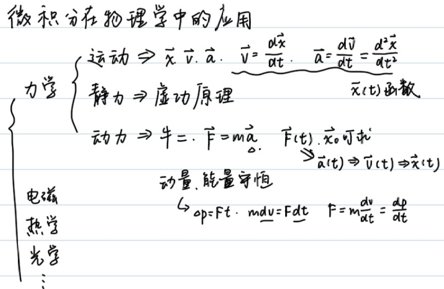
<!--more-->
### 例1
$$\begin{gathered}
  mgh+\frac{1}{2}mv^2=C\\
  v=\frac{dh}{dt}\\
  mgh+\frac{1}{2}m(\frac{dh}{dt})^2=C\\
  \frac{dh}{dt}=\sqrt{\frac{2(C-mgh)}{m}}\\
  dt=\sqrt{\frac{m}{2(C-mgh)}}dh=\frac{\sqrt{2}}{2}(\frac{c}{m}-gh)^\frac{-1}{2}dh\\
  \int_0^t dt=\frac{\sqrt{2}}{2}\int_{h_0}^{h_t}(\frac{c}{m}-gh)^\frac{-1}{2}dh\\
  t=-\frac{\sqrt{2}}{g}(\frac{C}{m}-gh_t)^\frac{1}{2}+C'
\end{gathered}$$

### 例2
在简谐运动中：

$$\begin{gathered}
  \vec{F}=-k\vec{x},\vec{v}=\frac{d\vec{x}}{dt},\vec{a}=\frac{d\vec{v}}{dt}=\frac{d^2\vec{x}}{dt^2}=\frac{-k}{m}x
\end{gathered}$$

构建的微分方程:

$$\frac{d^2\vec{x}}{dt^2}=\frac{-k}{m}x$$

备选的$x(t)$:
- $A\cos (\omega t+\phi)$
- $A\sin (\omega t+\phi)$
- $e^{\omega t+\phi}$

但$\frac{-k}{m}\lt 0$,可以排除$e^{\omega t+\phi}$

设$x(t)=A\sin (\omega t+\phi)$,则:

$$\begin{gathered}
  v(t)=Aw\cos(\omega t+\phi)\\
  a(t)=-Aw^2\sin(\omega t+\phi)=\frac{-k}{m}A\sin(\omega t+\phi)
\end{gathered}$$

解得:$\omega=\sqrt{\frac{k}{m}},\phi=\arcsin\frac{x_0}{A}$

结合机械能守恒,可以推出弹簧弹性势能的表达式:

在弹簧振子位于平衡位置时，设$E_{p_0}=0$，弹性势能最小，速度最大.

$$\begin{gathered}
  \frac{1}{2}mv^2+E_p=C\\
  \omega=\sqrt{\frac{k}{m}}\\
  v(t)=Aw\cos(\omega t+\phi)\\
  C=\frac{1}{2}m(Aw)^2
\end{gathered}$$

解得:$E_p=\frac{1}{2}m(Aw\sin(\omega t+\phi))^2=\frac{1}{2}kx^2$

>[!NOTE]
>熟知简谐运动可以与匀速圆周运动一一对应
>
>圆上的一个点可以确定运动的**位移**与**速度**的**大小及方向**

对于简谐运动，如果做出$v-x$图，那么图像将会是椭圆：

$$\begin{cases}
  x=A\sin(\omega t+\phi)\\
  y=A\omega\cos(\omega t+\phi)\\
  \frac{x^2}{A^2}+\frac{y^2}{A^2\omega^2}=1
\end{cases}$$

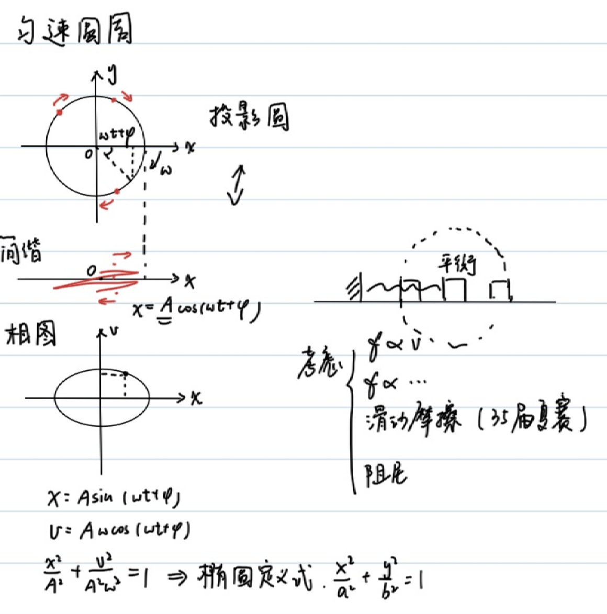

### 例3
(35届复赛第二题-简化版)

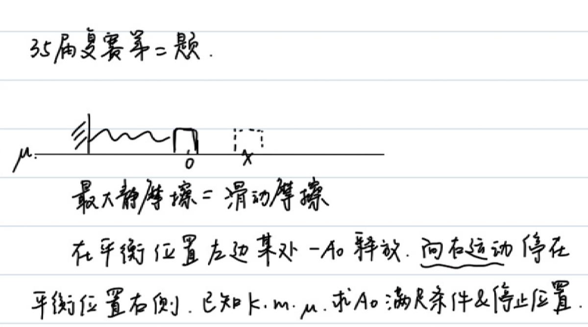

首先，为了在一开始能运动，必须满足:

$$\begin{gathered}
  kA_0\gt \mu mg\\
  A_0\gt \frac{\mu mg}{k}
\end{gathered}$$

再列出运动过程的能量守恒:

$$\begin{cases}
  \frac{1}{2}kA_0^2=\frac{1}{2}kx^2+(A_0+x)\mu mg,\\
  kx\lt \mu mg \rightarrow x\in (0,\frac{\mu mg}{k})
\end{cases}$$

解得:

$$\begin{gathered}
  A_0^2=x^2+\frac{2}{k}(A_0+x)\mu mg\in (\frac{2\mu mg}{k}A_0,\frac{2\mu mg}{k}A_0+\frac{3\mu^2 m^2g^2}{k^2})
\end{gathered}$$

即:

$$\begin{gathered}
  (A_0-\frac{\mu mg}{k})^2\in (\frac{\mu^2 m^2g^2}{k^2},\frac{4\mu^2 m^2g^2}{k^2})
\end{gathered}$$

(Aha)最后得到:

$A_0\in (\frac{2\mu mg}{k},\frac{3\mu mg}{k})$

另解:(合成弹力和摩擦力，利用简谐运动的对称性)

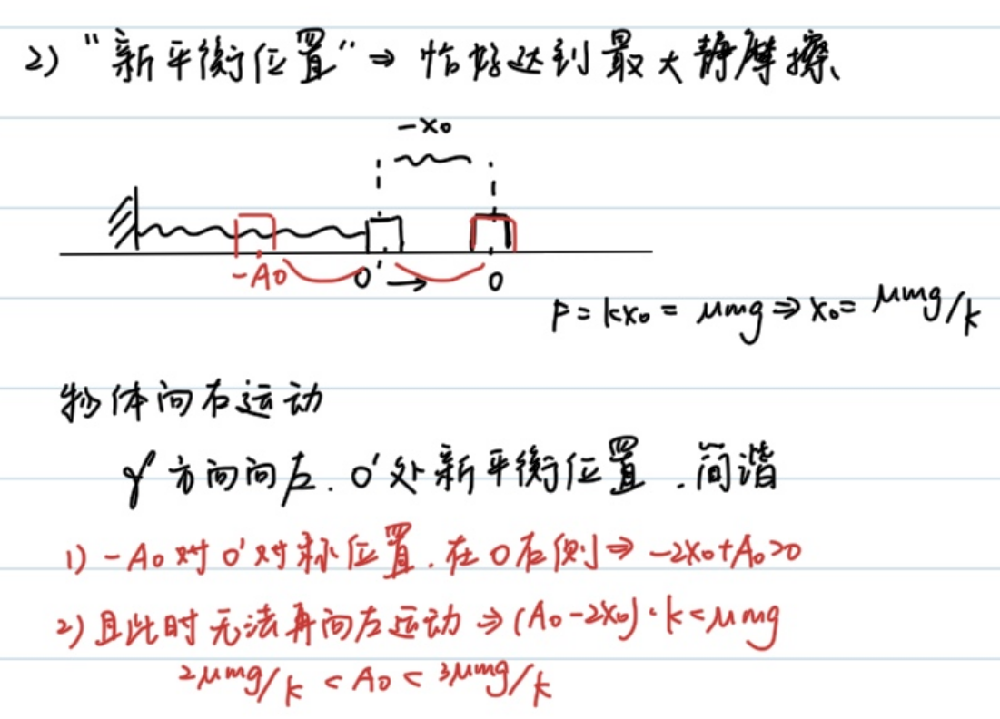

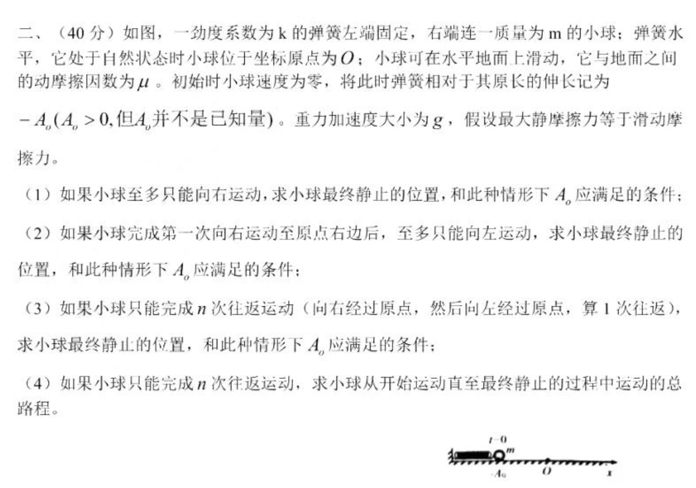

## 曲率半径
一个曲线运动可以看成若干圆周运动的加和，各物理量满足:

$$\begin{cases}
  \vec{F}=m\frac{\vec{v}^2}{\rho},\\
  \vec{a_n}=\frac{\vec{v}^2}{\rho}\hat{n},\\
  a_n = \frac{|\vec{a} \times \vec{v}|}{|\vec{v}|}, \quad a_t = \frac{\vec{a} \cdot \vec{v}}{|\vec{v}|}
\end{cases}$$

### 例4
求抛物线$y=x^2$在$x=0$处的曲率半径

$$\begin{gathered}
  \vec{r}=(x,x^2)\\
  \vec{v}=(\frac{dx}{dt},2x\frac{dx}{dt})\\
  \vec{a}=(\frac{d^2x}{dt^2},2(\frac{dx}{dt})^2+2x\frac{d^2x}{dt^2})
\end{gathered}$$

不妨设$\frac{dx}{dt}=1$,即质点在水平方向作匀速运动，在$x=0$处，向心加速度沿y轴方向，切向加速度为0:

$a_n=|\vec{a}|=2,\vec{v}=(1,0),|v|=1,\rho=\frac{v^2}{a_n}=\frac{1}{2}$
### 例5
已知椭圆$\frac{x^2}{a^2}+\frac{y^2}{b^2}=1(a>b>0)$,求端点处的曲率半径.

如果设水平速度恒定，会导致在长轴处出现问题;设竖直速度恒定，短轴处也会出问题

我们采取极坐标换元:

$$\begin{gathered}
\vec{x}=(a\cos(\omega t+\phi),b\sin(\omega t+\phi))\\
\vec{v}=(-a\omega\sin(\omega t+\phi),b\omega\cos(\omega t+\phi))\\
\vec{a}=(-a\omega^2\cos(\omega t+\phi),-b\omega^2\sin(\omega t+\phi))
\end{gathered}$$

在$(0,b)$处，$\omega t+\phi=\frac{\pi}{2}$.

$$\begin{gathered}
  \vec{v}=(-a\omega,0)\\
  \vec{a_n}=\vec{a}=(0,-b\omega^2)\\
  \rho=\frac{|v|^2}{|a_n|}=\frac{a^2}{b}
\end{gathered}$$

在$(a,0)$处，$\omega t+\phi=0$.

$$\begin{gathered}
  \vec{v}=(0,b\omega)\\
  \vec{a_n}=\vec{a}=(-a\omega^2,0)\\
  \rho=\frac{|v|^2}{|a_n|}=\frac{b^2}{a}
\end{gathered}$$

### 例6
一根支在固定圆上的长木棍，一端A在地面上做速度为$v$的匀速运动，求交点P与接触点E速度.

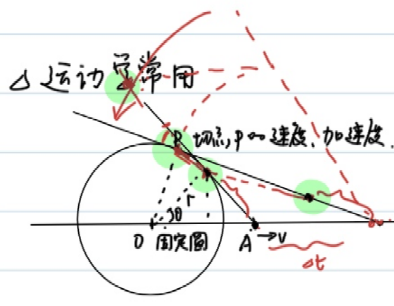

$$\begin{gathered}
  A(x,0)\\
  \frac{dx}{dt}=v\\
  P(\frac{r^2}{x},r\sqrt{1-\frac{r^2}{x^2}})\\
  \vec{v_p}=(v\frac{-r^2}{x^2},v\frac{r^3}{x^3}\frac{1}{\sqrt{1-\frac{r^2}{x^2}}})
\end{gathered}$$

类似的，我们求接触点E速度。注意接触点的约束条件不是在圆上，而是到A点距离不变。

$$\begin{gathered}
\vec{AP}=(\frac{r^2}{x}-x,r\sqrt{1-\frac{r^2}{x^2}})\\
|AP|=\sqrt{x^2-r^2}\\
\vec{l}=\frac{\vec{AP}}{|AP|}=(-\frac{\sqrt{x^2-r^2}}{x},\frac{r}{x})\\
E=A+|AP|\\
E'(t)=A'+|AP|\vec{l}'\\
=(v,0)+\sqrt{x^2-r^2}(-v\frac{2r^2}{x^3}\frac{1}{2\sqrt{1^2-\frac{r^2}{x^2}^2}},-v\frac{r}{x^2})\\
=(v(1-\frac{r^2}{x^2}),-v\frac{r}{x^2}\sqrt{x^2-r^2})
\end{gathered}$$

### 例7(虚功原理)
有一个圆上，其半圆部分放有均匀细绳，质量为$m$,求顶点处的张力。

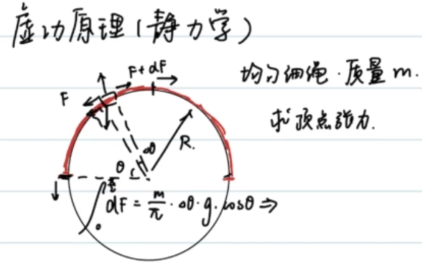

对无数微小质元受力分析，考虑沿切线方向受力平衡:

$$\begin{gathered}
  dF=\frac{d\theta}{\pi}mg\cos \theta\\
  \int_{0}^{F}=\frac{mg}{\pi}\int_{0}^\frac{\pi}{2}\cos\theta d\theta\\
  =\frac{mg}{\pi}
\end{gathered}$$

当然，我们有一个技巧性强的做法：**虚功原理**.

缓慢把绳拉动$\Delta x$,$F\Delta x=\frac{\Delta x}{\pi R}mgR$,则$F=\frac{mg}{\pi}$

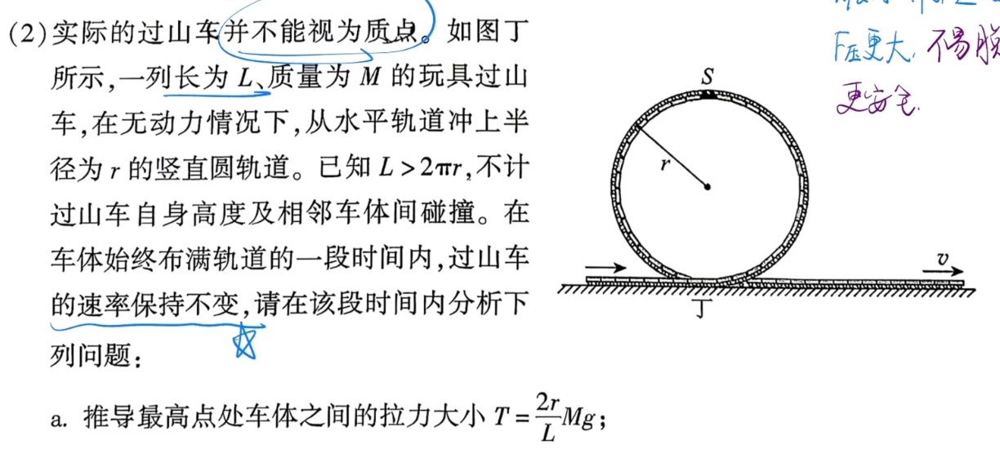

使用虚功原理，可以较容易地解决2026朝阳高三二模T19(2)

### 例8(必错题)
地面上一根匀质细绳，长$l$,线密度$\lambda$,竖直向上的恒力$F_0$拉绳一端，当绳恰好离开地面时的速度$v_t$
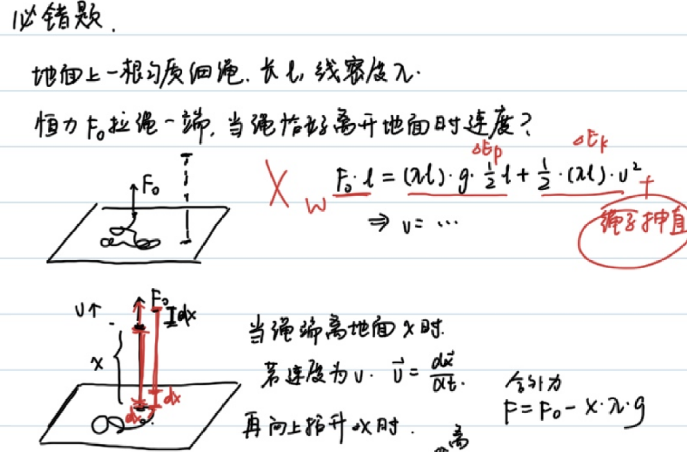

$$\begin{gathered}
  \frac{1}{2}l\lambda gl+\frac{1}{2}l\lambda v_t^2=F_0l\\
  v_t=\sqrt{2F_0/\lambda-gl}
\end{gathered}$$

很不幸，这是一个**标准错误**。一根无张力绳拉直需要额外做功,此方法求出的$v_t$偏大。

当绳端离地面$x$时，若速度为$v$,$\vec{v}=\frac{d\vec{x}}{dt}$,再向上提升$\Delta x$时:

动量定理:$Fdt=(x\lambda)dv+(dx \lambda)(v+dv)$

约去二阶小量：

$F=\lambda xdv+\lambda vdx=\lambda\frac{d(vx)}{dt}$

$Fdt=\lambda d(vx)$

但是时间是不知道的，如果利用$dx=vdt$，就可以解决此问题:

$Fx dx=\lambda vx(xdv+vdx)=\lambda (vx)d(vx)$

注意这里的$F$均为合外力，$F=F_0-x\lambda g$

$\int_0^l(F_0-x\lambda g)x dx=\int_{0}^{lv_t}\lambda (vx)d(vx)$

$\frac{1}{2}F_0l^2-\frac{1}{3}\lambda gl^3=\lambda\frac{1}{2}(v_tl)^2$

$\frac{1}{2}F_0-\frac{1}{3}\lambda gl=\lambda\frac{1}{2}(v_t)^2$

解得$v_t=\sqrt{F_0/\lambda-\frac{2}{3}gl}$

### 例9("微元法"运动学)
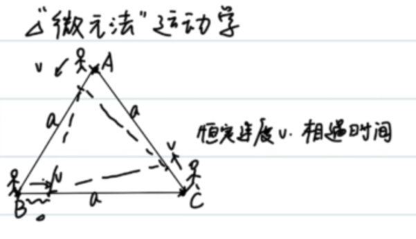
考虑对称性，显然三人组成的图形始终是正三角形:

沿连线方向分解速度，可得到:

$da=-\frac{3}{2}vdt$

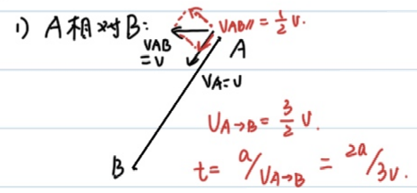

$a=\frac{3}{2}vt$

解得$t=\frac{2a}{3v}$

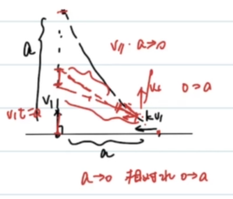

设$kv$与竖直方向的夹角为$\theta$

$$\begin{gathered}
  vt_0=a\\
  \int_{0}^{t_0}kv\cos\theta dt=a\\
  \int_{0}^{t_0}kv\sin\theta dt=a\\
  dl=(-kvdt+vdt\cos\theta)\\
  \int_{a}^{0}dl=\int_0^{t_0}(-kvdt+vdt\cos\theta)\\
  -a=-kvt_0+\frac{a}{k}=-ka+\frac{a}{k}\\
  k^2-k-1=0\\
  k=\frac{1+\sqrt{5}}{2}
\end{gathered}$$

## 转动惯量
杆，板……等刚体(质点间距离不变)-质点系运动，都可以分解为**质心平动+绕质心转动**

日地系统可以看作绕质心的"双星转动"，而又可以认为二者的质心绕着银河系中心平动(对于多个质点，才有转动的说法).

日/地运动可以看作日地系统绕银河中心平动+日地绕质心的转动.

由此，力对于质心，会产生平动；力的力矩，会导致转动。

### 质点系牛顿第二定律
$$\boxed{(\sum m)a_c=\sum{F}}$$
### 科尼希(质心运动)定理
$$\boxed{\sum{\frac{1}{2}m_iv_i^2}=\frac{1}{2}Mv^2+\sum{\frac{1}{2}m_iv_{ic}^2}}$$

通过$a_c$，不难求得$v_c$;我们现在希望能通过合外力的力矩，求得所有质点绕质心旋转的角速度$\omega$.

力矩$M=Fr$,角加速度$\beta=\frac{d\omega}{dt}$.

定义:$M=I\beta$,其中$I$为转动惯量.

$$\boxed{I=\sum{m_ir_i^2}}$$

计算式如上，其中$r_i$为质点i到质心的距离.

### 例10
计算均匀杆绕中心的转动惯量

$$\begin{gathered}
  I=2\int_{0}^\frac{l}{2}\frac{dx}{l}mx^2\\
  =\frac{1}{12}ml^2
\end{gathered}$$

### 例11
计算均匀杆绕一端的转动惯量
$$\begin{gathered}
  I=\int_{0}^l\frac{dx}{l}mx^2=\frac{1}{3}ml^2
\end{gathered}$$

### 转动惯量平行轴定理
刚体对**任意转轴**的转动惯量，等于其对**平行质心轴**的转动惯量与刚体总质量和两轴垂直距离平方的乘积之和。

$$\boxed{I=I_c+Md^2}$$

对于例11,$I=I_c+m(\frac{1}{2}l)^2=\frac{1}{12}ml^2+\frac{1}{4}ml^2=\frac{1}{3}ml^2$

### 例12
求均匀圆板绕过中心且垂直圆板的轴的转动惯量

$$\begin{gathered}
  I=\int_{0}^{R}\frac{2\pi rdr}{\pi R^2}mr^2\\
  =\frac{2m}{R^2}\int_{0}^{R}r^3\\
  =\frac{1}{2}mR^2
\end{gathered}$$

### 类比
| 力 | 力矩 |
| --- | --- |
| $m$ | $I=\sum{m_ir_i^2}$ |
| $v$ | $\omega$ |
| $a$ | $\beta$ |
| $F=ma$ | $M=I\beta$ |
| $E=\frac{1}{2}mv^2$ | $E=\frac{1}{2}I\omega^2$ |

## 展望(Prospect)
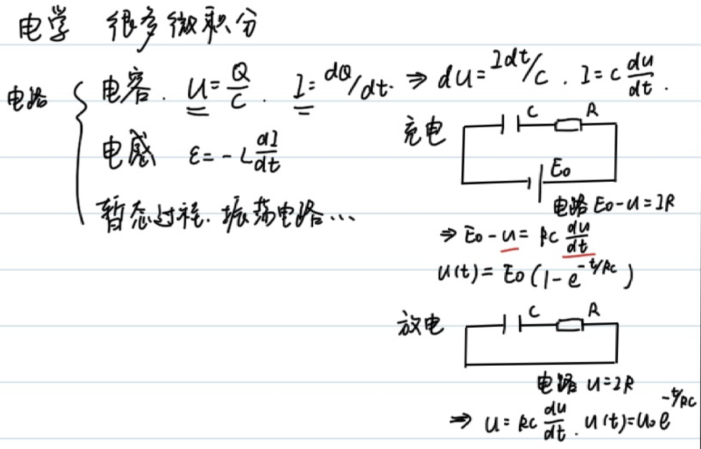

## 总结
本文以一系列例题为线索，展示了微积分如何成为解决物理问题的统一语言。

- **微分方程与机械能守恒（例1、例2）**：从能量守恒出发列出 $\frac{dh}{dt}$ 或 $\frac{d^2\vec{x}}{dt^2}$ 的微分方程，再通过分离变量或试探解求解。简谐运动中我们由 $x(t)=A\sin(\omega t+\phi)$ 反推出 $\omega=\sqrt{k/m}$，并结合机械能守恒导出弹性势能 $E_p=\frac{1}{2}kx^2$，同时建立了简谐运动与匀速圆周运动、$v$-$x$ 椭圆图之间的对应关系。
- **简谐运动的对称性（例3）**：在含摩擦的振动问题中，用能量守恒配合“合成弹力与摩擦力、利用对称性”的技巧，得到初始振幅的取值范围 $A_0\in(\frac{2\mu mg}{k},\frac{3\mu mg}{k})$。
- **曲率半径（例4–例6）**：把曲线运动视为瞬时圆周运动，借助 $\rho=\frac{v^2}{a_n}$ 与 $a_n=\frac{|\vec{a}\times\vec{v}|}{|\vec{v}|}$ 求抛物线、椭圆端点的曲率半径；并通过恰当的参数化（如极坐标换元）避开速度分量发散的陷阱。
- **虚功原理与变质量问题（例7、例8）**：虚功原理能极快地求出半圆绳顶点张力 $F=\frac{mg}{\pi}$；而对“离地绳”一类变质量问题，必须用动量定理 $F\,dx=\lambda\,(vx)\,d(vx)$ 处理“拉直无张力绳的额外做功”，否则会落入能量守恒给出的标准错误，正确结果为 $v_t=\sqrt{F_0/\lambda-\frac{2}{3}gl}$。
- **微元法运动学（例9）**：利用对称性与沿连线方向的速度分解处理追及问题，化复杂轨迹为简单的微元关系。
- **转动惯量（例10–例12）**：将刚体运动分解为“质心平动 + 绕质心转动”，由质点系牛顿第二定律、科尼希定理引出转动惯量 $I=\sum m_i r_i^2$，计算了杆、圆板的转动惯量，并用平行轴定理 $I=I_c+Md^2$ 加以验证，最后给出平动量与转动量的类比表。

贯穿全文的核心思想是：**先选取合适的物理守恒量或动力学方程，再通过微分建模、积分求解或微元分析将其转化为可计算的数学问题**。微积分不仅是计算工具，更提供了理解力学结构的视角。