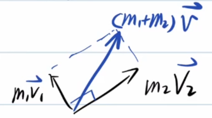
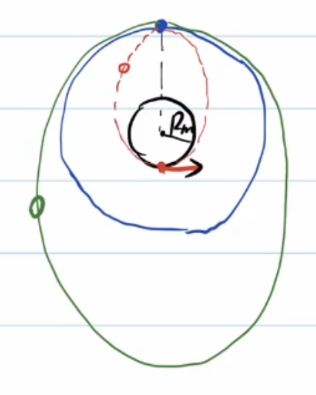
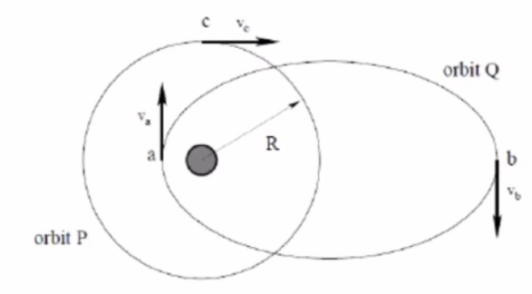
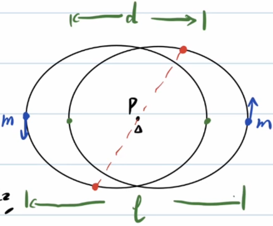

<!--more-->
#celestial sports comprehensive
## 1: Lagrange point
The three celestial bodies M, N and P satisfy $m_M\gt\gt m_N\gt m_P$

How many points exist in space so that P can be stationary relative to M and N at this point (M, N, and P form a stable rotation)

From the law of universal gravitation, we know:

If P, M, and N are not collinear, then P, M, and N form an equilateral triangle, thus finding two points.

Taking M and N as the rotational inertial system, then P is subject to the centrifugal force directed from the center of mass of M and N to P and the gravitational force of M and N on P.

Since $m_M\gt\gt m_N\gt m_P$, it is approximately considered that the centers of rotation of the three are the centers of mass of M and N.

#### Situation 1
From left to right, they are M, N, P
$$\begin{gathered}
  \frac{Gm_Pm_M}{(r+x_1)^2}+\frac{Gm_Pm_N}{x_1^2}=m_Pw^2(r+x_1)\\
  G\frac{m_Mm_N}{r^2}=m_Nw^2r\frac{m_M}{m_M+m_N}\\
  \frac{Gm_M}{(r+x_1)^2}+\frac{Gm_N}{x_1^2}=G\frac{m_M+m_N}{r^3}(r+x_1)\\
  m_M(3r^2x_1^3+3rx_1^4+x_1^5)=m_N(r^5+2r^4x_1-3r^2x_1^3-3rx_1^4-x_1^5)\\
\end{gathered}$$

A **small quantity approximation** method is introduced here: we first assume that $x_1$ is a small quantity relative to $r$, and then check the rationality of the result.

$$\begin{gathered}
  m_M(3r^2x_1^3)=m_Nr^5\\
  x_1=\sqrt[3]{\frac{m_N}{3m_M}}r\lt\lt r
\end{gathered}$$

A small amount is approximately reasonable.

#### Situation 2
$$\begin{gathered}
  \frac{Gm_Pm_M}{(r-x_2)^2}-\frac{Gm_pm_N}{x_2^2}=m_Pw^2(r-x_2)\\
  \frac{Gm_Pm_M}{(r-x_2)^2}-\frac{Gm_pm_N}{x_2^2}=\frac{Gm_P(m_M+m_N)}{r^3}(r-x_2)\\
\end{gathered}$$

Similar ones include: $x_2=\sqrt[3]{\frac{m_N}{3m_M}}r$
#### Scenario 3
Since $m_N\lt\lt m_M$ and P is closer to M, the gravitational force of N on P can be ignored, obviously $x_2=r$

### Example 1

As shown in the figure, imagine a "ladder" placed along the Earth-Moon line: the left end is close to the Earth, and the right end is close to the Moon, but neither end touches the Earth or the Moon, and both ends are suspended in space.

Known: s

- The distance between the earth and the moon is $r$;
- The ladder can be regarded as a uniform thin rod;
- The density of the ladder material is $\rho$;
- The cross-sectional area of the ladder is $S$;
- The acceleration due to gravity on the earth's surface is $g$;
- The gravitational acceleration on the Moon’s surface is $g_{\text{Moon}}$;
- The radius of the Earth is $R_{\text{Earth}}$;
- The radius of the Moon is $R_{\text{Moon}}$.

## Question

1. If the ladder is required to remain stationary relative to the Earth-Moon system, and both ends of the ladder are suspended in the air, then a counterweight needs to be hung at one end of the ladder.
Should this weight be hung on the end closer to the earth or the end closer to the moon?

2. Which point on the ladder is most likely to be broken?
Try to explain its relationship with the Lagrangian point in the Earth-Moon system.

(1) Taking the earth-moon connection as the system, introducing inertial force

First consider the total external force on the rod without counterweight.

It is difficult to solve directly. Consider the principle of virtual work:

Consider this process: Use a virtual force $F$ (positive direction toward the moon) to move the ladder a short distance toward the moon $\Delta L$

At the beginning, the rotation center of the system is approximately near the center of the earth, so the centrifugal potential energy (the potential energy generated due to the work done by the inertial centrifugal force) of a small section at the earth's end is close to 0 at the beginning.

$$\begin{gathered}
  \Delta E=F\Delta L=\rho S\Delta L[(0-(-\frac{GM_e}{R_e}))+(-\frac{GM_m}{R_m}-0)]+(-\frac{1}{2}w^2r^2\rho S\Delta L-0)\\
  F\gt\gt 0
\end{gathered}$$

Therefore, the total external force exerted by the wooden pole is toward the earth. A counterweight should be placed on the end of the moon to receive the greater gravitational pull of the moon.

(2) It can be found that, taking the moon-earth connection as the system, to the left of the middle Lagrange point, the resultant force of gravity and centrifugal force on the ladder is to the left; to the right of the middle Lagrange point, the resultant force of gravity and centrifugal force on the ladder is to the right.

The force of each part to the left will accumulate, and the force of each part to the right will also accumulate, so the difference in left and right pulling forces at the middle Lagrangian point is the largest and it is most likely to break.

## 2: Hyperbolic track
Mechanical energy $E=\frac{GMm}{2a}\gt 0$, hyperbola equation $\frac{x^2}{a^2}-\frac{y^2}{b^2}=1$.

There is a spacecraft moving in a straight line at a uniform speed around a planet. The orbit radius is $R$, and the spacecraft speed is $v_0$. The spacecraft suddenly ignites, and the spacecraft accelerates from $v_0$ to $\sqrt{3}v_0$, and the acceleration direction is the same as the speed direction. In this way, the spacecraft moves along the new orbit. Let $\varphi$ be the angle between the speed direction of the spacecraft when the engine is ignited and the speed direction of the planet in the spacecraft when it is farthest away (ultimately long and difficult sentence)

According to the virial force theorem:

$$\begin{gathered}
  E_0=\frac{1}{2}mv^2+(-\frac{GMm}{r})\\
  -\frac{GMm}{r}=-mv^2\\
  E=E_0+\frac{1}{2}m[(\sqrt{3}v)^2-v^2]=\frac{1}{2}mv^2\gt 0
\end{gathered}$$

It is easy to know that the new motion trajectory of the spacecraft is a hyperbola, and the final speed is close to the asymptotic direction. It can be determined by simply requiring the eccentricity of the hyperbola.

The well-known orbital equation of celestial motion is:

$$\boxed{\frac{\frac{L^2}{GMm^2}}{1+\sqrt{1+\frac{2EL^2}{G^2M^2m^3}}\cos\theta}}$$

$$\begin{gathered}
  e_0=\sqrt{1+\frac{2E_0L_0^2}{G^2M^2m^3}}=0\\
  \frac{2E_0L_0^2}{G^2M^2m^3}=-1\\
  E=-E_0,L=\sqrt{3}L_0\\
  \frac{2EL^2}{G^2M^2m^3}=3\\
  e=2=\sec(90\degree-\varphi)\\
  \varphi=30\degree
\end{gathered}$$

Methods that rely less on secondary conclusions:

$$\begin{gathered}
  \frac{1}{2}m(\sqrt{3}v_0)^2-mv_0^2=0+\frac{1}{2}mv^2\\
  m\sqrt{3}v_0R=mvb\\
  (R+a)\sin\varphi=a\\
  b=(R+a)\cos\varphi\\
  \frac{\cos\varphi}{1-\sin\varphi}=\sqrt{3}\\
  \varphi=30\degree
\end{gathered}$$

Example: The sun with mass \(M\) (fixed and regarded as a particle), and the particle with mass \(m\) approaches \(M\) along a hyperbola at a speed \(v\) and aiming distance \(b\). From infinity, under the action of the universal gravitation of \(M\), it approaches \(M\) and then moves away far away. Find the scattering angle \(\theta\) (the deflection angle in the direction of motion).

The initial velocity direction is the direction of the hyperbola asymptote, and the aiming distance is the distance from the focus to the asymptote, and its size is equal to the length b of the semi-imaginary axis of the hyperbola.

Use mechanical energy to find the semi-real axis a for the bridge (note that the formula is different from the elliptical orbit symbol):

$$\begin{gathered}
  E=\frac{GMm}{a}=\frac{1}{2}mv^2\\
  a=\frac{2GM}{v^2},\cos\frac{\pi-\theta}{2}=\frac{a}{c}=\frac{a}{\sqrt{a^2+b^2}}\\
  \cos(\pi-\theta)=\frac{a^2-b^2}{a^2+b^2}=\frac{4G^2M^2-v^4b^2}{4G^2M^2+v^4b^2}\\
  \theta=\arccos(-\frac{4G^2M^2-v^4b^2}{4G^2M^2+v^4b^2})
\end{gathered}$$

## Three: Parabolic orbit
Two comets with both masses m move around the sun along their own parabolic orbits. The two orbits are coplanar. When the two comets move to a distance R from the sun, they collide vertically with each other and combine into one celestial body. Discuss the orbit of the combined celestial body at this time.

Obviously, the gravitational potential energy remains unchanged before and after the collision of the two bodies, and the kinetic energy decreases (inelastic collision), so the total mechanical energy is $E\lt0$, and the new orbit is an ellipse.

Further, calculate the semi-major axis of the new orbit.

$$\begin{gathered}
  \Delta E=\frac{1}{2}2m(\frac{\sqrt{2}}{2}v)^2-2\frac{1}{2}mv^2=-\frac{1}{2}mv^2\\
  E=0+\Delta E=-\frac{1}{2}mv^2=\frac{GM(2m)}{-2a}\\
  a=\frac{2GM}{v^2}\\
  \frac{1}{2}mv^2-\frac{GMm}{R}=0\\
  \Longrightarrow v^2=\frac{2GM}{R}\\
  a=R
\end{gathered}$$

The difficulty of the problem has been upgraded. The masses of the two comets are $m_1,m_2$.

$$\begin{cases}
  \frac{1}{2}m_1v_1^2-\frac{GMm_1}{R}=0\\
  \frac{1}{2}m_2v_2^2-\frac{GMm_2}{R}=0
\end{cases}\Longrightarrow
v_1=v_2=\sqrt{\frac{2GM}{R}}$$

Considering the conservation of momentum when two comets collide, draw a vector triangle:

$$\begin{gathered}
  (m_1+m_2)v=\sqrt{(m_1v_1)^2+(m_2v_2)^2}\\
  v=\frac{1}{m_1+m_2}\sqrt{(m_1v_1)^2+(m_2v_2)^2}\\
  E=\Delta E=\frac{1}{2}(m_1+m_2)v^2-\frac{1}{2}(m_1v_1^2+m_2v_2^2)\\
  =-\frac{m_1m_2}{2(m_1+m_2)}(v_1^2+v_2^2)=-\frac{2m_1m_2}{m_1+m_2}\frac{GM}{R}=\frac{GM(m_1+m_2)}{-2a}\\
  a=\frac{(m_1+m_2)^2}{4m_1m_2}R
\end{gathered}$$

# Exercises
## Example 1
A lunar lander of mass m is connected to a space shuttle of mass 2 m, and together they make uniform circular motion around the earth. The orbit radius is three times the radius of the moon. After the space shuttle ejects the lunar lander in the opposite direction, the lunar lander still moves in the original direction, lands on the lunar surface (the orbit is tangent to the moon), stays on the surface for a period of time, and then quickly starts to dock with the space shuttle along the previous elliptical orbit. Find all possible time intervals that the lunar lander can stay on the lunar surface. It is known that the lunar surface gravity acceleration $g_m=1.62m/s^2$ and the lunar radius $R_m=1.74\times10^6m$.

$$\begin{gathered}
  \frac{GM_m(2m+m)}{(3R_m)^2}=(2m+m)\frac{v_0^2}{3R_m}\\
  v_0=\sqrt{\frac{GM_m}{3R_m}}\\
  T_0=\frac{2\pi(3R_m)}{v_0}=6\pi R_m\sqrt{\frac{3R_m}{GM_m}}\\
  mg=\frac{GM_mm}{R_m^2}\\
  GM_m=g_mR_m^2\\
  T_0=6\pi R_m\sqrt{\frac{3R_m}{g_mR_m^2}}=6\pi \sqrt{\frac{3R_m}{g_m}}=9.4h
\end{gathered}$$

The advantage of calculating $T_0$ is that the new orbital period of the lunar lander and the new orbital period of the space shuttle can be expressed by **Kepler's third law**.

Suppose the semi-major axis of the lunar lander's new orbit is $a_1$ and the period is $T_1$, and the semi-major axis of the space shuttle's new orbit is $a_2$ and the period is $T_2$.

$$\begin{gathered}
  (2m+m)v_0=mv_1+2mv_2\\
  2a_1=3R_m+R_m,a_1=2R_m\\
  \frac{T_1}{T_0}=\sqrt{(\frac{2R_m}{3R_m})}=(\frac{2}{3})^\frac{3}{2}=0.54\\
  \frac{1}{2}mv_0^2-\frac{GM_mm}{3R_m}=\frac{GM_mm}{-2(3R_m)}\\
  \frac{1}{2}mv_0^2=\frac{GM_mm}{6R_m}\\
  \Delta E=\frac{GM_mm}{-2(2R_m)}-(-\frac{GM_mm}{6R_m})=-\frac{GM_mm}{12R_m}\\
  =\frac{1}{2}m[v_1^2-v_0^2]\\
  \frac{1}{2}mv_1^2=\frac{GM_mm}{12R_m},v_1=\frac{\sqrt{2}}{2}v_0\\
  3mv_0=mv_1+2mv_2,v_2=\frac{6-\sqrt{2}}{4}v_0\\
  E_2-(-\frac{GM_mm}{3R_m})=\frac{1}{2}2m[v_2^2-v_0^2]=\frac{1}{2}mv_0^2(\frac{11-6\sqrt{2}}{4})=\frac{GM_mm}{6R_m}(\frac{11-6\sqrt{2}}{4})\\
  E_2=\frac{1-2\sqrt{2}}{8}\frac{GM_mm}{R_m}=\frac{GM_m(2m)}{-2a_2}\\
  a_2=\frac{8}{2\sqrt{2}-1}=4.38R_m\\
  \frac{T_2}{T_0}=(\frac{a_2}{a_0})^\frac{3}{2}=1.76\\
  T_2=16.5h
\end{gathered}$$

Only the finishing touch remains:

$$\begin{gathered}
  T_1+t=nT_2\\
  t=nT_2-T_1\\
  =(1.76n-0.54)9.4h(n=1,2,3,...)\\
  t_{min}=11.5h
\end{gathered}$$

## Example 2
(1) As shown in the figure, consider two orbits revolving around the sun. An orbit \(P\) is a circular orbit with a radius of \(R\), an orbit \(Q\) is an elliptical orbit, the aphelion is \(b\) from the sun between \(2R\) to \(3R\), the perihelion is \(a\), and the distance from the sun is \(R/3\) to \(R/2\) between. Based on the above conditions, the possible maximum and minimum values ​​of \(\frac{v_a}{v_b}\) are calculated.

 

From conservation of angular momentum:

$$v_ar_n=v_br_f$$

So: $\frac{v_a}{v_b}=\frac{r_f}{r_n}\in[4,9]$

(2) A large number of identical tiny particles form a spherical cloud. Start completely still. A mass density of \(\rho_0\) occupies an area in the air of radius \(r_0\). Under the action of gravity alone, regardless of any other forces or influences between particles, collisions will not occur. Please guess (estimate) how long it will take for these clouds to collapse to one point.

Consider the time it takes for the outermost particles to move to the center: they are equivalent to being outside the uniform sphere (including the boundary), and the gravitational force they receive from the uniform sphere is equivalent to the gravitational force corresponding to the mass concentrated at the center of the sphere.

$$\begin{gathered}
  a=\frac{GM}{r^2}\\
  =\frac{G(\frac{4}{3}\pi r_0^3\rho_0)}{r^2}
\end{gathered}$$

Essentially, it is to find the half period of an elliptical orbit with an eccentricity of 1 (degenerated into a straight line).

$$\begin{gathered}
  T=2\pi \sqrt{\frac{a^3}{GM}}\\
  =2\pi \sqrt{\frac{(\frac{r_0}{2})^3}{G(\frac{4}{3}\pi r_0^3\rho_0)}}\\
  =2\pi \sqrt{\frac{3}{32G\pi\rho_0}}\\
  =\sqrt{\frac{3\pi}{8G\rho_0}}\\
  t=\frac{T}{2}=\sqrt{\frac{3\pi}{32G\rho_0}}
\end{gathered}$$

## Example 3
The mass of the two particle points is m, and the gravitational constant is G. If the two particle points make a special binary motion, that is, the two particle points make an elliptical orbit with the same shape, find the period of motion.

It is not difficult to see that the gravitational force between two particles can be **equivalent** to placing a particle with mass $\frac{m}{4}$ at point P.

$$\frac{a^3}{T^2}=\frac{G(\frac{1}{4}m)}{4\pi^2}$$

And the semi-major axis $a=\frac{d+l}{4}$, the solution is: $T=\pi\sqrt{\frac{16(\frac{l+d}{4})^3}{Gm}}=\pi\sqrt{\frac{(l+d)^3}{4Gm}}$

# Kepler's first law (starting from the formula of universal gravitation)
Review the polar equations of an ellipse:

$$\begin{gathered}
  p=\frac{a^2}{c}-c=\frac{b^2}{c}\\
  e=\frac{\rho}{p-\rho\cos\theta}\\
  \rho=\frac{ep}{1+e\cos\theta},e\in(0,1)
\end{gathered}$$

Historically, Hooke used geometry to complete the proof, while Newton used **calculus** (or **flow method**).

We use calculus.

$$\begin{gathered}
  L=m\rho\rho\dot{\theta}=m\rho^2\dot{\theta}\\
  a_n=\ddot{\rho}-\rho\dot{\theta}^2=-\frac{GM}{\rho^2}
\end{gathered}$$

Note that the positive direction in the above formula is outward along the vector radius. We eliminate $\dot{\theta}$:

$$\begin{gathered}
  \ddot{\rho}-\rho\frac{L^2}{m^2\rho^4}=-\frac{GM}{\rho^2}\\
  A=\frac{1}{\rho},\rho=\frac{1}{A}\\
  d(\frac{1}{\rho})=-\frac{1}{\rho^2}d\rho\\
  \dot{\rho}=\frac{d\rho}{dt}\\=\frac{d\rho}{d\theta}\frac{d\theta}{dt}\\
  =\frac{d\rho}{d\theta}\dot{\theta}\\=\frac{d\rho}{d\theta}\frac{L}{m\rho^2}\\
  =-d(\frac{1}{\rho})\frac{L}{md\theta}=-dA\frac{L}{md\theta}\\
  \ddot{\rho}=\frac{d(\frac{d\rho}{dt})}{dt}=\frac{d(\frac{d\rho}{dt})}{d\theta}\frac{d\theta}{dt}\\
  =-\frac{L^2}{m^2\rho^2}\frac{d^2A}{d\theta^2}\\
  -\frac{L^2}{m^2\rho^2}\frac{d^2A}{d\theta^2}-\frac{L^2}{m^2}A^3=-GMA^2\\
  \frac{d^2A}{d\theta^2}+(A-\frac{GMm^2}{L^2})=0\\
  y=A-\frac{GMm^2}{L^2},\ddot{y}+y=0\\
  A-\frac{GMm^2}{L^2}=C\cos(\theta+\varphi)\\
  \rho=\frac{1}{A}=\frac{\frac{L^2}{GMm^2}}{1+C\cos(\theta+\varphi)}
\end{gathered}$$

Obviously, $e=C,p=\frac{L^2}{GMm^2}$, and as long as you choose the correct polar axis, you can make $\varphi=0$.

In fact, $e=\sqrt{1+\frac{2EL^2}{G^2M^2m^3}}$.

## Quick memory
$1year=365day=525600min=31536000s$
$M_{sun}=1.99\times10^{30}kg,M_{earth}=5.98\times10^{24}kg,M_{moon}=7.35\times10^{22}kg,R_{earth}=6.37\times10^6,R_{moon}=1.74\times10^6m,R_{earth-moon}=3.84\times10^8m,R_{earth-sun}=1.5\times10^{11}m=1A.U.,R_{mars-sun}=1.52A.U.,R_{jupiter-sun}=5.02A.U.$

## Example 4
Two supernovae with masses $M,m$ are separated by d, and each performs circular motion around its stationary center of mass. In the supernova explosion, the supernova with mass $M$ loses mass $\Delta M$. Assume that the explosion is instantaneous and completely spherically symmetrical, and the direct effect of the explosion debris on the supernova with mass m is ignored.

In order to keep the remaining binary stars bound and not move away from each other, find the maximum value of $\Delta M$.

The question condition is equivalent to that the mechanical energy of the system in the **center of mass system** is less than 0.

$$\begin{gathered}
  r_M=\frac{m}{M+m}d,r_m=\frac{M}{M+m}d\\
  \frac{GMm}{d^2}=M\omega^2r_M\\
\end{gathered}$$

Since the explosion is completely spherically symmetrical, the velocity of the remaining part remains unchanged, but the velocity decreases, which means that the center of mass velocity is no longer 0.

$$\begin{gathered}
  v_c=\frac{m\omega r_m-(M-\Delta M)\omega r_M}{M+m-\Delta M}\\
  E_{kc}=\frac{1}{2}(m+M-\Delta M)v_c^2\\
  E_{k}=\frac{1}{2}(M-\Delta M)(r_M\omega)^2+\frac{1}{2}m(r_m\omega)^2\\
  U=-\frac{G(M-\Delta M)m}{d}
\end{gathered}$$

Taking the **center of mass after explosion** as the system, combined with **Koenig's theorem**:

$$\begin{gathered}
  E'=E_k-E_{kc}+U\lt0\\
  \Longrightarrow \Delta M\lt\frac{M+m}{2}
\end{gathered}$$
