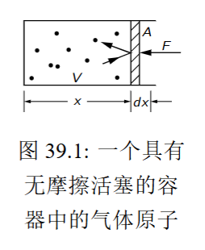
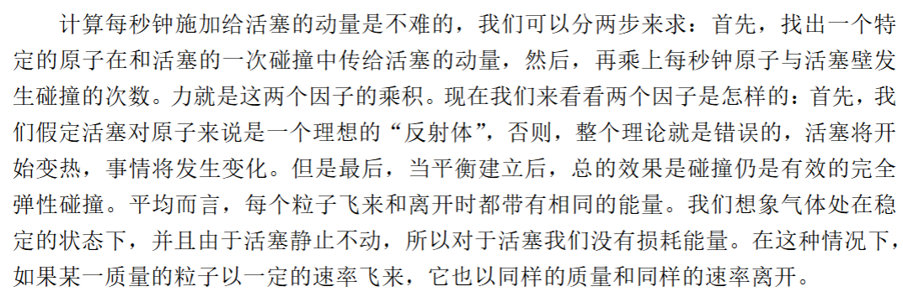
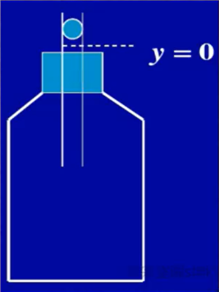

# 第三十九章:气体分子动理论
## 39.1:物质的性质
本章,我们将初步讨论物质的性质,了解不同原子集合的行为.

处理这个课题难度较大:
1. 从牛顿第二定律到物质的性质跨度过大,即使通过精确的分析也无法得到精确的结果(误差会逐渐放大)
2. 研究大量原子的运动不要求了解每一个原子,而是研究大量原子的平均行为,这涉及到概率论
3. 原子的行为不遵循经典力学规律,而遵循量子力学规律

下面,从牛顿力学定律开始讨论气体的性质
## 39.2:气体的性质
逻辑推理可得,气体的压强是通过大量原子的撞击实现的.

对于碰撞过程,我们考虑用动量定理分析.

对于图中的活塞,我们考虑气体分子每秒钟施加给它的动量:
1. 计算特定一个原子在一次碰撞中的动量改变量$\Delta p$
2. 计算每秒钟原子和活塞壁的碰撞次数$N$
3. 计算二者的乘积

对于1,粒子一次碰撞的动量改变量$\Delta p=2mv_x$

对于2,我们考虑以下的事实:

在一个给定的时间$t$内,若某个原子离活塞距离足够近,并且有一定的指向活塞的速度,就能在这段时间$t$内碰撞活塞. 反之,如果距离过远则不可.

而这个分界距离显然就是$v_xt$.

进一步,由于活塞的面积为$A$,所以在时间$t$内碰撞活塞的原子所占有的体积为$v_xtA$,乘以数密度,得到$N=nv_xtA$

这样,我们便求得了力$F=nv_xA\cdot 2mv_x=2nmv_x^2A$,

压强$P=2nmv_x^2$

但是,以上的分析有一些问题:不是所有的原子水平分速度都相同,所以$v_x$项并不全相同,解决方法也很简单:对$v_x^2$取平均,就像求电流的等效值.

此外,还有一点需要修正:在所有的原子中,只有一半是朝着活塞运动的,另一半运动方向相反.

所以修正后的压强为$P=nm\langle v_x^2\rangle$

根据对称性可以得到:

$$\langle v_x^2\rangle=\langle v_y^2\rangle=\langle v_z^2\rangle$$

而:

$$\langle v^2\rangle=\langle v_x^2+v_y^2+v_z^2\rangle=3\langle v_x^2\rangle$$

所以可以用平均质心运动动能改写压强:

$$P=\frac{2}{3}n\langle \frac{mv^2}{2}\rangle$$

事实上,并不能简单的把动能看成总能量(内能)$U$:
- 对于单原子分子,比如$He,Ar,Hg(g)$以及足够高温的$K(g)$,可以假定分子中没有内部运动,$U=n\langle \frac{1}{2}mv^2\rangle$
- 如果是复杂分子,可能存在内部运动

所以,对于单原子分子,我们有:

$$PV=\frac{2}{3}U$$

事实上,更普遍的结论是:

$$PV=(\gamma-1)U$$

- 分子结构越简单,原子数越少,$\gamma$越大
- 所有气体的$\gamma\gt1$
- $\gamma$可以是温度的函数,它会随温度升高(更多振动模式被激发)而缓慢减小,逐渐趋近于1

分析一下计算结果:
1. 压缩气体,内能增加
2. 与之同时,体积减小,所以压强增大

于是,我们便发现以下的问题并不简单:

> 假如我们缓慢的压缩绝热容器内的气体,把体积压缩需要多大的压强?

在绝热压缩中,所做的功全部转化为内能,所以:

$$\begin{gathered}
  PdV=-dU\\
  PdV=-d(\frac{PV}{\gamma-1})\\
  PdV=-\frac{PdV+VdP}{\gamma-1}\\
  \gamma PdV=-Vdp\\
\end{gathered}$$

对于这个微分方程,可以分离变量求解:

$$\begin{gathered}
  \gamma \frac{1}{V}dV+\frac{dP}{P}=0\\
  \gamma \ln V+\ln P=\ln C
\end{gathered}$$

其中$\gamma$为一常数,得:

$$PV^{\gamma}=C$$

事实上,反过来用这个结论可以测定$\gamma$.

如图所示，瓶内盛有气体，一横截面为A的玻璃管通过瓶塞插入瓶内。玻璃管内放有一质量为m的光滑金属小球（可视为活塞）。设小球在平衡位置时，气体体积为V，压强 $p = p_0 + \frac{mg}{A}$（$p_0$为大气压强）。现将小球稍向下移，然后放手，则小球将以周期T在平衡位置附近振动。假定在小球上下振动的过程中，瓶内气体经历的过程可看作准静态绝热过程，证明：

（1）使小球进行简谐振动的准静态弹性力为$F = \frac{\gamma p A^2}{V} y$，其中$\gamma$为绝热指数，$y$为位移

（2）小球进行简谐振动的周期$T = 2\pi \sqrt{\frac{mV}{\gamma p A^2}}$

（3）用含有m、A、p、V、T的式子表示$\gamma$

(1)

$$\begin{gathered}
  pV^{\gamma}=p'V'^{\gamma}\\
  p'(1-\frac{Ay}{V})^\gamma=p\\
  p'(1-\gamma\frac{Ay}{V})=p(Ay\lt\lt V)\\
  (p'-p)A=F\\
  F=pA(1-\frac{1}{1-\gamma\frac{Ay}{V}})\approx \frac{\gamma p A^2}{V} y
\end{gathered}$$

(2)

由简谐运动结论:

$$F=kx\Leftrightarrow T=2\pi\sqrt{\frac{m}{k}}$$

可知:$T = 2\pi \sqrt{\frac{mV}{\gamma p A^2}}$

(3)$\gamma=\frac{4\pi^2mV}{pA^2T^2}$
## 39.3:辐射的压缩性
假设有一个装有大量光子的容器(比如,某一个高热恒星),其中温度极高. 类似地,光子也有动量$p$,也会产生类似气体压强的现象.

$$\begin{gathered}
  Ft=(2p_x)\frac{n}{2}Av_xt\\
  F=An\langle p_xv_x\rangle\\
  P=n\langle p_xv_x\rangle\\
  PV=\frac{N}{3}\langle pv\rangle
\end{gathered}$$

对于光子,其速度$v=c$,动能$E=pc$

所以$PV=\frac{U}{3}$

也就是说,光子的$\gamma=\frac{4}{3}$,于是有类似的绝热压缩(其实是所做的功全部转化为光子能量)规律:

$$PV^{\frac{4}{3}}=C$$

## 39.4:温度和动能

<!--more-->
