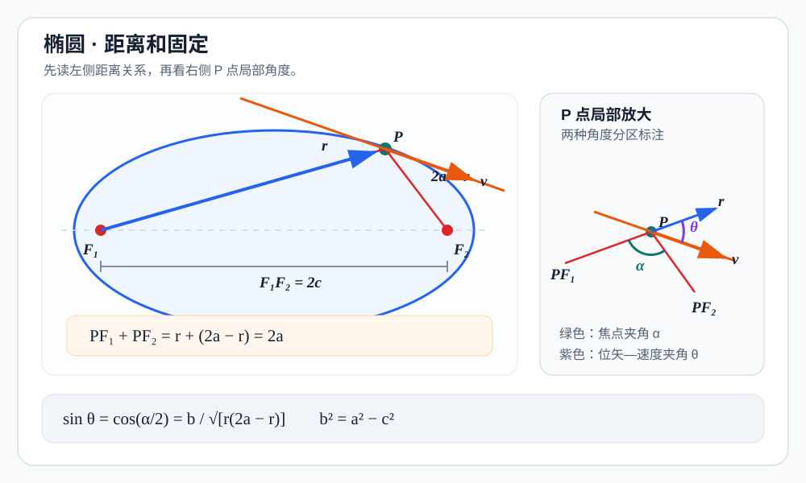
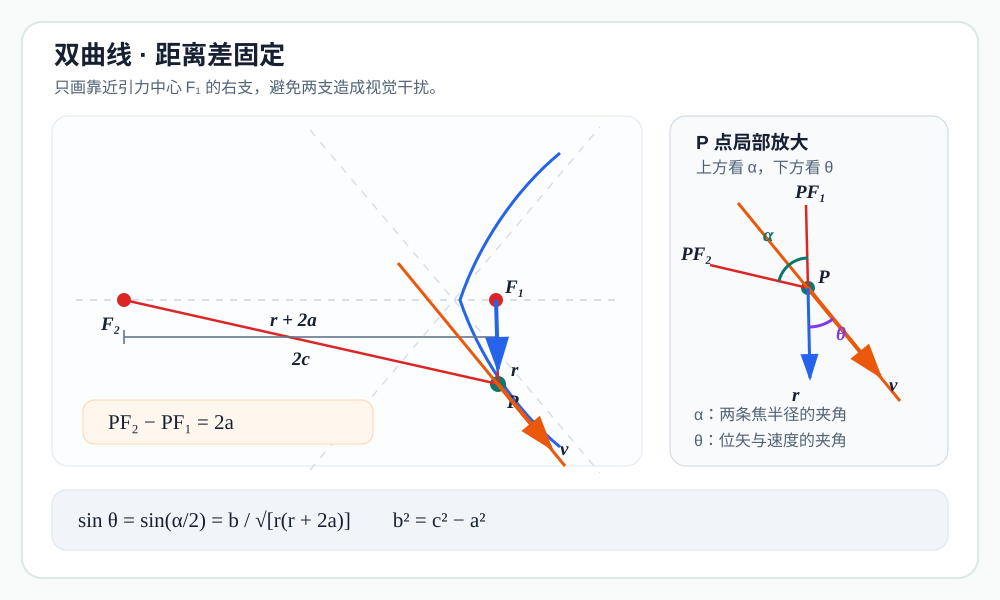

通常从牛顿引力推出圆锥曲线轨道，要解二阶微分方程，或者先写出轨道的极坐标方程。其实，如果问题只是说明某条圆锥曲线**可以**成为轨道，还有一条很漂亮的逆向道路：先假定轨迹，再用焦点几何算出速度方向，最后让能量与角动量在整条曲线上同时成立。

这个论证的计算部分只需要：

- 机械能守恒；
- 角动量守恒；
- 圆锥曲线的光学性质；
- 余弦定理和系数匹配。

下面先完整处理椭圆，再用同一种办法验证双曲线与抛物线。三种结果最终会合并成同一个偏心率公式。

## 共同起点：能量只决定速率

中心天体位于焦点 \(F_1\)，质量为 \(M\)；运动天体为 \(P\)，质量为 \(m\)。记 \(r=PF_1\)，给定角动量大小 \(L>0\)，总机械能 \(E\) 的符号暂不限定。

平方反比引力的势能为

$$
U(r)=-\frac{GMm}{r}.
$$

机械能守恒给出

$$
E=\frac12mv^2-\frac{GMm}{r},
$$

所以任一候选轨道上距离焦点 \(F_1\) 为 \(r\) 的点，其速率必须满足

$$
\boxed{v^2=\frac{2E}{m}+\frac{2GM}{r}}.
$$

这一步只确定“跑多快”；速度方向由候选曲线的切线决定。以下三次验证都从这个式子出发。

## 椭圆：距离和固定

设候选轨道是椭圆，两个焦点为 \(F_1,F_2\)，半长轴为 \(a\)，半短轴为 \(b\)，中心到焦点的距离为 \(c\)。于是

$$
F_1F_2=2c,\qquad b^2=a^2-c^2,
$$

并且

$$
PF_1+PF_2=2a.
$$

记 \(r=PF_1\)，便有 \(PF_2=2a-r\)。我们要选择合适的 \(a,c\)，使天体沿椭圆切线运动时，在每一点都具有同一个机械能 \(E<0\) 和同一个角动量 \(L\)。

### 焦点三角形与切线夹角

令

$$
\alpha=\angle F_1PF_2.
$$

椭圆的光学性质告诉我们：\(P\) 点切线平分两条焦半径所成的外角。若 \(\theta\) 是速度方向（切线方向）与位矢 \(\overrightarrow{F_1P}\) 的夹角，那么取正弦后不受射线反向影响，并且

$$
\sin\theta
=\sin\frac{\pi-\alpha}{2}
=\cos\frac{\alpha}{2}.
$$

在三角形 \(F_1PF_2\) 中使用余弦定理：

$$
(2c)^2
=r^2+(2a-r)^2-2r(2a-r)\cos\alpha.
$$

于是

$$
\begin{aligned}
1+\cos\alpha
&=\frac{2r(2a-r)+r^2+(2a-r)^2-4c^2}
        {2r(2a-r)}\\
&=\frac{(r+2a-r)^2-4c^2}{2r(2a-r)}\\
&=\frac{2(a^2-c^2)}{r(2a-r)}.
\end{aligned}
$$

利用半角公式，并记 \(b^2=a^2-c^2\)，得到

$$
\boxed{
\sin\theta
=\cos\frac{\alpha}{2}
=\sqrt{\frac{a^2-c^2}{r(2a-r)}}
=\frac{b}{\sqrt{r(2a-r)}} }.
$$

现在先把椭圆几何所给出的角动量记作 \(\Lambda(r)\)，以免提前把它当成常数：

$$
\begin{aligned}
\Lambda(r)
&=mvr\sin\theta\\
&=mvb\sqrt{\frac{r}{2a-r}}.
\end{aligned}
$$

平方后为

$$
\boxed{\Lambda(r)^2
=m^2b^2v^2\frac{r}{2a-r}}.
$$

### 系数匹配：选择椭圆参数

代入第一步的速率：

$$
\begin{aligned}
\Lambda(r)^2
&=m^2b^2\frac{r}{2a-r}
  \left(\frac{2E}{m}+\frac{2GM}{r}\right)\\
&=\frac{2mEb^2\,r+2GMm^2b^2}{2a-r}.
\end{aligned}
$$

若要对椭圆上的每一个 \(r\) 都有 \(\Lambda(r)^2=L^2\)，分子就必须恒等于

$$
L^2(2a-r).
$$

比较 \(r\) 的系数与常数项：

$$
2mEb^2=-L^2,
$$

$$
2GMm^2b^2=2aL^2.
$$

因此

$$
\boxed{b^2=-\frac{L^2}{2mE}}
$$

以及

$$
\boxed{a=-\frac{GMm}{2E}}.
$$

因为 \(E<0\)，所以 \(a>0\)、\(b^2>0\)。最后取

$$
\boxed{
c=\sqrt{a^2-b^2}
=\sqrt{
\left(\frac{GMm}{2E}\right)^2+\frac{L^2}{2mE}
}}.
$$

采用这些参数后，前面的恒等式立即变成

$$
\Lambda(r)^2=L^2,
$$

也就是说，沿整条椭圆计算出的角动量与位置 \(r\) 无关，恒为给定值 \(L\)。

### 椭圆的存在条件

\(E<0\) 只保证半长轴 \(a\) 和 \(b^2\) 为正，却还不能单独保证 \(c\) 是实数。由 \(c^2\ge0\) 必须有

$$
a^2-b^2\ge0.
$$

代入上面求出的 \(a,b\)，可写成

$$
\boxed{
1+\frac{2EL^2}{G^2M^2m^3}\ge0
}
$$

或等价地

$$
\boxed{
-\frac{G^2M^2m^3}{2L^2}\le E<0
}.
$$

这正是给定角动量 \(L\) 时束缚轨道所允许的能量范围。

- 当等号成立时，\(c=0\)，椭圆成为圆；
- 当不等号严格成立时，\(0<c<a\)，得到真正的非圆椭圆；
- 若 \(E\) 更小，公式会给出 \(c^2<0\)，说明这组 \(E,L\) 不可能对应实轨道；
- 若 \(L=0\)，则是穿过中心的退化径向运动，不是通常意义下的椭圆。

用偏心率 \(e=c/a\) 表示，这个结果也可写成

$$
\boxed{
e^2=1+\frac{2EL^2}{G^2M^2m^3}
}.
$$

对允许的 \(E<0\)，自然有 \(0\le e<1\)。

## 双曲线：距离差固定

现在令 \(E>0\)，并考察双曲线靠近焦点 \(F_1\) 的一支。仍记

$$
r=PF_1,\qquad PF_2=r+2a.
$$

这里 \(a>0\) 是双曲线的半实轴；若 \(c\) 是中心到焦点的距离，则

$$
b^2=c^2-a^2.
$$

与椭圆的“距离和固定”相比，双曲线使用的是

$$
PF_2-PF_1=2a.
$$

### 同一个焦点三角形，不同的半角公式

仍设 \(\alpha=\angle F_1PF_2\)。双曲线的光学性质给出

$$
\sin\theta=\sin\frac{\alpha}{2}.
$$

在三角形 \(F_1PF_2\) 中，

$$
\cos\alpha
=\frac{r^2+(r+2a)^2-4c^2}{2r(r+2a)}.
$$

这次计算的是 \(1-\cos\alpha\)：

$$
\begin{aligned}
1-\cos\alpha
&=\frac{2r(r+2a)-r^2-(r+2a)^2+4c^2}
        {2r(r+2a)}\\
&=\frac{4c^2-(PF_2-PF_1)^2}{2r(r+2a)}\\
&=\frac{2(c^2-a^2)}{r(r+2a)}.
\end{aligned}
$$

因此

$$
\boxed{
\sin\theta
=\sin\frac{\alpha}{2}
=\frac{b}{\sqrt{r(r+2a)}} }.
$$

双曲线几何给出的角动量为

$$
\Lambda(r)
=mvr\sin\theta
=mvb\sqrt{\frac{r}{r+2a}},
$$

从而

$$
\Lambda(r)^2
=m^2b^2v^2\frac{r}{r+2a}.
$$

代入共同的能量公式：

$$
\Lambda(r)^2
=\frac{2mEb^2\,r+2GMm^2b^2}{r+2a}.
$$

要让它恒等于 \(L^2\)，分子必须等于 \(L^2(r+2a)\)。比较系数可得

$$
\boxed{
b^2=\frac{L^2}{2mE},\qquad
a=\frac{GMm}{2E},\qquad
c=\sqrt{a^2+b^2}
}.
$$

因为 \(E>0\)，这些量对任意 \(L>0\) 都是实数。其偏心率满足

$$
\boxed{
e^2=\frac{c^2}{a^2}
=1+\frac{2EL^2}{G^2M^2m^3}>1
}.
$$

所以正能量对应一条双曲线散射轨道：天体从无穷远处带着非零剩余速度而来，绕过焦点后再次逃向无穷远。

## 抛物线：到焦点与准线等距

当 \(E=0\) 时，椭圆和双曲线公式中的 \(a\) 都趋于无穷，不能继续把“两个焦点距离”当作有限量；抛物线应改用“焦点—准线”定义。

设 \(F\) 是焦点，\(d\) 是准线，\(H\) 是 \(P\) 到准线的垂足。抛物线定义给出

$$
PF=PH=r.
$$

记焦点到准线的距离为 \(p\)，位矢 \(\overrightarrow{FP}\) 与轴的夹角为 \(\nu\)。

### 等腰三角形直接给出速度夹角

。")

沿轴方向投影“焦点到准线”的距离，得到

$$
p=r+r\cos\nu=r(1+\cos\nu).
$$

抛物线的光学性质表明，切线平分 \(PF\) 与 \(PH\) 所成的角。由于 \(PH\) 平行于轴，速度与位矢夹角的正弦满足

$$
\begin{aligned}
\sin^2\theta
&=\cos^2\frac{\nu}{2}\\
&=\frac{1+\cos\nu}{2}\\
&=\frac{p}{2r}.
\end{aligned}
$$

零能量时，能量守恒式变为

$$
v^2=\frac{2GM}{r}.
$$

于是抛物线上任意一点的角动量为

$$
\begin{aligned}
\Lambda(r)^2
&=m^2v^2r^2\sin^2\theta\\
&=m^2\frac{2GM}{r}r^2\frac{p}{2r}\\
&=GMm^2p.
\end{aligned}
$$

只要选择

$$
\boxed{p=\frac{L^2}{GMm^2}},
$$

就有 \(\Lambda(r)^2=L^2\)，与位置 \(r\) 无关。这便验证了零能量轨道可以是抛物线；此时天体在无穷远处的速率趋于零，恰好位于“返回”与“逃逸”的分界。

## 三类轨道其实是同一个公式

三次初等几何计算给出了同一个半通径

$$
\boxed{p=\frac{L^2}{GMm^2}}
$$

和同一个偏心率关系

$$
\boxed{
e^2=1+\frac{2EL^2}{G^2M^2m^3}
}.
$$

| 总机械能 | 偏心率 | 轨道 | 几何定义 |
| --- | --- | --- | --- |
| \(-\dfrac{G^2M^2m^3}{2L^2}\le E<0\) | \(0\le e<1\) | 圆或椭圆 | \(PF_1+PF_2=2a\) |
| \(E=0\) | \(e=1\) | 抛物线 | \(PF=PH\) |
| \(E>0\) | \(e>1\) | 双曲线 | \(PF_2-PF_1=2a\) |

## 为什么这种逆向验证足够有力

这套论证不是从运动方程正向“解出”圆锥曲线，而是在做一件更直接的事：

1. 假设路径是以引力中心为焦点的圆锥曲线；
2. 能量守恒给出每一点的速率；
3. 焦点性质和切线给出每一点的速度方向；
4. 选择几何参数后，算出的角动量在每一点都恰好等于 \(L\)。

角动量矢量守恒意味着关于 \(F_1\) 的力矩为零，也就是合力沿焦点方向；能量式中的势能 \(-GMm/r\) 又固定了平方反比引力。因而，在把能量守恒与角动量守恒作为平方反比中心力问题的两个第一积分之后，这个构造确实验证了该椭圆是允许的运动轨道。

需要诚实说明的是：“无微积分”指的是上述**构造与代数验证过程**不需求解微分方程。若要从牛顿第二定律严格推导能量、角动量守恒，或证明“角动量守恒等价于零力矩”，通常仍会用到时间导数。这里把这些标准守恒定律当作已知。

## 结论

在平方反比引力场中，只要给定 \(L>0\) 和允许的机械能 \(E\)，就能用纯几何与代数构造相应的圆锥曲线，使其任意一点的机械能恒为 \(E\)、角动量恒为 \(L\)：

- \(E<0\)：圆或椭圆；
- \(E=0\)：抛物线；
- \(E>0\)：双曲线。

整个核心只有一句话：

> 能量守恒决定“跑多快”，焦点几何决定“朝哪里跑”；让两者给出的角动量恒定，就反推出与 \(E,L\) 相配的圆锥曲线。
