<!--more-->
## History
Historically, Ptolemy proposed the **geocentric theory**, which believed that the earth was the center of the universe.

Later, Copernicus proposed the **Heliocentric Theory** through astronomical observations and other factual evidence (Westerners often believe that Copernicus/Galileo and others are the originators of science)

Generally speaking, the general process of scientific research is:

$$\begin{gathered}
  \text{evidence/observation}\longrightarrow \text{theory}\longrightarrow \text{experiment}
\end{gathered}$$

In order to prove the geocentric theory, Tycho conducted a large number of observations and appointed his apprentice Kepler to conduct mathematical proofs.
After Tycho's death, Kepler used Tycho's data to discover **Kepler's three laws**, which was in line with Tycho's original intention.
Going in the opposite direction

## Kepler’s three laws
- First law (orbital law): The trajectory of a planet around the sun is an ellipse, and the sun is at one focus of the ellipse
- Second law (area law): The area swept by a planet orbiting the sun per unit time is the same
- The third law (periodic law): For a planet orbiting the sun, if its semi-major axis is $a$ and the mass of the sun is $M$, then $\frac{a^3}{T^2}=\frac{GM}{4\pi^2}$

### Kepler’s second law
Kepler's second law is essentially a manifestation of the conservation of angular momentum L under the action of central force:

Since the universal gravitation has a central force, the total external force moment on the sun/planetary system is zero, so there is
$$\begin{gathered}
  L=\vec{r}\times\vec{p}=m\vec{r}\times\vec{v}=C\\
  \delta=\frac{dS}{dt}=\frac{\frac{1}{2}rvdt\sin\theta}{dt}=\frac{1}{2}|\vec{r}\times\vec{v}|=\frac{1}{2}C
\end{gathered}$$

Conclusion: Conservation of angular momentum is equivalent to Kepler’s second law (essentially<->a necessary and sufficient condition)

### Kepler’s third law
Here is a loose proof:

Assume that the elliptical orbit degenerates into a circle, then the semi-major axis degenerates into the orbit radius

$$\begin{gathered}
  \frac{GMm}{R^2}=m\frac{4\pi^2}{T^2}R\\
  \frac{R^3}{T^2}=\frac{GM}{4\pi^2}
\end{gathered}$$

## 1: Polaris Perspective
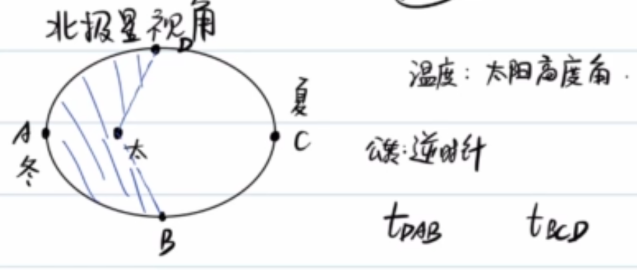

Looking at the Earth from the North Star, the Earth rotates counterclockwise and revolves around the sun counterclockwise.

On the **summer solstice** in the northern hemisphere, the earth is at **aphelion**; on the **winter solstice** in the northern hemisphere, the earth is at **perihelion**.

The difference in temperature mainly comes from **solar altitude angle**

From Kepler’s second law, it is not difficult to derive $S_{DAB}\lt S_{BCD},t_{DAB}\lt t_{BCD}$

## 2: Law of Universal Gravity
For two mass points with masses $M,m$ respectively:
$$\boxed{F=\frac{GMm}{r^2}}$$

$G=6.67\times 10^{-11}N\cdot m^2\cdot kg^{-2}$

Among them, the definition of mass of $M,m$ can be derived from the definition of inertia or the definition of gravity.

The situation of non-particles is as follows:

### Mass point and uniform spherical shell
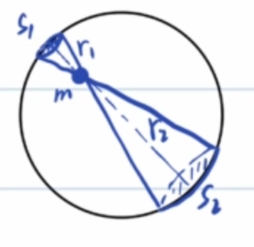

Assuming the surface density of a uniform spherical shell $\rho$, we consider the pairing of mass elements:

$$\begin{gathered}
  F_1=\frac{G\rho S_1m}{r_1^2}\\
  F_2=\frac{G\rho S_2m}{r_2^2}\\
  \frac{S_1}{S_2}=\frac{r_1^2}{r_2^2}\\
  F_1=F_2
\end{gathered}$$

It can be seen that the resultant gravitational force of all spherical shell elements on the internal particles is 0.

### Example 1
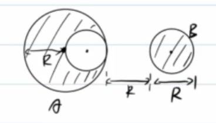

For a homogeneous sphere A with a total mass M and a radius R, cut out a small ball B with the radius R as the diameter and place it on the right side of the larger ball so that the center of the circle B is on the straight line of the cut radius and the distance between the two closest points is R. Find the force between A and B.

Consider completing A as an imaginary ball A':

$$F=\frac{GM\frac{M}{8}}{(\frac{5}{2}R)^2}-\frac{G\frac{M}{8}\frac{M}{8}}{(2R)^2}$$

### Example 2
Calculate the motion parameters of near-Earth satellites, synchronous satellites, and residents on the equator:

$$\begin{gathered}
  \frac{GMm}{R^2}=m\frac{4\pi^2}{T_{\text{near}}^2}R\\
  T_{\text{near}}=84min
\end{gathered}$$

$$\begin{gathered}
  \frac{GMm}{R_{\text{geo}}^2}=m\frac{4\pi^2}{T^2}R_{\text{geo}}\\
  R_{\text{geo}}\approx 7R
\end{gathered}$$

For residents on the equator, the situation is different:
$$\begin{gathered}
  \frac{GMm}{R^2}-N=m\frac{4\pi^2}{T^2}R\\
  N=G=mg=\frac{GMm}{R^2}-m\frac{4\pi^2}{T^2}R
\end{gathered}$$

From this point of view, gravity G is a component of universal gravitation.

The scale can never reflect the gravitational force on a person (unless you are a polar bear standing at the North Pole), the scale shows **weightN**

Estimate the magnitude of the centripetal force I experience on the equator:

$$\begin{gathered}
  F_n=m\frac{4\pi^2}{T^2}R\\=75\frac{4\pi^2}{(86400)^2}(6400\times10^3)\approx 2.5N
\end{gathered}$$

Compared with the gravity of approximately 750N, the centripetal force is insignificant.

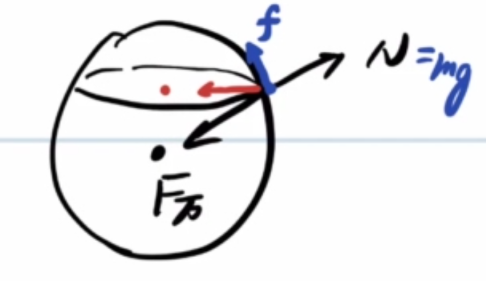

If I am not on the equator, then in order to maintain circular motion around the earth's axis, I will also experience a frictional force f from the ground.

It is easy to know that the higher the latitude, the closer the apparent gravity is to the universal gravitation, and the gravity acceleration is greater.

(~~There should be a spring scale detective story here?~~)

---

In short, if we ignore the rotation of the earth, we have:

$$\begin{gathered}
  \frac{GMm}{R^2}=mg\\
  GM=gR^2
\end{gathered}$$

Foreign textbooks call it the Golden Rule, so the Chinese call it Golden Substitution (~~Where is the gold?~~)

### Example 3
Assume that the period of the near-Earth satellite is T, find the average density of the earth $\rho$

$$\begin{gathered}
  \frac{GMm}{R^2}=m\frac{4\pi^2}{T^2}R\\
  \frac{M}{R^3}=\frac{4\pi^2}{GT^2}=\frac{4}{3}\pi\rho\\
  \rho=\frac{3\pi}{GT^2}
\end{gathered}$$

### Example 3'
The period of the neutron star pulse is about $T=\frac{1}{30}s$, estimate its density

$\rho=\frac{3\pi}{GT^2}\approx 1.3\times10^{15}kg/m^3$

### Example 4
Release a particle from a point R above the earth's surface (R is the radius of the earth), and find the time to reach the ground $t$.

It is not difficult to see that the moment of release is $a_0=\frac{1}{4}g$ and the moment of landing is $a_t=g$. Obviously, the uniform acceleration motion formula cannot be used at this time.

Ellipses have two degenerate consequences:
- Circle($e\to 0$)
- Line segment ($e\to 1$)

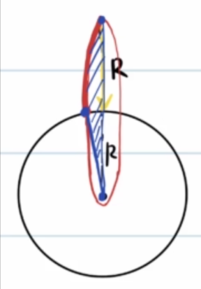

The situation in Example 4 is equivalent to the ellipse degenerating into a line segment ($e\to 1,a\to R$), then Kepler's second/third law can be used to calculate the motion time.

Here are all the relevant formulas we know about:
$$\begin{gathered}
  \delta=\frac{dS}{dt}\\
  T=\frac{S}{\delta}\\
  S=\pi ab\\
  \frac{T^2}{a^3}=\frac{4\pi^2}{GM}
\end{gathered}$$

So we can get:
$$\begin{gathered}
  T=\sqrt{\frac{4\pi^2R^3}{GM}}\\
  \frac{t}{T}=\frac{S'}{S}\\
  S'=\frac{1}{4}\pi ab+\frac{1}{2}ab,S=\pi ab\\
  t=T\frac{\pi+2}{4\pi}=\frac{\pi+2}{4\pi}\sqrt{\frac{4\pi^2R^3}{GM}}\\
  =\frac{\pi+2}{2}\sqrt{\frac{R^3}{GM}}
\end{gathered}$$
### Example 5(4+)
Two particles with mass $m_1,m_2$ and distance $L$ are released from rest at the same time. Find the time it takes for the two to meet $t$.

It is not difficult to see that the total external force on the system is 0, the centers of mass of the two are stationary, and the place where the two collide is the center of mass.

Method 1: Based on relative acceleration, obtain a reduced mass.

Method 2: Equivalence method

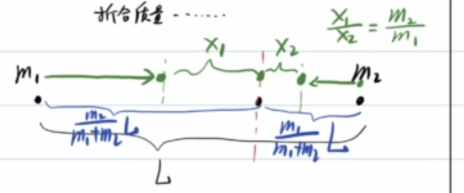

Defined by the center of mass: $m_1x_1=m_2x_2$, where $x_1,x_2$ is the distance from the two mass points to the center of mass.

Note that $F_{ab}$ is the force a receives from b, then:

$$\begin{gathered}
  F_{12}=\frac{Gm_1m_2}{(x_1+x_2)^2}=\frac{Gm_1m_2}{(x_1+\frac{m_1}{m_2}x_1)^2}\\
  =\frac{G\frac{m_2^3}{(m_1+m_2)^2}m_1}{x_1^2}
\end{gathered}$$

Then, the gravitational force of $m_2$ suffered by $m_1$ can be regarded as the gravitational force of the particle with mass $\frac{m_2^3}{(m_1+m_2)^2}$ at point O on $m_1$.

Therefore, Example 5 is transformed into the closed case of Example 4.

$m_1$ Initial distance to center of mass $d_1=\frac{m_2}{m_1+m_2}L$

From Kepler's second/third law
$$\begin{gathered}
  \frac{(\frac{d_1}{2})^3}{T^2}=\frac{GM}{4\pi^2}\\
  T=\sqrt{\frac{4\pi^2(\frac{d_1}{2})^3}{GM}}=\pi\sqrt{\frac{d_1^3}{2GM}}\\
  t=\frac{1}{2}T=\pi \sqrt{\frac{(\frac{m_2}{m_1+m_2}L)^3}{8G(\frac{m_2^3}{(m_1+m_2)^2})}}\\
  =\pi\sqrt{\frac{L^3}{8G(m_1+m_2)}}
\end{gathered}$$

### Example 6
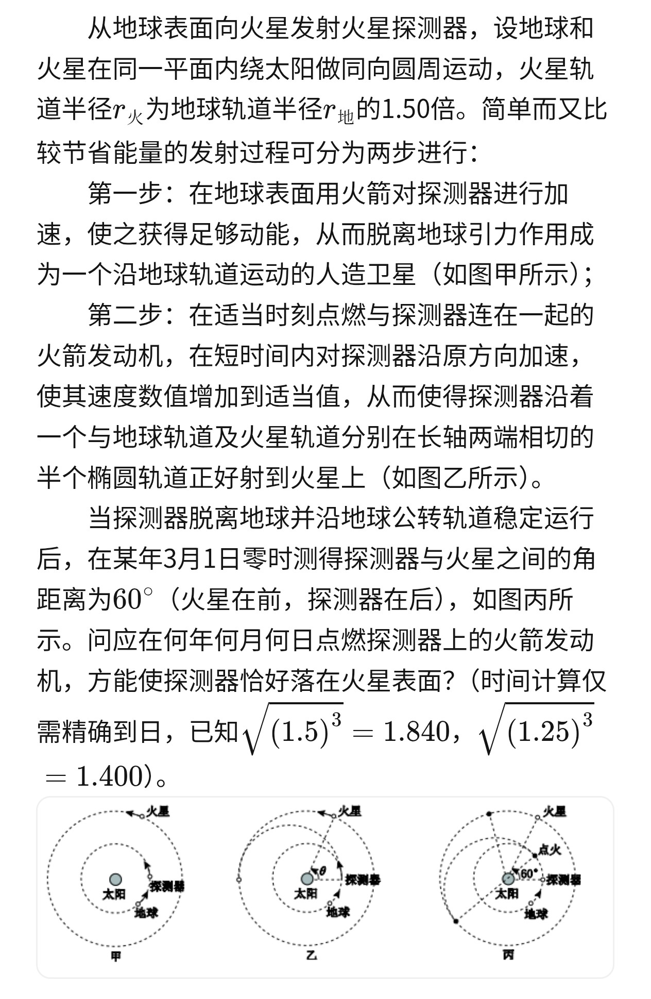
Semi-major axis of semi-elliptical orbit $a=\frac{R_m+R_0}{2}=1.25R_0$

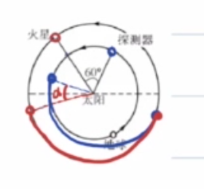

After a little analysis, it can be seen that the angular distance between the probe and Mars $\alpha$ is constantly shrinking.

Then, we only need to make the time when Mars moves at $\pi-\alpha$ angle and the detector moves at $\pi$ angle the same.

For the convenience of description, the Earth, Mars, and the probe are called (e)arth, (m)ars, and (r)over respectively.
$$\begin{gathered}
  T_e=365 day\\
  T_m=T_e\sqrt{1.5^3}=671 day\\
  T_r=T_e\sqrt{1.25^3}=510 day\\
  \frac{1}{2}T_r=255 day\\
  \frac{\pi-\alpha}{2\pi}T_m=\frac{1}{2}T_r\\
  \alpha=\frac{161}{671}\pi\\
  \frac{\pi}{3}-\alpha=(\frac{2\pi}{T_e}-\frac{2\pi}{T_m})t\\
  t\approx 37day
\end{gathered}$$

If 0:00 on March 1 is pushed back 30 days, it will be 0:00 on March 31, and if it is pushed back 37 days, it will be 0:00 on April 7.

So **fire on April 7th**.

### Double star problem
Assume that the motion between two particles with masses both of $m$ reaches stability, the distance between them is $l$, the total external force of the system is 0, momentum is conserved, and the center of mass does not move.

$$\begin{gathered}
  G\frac{mm}{l^2}=m\frac{4\pi^2}{T^2}\frac{l}{2}\\
  T=2\pi\sqrt{\frac{l^3}{G(2m)}}
\end{gathered}$$

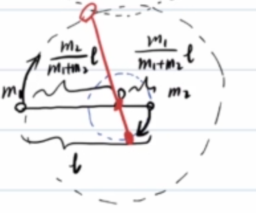

Generally speaking, if the masses of two particles are $m_1,m_2$ respectively, then the distance from the center of mass to $m_1$ is $\frac{m_2}{m_1+m_2}l$

$$\begin{gathered}
  G\frac{m_1m_2}{l^2}=m_1\frac{4\pi^2}{T^2}\frac{m_2}{m_1+m_2}l\\
  T=2\pi\sqrt{\frac{l^3}{G(m_1+m_2)}}
\end{gathered}$$

### Samsung problem
#### Situation 1
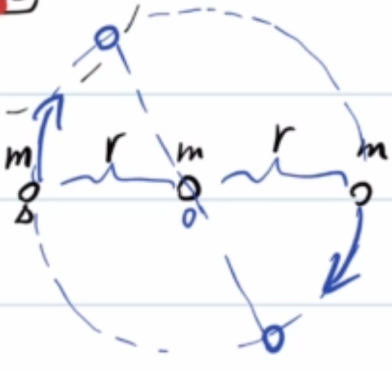

$$\frac{Gmm}{r^2}+\frac{Gmm}{(2r)^2}=m\frac{4\pi^2}{T^2}r$$

#### Situation 2
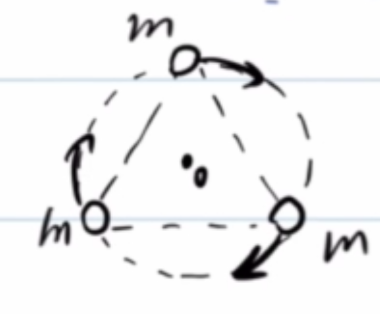

$$2\frac{\sqrt{3}}{2}\frac{Gmm}{(\sqrt{3}r)^2}=m\frac{4\pi^2}{T^2}r$$

## Three: Celestial Energy
### Gravitational potential energy
Assuming that infinity is the zero point of potential energy, then the gravitational potential energy between particles with mass $M,m$ is:

$$\boxed{E=-\frac{GMm}{r}=-W}$$

Among them, $W$ is the work done by gravity when $m$ moves from the infinite point to $r$.

#### Proof
$$\begin{gathered}
  W=\int_{\infty}^{r}\frac{GMm}{r^2}dr=\frac{GMm}{r}
\end{gathered}$$

This is a typical **abnormal integral**

Or consider micro-element method accumulation:

$$\begin{gathered}
  \Delta W_1=\frac{GMm}{r_1r_2}(r_2-r_1)=GMm(\frac{1}{r_1}-\frac{1}{r_2})\\
  \Delta W_2=\frac{GMm}{r_2r_3}(r_3-r_2)=GMm(\frac{1}{r_2}-\frac{1}{r_3})\\
  ...\\
  \sum \Delta W=GMm(\frac{1}{r_1}-\frac{1}{r_n})\\
  =\int_{\infty}^{r}\frac{GMm}{r^2}dr=\frac{GMm}{r}
  (r_1\to \infty,r_n=r)
\end{gathered}$$

### Total energy of elliptical orbit
Proof: The total energy of an elliptical orbit

$$\boxed{E=E_k+E_p=-\frac{GMm}{2a}}$$

According to the conservation of mechanical energy, just calculate the mechanical energy at any point on the orbit.

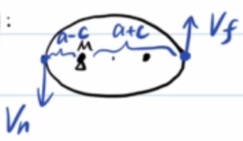

Suppose the perihelion (n) ear speed is $v_n$ and the aphelion (f) ar speed is $v_f$.

$$\begin{gathered}
  E=\frac{1}{2}mv_n^2+(-\frac{GMm}{a-c})\\
  =\frac{1}{2}mv_f^2+(-\frac{GMm}{a+c})\\
  L=mv_n(a-c)=mv_f(a+c)\\
  \Longrightarrow \frac{1}{2}mv_f^2(\frac{a+c}{a-c})^2+(-\frac{GMm}{a-c})=\frac{1}{2}mv_f^2+(-\frac{GMm}{a+c})\\
  \Longrightarrow \begin{cases}
    v_f^2=GM(\frac{a-c}{a+c})\frac{1}{a},\\
    v_n^2=GM(\frac{a+c}{a-c})\frac{1}{a}
  \end{cases}\\
  E=\frac{1}{2}mGM(\frac{a+c}{a-c})\frac{1}{a}+(-\frac{GMm}{a+c})\\
  =-\frac{GMm}{2a}
\end{gathered}$$

Obviously, among various Conic Sections, ellipses (closed curves) have the smallest energy, and unclosed curves have greater energy.
- Ellipse: $E\lt0$
- Parabola: $E=0$
- Hyperbola: $E=\frac{GMm}{2a}\gt0$

## Four: Cosmic speed
**Cosmic velocity**: **different initial velocities** required to launch satellites from the earth's surface to **achieve different effects**
### First cosmic speed
$v_1$ =7.9km/s, also known as **orbiting speed**
  
$$\frac{GMm}{R^2}=m\frac{v_1^2}{R},v_1=\sqrt{gr}$$

### Second universe speed
$v_2=11.2km/s$, also known as **breakaway speed**

$$E=\frac{1}{2}mv_2^2+(-\frac{GMm}{R})=0,v_2=\sqrt{2gr}=\sqrt{2}v_1$$

### The third universe speed
$v_3=16.7km/s$, also known as **escape velocity**

Relative to the sun, leave to infinity (leave the earth first, then leave the sun)

The first step of mechanical energy conservation takes the earth (e) arth as the system, and the second step takes the sun (s) un as the system.

$$\begin{gathered}
  \frac{1}{2}mv_3^2-\frac{GM_em}{R}=\frac{1}{2}mv_3'^2\\
  \frac{1}{2}m(v_3'+v_e)^2+(-\frac{GM_sm}{R_s})=0
\end{gathered}$$

### Example 7
Ignoring the rotation of the earth, launch a missile from the equator so that it can hit the North Pole. Find the minimum launch speed.

Known: $G$, Earth’s radius $R$, Earth’s mass $M$

$$\begin{gathered}
  E=(-\frac{GMm}{R})+\frac{1}{2}mv_0^2\\
  v_{min}\leftarrow E_{min}\leftarrow \frac{-GMm}{2a}\leftarrow a_{min}\\
\end{gathered}$$

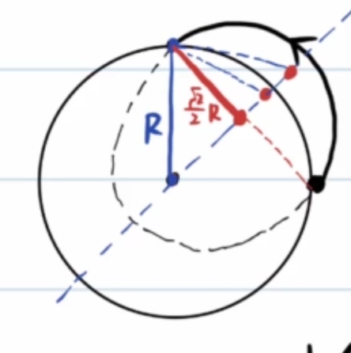

By the first definition of ellipse, $2a_{min}=(1+\frac{\sqrt{2}}{2})R$

$$\begin{gathered}
  E=(-\frac{GMm}{R})+\frac{1}{2}mv_{min}^2=-\frac{GMm}{(1+\frac{\sqrt{2}}{2})R}
\end{gathered}$$

So it is not difficult to see:
- Close-to-ground missiles are not the solution with the smallest initial velocity
- If the initial velocity is less than $v_1$, then $2a\lt R$, the elliptical orbit must intersect the earth

## Write at the end

Looking back, we can see that this journey has gone from Tycho's stubbornness and Kepler's "betrayal" to the three major cosmic speeds.

If you want to condense the whole article into a few sentences:

- The essence of **Kepler's second law** is the conservation of angular momentum, and the **third law** can be proved at a glance under the circular orbit approximation;
- The gravitational force of a uniform spherical shell on the internal particle is zero, and the gravitational force on the outside is equivalent to a particle at the center of mass - this is the key to dealing with the gravitational force of all spheres;
- Gravity is only a component of the universal gravitation force, and the weight scale always measures weight (unless you are really that polar bear at the North Pole);
- **Gold Substitution** $GM=gR^2$ appears in almost all estimates, although where the gold is is still a mystery;
- The total energy of the elliptical orbit $E=-\frac{GMm}{2a}$ is only related to the semi-major axis, so when the ellipse degenerates into a line segment, problems such as free fall and binary star encounters that "seem to be impossible to use uniform acceleration" can be solved by Kepler's law;
- The three major cosmic velocities $v_1:v_2:v_3=7.9:11.2:16.7$ correspond to orbit, escape, and escape respectively—and the minimum launch speed scheme is often not the low-Earth orbit you think.

Gravity has written apples and planets into the same formula. Next time you look up and see the summer at aphelion, you will probably have a smile.
