<!--more-->
## 历史
历史上,托勒密提出了**地心说**,认为地球是宇宙的中心.

后来,哥白尼通过天文观测等事实证据,提出了**日心说**(西方人往往认为哥白尼/伽利略等人是科学的鼻祖)

一般来讲,科学研究的一般过程是:

$$\begin{gathered}
  \text{事实证据/观测}\longrightarrow \text{理论}\longrightarrow \text{实验}
\end{gathered}$$

第谷为了证明**地心说**,进行了大量观测,并委任徒弟开普勒进行数学证明.
第谷死后,开普勒利用第谷的数据发现了**开普勒三定律**,这与第谷的本意
背道而驰

## 开普勒三定律
- 第一定律(轨道定律):行星绕太阳运动的轨迹为椭圆,太阳在椭圆的一个焦点上
- 第二定律(面积定律):行星绕太阳单位时间扫过的面积相同
- 第三定律(周期定律):绕太阳运动的行星,若设其半长轴为$a$,太阳质量为$M$,则$\frac{a^3}{T^2}=\frac{GM}{4\pi^2}$

### 开普勒第二定律
开普勒第二定律本质上是有心力作用下**角动量L守恒**的体现:

由于万有引力是有心力,太阳/行星系统 所受的合外力力矩为零,所以有
$$\begin{gathered}
  L=\vec{r}\times\vec{p}=m\vec{r}\times\vec{v}=C\\
  \delta=\frac{dS}{dt}=\frac{\frac{1}{2}rvdt\sin\theta}{dt}=\frac{1}{2}|\vec{r}\times\vec{v}|=\frac{1}{2}C
\end{gathered}$$

结论:角动量守恒与开普勒第二定律等价(本质上<->充要条件)

### 开普勒第三定律
这里给出不严密的证明:

设椭圆轨道退化为圆,则半长轴退化为轨道半径

$$\begin{gathered}
  \frac{GMm}{R^2}=m\frac{4\pi^2}{T^2}R\\
  \frac{R^3}{T^2}=\frac{GM}{4\pi^2}
\end{gathered}$$

## 一:北极星视角
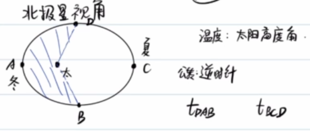

从北极星看地球,地球逆时针**自转**,绕太阳逆时针**公转**

在北半球的**夏至日**,地球反而在**远日点**;在北半球的**冬至日**,地球反而在**近日点**.

温度的差异主要来自于**太阳高度角**

由开普勒第二定律,不难得出$S_{DAB}\lt S_{BCD},t_{DAB}\lt t_{BCD}$

## 二:万有引力定律
对于质量分别为$M,m$的两质点:
$$\boxed{F=\frac{GMm}{r^2}}$$

$G=6.67\times 10^{-11}N\cdot m^2\cdot kg^{-2}$

其中$M,m$质量定义可由惯性定义导出,也可有引力定义导出

非质点的情况如下图:

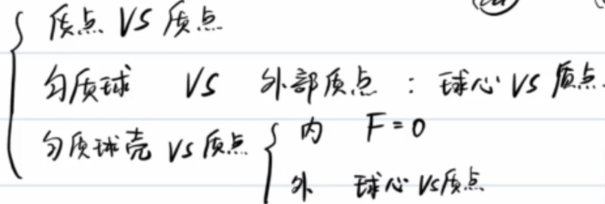

### 质点和均匀球壳
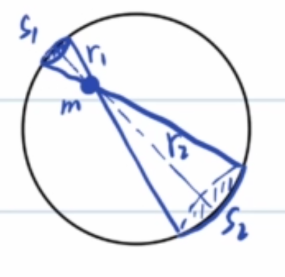

设均匀球壳的面密度$\rho$,我们考虑质元的配对:

$$\begin{gathered}
  F_1=\frac{G\rho S_1m}{r_1^2}\\
  F_2=\frac{G\rho S_2m}{r_2^2}\\
  \frac{S_1}{S_2}=\frac{r_1^2}{r_2^2}\\
  F_1=F_2
\end{gathered}$$

可见所有球壳微元对内部质点的引力合力为0.

### 例1
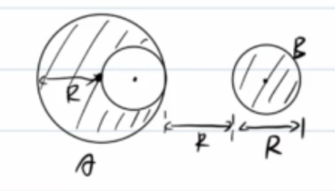

对于总质量为M,半径为R的均质球A,以半径R为直径切出一个小球B,放在大球右侧,使得B的圆心在被切除的半径所在直线上,两者最接近的两点距离为R,求A,B间的作用力

考虑补全A为一个假想球A':

$$F=\frac{GM\frac{M}{8}}{(\frac{5}{2}R)^2}-\frac{G\frac{M}{8}\frac{M}{8}}{(2R)^2}$$

### 例2
计算近地卫星,同步卫星,赤道上居民的运动参量:

$$\begin{gathered}
  \frac{GMm}{R^2}=m\frac{4\pi^2}{T_{\text{近}}^2}R\\
  T_{\text{近}}=84min
\end{gathered}$$

$$\begin{gathered}
  \frac{GMm}{R_{\text{同}}^2}=m\frac{4\pi^2}{T^2}R_{\text{同}}\\
  R_{\text{同}}\approx 7R
\end{gathered}$$

对于赤道上的居民,情况有所不同:
$$\begin{gathered}
  \frac{GMm}{R^2}-N=m\frac{4\pi^2}{T^2}R\\
  N=G=mg=\frac{GMm}{R^2}-m\frac{4\pi^2}{T^2}R
\end{gathered}$$

从这一点上看,重力G是万有引力的分力.

体重秤从来不能反映人所受的万有引力(除非您是一头站在北极点的polar bear),体重秤显示的是**视重N**

估算一下我在赤道上所受向心力的大小:

$$\begin{gathered}
  F_n=m\frac{4\pi^2}{T^2}R\\=75\frac{4\pi^2}{(86400)^2}(6400\times10^3)\approx 2.5N
\end{gathered}$$

相比于近似750N的重力,向心力微不足道.

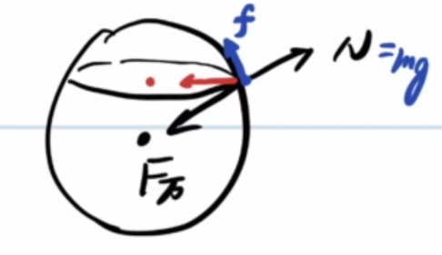

如果我不在赤道上,那么为了保持绕地轴做圆周运动,我还会受到地面的摩擦力f.

容易知道,纬度越高,视重越接近万有引力,重力加速度更大.

(~~此处应该有弹簧秤侦探小故事?~~)

---

总之,如果忽略地球自转,有:

$$\begin{gathered}
  \frac{GMm}{R^2}=mg\\
  GM=gR^2
\end{gathered}$$

国外的教材称之为Golden Rule,中国人因此称之为黄金代换(~~到底黄金在哪里呢?~~)

### 例3
设近地卫星周期为T,求地球的平均密度$\rho$

$$\begin{gathered}
  \frac{GMm}{R^2}=m\frac{4\pi^2}{T^2}R\\
  \frac{M}{R^3}=\frac{4\pi^2}{GT^2}=\frac{4}{3}\pi\rho\\
  \rho=\frac{3\pi}{GT^2}
\end{gathered}$$

### 例3'
中子星脉冲的周期约为$T=\frac{1}{30}s$,估算其密度

$\rho=\frac{3\pi}{GT^2}\approx 1.3\times10^{15}kg/m^3$

### 例4
将一个质点从地表上方R处(R为地球半径)释放,求到达地面的时间$t$.

不难看出,释放瞬间$a_0=\frac{1}{4}g$,落地时$a_t=g$,显然此时不能使用匀加速运动公式.

椭圆有两种退化的结果:
- 圆($e\to 0$)
- 线段($e\to 1$)

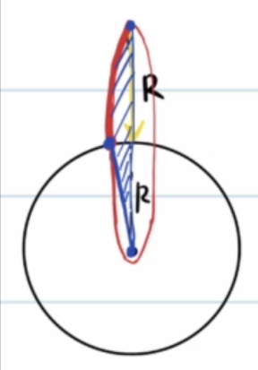

例4的情况相当于椭圆退化为线段($e\to 1,a\to R$),那么便可以运用开普勒第二/三定律求运动时间.

以下是我们所知的所有相关公式:
$$\begin{gathered}
  \delta=\frac{dS}{dt}\\
  T=\frac{S}{\delta}\\
  S=\pi ab\\
  \frac{T^2}{a^3}=\frac{4\pi^2}{GM}
\end{gathered}$$

于是可以得到:
$$\begin{gathered}
  T=\sqrt{\frac{4\pi^2R^3}{GM}}\\
  \frac{t}{T}=\frac{S'}{S}\\
  S'=\frac{1}{4}\pi ab+\frac{1}{2}ab,S=\pi ab\\
  t=T\frac{\pi+2}{4\pi}=\frac{\pi+2}{4\pi}\sqrt{\frac{4\pi^2R^3}{GM}}\\
  =\frac{\pi+2}{2}\sqrt{\frac{R^3}{GM}}
\end{gathered}$$
### 例5(4+)
两个质量分别为$m_1,m_2$的质点,距离为$L$,二者同时由静止释放,求二者相遇所用时间$t$.

不难看出,系统所受合外力为0,二者质心静止不动,且二者相撞之处为质心.

法一:根据相对加速度,得出一个折合质量.

法二:等效法

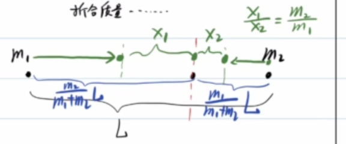

由质心定义:$m_1x_1=m_2x_2$,其中$x_1,x_2$为两质点到质心的距离.

记$F_{ab}$是a受到b的力,则:

$$\begin{gathered}
  F_{12}=\frac{Gm_1m_2}{(x_1+x_2)^2}=\frac{Gm_1m_2}{(x_1+\frac{m_1}{m_2}x_1)^2}\\
  =\frac{G\frac{m_2^3}{(m_1+m_2)^2}m_1}{x_1^2}
\end{gathered}$$

那么,$m_1$所受$m_2$的引力可以视为O点处质量为$\frac{m_2^3}{(m_1+m_2)^2}$的质点对$m_1$的引力.

于是,例5转化为了例4的closed case.

$m_1$初始到质心的距离$d_1=\frac{m_2}{m_1+m_2}L$

由开普勒第二/三定律
$$\begin{gathered}
  \frac{(\frac{d_1}{2})^3}{T^2}=\frac{GM}{4\pi^2}\\
  T=\sqrt{\frac{4\pi^2(\frac{d_1}{2})^3}{GM}}=\pi\sqrt{\frac{d_1^3}{2GM}}\\
  t=\frac{1}{2}T=\pi \sqrt{\frac{(\frac{m_2}{m_1+m_2}L)^3}{8G(\frac{m_2^3}{(m_1+m_2)^2})}}\\
  =\pi\sqrt{\frac{L^3}{8G(m_1+m_2)}}
\end{gathered}$$

### 例6
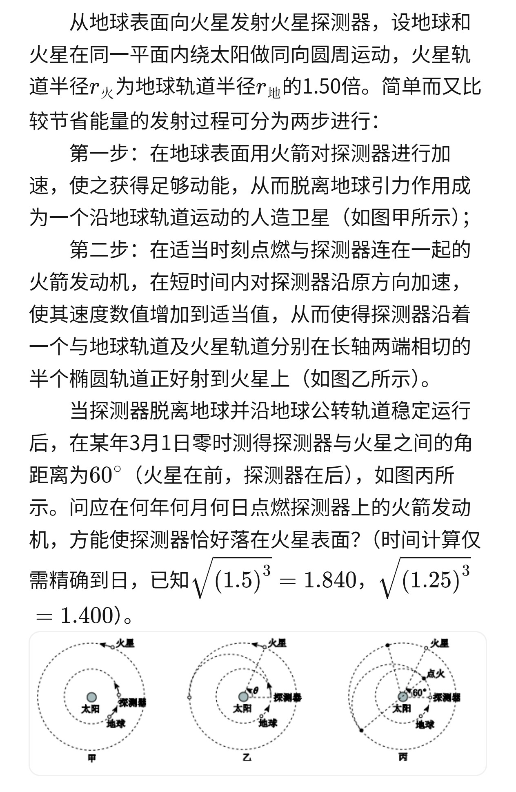
半椭圆轨道的半长轴$a=\frac{R_m+R_0}{2}=1.25R_0$

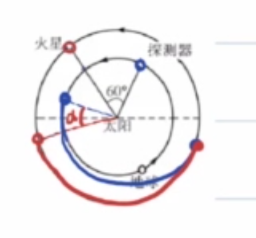

稍加分析,可知探测器与火星间的角距离$\alpha$不断缩小.

那么,我们只需要让火星运行$\pi-\alpha$角度和探测器运动$\pi$角度的时间相同即可.

为了叙述方便,把地球,火星,探测器分别称为(e)arth,(m)ars,(r)over
$$\begin{gathered}
  T_e=365 day\\
  T_m=T_e\sqrt{1.5^3}=671 day\\
  T_r=T_e\sqrt{1.25^3}=510 day\\
  \frac{1}{2}T_r=255 day\\
  \frac{\pi-\alpha}{2\pi}T_m=\frac{1}{2}T_r\\
  \alpha=\frac{161}{671}\pi\\
  \frac{\pi}{3}-\alpha=(\frac{2\pi}{T_e}-\frac{2\pi}{T_m})t\\
  t\approx 37day
\end{gathered}$$

3月1日零时往后推30天为3月31日零时,后推37天则是4月7日零时.

故**4月7日点火**.

### 双星问题
设两个质量均为$m$的质点之间的运动达到稳定,二者距离为$l$,系统合外力为0,动量守恒,质心不动.

$$\begin{gathered}
  G\frac{mm}{l^2}=m\frac{4\pi^2}{T^2}\frac{l}{2}\\
  T=2\pi\sqrt{\frac{l^3}{G(2m)}}
\end{gathered}$$

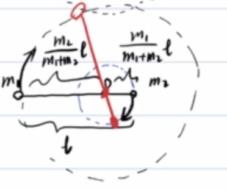

一般地,若两质点质量分别为$m_1,m_2$,则质心到$m_1$距离为$\frac{m_2}{m_1+m_2}l$

$$\begin{gathered}
  G\frac{m_1m_2}{l^2}=m_1\frac{4\pi^2}{T^2}\frac{m_2}{m_1+m_2}l\\
  T=2\pi\sqrt{\frac{l^3}{G(m_1+m_2)}}
\end{gathered}$$

### 三星问题
#### 情况一
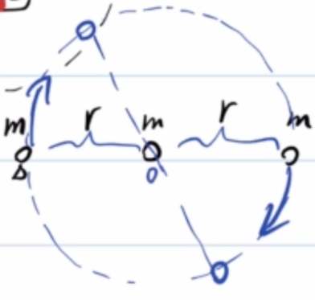

$$\frac{Gmm}{r^2}+\frac{Gmm}{(2r)^2}=m\frac{4\pi^2}{T^2}r$$

#### 情况二
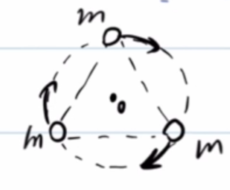

$$2\frac{\sqrt{3}}{2}\frac{Gmm}{(\sqrt{3}r)^2}=m\frac{4\pi^2}{T^2}r$$

## 三:天体能量
### 引力势能
设无穷远处为势能零点,则质量为$M,m$的质点之间引力势能为:

$$\boxed{E=-\frac{GMm}{r}=-W}$$

其中,$W$是$m$从无穷远点运动到$r$处引力做的功.

#### 证明
$$\begin{gathered}
  W=\int_{\infty}^{r}\frac{GMm}{r^2}dr=\frac{GMm}{r}
\end{gathered}$$

这是一个典型的**反常积分**

或者考虑微元法累加:

$$\begin{gathered}
  \Delta W_1=\frac{GMm}{r_1r_2}(r_2-r_1)=GMm(\frac{1}{r_1}-\frac{1}{r_2})\\
  \Delta W_2=\frac{GMm}{r_2r_3}(r_3-r_2)=GMm(\frac{1}{r_2}-\frac{1}{r_3})\\
  ...\\
  \sum \Delta W=GMm(\frac{1}{r_1}-\frac{1}{r_n})\\
  =\int_{\infty}^{r}\frac{GMm}{r^2}dr=\frac{GMm}{r}
  (r_1\to \infty,r_n=r)
\end{gathered}$$

### 椭圆轨道总能量
证明:椭圆轨道的总能量

$$\boxed{E=E_k+E_p=-\frac{GMm}{2a}}$$

根据机械能守恒,只要算出轨道上任意一点的机械能即可.

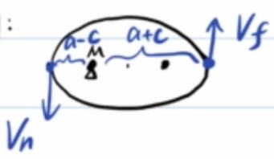

设近日点(n)ear速度为$v_n$,远日点(f)ar速度为$v_f$.

$$\begin{gathered}
  E=\frac{1}{2}mv_n^2+(-\frac{GMm}{a-c})\\
  =\frac{1}{2}mv_f^2+(-\frac{GMm}{a+c})\\
  L=mv_n(a-c)=mv_f(a+c)\\
  \Longrightarrow \frac{1}{2}mv_f^2(\frac{a+c}{a-c})^2+(-\frac{GMm}{a-c})=\frac{1}{2}mv_f^2+(-\frac{GMm}{a+c})\\
  \Longrightarrow \begin{cases}
    v_f^2=GM(\frac{a-c}{a+c})\frac{1}{a},\\
    v_n^2=GM(\frac{a+c}{a-c})\frac{1}{a}
  \end{cases}\\
  E=\frac{1}{2}mGM(\frac{a+c}{a-c})\frac{1}{a}+(-\frac{GMm}{a+c})\\
  =-\frac{GMm}{2a}
\end{gathered}$$

显然,在各种圆锥曲线中,椭圆(闭合曲线)的能量最小,不闭合的曲线能量更大.
- 椭圆:$E\lt0$
- 抛物线:$E=0$
- 双曲线:$E=\frac{GMm}{2a}\gt0$

## 四:宇宙速度
**宇宙速度**:从地球表面发射卫星为**达到不同效果**而需要的**不同初速度**
### 第一宇宙速度
$v_1$=7.9km/s,又称**环绕速度**
  
$$\frac{GMm}{R^2}=m\frac{v_1^2}{R},v_1=\sqrt{gr}$$

### 第二宇宙速度
$v_2=11.2km/s$,又称**脱离速度**

$$E=\frac{1}{2}mv_2^2+(-\frac{GMm}{R})=0,v_2=\sqrt{2gr}=\sqrt{2}v_1$$

### 第三宇宙速度
$v_3=16.7km/s$,又称**逃逸速度**

相对于太阳离开到无穷远(先离开地球,再离开太阳)

第一步的机械能守恒以地球(e)arth为系,第二步以太阳(s)un为系.

$$\begin{gathered}
  \frac{1}{2}mv_3^2-\frac{GM_em}{R}=\frac{1}{2}mv_3'^2\\
  \frac{1}{2}m(v_3'+v_e)^2+(-\frac{GM_sm}{R_s})=0
\end{gathered}$$

### 例7
不计地球自转,从赤道上发射一颗导弹,使之能击中北极点,求最小发射速度.

已知:$G$,地球半径$R$,地球质量$M$

$$\begin{gathered}
  E=(-\frac{GMm}{R})+\frac{1}{2}mv_0^2\\
  v_{min}\leftarrow E_{min}\leftarrow \frac{-GMm}{2a}\leftarrow a_{min}\\
\end{gathered}$$

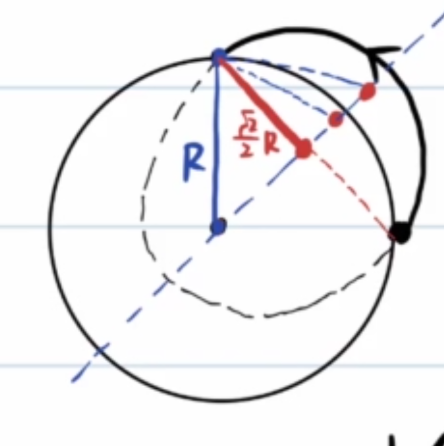

由椭圆的第一定义,$2a_{min}=(1+\frac{\sqrt{2}}{2})R$

$$\begin{gathered}
  E=(-\frac{GMm}{R})+\frac{1}{2}mv_{min}^2=-\frac{GMm}{(1+\frac{\sqrt{2}}{2})R}
\end{gathered}$$

于是不难看出:
- 近地导弹不是初速度最小的方案
- 如果初速度小于$v_1$,则$2a\lt R$,椭圆轨道必定与地球相交

## 写在最后

回头看看,这一路从第谷的执拗、开普勒的"背叛",走到了三大宇宙速度.

如果要把整篇浓缩成几句话:

- **开普勒第二定律** 的本质是角动量守恒,**第三定律** 则在圆轨道近似下一眼可证;
- 均匀球壳对内部质点引力为零,对外部则等效于质心处的一个质点——这是处理一切球体引力的钥匙;
- 重力只是万有引力的一个分力,体重秤量的从来是 **视重**(除非您真是北极点上那头 polar bear);
- **黄金代换** $GM=gR^2$ 几乎贯穿所有估算,虽然黄金到底在哪还是个谜;
- 椭圆轨道总能量 $E=-\frac{GMm}{2a}$ 只和半长轴有关,于是椭圆退化成线段时,自由落体、双星相遇这类"看似不能用匀加速"的问题,都能被开普勒定律一网打尽;
- 三大宇宙速度 $v_1:v_2:v_3=7.9:11.2:16.7$,分别对应环绕、脱离、逃逸——而最小发射速度的方案,往往不是你以为的那条近地轨道.

万有引力把苹果和行星写进了同一个公式里.下次抬头看见远日点的夏天,大概就能会心一笑了.