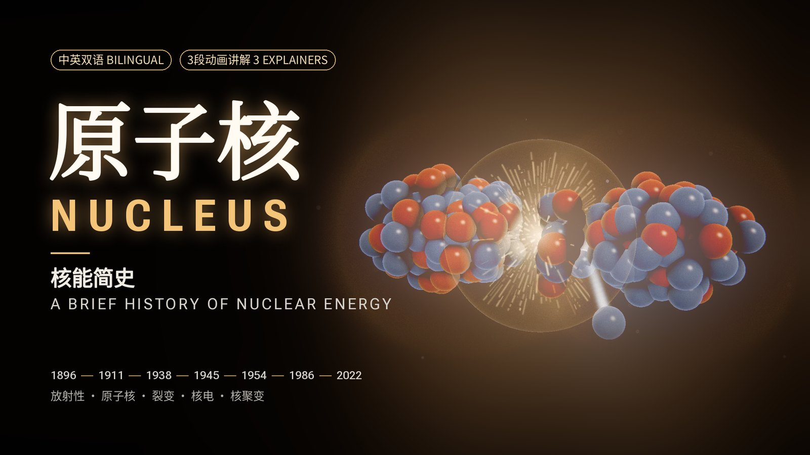

<!-- 视频上传后在此嵌入，例如：
<iframe src="https://player.bilibili.com/player.html?bvid=BV..." width="100%" height="480" frameborder="0" allowfullscreen></iframe>
-->

《原子核》（**NUCLEUS**）是一部时长5分48秒的核能纪录短片。故事从1896年巴黎一个抽屉里意外感光的照相底片讲起，一直讲到人类今天试图在地球上"建造一颗恒星"的机器。影片配有中英双语字幕（中文在上、英文在下）和原创配乐，并穿插三段面向高中生的动画讲解。

这部片子没有用到摄像机、视频生成模型，也没有用到显卡。每一帧画面都由代码计算得出：GLSL着色器、cairo矢量图形和Python程序，运行在一部安卓手机的Termux终端里，靠CPU渲染。在Claude Code中工作的Claude Opus 5.5编写了全部代码，查找并核实了史实与历史图片，创作了配乐，并完成了质量检查；我负责导演：给出需求、审定分镜，并提出每一轮修改。

这篇文章分两部分：影片讲了什么，以及它是怎样做出来的。

## 影片内容

影片按时间顺序展开，并在三处停下来讲清背后的科学原理。

| 时间 | 章节 |
|---|---|
| 0:00 | 开场：万物皆由原子构成 |
| 0:12 | **讲解：**天然放射性（贝克勒尔1896年、居里夫妇1898年、α/β/γ射线、半衰期） |
| 0:48 | 卢瑟福的金箔实验（1909年）与原子核的发现（1911年） |
| 1:12 | 查德威克发现中子（1932年）与柏林的核裂变实验（1938年） |
| 1:33 | 链式反应与爱因斯坦致罗斯福的信（1939年） |
| 1:48 | 芝加哥一号堆（1942年）与曼哈顿计划 |
| 2:03 | "三位一体"：人类首次核试验（1945年7月16日） |
| 2:15 | 广岛与长崎（1945年8月） |
| 2:36 | 最早的核电：EBR-I（1951年）、奥布宁斯克（1954年）、考尔德霍尔（1956年） |
| 2:54 | **讲解：**反应堆如何保持可控（马尔可夫链） |
| 3:30 | 切尔诺贝利（1986年）、普里皮亚季与福岛第一核电站（2011年） |
| 3:54 | 核聚变：太阳、美国国家点火装置实现点火（2022年）、ITER |
| 4:18 | **讲解：**托卡马克如何约束等离子体（3Blue1Brown风格） |
| 4:54 | 尾声与片尾：58位核科学先驱 |

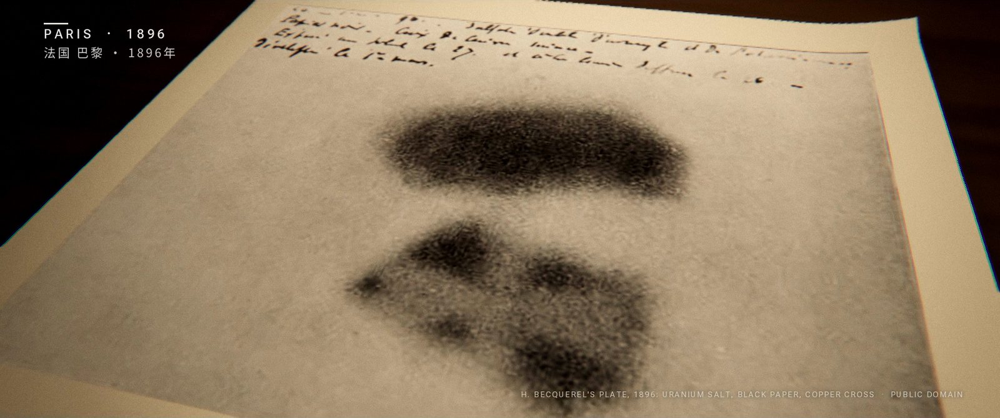

历史段落把生成的三维镜头与真实史料结合在一起：贝克勒尔的底片、居里夫妇在实验室、卢瑟福1911年论文的原始页面、"三位一体"火球、考尔德霍尔核电站、切尔诺贝利4号机组、普里皮亚季摩天轮、福岛的卫星图像，以及ITER的航拍照片。每张历史图片出现时，画面中都会注明出处。

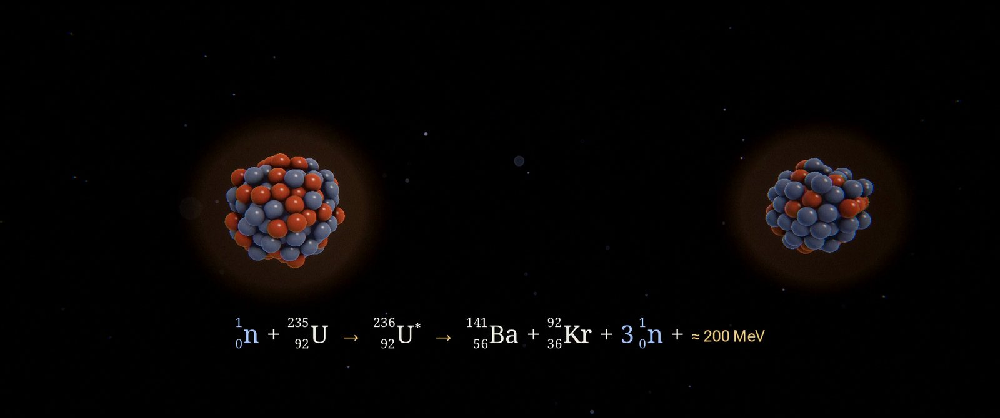

片中以方程式形式展示了三个核反应，逐项出现，质量数和电荷数都经过配平核对：查德威克发现中子的反应、铀核裂变，以及氘氚聚变。

### 面向高中生的三段讲解

三段讲解让影片慢下来，不只说"发生了什么"，还解释"为什么"。

**天然放射性。** 讲完贝克勒尔和居里夫妇之后，画面展示不稳定原子核放出的三种射线：一张纸就能挡住α射线，铝片能挡住β射线，γ射线则需要厚铅板或混凝土来削弱。接着，128个模拟原子核随机衰变：每一次衰变既是画面上的一次闪光，也是配乐里的一声盖革计数器"咔嗒"声，而原子核数目每过一个半衰期就减少一半：

$$N(t) = N_0 \left(\tfrac{1}{2}\right)^{t/T_{1/2}}$$

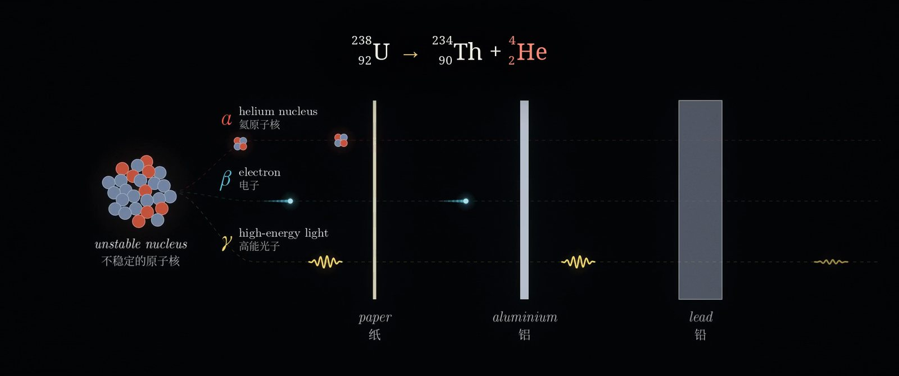

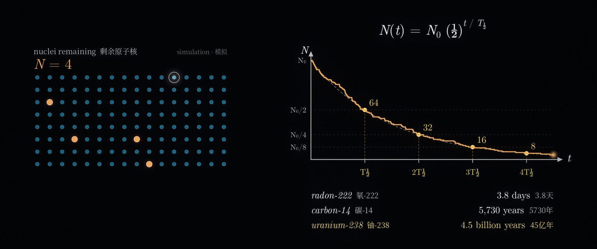

**反应堆如何保持可控。** 我们跟踪一个中子。它的命运是一连串的概率：可能使铀-235裂变，可能被吸收，可能被控制棒捕获，也可能逃出堆芯。下一步只取决于它当前所处的状态，这正是马尔可夫链。画面中的"骰子条"随着节拍决定每一步的去向。每次裂变平均放出约2.4个中子，于是每个中子平均产生的新中子数为

$$k = \nu \, P_{\text{裂变}} \approx 2.4 \times 0.42 \approx 1.0$$

$k < 1$时反应会逐渐熄灭，$k > 1$时反应会不断增长。用硼或镉制成的控制棒插得越深，中子被吸收的概率越大，$k$就越小。这一段最后讲到让反应堆可以被控制的关键细节：铀-235裂变产生的中子中，约有0.65%由裂变碎片延迟数秒才放出。片中的各项概率已标明为示意数值；ν≈2.4和0.65%则是铀-235的真实数据。

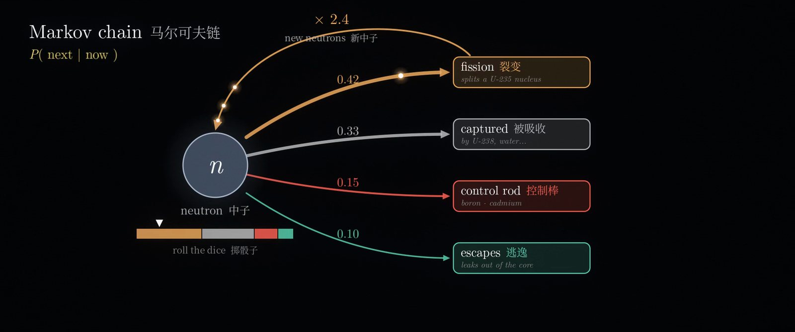

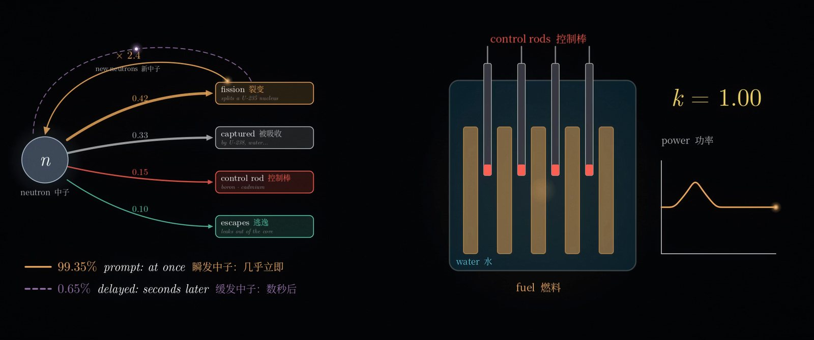

**托卡马克如何约束等离子体。** 没有任何材料能直接接触1.5亿摄氏度的等离子体，托卡马克于是用磁场来"托住"它。在均匀磁场中，带电粒子在洛伦兹力$\mathbf{F} = q\,\mathbf{v}\times\mathbf{B}$的作用下绕着磁感线螺旋前进。把磁场弯成圆环后，圆环内侧的磁场更强（$B \propto 1/R$），离子和电子会朝相反方向漂移，最终撞上器壁。让电流流过等离子体，就会产生第二个磁场，把磁感线扭成螺旋。粒子沿着螺旋运动时，在中平面上方和下方停留的时间相同，漂移就相互抵消了。截面小图中，粒子导向中心的运动满足

$$\frac{d\mathbf{r}}{dt} = \Omega\,\hat{\mathbf{z}}\times\mathbf{r} - v_d\,\hat{\mathbf{y}}$$

它的解是一个闭合、略微偏移的圆，而不是一条撞向器壁的轨迹。

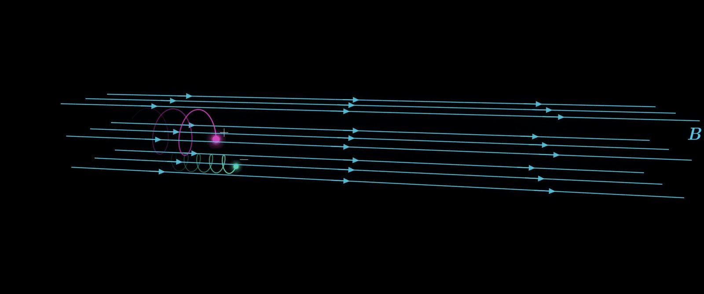

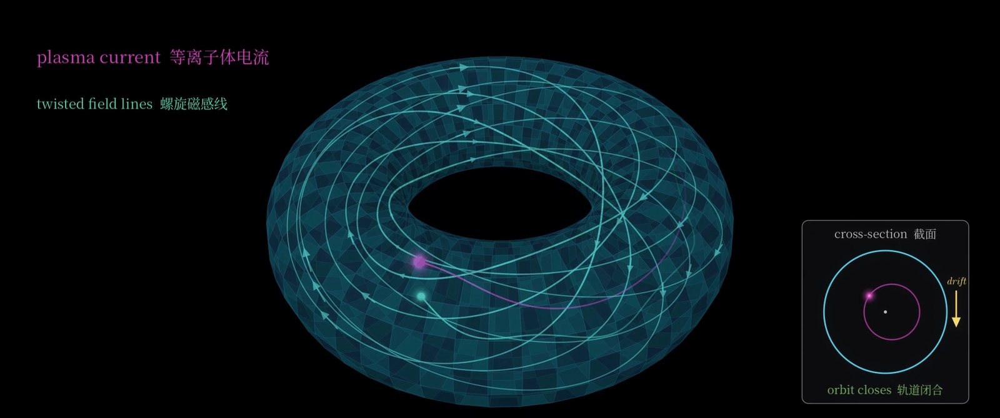

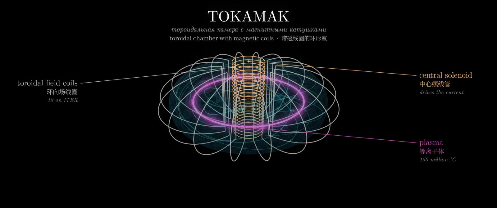

## 制作过程

### 以小节而不是秒来安排时间

整部影片建立在一个文件`timeline.py`之上。配乐速度为每分钟80拍、4/4拍，一小节正好3秒；所有场景、剪辑点、字幕、画面上的时间地点标注和同步点都以"第几小节第几拍"来定义。渲染器、配乐程序和字幕生成器读取的是同一个文件，因此音画同步是"构造出来的"：切尔诺贝利的爆炸、聚变的闪光和核裂变的瞬间都落在强拍上，因为它们本来就被定义在强拍上。

这个设计也让影片很容易扩展。三段讲解是在一个已完成的四分钟版本之后才加入的。每段讲解都是插入的12小节，后面的内容整体后移整数个小节。因此只需渲染新增部分及其转场（2,772帧），再与原有画面拼接，而不必重新渲染全部8,352帧。

### 由着色器生成的画面

三维镜头由GLSL片段着色器光线步进渲染，运行在Mesa的CPU渲染器（llvmpipe）上的无界面OpenGL环境中：金箔、原子核、链式反应的级联、芝加哥一号堆、广岛的怀表、漂流的纸灯笼。所有场景都经过同一条后期处理流程：泛光、变形镜头光晕、光晕溢色、景深、电影感色调曲线、调色、胶片颗粒，以及2.39:1的遮幅。正是这条共用的流程，让26个风格各异的场景看起来属于同一部电影。

一帧画面通常需要1.7到3秒。影片以4秒为一段渲染成近乎无损的中间文件，崩溃或会话中断只会损失一段，而不会让整次渲染前功尽弃。

### 真实的论文与照片

历史资料来自维基共享资源和互联网档案馆，每个文件都核对了授权协议。照片配以缓慢的镜头运动和胶片质感处理；论文则摆在台灯照亮的书桌上，荧光笔划过关键句子。卢瑟福1911年的论文页面是真实扫描件；1932年和1939年的论文仍受版权保护，因此以重新排版的形式呈现经过核实的原句，并在画面上注明"复原排版"。

### 3Blue1Brown风格的讲解动画

讲解部分需要另一种视觉语言：干净的矢量图形、LaTeX风格的数学公式，以及深色背景上流畅的三维动画。它们由专为本片编写的一个小模块绘制：cairo负责图形，Pillow负责文字（包括中文），再加上一个从后往前依次绘制曲线和曲面的三维相机。配色借用了Manim的默认色板，公式使用Computer Modern字体。这些图形同样经过与全片一致的后期流程，只是采用"干净"的调色参数，因此能与电影化的场景之间无缝地淡入淡出。

### 从零合成的配乐

配乐中没有使用任何采样。所有乐器都用Python合成：毡锤钢琴、弦乐、拨弦、钢片琴、钟声、合唱、太鼓、低频冲击、渐强音效和盖革计数器的咔嗒声。混音使用合成的混响，母带处理到−16 LUFS。画面事件和音乐事件来自同一份数据，所以你听到的每一声咔嗒，都对应画面上的一次闪光。在讲解段落里，中子的每种命运都有自己的音色；$k = 0.9$、$1.1$、$1.0$三条曲线分别对应下行、上行和重复的音符；粒子每绕磁感线一圈，正好是一拍。

### 每条史实都经过核对

画面中出现的每个日期、数字和引语，都列在一份附有来源的史实清单里。这一步确实发现了错误："放射性"一词出自居里夫妇的联名论文，所以字幕写的是两人共同命名；托卡马克讲解的初稿把漂移方向画反了，在正式渲染前已经改正。

### 自动化质量检查

那些真正可能让我们难堪的问题，大多是脚本而不是肉眼发现的：

- **音画同步。** 脚本测量每个预设事件处的声音起点和画面变化，发现有一次闪光晚了两帧（83毫秒）；修正后，每个重音都精确落在对应的帧上。
- **画面构图。** 有三段历史照片的镜头运动短暂露出了照片边缘外的黑边。现在由脚本检查每一段镜头运动都不会超出照片范围。
- **色彩。** 中间文件使用了ffmpeg默认的BT.601色彩矩阵，而播放器会把高清视频当作BT.709来解码。最终文件已转换并正确标记色彩空间。
- **字幕。** 逐条检查每句字幕出现时的画面，确认不与画面文字重叠，并分别验证带字幕版本和无字幕版本。
- **拼接处。** 在新画面与复用画面相接的地方，脚本比较相邻帧的差异，发现了一处依赖绝对时间的等离子体闪烁跳变。

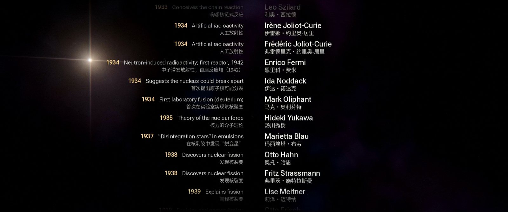

## 数据一览

| | |
|---|---|
| 时长 | 5分48秒（24帧/秒，共8,352帧） |
| 场景 | 23个历史场景与3段讲解 |
| 字幕 | 64条，中英双语 |
| 片尾先驱 | 58位 |
| 渲染速度 | 在手机CPU上，电影化画面每帧1.7–3秒，讲解画面每帧0.5–1秒 |
| 版本 | 3分15秒 → 4分钟（加入论文、方程式与片尾名单）→ 5分48秒（加入讲解） |

## 经验总结

- **先确定范围。** 几乎所有返工，都来自某个版本完成后才追加的功能。
- **让时间变成音乐。** 以小节为单位的时间轴让同步自动成立，也让后期插入的成本很低。
- **先审静帧，再做动画。** 每个场景一张静帧的分镜，是调整方向最便宜的时机。
- **相信测量，而不是印象。** 每一项自动检查都找到了一个匆匆一看时毫无破绽的真实缺陷。

## 制作说明与授权

配乐、动画、字体排印与视觉效果均为本片制作。历史图片的授权为公有领域、英国开放政府许可（OGL）、CC BY或CC BY-SA。由于四张CC BY-SA照片（奥布宁斯克、切尔诺贝利、普里皮亚季、福岛）经过修改后出现在片中，本片以CC BY-SA 4.0协议发布。讲解动画受3Blue1Brown启发，与3Blue1Brown无关联，也非其制作。
